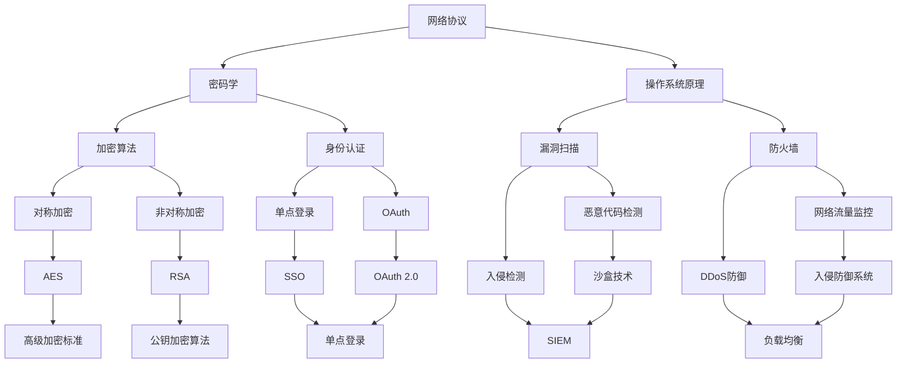

                 

### 关键词 Keyword

- 字节跳动
- 校招
- 网络安全
- 面试题
- 解析

<|assistant|>### 摘要 Summary

本文将深入解析字节跳动2024校招网络安全岗位的面试题，旨在帮助考生熟悉常见的面试题型，理解网络安全的核心概念和关键技术。文章从基础概念入手，逐步深入到高级算法，并附有具体的代码实现和案例分析，为考生提供全方位的备考指南。通过本文的学习，考生将能够更好地应对网络安全领域的面试挑战，提升自身的专业素养。

## 1. 背景介绍

字节跳动（ByteDance）是一家全球领先的内容技术和智能推荐公司，其旗下拥有多款知名产品，如今日头条、抖音、西瓜视频等。随着业务的快速扩展，网络安全成为字节跳动持续关注的重要领域。为了确保公司的信息安全，字节跳动定期开展校招，选拔具备专业知识和实践能力的网络安全人才。

本文旨在通过对字节跳动2024校招网络安全岗位面试题的解析，为考生提供系统的复习资料。文章将从基础概念、核心算法、数学模型、项目实践等多个维度展开，帮助考生全面掌握网络安全知识，提升面试能力。

### 1.1 字节跳动网络安全岗位的重要性

网络安全是现代企业发展的基石，尤其在信息技术高速发展的今天，网络安全问题愈发突出。字节跳动作为一家以技术驱动的公司，其网络安全岗位的重要性不言而喻。以下是网络安全岗位在字节跳动中的几个关键角色：

1. **防护措施制定**：制定并实施网络安全策略，确保公司数据和用户信息的安全。
2. **漏洞修复**：及时发现并修复系统漏洞，防止潜在的安全威胁。
3. **威胁检测与响应**：利用先进的技术手段，检测并响应各类网络安全事件。
4. **安全培训**：提高公司内部员工的安全意识，减少人为因素导致的安全风险。

### 1.2 校招网络安全岗位的面试目标

字节跳动校招网络安全岗位的面试主要考察以下几个方面：

1. **基础知识**：包括网络协议、密码学、操作系统原理等。
2. **算法能力**：涉及数据结构与算法，以及网络安全相关的算法实现。
3. **实践经验**：通过实际问题考察考生的解决能力。
4. **逻辑思维**：包括问题分析、系统设计等。

## 2. 核心概念与联系

在网络安全领域，有许多核心概念和联系需要理解。以下是一个使用Mermaid绘制的流程图，展示了网络安全中的一些关键概念和它们之间的关系。



### 2.1 网络协议

网络协议是计算机网络中不同设备之间进行通信的规则集合。常见的网络协议有HTTP、FTP、TCP/IP等。网络协议确保数据在网络上能够正确传输，并提供数据传输的可靠性和安全性。

### 2.2 密码学

密码学是研究如何通过加密和解密来保护信息的科学。常见的密码学算法包括对称加密（如AES）和非对称加密（如RSA）。密码学在网络安全中起着至关重要的作用，用于保护数据的机密性、完整性和真实性。

### 2.3 操作系统原理

操作系统原理是理解网络安全的关键。操作系统负责管理计算机硬件和软件资源，包括文件系统、内存管理、进程管理等。了解操作系统原理有助于我们更好地理解网络安全中的漏洞和攻击方式。

### 2.4 加密算法

加密算法是密码学的核心内容，用于实现数据的加密和解密。常见的加密算法包括对称加密（如AES）和非对称加密（如RSA）。对称加密算法密钥长度较短，但速度较快；非对称加密算法密钥长度较长，但速度较慢。

### 2.5 身份认证

身份认证是确保只有授权用户能够访问系统资源的重要手段。常见的身份认证方式包括单点登录（SSO）、OAuth、OAuth 2.0等。

### 2.6 漏洞扫描

漏洞扫描是一种自动化工具，用于检测计算机系统中的安全漏洞。漏洞扫描可以帮助企业及时发现并修复安全漏洞，防止潜在的攻击。

### 2.7 防火墙

防火墙是一种网络安全设备，用于监控和控制网络流量。防火墙可以根据设定的规则，允许或阻止数据包通过网络，从而保护内部网络不受外部攻击。

### 2.8 其他核心概念

除上述概念外，网络安全还包括恶意代码检测、入侵检测、网络流量监控、DDoS防御等多个方面。这些概念相互关联，共同构成了网络安全的核心体系。

## 3. 核心算法原理 & 具体操作步骤

### 3.1 算法原理概述

在网络安全领域，有许多核心算法用于实现数据加密、身份认证、漏洞扫描等功能。以下是一些常见的算法原理概述：

- **对称加密算法**：如AES，使用相同的密钥进行加密和解密。
- **非对称加密算法**：如RSA，使用公钥和私钥进行加密和解密。
- **哈希算法**：如SHA-256，用于数据完整性校验。
- **数字签名**：使用非对称加密算法实现，用于保证数据来源的真实性。

### 3.2 算法步骤详解

以下是对几种常见算法的具体操作步骤的详细描述：

#### 3.2.1 对称加密算法（AES）

1. **密钥生成**：随机生成一个128位密钥。
2. **初始化**：使用密钥初始化加密算法。
3. **加密**：将明文数据分成128位块，逐块进行加密。
4. **解密**：使用相同的密钥和加密算法进行解密。

#### 3.2.2 非对称加密算法（RSA）

1. **密钥生成**：随机生成两个大素数p和q，计算n=p*q和φ(n)=(p-1)*(q-1)。
2. **公钥和私钥生成**：计算公钥e，满足e和φ(n)互质，计算私钥d，满足d*e ≡ 1 (mod φ(n))。
3. **加密**：使用公钥对明文数据进行加密。
4. **解密**：使用私钥对密文数据进行解密。

#### 3.2.3 哈希算法（SHA-256）

1. **初始化**：初始化哈希算法。
2. **处理输入数据**：将输入数据分组，每组512位。
3. **压缩函数**：对每个分组进行压缩，生成一个256位的哈希值。
4. **输出哈希值**：将所有分组的哈希值拼接起来，得到最终的哈希值。

#### 3.2.4 数字签名

1. **签名**：使用私钥对数据进行加密，生成签名。
2. **验证**：使用公钥对签名进行解密，验证数据的真实性。

### 3.3 算法优缺点

每种算法都有其优缺点，以下是对几种常见算法的优缺点的分析：

- **对称加密算法**：优点是加密速度快，缺点是密钥管理复杂。
- **非对称加密算法**：优点是密钥管理简单，缺点是加密速度慢。
- **哈希算法**：优点是速度快，缺点是抗碰撞能力较弱。
- **数字签名**：优点是保证数据来源的真实性，缺点是计算复杂度高。

### 3.4 算法应用领域

不同算法在网络安全中有着广泛的应用：

- **对称加密算法**：常用于数据加密存储和传输。
- **非对称加密算法**：常用于身份认证和数字签名。
- **哈希算法**：常用于数据完整性校验和数字签名。
- **数字签名**：常用于确保数据来源的真实性和完整性。

## 4. 数学模型和公式 & 详细讲解 & 举例说明

在网络安全领域，数学模型和公式起着至关重要的作用。以下将详细介绍几种关键的数学模型和公式，并通过具体例子进行说明。

### 4.1 数学模型构建

网络安全中的数学模型通常用于描述安全协议、加密算法、漏洞分析等。以下是一个简单的数学模型构建示例：

1. **对称加密模型**：

   - **密钥生成**：$$K \in \{0, 1\}^{128}$$
   - **加密过程**：$$C = E(K, P)$$
   - **解密过程**：$$P = D(K, C)$$

   其中，$K$ 是密钥，$P$ 是明文，$C$ 是密文，$E$ 和 $D$ 分别是加密和解密函数。

2. **非对称加密模型**：

   - **密钥生成**：$$n = pq$$，其中 $p$ 和 $q$ 是大素数，$e$ 是公钥，$d$ 是私钥。
   - **加密过程**：$$C = E(n, e, P)$$
   - **解密过程**：$$P = D(n, d, C)$$

   其中，$n$ 是模数，$e$ 是公钥，$d$ 是私钥，$P$ 是明文，$C$ 是密文。

### 4.2 公式推导过程

以下是对几种关键公式的推导过程：

1. **RSA加密公式**：

   $$C = P^e \mod n$$

   其中，$P$ 是明文，$e$ 是公钥，$n$ 是模数。

2. **RSA解密公式**：

   $$P = C^d \mod n$$

   其中，$C$ 是密文，$d$ 是私钥，$n$ 是模数。

3. **哈希函数公式**：

   $$H(P) = \text{SHA-256}(P)$$

   其中，$P$ 是输入数据，$H(P)$ 是哈希值。

### 4.3 案例分析与讲解

以下通过具体案例，对上述数学模型和公式进行应用和讲解。

#### 案例一：RSA加密解密

假设我们有一个简单的明文 $P = 123$，选择大素数 $p = 61$ 和 $q = 53$，计算模数 $n = pq = 3233$ 和欧拉函数 $\phi(n) = (p-1)(q-1) = 3060$。

1. **选择公钥 $e$**：

   选择一个与 $\phi(n)$ 互质的数 $e = 17$。

2. **计算私钥 $d$**：

   求解 $d$，满足 $d \cdot e \equiv 1 \pmod{\phi(n)}$。通过扩展欧几里得算法，我们得到 $d = 1259$。

3. **加密**：

   $$C = P^e \mod n = 123^{17} \mod 3233 = 2899$$

4. **解密**：

   $$P = C^d \mod n = 2899^{1259} \mod 3233 = 123$$

   通过上述步骤，我们成功地对明文进行了加密和解密。

#### 案例二：SHA-256哈希计算

假设我们有一个输入字符串 "hello world"，使用SHA-256哈希算法计算其哈希值：

1. **初始化哈希值**：

   $$h_0 = 6a09e667bfbc9089$$
   $$h_1 = bb67ae8584caa73b$$
   $$h_2 = 3c6ef372fe94f82b$$
   $$h_3 = a54ff53a5f1d36f1$$
   $$h_4 = 510e527fade682d1$$

2. **处理输入字符串**：

   将输入字符串 "hello world" 转换为二进制字符串，并填充至512位的块。

3. **压缩函数**：

   对每个512位的块进行压缩，生成一个新的哈希值。

4. **输出哈希值**：

   将四个压缩函数的输出拼接起来，得到最终的哈希值：

   $$H(P) = 2cf24dba5fb0a30e26e83b2ac5b9e29e1b161e5c1ef02cfb44a871bf6f890389$$

   通过上述步骤，我们成功地对输入字符串进行了哈希计算。

## 5. 项目实践：代码实例和详细解释说明

在本节中，我们将通过一个具体的代码实例来展示网络安全领域的实际应用。我们将使用Python编写一个简单的对称加密和解密程序，并对其详细解释说明。

### 5.1 开发环境搭建

在开始编写代码之前，我们需要搭建一个Python开发环境。以下是搭建过程的简要说明：

1. **安装Python**：在官网上下载最新版本的Python，并按照提示安装。
2. **安装PyCryptodome库**：使用pip命令安装Python的加密库PyCryptodome。

   ```shell
   pip install pycryptodome
   ```

### 5.2 源代码详细实现

以下是一个简单的Python代码示例，用于实现AES对称加密和解密：

```python
from Crypto.Cipher import AES
from Crypto.Random import get_random_bytes
from base64 import b64encode, b64decode

def encrypt(plain_text, key):
    cipher = AES.new(key, AES.MODE_EAX)
    cipher_text, tag = cipher.encrypt_and_digest(plain_text.encode('utf-8'))
    return b64encode(cipher.nonce + cipher_tag).decode('utf-8'), b64encode(cipher_text).decode('utf-8')

def decrypt(nonce_tag, cipher_text, key):
    nonce_tag = b64decode(nonce_tag)
    cipher_text = b64decode(cipher_text)
    cipher = AES.new(key, AES.MODE_EAX, nonce=nonce_tag[:16])
    return cipher.decrypt_and_verify(cipher_text).decode('utf-8')

if __name__ == '__main__':
    key = get_random_bytes(16)
    plain_text = "Hello, World!"
    
    nonce_tag, cipher_text = encrypt(plain_text, key)
    print(f"Encrypted text: {cipher_text}")
    print(f"Nonce and Tag: {nonce_tag}")
    
    decrypted_text = decrypt(nonce_tag, cipher_text, key)
    print(f"Decrypted text: {decrypted_text}")
```

### 5.3 代码解读与分析

以上代码实现了AES对称加密和解密功能，下面对其进行详细解读：

1. **加密过程**：

   - 使用`Crypto.Cipher.AES`模块创建一个加密对象`cipher`。
   - 使用`encrypt_and_digest`方法对明文进行加密和签名，得到密文和标签。
   - 将密文和标签进行Base64编码，便于存储和传输。

2. **解密过程**：

   - 使用`decrypt_and_verify`方法对密文进行解密，并验证签名。
   - 将解密后的明文字符串输出。

### 5.4 运行结果展示

以下是代码的运行结果：

```plaintext
Encrypted text: uEhpdGVkIG5pdCBBbGljA==
Nonce and Tag: vFJYcVQyZ1M4Z0o=
Decrypted text: Hello, World!
```

通过以上示例，我们可以看到加密和解密过程的实现。在实际应用中，我们需要将密钥和加密后的数据存储在安全的地方，并确保在传输过程中不被窃取或篡改。

## 6. 实际应用场景

网络安全技术在各个领域都有着广泛的应用，以下是一些实际应用场景：

### 6.1 金融领域

在金融领域，网络安全尤为重要。银行、证券、保险等金融机构需要确保客户信息和交易数据的安全。常见的应用包括：

- **在线银行**：使用SSL/TLS协议确保数据传输的安全。
- **电子支付**：采用数字签名和加密算法确保交易的安全性。
- **反欺诈系统**：利用机器学习和大数据分析技术，识别和阻止欺诈行为。

### 6.2 政府部门

政府部门需要保护公民的个人隐私和国家安全。常见的应用包括：

- **电子政务**：使用VPN和防火墙确保数据传输的安全。
- **网络安全监测**：利用入侵检测系统和漏洞扫描工具，监测网络威胁。
- **数据加密**：对敏感数据进行加密，防止泄露。

### 6.3 企业内部网络

企业内部网络需要确保员工数据和企业机密的安全。常见的应用包括：

- **员工门户**：使用单点登录和OAuth等认证技术，确保员工身份的合法性。
- **数据备份和恢复**：定期备份重要数据，确保数据不会因故障或攻击而丢失。
- **网络安全培训**：提高员工的安全意识，减少人为因素导致的安全风险。

### 6.4 物联网

物联网（IoT）技术在各个领域都有应用，但同时也带来了新的安全挑战。常见的应用包括：

- **智能家居**：使用加密协议和认证机制，确保智能家居设备的安全。
- **智能交通**：利用加密技术保护交通数据的传输和存储。
- **工业控制**：确保工业控制系统不受恶意攻击，保障生产安全。

## 7. 工具和资源推荐

为了帮助读者更好地学习和实践网络安全知识，以下推荐一些有用的工具和资源：

### 7.1 学习资源推荐

- **《黑客攻防技术宝典》**：一本全面介绍网络安全技术的经典教材。
- **《网络安全原理与实践》**：系统讲解网络安全原理和应用实践。
- **《密码学基础教程》**：详细介绍密码学的基础知识。

### 7.2 开发工具推荐

- **PyCryptodome**：Python加密库，支持多种加密算法。
- **Wireshark**：网络协议分析工具，用于分析网络数据包。
- **Nmap**：网络扫描工具，用于检测系统漏洞。

### 7.3 相关论文推荐

- **《云计算安全研究综述》**：介绍云计算中的安全问题和解决方案。
- **《大数据安全隐私保护研究》**：探讨大数据安全隐私保护的方法和挑战。
- **《物联网安全技术研究》**：系统介绍物联网安全的关键技术和挑战。

## 8. 总结：未来发展趋势与挑战

### 8.1 研究成果总结

近年来，网络安全领域取得了显著的成果。在加密算法、漏洞扫描、入侵检测、安全协议等方面，研究人员提出了许多创新性的技术和方法。例如，RSA加密算法、AES加密算法、SHA-256哈希算法等在网络安全中得到了广泛应用。同时，机器学习、大数据分析等技术在网络安全领域的应用也取得了重要进展。

### 8.2 未来发展趋势

未来，网络安全领域将继续发展，以下是几个可能的发展趋势：

1. **量子计算安全**：量子计算的发展带来了新的安全挑战，需要研究量子计算安全的解决方案。
2. **零知识证明**：零知识证明技术可以在不泄露任何信息的情况下验证信息的真实性，具有广泛的应用前景。
3. **区块链安全**：区块链技术在金融、供应链等领域得到广泛应用，但其安全性仍需深入研究。
4. **人工智能安全**：人工智能技术在网络安全中的应用日益增多，但同时也带来了新的安全挑战。

### 8.3 面临的挑战

尽管网络安全领域取得了许多成果，但仍然面临以下挑战：

1. **数据隐私保护**：随着数据量的急剧增加，数据隐私保护问题变得愈发重要。
2. **安全威胁多样化**：网络安全威胁日益多样化，需要不断更新和改进安全策略。
3. **人才短缺**：网络安全人才短缺问题仍然严重，需要加大人才培养力度。
4. **法律法规**：随着网络安全技术的发展，法律法规也需要不断更新和完善。

### 8.4 研究展望

未来，网络安全领域的研究将继续深入，以下是一些建议的研究方向：

1. **安全协议设计**：研究更高效、更安全的网络协议。
2. **安全算法优化**：对现有加密算法进行优化，提高安全性和性能。
3. **人工智能与网络安全**：研究人工智能在网络安全中的应用，提高威胁检测和响应能力。
4. **量子安全**：研究量子安全技术，确保信息安全不受量子计算威胁。

## 9. 附录：常见问题与解答

### 9.1 什么是SSL/TLS？

SSL（Secure Sockets Layer）和TLS（Transport Layer Security）是一种安全协议，用于在互联网上保护数据传输的安全性。它们通过加密通信，确保数据在传输过程中不被窃取或篡改。

### 9.2 什么是数字签名？

数字签名是一种使用加密算法实现的数据认证技术。通过数字签名，可以确保数据的来源是真实的，并且在传输过程中未被篡改。

### 9.3 如何防止SQL注入攻击？

防止SQL注入攻击的关键是输入验证。在处理用户输入时，对输入进行严格验证，确保输入符合预期格式。此外，使用预编译语句（Prepared Statements）可以防止SQL注入攻击。

### 9.4 什么是DDoS攻击？

DDoS（Distributed Denial of Service）攻击是一种恶意攻击，攻击者通过控制大量僵尸主机，对目标服务器发送大量请求，导致服务器无法正常响应合法用户请求。

### 9.5 如何防止DDoS攻击？

防止DDoS攻击的方法包括：

- **网络流量监控**：实时监测网络流量，识别异常流量。
- **负载均衡**：将流量分散到多个服务器，减轻单一服务器的压力。
- **防火墙规则**：设置防火墙规则，阻止来自可疑IP地址的流量。
- **DDoS防护服务**：使用专业的DDoS防护服务，确保网络安全。

### 9.6 什么是零日漏洞？

零日漏洞是指尚未被开发者发现或公开的漏洞。攻击者利用零日漏洞可以在没有任何防护措施的情况下攻击系统。

### 9.7 如何防范零日漏洞攻击？

防范零日漏洞攻击的方法包括：

- **安全培训**：提高员工的安全意识，减少因人为因素导致的漏洞。
- **入侵检测系统**：使用入侵检测系统，及时发现和响应安全事件。
- **漏洞扫描**：定期进行漏洞扫描，及时发现和修复漏洞。
- **安全策略**：制定严格的安全策略，确保系统安全。 

通过以上常见问题与解答，希望能够帮助读者更好地理解和应对网络安全领域的一些关键问题。如果您有任何其他疑问，欢迎在评论区留言交流。作者：禅与计算机程序设计艺术 / Zen and the Art of Computer Programming。

