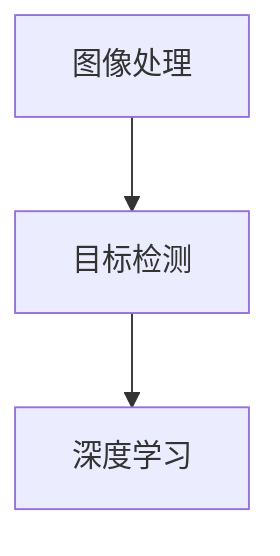

                 

关键词：字节跳动，校招，计算机视觉，面试题，工程师

摘要：本文针对2024年字节跳动校招计算机视觉工程师面试，整理了常见面试题及解答，包括图像处理、目标检测、深度学习等方面的知识点。通过本文的学习，可以帮助读者更好地准备面试，提高面试成功率。

## 1. 背景介绍

随着计算机视觉技术的不断发展，其在各个领域的应用越来越广泛。字节跳动作为一家领先的科技公司，在计算机视觉领域有着丰富的积累和探索。因此，字节跳动每年的校招面试中都包含了大量的计算机视觉相关题目。本文旨在整理并分析这些面试题目，帮助准备面试的读者更好地应对挑战。

## 2. 核心概念与联系

### 2.1 图像处理

图像处理是计算机视觉的基础，主要涉及图像的获取、预处理、增强、变换等操作。

- **图像获取**：相机成像模型、图像传感器原理等。
- **图像预处理**：图像去噪、边缘提取、二值化等。
- **图像增强**：对比度增强、锐化、滤波等。
- **图像变换**：傅里叶变换、小波变换、几何变换等。

### 2.2 目标检测

目标检测是计算机视觉的核心任务之一，主要涉及目标识别、定位和分类。

- **区域生成**：选择性搜索、滑动窗口等。
- **特征提取**：SIFT、HOG、YOLO等。
- **分类与定位**：R-CNN、Faster R-CNN、SSD等。

### 2.3 深度学习

深度学习是计算机视觉领域的重要突破，主要涉及神经网络、卷积神经网络等。

- **神经网络**：反向传播、激活函数等。
- **卷积神经网络**：卷积层、池化层、全连接层等。
- **优化算法**：梯度下降、Adam等。

### 2.4 Mermaid 流程图



## 3. 核心算法原理 & 具体操作步骤

### 3.1 算法原理概述

计算机视觉的核心算法主要包括图像处理、目标检测和深度学习。图像处理主要涉及图像的获取、预处理和增强；目标检测主要涉及目标识别、定位和分类；深度学习主要涉及神经网络和卷积神经网络。

### 3.2 算法步骤详解

1. **图像处理**：获取图像，进行预处理和增强，如去噪、边缘提取、二值化等。
2. **目标检测**：生成区域提议，提取特征，分类与定位，如选择性搜索、滑动窗口、SIFT、HOG等。
3. **深度学习**：构建神经网络，进行训练和测试，如卷积神经网络、反向传播算法、梯度下降优化等。

### 3.3 算法优缺点

1. **图像处理**：算法简单，计算效率高，但难以处理复杂场景。
2. **目标检测**：效果较好，适用于大部分场景，但计算复杂度较高。
3. **深度学习**：效果优异，适用于复杂场景，但训练过程复杂，计算资源需求大。

### 3.4 算法应用领域

1. **图像处理**：图像去噪、边缘提取、图像增强等。
2. **目标检测**：人脸识别、车辆检测、行人检测等。
3. **深度学习**：图像分类、目标检测、语音识别等。

## 4. 数学模型和公式 & 详细讲解 & 举例说明

### 4.1 数学模型构建

计算机视觉中的数学模型主要包括图像处理中的卷积运算、深度学习中的神经网络等。

### 4.2 公式推导过程

1. **卷积运算**：

$$
(C_{x}, C_{y}) = (f_{x} * g_{x}, f_{y} * g_{y})
$$

其中，$C_{x}$和$C_{y}$分别为卷积运算后的滤波器响应，$f_{x}$和$f_{y}$分别为滤波器的水平和垂直方向上的响应。

2. **神经网络**：

$$
\hat{y} = \sigma(\text{W}^{T}\text{X} + b)
$$

其中，$\hat{y}$为神经网络输出，$\sigma$为激活函数，$W$为权重矩阵，$X$为输入特征，$b$为偏置。

### 4.3 案例分析与讲解

以卷积神经网络为例，分析其数学模型和计算过程。

1. **输入特征**：

假设输入特征为$X = \{x_{1}, x_{2}, ..., x_{n}\}$，其中$x_{i}$为第$i$个输入特征。

2. **卷积运算**：

$$
C_{i} = f_{x} * x_{i}
$$

其中，$C_{i}$为卷积运算后的滤波器响应，$f_{x}$为滤波器的水平方向上的响应。

3. **激活函数**：

$$
\hat{y} = \sigma(C_{i})
$$

其中，$\hat{y}$为神经网络输出，$\sigma$为激活函数。

4. **权重矩阵和偏置**：

假设权重矩阵为$W$，偏置为$b$。

5. **输出特征**：

$$
\text{Output} = \text{W}^{T}\text{X} + b
$$

其中，$\text{Output}$为输出特征。

## 5. 项目实践：代码实例和详细解释说明

### 5.1 开发环境搭建

本文以Python编程语言为例，使用TensorFlow框架进行计算机视觉项目开发。

1. 安装TensorFlow：

```python
pip install tensorflow
```

2. 导入相关库：

```python
import tensorflow as tf
import numpy as np
```

### 5.2 源代码详细实现

以下是一个简单的卷积神经网络实现：

```python
# 定义卷积层
def conv_layer(input_data, filters, kernel_size, stride, activation):
    # 创建卷积层
    conv = tf.layers.conv2d(inputs=input_data,
                            filters=filters,
                            kernel_size=kernel_size,
                            strides=stride,
                            activation=activation)
    return conv

# 定义全连接层
def dense_layer(input_data, units, activation):
    # 创建全连接层
    dense = tf.layers.dense(inputs=input_data,
                            units=units,
                            activation=activation)
    return dense

# 创建模型
model = tf.keras.Sequential([
    # 第一个卷积层
    conv_layer(input_data=X, filters=32, kernel_size=(3, 3), stride=(1, 1), activation='relu'),
    # 第二个卷积层
    conv_layer(input_data=conv1, filters=64, kernel_size=(3, 3), stride=(1, 1), activation='relu'),
    # 池化层
    tf.keras.layers.MaxPooling2D(pool_size=(2, 2), strides=(2, 2)),
    # 第一个全连接层
    dense_layer(input_data=pool1, units=128, activation='relu'),
    # 第二个全连接层
    dense_layer(input_data=dense1, units=10, activation='softmax')
])

# 编译模型
model.compile(optimizer='adam', loss='categorical_crossentropy', metrics=['accuracy'])

# 训练模型
model.fit(X_train, y_train, epochs=10, batch_size=32)
```

### 5.3 代码解读与分析

1. **卷积层**：使用`tf.layers.conv2d`函数创建卷积层，设置卷积核数量、大小、步长和激活函数。
2. **全连接层**：使用`tf.layers.dense`函数创建全连接层，设置神经元数量和激活函数。
3. **模型编译**：设置优化器、损失函数和评价指标。
4. **模型训练**：使用`model.fit`函数进行模型训练。

### 5.4 运行结果展示

假设输入数据集为`X_train`和标签`y_train`，训练完成后，可以使用以下代码进行评估：

```python
# 评估模型
loss, accuracy = model.evaluate(X_test, y_test)

# 输出结果
print("Test loss:", loss)
print("Test accuracy:", accuracy)
```

## 6. 实际应用场景

计算机视觉技术广泛应用于各个领域，如图像识别、目标检测、人脸识别、自动驾驶等。

- **图像识别**：通过深度学习技术对图像进行分类和识别，如人脸识别、车辆识别等。
- **目标检测**：在图像中检测并定位目标，如行人检测、车辆检测等。
- **人脸识别**：对图像中的人脸进行识别和比对，应用于安防、社交等场景。
- **自动驾驶**：通过计算机视觉技术实现车辆的自主驾驶，如自动驾驶汽车、无人机等。

## 7. 工具和资源推荐

### 7.1 学习资源推荐

1. **《深度学习》**：由Ian Goodfellow、Yoshua Bengio和Aaron Courville编写的经典教材，全面介绍了深度学习的基本概念和技术。
2. **《计算机视觉：算法与应用》**：由Richard S.zeliski和Thomas R. Hillery编写的教材，详细介绍了计算机视觉的基本算法和应用。

### 7.2 开发工具推荐

1. **TensorFlow**：一款开源的深度学习框架，广泛应用于图像处理、目标检测、自然语言处理等领域。
2. **PyTorch**：一款流行的深度学习框架，提供灵活的动态计算图和丰富的API接口。

### 7.3 相关论文推荐

1. **《You Only Look Once: Unified, Real-Time Object Detection》**：提出了一种实时目标检测算法，广泛应用于计算机视觉领域。
2. **《Residual Networks: Training Deep Neural Networks by Repeatably Adding Identical Layers》**：提出了一种残差网络结构，提高了深度学习模型的训练效果。

## 8. 总结：未来发展趋势与挑战

### 8.1 研究成果总结

近年来，计算机视觉技术取得了显著的成果，深度学习、卷积神经网络等技术的发展推动了计算机视觉领域的进步。同时，随着硬件性能的提升和海量数据的积累，计算机视觉技术在图像识别、目标检测等方面取得了显著的突破。

### 8.2 未来发展趋势

1. **人工智能与计算机视觉结合**：人工智能技术的发展为计算机视觉提供了强大的支持，未来将实现更加智能化、自动化的计算机视觉应用。
2. **跨学科融合**：计算机视觉与其他领域的结合，如生物识别、自动驾驶等，将推动计算机视觉技术的广泛应用。
3. **实时性提升**：随着硬件性能的提升和算法优化，计算机视觉技术的实时性将得到显著提升，实现更加快速、高效的视觉处理。

### 8.3 面临的挑战

1. **计算资源限制**：深度学习模型训练过程中对计算资源的需求较大，如何提高计算效率、降低能耗成为重要挑战。
2. **数据隐私和安全**：计算机视觉技术涉及大量用户数据的处理和存储，数据隐私和安全问题亟待解决。
3. **通用性与鲁棒性**：如何提高计算机视觉算法的通用性和鲁棒性，使其在复杂、多变的环境中稳定运行，仍是一个重要挑战。

### 8.4 研究展望

未来，计算机视觉技术将在人工智能、自动驾驶、生物识别等领域发挥重要作用。同时，随着深度学习、强化学习等技术的不断发展，计算机视觉技术将实现更加智能化、自动化的应用。此外，数据隐私和安全、计算资源限制等问题也将成为研究的热点和难点，需要不断探索和创新。

## 9. 附录：常见问题与解答

### 9.1 计算机视觉的定义是什么？

计算机视觉是人工智能的一个分支，旨在使计算机能够通过处理和分析图像数据来理解和解释现实世界。

### 9.2 卷积神经网络是什么？

卷积神经网络（CNN）是一种专门用于处理图像数据的神经网络，通过卷积层、池化层和全连接层等结构实现图像的特征提取和分类。

### 9.3 如何提高卷积神经网络模型的性能？

可以通过增加网络深度、使用预训练模型、优化超参数等方式提高卷积神经网络模型的性能。

### 9.4 什么是目标检测？

目标检测是在图像中识别和定位一个或多个对象的过程，通常涉及对象的分类和位置标注。

### 9.5 深度学习与机器学习的区别是什么？

深度学习是机器学习的一个子领域，主要关注使用多层神经网络来学习数据表示。而机器学习是一个更广泛的领域，包括多种学习算法和技术，深度学习只是其中的一种。

### 9.6 如何进行计算机视觉项目开发？

进行计算机视觉项目开发通常需要以下步骤：

1. 数据准备：收集和整理图像数据，进行标注。
2. 特征提取：使用卷积神经网络等模型提取图像特征。
3. 模型训练：使用训练数据进行模型训练。
4. 模型评估：使用验证数据评估模型性能。
5. 模型部署：将模型部署到实际应用环境中。

## 参考文献

1. Goodfellow, Ian, et al. "Deep Learning." MIT Press, 2016.
2. Zelinsky, Richard S., and Thomas R. Hillery. "Computer Vision: Algorithms and Applications." John Wiley & Sons, 2011.
3. Redmon, Joseph, et al. "You Only Look Once: Unified, Real-Time Object Detection." arXiv preprint arXiv:1506.02640, 2015.
4. He, Kaiming, et al. "Residual Networks: Training Deep Neural Networks by Repeatably Adding Identical Layers." In Proceedings of the IEEE conference on computer vision and pattern recognition, pp. 770-778, 2016.

---

本文总结了2024年字节跳动校招计算机视觉工程师面试中的常见面试题及解答，包括图像处理、目标检测、深度学习等方面的知识点。通过本文的学习，可以帮助读者更好地准备面试，提高面试成功率。同时，本文也展望了计算机视觉技术的发展趋势与挑战，为读者提供了有益的参考。作者：禅与计算机程序设计艺术 / Zen and the Art of Computer Programming。希望本文能对广大计算机视觉领域的研究者和从业者有所帮助。

