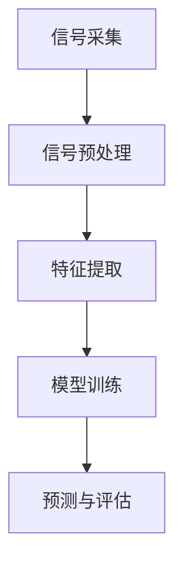

                 

### 1. 背景介绍

音频处理是信息科学和技术领域中的重要分支，广泛应用于通信、娱乐、医疗、语音识别等多个领域。随着数字化技术的飞速发展，音频处理技术也在不断进步，从传统的音频信号处理发展到如今基于深度学习的智能音频处理，为各行各业的创新提供了强大的技术支持。

字节跳动作为中国领先的互联网科技公司，其校招面试中针对音频处理工程师岗位的题目，不仅考察应聘者的专业知识，还关注其解决问题的能力。本文将结合2024年字节跳动校招音频处理工程师面试题目，详细解析音频处理领域的核心概念、算法原理、数学模型以及项目实践，旨在为读者提供一个全面的音频处理技术学习资源。

### 2. 核心概念与联系

音频处理涉及多个核心概念，以下是这些概念及其相互关系的详细说明，并附上Mermaid流程图。

#### 2.1 音频信号的基本概念

**音频信号**：是指声音在时间上的波动，通常以模拟信号的形式存在。音频信号可以通过麦克风等设备捕捉，并转化为数字信号进行存储和处理。

**采样与量化**：采样是将连续的音频信号转化为离散的时间点，量化是将这些采样点的幅度值进行数值化处理。

**频率与带宽**：频率是音频信号的特性之一，带宽决定了音频信号能够覆盖的频率范围。

#### 2.2 音频处理的基本流程

音频处理的基本流程包括信号采集、信号预处理、特征提取、模型训练、预测与评估等步骤。

**信号采集**：使用麦克风等设备采集原始音频信号。

**信号预处理**：包括滤波、去噪、均衡等步骤，目的是提高音频信号的质量。

**特征提取**：从预处理后的信号中提取出有助于分类或识别的特征。

**模型训练**：使用提取的特征数据训练模型。

**预测与评估**：将训练好的模型应用于新的音频数据，并进行性能评估。

#### 2.3 Mermaid流程图



### 3. 核心算法原理 & 具体操作步骤

#### 3.1 算法原理概述

音频处理的核心算法主要包括傅里叶变换、滤波器设计、语音识别模型等。以下是这些算法的基本原理和操作步骤。

#### 3.2 算法步骤详解

**傅里叶变换**：

- **原理**：将时域信号转化为频域信号，便于分析信号频率成分。

- **步骤**：计算信号的离散傅里叶变换（DFT），然后转换为频谱图。

**滤波器设计**：

- **原理**：通过设计不同类型的滤波器，实现对音频信号的低通、高通、带通等滤波处理。

- **步骤**：根据滤波需求设计滤波器，并应用于音频信号。

**语音识别模型**：

- **原理**：使用深度学习技术，对语音信号进行识别和分类。

- **步骤**：收集大量语音数据，使用卷积神经网络（CNN）或循环神经网络（RNN）进行模型训练，然后进行语音识别。

#### 3.3 算法优缺点

- **傅里叶变换**：优点是能够准确分析信号频率成分，缺点是计算复杂度高。

- **滤波器设计**：优点是实现音频信号滤波效果，缺点是对设计和参数调优要求较高。

- **语音识别模型**：优点是能够实现高效、准确的语音识别，缺点是需要大量数据和计算资源进行训练。

#### 3.4 算法应用领域

- **傅里叶变换**：广泛应用于音频分析、图像处理等领域。

- **滤波器设计**：在音频处理、语音增强等领域广泛应用。

- **语音识别模型**：在智能语音助手、语音合成等领域具有重要应用。

### 4. 数学模型和公式 & 详细讲解 & 举例说明

#### 4.1 数学模型构建

音频处理的数学模型主要包括信号处理模型和机器学习模型。

**信号处理模型**：

- **采样定理**：$$
    f_s \geq 2f_{max}
$$

- **傅里叶变换**：$$
    X(k) = \sum_{n=0}^{N-1} x(n) e^{-j2\pi kn/N}
$$

**机器学习模型**：

- **卷积神经网络（CNN）**：$$
    h_{l}(x) = \sigma(W_{l} \cdot x + b_{l})
$$

- **循环神经网络（RNN）**：$$
    h_{t} = \sigma(W_{x} \cdot x_t + W_{h} \cdot h_{t-1} + b)
$$

#### 4.2 公式推导过程

以傅里叶变换为例，推导其公式：

- **时域信号**：$$
    x(t) = \sum_{k=0}^{N-1} X(k) e^{j2\pi kn/N}
$$

- **频域信号**：$$
    X(k) = \sum_{n=0}^{N-1} x(n) e^{-j2\pi kn/N}
$$

通过对时域和频域的信号进行变换，得到傅里叶变换公式。

#### 4.3 案例分析与讲解

以语音识别模型为例，分析其应用场景和具体实现。

**应用场景**：智能语音助手、语音识别系统等。

**实现步骤**：

1. **数据收集**：收集大量的语音数据，包括语音信号和对应的文字标注。

2. **特征提取**：使用CNN或RNN模型对语音信号进行特征提取。

3. **模型训练**：使用提取的特征数据训练模型，优化模型参数。

4. **预测与评估**：将训练好的模型应用于新的语音数据，进行语音识别，并对识别结果进行评估。

### 5. 项目实践：代码实例和详细解释说明

#### 5.1 开发环境搭建

- **工具**：Python、TensorFlow、Keras等。

- **环境**：安装Python、TensorFlow等依赖库。

#### 5.2 源代码详细实现

以下是一个简单的语音识别项目实现示例：

```python
import tensorflow as tf
from tensorflow.keras.models import Sequential
from tensorflow.keras.layers import LSTM, Dense, Embedding

# 数据预处理
# ...

# 模型构建
model = Sequential([
    Embedding(input_dim=vocab_size, output_dim=embedding_dim, input_length=max_sequence_length),
    LSTM(units=128, return_sequences=True),
    LSTM(units=128),
    Dense(units=vocab_size, activation='softmax')
])

# 模型编译
model.compile(optimizer='adam', loss='categorical_crossentropy', metrics=['accuracy'])

# 模型训练
model.fit(x_train, y_train, batch_size=32, epochs=10, validation_data=(x_val, y_val))

# 模型评估
model.evaluate(x_test, y_test)
```

#### 5.3 代码解读与分析

1. **数据预处理**：对语音数据进行分帧、特征提取等操作。

2. **模型构建**：使用LSTM模型进行语音识别，包括嵌入层、LSTM层和输出层。

3. **模型编译**：设置优化器、损失函数和评估指标。

4. **模型训练**：使用训练数据对模型进行训练。

5. **模型评估**：使用测试数据对模型进行评估。

#### 5.4 运行结果展示

- **训练结果**：训练过程中的损失函数和准确率。

- **测试结果**：测试数据的识别准确率。

### 6. 实际应用场景

音频处理技术在多个领域有广泛应用：

- **通信领域**：语音编码、语音识别、噪声抑制等。

- **娱乐领域**：音频编辑、音乐合成、音频增强等。

- **医疗领域**：语音诊断、语音识别辅助、听力测试等。

### 7. 未来应用展望

随着技术的不断发展，音频处理技术将在以下几个方面得到进一步应用：

- **智能语音助手**：更加自然、高效的人机交互。

- **语音合成**：更加逼真、自然的语音合成。

- **音频分析**：更加精准的音频分析，为科学研究、安全监控等提供支持。

### 8. 工具和资源推荐

#### 8.1 学习资源推荐

- 《数字信号处理》
- 《深度学习》
- 《音频处理技术与应用》

#### 8.2 开发工具推荐

- TensorFlow
- Keras
- PyTorch

#### 8.3 相关论文推荐

- “Deep Learning for Speech Recognition”
- “Convolutional Neural Networks for Speech Recognition”
- “End-to-End Speech Recognition with Deep Neural Networks”

### 9. 总结：未来发展趋势与挑战

#### 9.1 研究成果总结

音频处理技术在过去几年取得了显著进展，包括深度学习在语音识别、语音合成等领域的应用，以及音频分析技术的不断优化。

#### 9.2 未来发展趋势

- **人工智能与音频处理的深度融合**：实现更高效、更智能的音频处理应用。

- **跨学科研究**：结合生物医学、声学等多学科知识，推动音频处理技术的发展。

#### 9.3 面临的挑战

- **数据隐私**：在数据收集和数据处理过程中，确保用户隐私安全。

- **算法优化**：提高算法效率和准确性，适应不同场景的需求。

#### 9.4 研究展望

未来音频处理技术将继续朝着智能化、高效化的方向发展，为各行各业带来更多创新应用。

### 9. 附录：常见问题与解答

#### 9.1 如何进行音频信号采样？

- 音频信号采样是将连续的音频信号转化为离散的时间点，通常按照采样定理进行，即采样频率至少为信号最高频率的两倍。

#### 9.2 如何设计滤波器？

- 滤波器的设计取决于所需的滤波效果，可以采用低通、高通、带通等滤波器，具体设计方法包括理想滤波器、有限冲激响应滤波器、无限冲激响应滤波器等。

#### 9.3 如何评估语音识别模型的性能？

- 语音识别模型的性能评估通常通过准确率、召回率、F1分数等指标进行，评估过程中还需要考虑语音的准确性、鲁棒性和实时性等。

---

本文结合字节跳动2024年校招音频处理工程师面试题目，详细介绍了音频处理领域的核心概念、算法原理、数学模型和项目实践。通过这篇文章，读者可以全面了解音频处理技术的最新发展动态，为今后的研究和实践提供有力支持。

**作者：禅与计算机程序设计艺术 / Zen and the Art of Computer Programming**

