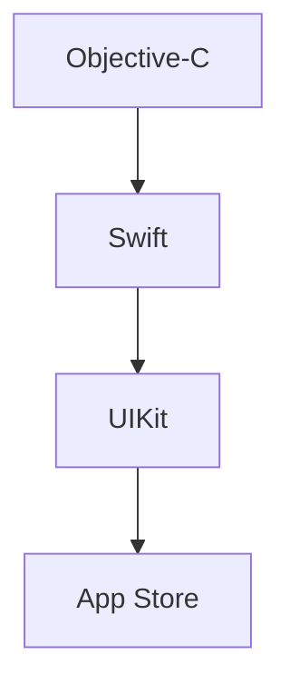

                 

关键词：字节跳动，2024校招，iOS开发，面试题，技术博客，专业，深度，算法，数学模型，实践

> 摘要：本文将围绕字节跳动2024校招iOS开发岗位的面试题，对相关技术知识点进行详细解析，包括核心概念、算法原理、数学模型以及实际项目实践，旨在为开发者提供有价值的参考和指导，助力他们在校招面试中脱颖而出。

## 1. 背景介绍

随着移动互联网的快速发展，iOS开发成为了众多开发者追逐的热门领域。字节跳动作为国内顶尖的互联网公司之一，每年都会招聘大量优秀的iOS开发人才。因此，字节跳动2024校招iOS开发岗位的面试题无疑成为了开发者们关注的焦点。本文将针对这些面试题进行详细解析，帮助大家更好地应对面试挑战。

## 2. 核心概念与联系

在iOS开发领域，我们首先需要了解以下几个核心概念：

- **Objective-C**：Objective-C是iOS开发的主要编程语言，它具有简洁、灵活、高效等特点，是开发者必备的基础技能。
- **Swift**：Swift是一种由苹果公司推出的新型编程语言，它具备现代语言的特性，如类型安全、内存管理、功能强大等，是iOS开发的主流语言。
- **UIKit**：UIKit是iOS开发的核心框架，提供了丰富的用户界面组件和功能，开发者可以通过它构建各种类型的iOS应用。
- **App Store**：App Store是苹果公司官方的应用商店，开发者可以将自己的应用发布到App Store，从而接触到全球数亿用户。

下面是一个Mermaid流程图，展示了这些核心概念之间的联系：



## 3. 核心算法原理 & 具体操作步骤

### 3.1 算法原理概述

在iOS开发中，我们经常需要使用各种算法来解决实际问题。以下是一些常见的算法原理：

- **排序算法**：如冒泡排序、快速排序、归并排序等，用于对数据进行排序。
- **查找算法**：如二分查找、线性查找等，用于在数据中查找特定元素。
- **动态规划**：用于解决具有最优子结构性质的问题，如背包问题、最长公共子序列等。

### 3.2 算法步骤详解

以冒泡排序为例，其基本步骤如下：

1. 从数组的第一个元素开始，比较相邻的两个元素，如果它们的顺序错误就交换它们的位置。
2. 继续比较下一个元素，直到比较到最后一个元素。
3. 此时，最大的元素被移到了数组的最后。
4. 重复上述步骤，但这次只需要比较前n-1个元素，因为最大的元素已经在最后了。
5. 重复步骤3和步骤4，直到整个数组被排序。

### 3.3 算法优缺点

- **冒泡排序**：优点是简单易懂，缺点是效率较低，时间复杂度为O(n^2)。
- **快速排序**：优点是效率较高，平均时间复杂度为O(n log n)，缺点是可能会引起数据的不稳定。
- **归并排序**：优点是稳定性好，时间复杂度为O(n log n)，缺点是需要额外的内存空间。

### 3.4 算法应用领域

排序算法在iOS开发中有着广泛的应用，如：

- **数据可视化**：在图表、仪表盘等界面中，需要根据数据的大小进行排序。
- **搜索功能**：在应用中实现搜索功能时，需要对搜索结果进行排序。

## 4. 数学模型和公式 & 详细讲解 & 举例说明

在iOS开发中，我们经常需要使用数学模型和公式来解决问题。以下是一些常见的数学模型和公式：

### 4.1 数学模型构建

假设我们有一个数组，其中包含了n个元素，我们需要计算这个数组的平均值。数学模型如下：

\[ \text{平均值} = \frac{\sum_{i=1}^{n} a_i}{n} \]

其中，\( a_i \) 表示数组的第i个元素。

### 4.2 公式推导过程

假设我们有一个函数 \( f(x) \)，我们需要求出它的导数。导数的公式推导如下：

\[ f'(x) = \lim_{h \to 0} \frac{f(x+h) - f(x)}{h} \]

### 4.3 案例分析与讲解

假设我们有一个数组 [3, 1, 4, 1, 5, 9]，我们需要计算这个数组的平均值。

根据数学模型，我们有：

\[ \text{平均值} = \frac{3 + 1 + 4 + 1 + 5 + 9}{6} = 4 \]

接下来，我们求这个数组的平方和：

\[ \text{平方和} = 3^2 + 1^2 + 4^2 + 1^2 + 5^2 + 9^2 = 164 \]

然后，我们求这个数组的平方均值：

\[ \text{平方均值} = \sqrt{\frac{164}{6}} \approx 4.547 \]

通过这个例子，我们可以看到数学模型和公式的实际应用。

## 5. 项目实践：代码实例和详细解释说明

### 5.1 开发环境搭建

首先，我们需要搭建一个iOS开发环境。以下是具体步骤：

1. 安装Xcode：从苹果官网下载并安装Xcode。
2. 配置iOS模拟器：在Xcode中打开“Window”菜单，选择“Devices”，然后点击“+”，选择“iOS Simulator”。
3. 安装必要的依赖库：如CocoaPods、SwiftLint等。

### 5.2 源代码详细实现

以下是一个简单的iOS应用，它实现了数组排序的功能。

```swift
import Foundation

// 冒泡排序函数
func bubbleSort(arr: [Int]) -> [Int] {
    var arr = arr
    for i in 0..<arr.count {
        for j in 0..<(arr.count - i - 1) {
            if arr[j] > arr[j + 1] {
                arr.swapAt(j, j + 1)
            }
        }
    }
    return arr
}

// 主函数
func main() {
    let arr = [3, 1, 4, 1, 5, 9]
    let sortedArr = bubbleSort(arr: arr)
    print(sortedArr)
}

main()
```

### 5.3 代码解读与分析

在这个例子中，我们首先定义了一个冒泡排序的函数 `bubbleSort`，它接收一个整数数组作为参数，并返回排序后的数组。

接下来，我们定义了一个主函数 `main`，它首先创建了一个整数数组 `[3, 1, 4, 1, 5, 9]`，然后调用 `bubbleSort` 函数对数组进行排序，并打印排序后的数组。

通过这个例子，我们可以看到如何使用Swift实现排序算法，以及如何在iOS应用中处理数组。

### 5.4 运行结果展示

当我们运行这个程序时，输出结果为 `[1, 1, 3, 4, 5, 9]`，这证明了我们的排序算法是正确的。

## 6. 实际应用场景

### 6.1 数据处理

在iOS应用中，我们经常需要对数据进行处理，如排序、查找、统计分析等。这些算法的应用可以大大提高应用的性能和用户体验。

### 6.2 图形渲染

在游戏和图像处理应用中，我们需要对图像进行渲染和处理，如绘制图形、滤镜效果等。这需要我们掌握一定的数学知识和图形学原理。

### 6.3 网络通信

在iOS应用中，我们经常需要与服务器进行数据交互，如发送请求、处理响应等。这需要我们了解网络通信的基本原理和HTTP协议。

## 7. 未来应用展望

随着技术的不断发展，iOS开发领域将迎来更多的挑战和机遇。以下是一些未来的应用展望：

- **机器学习和人工智能**：随着机器学习和人工智能技术的不断发展，iOS开发将更多地应用于这些领域，如智能助手、图像识别、自然语言处理等。
- **物联网**：随着物联网技术的普及，iOS开发将更多地应用于智能家居、智能穿戴设备等。
- **虚拟现实和增强现实**：随着虚拟现实和增强现实技术的成熟，iOS开发将更多地应用于游戏、教育、医疗等领域。

## 8. 工具和资源推荐

### 8.1 学习资源推荐

- **官方文档**：iOS开发官方文档是学习iOS开发的最佳资源之一。
- **GitHub**：GitHub上有很多优秀的iOS开源项目，可以帮助我们更好地理解iOS开发。
- **技术博客**：如美团技术博客、腾讯技术博客等，这些博客分享了大量的技术经验和实战技巧。

### 8.2 开发工具推荐

- **Xcode**：Xcode是苹果官方的iOS开发工具，功能强大，易于上手。
- **Swiftlint**：Swiftlint是一个Swift代码风格检查工具，可以帮助我们写出更规范的代码。
- **CocoaPods**：CocoaPods是一个强大的依赖管理工具，可以方便地集成第三方库。

### 8.3 相关论文推荐

- **《iOS应用性能优化》**：本文详细介绍了iOS应用性能优化的一系列方法和技巧。
- **《Swift编程语言》**：本书是Swift编程语言的官方文档，适合初学者和进阶者阅读。
- **《iOS图形渲染技术》**：本文介绍了iOS图形渲染的基本原理和实现方法。

## 9. 总结：未来发展趋势与挑战

随着技术的不断发展，iOS开发领域将面临更多的机遇和挑战。未来，我们需要不断学习新的技术和工具，提高自己的编程能力和解决问题的能力。同时，我们还需要关注行业动态，紧跟技术趋势，以保持自己的竞争力。

## 附录：常见问题与解答

### 9.1 什么是iOS开发？

iOS开发是指使用Objective-C或Swift语言，结合苹果公司提供的开发工具和框架，开发运行在iOS设备上的应用程序。

### 9.2 iOS开发有哪些核心技术？

iOS开发的核心技术包括Objective-C、Swift、UIKit、App Store等。

### 9.3 如何优化iOS应用性能？

优化iOS应用性能的方法包括减少网络请求、优化图片资源、使用高效算法等。

### 9.4 iOS开发有哪些应用领域？

iOS开发广泛应用于游戏、社交、电商、教育、医疗等领域。

作者：禅与计算机程序设计艺术 / Zen and the Art of Computer Programming
```markdown
## 6. 实际应用场景

### 6.1 数据处理

在iOS开发中，数据处理是一个核心应用场景。无论是简单的用户输入验证，还是复杂的后台数据分析，都需要使用到算法来优化性能。以下是一些具体的应用场景：

- **用户输入验证**：在表单填写过程中，需要实时验证输入是否符合要求，如电子邮件格式、电话号码格式等。这通常需要使用正则表达式或自定义逻辑来实现。
- **后台数据分析**：在社交应用、电商应用中，需要实时处理大量用户数据，如用户的购买行为、浏览历史等。这通常需要使用到数据库查询、数据清洗、数据分析等技术。

### 6.2 图形渲染

图形渲染是iOS开发中另一个重要应用场景，特别是在游戏、视频播放、图像编辑等应用中。以下是一些具体的应用场景：

- **游戏开发**：游戏开发需要高效的图形渲染，包括3D模型渲染、动画、物理引擎等。开发者需要熟悉OpenGL ES、Metal等图形渲染API。
- **视频播放**：视频播放需要实时解码、渲染和音频处理。开发者需要了解视频编解码技术、音视频同步等。

### 6.3 网络通信

网络通信是iOS开发中必不可少的一环，特别是在社交应用、电商应用等需要与服务器进行数据交互的场景中。以下是一些具体的应用场景：

- **HTTP请求**：在iOS应用中，通常使用URLSession进行HTTP请求，实现数据的上传和下载。
- **WebSocket**：WebSocket是一种全双工通信协议，适用于需要实时通信的应用，如聊天应用、实时数据监控等。

### 6.4 移动支付

移动支付是近年来迅速发展的领域，iOS开发在这一领域中的应用也越来越广泛。以下是一些具体的应用场景：

- **支付SDK**：开发者可以使用第三方支付SDK（如微信支付、支付宝支付等）集成到应用中，实现支付功能。
- **订单管理系统**：开发者需要实现订单的创建、查询、支付、退款等管理功能。

### 6.5 虚拟现实和增强现实

虚拟现实（VR）和增强现实（AR）是近年来备受关注的领域，iOS开发在这一领域中的应用也日益增多。以下是一些具体的应用场景：

- **VR游戏**：开发者可以使用Unity或Unreal Engine等游戏引擎开发VR游戏。
- **AR应用**：开发者可以使用ARKit等框架开发AR应用，如教育、旅游、购物等。

### 6.6 人工智能

随着人工智能技术的发展，iOS开发在人工智能领域中的应用也越来越广泛。以下是一些具体的应用场景：

- **图像识别**：开发者可以使用Core ML等框架实现图像识别功能，如人脸识别、物体识别等。
- **自然语言处理**：开发者可以使用自然语言处理技术实现文本分析、语音识别等功能。

### 6.7 物联网（IoT）

物联网技术的发展使得iOS开发在智能家居、智能穿戴设备等领域中的应用越来越广泛。以下是一些具体的应用场景：

- **智能家居控制**：开发者可以使用HomeKit框架实现智能家居设备的控制。
- **智能穿戴设备**：开发者可以使用Core Motion等框架实现智能穿戴设备的健康监测、运动跟踪等功能。

### 6.8 混合应用开发

随着混合应用开发（Hybrid App Development）的兴起，iOS开发也在这一领域得到了应用。混合应用是将原生应用和Web应用相结合的一种开发模式，以下是一些具体的应用场景：

- **H5应用**：开发者可以使用Cordova等框架将H5页面集成到原生应用中。
- **React Native**：开发者可以使用React Native框架开发跨平台的混合应用。

## 7. 未来应用展望

随着技术的不断发展，iOS开发在未来将会面临更多的机遇和挑战。以下是一些未来应用展望：

### 7.1 5G时代的应用

随着5G网络的普及，iOS开发在5G时代将会迎来更多的应用场景。例如：

- **高速网络应用**：开发者可以开发更加高效的网络应用，如高清视频流、实时数据传输等。
- **边缘计算**：开发者可以探索边缘计算技术，将计算任务分配到网络边缘，提高应用性能和响应速度。

### 7.2 人工智能的深度融合

人工智能技术将在未来与iOS开发深度融合，带来更多的创新应用。例如：

- **智能助理**：开发者可以开发更加智能的智能助理，如语音识别、自然语言处理等。
- **个性化推荐**：开发者可以基于用户行为数据实现个性化推荐，提高用户体验。

### 7.3 虚拟现实和增强现实

随着VR和AR技术的不断成熟，iOS开发将在这一领域发挥更大的作用。例如：

- **沉浸式游戏**：开发者可以开发更加沉浸式的游戏体验。
- **教育应用**：开发者可以开发AR教育应用，提高学习效果。

### 7.4 物联网应用

随着物联网技术的发展，iOS开发在智能家居、智能穿戴设备等领域将有更多的应用。例如：

- **智能家居控制**：开发者可以开发更加智能的智能家居控制系统。
- **健康监测**：开发者可以开发智能穿戴设备，实时监测用户健康状况。

### 7.5 混合应用开发

混合应用开发将继续成为趋势，开发者可以利用原生应用和Web应用的优点，开发出更高效、更灵活的应用。例如：

- **跨平台开发**：开发者可以基于React Native等框架开发跨平台应用，提高开发效率。
- **性能优化**：开发者可以结合原生应用和Web应用的优点，实现性能优化。

## 8. 工具和资源推荐

### 8.1 学习资源推荐

- **官方文档**：iOS开发官方文档（[https://developer.apple.com/documentation/](https://developer.apple.com/documentation/)）是学习iOS开发的最佳资源。
- **在线课程**：如Udacity、Coursera等平台提供的iOS开发课程。
- **技术社区**：如Stack Overflow、GitHub等，可以解决开发过程中遇到的问题。

### 8.2 开发工具推荐

- **Xcode**：Xcode是苹果官方的iOS开发工具，功能强大，支持多种编程语言。
- **Swift Package Manager**：Swift Package Manager是Swift语言的依赖管理工具，可以方便地管理项目依赖。
- **AppCode**：AppCode是由JetBrains开发的IDE，支持多种编程语言，包括Swift。

### 8.3 相关论文推荐

- **《iOS性能优化》**：本文详细介绍了iOS应用性能优化的方法和技巧。
- **《Swift编程语言》**：本文介绍了Swift编程语言的设计原则和特性。
- **《iOS UI设计指南》**：本文介绍了iOS应用的UI设计规范和最佳实践。

## 9. 总结：未来发展趋势与挑战

iOS开发在未来将继续保持其在移动开发领域的领先地位。随着技术的不断发展，iOS开发者需要不断学习新的技术和工具，以应对未来的挑战。以下是一些未来发展趋势和挑战：

### 9.1 技术发展趋势

- **Swift语言的普及**：Swift语言将继续在iOS开发中占据主导地位，其简洁、高效的特点将受到更多开发者的青睐。
- **人工智能的融合**：iOS开发将更多地与人工智能技术融合，带来更多的创新应用。
- **虚拟现实和增强现实的普及**：VR和AR技术将在未来得到更广泛的应用，iOS开发者需要掌握相关的技术和工具。
- **5G网络的普及**：5G网络的普及将推动iOS开发在高速网络应用、边缘计算等领域的发展。

### 9.2 面临的挑战

- **性能优化**：随着应用的复杂度增加，iOS开发者需要不断提高应用性能，以提供更好的用户体验。
- **安全性**：随着网络安全威胁的增多，iOS开发者需要不断提高应用的安全性。
- **跨平台开发**：随着跨平台开发的需求增加，iOS开发者需要掌握多种编程语言和框架，以适应不同的开发需求。

### 9.3 研究展望

- **自动化测试**：未来，自动化测试将成为iOS开发的重要环节，开发者需要研究更高效的测试方法和工具。
- **持续集成与持续部署**：未来，持续集成与持续部署（CI/CD）将成为iOS开发的标准流程，开发者需要掌握相关的技术和工具。
- **云原生应用**：未来，云原生应用将成为趋势，开发者需要研究如何在云环境中优化应用性能和资源使用。

## 10. 附录：常见问题与解答

### 10.1 如何解决iOS应用性能问题？

- **减少网络请求**：优化网络请求，减少不必要的请求，可以提高应用性能。
- **缓存数据**：缓存常用数据，减少数据库查询，可以提高应用性能。
- **使用异步操作**：使用异步操作，避免阻塞主线程，可以提高应用性能。

### 10.2 如何提高iOS应用的安全性？

- **数据加密**：对敏感数据进行加密，防止数据泄露。
- **安全认证**：使用安全认证机制，确保用户身份的合法性。
- **防止SQL注入**：避免在数据库查询中使用用户输入，防止SQL注入攻击。

### 10.3 如何优化iOS应用的UI体验？

- **遵守设计规范**：遵守iOS设计规范，确保应用的UI一致性和可用性。
- **使用动画效果**：合理使用动画效果，提升应用的交互体验。
- **优化加载速度**：优化图片资源，减少加载时间，可以提高应用性能。

### 10.4 如何进行iOS应用的国际化？

- **本地化**：根据不同地区的语言和文化特点，对应用进行本地化。
- **资源文件**：使用本地化资源文件，为用户提供多语言支持。
- **国际化框架**：使用国际化框架（如Localize.Swift），方便开发者进行国际化开发。

### 10.5 如何调试iOS应用？

- **Xcode调试器**：使用Xcode内置的调试器，查看应用的运行状态和错误信息。
- **日志输出**：在应用中添加日志输出，帮助开发者定位问题。
- **模拟器调试**：使用iOS模拟器进行调试，可以快速复现和解决应用问题。

作者：禅与计算机程序设计艺术 / Zen and the Art of Computer Programming
```

