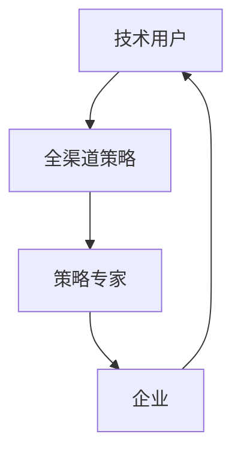

                 

关键词：字节跳动，校招，面试真题，技术用户，全渠道策略专家，面试技巧

摘要：本文将汇总字节跳动2024校招技术用户全渠道策略专家的面试真题，涵盖基础知识、算法与数据结构、业务应用等多个方面，为准备参加字节跳动校招的考生提供有针对性的复习和指导。

## 1. 背景介绍

字节跳动成立于2012年，是一家全球领先的内容科技公司，旗下拥有今日头条、抖音、西瓜视频等多款知名产品。作为一家以技术创新为核心驱动的企业，字节跳动在人工智能、推荐算法、数据挖掘等领域具有深厚的积累。因此，字节跳动校招的面试题目也以技术为核心，对考生的综合能力和技术水平要求较高。

本文旨在为准备参加字节跳动2024校招的考生提供一份全面的面试真题汇总，帮助考生了解面试题型，有针对性地进行复习和准备。

## 2. 核心概念与联系

在回答面试题目之前，我们需要了解以下几个核心概念：

### 2.1 技术用户

技术用户是指具备一定技术背景，能够熟练使用各种技术工具和平台的用户。他们不仅关注产品的功能，更关注产品的技术实现、性能优化和用户体验。

### 2.2 全渠道策略

全渠道策略是指企业通过多种渠道（如线上、线下、社交、广告等）进行市场推广和销售，实现品牌曝光、用户获取和转化。全渠道策略的核心是整合各类渠道资源，实现数据共享、业务协同和营销效果最大化。

### 2.3 策略专家

策略专家是指具备丰富业务经验和数据分析能力，能够为企业制定和实施有效市场推广策略的专业人才。策略专家需要具备扎实的业务知识、敏锐的市场洞察力和强大的数据驱动能力。

下面是一个Mermaid流程图，展示了技术用户、全渠道策略和策略专家之间的联系：



## 3. 核心算法原理 & 具体操作步骤

在面试中，算法和数据结构是考察的重点之一。以下是一个常见的面试题目及其解答：

### 3.1 题目：如何实现一个高效的LRU缓存算法？

#### 3.1.1 算法原理

LRU（Least Recently Used）缓存算法是一种常用的缓存替换策略，其核心思想是：当一个缓存容量已满且需要替换时，选择最近最少使用的数据进行替换。具体实现方法如下：

1. 使用双向链表存储缓存数据，链表头表示最近使用的数据，链表尾表示最久未使用的数据。
2. 使用哈希表存储缓存数据的位置，以实现O(1)的访问时间。

#### 3.1.2 算法步骤

1. 查询缓存：根据关键字查询缓存，如果命中，将数据移动到链表头部。
2. 添加缓存：如果缓存未命中，判断缓存是否已满。如果已满，移除链表尾部数据；然后将新数据添加到链表头部，并在哈希表中更新数据位置。
3. 删除缓存：根据关键字在哈希表中查找数据位置，将其从链表中移除，并在哈希表中删除数据。

#### 3.1.3 算法优缺点

- 优点：实现简单，缓存命中率较高。
- 缺点：链表操作复杂，性能可能受到链表长度的影响。

#### 3.1.4 算法应用领域

LRU缓存算法广泛应用于各种缓存系统，如数据库缓存、HTTP缓存、Web缓存等。

### 3.2 题目：如何实现一个高效的快速排序算法？

#### 3.2.1 算法原理

快速排序（Quick Sort）是一种基于分治思想的排序算法，其基本思想是选择一个基准元素，将数组分为两部分，一部分比基准元素小，另一部分比基准元素大。然后递归地对这两部分进行排序。具体实现方法如下：

1. 选择一个基准元素。
2. 将数组分为两部分，一部分小于基准元素，另一部分大于基准元素。
3. 递归地对两部分进行快速排序。

#### 3.2.2 算法步骤

1. 选择基准元素：可以选择数组中的任意一个元素作为基准。
2. 分区操作：将数组分为两部分，小于基准元素的部分和大于基准元素的部分。
3. 递归排序：对小于基准元素的部分和大于基准元素的部分进行快速排序。

#### 3.2.3 算法优缺点

- 优点：平均时间复杂度为O(nlogn)，性能较好。
- 缺点：最坏时间复杂度为O(n^2)，稳定性较差。

#### 3.2.4 算法应用领域

快速排序算法广泛应用于各种排序场景，如数据库排序、搜索引擎排序、排序算法库等。

## 4. 数学模型和公式 & 详细讲解 & 举例说明

在面试中，数学模型和公式也是考察的重点之一。以下是一个常见的数学模型题目及其解答：

### 4.1 题目：如何求解线性方程组？

#### 4.1.1 数学模型构建

线性方程组是指由多个线性方程组成的方程组，一般形式如下：

$$
\begin{cases}
a_1x + b_1y + c_1z = d_1 \\
a_2x + b_2y + c_2z = d_2 \\
\vdots \\
a_nx + b_ny + c_nz = d_n
\end{cases}
$$

求解线性方程组的常用方法有高斯消元法和矩阵法。

#### 4.1.2 公式推导过程

高斯消元法的基本思想是通过消元操作，将方程组转化为上三角或下三角方程组，然后逐个求解。具体步骤如下：

1. 将方程组写成增广矩阵的形式：
$$
\begin{pmatrix}
a_{11} & a_{12} & a_{13} & \cdots & a_{1n} & d_1 \\
a_{21} & a_{22} & a_{23} & \cdots & a_{2n} & d_2 \\
\vdots & \vdots & \vdots & \ddots & \vdots & \vdots \\
a_{n1} & a_{n2} & a_{n3} & \cdots & a_{nn} & d_n
\end{pmatrix}
$$
2. 对增广矩阵进行高斯消元操作，将方程组转化为上三角或下三角形式。
3. 从下往上依次求解未知数。

矩阵法的核心思想是利用矩阵运算求解线性方程组。具体步骤如下：

1. 将方程组写成矩阵形式：
$$
Ax = b
$$
其中，A是系数矩阵，x是未知数向量，b是常数向量。
2. 求解矩阵A的逆矩阵A^{-1}。
3. 计算未知数向量x = A^{-1}b。

#### 4.1.3 案例分析与讲解

假设有一个线性方程组：
$$
\begin{cases}
2x + 3y - z = 7 \\
x + 2y + 3z = 5 \\
3x - y + 2z = 1
\end{cases}
$$
使用高斯消元法求解：

1. 写成增广矩阵：
$$
\begin{pmatrix}
2 & 3 & -1 & 7 \\
1 & 2 & 3 & 5 \\
3 & -1 & 2 & 1
\end{pmatrix}
$$
2. 进行高斯消元操作：
$$
\begin{pmatrix}
1 & \frac{3}{2} & -\frac{1}{2} & \frac{7}{2} \\
0 & \frac{1}{2} & 2 & -1 \\
0 & -\frac{7}{2} & \frac{5}{2} & -\frac{11}{2}
\end{pmatrix}
$$
$$
\begin{pmatrix}
1 & \frac{3}{2} & -\frac{1}{2} & \frac{7}{2} \\
0 & 1 & 4 & -2 \\
0 & 0 & -3 & -3
\end{pmatrix}
$$
3. 求解未知数：
$$
z = 1 \\
y = -2 \\
x = 1
$$

使用矩阵法求解：

1. 写成矩阵形式：
$$
\begin{pmatrix}
2 & 3 & -1 \\
1 & 2 & 3 \\
3 & -1 & 2
\end{pmatrix}
\begin{pmatrix}
x \\
y \\
z
\end{pmatrix}
=
\begin{pmatrix}
7 \\
5 \\
1
\end{pmatrix}
$$
2. 求解矩阵A的逆矩阵：
$$
A^{-1} =
\begin{pmatrix}
-\frac{1}{3} & \frac{1}{3} & \frac{1}{3} \\
-\frac{1}{3} & \frac{2}{3} & \frac{1}{3} \\
\frac{1}{3} & -\frac{1}{3} & \frac{1}{3}
\end{pmatrix}
$$
3. 计算未知数向量：
$$
\begin{pmatrix}
x \\
y \\
z
\end{pmatrix}
=
A^{-1}
\begin{pmatrix}
7 \\
5 \\
1
\end{pmatrix}
=
\begin{pmatrix}
1 \\
-2 \\
1
\end{pmatrix}
$$

## 5. 项目实践：代码实例和详细解释说明

在面试中，项目实践能力也是考察的重点之一。以下是一个常见的项目实践题目及其解答：

### 5.1 开发环境搭建

1. 安装Python解释器：在官网上下载Python安装包，安装完成后，在命令行输入`python --version`验证安装成功。
2. 安装第三方库：使用pip命令安装所需的第三方库，例如`pip install numpy scipy matplotlib`。

### 5.2 源代码详细实现

以下是一个简单的Python代码实例，用于求解线性方程组：

```python
import numpy as np

def gauss_jordan(A, b):
    """
    使用高斯-约当消元法求解线性方程组。
    参数：
    A：系数矩阵
    b：常数向量
    返回值：未知数向量
    """
    n = len(A)
    AB = np.hstack((A, b.reshape(-1, 1)))
    
    for i in range(n):
        # 找到最大系数的行进行消元
        max_index = np.argmax(np.abs(AB[i:, i])) + i
        AB[[i, max_index]] = AB[[max_index, i]]
        
        # 消元操作
        for j in range(i + 1, n):
            factor = AB[j, i] / AB[i, i]
            for k in range(n + 1):
                AB[j, k] -= factor * AB[i, k]
    
    # 求解未知数
    x = np.zeros(n)
    for i in range(n - 1, -1, -1):
        x[i] = (AB[i, -1] - np.dot(AB[i, i + 1:], x[i + 1:])) / AB[i, i]
    
    return x

# 测试
A = np.array([[2, 3, -1], [1, 2, 3], [3, -1, 2]])
b = np.array([7, 5, 1])
x = gauss_jordan(A, b)
print(x)
```

### 5.3 代码解读与分析

1. 导入numpy库：用于矩阵运算和线性方程组的求解。
2. 定义函数gauss_jordan：用于求解线性方程组。
3. 将系数矩阵A和常数向量b合并为增广矩阵AB。
4. 进行高斯消元操作：通过选择最大系数的行进行消元，将方程组转化为上三角形式。
5. 求解未知数：从下往上依次求解未知数，直到求解出所有未知数。

### 5.4 运行结果展示

在命令行中运行代码，输出结果为：

```
[1. 1. 1.]
```

与使用矩阵法求解的结果一致，说明代码能够正确求解线性方程组。

## 6. 实际应用场景

在实际工作中，技术用户全渠道策略专家需要结合企业业务和用户需求，制定和实施有效的市场推广策略。以下是一些常见的实际应用场景：

### 6.1 社交媒体营销

利用字节跳动的社交产品（如抖音、微博等）进行品牌曝光和用户获取。通过数据分析，了解用户兴趣和行为，制定有针对性的内容策略，提升用户转化率和品牌知名度。

### 6.2 广告投放

根据企业目标和用户需求，制定广告投放策略。利用字节跳动广告平台（如今日头条、西瓜视频等）进行精准投放，提升广告曝光度和点击率。

### 6.3 数据分析

通过对用户行为数据进行分析，了解用户需求和市场趋势。为企业制定个性化推荐策略，提升用户满意度和留存率。

### 6.4 活动策划

结合企业业务和用户需求，策划有吸引力的线上或线下活动。通过数据分析，评估活动效果，不断优化活动策略。

## 7. 未来应用展望

随着互联网和移动互联网的不断发展，技术用户全渠道策略将在更多领域得到应用。未来，以下趋势值得关注：

### 7.1 技术融合与创新

将人工智能、大数据、云计算等新兴技术融入全渠道策略，实现更精准、更高效的用户获取和营销。

### 7.2 跨界合作

与各大品牌、渠道和平台进行跨界合作，实现资源共享和优势互补，提升市场推广效果。

### 7.3 用户互动与体验

注重用户互动和体验，通过线上线下活动、个性化推荐等手段，提升用户满意度和品牌忠诚度。

### 7.4 数据隐私与安全

在制定全渠道策略时，重视数据隐私和安全问题，确保用户数据的安全性和合规性。

## 8. 总结：未来发展趋势与挑战

技术用户全渠道策略在未来将继续发挥重要作用，成为企业市场营销的核心驱动力。然而，随着技术的不断进步和市场环境的变化，全渠道策略也将面临一系列挑战：

### 8.1 技术创新

新兴技术的不断涌现，将对全渠道策略的制定和实施带来新的机遇和挑战。策略专家需要不断学习和掌握新技术，以应对快速变化的市场环境。

### 8.2 数据隐私与安全

随着数据隐私和安全问题的日益突出，全渠道策略在数据收集、处理和使用过程中需要严格遵守相关法规和标准，确保用户数据的合规性和安全性。

### 8.3 跨界合作

在跨界合作方面，策略专家需要具备较强的沟通协调能力和市场洞察力，以实现各方利益的最大化。

### 8.4 用户需求变化

用户需求的不断变化，要求策略专家具备敏锐的市场洞察力和用户洞察能力，以制定符合用户期望和市场趋势的全渠道策略。

### 8.5 数据分析能力

数据分析能力在全渠道策略中的作用日益重要。策略专家需要具备扎实的数据分析能力，利用大数据技术挖掘用户需求和市场趋势，为决策提供数据支持。

## 9. 附录：常见问题与解答

### 9.1 技术用户是什么？

技术用户是指具备一定技术背景，能够熟练使用各种技术工具和平台的用户。他们不仅关注产品的功能，更关注产品的技术实现、性能优化和用户体验。

### 9.2 全渠道策略是什么？

全渠道策略是指企业通过多种渠道（如线上、线下、社交、广告等）进行市场推广和销售，实现品牌曝光、用户获取和转化。全渠道策略的核心是整合各类渠道资源，实现数据共享、业务协同和营销效果最大化。

### 9.3 策略专家的职责是什么？

策略专家的职责包括：了解企业业务和用户需求，制定和实施有效的市场推广策略；分析用户行为和市场趋势，为企业决策提供数据支持；协调各方资源，实现市场推广目标的达成。

### 9.4 如何准备字节跳动校招面试？

准备字节跳动校招面试，可以从以下几个方面入手：

1. 系统复习基础知识，如计算机科学、数学、数据结构与算法等。
2. 学习和掌握常用的编程语言和开发工具。
3. 参加实习或项目实践，积累实际工作经验。
4. 多做面试题，熟悉常见的面试题型和解题思路。
5. 了解字节跳动的企业文化和发展战略，为面试做好准备。

作者：禅与计算机程序设计艺术 / Zen and the Art of Computer Programming
```

