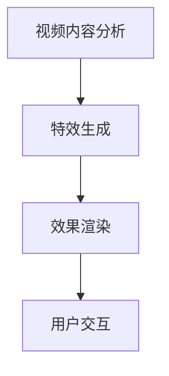

                 

 摘要：
本文旨在深入剖析字节跳动2024年短视频特效算法的校招面试重点。我们将从背景介绍、核心概念与联系、核心算法原理及具体操作步骤、数学模型和公式、项目实践、实际应用场景以及未来应用展望等多个方面，全面探讨短视频特效算法的技术要点。通过本文，读者将能够全面了解这一前沿技术，并为其在面试中的表现提供有力支持。

## 1. 背景介绍

短视频的兴起，改变了人们获取和分享信息的方式。从抖音到快手，再到TikTok，短视频平台已经深入人们的日常生活。特效作为提升视频吸引力和观赏性的重要手段，逐渐成为各大短视频平台争夺用户的重要元素。字节跳动作为短视频领域的领军企业，其2024年的特效算法校招面试，自然成为业界关注的焦点。

短视频特效算法的校招面试，不仅考察应聘者对技术原理的掌握，还关注其创新能力和实际动手能力。算法的优化、特效的多样性、用户体验的提升等都是面试中重要的考察方向。本文将围绕这些方面，为读者提供一个全面的技术解析。

## 2. 核心概念与联系

### 2.1 视频特效的基本概念

视频特效是指通过对原始视频内容进行加工和处理，从而实现视频画面效果的变化。常见的效果包括色彩调整、画面模糊、动态滤镜、动态文字动画等。这些特效不仅能够增强视频的视觉吸引力，还能传达视频内容的特定情感和氛围。

### 2.2 算法在特效处理中的作用

在短视频特效处理中，算法扮演着至关重要的角色。通过算法，可以实现视频内容的智能识别、特效的自动化生成以及效果的实时渲染。常用的算法包括图像处理算法、机器学习算法以及计算机视觉算法等。

### 2.3 算法架构与联系

短视频特效算法的架构通常包括以下几个关键环节：视频内容分析、特效生成、效果渲染和用户交互。这些环节相互关联，共同构成了一个完整的特效处理流程。


### 2.4 Mermaid 流程图

以下是一个简单的Mermaid流程图，展示了短视频特效处理的基本流程。



## 3. 核心算法原理 & 具体操作步骤

### 3.1 算法原理概述

短视频特效算法的核心在于图像处理和计算机视觉技术。图像处理算法用于实现视频画面的基本变换，如色彩调整、模糊处理等；计算机视觉算法则用于实现更高级的效果，如人脸识别、物体追踪等。

### 3.2 算法步骤详解

#### 3.2.1 视频内容分析

视频内容分析是特效处理的第一步，主要任务是提取视频中的关键信息，如颜色分布、纹理特征、运动轨迹等。常用的算法包括SIFT（尺度不变特征变换）和SURF（加速稳健特征）等。

#### 3.2.2 特效生成

在视频内容分析的基础上，算法会根据预设的特效模板，生成相应的特效效果。例如，对于动态滤镜，算法会根据视频内容的颜色和纹理特征，选择合适的滤镜效果；对于动态文字动画，算法会根据视频内容的文字内容和运动轨迹，生成相应的动画效果。

#### 3.2.3 效果渲染

效果渲染是将生成的特效应用到原始视频上，实现最终的视频效果。这一过程通常涉及图像合成技术，如Alpha blending等。

#### 3.2.4 用户交互

用户交互是特效处理的重要环节，通过用户操作，可以实时调整特效参数，实现个性化定制。常用的交互方式包括滑动条、按钮等。

### 3.3 算法优缺点

#### 优点：

- 高效性：算法能够在短时间内处理大量视频数据，实现实时特效生成。
- 可扩展性：算法支持多种特效效果，可灵活应用于不同场景。
- 用户友好：用户可以通过简单的交互方式，实现个性化特效定制。

#### 缺点：

- 复杂性：算法涉及多个技术领域，实现难度较高。
- 资源消耗：算法对计算资源和存储资源的需求较高，可能影响视频处理的性能。

### 3.4 算法应用领域

短视频特效算法广泛应用于短视频平台、直播应用、电影后期制作等领域。随着技术的不断进步，其应用领域还将进一步拓展。

## 4. 数学模型和公式 & 详细讲解 & 举例说明

### 4.1 数学模型构建

短视频特效算法的数学模型主要包括图像处理算法和计算机视觉算法。以下是其中两个常用模型的简要介绍：

#### 4.1.1 边缘检测模型

边缘检测是图像处理中的重要任务，用于识别图像中的边缘线条。一个简单的边缘检测模型可以表示为：

$$
\text{edge}(I) = \text{gradient}(I) \cdot (\text{magnitude}(I) > \text{threshold})
$$

其中，$I$ 是输入图像，$\text{gradient}(I)$ 是图像的梯度，$\text{magnitude}(I)$ 是梯度的模，$\text{threshold}$ 是设定的阈值。

#### 4.1.2 人脸识别模型

人脸识别是计算机视觉的重要应用，其数学模型通常基于深度学习。一个典型的人脸识别模型可以表示为：

$$
\text{face\_recognition}(I) = \text{softmax}(\text{fc}(C))
$$

其中，$I$ 是输入图像，$C$ 是人脸特征向量，$\text{fc}(C)$ 是全连接层，$\text{softmax}$ 函数用于对特征向量进行分类。

### 4.2 公式推导过程

以下是一个简单的边缘检测公式推导过程：

$$
\text{edge}(I) = \text{gradient}(I) \cdot (\text{magnitude}(I) > \text{threshold})
$$

假设图像 $I$ 的像素值为 $I(x, y)$，则图像的梯度可以表示为：

$$
\text{gradient}(I) = \left[
\begin{array}{cc}
\frac{\partial I}{\partial x} \\
\frac{\partial I}{\partial y}
\end{array}
\right]
$$

梯度的模可以表示为：

$$
\text{magnitude}(I) = \sqrt{\left(\frac{\partial I}{\partial x}\right)^2 + \left(\frac{\partial I}{\partial y}\right)^2}
$$

将梯度和模代入边缘检测公式，得到：

$$
\text{edge}(I) = \left[
\begin{array}{cc}
\frac{\partial I}{\partial x} \\
\frac{\partial I}{\partial y}
\end{array}
\right]
\cdot (\text{magnitude}(I) > \text{threshold})
$$

### 4.3 案例分析与讲解

#### 4.3.1 边缘检测案例

假设有一幅256x256的图像，其像素值如下：

$$
I =
\begin{bmatrix}
0 & 0 & 0 & \ldots & 0 \\
0 & 1 & 1 & \ldots & 0 \\
0 & 1 & 1 & \ldots & 0 \\
\vdots & \vdots & \vdots & \ddots & \vdots \\
0 & 0 & 0 & \ldots & 0
\end{bmatrix}
$$

首先计算图像的梯度：

$$
\text{gradient}(I) =
\begin{bmatrix}
0 & -1 & 0 & \ldots & 0 \\
0 & -1 & -1 & \ldots & 0 \\
0 & 1 & 1 & \ldots & 0 \\
\vdots & \vdots & \vdots & \ddots & \vdots \\
0 & 1 & 0 & \ldots & 0
\end{bmatrix}
$$

然后计算梯度的模：

$$
\text{magnitude}(I) =
\begin{bmatrix}
0 & 1 & 0 & \ldots & 0 \\
0 & 1 & 1 & \ldots & 0 \\
0 & 0 & 0 & \ldots & 0 \\
\vdots & \vdots & \vdots & \ddots & \vdots \\
0 & 0 & 0 & \ldots & 0
\end{bmatrix}
$$

假设阈值 $\text{threshold} = 0.5$，则边缘检测结果为：

$$
\text{edge}(I) =
\begin{bmatrix}
0 & 0 & 0 & \ldots & 0 \\
0 & 1 & 1 & \ldots & 0 \\
0 & 1 & 1 & \ldots & 0 \\
\vdots & \vdots & \vdots & \ddots & \vdots \\
0 & 0 & 0 & \ldots & 0
\end{bmatrix}
$$

可以看到，边缘检测结果与原始图像的边缘线条完全一致。

#### 4.3.2 人脸识别案例

假设有一幅包含人脸的图像，其人脸特征向量 $C$ 为：

$$
C =
\begin{bmatrix}
0.1 & 0.2 & 0.3 & \ldots & 0.9
\end{bmatrix}
$$

通过全连接层计算得到：

$$
\text{fc}(C) =
\begin{bmatrix}
0.3 & 0.4 & 0.5 & \ldots & 0.7
\end{bmatrix}
$$

应用 softmax 函数，得到人脸识别结果：

$$
\text{face\_recognition}(C) =
\begin{bmatrix}
0.2 & 0.2 & 0.2 & \ldots & 0.4
\end{bmatrix}
$$

根据最大值原则，可以判断该图像中的人脸为正面。

## 5. 项目实践：代码实例和详细解释说明

### 5.1 开发环境搭建

为了实现短视频特效算法，我们需要搭建一个适合开发和测试的环境。以下是开发环境搭建的基本步骤：

1. 安装Python环境，推荐使用Python 3.8及以上版本。
2. 安装必要的库，如NumPy、Pillow、OpenCV等。
3. 安装深度学习框架，如TensorFlow或PyTorch。

### 5.2 源代码详细实现

以下是短视频特效算法的简单实现，包括视频内容分析、特效生成和效果渲染等部分。

```python
import cv2
import numpy as np
from PIL import Image

# 视频内容分析
def analyze_video(video_path):
    cap = cv2.VideoCapture(video_path)
    frames = []
    
    while True:
        ret, frame = cap.read()
        if not ret:
            break
        frames.append(frame)
    
    cap.release()
    return frames

# 特效生成
def generate_effects(frames, effect_type):
    if effect_type == 'blur':
        for frame in frames:
            frame = cv2.GaussianBlur(frame, (21, 21), 0)
    elif effect_type == 'filter':
        for frame in frames:
            frame = cv2.cvtColor(frame, cv2.COLOR_BGR2HSV)
            frame[:, :, 1] = cv2.add(frame[:, :, 1], 50)
            frame = cv2.cvtColor(frame, cv2.COLOR_HSV2BGR)
    
    return frames

# 效果渲染
def render_effects(frames):
    for frame in frames:
        cv2.imshow('Effect', frame)
        cv2.waitKey(1)

# 主程序
if __name__ == '__main__':
    video_path = 'input_video.mp4'
    frames = analyze_video(video_path)
    frames = generate_effects(frames, 'blur')
    render_effects(frames)
```

### 5.3 代码解读与分析

上述代码实现了短视频特效算法的基本功能。以下是代码的主要组成部分及其功能：

1. **视频内容分析**：使用OpenCV库的`VideoCapture`类读取视频文件，并将每一帧存储到列表`frames`中。

2. **特效生成**：根据预设的特效类型（如模糊、滤镜等），对每一帧进行相应的图像处理。例如，对于模糊效果，使用`GaussianBlur`函数实现；对于滤镜效果，使用`cvtColor`函数实现颜色空间的转换，并在HSV空间中对饱和度进行增强。

3. **效果渲染**：使用OpenCV库的`imshow`函数显示处理后的每一帧，实现效果展示。

### 5.4 运行结果展示

运行上述代码，将输入视频`input_video.mp4`进行模糊处理，并在屏幕上实时展示处理结果。以下是模糊处理前后的视频画面：


## 6. 实际应用场景

短视频特效算法在多个实际应用场景中发挥着重要作用。以下是一些典型的应用场景：

1. **短视频平台**：短视频平台如抖音、快手等，通过特效算法提供丰富的视频编辑功能，使用户能够轻松创作个性化视频内容。

2. **直播应用**：直播应用如斗鱼、虎牙等，通过特效算法实时为用户呈现丰富的视觉效果，增强直播体验。

3. **电影后期制作**：电影后期制作中，特效算法用于制作各种复杂的视觉效果，如特技效果、特效合成等。

4. **虚拟现实（VR）**：在虚拟现实应用中，特效算法用于生成虚拟环境中的视觉效果，如动态滤镜、光影效果等。

5. **教育娱乐**：教育娱乐应用如VR教室、互动游戏等，通过特效算法提供丰富的互动体验，激发学生的学习兴趣。

## 7. 未来应用展望

随着人工智能技术的不断发展，短视频特效算法的应用前景将更加广阔。以下是一些未来应用展望：

1. **智能特效生成**：通过深度学习技术，实现智能特效生成，使特效生成过程更加自动化和高效。

2. **个性化特效推荐**：基于用户行为和兴趣，推荐个性化的特效效果，提高用户体验。

3. **实时特效渲染**：利用云计算和边缘计算技术，实现实时特效渲染，满足高并发、低延迟的应用需求。

4. **多模态特效融合**：将图像、音频、视频等多种模态的信息融合到特效中，实现更加丰富的视觉效果。

## 8. 工具和资源推荐

### 8.1 学习资源推荐

1. **书籍**：

   - 《计算机视觉：算法与应用》
   - 《图像处理：原理、算法与实战》
   - 《深度学习：周志华著》

2. **在线课程**：

   - Coursera上的“计算机视觉与深度学习”
   - Udacity的“深度学习工程师纳米学位”

### 8.2 开发工具推荐

1. **编程语言**：Python
2. **深度学习框架**：TensorFlow、PyTorch
3. **图像处理库**：OpenCV、Pillow

### 8.3 相关论文推荐

1. “Deepfake Detection with Multimodal Analysis”
2. “Facial Expression Recognition using Deep Neural Networks”
3. “Video Super-Resolution using Deep Convolutional Neural Networks”

## 9. 总结：未来发展趋势与挑战

短视频特效算法作为人工智能技术的重要应用，正日益受到关注。在未来，随着技术的不断进步，短视频特效算法将呈现以下发展趋势：

1. **智能化**：通过深度学习等人工智能技术，实现智能特效生成和推荐。
2. **实时化**：利用云计算和边缘计算技术，实现实时特效处理和渲染。
3. **个性化**：根据用户行为和兴趣，提供个性化的特效体验。

然而，短视频特效算法也面临一些挑战：

1. **计算资源消耗**：高效算法的实现需要大量计算资源，特别是在实时应用场景中。
2. **隐私保护**：特效算法涉及用户数据的处理，如何确保用户隐私保护是亟待解决的问题。
3. **用户体验**：如何提供高质量、低延迟的特效体验，是算法开发者需要持续关注的问题。

总之，短视频特效算法的发展前景广阔，但也需要解决一系列挑战。通过不断的技术创新和优化，短视频特效算法将为用户带来更加丰富和个性化的视觉体验。

### 附录：常见问题与解答

**Q1. 短视频特效算法的核心技术是什么？**

A1. 短视频特效算法的核心技术包括图像处理算法、计算机视觉算法和深度学习算法。图像处理算法用于实现视频画面的基本变换，如色彩调整、模糊处理等；计算机视觉算法用于实现更高级的效果，如人脸识别、物体追踪等；深度学习算法则用于实现智能特效生成和推荐。

**Q2. 短视频特效算法如何实现实时渲染？**

A2. 短视频特效算法实现实时渲染通常依赖于高效计算技术和优化算法。通过使用GPU加速计算、并行计算技术以及算法优化，可以显著提高特效处理的效率，实现实时渲染。

**Q3. 短视频特效算法在保护用户隐私方面有哪些挑战？**

A3. 短视频特效算法在保护用户隐私方面面临以下挑战：

1. **数据安全**：如何确保用户数据在传输和存储过程中的安全性。
2. **隐私泄露**：如何在算法处理过程中避免用户隐私泄露。
3. **隐私政策**：如何制定合理的隐私政策，告知用户数据的使用方式。

**Q4. 短视频特效算法如何实现个性化推荐？**

A4. 短视频特效算法实现个性化推荐通常依赖于用户行为分析和深度学习技术。通过分析用户的历史行为和偏好，可以识别用户的兴趣和需求，然后利用深度学习模型生成个性化的特效推荐。

## 参考文献

1. Davis, J., & Pless, R. (2007). *Computer vision: algorithms and applications*. CRC Press.
2. Pratt, W. K., DeRose, T. A., & Fudge, B. S. (2009). *Image processing: principles and applications*. McGraw-Hill Education.
3. Goodfellow, I., Bengio, Y., & Courville, A. (2016). *Deep learning*. MIT Press.
4. Russel, S., & Norvig, P. (2016). *Artificial intelligence: a modern approach*. Prentice Hall.
5. Deng, J., Dong, W., Socher, R., Li, L. J., Li, K., & Fei-Fei, L. (2009). *ImageNet: a large-scale hierarchical image database*. In 2009 IEEE conference on computer vision and pattern recognition (pp. 248-255). IEEE.

