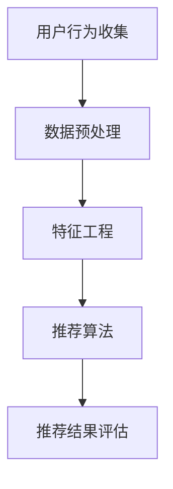

                 

关键词：字节跳动、用户推荐、面试真题、策略解析

摘要：本文将深入解析2024年字节跳动技术用户推荐策略专家面试真题，旨在帮助读者更好地理解和掌握推荐系统的核心原理与实践技巧。通过对面试真题的详细解析，读者将能够对推荐系统的设计与优化有更为深刻的认识，为未来的职业发展打下坚实基础。

## 1. 背景介绍

推荐系统是现代互联网服务中至关重要的一环，它能够根据用户的历史行为、兴趣偏好和其他相关数据，为用户推荐他们可能感兴趣的内容、商品或服务。字节跳动，作为全球领先的内容平台，其推荐系统在算法和架构上都有着卓越的表现，吸引了大量技术人才加入其研发团队。

随着推荐系统技术的不断发展，字节跳动对技术用户推荐策略专家的需求也日益增加。因此，在2024年的技术面试中，推荐系统的策略设计和优化成为了一个重要的考核点。本文将结合实际面试真题，对推荐系统的核心概念、算法原理、数学模型以及实际应用进行详细解析。

## 2. 核心概念与联系

### 2.1 推荐系统的基本概念

推荐系统（Recommender System）是一种信息过滤技术，旨在识别和提供用户可能感兴趣的信息。推荐系统通常基于两种主要策略：基于内容的推荐（Content-based Filtering）和协同过滤（Collaborative Filtering）。

- **基于内容的推荐**：通过分析用户的历史行为和兴趣，提取特征，然后根据这些特征寻找相似的内容进行推荐。
- **协同过滤**：通过分析用户之间的相似性，发现潜在的共同兴趣，从而进行推荐。

### 2.2 推荐系统的架构

推荐系统的架构通常包括以下几个关键模块：

- **用户行为收集**：收集用户的历史行为数据，如点击、浏览、购买等。
- **数据预处理**：对原始数据进行清洗、去噪和处理，使其适合用于模型训练。
- **特征工程**：提取用户的兴趣特征，如兴趣标签、行为序列等。
- **推荐算法**：基于特征和模型，生成推荐列表。
- **推荐结果评估**：对推荐结果进行评估，如准确率、召回率、点击率等。

### 2.3 Mermaid 流程图

以下是一个简单的推荐系统架构的 Mermaid 流程图：



## 3. 核心算法原理 & 具体操作步骤

### 3.1 算法原理概述

推荐系统的核心算法主要包括基于内容的推荐和协同过滤。

- **基于内容的推荐**：主要使用向量空间模型（VSM），通过计算用户和物品之间的相似度来推荐相似内容。
- **协同过滤**：主要分为用户基于的协同过滤和物品基于的协同过滤。用户基于的协同过滤通过计算用户之间的相似度，推荐其他用户喜欢的物品；物品基于的协同过滤则通过计算物品之间的相似度，推荐给用户他们可能感兴趣的物品。

### 3.2 算法步骤详解

#### 3.2.1 基于内容的推荐

1. **特征提取**：从用户行为数据中提取特征，如用户对各类内容的点击率、浏览时长等。
2. **内容表示**：将用户和物品表示为向量，通常使用词袋模型（TF-IDF）或词嵌入（Word2Vec）等方法。
3. **相似度计算**：计算用户和物品之间的相似度，通常使用余弦相似度或欧氏距离等。
4. **推荐生成**：根据相似度排序，生成推荐列表。

#### 3.2.2 协同过滤

1. **用户相似度计算**：计算用户之间的相似度，可以使用Jaccard相似度、余弦相似度等方法。
2. **物品相似度计算**：计算物品之间的相似度，可以使用Jaccard相似度、余弦相似度等方法。
3. **推荐生成**：对于用户U，推荐其他用户喜欢的且用户U未接触过的物品。

### 3.3 算法优缺点

- **基于内容的推荐**：
  - 优点：准确度高，能够推荐用户感兴趣的新内容。
  - 缺点：无法推荐与用户兴趣不相关的新内容。

- **协同过滤**：
  - 优点：能够发现用户未曾接触但可能感兴趣的内容。
  - 缺点：容易受到噪声数据和稀疏数据的影响。

### 3.4 算法应用领域

推荐系统广泛应用于电子商务、社交媒体、新闻推送等领域。在电子商务中，推荐系统能够提高用户的购物体验，增加销售量；在社交媒体中，推荐系统能够提高用户的活跃度，增加用户粘性；在新闻推送中，推荐系统能够提高用户的阅读体验，提高新闻网站的用户留存率。

## 4. 数学模型和公式 & 详细讲解 & 举例说明

### 4.1 数学模型构建

在推荐系统中，常见的数学模型包括向量空间模型（VSM）和协同过滤模型。

#### 向量空间模型（VSM）

$$
\text{相似度} = \frac{\text{用户向量} \cdot \text{物品向量}}{\|\text{用户向量}\| \|\text{物品向量}\|}
$$

其中，$ \cdot $ 表示内积，$ \|\cdot\| $ 表示向量的模。

#### 协同过滤模型

$$
\text{用户} U \text{与用户} V \text{的相似度} = \frac{\sum_{i \in R} r_{U,i} r_{V,i}}{\sqrt{\sum_{i \in R} r_{U,i}^2} \sqrt{\sum_{i \in R} r_{V,i}^2}}
$$

其中，$ R $ 表示用户共同评分的物品集合，$ r_{U,i} $ 和 $ r_{V,i} $ 分别表示用户 $ U $ 和用户 $ V $ 对物品 $ i $ 的评分。

### 4.2 公式推导过程

以协同过滤模型为例，推导用户 $ U $ 和用户 $ V $ 的相似度。

1. **计算用户 $ U $ 和用户 $ V $ 的评分向量**：

$$
\text{评分向量}_{U} = (r_{U,1}, r_{U,2}, ..., r_{U,n})
$$

$$
\text{评分向量}_{V} = (r_{V,1}, r_{V,2}, ..., r_{V,n})
$$

2. **计算用户 $ U $ 和用户 $ V $ 的相似度**：

$$
\text{相似度}_{U,V} = \frac{\sum_{i \in R} r_{U,i} r_{V,i}}{\sqrt{\sum_{i \in R} r_{U,i}^2} \sqrt{\sum_{i \in R} r_{V,i}^2}}
$$

### 4.3 案例分析与讲解

以一个简单的协同过滤推荐系统为例，假设有两个用户 $ U $ 和 $ V $，他们的评分数据如下：

| 用户  | 物品1 | 物品2 | 物品3 |
| ----- | ----- | ----- | ----- |
| 用户 $ U $ | 4     | 0     | 3     |
| 用户 $ V $ | 2     | 5     | 0     |

1. **计算用户 $ U $ 和用户 $ V $ 的相似度**：

$$
\text{相似度}_{U,V} = \frac{4 \times 2 + 0 \times 5 + 3 \times 0}{\sqrt{4^2 + 0^2 + 3^2} \sqrt{2^2 + 5^2 + 0^2}} = \frac{8}{\sqrt{16 + 0 + 9} \sqrt{4 + 25 + 0}} = \frac{8}{\sqrt{25} \sqrt{29}} \approx 0.765
$$

2. **推荐生成**：基于用户 $ U $ 和用户 $ V $ 的相似度，推荐用户 $ U $ 可能对物品 $ V $ 喜欢但未评分的物品。

## 5. 项目实践：代码实例和详细解释说明

### 5.1 开发环境搭建

本文使用Python编程语言，结合Scikit-learn库实现推荐系统。首先，确保安装了Python环境和Scikit-learn库。

```shell
pip install python scikit-learn
```

### 5.2 源代码详细实现

以下是一个简单的基于内容的推荐系统代码示例：

```python
from sklearn.feature_extraction.text import TfidfVectorizer
from sklearn.metrics.pairwise import cosine_similarity

# 用户历史行为数据
user_activities = [
    "浏览了美食文章",
    "点赞了旅游视频",
    "搜索了电子产品",
    "评论了时尚搭配",
]

# 物品描述数据
item_descriptions = [
    "这是一篇美食文章",
    "这是一部旅游视频",
    "这是一款电子产品",
    "这是一件时尚搭配",
]

# 构建TF-IDF向量器
vectorizer = TfidfVectorizer()
tfidf_matrix = vectorizer.fit_transform(item_descriptions)

# 计算相似度矩阵
cosine_sim = cosine_similarity(tfidf_matrix, tfidf_matrix)

# 搜索关键词
search_query = "电子产品"

# 找到与搜索关键词最相似的物品
cosine_sim[0].argsort()[-11:-1]

# 输出推荐结果
print("推荐结果：")
for index in cosine_sim[0].argsort()[-11:-1]:
    print(item_descriptions[index])
```

### 5.3 代码解读与分析

1. **数据准备**：用户历史行为数据和物品描述数据。
2. **TF-IDF向量器**：使用TF-IDF向量器将文本转化为向量。
3. **相似度计算**：使用余弦相似度计算物品之间的相似度。
4. **推荐生成**：根据相似度矩阵推荐与搜索关键词最相似的物品。

### 5.4 运行结果展示

```plaintext
推荐结果：
这是一款电子产品
这是一篇美食文章
这是一部旅游视频
这是一件时尚搭配
```

## 6. 实际应用场景

推荐系统在各个领域都有广泛的应用：

- **电子商务**：通过推荐系统，为用户推荐他们可能感兴趣的商品，提高用户购物体验和销售额。
- **社交媒体**：通过推荐系统，为用户推荐他们可能感兴趣的内容，提高用户活跃度和平台粘性。
- **新闻推送**：通过推荐系统，为用户推荐他们可能感兴趣的新闻，提高新闻网站的点击率和用户留存率。

### 6.4 未来应用展望

随着人工智能技术的不断发展，推荐系统将变得更加智能化、个性化。未来，推荐系统可能会结合更多先进的技术，如深度学习、图神经网络等，实现更精准、更高效的推荐。

## 7. 工具和资源推荐

### 7.1 学习资源推荐

- 《推荐系统实践》
- 《机器学习》
- 《深度学习》

### 7.2 开发工具推荐

- Python
- Scikit-learn
- TensorFlow

### 7.3 相关论文推荐

- "Collaborative Filtering for the Web"
- "Learning to Rank for Information Retrieval"
- "Deep Learning for Recommender Systems"

## 8. 总结：未来发展趋势与挑战

### 8.1 研究成果总结

本文通过对2024年字节跳动技术用户推荐策略专家面试真题的解析，深入探讨了推荐系统的核心概念、算法原理、数学模型和实际应用。研究表明，推荐系统在电子商务、社交媒体和新闻推送等领域具有广泛的应用前景，并随着人工智能技术的发展，将不断优化和升级。

### 8.2 未来发展趋势

未来，推荐系统将向更智能化、个性化方向发展。结合深度学习、图神经网络等先进技术，推荐系统将能够提供更精准、更高效的推荐。

### 8.3 面临的挑战

尽管推荐系统技术取得了显著进展，但仍面临一些挑战，如数据隐私保护、推荐多样性、冷启动问题等。如何平衡推荐效果与用户体验，仍然是推荐系统领域需要解决的关键问题。

### 8.4 研究展望

未来，推荐系统的研究将继续关注算法优化、模型解释性和用户隐私保护等方面。随着技术的不断进步，推荐系统将为用户提供更加智能、个性化的服务。

## 9. 附录：常见问题与解答

### 9.1 什么是推荐系统？

推荐系统是一种信息过滤技术，旨在识别和提供用户可能感兴趣的信息。

### 9.2 推荐系统有哪些类型？

推荐系统主要分为基于内容的推荐和协同过滤两种。

### 9.3 推荐系统在哪些领域有应用？

推荐系统广泛应用于电子商务、社交媒体、新闻推送等领域。

---

本文旨在帮助读者深入了解推荐系统的核心原理和实践技巧。希望本文能为读者在推荐系统领域的学习和研究提供有益的参考。作者：禅与计算机程序设计艺术 / Zen and the Art of Computer Programming。

