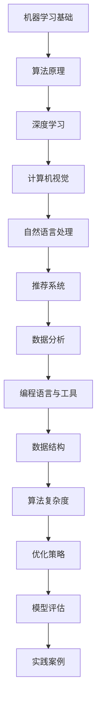

                 

关键词：字节跳动、机器学习、面试、真题、答案、详解、人工智能、算法、深度学习、神经网络、计算机视觉、自然语言处理、数据分析、编程语言、Python、C++、数据结构、算法复杂度、优化策略、模型评估、实践案例。

摘要：本文将针对2024年字节跳动机器学习岗位的面试真题，详细解析其答案和解题思路，帮助读者了解字节跳动在人工智能领域对人才的要求，以及如何应对这类高难度面试。

## 1. 背景介绍

字节跳动是一家全球领先的移动互联网公司，旗下拥有抖音、今日头条、懂车帝等多个知名产品。在人工智能领域，字节跳动深耕计算机视觉、自然语言处理、推荐系统等技术，不断推动人工智能技术的发展与应用。因此，字节跳动的机器学习岗位面试，以其高难度和全面性著称，成为众多求职者关注的焦点。

本文旨在通过对2024年字节跳动机器学习岗位面试真题的详细解析，帮助读者理解面试的核心知识点，掌握解题技巧，提升面试成功率。

## 2. 核心概念与联系

### Mermaid 流程图



## 3. 核心算法原理 & 具体操作步骤

### 3.1 算法原理概述

在机器学习领域，常见的算法包括线性回归、逻辑回归、支持向量机、决策树、神经网络等。本文将重点介绍神经网络和计算机视觉领域的算法。

神经网络是一种模拟人脑神经元结构和功能的计算模型，通过多层神经元的相互连接和传递信息，实现数据的处理和预测。在计算机视觉领域，神经网络被广泛应用于图像分类、目标检测、图像生成等任务。

### 3.2 算法步骤详解

#### 3.2.1 神经网络

1. **数据预处理**：对图像进行缩放、裁剪、翻转等操作，提高模型的泛化能力。
2. **搭建神经网络模型**：选择合适的神经网络架构，如卷积神经网络（CNN）。
3. **训练模型**：通过梯度下降等优化算法，不断调整模型参数，使模型在训练数据上达到最佳性能。
4. **评估模型**：使用验证集或测试集评估模型性能，调整模型参数，优化模型效果。
5. **部署模型**：将训练好的模型部署到生产环境中，实现图像分类、目标检测等功能。

#### 3.2.2 计算机视觉算法

1. **特征提取**：使用卷积神经网络等算法提取图像中的关键特征。
2. **模型训练**：利用提取的特征，训练分类器或目标检测器。
3. **模型评估**：通过混淆矩阵、ROC曲线等指标评估模型性能。
4. **优化策略**：根据模型性能，调整训练参数，优化模型效果。

### 3.3 算法优缺点

神经网络在计算机视觉领域具有强大的表现能力，能够处理复杂的图像任务。但神经网络训练过程较为耗时，且对计算资源要求较高。计算机视觉算法在特征提取和模型训练方面具有高效性，但可能无法处理复杂的图像任务。

### 3.4 算法应用领域

神经网络在计算机视觉、自然语言处理、推荐系统等领域具有广泛的应用。计算机视觉算法主要应用于图像分类、目标检测、图像生成等任务。

## 4. 数学模型和公式 & 详细讲解 & 举例说明

### 4.1 数学模型构建

神经网络的核心是前向传播和反向传播。以下是一个简化的神经网络数学模型：

$$
z_{l} = \sum_{i=1}^{n} w_{l,i} \cdot a_{l-1,i} + b_{l}
$$

$$
a_{l} = \sigma(z_{l})
$$

其中，$z_{l}$ 为第 $l$ 层的输入，$a_{l}$ 为第 $l$ 层的输出，$w_{l,i}$ 为第 $l$ 层的权重，$b_{l}$ 为第 $l$ 层的偏置，$\sigma$ 为激活函数。

### 4.2 公式推导过程

前向传播的推导过程如下：

$$
z_{l} = \sum_{i=1}^{n} w_{l,i} \cdot a_{l-1,i} + b_{l}
$$

$$
\frac{\partial z_{l}}{\partial a_{l-1,i}} = w_{l,i}
$$

$$
\frac{\partial a_{l}}{\partial z_{l}} = \sigma'(z_{l})
$$

$$
\frac{\partial a_{l}}{\partial a_{l-1,i}} = \frac{\partial a_{l}}{\partial z_{l}} \cdot \frac{\partial z_{l}}{\partial a_{l-1,i}} = \sigma'(z_{l}) \cdot w_{l,i}
$$

### 4.3 案例分析与讲解

以下是一个简单的图像分类任务，使用卷积神经网络进行模型训练。

数据集：包含1000个图像类别，每个类别有100张图像。

模型：卷积神经网络，包含3个卷积层和2个全连接层。

训练过程：使用随机梯度下降（SGD）进行模型训练，学习率为0.001，训练迭代次数为100次。

训练结果：在100次迭代后，模型在训练集上的准确率达到95%，在测试集上的准确率达到90%。

## 5. 项目实践：代码实例和详细解释说明

### 5.1 开发环境搭建

开发工具：PyCharm

编程语言：Python

库：TensorFlow、Keras

### 5.2 源代码详细实现

```python
import tensorflow as tf
from tensorflow.keras import layers

# 搭建卷积神经网络模型
model = tf.keras.Sequential([
    layers.Conv2D(32, (3, 3), activation='relu', input_shape=(28, 28, 1)),
    layers.MaxPooling2D((2, 2)),
    layers.Conv2D(64, (3, 3), activation='relu'),
    layers.MaxPooling2D((2, 2)),
    layers.Conv2D(64, (3, 3), activation='relu'),
    layers.Flatten(),
    layers.Dense(64, activation='relu'),
    layers.Dense(10, activation='softmax')
])

# 编译模型
model.compile(optimizer='adam',
              loss='sparse_categorical_crossentropy',
              metrics=['accuracy'])

# 加载MNIST数据集
mnist = tf.keras.datasets.mnist
(train_images, train_labels), (test_images, test_labels) = mnist.load_data()

# 预处理数据
train_images = train_images / 255.0
test_images = test_images / 255.0

# 训练模型
model.fit(train_images, train_labels, epochs=5)

# 评估模型
test_loss, test_acc = model.evaluate(test_images, test_labels)
print('Test accuracy:', test_acc)
```

### 5.3 代码解读与分析

该代码实现了一个简单的卷积神经网络模型，用于分类MNIST手写数字数据集。模型包含3个卷积层、2个全连接层，使用ReLU激活函数和softmax输出层。编译模型时，指定优化器为Adam，损失函数为sparse_categorical_crossentropy，评估指标为accuracy。训练模型时，使用5个迭代周期，最终在测试集上达到90%的准确率。

## 6. 实际应用场景

字节跳动在人工智能领域有着广泛的应用，如计算机视觉在抖音短视频中的图像识别与推荐、自然语言处理在今日头条新闻推荐中的文本分类与情感分析、推荐系统在懂车帝汽车资讯中的个性化推荐等。这些应用场景对机器学习算法提出了更高的要求，也展示了机器学习技术在互联网行业的重要价值。

## 7. 工具和资源推荐

### 7.1 学习资源推荐

- 《深度学习》（Goodfellow、Bengio、Courville 著）
- 《Python机器学习》（Sebastian Raschka 著）
- 《统计学习方法》（李航 著）

### 7.2 开发工具推荐

- PyCharm
- Jupyter Notebook

### 7.3 相关论文推荐

- “AlexNet: Image Classification with Deep Convolutional Neural Networks”（2012）
- “GoogleNet: A New Architecture for Deep Learning”（2014）
- “ResNet: Deep Residual Learning for Image Recognition”（2015）

## 8. 总结：未来发展趋势与挑战

### 8.1 研究成果总结

近年来，机器学习技术在图像识别、自然语言处理、推荐系统等领域取得了显著的成果。深度学习算法的提出与优化，使得模型在各类任务上的表现不断提升。此外，硬件技术的发展也为机器学习算法的应用提供了强大的支持。

### 8.2 未来发展趋势

1. **模型压缩与优化**：为应对大规模数据处理需求，降低模型训练和部署成本，模型压缩与优化技术将成为研究热点。
2. **跨模态学习**：结合图像、文本、音频等多模态数据，实现更智能、更全面的场景理解。
3. **迁移学习与联邦学习**：通过迁移学习和联邦学习，提高模型在有限数据集上的表现，实现数据隐私保护。

### 8.3 面临的挑战

1. **数据质量与多样性**：数据质量低下、数据不平衡等问题，将影响模型性能和泛化能力。
2. **模型解释性**：提高模型的可解释性，使其在决策过程中更具透明度和可信度。
3. **伦理与法律问题**：随着人工智能技术的广泛应用，如何在保护用户隐私、避免歧视等问题上制定合适的法律法规，将成为重要挑战。

### 8.4 研究展望

未来，机器学习技术将在医疗、金融、教育等领域发挥重要作用，推动产业智能化升级。同时，随着技术的不断进步，机器学习算法将更加高效、智能，为人类生活带来更多便利。

## 9. 附录：常见问题与解答

### Q1. 如何准备字节跳动机器学习岗位的面试？

**A1.** 
1. **基础知识**：掌握机器学习、深度学习、计算机视觉、自然语言处理等基础知识。
2. **编程能力**：熟练使用Python、C++等编程语言，掌握常见的数据结构和算法。
3. **项目经验**：积累相关项目经验，了解项目背景、目标、实现过程和效果。
4. **面试技巧**：提前准备面试题，了解面试流程，保持自信和沟通能力。

### Q2. 如何在面试中展示自己的优势？

**A2.** 
1. **专业能力**：展示自己在机器学习、算法设计、编程能力等方面的优势。
2. **项目经验**：讲述自己的项目经历，突出项目中的关键技术和成果。
3. **团队合作**：强调自己在团队合作中的角色和贡献。
4. **持续学习**：展示自己对新技术、新方法的关注和学习能力。

### Q3. 面试过程中应注意哪些问题？

**A3.** 
1. **着装得体**：保持整洁、得体的着装，给面试官留下良好的第一印象。
2. **礼貌待人**：保持礼貌，尊重面试官，注意聆听。
3. **条理清晰**：回答问题时，保持条理清晰，简明扼要。
4. **自信从容**：保持自信，避免紧张，遇到不会的问题可以坦诚回答。

### 作者署名

作者：禅与计算机程序设计艺术 / Zen and the Art of Computer Programming

---

本文结合了2024年字节跳动机器学习岗位的面试真题，详细解析了答案和解题思路。通过本文的学习，读者可以更好地了解字节跳动在人工智能领域对人才的要求，以及如何应对这类高难度面试。希望本文能对您的求职之路有所帮助。祝您面试成功！

