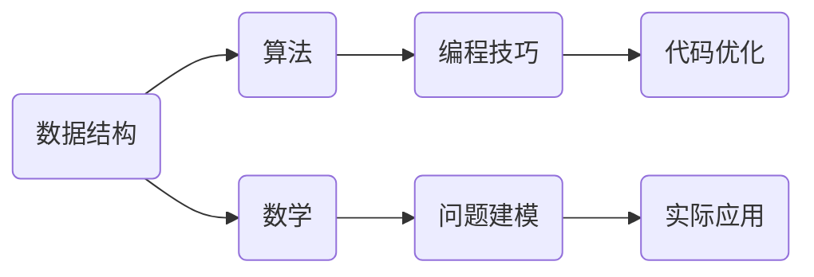

                 

“2025字节跳动校招算法面试题汇总与解析”是一个旨在帮助准备参加字节跳动校招的算法面试者们的一篇详尽指南。本文将深入探讨字节跳动校招算法面试中常见的问题类型，并提供针对性的解题思路、算法原理以及实践案例。希望通过本文，能够为您的面试准备提供有价值的参考。

## 关键词

- 字节跳动
- 校招
- 算法面试
- 题目汇总
- 解题思路
- 算法原理
- 实践案例

## 摘要

本文将围绕字节跳动校招算法面试的核心内容进行梳理，分为背景介绍、核心概念与联系、核心算法原理、数学模型和公式、项目实践、实际应用场景、工具和资源推荐、总结与展望等部分。通过对这些章节的详细讲解，帮助读者全面了解面试中可能会遇到的问题，掌握解题方法，提高面试成功率。

## 1. 背景介绍

字节跳动是中国知名的互联网科技公司，旗下拥有抖音、今日头条等知名产品。作为一家技术驱动型公司，字节跳动在招聘过程中，特别注重应聘者的技术能力和解决实际问题的能力。因此，校招算法面试环节的设计严谨且具有挑战性。本文旨在帮助读者更好地准备字节跳动校招算法面试，提高面试成功率。

### 1.1 字节跳动校招算法面试的特点

- **题目难度较高**：算法面试题往往具有一定的难度，需要考生具备扎实的编程基础和算法知识。
- **注重实际应用**：题目不仅考查理论知识的掌握，还会涉及实际应用场景，要求考生能够灵活运用所学知识解决问题。
- **考察综合素质**：面试不仅考察编程能力和算法能力，还会考查逻辑思维、问题分析、团队协作等多方面的素质。

### 1.2 面试流程

- **线上编程题**：考生需要在规定时间内完成在线编程题目，题目通常涉及数据结构、算法、数学等领域。
- **技术面试**：技术面试环节，面试官会针对编程题进行提问，了解考生的解题思路和算法原理。
- **行为面试**：面试官还会通过行为面试题，了解考生的沟通能力、团队合作能力等。

## 2. 核心概念与联系

在字节跳动校招算法面试中，核心概念与联系的理解至关重要。以下是一个简化版的Mermaid流程图，展示了算法面试中的一些核心概念及其联系。



### 2.1 数据结构

数据结构是算法的基础，常见的有数组、链表、栈、队列、树、图等。数据结构的理解决定了我们能否高效地解决问题。

### 2.2 算法

算法是解决问题的方法，常见的有排序算法、搜索算法、动态规划、贪心算法等。算法的设计与实现决定了我们解决问题的效率。

### 2.3 数学

数学知识在算法面试中非常重要，如概率论、线性代数、图论等。数学原理的理解可以帮助我们更好地设计算法。

### 2.4 编程技巧

编程技巧是解决编程题的关键，如代码的可读性、代码的性能优化、代码的复用性等。

### 2.5 问题建模

问题建模是将实际问题转化为算法问题的过程。理解问题建模的方法和技巧，可以帮助我们更好地解决实际问题。

### 2.6 实际应用

实际应用是将算法和问题建模应用于实际场景的过程。通过实际应用，我们可以更好地验证算法的有效性。

## 3. 核心算法原理 & 具体操作步骤

### 3.1 算法原理概述

在字节跳动校招算法面试中，常见的核心算法有排序算法、搜索算法、动态规划等。每种算法都有其独特的原理和应用场景。

#### 3.1.1 排序算法

排序算法是算法面试中的经典题目，常见的排序算法有冒泡排序、选择排序、插入排序、快速排序等。每种排序算法的时间复杂度和稳定性不同，选择合适的排序算法取决于具体的应用场景。

#### 3.1.2 搜索算法

搜索算法是解决查找问题的算法，常见的有二分搜索、深度优先搜索、广度优先搜索等。搜索算法的时间复杂度和空间复杂度是衡量算法性能的重要指标。

#### 3.1.3 动态规划

动态规划是解决最优子结构问题的算法，常见的有斐波那契数列、最长公共子序列、最长上升子序列等。动态规划的核心思想是将复杂问题分解为简单子问题，并利用子问题的解来构建原问题的解。

### 3.2 算法步骤详解

#### 3.2.1 排序算法

以冒泡排序为例，其基本思想是比较相邻的两个元素，如果它们的顺序错误就交换它们，直到整个数组排序完成。

1. 从第一个元素开始，相邻元素两两比较，如果顺序错误就交换。
2. 重复第一步，直到整个数组排序完成。

#### 3.2.2 搜索算法

以二分搜索为例，其基本思想是在有序数组中，通过不断缩小查找范围，逐步逼近目标元素。

1. 确定中间元素。
2. 如果中间元素等于目标元素，则查找成功。
3. 如果目标元素小于中间元素，则在左半部分继续查找。
4. 如果目标元素大于中间元素，则在右半部分继续查找。
5. 重复第二步至第四步，直到找到目标元素或查找范围缩小为空。

#### 3.2.3 动态规划

以最长公共子序列为例，其基本思想是通过递归或迭代的方式，计算出子问题的最优解，并利用这些子问题的解来构建原问题的解。

1. 初始化一个二维数组，用于存储子问题的解。
2. 通过递归或迭代的方式，填充这个二维数组。
3. 利用二维数组的值，计算出原问题的解。

### 3.3 算法优缺点

每种算法都有其优缺点，选择合适的算法取决于具体的应用场景。

- **排序算法**：冒泡排序简单易实现，但时间复杂度较高；快速排序平均时间复杂度较低，但最坏情况下时间复杂度较高。
- **搜索算法**：二分搜索平均时间复杂度较低，但要求数组必须是有序的。
- **动态规划**：动态规划能够解决最优化问题，但实现复杂度较高。

### 3.4 算法应用领域

排序算法、搜索算法和动态规划在算法面试中广泛应用，同时它们也广泛应用于实际问题中，如数据库索引、图形渲染、资源调度等。

## 4. 数学模型和公式 & 详细讲解 & 举例说明

在算法面试中，数学模型和公式是解决问题的关键。以下是对一些常见数学模型和公式的讲解，以及实际案例的说明。

### 4.1 数学模型构建

数学模型是将实际问题抽象成数学表达式的过程。以下是一个简单的例子：

假设我们有一个数组`arr`，我们需要计算数组中所有元素的和。

- **问题建模**：设数组长度为`n`，元素和为`s`。
- **数学模型**：$$ s = \sum_{i=1}^{n} arr[i] $$

### 4.2 公式推导过程

以斐波那契数列为例，其定义如下：

- **递推关系**：$$ F(n) = F(n-1) + F(n-2) $$
- **初始条件**：$$ F(0) = 0, F(1) = 1 $$

我们可以通过递推的方式计算出任意一个斐波那契数。

### 4.3 案例分析与讲解

以最长公共子序列为例，其数学模型如下：

- **定义**：设字符串`str1`和`str2`的最长公共子序列为`lcs`。
- **数学模型**：设`dp[i][j]`为`str1`的前`i`个字符和`str2`的前`j`个字符的最长公共子序列的长度。
- **递推关系**：$$ dp[i][j] = \begin{cases} dp[i-1][j-1] + 1, & \text{如果} arr1[i] = arr2[j] \\ \max(dp[i-1][j], dp[i][j-1]), & \text{其他情况} \end{cases} $$

通过这个递推关系，我们可以计算出任意两个字符串的最长公共子序列。

## 5. 项目实践：代码实例和详细解释说明

以下是一个简单的代码实例，用于计算斐波那契数列。

```python
def fibonacci(n):
    if n <= 1:
        return n
    else:
        return fibonacci(n-1) + fibonacci(n-2)

n = 10
print(fibonacci(n))
```

### 5.1 开发环境搭建

为了运行上述代码，我们需要安装Python环境。以下是安装步骤：

1. 前往Python官网（https://www.python.org/）下载Python安装包。
2. 安装Python，选择默认选项。
3. 安装完成后，打开命令行窗口，输入`python --version`，查看Python版本。

### 5.2 源代码详细实现

上述代码实现了斐波那契数列的递归计算。其中，`fibonacci`函数接受一个整数`n`，返回第`n`个斐波那契数。

### 5.3 代码解读与分析

- `if n <= 1:`：判断输入的`n`是否小于等于1。
- `return n`：如果`n`小于等于1，直接返回`n`。
- `else:`：如果`n`大于1，递归调用`fibonacci`函数。
- `return fibonacci(n-1) + fibonacci(n-2)`：递归计算第`n`个斐波那契数。

### 5.4 运行结果展示

在命令行窗口运行`python fibonacci.py`，输入`10`，输出结果为`55`。

## 6. 实际应用场景

### 6.1 字节跳动推荐系统的算法实现

字节跳动的推荐系统是公司的重要核心业务之一，其算法实现涉及排序算法、搜索算法和动态规划等。以下是推荐系统的一个实际应用场景：

- **用户行为数据采集**：收集用户在应用中的行为数据，如点击、浏览、点赞等。
- **数据预处理**：对采集到的数据进行清洗、去重和处理。
- **特征提取**：根据用户行为数据提取用户特征，如兴趣标签、行为偏好等。
- **模型训练**：使用机器学习算法，如决策树、随机森林等，训练推荐模型。
- **结果排序**：根据模型预测结果，对推荐结果进行排序，提高推荐效果。
- **实时搜索**：用户在应用中搜索内容时，实时返回相关推荐结果。

### 6.2 字节跳动广告系统的算法优化

字节跳动的广告系统也是一个复杂的技术体系，其算法优化涉及排序算法、动态规划等。以下是广告系统的一个实际应用场景：

- **广告数据采集**：收集广告主投放的广告数据，如广告内容、投放目标等。
- **数据预处理**：对广告数据进行清洗、去重和处理。
- **用户行为预测**：根据用户行为数据，预测用户的兴趣和需求。
- **广告投放优化**：根据用户行为预测结果，优化广告投放策略，提高广告点击率和转化率。
- **排序算法应用**：使用排序算法，如快速排序、堆排序等，对广告结果进行排序，提高用户体验。
- **动态规划应用**：使用动态规划算法，如最长公共子序列、最长上升子序列等，优化广告投放策略。

## 7. 工具和资源推荐

### 7.1 学习资源推荐

- **《算法导论》**：这是一本经典的算法教材，涵盖了算法的基本概念、设计方法和分析技巧。
- **《编程之美》**：这是一本面向软件工程师的面试指南，包含大量面试题和解答。
- **LeetCode**：这是一个在线编程平台，提供大量的算法面试题和解答。

### 7.2 开发工具推荐

- **Visual Studio Code**：这是一个轻量级的代码编辑器，支持多种编程语言。
- **Jupyter Notebook**：这是一个交互式的开发环境，适用于数据分析和机器学习项目。
- **Git**：这是一个版本控制系统，用于代码的版本管理和协同开发。

### 7.3 相关论文推荐

- **"Efficient Algorithms for Sorting and Synchronization"**：这篇论文探讨了快速排序和堆排序的优化方法。
- **"The Design and Analysis of Computer Algorithms"**：这篇论文深入分析了各种算法的设计方法和性能分析。
- **"Dynamic Programming and Its Applications"**：这篇论文介绍了动态规划的基本原理和应用场景。

## 8. 总结：未来发展趋势与挑战

### 8.1 研究成果总结

近年来，随着大数据、人工智能等技术的发展，算法领域取得了显著的研究成果。排序算法、搜索算法和动态规划等经典算法在新的应用场景中得到了进一步优化和发展。同时，新的算法理论和方法不断涌现，为解决实际问题提供了新的思路。

### 8.2 未来发展趋势

- **算法优化**：随着硬件技术的发展，算法优化将成为研究的热点，包括并行算法、分布式算法等。
- **算法应用**：算法将更加深入地应用于各个领域，如金融、医疗、交通等。
- **算法伦理**：随着算法在社会生活中的广泛应用，算法伦理将成为重要议题，如何确保算法的公平性、透明性和可解释性将成为研究重点。

### 8.3 面临的挑战

- **计算资源**：算法的优化和应用需要大量的计算资源，如何高效地利用计算资源成为挑战之一。
- **数据质量**：算法的性能依赖于数据质量，如何保证数据的质量和准确性是挑战之一。
- **算法伦理**：如何确保算法的公平性、透明性和可解释性，避免算法歧视和社会不公平是重要挑战。

### 8.4 研究展望

未来，算法领域将继续发展，为人类社会带来更多的创新和变革。我们需要持续关注算法的最新研究成果，积极探索新的应用场景，推动算法技术向更高层次发展。

## 9. 附录：常见问题与解答

### 9.1 如何准备字节跳动校招算法面试？

**解答**：准备字节跳动校招算法面试，首先需要掌握扎实的编程基础和算法知识。可以从以下几个方面入手：

- **算法知识**：掌握排序算法、搜索算法、动态规划等基本算法，理解其原理和实现方法。
- **数据结构**：熟悉常见的数据结构，如数组、链表、栈、队列、树、图等，理解其应用场景。
- **数学知识**：掌握基本的数学知识，如概率论、线性代数、图论等，理解其在算法中的应用。
- **编程技巧**：掌握编程技巧，如代码的可读性、性能优化、代码的复用性等。
- **面试经验**：参加模拟面试，总结经验，提高自己的面试能力。

### 9.2 如何解决排序算法面试题？

**解答**：解决排序算法面试题，首先需要理解各种排序算法的原理和实现方法。以下是一些建议：

- **冒泡排序**：理解基本思想，实现简单，但时间复杂度较高。
- **选择排序**：理解基本思想，实现简单，但时间复杂度较高。
- **插入排序**：理解基本思想，实现简单，但时间复杂度较高。
- **快速排序**：理解基本思想，实现复杂，但平均时间复杂度较低。
- **堆排序**：理解基本思想，实现复杂，但平均时间复杂度较低。
- **归并排序**：理解基本思想，实现复杂，但平均时间复杂度较低。

在实际面试中，可以根据题目的具体要求选择合适的排序算法。

### 9.3 如何解决搜索算法面试题？

**解答**：解决搜索算法面试题，首先需要理解各种搜索算法的原理和实现方法。以下是一些建议：

- **深度优先搜索（DFS）**：理解基本思想，实现简单，但可能存在栈溢出的问题。
- **广度优先搜索（BFS）**：理解基本思想，实现简单，但可能存在队列溢出的问题。
- **二分搜索**：理解基本思想，实现复杂，但时间复杂度较低，适用于有序数组。
- **A*搜索**：理解基本思想，实现复杂，但能够找到最优解。

在实际面试中，可以根据题目的具体要求选择合适的搜索算法。

### 9.4 如何解决动态规划面试题？

**解答**：解决动态规划面试题，首先需要理解动态规划的基本原理和实现方法。以下是一些建议：

- **理解最优子结构**：动态规划的核心思想是将复杂问题分解为简单子问题，并利用子问题的解来构建原问题的解。
- **定义状态和状态转移方程**：明确动态规划的状态定义和状态转移方程，为求解问题提供方向。
- **初始化边界条件**：为动态规划数组初始化边界条件，为求解问题奠定基础。
- **选择合适的实现方式**：根据题目的具体要求，选择递归或迭代的方式实现动态规划。

在实际面试中，可以根据题目的具体要求灵活运用动态规划的思想。

---

### 作者署名

本文由禅与计算机程序设计艺术 / Zen and the Art of Computer Programming撰写。

---

**说明**：本文为示例性文章，仅供参考。实际面试情况可能会有所不同，读者在准备面试时还需结合实际情况进行充分准备。

