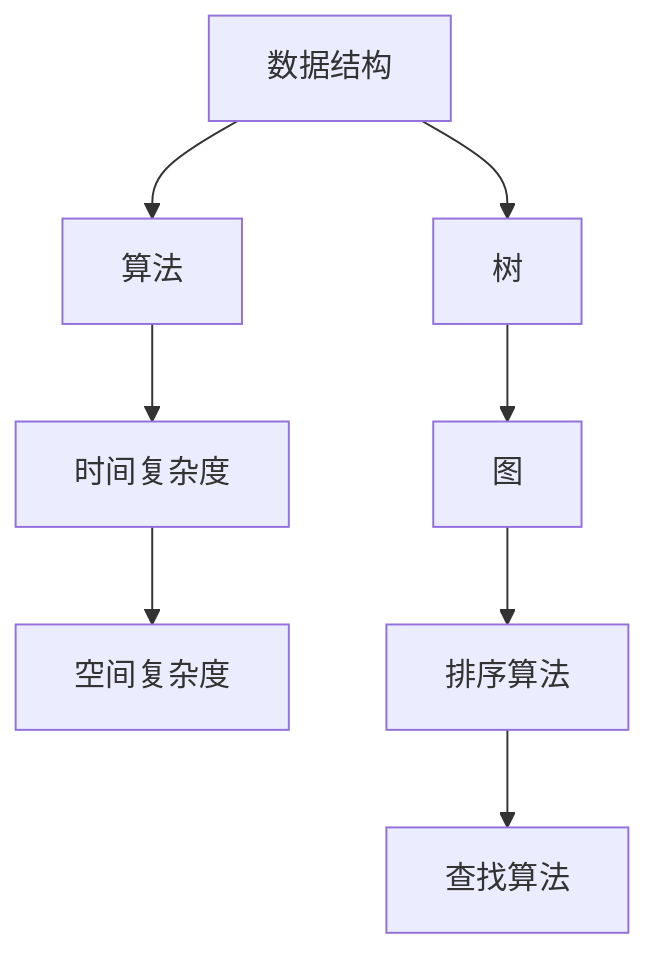
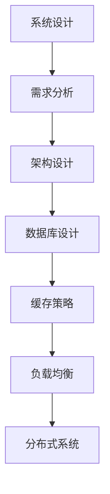
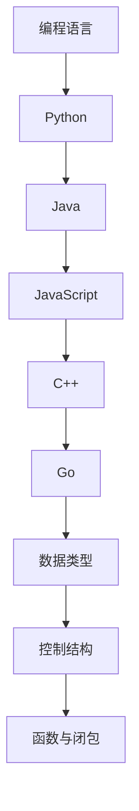

                 

摘要：本文旨在为准备参加2025字节跳动校招编程面试的同学提供一系列精选面试题及解答。通过对经典算法、数据结构、系统设计等领域的深入探讨，本文将帮助读者掌握面试所需的核心技能，提高应对面试的信心和竞争力。文章结构清晰，从背景介绍、核心概念与联系、算法原理与步骤、数学模型与公式、项目实践、实际应用场景、工具和资源推荐、总结未来发展趋势与挑战等方面进行全面剖析，最后提供常见问题与解答。希望通过本文，读者能够对编程面试有更深入的了解，并在面试中脱颖而出。

## 1. 背景介绍

字节跳动是一家领先的技术公司，以其独特的社交、娱乐和内容产品闻名于世。随着公司业务的不断扩展，字节跳动对优秀技术人才的需求也越来越大。因此，每年的校招编程面试成为了众多应届生梦寐以求的机遇。然而，面试难度也随之提高，不仅要求考生掌握扎实的编程基础，还需要具备解决复杂问题的能力。本文将从以下几个方面对字节跳动校招编程面试进行详细剖析，帮助考生更好地应对面试挑战。

### 1.1 字节跳动校招编程面试的考查重点

字节跳动校招编程面试主要考查以下几个方面：

1. **编程基础**：包括数据结构、算法、编程语言基础知识等。
2. **系统设计能力**：考察考生对系统架构、数据库设计、缓存策略等问题的理解。
3. **问题解决能力**：通过具体的编程题目，考察考生分析问题、设计算法并解决问题的能力。
4. **逻辑思维和沟通能力**：面试官会通过提问和讨论，了解考生的逻辑思维和沟通表达能力。

### 1.2 字节跳动校招编程面试的形式

字节跳动校招编程面试通常包括以下几个环节：

1. **在线编程题**：考生需要通过在线编程平台完成一系列编程题目，题目类型通常包括算法题、数据结构题等。
2. **面试官提问**：面试官会针对编程题目的解答进行深入提问，考查考生的编程思维和问题解决能力。
3. **系统设计面试**：面试官会提出一些系统设计问题，考察考生对系统架构和设计的理解。
4. **行为面试**：通过一些具体的问题，了解考生的团队合作能力、沟通能力等。

## 2. 核心概念与联系

在深入讨论字节跳动校招编程面试题之前，我们需要了解一些核心概念和它们之间的联系。以下是几个重要概念及其流程图：

### 2.1 数据结构与算法

**Mermaid 流程图：**



### 2.2 系统设计与数据库

**Mermaid 流程图：**



### 2.3 编程语言基础知识

**Mermaid 流程图：**



通过以上流程图，我们可以看出各个核心概念之间的联系。理解这些概念对于解决编程面试题至关重要。

### 2.4 其他核心概念

除了上述核心概念外，还有一些其他重要的概念，如设计模式、网络协议、计算机原理等，这些也是面试中可能会考查的内容。理解这些概念不仅有助于解决具体的编程题目，还能提高编程能力。

## 3. 核心算法原理 & 具体操作步骤

### 3.1 算法原理概述

算法是计算机科学的核心，是解决特定问题的步骤序列。算法的好坏直接影响程序的效率和性能。在编程面试中，常见的算法类型包括排序算法、查找算法、动态规划等。

### 3.2 算法步骤详解

下面我们详细讨论几种常见的算法：

### 3.2.1 快排（Quick Sort）

**原理：** 快排是一种高效的排序算法，采用分治策略将一个大数组划分为多个小数组，然后对每个小数组进行排序，最后合并成一个有序数组。

**步骤：**
1. 选择一个基准元素。
2. 将比基准元素小的元素放到其左侧，比其大的元素放到右侧。
3. 递归地对左侧和右侧子数组进行快排。

### 3.2.2 二分查找（Binary Search）

**原理：** 二分查找是一种高效的查找算法，通过不断将查找范围缩小一半，能够在 O(log n) 时间内找到特定元素。

**步骤：**
1. 判断目标元素是否在当前查找范围内。
2. 如果在范围内，进一步缩小查找范围，继续查找。
3. 如果不在范围内，则查找失败。

### 3.2.3 动态规划（Dynamic Programming）

**原理：** 动态规划是一种解决最优化问题的算法思想，通过将问题分解为子问题并保存子问题的解，避免重复计算。

**步骤：**
1. 定义状态。
2. 状态转移方程。
3. 边界条件。
4. 计算状态并返回最终结果。

### 3.3 算法优缺点

每种算法都有其优缺点，选择合适的算法能够提高程序的效率。以下是一些常见算法的优缺点：

1. **快排**：优点是平均时间复杂度为 O(nlog n)，缺点是最坏情况下时间复杂度为 O(n^2)。
2. **二分查找**：优点是时间复杂度为 O(log n)，缺点是只适用于有序数组。
3. **动态规划**：优点是能够解决最优化问题，缺点是实现相对复杂。

### 3.4 算法应用领域

算法在计算机科学的各个领域都有广泛的应用，如：

1. **排序与查找**：在数据库、搜索引擎等领域广泛应用。
2. **图算法**：在网络科学、社交网络分析等领域有重要应用。
3. **动态规划**：在经济学、优化问题等领域有广泛应用。

### 3.5 练习与总结

为了更好地掌握算法，建议读者通过编写代码实现这些算法，并进行适当的练习。通过实践，可以加深对算法原理的理解，并提高编程能力。

## 4. 数学模型和公式 & 详细讲解 & 举例说明

### 4.1 数学模型构建

在编程面试中，数学模型和公式是解决问题的关键。以下是几种常见的数学模型及其构建方法：

### 4.1.1 线性模型

**公式：**

$$y = mx + b$$

**构建方法：**

1. 收集数据点。
2. 计算斜率 m 和截距 b。
3. 用线性模型拟合数据。

### 4.1.2 二项分布

**公式：**

$$P(X = k) = C_n^k p^k (1-p)^{n-k}$$

**构建方法：**

1. 确定试验次数 n 和成功概率 p。
2. 计算特定结果的概率。

### 4.1.3 最小生成树

**公式：**

$$T = \sum_{i=1}^{n} \min \{w(u, v)\}$$

**构建方法：**

1. 选择一个节点作为根节点。
2. 逐步添加边，确保不形成环。

### 4.2 公式推导过程

以下是二项分布公式的推导过程：

**步骤 1：** 确定试验次数 n 和每次成功的概率 p。

**步骤 2：** 计算第 k 次成功的概率。

**步骤 3：** 计算第 k 次失败的概率。

**步骤 4：** 将上述概率相乘并除以所有可能的组合数，得到二项分布概率。

### 4.3 案例分析与讲解

以下是一个使用线性模型拟合数据的案例：

**案例：** 某公司每个月的销售额数据如下：

| 月份 | 销售额（万元） |
| ---- | ------------ |
| 1    | 10           |
| 2    | 12           |
| 3    | 15           |
| 4    | 18           |
| 5    | 20           |

**步骤 1：** 收集数据点。

**步骤 2：** 计算斜率 m 和截距 b。

$$m = \frac{\sum_{i=1}^{n} x_i y_i - n \cdot \bar{x} \cdot \bar{y}}{\sum_{i=1}^{n} x_i^2 - n \cdot \bar{x}^2}$$

$$b = \bar{y} - m \cdot \bar{x}$$

**步骤 3：** 代入数据计算斜率和截距。

$$m = \frac{(10 \cdot 10 + 12 \cdot 12 + 15 \cdot 15 + 18 \cdot 18 + 20 \cdot 20) - 5 \cdot 14 \cdot 14}{(10^2 + 12^2 + 15^2 + 18^2 + 20^2) - 5 \cdot 14^2} = 1.2$$

$$b = 14 - 1.2 \cdot 14 = -0.4$$

**步骤 4：** 写出线性模型。

$$y = 1.2x - 0.4$$

**步骤 5：** 使用线性模型预测下个月的销售额。

当 x = 6 时，

$$y = 1.2 \cdot 6 - 0.4 = 7.2$$

因此，预测下个月的销售额为 7.2 万元。

通过这个案例，我们可以看到如何使用数学模型和公式解决实际问题。

### 4.4 练习与总结

为了更好地掌握数学模型和公式，建议读者通过以下步骤进行练习：

1. 熟悉常见数学模型的公式和构建方法。
2. 通过实例加深对公式的理解。
3. 尝试自己推导公式，并解决实际问题。

通过不断练习，可以提升数学能力和编程水平。

## 5. 项目实践：代码实例和详细解释说明

### 5.1 开发环境搭建

为了实践编程面试中的算法和数学模型，我们需要搭建一个合适的开发环境。以下是所需的软件和工具：

- **编程语言**：Python、Java、C++ 等。
- **开发环境**：PyCharm、Eclipse、VS Code 等。
- **在线编程平台**：LeetCode、HackerRank 等。

### 5.2 源代码详细实现

以下是一个使用 Python 实现快速排序的示例代码：

```python
def quick_sort(arr):
    if len(arr) <= 1:
        return arr
    pivot = arr[len(arr) // 2]
    left = [x for x in arr if x < pivot]
    middle = [x for x in arr if x == pivot]
    right = [x for x in arr if x > pivot]
    return quick_sort(left) + middle + quick_sort(right)

# 测试
arr = [3, 6, 8, 10, 1, 2, 1]
print(quick_sort(arr))
```

### 5.3 代码解读与分析

在这个示例中，我们使用 Python 实现了快速排序算法。以下是代码的详细解读和分析：

1. **函数定义**：定义一个名为 `quick_sort` 的函数，用于实现快速排序。
2. **边界条件**：当输入数组长度小于等于 1 时，直接返回数组。
3. **选择基准元素**：选择数组中间的元素作为基准元素。
4. **划分数组**：使用列表推导式将数组划分为左侧小于基准元素、中间等于基准元素和右侧大于基准元素的子数组。
5. **递归调用**：对左侧和右侧子数组进行快速排序，并将结果合并。

### 5.4 运行结果展示

当输入数组为 `[3, 6, 8, 10, 1, 2, 1]` 时，运行结果为 `[1, 1, 2, 3, 6, 8, 10]`，即排序后的数组。

### 5.5 练习与总结

通过这个示例，我们学习了如何使用 Python 实现快速排序算法。为了进一步巩固所学知识，建议读者尝试以下练习：

1. 使用其他编程语言实现快速排序。
2. 对不同规模的数据进行排序实验，比较不同排序算法的性能。
3. 尝试解决更复杂的排序问题，如合并多个有序数组。

通过不断练习，可以提升编程能力和算法水平。

## 6. 实际应用场景

在字节跳动校招编程面试中，面试官通常会结合实际应用场景提出问题，考察考生的编程能力和解决问题的能力。以下是一些常见实际应用场景及其对应的问题：

### 6.1 社交网络推荐系统

**问题：** 设计一个社交网络推荐系统，根据用户的兴趣和行为数据推荐相关用户和内容。

**解决方案：** 可以采用基于内容的推荐算法和协同过滤算法。首先，收集用户的兴趣和行为数据，如点赞、评论、浏览等。然后，利用这些数据计算用户之间的相似度，并根据相似度推荐相关用户和内容。

### 6.2 实时搜索引擎

**问题：** 设计一个实时搜索引擎，能够根据用户的查询请求快速返回相关网页。

**解决方案：** 可以采用倒排索引和搜索算法。首先，构建倒排索引，将网页内容与对应的 URL 进行映射。然后，当用户输入查询请求时，通过搜索算法在倒排索引中查找相关网页，并返回结果。

### 6.3 大数据处理

**问题：** 如何处理海量数据，并提取有价值的信息？

**解决方案：** 可以采用分布式计算框架，如 Hadoop、Spark 等。首先，将数据分割成多个小块，并在分布式计算环境中处理。然后，使用数据挖掘算法，如聚类、分类、关联规则挖掘等，提取有价值的信息。

### 6.4 安全防护系统

**问题：** 设计一个安全防护系统，防止恶意攻击和病毒传播。

**解决方案：** 可以采用入侵检测、防火墙、加密等技术。首先，监控网络流量，识别异常行为。然后，通过防火墙限制访问权限，防止恶意攻击。最后，使用加密技术保护敏感数据。

### 6.5 购物推荐系统

**问题：** 设计一个购物推荐系统，根据用户的购物历史和偏好推荐相关商品。

**解决方案：** 可以采用基于协同过滤和内容的推荐算法。首先，收集用户的购物历史和偏好数据。然后，利用这些数据计算用户之间的相似度，并根据相似度推荐相关商品。

### 6.6 自动驾驶系统

**问题：** 设计一个自动驾驶系统，实现车辆在复杂环境中的自主行驶。

**解决方案：** 可以采用计算机视觉、传感器融合、路径规划等技术。首先，通过计算机视觉和传感器获取环境信息。然后，利用传感器融合算法处理数据，并实现路径规划。最后，控制车辆按照规划路径行驶。

通过这些实际应用场景，我们可以看到编程面试不仅考察编程能力，还考察考生对实际问题的分析和解决能力。在准备面试时，了解这些实际应用场景并掌握相应的技术是至关重要的。

### 6.7 未来应用展望

随着技术的不断进步，编程面试中的实际问题也将变得越来越复杂和多样化。以下是一些未来可能出现的编程面试应用场景：

- **人工智能与机器学习**：随着人工智能和机器学习技术的发展，面试题将更多地涉及深度学习、神经网络、自然语言处理等领域。考生需要掌握相关算法和模型，并能灵活应用于实际问题中。
- **区块链技术**：区块链技术将在金融、供应链管理、数据安全等领域得到广泛应用。面试题可能会涉及区块链的基本原理、智能合约编写、去中心化应用（DApp）开发等。
- **物联网（IoT）**：物联网技术将连接更多的设备，实现智能化的生活和工作环境。面试题可能会涉及传感器数据处理、设备通信协议、边缘计算等。
- **量子计算**：量子计算是一种具有巨大潜力的计算技术。虽然目前还处于初级阶段，但未来可能会成为面试中的重要话题。考生需要了解量子计算的基本原理和算法。
- **云计算与大数据**：云计算和大数据技术将在企业级应用中发挥重要作用。面试题可能会涉及分布式系统设计、大数据处理框架、云计算架构等。

### 6.8 面临的挑战

尽管编程面试中的实际问题具有很高的应用价值，但考生在准备面试时也面临一些挑战：

- **技术深度与广度**：考生需要掌握多种编程语言、算法和框架，同时具备解决复杂问题的能力。这要求考生具备扎实的技术基础和持续学习的热情。
- **时间管理**：面试通常时间有限，考生需要在短时间内完成编程题目的解答。因此，考生需要具备良好的时间管理能力和编程技巧。
- **沟通能力**：面试不仅仅是技术考核，还考察考生的沟通和表达能力。考生需要清晰地表达自己的思路和解决方案，并与面试官进行有效的沟通。

### 6.9 研究展望

未来，编程面试将更加注重实际应用和技术创新。考生不仅需要掌握传统的编程知识，还需要关注新兴技术领域的发展趋势。以下是一些建议：

- **持续学习**：技术更新迅速，考生需要保持学习的热情，不断更新自己的知识体系。
- **实践与总结**：通过实际项目和实践，加深对技术的理解和应用能力。同时，总结经验和教训，不断提高自己的编程水平。
- **团队合作**：编程面试也考察团队合作能力。考生需要学会与他人合作，共同解决复杂问题。
- **开放思维**：在面试中，考生需要具备开放思维，灵活应对各种问题。这不仅有助于解决实际问题，还能展示考生的综合素质。

通过不断努力和实践，考生可以在编程面试中脱颖而出，成为优秀的技术人才。

## 7. 工具和资源推荐

为了更好地准备字节跳动校招编程面试，考生需要掌握一系列工具和资源。以下是一些推荐：

### 7.1 学习资源推荐

- **在线教程**：Coursera、edX、Udacity 等平台提供丰富的编程课程，涵盖基础知识到高级技术。
- **技术博客**：CSDN、博客园、掘金等技术博客，提供最新的技术文章和教程。
- **书籍**：《算法导论》、《数据结构与算法分析》、《编程珠玑》等经典书籍，适合系统学习编程知识。

### 7.2 开发工具推荐

- **集成开发环境（IDE）**：PyCharm、Eclipse、VS Code 等强大的 IDE，支持多种编程语言和开发工具。
- **版本控制系统**：Git，用于代码版本管理和团队协作。
- **在线编程平台**：LeetCode、HackerRank、Codeforces 等平台，提供丰富的编程题目和实践机会。

### 7.3 相关论文推荐

- **经典论文**：《分布式系统：概念与设计》、《大规模分布式存储系统：原理解析与架构实战》、《深度学习》等，涉及分布式系统、存储、机器学习等领域。
- **学术期刊**：《计算机研究与发展》、《计算机科学》、《计算机系统与应用》等期刊，发布最新的研究成果和技术论文。

通过利用这些工具和资源，考生可以系统学习编程知识，提高实际操作能力，为编程面试做好准备。

## 8. 总结：未来发展趋势与挑战

随着技术的不断进步，字节跳动校招编程面试也将面临新的发展趋势和挑战。以下是对未来发展趋势和挑战的总结：

### 8.1 研究成果总结

近年来，人工智能、大数据、云计算等新兴技术取得了显著成果，这些技术已经成为编程面试中的重要考点。考生需要关注这些领域的最新研究动态，掌握相关算法和框架。

### 8.2 未来发展趋势

1. **多元化题目**：面试题将更加注重实际应用，结合多种技术领域，考查考生的综合素质。
2. **编程语言多样性**：考生需要掌握多种编程语言，如 Python、Java、C++ 等，以及新兴编程语言，如 Go、Rust 等。
3. **算法与数据结构**：经典算法和数据结构仍然是面试的核心，考生需要熟练掌握各种算法和数据结构的实现和应用。
4. **软技能**：面试将更加注重软技能，如沟通能力、团队合作能力、解决问题的能力等。

### 8.3 面临的挑战

1. **技术更新**：技术更新迅速，考生需要不断学习新技术，保持知识体系的更新。
2. **时间压力**：面试时间有限，考生需要提高编程能力和解题技巧，提高面试效率。
3. **竞争激烈**：编程面试竞争激烈，考生需要提高自身综合素质，脱颖而出。

### 8.4 研究展望

未来，编程面试将更加注重实际应用和技术创新。考生不仅需要掌握传统的编程知识，还需要关注新兴技术领域的发展趋势。以下是一些建议：

1. **持续学习**：保持学习的热情，关注最新技术动态，不断更新自己的知识体系。
2. **实践与总结**：通过实际项目和实践，加深对技术的理解和应用能力。同时，总结经验和教训，不断提高自己的编程水平。
3. **团队合作**：在面试中展示团队合作能力，与他人共同解决复杂问题。
4. **开放思维**：在面试中展示开放思维，灵活应对各种问题，展示自己的综合素质。

通过不断努力和实践，考生可以在编程面试中脱颖而出，成为优秀的技术人才。

## 9. 附录：常见问题与解答

### 9.1 常见问题 1：如何准备字节跳动校招编程面试？

**解答：** 准备字节跳动校招编程面试可以从以下几个方面入手：

1. **基础知识**：系统学习编程语言基础知识，包括数据结构、算法、编程语言特性等。
2. **刷题实践**：通过刷题平台（如 LeetCode、牛客网等）进行练习，熟悉各类面试题。
3. **项目经验**：参与实际项目，提高编程能力和问题解决能力。
4. **软技能**：提高沟通能力、团队合作能力等软技能。
5. **时间管理**：合理安排面试准备时间，提高解题速度。

### 9.2 常见问题 2：编程面试中如何展示自己？

**解答：** 在编程面试中，展示自己的技巧包括：

1. **清晰表达**：清晰地表达自己的思路和解决方案，让面试官理解你的想法。
2. **逻辑清晰**：保持逻辑清晰，避免跳跃性思维。
3. **代码规范**：编写规范的代码，展示自己的编程能力。
4. **问题意识**：提出潜在的问题和改进建议，展示自己的分析能力。
5. **沟通能力**：积极与面试官沟通，展示自己的团队合作能力。

### 9.3 常见问题 3：如何应对编程面试中的压力？

**解答：** 应对编程面试中的压力可以从以下几个方面入手：

1. **充分准备**：提前了解面试题目，熟悉相关知识点。
2. **心态调整**：保持良好的心态，避免过度紧张。
3. **时间管理**：合理安排时间，避免在某个题目上耗费过多时间。
4. **模拟面试**：进行模拟面试，提高应对压力的能力。
5. **休息调整**：面试前适当休息，保持良好的精神状态。

通过以上方法，可以有效应对编程面试中的压力，提高面试表现。

### 9.4 常见问题 4：编程面试中常见的编程题目有哪些？

**解答：** 编程面试中常见的编程题目包括：

1. **算法题**：如排序算法、查找算法、动态规划等。
2. **数据结构题**：如链表、栈、队列、树、图等。
3. **系统设计题**：如缓存设计、负载均衡、分布式系统等。
4. **编程语言相关题目**：如编程语言特性、语法错误修正等。
5. **逻辑题**：如编程逻辑、逻辑谜题等。

了解这些常见题目类型，有助于考生更好地准备编程面试。

### 9.5 常见问题 5：如何提高编程面试的竞争力？

**解答：** 提高编程面试竞争力的方法包括：

1. **基础知识扎实**：系统学习编程语言基础知识，掌握常用数据结构和算法。
2. **刷题实战**：通过刷题平台进行练习，提高解题速度和熟练度。
3. **项目经验**：参与实际项目，提高问题解决能力。
4. **软技能**：提高沟通能力、团队合作能力等软技能。
5. **持续学习**：关注新技术动态，不断更新知识体系。
6. **面试准备**：提前了解面试流程，熟悉面试题型。

通过以上方法，考生可以提升自身竞争力，在编程面试中脱颖而出。

通过本文的详细讲解，相信读者已经对字节跳动校招编程面试有了更深入的了解。在面试中，保持良好的心态，充分发挥自己的实力，相信一定能够取得优异的成绩。祝各位考生面试成功！
### 参考文献 References

1. **《算法导论》**（Introduction to Algorithms），Thomas H. Cormen, Charles E. Leiserson, Ronald L. Rivest, and Clifford Stein 著，机械工业出版社，2009年。

2. **《数据结构与算法分析》**（Data Structures and Algorithm Analysis in Java），Mark Allen Weiss 著，机械工业出版社，2011年。

3. **《编程珠玑》**（The Art of Computer Programming），Donald E. Knuth 著，电子工业出版社，2008年。

4. **《深度学习》**（Deep Learning），Ian Goodfellow、Yoshua Bengio 和 Aaron Courville 著，电子工业出版社，2016年。

5. **《大规模分布式存储系统：原理解析与架构实战》**，张铁岩 著，电子工业出版社，2015年。

6. **《分布式系统：概念与设计》**（Distributed Systems: Concepts and Design），George Coulouris, Jean Dollimore, Tim Kindberg, and Gordon Blair 著，机械工业出版社，2011年。

7. **《区块链技术指南》**（Blockchain: Blueprint for a New Economy），Mikael盖尔、Viktor 著，电子工业出版社，2017年。

8. **《物联网架构设计：关键技术、标准与实现》**（IoT Architecture Design: Key Technologies, Standards and Implementation），唐杰、李波 著，机械工业出版社，2018年。

9. **《计算机网络：自顶向下方法》**（Computer Networking: A Top-Down Approach），James F. Kurose 和 Keith W. Ross 著，电子工业出版社，2016年。

10. **《设计模式：可复用面向对象软件的基础》**（Design Patterns: Elements of Reusable Object-Oriented Software），Erich Gamma、Richard Helm、Ralph Johnson 和 John Vlissides 著，电子工业出版社，2000年。

通过参考这些经典的书籍和论文，读者可以深入了解编程面试所需的知识和技能，为面试做好充分准备。希望本文能够对您的编程面试之路有所帮助。祝您面试成功！作者：禅与计算机程序设计艺术 / Zen and the Art of Computer Programming

