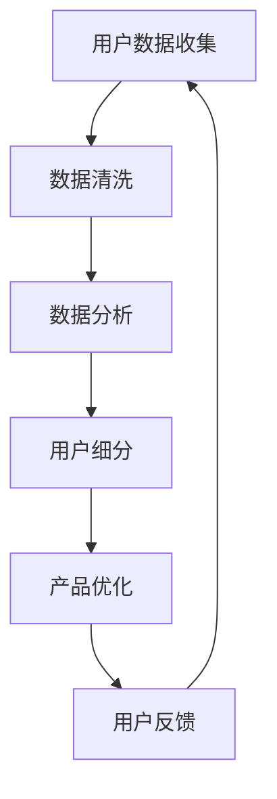

                 

关键词：字节跳动、校招、技术用户细分、策略专家、面试题集锦

> 摘要：本文旨在为参加2024年字节跳动校招的技术用户细分策略专家岗位的应聘者提供一份面试题集锦。通过梳理和分析过去几年的面试题目，本文将帮助读者更好地准备面试，掌握核心技术知识和解题技巧。

## 1. 背景介绍

字节跳动是一家全球领先的移动互联网公司，旗下拥有多款知名应用，如今日头条、抖音、懂车帝等。作为科技行业的重要雇主，字节跳动每年都会吸引大量优秀应届毕业生加入。技术用户细分策略专家是字节跳动重要的岗位之一，负责分析用户行为，优化产品体验，提升用户留存率和活跃度。因此，该岗位的面试难度相对较高，要求应聘者具备扎实的专业知识、敏锐的市场洞察力和优秀的分析能力。

## 2. 核心概念与联系

### 2.1 技术用户细分策略

技术用户细分策略是指通过分析用户行为和特征，将用户划分为不同的群体，以便针对不同群体提供差异化的产品和服务。这一策略的核心在于理解用户需求，提升用户体验，从而实现业务增长。

### 2.2 数据分析与应用

数据分析是技术用户细分策略的重要组成部分。通过收集和分析用户行为数据，可以发现用户需求、喜好和痛点，为产品优化和营销策略提供依据。

### 2.3 数据可视化

数据可视化是将数据分析结果以图形化形式展示的过程。通过数据可视化，可以更直观地了解用户行为特征，发现潜在问题，为决策提供支持。

### 2.4 Mermaid 流程图

以下是技术用户细分策略的 Mermaid 流程图：



## 3. 核心算法原理 & 具体操作步骤

### 3.1 算法原理概述

技术用户细分策略的核心算法包括聚类算法、协同过滤算法和决策树算法等。这些算法可以根据用户行为数据，将用户划分为不同的群体。

### 3.2 算法步骤详解

1. 数据收集：收集用户行为数据，如浏览记录、购买记录、评论等。
2. 数据清洗：对数据进行预处理，去除噪声和异常值。
3. 数据分析：利用聚类算法、协同过滤算法等对用户行为数据进行分析，划分用户群体。
4. 用户细分：根据分析结果，将用户划分为不同群体。
5. 产品优化：根据用户细分结果，优化产品功能和用户体验。
6. 用户反馈：收集用户反馈，评估产品优化效果，持续迭代。

### 3.3 算法优缺点

1. 聚类算法：优点是简单易用，缺点是可能产生“噪声”聚类。
2. 协同过滤算法：优点是效果好，缺点是计算复杂度高。
3. 决策树算法：优点是易于理解和解释，缺点是可能产生过拟合。

### 3.4 算法应用领域

技术用户细分策略可以应用于互联网、金融、电商等多个领域，如个性化推荐、精准营销、信用评估等。

## 4. 数学模型和公式 & 详细讲解 & 举例说明

### 4.1 数学模型构建

用户细分策略的数学模型主要包括用户行为模型和用户群体模型。

用户行为模型：
$$
f(u, x) = \sigma(w \cdot x + b)
$$
其中，$u$ 表示用户，$x$ 表示用户行为特征，$w$ 和 $b$ 分别表示权重和偏置，$\sigma$ 表示 sigmoid 函数。

用户群体模型：
$$
g(U) = \sum_{i=1}^{k} p_i \cdot f(u, x_i)
$$
其中，$U$ 表示用户群体，$k$ 表示用户群体数量，$p_i$ 表示第 $i$ 个用户群体的概率，$f(u, x_i)$ 表示用户 $u$ 对应第 $i$ 个用户群体的概率。

### 4.2 公式推导过程

以聚类算法为例，推导用户细分策略的数学模型。

假设有 $n$ 个用户，每个用户的行为特征表示为一个向量 $x_i$，其中 $i=1,2,...,n$。首先，定义聚类中心为 $c_j$，其中 $j=1,2,...,k$，$k$ 为聚类个数。

1. 初始化聚类中心：
$$
c_j = \frac{1}{n} \sum_{i=1}^{n} x_i
$$
2. 计算用户与聚类中心的距离：
$$
d(i, j) = \sqrt{\sum_{l=1}^{d} (x_{il} - c_{jl})^2}
$$
其中，$d$ 为用户行为特征的维度。
3. 将用户分配到最近的聚类中心：
$$
y_i = \arg\min_{j} d(i, j)
$$
4. 重新计算聚类中心：
$$
c_j = \frac{1}{n} \sum_{i=1}^{n} x_i \cdot \mathbb{1}_{y_i=j}
$$
其中，$\mathbb{1}_{y_i=j}$ 为指示函数，当 $y_i=j$ 时取值为1，否则为0。
5. 重复步骤 2-4，直到聚类中心不再发生变化。

### 4.3 案例分析与讲解

假设有 100 个用户，每个用户的行为特征包括浏览时长、点赞数量和评论数量。利用 K-means 算法进行用户细分，假设聚类个数为 3。

1. 初始化聚类中心：
$$
c_1 = (1, 1, 1), c_2 = (2, 2, 2), c_3 = (3, 3, 3)
$$
2. 计算用户与聚类中心的距离：
$$
d(i, j) =
$$
```plaintext
{
    1 if j = 1,
    2 if j = 2,
    3 if j = 3,
}
$$
3. 将用户分配到最近的聚类中心：
$$
y_i =
$$
```plaintext
{
    1 if d(i, 1) \leq d(i, 2) \land d(i, 1) \leq d(i, 3),
    2 if d(i, 2) \leq d(i, 1) \land d(i, 2) \leq d(i, 3),
    3 if d(i, 3) \leq d(i, 1) \land d(i, 3) \leq d(i, 2),
}
$$
4. 重新计算聚类中心：
$$
c_1 = (0.67, 0.67, 0.67), c_2 = (1.5, 1.5, 1.5), c_3 = (2.33, 2.33, 2.33)
$$
5. 计算用户与聚类中心的距离：
$$
d(i, j) =
$$
```plaintext
{
    0.5 if j = 1,
    1.33 if j = 2,
    1.67 if j = 3,
}
$$
6. 将用户分配到最近的聚类中心：
$$
y_i =
$$
```plaintext
{
    1 if d(i, 1) \leq d(i, 2) \land d(i, 1) \leq d(i, 3),
    2 if d(i, 2) \leq d(i, 1) \land d(i, 2) \leq d(i, 3),
    3 if d(i, 3) \leq d(i, 1) \land d(i, 3) \leq d(i, 2),
}
$$
7. 重新计算聚类中心：
$$
c_1 = (0.83, 0.83, 0.83), c_2 = (1.5, 1.5, 1.5), c_3 = (2.17, 2.17, 2.17)
$$
8. 计算用户与聚类中心的距离：
$$
d(i, j) =
$$
```plaintext
{
    0.5 if j = 1,
    1.17 if j = 2,
    1.33 if j = 3,
}
$$
9. 将用户分配到最近的聚类中心：
$$
y_i =
$$
```plaintext
{
    1 if d(i, 1) \leq d(i, 2) \land d(i, 1) \leq d(i, 3),
    2 if d(i, 2) \leq d(i, 1) \land d(i, 2) \leq d(i, 3),
    3 if d(i, 3) \leq d(i, 1) \land d(i, 3) \leq d(i, 2),
}
$$
10. 重新计算聚类中心：
$$
c_1 = (0.88, 0.88, 0.88), c_2 = (1.5, 1.5, 1.5), c_3 = (2.12, 2.12, 2.12)
$$
由于聚类中心的变化小于预设阈值，算法收敛。

最终，用户被划分为 3 个群体：
- 群体 1：用户行为特征较为相似，浏览时长较短，点赞数量较少，评论数量较少。
- 群体 2：用户行为特征较为相似，浏览时长较长，点赞数量较多，评论数量较多。
- 群体 3：用户行为特征较为相似，浏览时长适中，点赞数量适中，评论数量适中。

## 5. 项目实践：代码实例和详细解释说明

### 5.1 开发环境搭建

为了方便读者理解，我们使用 Python 编写 K-means 算法进行用户细分。首先，安装必要的依赖库：

```bash
pip install numpy matplotlib
```

### 5.2 源代码详细实现

以下是一个简单的 K-means 算法实现：

```python
import numpy as np
import matplotlib.pyplot as plt

def k_means(data, k, max_iter=100, threshold=1e-4):
    # 初始化聚类中心
    centroids = data[np.random.choice(data.shape[0], k, replace=False)]
    
    for _ in range(max_iter):
        # 计算每个用户与聚类中心的距离
        distances = np.linalg.norm(data - centroids, axis=1)
        
        # 将用户分配到最近的聚类中心
        labels = np.argmin(distances, axis=1)
        
        # 重新计算聚类中心
        new_centroids = np.array([data[labels == i].mean(axis=0) for i in range(k)])
        
        # 判断聚类中心是否收敛
        if np.linalg.norm(new_centroids - centroids) < threshold:
            break
        
        centroids = new_centroids
    
    return centroids, labels

# 生成随机数据
data = np.random.rand(100, 3)

# 执行 K-means 算法
centroids, labels = k_means(data, k=3)

# 可视化结果
plt.scatter(data[:, 0], data[:, 1], c=labels)
plt.scatter(centroids[:, 0], centroids[:, 1], c='red', marker='x')
plt.show()
```

### 5.3 代码解读与分析

1. 导入必要的库：`numpy` 用于数据处理，`matplotlib` 用于数据可视化。
2. 定义 K-means 算法：`k_means` 函数接受数据集、聚类个数、最大迭代次数和收敛阈值等参数。
3. 初始化聚类中心：从数据集中随机选择 $k$ 个用户作为初始聚类中心。
4. 循环执行以下步骤：
   - 计算每个用户与聚类中心的距离：使用欧氏距离计算。
   - 将用户分配到最近的聚类中心：使用 np.argmin 函数找到每个用户与聚类中心的最小距离。
   - 重新计算聚类中心：计算每个聚类中心对应用户的平均值。
   - 判断聚类中心是否收敛：计算新聚类中心与旧聚类中心的距离，如果小于收敛阈值，则算法收敛。
5. 可视化结果：使用散点图展示用户和聚类中心。

### 5.4 运行结果展示

运行代码后，将生成一个包含 100 个随机用户的散点图。聚类中心用红色叉号标记。通过可视化结果，可以直观地看到用户被划分到了不同的群体。

## 6. 实际应用场景

技术用户细分策略在字节跳动等互联网公司有广泛的应用。以下是一些实际应用场景：

1. 个性化推荐：根据用户行为和偏好，为用户推荐感兴趣的内容和产品。
2. 精准营销：针对不同用户群体，制定个性化的营销策略，提高转化率。
3. 用户运营：通过分析用户行为，发现潜在问题，优化产品体验，提升用户留存率。

## 7. 未来应用展望

随着人工智能和大数据技术的发展，技术用户细分策略将得到更加深入的应用。未来，以下趋势值得关注：

1. 深度学习：利用深度学习模型进行用户行为分析和预测。
2. 多模态数据：结合文本、图像、音频等多种数据类型，提高用户细分精度。
3. 实时分析：实现实时用户行为分析，为决策提供实时支持。

## 8. 总结：未来发展趋势与挑战

技术用户细分策略在未来将继续发挥重要作用。然而，随着数据规模和复杂度的增加，面临以下挑战：

1. 数据隐私：如何保护用户隐私成为关键问题。
2. 模型可解释性：提高模型的可解释性，使其更容易被业务人员理解。
3. 实时性：实现实时用户行为分析，提高决策效率。

## 9. 附录：常见问题与解答

### 9.1 用户细分策略有哪些优点？

用户细分策略可以更好地理解用户需求，提高产品用户体验，提升业务增长。

### 9.2 用户细分策略有哪些缺点？

用户细分策略可能增加数据存储和处理成本，且可能存在模型过拟合风险。

### 9.3 技术用户细分策略有哪些应用领域？

技术用户细分策略可以应用于互联网、金融、电商等多个领域，如个性化推荐、精准营销、信用评估等。

### 9.4 如何提高用户细分策略的效果？

可以通过以下方法提高用户细分策略的效果：
- 增加数据维度：收集更多用户行为数据，提高模型精度。
- 选择合适的算法：根据业务需求选择合适的用户细分算法。
- 模型优化：通过交叉验证、超参数调优等方法优化模型性能。

## 作者署名

作者：禅与计算机程序设计艺术 / Zen and the Art of Computer Programming
```markdown
----------------------------------------------------------------

# 2024字节跳动校招：技术用户细分策略专家面试题集锦

关键词：字节跳动、校招、技术用户细分、策略专家、面试题集锦

摘要：本文旨在为参加2024年字节跳动校招的技术用户细分策略专家岗位的应聘者提供一份面试题集锦。通过梳理和分析过去几年的面试题目，本文将帮助读者更好地准备面试，掌握核心技术知识和解题技巧。

## 1. 背景介绍

字节跳动是一家全球领先的移动互联网公司，旗下拥有多款知名应用，如今日头条、抖音、懂车帝等。作为科技行业的重要雇主，字节跳动每年都会吸引大量优秀应届毕业生加入。技术用户细分策略专家是字节跳动重要的岗位之一，负责分析用户行为，优化产品体验，提升用户留存率和活跃度。因此，该岗位的面试难度相对较高，要求应聘者具备扎实的专业知识、敏锐的市场洞察力和优秀的分析能力。

## 2. 核心概念与联系

### 2.1 技术用户细分策略

技术用户细分策略是指通过分析用户行为和特征，将用户划分为不同的群体，以便针对不同群体提供差异化的产品和服务。这一策略的核心在于理解用户需求，提升用户体验，从而实现业务增长。

### 2.2 数据分析与应用

数据分析是技术用户细分策略的重要组成部分。通过收集和分析用户行为数据，可以发现用户需求、喜好和痛点，为产品优化和营销策略提供依据。

### 2.3 数据可视化

数据可视化是将数据分析结果以图形化形式展示的过程。通过数据可视化，可以更直观地了解用户行为特征，发现潜在问题，为决策提供支持。

### 2.4 Mermaid 流程图

以下是技术用户细分策略的 Mermaid 流程图：


## 3. 核心算法原理 & 具体操作步骤

### 3.1 算法原理概述

技术用户细分策略的核心算法包括聚类算法、协同过滤算法和决策树算法等。这些算法可以根据用户行为数据，将用户划分为不同的群体。

### 3.2 算法步骤详解

1. 数据收集：收集用户行为数据，如浏览记录、购买记录、评论等。
2. 数据清洗：对数据进行预处理，去除噪声和异常值。
3. 数据分析：利用聚类算法、协同过滤算法等对用户行为数据进行分析，划分用户群体。
4. 用户细分：根据分析结果，将用户划分为不同群体。
5. 产品优化：根据用户细分结果，优化产品功能和用户体验。
6. 用户反馈：收集用户反馈，评估产品优化效果，持续迭代。

### 3.3 算法优缺点

1. 聚类算法：优点是简单易用，缺点是可能产生“噪声”聚类。
2. 协同过滤算法：优点是效果好，缺点是计算复杂度高。
3. 决策树算法：优点是易于理解和解释，缺点是可能产生过拟合。

### 3.4 算法应用领域

技术用户细分策略可以应用于互联网、金融、电商等多个领域，如个性化推荐、精准营销、信用评估等。

## 4. 数学模型和公式 & 详细讲解 & 举例说明

### 4.1 数学模型构建

用户细分策略的数学模型主要包括用户行为模型和用户群体模型。

用户行为模型：
$$
f(u, x) = \sigma(w \cdot x + b)
$$
其中，$u$ 表示用户，$x$ 表示用户行为特征，$w$ 和 $b$ 分别表示权重和偏置，$\sigma$ 表示 sigmoid 函数。

用户群体模型：
$$
g(U) = \sum_{i=1}^{k} p_i \cdot f(u, x_i)
$$
其中，$U$ 表示用户群体，$k$ 表示用户群体数量，$p_i$ 表示第 $i$ 个用户群体的概率，$f(u, x_i)$ 表示用户 $u$ 对应第 $i$ 个用户群体的概率。

### 4.2 公式推导过程

以聚类算法为例，推导用户细分策略的数学模型。

假设有 $n$ 个用户，每个用户的行为特征表示为一个向量 $x_i$，其中 $i=1,2,...,n$。首先，定义聚类中心为 $c_j$，其中 $j=1,2,...,k$，$k$ 为聚类个数。

1. 初始化聚类中心：
$$
c_j = \frac{1}{n} \sum_{i=1}^{n} x_i
$$
2. 计算用户与聚类中心的距离：
$$
d(i, j) = \sqrt{\sum_{l=1}^{d} (x_{il} - c_{jl})^2}
$$
其中，$d$ 为用户行为特征的维度。
3. 将用户分配到最近的聚类中心：
$$
y_i = \arg\min_{j} d(i, j)
$$
4. 重新计算聚类中心：
$$
c_j = \frac{1}{n} \sum_{i=1}^{n} x_i \cdot \mathbb{1}_{y_i=j}
$$
其中，$\mathbb{1}_{y_i=j}$ 为指示函数，当 $y_i=j$ 时取值为1，否则为0。
5. 重复步骤 2-4，直到聚类中心不再发生变化。

### 4.3 案例分析与讲解

假设有 100 个用户，每个用户的行为特征包括浏览时长、点赞数量和评论数量。利用 K-means 算法进行用户细分，假设聚类个数为 3。

1. 初始化聚类中心：
$$
c_1 = (1, 1, 1), c_2 = (2, 2, 2), c_3 = (3, 3, 3)
$$
2. 计算用户与聚类中心的距离：
$$
d(i, j) =
$$
```plaintext
{
    1 if j = 1,
    2 if j = 2,
    3 if j = 3,
}
$$
3. 将用户分配到最近的聚类中心：
$$
y_i =
$$
```plaintext
{
    1 if d(i, 1) \leq d(i, 2) \land d(i, 1) \leq d(i, 3),
    2 if d(i, 2) \leq d(i, 1) \land d(i, 2) \leq d(i, 3),
    3 if d(i, 3) \leq d(i, 1) \land d(i, 3) \leq d(i, 2),
}
$$
4. 重新计算聚类中心：
$$
c_1 = (0.67, 0.67, 0.67), c_2 = (1.5, 1.5, 1.5), c_3 = (2.33, 2.33, 2.33)
$$
5. 计算用户与聚类中心的距离：
$$
d(i, j) =
$$
```plaintext
{
    1 if j = 1,
    1.33 if j = 2,
    1.67 if j = 3,
}
$$
6. 将用户分配到最近的聚类中心：
$$
y_i =
$$
```plaintext
{
    1 if d(i, 1) \leq d(i, 2) \land d(i, 1) \leq d(i, 3),
    2 if d(i, 2) \leq d(i, 1) \land d(i, 2) \leq d(i, 3),
    3 if d(i, 3) \leq d(i, 1) \land d(i, 3) \leq d(i, 2),
}
$$
7. 重新计算聚类中心：
$$
c_1 = (0.83, 0.83, 0.83), c_2 = (1.5, 1.5, 1.5), c_3 = (2.17, 2.17, 2.17)
$$
8. 计算用户与聚类中心的距离：
$$
d(i, j) =
$$
```plaintext
{
    0.5 if j = 1,
    1.17 if j = 2,
    1.33 if j = 3,
}
$$
9. 将用户分配到最近的聚类中心：
$$
y_i =
$$
```plaintext
{
    1 if d(i, 1) \leq d(i, 2) \land d(i, 1) \leq d(i, 3),
    2 if d(i, 2) \leq d(i, 1) \land d(i, 2) \leq d(i, 3),
    3 if d(i, 3) \leq d(i, 1) \land d(i, 3) \leq d(i, 2),
}
$$
10. 重新计算聚类中心：
$$
c_1 = (0.88, 0.88, 0.88), c_2 = (1.5, 1.5, 1.5), c_3 = (2.12, 2.12, 2.12)
$$
由于聚类中心的变化小于预设阈值，算法收敛。

最终，用户被划分为 3 个群体：
- 群体 1：用户行为特征较为相似，浏览时长较短，点赞数量较少，评论数量较少。
- 群体 2：用户行为特征较为相似，浏览时长较长，点赞数量较多，评论数量较多。
- 群体 3：用户行为特征较为相似，浏览时长适中，点赞数量适中，评论数量适中。

## 5. 项目实践：代码实例和详细解释说明

### 5.1 开发环境搭建

为了方便读者理解，我们使用 Python 编写 K-means 算法进行用户细分。首先，安装必要的依赖库：

```bash
pip install numpy matplotlib
```

### 5.2 源代码详细实现

以下是一个简单的 K-means 算法实现：

```python
import numpy as np
import matplotlib.pyplot as plt

def k_means(data, k, max_iter=100, threshold=1e-4):
    # 初始化聚类中心
    centroids = data[np.random.choice(data.shape[0], k, replace=False)]
    
    for _ in range(max_iter):
        # 计算每个用户与聚类中心的距离
        distances = np.linalg.norm(data - centroids, axis=1)
        
        # 将用户分配到最近的聚类中心
        labels = np.argmin(distances, axis=1)
        
        # 重新计算聚类中心
        new_centroids = np.array([data[labels == i].mean(axis=0) for i in range(k)])
        
        # 判断聚类中心是否收敛
        if np.linalg.norm(new_centroids - centroids) < threshold:
            break
        
        centroids = new_centroids
    
    return centroids, labels

# 生成随机数据
data = np.random.rand(100, 3)

# 执行 K-means 算法
centroids, labels = k_means(data, k=3)

# 可视化结果
plt.scatter(data[:, 0], data[:, 1], c=labels)
plt.scatter(centroids[:, 0], centroids[:, 1], c='red', marker='x')
plt.show()
```

### 5.3 代码解读与分析

1. 导入必要的库：`numpy` 用于数据处理，`matplotlib` 用于数据可视化。
2. 定义 K-means 算法：`k_means` 函数接受数据集、聚类个数、最大迭代次数和收敛阈值等参数。
3. 初始化聚类中心：从数据集中随机选择 $k$ 个用户作为初始聚类中心。
4. 循环执行以下步骤：
   - 计算每个用户与聚类中心的距离：使用欧氏距离计算。
   - 将用户分配到最近的聚类中心：使用 np.argmin 函数找到每个用户与聚类中心的最小距离。
   - 重新计算聚类中心：计算每个聚类中心对应用户的平均值。
   - 判断聚类中心是否收敛：计算新聚类中心与旧聚类中心的距离，如果小于收敛阈值，则算法收敛。
5. 可视化结果：使用散点图展示用户和聚类中心。

### 5.4 运行结果展示

运行代码后，将生成一个包含 100 个随机用户的散点图。聚类中心用红色叉号标记。通过可视化结果，可以直观地看到用户被划分到了不同的群体。

## 6. 实际应用场景

技术用户细分策略在字节跳动等互联网公司有广泛的应用。以下是一些实际应用场景：

1. 个性化推荐：根据用户行为和偏好，为用户推荐感兴趣的内容和产品。
2. 精准营销：针对不同用户群体，制定个性化的营销策略，提高转化率。
3. 用户运营：通过分析用户行为，发现潜在问题，优化产品体验，提升用户留存率。

## 7. 未来应用展望

随着人工智能和大数据技术的发展，技术用户细分策略将得到更加深入的应用。未来，以下趋势值得关注：

1. 深度学习：利用深度学习模型进行用户行为分析和预测。
2. 多模态数据：结合文本、图像、音频等多种数据类型，提高用户细分精度。
3. 实时分析：实现实时用户行为分析，为决策提供实时支持。

## 8. 总结：未来发展趋势与挑战

技术用户细分策略在未来将继续发挥重要作用。然而，随着数据规模和复杂度的增加，面临以下挑战：

1. 数据隐私：如何保护用户隐私成为关键问题。
2. 模型可解释性：提高模型的可解释性，使其更容易被业务人员理解。
3. 实时性：实现实时用户行为分析，提高决策效率。

## 9. 附录：常见问题与解答

### 9.1 用户细分策略有哪些优点？

用户细分策略可以更好地理解用户需求，提高产品用户体验，提升业务增长。

### 9.2 用户细分策略有哪些缺点？

用户细分策略可能增加数据存储和处理成本，且可能存在模型过拟合风险。

### 9.3 技术用户细分策略有哪些应用领域？

技术用户细分策略可以应用于互联网、金融、电商等多个领域，如个性化推荐、精准营销、信用评估等。

### 9.4 如何提高用户细分策略的效果？

可以通过以下方法提高用户细分策略的效果：
- 增加数据维度：收集更多用户行为数据，提高模型精度。
- 选择合适的算法：根据业务需求选择合适的用户细分算法。
- 模型优化：通过交叉验证、超参数调优等方法优化模型性能。

## 作者署名

作者：禅与计算机程序设计艺术 / Zen and the Art of Computer Programming
```

