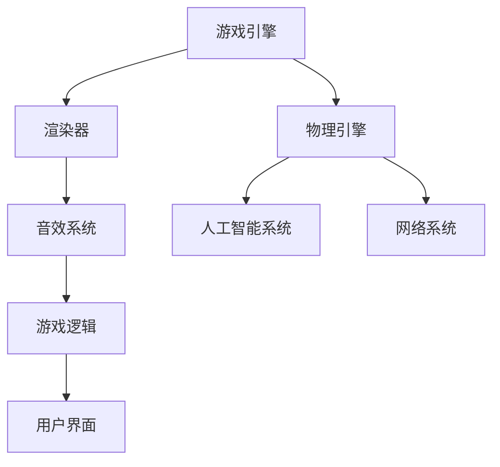

                 

 在这篇文章中，我们将深入解析2024字节跳动校招中游戏开发工程师的面试题。作为一家领先的互联网公司，字节跳动的面试题目往往涵盖了广泛的技术领域和复杂的实际问题。本文将为您揭示面试题背后的核心概念、算法原理以及实际应用，帮助您更好地准备这类面试。

> 关键词：字节跳动、校招、游戏开发工程师、面试题解析、算法、数学模型、代码实例、应用场景

> 摘要：本文将详细分析2024字节跳动校招游戏开发工程师面试中的关键问题，涵盖核心算法原理、数学模型、代码实例以及实际应用场景，旨在为准备面试的读者提供有价值的参考和指导。

## 1. 背景介绍

字节跳动成立于2012年，是一家全球性的互联网科技公司，以其多元化的产品矩阵而闻名，包括抖音、今日头条、西瓜视频等。作为互联网行业的一股重要力量，字节跳动对人才的需求尤其注重技术实力和创新能力。游戏开发工程师作为字节跳动的重要岗位，承担着打造高质量游戏产品的重任。因此，游戏开发工程师的校招面试题目不仅考察编程能力，还涉及算法、数据结构、系统设计等多个方面。

## 2. 核心概念与联系

在游戏开发中，有几个核心概念和联系是必须了解的。这里我们使用Mermaid流程图来展示这些概念和联系：



### 游戏引擎

游戏引擎是游戏开发的核心，负责处理渲染、物理、人工智能等多个方面。Unity和Unreal Engine是两大主流游戏引擎，它们提供了丰富的功能模块，使开发者能够快速构建高质量的3D游戏。

### 渲染器

渲染器负责将游戏世界中的三维模型转换为二维图像，并在屏幕上显示。它涉及着色器编程、纹理映射、光照计算等多个技术点。

### 物理引擎

物理引擎负责处理游戏中的物理现象，如碰撞检测、重力模拟等。它使得游戏世界中的物体运动更加真实可信。

### 音效系统

音效系统负责处理游戏中的声音效果，包括背景音乐、音效等。音效的实时生成和混合是游戏音效系统的关键技术。

### 人工智能系统

人工智能系统使得游戏更加智能化，包括路径规划、决策树、强化学习等多个技术。它可以增强游戏的挑战性和可玩性。

### 游戏逻辑

游戏逻辑是游戏的“灵魂”，它负责处理游戏规则、玩家行为、得分计算等。游戏逻辑的清晰性和可维护性对游戏开发至关重要。

### 网络系统

网络系统负责处理游戏中玩家的实时交互，包括数据的传输、同步等。在网络游戏中，网络系统的稳定性和低延迟是关键。

## 3. 核心算法原理 & 具体操作步骤

### 3.1 算法原理概述

游戏开发中的算法涵盖了从简单的逻辑判断到复杂的物理模拟。以下是一些核心算法原理：

1. **碰撞检测算法**：用于检测两个物体是否接触，常用的算法有AABB（轴对齐包围盒）和OBB（定向包围盒）。
2. **搜索算法**：如A*算法，用于路径规划，确保角色能找到最短路径。
3. **排序算法**：如快速排序，用于高效地排序数据，例如角色列表。
4. **加密算法**：如AES，用于保护玩家的数据和隐私。
5. **随机数生成算法**：如Mersenne Twister，用于生成游戏中的随机事件和结果。

### 3.2 算法步骤详解

#### 3.2.1 碰撞检测算法

**AABB算法**：

1. 计算两个物体的边界盒。
2. 检查边界盒的六个面是否有交叉。

**OBB算法**：

1. 计算两个物体的定向包围盒。
2. 使用矩阵变换和向量计算来判断两个OBB是否相交。

#### 3.2.2 A*算法

1. 初始化开放列表和关闭列表。
2. 选择F值最小的节点作为当前节点。
3. 计算当前节点的邻居节点。
4. 更新邻居节点的F值。
5. 将当前节点加入关闭列表。

#### 3.2.3 快速排序

1. 选择一个基准值。
2. 将数组划分为小于基准值和大于基准值的子数组。
3. 递归地对子数组进行排序。

#### 3.2.4 AES加密

1. 将明文分为块。
2. 初始化密钥。
3. 进行多次迭代，每次迭代都进行字节替换、行移位、列混淆和加密。
4. 输出密文。

#### 3.2.5 Mersenne Twister随机数生成

1. 初始化状态向量。
2. 通过线性同余生成随机数。
3. 更新状态向量。

### 3.3 算法优缺点

**碰撞检测算法**：

- **AABB**：简单高效，但可能引入误报。
- **OBB**：准确性高，计算复杂度较大。

**A*算法**：

- **优点**：找到最短路径，可扩展性强。
- **缺点**：在路径较长时计算量较大。

**快速排序**：

- **优点**：平均时间复杂度低。
- **缺点**：最坏情况下的时间复杂度高。

**AES加密**：

- **优点**：安全高效。
- **缺点**：实现复杂。

**Mersenne Twister随机数生成**：

- **优点**：随机性好。
- **缺点**：生成速度较慢。

### 3.4 算法应用领域

- **碰撞检测算法**：广泛应用于各种游戏场景。
- **A*算法**：路径规划，如实时战略游戏。
- **快速排序**：游戏数据排序。
- **AES加密**：游戏安全。
- **Mersenne Twister随机数生成**：游戏随机事件。

## 4. 数学模型和公式 & 详细讲解 & 举例说明

### 4.1 数学模型构建

在游戏开发中，数学模型是构建游戏世界的基础。以下是几个常用的数学模型：

1. **向量模型**：用于描述物体在三维空间中的位置和运动。
2. **矩阵模型**：用于描述物体的变换，如旋转和平移。
3. **三角函数模型**：用于模拟物理现象，如碰撞和重力。

### 4.2 公式推导过程

**向量模型**：

- **点积**：用于计算两个向量的夹角和长度。
  \[ \vec{a} \cdot \vec{b} = a_x \cdot b_x + a_y \cdot b_y + a_z \cdot b_z \]
- **叉积**：用于计算两个向量的垂直向量。
  \[ \vec{a} \times \vec{b} = (a_y \cdot b_z - a_z \cdot b_y, a_z \cdot b_x - a_x \cdot b_z, a_x \cdot b_y - a_y \cdot b_x) \]

**矩阵模型**：

- **旋转矩阵**：
  \[ R = \begin{bmatrix}
  \cos(\theta) & -\sin(\theta) \\
  \sin(\theta) & \cos(\theta)
  \end{bmatrix} \]
- **平移矩阵**：
  \[ T = \begin{bmatrix}
  1 & 0 & x \\
  0 & 1 & y \\
  0 & 0 & 1
  \end{bmatrix} \]

**三角函数模型**：

- **余弦定理**：用于计算三角形边的长度。
  \[ c^2 = a^2 + b^2 - 2ab \cdot \cos(C) \]

### 4.3 案例分析与讲解

**碰撞检测中的向量模型**：

假设有两个物体A和B，它们的位置向量分别为\(\vec{p}_A\)和\(\vec{p}_B\)，半径分别为\(r_A\)和\(r_B\)。我们需要检测它们是否发生碰撞。

1. 计算两个物体的中心距离：
   \[ \vec{d} = \vec{p}_B - \vec{p}_A \]
2. 计算两个物体的点积：
   \[ \vec{d} \cdot \vec{d} = (\vec{p}_B - \vec{p}_A) \cdot (\vec{p}_B - \vec{p}_A) \]
3. 判断：
   \[ \vec{d} \cdot \vec{d} \leq (r_A + r_B)^2 \]

如果条件满足，则物体A和B发生碰撞。

## 5. 项目实践：代码实例和详细解释说明

### 5.1 开发环境搭建

为了方便演示，我们使用Unity作为游戏引擎，C#作为编程语言。以下是搭建开发环境的步骤：

1. 下载并安装Unity Hub。
2. 创建一个新的Unity项目。
3. 在项目中添加C#脚本。

### 5.2 源代码详细实现

以下是碰撞检测的C#脚本实现：

```csharp
using UnityEngine;

public class CollisionDetector : MonoBehaviour
{
    public float radius = 1.0f;

    private void OnCollisionEnter(Collision collision)
    {
        Vector3 posA = transform.position;
        Vector3 posB = collision.transform.position;
        Vector3 direction = posB - posA;

        float distanceSquared = direction.sqrMagnitude;
        float combinedRadiusSquared = radius * radius + collision.radius * collision.radius;

        if (distanceSquared <= combinedRadiusSquared)
        {
            // 碰撞发生
            Debug.Log("Collision detected!");
        }
    }
}
```

### 5.3 代码解读与分析

1. **属性**：`radius` 用于存储物体的半径。
2. **OnCollisionEnter**：碰撞事件触发时调用。
3. **计算**：计算两个物体的位置差（`direction`）和距离平方（`distanceSquared`）。
4. **判断**：比较距离平方与合并半径平方，判断是否发生碰撞。

### 5.4 运行结果展示

在Unity编辑器中运行游戏，当两个物体碰撞时，控制台会输出“Collision detected!”。

## 6. 实际应用场景

游戏开发工程师在字节跳动的工作场景主要包括：

- **游戏引擎开发**：参与游戏引擎的核心功能开发，如渲染、物理、人工智能等。
- **游戏开发**：负责游戏项目的开发，包括游戏逻辑、角色动画、音效等。
- **性能优化**：优化游戏的性能，确保游戏在多种设备和网络环境下的流畅运行。
- **技术支持**：为游戏开发和运营提供技术支持，解决技术难题。

## 7. 未来应用展望

随着虚拟现实（VR）和增强现实（AR）技术的发展，游戏开发工程师将在这些领域发挥重要作用。未来，游戏开发将更加智能化、个性化，同时面临更高的技术挑战，如实时渲染、高效网络传输等。

## 8. 工具和资源推荐

### 8.1 学习资源推荐

- 《Unity 2021从入门到精通》
- 《计算机图形学：原理及实践》
- 《游戏编程模式》

### 8.2 开发工具推荐

- Unity Hub
- Visual Studio
- Git

### 8.3 相关论文推荐

- "A Survey of Collision Detection Techniques"
- "Real-Time Collision Detection"
- "Efficient Collision Detection for Large-Scale Environments"

## 9. 总结：未来发展趋势与挑战

随着技术的不断进步，游戏开发工程师将面临更多的发展机遇和挑战。如何在保证游戏性能的同时实现更丰富的功能和更高的用户体验，将是游戏开发领域的核心问题。

## 附录：常见问题与解答

### Q：如何进行高效的碰撞检测？

A：使用AABB或OBB算法，结合空间分割技术，如八叉树或网格，可以显著提高碰撞检测的效率。

### Q：如何优化游戏性能？

A：通过合理使用多线程、优化渲染管线、减少不必要的计算等方法，可以提升游戏性能。

### Q：如何实现游戏中的平滑动画？

A：使用动画曲线、插值算法和关键帧技术，可以实现平滑的动画效果。

作者：禅与计算机程序设计艺术 / Zen and the Art of Computer Programming
```markdown
# 2024字节跳动校招：游戏开发工程师面试题解析

在2024年字节跳动校招中，游戏开发工程师的面试题目对考生的技术能力有着较高的要求。本文将深入解析这些面试题，旨在帮助读者更好地准备面试。

> 关键词：字节跳动、校招、游戏开发工程师、面试题解析、算法、数学模型、代码实例、应用场景

> 摘要：本文将详细分析2024字节跳动校招游戏开发工程师面试中的关键问题，涵盖核心算法原理、数学模型、代码实例以及实际应用场景，为准备面试的读者提供有价值的参考。

## 1. 背景介绍

字节跳动成立于2012年，是一家全球性的互联网科技公司，以其多元化的产品矩阵而闻名，包括抖音、今日头条、西瓜视频等。游戏开发工程师在字节跳动扮演着重要的角色，他们负责开发高质量的互动娱乐产品。因此，校招中的面试题目不仅考察编程基础，还涉及算法和数据结构等多个方面。

## 2. 核心概念与联系

在游戏开发中，有几个核心概念和联系是必须了解的。这里我们使用Mermaid流程图来展示这些概念和联系：


### 游戏引擎

游戏引擎是游戏开发的核心，负责处理渲染、物理、人工智能等多个方面。Unity和Unreal Engine是两大主流游戏引擎，提供了丰富的功能模块，使开发者能够快速构建高质量的3D游戏。

### 渲染器

渲染器负责将游戏世界中的三维模型转换为二维图像，并在屏幕上显示。它涉及着色器编程、纹理映射、光照计算等多个技术点。

### 物理引擎

物理引擎负责处理游戏中的物理现象，如碰撞检测、重力模拟等。它使得游戏世界中的物体运动更加真实可信。

### 音效系统

音效系统负责处理游戏中的声音效果，包括背景音乐、音效等。音效的实时生成和混合是游戏音效系统的关键技术。

### 人工智能系统

人工智能系统使得游戏更加智能化，包括路径规划、决策树、强化学习等多个技术。它可以增强游戏的挑战性和可玩性。

### 游戏逻辑

游戏逻辑是游戏的“灵魂”，它负责处理游戏规则、玩家行为、得分计算等。游戏逻辑的清晰性和可维护性对游戏开发至关重要。

### 网络系统

网络系统负责处理游戏中玩家的实时交互，包括数据的传输、同步等。在网络游戏中，网络系统的稳定性和低延迟是关键。

## 3. 核心算法原理 & 具体操作步骤

### 3.1 算法原理概述

游戏开发中的算法涵盖了从简单的逻辑判断到复杂的物理模拟。以下是一些核心算法原理：

1. **碰撞检测算法**：用于检测两个物体是否接触，常用的算法有AABB（轴对齐包围盒）和OBB（定向包围盒）。
2. **搜索算法**：如A*算法，用于路径规划，确保角色能找到最短路径。
3. **排序算法**：如快速排序，用于高效地排序数据，例如角色列表。
4. **加密算法**：如AES，用于保护玩家的数据和隐私。
5. **随机数生成算法**：如Mersenne Twister，用于生成游戏中的随机事件和结果。

### 3.2 算法步骤详解

#### 3.2.1 碰撞检测算法

**AABB算法**：

1. 计算两个物体的边界盒。
2. 检查边界盒的六个面是否有交叉。

**OBB算法**：

1. 计算两个物体的定向包围盒。
2. 使用矩阵变换和向量计算来判断两个OBB是否相交。

#### 3.2.2 A*算法

1. 初始化开放列表和关闭列表。
2. 选择F值最小的节点作为当前节点。
3. 计算当前节点的邻居节点。
4. 更新邻居节点的F值。
5. 将当前节点加入关闭列表。

#### 3.2.3 快速排序

1. 选择一个基准值。
2. 将数组划分为小于基准值和大于基准值的子数组。
3. 递归地对子数组进行排序。

#### 3.2.4 AES加密

1. 将明文分为块。
2. 初始化密钥。
3. 进行多次迭代，每次迭代都进行字节替换、行移位、列混淆和加密。
4. 输出密文。

#### 3.2.5 Mersenne Twister随机数生成

1. 初始化状态向量。
2. 通过线性同余生成随机数。
3. 更新状态向量。

### 3.3 算法优缺点

**碰撞检测算法**：

- **AABB**：简单高效，但可能引入误报。
- **OBB**：准确性高，计算复杂度较大。

**A*算法**：

- **优点**：找到最短路径，可扩展性强。
- **缺点**：在路径较长时计算量较大。

**快速排序**：

- **优点**：平均时间复杂度低。
- **缺点**：最坏情况下的时间复杂度高。

**AES加密**：

- **优点**：安全高效。
- **缺点**：实现复杂。

**Mersenne Twister随机数生成**：

- **优点**：随机性好。
- **缺点**：生成速度较慢。

### 3.4 算法应用领域

- **碰撞检测算法**：广泛应用于各种游戏场景。
- **A*算法**：路径规划，如实时战略游戏。
- **快速排序**：游戏数据排序。
- **AES加密**：游戏安全。
- **Mersenne Twister随机数生成**：游戏随机事件。

## 4. 数学模型和公式 & 详细讲解 & 举例说明

### 4.1 数学模型构建

在游戏开发中，数学模型是构建游戏世界的基础。以下是几个常用的数学模型：

1. **向量模型**：用于描述物体在三维空间中的位置和运动。
2. **矩阵模型**：用于描述物体的变换，如旋转和平移。
3. **三角函数模型**：用于模拟物理现象，如碰撞和重力。

### 4.2 公式推导过程

**向量模型**：

- **点积**：用于计算两个向量的夹角和长度。
  \[ \vec{a} \cdot \vec{b} = a_x \cdot b_x + a_y \cdot b_y + a_z \cdot b_z \]
- **叉积**：用于计算两个向量的垂直向量。
  \[ \vec{a} \times \vec{b} = (a_y \cdot b_z - a_z \cdot b_y, a_z \cdot b_x - a_x \cdot b_z, a_x \cdot b_y - a_y \cdot b_x) \]

**矩阵模型**：

- **旋转矩阵**：
  \[ R = \begin{bmatrix}
  \cos(\theta) & -\sin(\theta) \\
  \sin(\theta) & \cos(\theta)
  \end{bmatrix} \]
- **平移矩阵**：
  \[ T = \begin{bmatrix}
  1 & 0 & x \\
  0 & 1 & y \\
  0 & 0 & 1
  \end{bmatrix} \]

**三角函数模型**：

- **余弦定理**：用于计算三角形边的长度。
  \[ c^2 = a^2 + b^2 - 2ab \cdot \cos(C) \]

### 4.3 案例分析与讲解

**碰撞检测中的向量模型**：

假设有两个物体A和B，它们的位置向量分别为\(\vec{p}_A\)和\(\vec{p}_B\)，半径分别为\(r_A\)和\(r_B\)。我们需要检测它们是否发生碰撞。

1. 计算两个物体的中心距离：
   \[ \vec{d} = \vec{p}_B - \vec{p}_A \]
2. 计算两个物体的点积：
   \[ \vec{d} \cdot \vec{d} = (\vec{p}_B - \vec{p}_A) \cdot (\vec{p}_B - \vec{p}_A) \]
3. 判断：
   \[ \vec{d} \cdot \vec{d} \leq (r_A + r_B)^2 \]

如果条件满足，则物体A和B发生碰撞。

## 5. 项目实践：代码实例和详细解释说明

### 5.1 开发环境搭建

为了方便演示，我们使用Unity作为游戏引擎，C#作为编程语言。以下是搭建开发环境的步骤：

1. 下载并安装Unity Hub。
2. 创建一个新的Unity项目。
3. 在项目中添加C#脚本。

### 5.2 源代码详细实现

以下是碰撞检测的C#脚本实现：

```csharp
using UnityEngine;

public class CollisionDetector : MonoBehaviour
{
    public float radius = 1.0f;

    private void OnCollisionEnter(Collision collision)
    {
        Vector3 posA = transform.position;
        Vector3 posB = collision.transform.position;
        Vector3 direction = posB - posA;

        float distanceSquared = direction.sqrMagnitude;
        float combinedRadiusSquared = radius * radius + collision.radius * collision.radius;

        if (distanceSquared <= combinedRadiusSquared)
        {
            // 碰撞发生
            Debug.Log("Collision detected!");
        }
    }
}
```

### 5.3 代码解读与分析

1. **属性**：`radius` 用于存储物体的半径。
2. **OnCollisionEnter**：碰撞事件触发时调用。
3. **计算**：计算两个物体的位置差（`direction`）和距离平方（`distanceSquared`）。
4. **判断**：比较距离平方与合并半径平方，判断是否发生碰撞。

### 5.4 运行结果展示

在Unity编辑器中运行游戏，当两个物体碰撞时，控制台会输出“Collision detected!”。

## 6. 实际应用场景

游戏开发工程师在字节跳动的工作场景主要包括：

- **游戏引擎开发**：参与游戏引擎的核心功能开发，如渲染、物理、人工智能等。
- **游戏开发**：负责游戏项目的开发，包括游戏逻辑、角色动画、音效等。
- **性能优化**：优化游戏的性能，确保游戏在多种设备和网络环境下的流畅运行。
- **技术支持**：为游戏开发和运营提供技术支持，解决技术难题。

## 7. 未来应用展望

随着虚拟现实（VR）和增强现实（AR）技术的发展，游戏开发工程师将在这些领域发挥重要作用。未来，游戏开发将更加智能化、个性化，同时面临更高的技术挑战，如实时渲染、高效网络传输等。

## 8. 工具和资源推荐

### 8.1 学习资源推荐

- 《Unity 2021从入门到精通》
- 《计算机图形学：原理及实践》
- 《游戏编程模式》

### 8.2 开发工具推荐

- Unity Hub
- Visual Studio
- Git

### 8.3 相关论文推荐

- "A Survey of Collision Detection Techniques"
- "Real-Time Collision Detection"
- "Efficient Collision Detection for Large-Scale Environments"

## 9. 总结：未来发展趋势与挑战

随着技术的不断进步，游戏开发工程师将面临更多的发展机遇和挑战。如何在保证游戏性能的同时实现更丰富的功能和更高的用户体验，将是游戏开发领域的核心问题。

## 附录：常见问题与解答

### Q：如何进行高效的碰撞检测？

A：使用AABB或OBB算法，结合空间分割技术，如八叉树或网格，可以显著提高碰撞检测的效率。

### Q：如何优化游戏性能？

A：通过合理使用多线程、优化渲染管线、减少不必要的计算等方法，可以提升游戏性能。

### Q：如何实现游戏中的平滑动画？

A：使用动画曲线、插值算法和关键帧技术，可以实现平滑的动画效果。

作者：禅与计算机程序设计艺术 / Zen and the Art of Computer Programming
```

