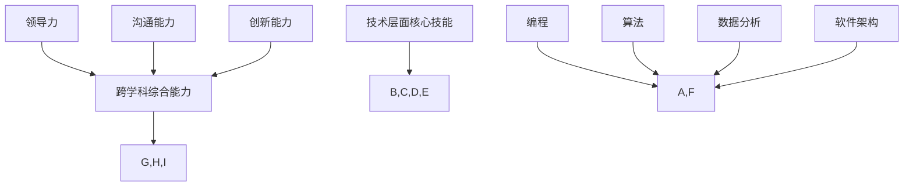

                 

关键词：VUCA时代、学习体系、技能、人工智能、计算机编程、软件架构、技术发展、未来展望

> 摘要：本文探讨了VUCA时代下的学习体系，强调了适应快速变化的技能的重要性。通过分析人工智能、编程、软件架构等核心领域的发展趋势，本文提出了一个多层次、跨学科的学习框架，以帮助读者构建适应未来挑战的技术能力。

## 1. 背景介绍

在当今这个VUCA（即易变、不确定、复杂和模糊）的时代，技术的快速发展对社会、经济和个人生活都产生了深远的影响。传统行业正在被数字化改造，新兴技术如人工智能、区块链和物联网等正在重塑整个商业生态系统。因此，个人和组织需要具备不断学习和适应新技术的能力，以保持竞争力。

### 1.1 VUCA时代的特点

- **易变（Volatility）**：技术进步和创新使得市场和行业环境变得极其不稳定。
- **不确定（Uncertainty）**：未来的趋势难以预测，变化的速度和规模超出了多数人的预期。
- **复杂（Complexity）**：系统的相互作用和不确定性导致问题难以解决。
- **模糊（Ambiguity）**：信息不全、模糊性和不确定性使得决策过程更加复杂。

### 1.2 技术变革的影响

- **就业市场的变化**：某些传统岗位正逐渐消失，而新的岗位和技能需求不断涌现。
- **企业运营模式**：数字化和自动化正在改变企业的运营模式，提高效率和灵活性。
- **个人发展**：持续学习和技能更新成为个人成功的关键因素。

## 2. 核心概念与联系

为了在VUCA时代中生存和发展，我们需要掌握一系列关键技能和知识。这些技能不仅包括技术层面的编程、算法和数据分析，还包括跨学科的综合能力，如领导力、沟通能力和创新能力。

### 2.1 技术层面的核心技能

- **编程**：掌握至少一门编程语言，如Python、Java或C++，是基础。
- **算法**：理解基本算法和数据结构，能够根据问题选择合适的解决方案。
- **数据分析**：能够处理和分析大量数据，提取有价值的信息。
- **软件架构**：理解软件系统的设计原则，能够构建可扩展和可维护的系统。

### 2.2 跨学科的综合能力

- **领导力**：能够带领团队共同完成任务，培养和激励团队成员。
- **沟通能力**：能够清晰、有效地表达自己的想法，理解他人的需求。
- **创新能力**：能够在现有知识和技能的基础上提出新的解决方案。

### 2.3 Mermaid 流程图

下面是一个简化的Mermaid流程图，展示了上述核心概念和技能之间的关系。



## 3. 核心算法原理 & 具体操作步骤

### 3.1 算法原理概述

在众多算法中，深度学习算法因其强大的建模能力和自学习能力，成为近年来技术领域的重要突破。深度学习算法的核心在于神经网络，特别是深度神经网络（DNN）。

### 3.2 算法步骤详解

1. **数据收集与预处理**：收集大量的训练数据，并对数据进行清洗、归一化等处理，以便用于模型训练。
2. **构建神经网络模型**：选择合适的神经网络架构，如卷积神经网络（CNN）、循环神经网络（RNN）或生成对抗网络（GAN），并配置网络层的参数。
3. **模型训练**：通过反向传播算法更新网络权重，优化模型参数，使模型在训练数据上达到较好的性能。
4. **模型评估与调整**：使用验证数据评估模型性能，并根据评估结果调整模型参数。
5. **模型部署**：将训练好的模型部署到实际应用场景中，如图像识别、自然语言处理等。

### 3.3 算法优缺点

- **优点**：深度学习算法能够自动提取数据中的特征，提高模型的泛化能力；适用于复杂数据处理任务，如语音识别、图像识别等。
- **缺点**：模型训练过程需要大量计算资源和时间；对数据质量和标注有较高要求；模型的可解释性较差。

### 3.4 算法应用领域

- **计算机视觉**：图像识别、目标检测、图像生成等。
- **自然语言处理**：文本分类、情感分析、机器翻译等。
- **语音识别**：语音识别、语音合成等。
- **推荐系统**：基于用户行为和兴趣的个性化推荐。

## 4. 数学模型和公式 & 详细讲解 & 举例说明

### 4.1 数学模型构建

深度学习中的数学模型主要基于概率论和线性代数。以下是构建深度学习模型的基本数学公式。

### 4.2 公式推导过程

以多层感知器（MLP）为例，以下是MLP中前向传播和反向传播的数学公式推导。

### 4.3 案例分析与讲解

假设我们有一个简单的MLP模型，用于二分类问题。输入层有3个神经元，隐藏层有4个神经元，输出层有2个神经元。我们使用交叉熵损失函数进行模型训练。

输入向量：\( x = [x_1, x_2, x_3] \)

隐藏层激活函数：\( \sigma(z) = \frac{1}{1 + e^{-z}} \)

输出层激活函数：\( \sigma(z) = \frac{1}{1 + e^{-z}} \)

损失函数：\( J = -\frac{1}{m} \sum_{i=1}^{m} y\_i \log(\hat{y}_i) + (1 - y\_i) \log(1 - \hat{y}_i) \)

其中，\( y \) 是真实标签，\( \hat{y} \) 是模型的预测概率。

## 5. 项目实践：代码实例和详细解释说明

### 5.1 开发环境搭建

- 安装Python 3.7及以上版本
- 安装TensorFlow 2.x
- 安装必要的依赖库，如NumPy、Pandas等

### 5.2 源代码详细实现

以下是使用TensorFlow实现一个简单的MLP模型的代码实例。

```python
import tensorflow as tf
from tensorflow.keras.layers import Dense
from tensorflow.keras.models import Sequential

# 构建模型
model = Sequential([
    Dense(4, input_shape=(3,), activation='sigmoid'),
    Dense(2, activation='sigmoid')
])

# 编译模型
model.compile(optimizer='adam', loss='binary_crossentropy', metrics=['accuracy'])

# 模型训练
model.fit(x_train, y_train, epochs=10, batch_size=32, validation_data=(x_val, y_val))

# 模型评估
model.evaluate(x_test, y_test)
```

### 5.3 代码解读与分析

- **模型构建**：使用`Sequential`模型定义一个顺序的层结构，包括输入层、隐藏层和输出层。
- **模型编译**：设置优化器和损失函数，指定模型训练的目标。
- **模型训练**：使用`fit`方法训练模型，使用验证数据集进行性能评估。
- **模型评估**：使用`evaluate`方法评估模型在测试数据集上的性能。

## 6. 实际应用场景

深度学习算法在各个领域都有广泛的应用，以下是一些典型的实际应用场景。

### 6.1 计算机视觉

- **图像识别**：对图像中的对象进行分类和识别，如人脸识别、车牌识别等。
- **目标检测**：在图像中检测和定位多个对象，如自动驾驶汽车中的行人检测。
- **图像生成**：使用生成对抗网络（GAN）创建新的图像，如图像超分辨率和艺术风格迁移。

### 6.2 自然语言处理

- **文本分类**：对文本进行分类，如情感分析、新闻分类等。
- **机器翻译**：将一种语言的文本翻译成另一种语言，如英语到中文的翻译。
- **语音识别**：将语音信号转换成文本，如智能语音助手。

### 6.3 语音识别

- **语音识别**：将语音信号转换成文本，如智能语音助手。
- **语音合成**：将文本转换成语音，如电话语音导航。

## 7. 工具和资源推荐

### 7.1 学习资源推荐

- **书籍**：《深度学习》（Goodfellow、Bengio和Courville著）
- **在线课程**：Coursera上的《深度学习专项课程》、edX上的《神经网络与深度学习》
- **论文集**：《深度学习论文集》

### 7.2 开发工具推荐

- **框架**：TensorFlow、PyTorch、Keras
- **数据集**：ImageNet、CIFAR-10、MNIST
- **工具**：Jupyter Notebook、Google Colab

### 7.3 相关论文推荐

- **《A Theoretical Analysis of the VAE》（Kingma和Welling著）**
- **《Generative Adversarial Nets》（Goodfellow等著）**
- **《Deep Learning for Text Understanding without Explicitly Training Word Representations》（Chen等著）**

## 8. 总结：未来发展趋势与挑战

### 8.1 研究成果总结

- 深度学习在计算机视觉、自然语言处理和语音识别等领域取得了显著的成果，推动了许多实际应用的发展。
- 新兴技术如GAN和自动机器学习（AutoML）正在改变深度学习的研发和应用模式。

### 8.2 未来发展趋势

- **硬件加速**：GPU和TPU等专用硬件的普及将加速深度学习模型的训练和推理。
- **可解释性**：提高模型的可解释性，使其在关键应用中更加可靠和可信。
- **泛化能力**：增强模型的泛化能力，使其能够处理更复杂、更多变的数据。

### 8.3 面临的挑战

- **计算资源**：深度学习模型训练需要大量计算资源，如何高效利用硬件成为关键问题。
- **数据隐私**：在保护用户隐私的前提下，如何合理使用和共享数据。
- **伦理问题**：深度学习模型的偏见和歧视问题，如何确保其公平和公正。

### 8.4 研究展望

- **跨学科融合**：深度学习与其他领域的结合，如生物学、心理学和社会学等，将推动新的科学研究。
- **通用人工智能**：开发具有人类水平的认知能力的通用人工智能（AGI），实现更广泛的应用。

## 9. 附录：常见问题与解答

### 9.1 深度学习与机器学习的区别是什么？

深度学习是机器学习的一个子领域，它使用多层神经网络来建模和预测。机器学习则是一个更广泛的领域，包括监督学习、非监督学习和强化学习等方法。

### 9.2 深度学习模型如何防止过拟合？

过拟合是指模型在训练数据上表现很好，但在测试数据上表现不佳。防止过拟合的方法包括增加数据量、使用正则化技术、 dropout和交叉验证等。

### 9.3 深度学习模型如何处理文本数据？

文本数据通常通过词向量表示（如Word2Vec、GloVe）进行处理。深度学习模型可以结合卷积神经网络（CNN）或循环神经网络（RNN）来处理序列数据，如文本和语音。

---

作者：禅与计算机程序设计艺术 / Zen and the Art of Computer Programming

本文旨在帮助读者构建一个适应VUCA时代的学习体系，掌握关键技能，迎接未来的挑战。希望本文对您有所帮助，并激发您在技术领域不断探索的热情。|

