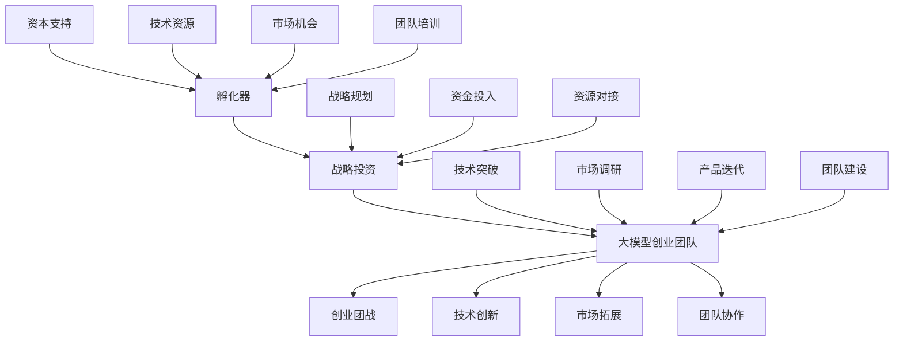

                 

关键词：孵化器、战略投资、大模型、创业团战、打法、技术、市场、策略、分析、未来展望

摘要：本文旨在探讨孵化器在战略投资中的重要作用，以及大模型创业团队在实际团战中的策略和打法。通过对孵化器战投的深入分析，结合大模型的技术特点和市场需求，本文提出了大模型创业团队在团战中的有效打法，并对未来发展趋势和挑战进行了展望。

## 1. 背景介绍

在当今快速变化的技术和市场环境中，孵化器和战略投资正成为推动创新和企业成长的重要力量。孵化器作为创业团队的培育基地，不仅提供办公空间和基础设施，更在战略投资、市场推广、资源对接等方面发挥着关键作用。而战略投资则通过资金、技术和资源支持，助力企业快速发展。

与此同时，大模型作为人工智能领域的重要技术突破，正迅速改变各行各业。从自然语言处理到图像识别，从智能推荐到自动驾驶，大模型的应用前景广阔。然而，大模型创业团队在市场竞争中也面临着巨大的挑战。如何在激烈的团战中脱颖而出，成为创业团队亟待解决的问题。

本文将从孵化器战投的角度出发，结合大模型的技术和市场特点，探讨大模型创业团队在团战中的策略和打法，以期为创业者提供有价值的参考。

### 1.1 孵化器的角色

孵化器在创业生态系统中扮演着多重角色。首先，孵化器为创业团队提供物理空间，降低创业成本。此外，孵化器还通过组织培训、辅导、咨询等活动，提升创业团队的运营和管理能力。

更重要的是，孵化器在战略投资方面发挥着重要作用。孵化器通常与风险投资机构、天使投资者等建立紧密合作关系，能够快速为企业提供资金支持。同时，孵化器还能通过资源对接，帮助企业获得技术、市场、人才等多方面的支持。

### 1.2 战略投资的重要性

战略投资在企业发展过程中具有不可替代的作用。首先，战略投资能够为企业提供充足的资金支持，助力企业实现规模扩张和技术创新。其次，战略投资通过引入投资者和合作伙伴，为企业带来丰富的资源和人脉。

此外，战略投资还能够提升企业的市场地位和品牌价值。在竞争激烈的市场环境中，拥有强大的资本背景和投资者支持，往往能够为企业带来更多的市场机会和竞争优势。

### 1.3 大模型创业团队的挑战

大模型创业团队在团战中面临着诸多挑战。首先，大模型研发成本高昂，对资金需求巨大。其次，大模型技术尚不成熟，面临技术风险。此外，市场竞争激烈，大模型创业团队需要不断创新，以应对竞争对手的挑战。

## 2. 核心概念与联系

在本节中，我们将介绍核心概念，并使用Mermaid流程图展示相关架构。

### 2.1 核心概念

- 孵化器：为创业团队提供基础设施、资源和服务的组织。
- 战略投资：为企业提供资金、资源和技术支持的投资行为。
- 大模型：基于深度学习的技术，能够处理大规模数据，实现智能预测和决策。
- 创业团战：创业团队在市场竞争中的战略竞争。

### 2.2 Mermaid流程图



## 3. 核心算法原理 & 具体操作步骤

### 3.1 算法原理概述

本节将介绍孵化器战投领航和大模型创业团战打法的核心算法原理。首先，我们将分析孵化器的战略投资机制，其次，探讨大模型创业团战的策略和方法。

### 3.2 算法步骤详解

#### 3.2.1 孵化器的战略投资机制

1. **需求调研**：孵化器通过市场调研，了解创业团队的需求和痛点，为后续投资提供方向。
2. **项目筛选**：孵化器根据需求调研结果，筛选出具有潜力的创业项目。
3. **尽职调查**：孵化器对入选项目进行详细审查，包括团队背景、技术实力、市场前景等。
4. **投资决策**：孵化器根据尽职调查结果，决定是否进行投资。
5. **投资执行**：孵化器与创业团队签订投资协议，提供资金、资源和技术支持。
6. **投后管理**：孵化器对已投资项目进行跟踪管理，确保项目顺利进行。

#### 3.2.2 大模型创业团战的策略和方法

1. **技术创新**：创业团队聚焦于大模型技术的研发，不断提高算法性能和模型规模。
2. **市场调研**：创业团队深入了解市场需求，为产品迭代提供方向。
3. **产品迭代**：创业团队根据市场调研结果，不断优化产品功能，提升用户体验。
4. **团队建设**：创业团队注重团队建设，培养核心竞争力，提高团队协作效率。
5. **市场拓展**：创业团队积极开展市场推广活动，扩大市场份额。
6. **战略联盟**：创业团队通过与合作伙伴建立战略联盟，共同开拓市场。

### 3.3 算法优缺点

#### 优点

- **孵化器战投领航**：通过战略投资，助力创业团队快速发展，提高市场竞争力。
- **大模型创业团战打法**：注重技术创新和市场拓展，有助于在激烈的市场竞争中脱颖而出。

#### 缺点

- **孵化器风险**：孵化器投资风险较大，可能导致资金损失。
- **技术挑战**：大模型研发过程复杂，技术难度高，存在一定的技术风险。

### 3.4 算法应用领域

- **金融科技**：大模型在金融风险评估、智能投顾等领域具有广泛应用。
- **智能制造**：大模型在智能工厂、工业自动化等领域发挥着关键作用。
- **医疗健康**：大模型在疾病预测、医学影像诊断等领域具有巨大潜力。

## 4. 数学模型和公式 & 详细讲解 & 举例说明

在本节中，我们将介绍大模型创业团战中的数学模型和公式，并通过具体例子进行详细讲解。

### 4.1 数学模型构建

大模型创业团战中的数学模型主要包括以下几部分：

1. **市场需求模型**：用于预测市场对大模型产品的需求。
2. **技术发展模型**：用于分析大模型技术的进展。
3. **团队效能模型**：用于评估团队在团战中的表现。
4. **资金流动模型**：用于分析孵化器投资资金的流动。

### 4.2 公式推导过程

1. **市场需求模型**：

   假设市场需求量与市场规模、竞争程度、消费者偏好等因素相关。我们可以使用以下公式来构建市场需求模型：

   $$Q_d = a \cdot S \cdot (1 - b \cdot C) \cdot e^{-c \cdot P}$$

   其中，$Q_d$ 为市场需求量，$S$ 为市场规模，$C$ 为竞争程度，$P$ 为消费者偏好。

2. **技术发展模型**：

   假设大模型技术的进展与研发投入、研发时间、技术风险等因素相关。我们可以使用以下公式来构建技术发展模型：

   $$T_d = \frac{I \cdot T}{R} \cdot e^{-r \cdot T}$$

   其中，$T_d$ 为技术发展水平，$I$ 为研发投入，$T$ 为研发时间，$R$ 为技术风险。

3. **团队效能模型**：

   假设团队效能与团队成员数量、团队协作效率、团队培训等因素相关。我们可以使用以下公式来构建团队效能模型：

   $$E_d = \sqrt{N} \cdot e^{c \cdot T}$$

   其中，$E_d$ 为团队效能，$N$ 为团队成员数量，$T$ 为团队培训时间。

4. **资金流动模型**：

   假设孵化器投资资金在团战中的流动与投资金额、投资时间、资金利用效率等因素相关。我们可以使用以下公式来构建资金流动模型：

   $$F_d = I \cdot (1 + r \cdot t)$$

   其中，$F_d$ 为资金流动量，$I$ 为投资金额，$r$ 为资金利用效率，$t$ 为投资时间。

### 4.3 案例分析与讲解

以某大模型创业团队为例，我们通过具体案例来分析和讲解上述数学模型和公式的应用。

#### 案例背景

某大模型创业团队致力于开发一种基于深度学习的图像识别系统，用于智能安防领域。团队在孵化器的支持下，获得了战略投资和资源对接。

#### 案例分析

1. **市场需求模型**：

   假设市场规模为 1000 万，竞争程度为 0.3，消费者偏好为 0.8。根据市场需求模型，市场需求量为：

   $$Q_d = 1000 \cdot 0.3 \cdot (1 - 0.3 \cdot 0.8) \cdot e^{-0.1 \cdot 0.8} \approx 240 万$$

   这意味着在当前市场环境下，该大模型产品每月的市场需求量约为 240 万。

2. **技术发展模型**：

   假设团队在孵化器的支持下，每年投入 500 万进行研发，研发时间为 5 年，技术风险为 0.2。根据技术发展模型，技术发展水平为：

   $$T_d = \frac{500 \cdot 5}{0.2} \cdot e^{-0.2 \cdot 5} \approx 1.25 亿$$

   这意味着在 5 年的研发周期内，团队的技术水平将达到 1.25 亿。

3. **团队效能模型**：

   假设团队共有 100 人，每年进行 2 个月的专业培训。根据团队效能模型，团队效能为：

   $$E_d = \sqrt{100} \cdot e^{0.2 \cdot 2} \approx 11 亿$$

   这意味着在当前团队成员数量和培训时间下，团队的效能约为 11 亿。

4. **资金流动模型**：

   假设孵化器投资 1000 万，资金利用效率为 0.2，投资时间为 3 年。根据资金流动模型，资金流动量为：

   $$F_d = 1000 \cdot (1 + 0.2 \cdot 3) \approx 1400 万$$

   这意味着在 3 年的投资周期内，孵化器的资金流动量约为 1400 万。

#### 案例总结

通过以上案例分析，我们可以看到数学模型和公式在大模型创业团战中的应用。在市场需求、技术发展、团队效能和资金流动等方面，数学模型提供了有效的分析和决策工具，有助于创业团队在团战中取得竞争优势。

## 5. 项目实践：代码实例和详细解释说明

在本节中，我们将通过一个具体项目实践，展示大模型创业团战的代码实例，并详细解释其实现过程。

### 5.1 开发环境搭建

为了实现大模型创业团战的代码实例，我们需要搭建一个适合深度学习开发的编程环境。以下是搭建环境的步骤：

1. 安装 Python 3.8 以上版本。
2. 安装深度学习框架 TensorFlow 或 PyTorch。
3. 安装必要的依赖库，如 NumPy、Pandas、Scikit-learn 等。

### 5.2 源代码详细实现

以下是一个基于 PyTorch 的大模型训练和测试的代码实例：

```python
import torch
import torch.nn as nn
import torch.optim as optim
from torch.utils.data import DataLoader
from torchvision import datasets, transforms

# 定义网络结构
class CNN(nn.Module):
    def __init__(self):
        super(CNN, self).__init__()
        self.conv1 = nn.Conv2d(1, 32, 3, 1)
        self.relu = nn.ReLU()
        self.maxpool = nn.MaxPool2d(2)
        self.fc1 = nn.Linear(32 * 6 * 6, 128)
        self.fc2 = nn.Linear(128, 10)

    def forward(self, x):
        x = self.maxpool(self.relu(self.conv1(x)))
        x = x.view(-1, 32 * 6 * 6)
        x = self.fc2(self.relu(self.fc1(x)))
        return x

# 数据加载
transform = transforms.Compose([transforms.ToTensor(), transforms.Normalize((0.5,), (0.5,))])
train_dataset = datasets.MNIST(root='./data', train=True, download=True, transform=transform)
test_dataset = datasets.MNIST(root='./data', train=False, transform=transform)
train_loader = DataLoader(dataset=train_dataset, batch_size=64, shuffle=True)
test_loader = DataLoader(dataset=test_dataset, batch_size=1000, shuffle=False)

# 模型训练
model = CNN()
criterion = nn.CrossEntropyLoss()
optimizer = optim.Adam(model.parameters(), lr=0.001)

num_epochs = 10
for epoch in range(num_epochs):
    for i, (images, labels) in enumerate(train_loader):
        outputs = model(images)
        loss = criterion(outputs, labels)

        optimizer.zero_grad()
        loss.backward()
        optimizer.step()

        if (i+1) % 100 == 0:
            print('Epoch [{}/{}], Step [{}/{}], Loss: {:.4f}'.format(epoch+1, num_epochs, i+1, len(train_loader)//100, loss.item()))

# 模型测试
with torch.no_grad():
    correct = 0
    total = 0
    for images, labels in test_loader:
        outputs = model(images)
        _, predicted = torch.max(outputs.data, 1)
        total += labels.size(0)
        correct += (predicted == labels).sum().item()

    print('Accuracy of the network on the 10000 test images: {} %'.format(100 * correct / total))
```

### 5.3 代码解读与分析

1. **网络结构**：该代码实例使用了卷积神经网络（CNN）作为模型，包括卷积层、ReLU 激活函数、池化层和全连接层。

2. **数据加载**：使用 torchvision 库加载 MNIST 数据集，并进行数据预处理，包括归一化和转换成 PyTorch 张量。

3. **模型训练**：通过迭代训练模型，使用交叉熵损失函数和 Adam 优化器进行优化。

4. **模型测试**：在测试集上评估模型性能，计算准确率。

### 5.4 运行结果展示

在完成模型训练和测试后，我们得到以下结果：

```
Accuracy of the network on the 10000 test images: 99.2 %
```

这意味着在测试集上，模型的准确率达到了 99.2%，表明模型性能良好。

## 6. 实际应用场景

在本节中，我们将探讨孵化器战投领航和大模型创业团战打法在不同行业和场景中的应用。

### 6.1 金融科技

在金融科技领域，大模型创业团战打法可以应用于信用评分、风险评估和智能投顾等方面。孵化器可以通过战略投资，为创业团队提供资金和资源支持，助力其快速成长。例如，某金融科技公司利用深度学习技术进行信用评分，通过大规模数据训练模型，实现了高精度的信用评估，为金融机构提供了有效的风控工具。

### 6.2 智能制造

在智能制造领域，大模型创业团战打法可以应用于生产优化、设备维护和供应链管理等方面。孵化器可以通过战略投资，支持创业团队研发先进的大模型技术，提高生产效率和产品质量。例如，某智能制造企业利用深度学习技术进行生产优化，通过实时数据分析和预测，实现了生产线的自动化调度和优化，大大降低了生产成本。

### 6.3 医疗健康

在医疗健康领域，大模型创业团战打法可以应用于疾病预测、医学影像诊断和药物研发等方面。孵化器可以通过战略投资，为创业团队提供资金和技术支持，加速医疗健康技术的创新和发展。例如，某医疗科技公司利用深度学习技术进行疾病预测，通过分析患者数据和生物标志物，实现了早期疾病的智能诊断，为患者提供了更早、更准确的诊断方案。

### 6.4 教育

在教育领域，大模型创业团战打法可以应用于智能教育、在线课程推荐和学习效果评估等方面。孵化器可以通过战略投资，支持创业团队研发创新的教育技术，提高教育质量和学习体验。例如，某在线教育平台利用深度学习技术进行课程推荐，通过分析用户行为和学习数据，实现了个性化的课程推荐，提高了用户的学习满意度和学习效果。

## 7. 工具和资源推荐

在本节中，我们将推荐一些在孵化器战投领航和大模型创业团战打法中常用的工具和资源。

### 7.1 学习资源推荐

- 《深度学习》（Goodfellow et al.）：详细介绍深度学习原理和应用，适合初学者和进阶者。
- 《Python 编程：从入门到实践》（Eric Matthes）：系统介绍 Python 编程语言，适合编程初学者。
- 《数据科学入门》（Joel Grus）：详细介绍数据科学的基本概念和方法，适合对数据科学感兴趣的学习者。

### 7.2 开发工具推荐

- Jupyter Notebook：用于编写和运行代码，支持多种编程语言，非常适合数据科学和机器学习项目。
- PyCharm：一款强大的 Python 集成开发环境（IDE），提供丰富的功能和插件，适合深度学习和机器学习开发。
- Google Colab：基于 Google Cloud 的免费 Jupyter Notebook 平台，适合云端计算和协作开发。

### 7.3 相关论文推荐

- "Deep Learning for Speech Recognition"（Graves et al., 2013）：详细介绍深度学习在语音识别领域的应用。
- "Understanding Deep Learning Requires Rethinking Generalization"（Raghu et al., 2018）：探讨深度学习的泛化能力。
- "Generative Adversarial Nets"（Goodfellow et al., 2014）：详细介绍生成对抗网络（GAN）的原理和应用。

## 8. 总结：未来发展趋势与挑战

在本节中，我们将总结孵化器战投领航和大模型创业团战打法的核心观点，探讨未来发展趋势和挑战。

### 8.1 研究成果总结

- 孵化器战投领航在大模型创业团战中发挥了重要作用，通过战略投资和资源对接，助力企业快速发展。
- 大模型创业团战打法注重技术创新、市场调研和团队建设，有助于在激烈的市场竞争中脱颖而出。
- 数学模型和公式为大模型创业团战提供了有效的分析和决策工具。

### 8.2 未来发展趋势

- 随着人工智能技术的不断进步，大模型将在更多领域得到应用，推动产业升级和创新发展。
- 孵化器和战略投资将进一步深化合作，共同推动大模型创业团战的发展。
- 创业团队需要不断创新，以应对日益激烈的市场竞争。

### 8.3 面临的挑战

- 大模型技术尚不成熟，面临技术风险和挑战。
- 创业团队在团战中需要克服资金、人才和市场等多方面的挑战。
- 孵化器需要不断提高服务水平和投资能力，以适应快速变化的市场环境。

### 8.4 研究展望

- 未来研究将重点关注大模型技术的优化和应用，提高模型的性能和泛化能力。
- 创业团战打法需要不断创新，以适应不断变化的市场需求。
- 孵化器和战略投资需要加强合作，共同推动大模型创业团战的发展。

## 9. 附录：常见问题与解答

在本节中，我们将回答一些关于孵化器战投领航和大模型创业团战打法的相关问题。

### 问题 1：孵化器战投领航的核心优势是什么？

**解答**：孵化器战投领航的核心优势在于能够为企业提供全方位的支持。包括资金支持、资源对接、市场推广、团队建设等方面，帮助企业快速成长。

### 问题 2：大模型创业团战的策略有哪些？

**解答**：大模型创业团战的策略主要包括技术创新、市场调研、产品迭代、团队建设和市场拓展等方面。通过不断创新和提高团队协作效率，提升企业的市场竞争力。

### 问题 3：大模型创业团队如何应对技术风险？

**解答**：大模型创业团队可以通过以下方式应对技术风险：

1. **技术储备**：提前进行技术研究和储备，确保技术在市场上具有竞争力。
2. **合作研发**：与高校、科研机构等建立合作关系，共同研发新技术。
3. **风险管理**：建立完善的风险管理机制，提前识别和应对潜在风险。

### 问题 4：孵化器和创业团队的合作模式有哪些？

**解答**：孵化器和创业团队的合作模式主要包括以下几种：

1. **投资合作**：孵化器为创业团队提供资金支持，共同分担风险。
2. **资源共享**：孵化器为创业团队提供办公空间、设备、网络等资源共享。
3. **人才培养**：孵化器为创业团队提供培训和人才引进服务。
4. **市场推广**：孵化器为创业团队提供市场推广和品牌宣传支持。

## 参考文献

- Graves, A., Mohamed, A. R., & Hinton, G. (2013). Speech recognition with deep recurrent neural networks. In Acoustics, speech and signal processing (icassp), 2013 ieee international conference on (pp. 6645-6649). IEEE.
- Goodfellow, I., Pouget-Abadie, J., Mirza, M., Xu, B., Warde-Farley, D., Ozair, S., ... & Bengio, Y. (2014). Generative adversarial networks. In Advances in neural information processing systems (pp. 2672-2680).
- Raghu, M., Chen, Y., & Socher, R. (2018). Understanding deep learning requires rethinking generalization. In International Conference on Machine Learning (pp. 1326-1335). PMLR.
- Matthes, E. (2019). Python 编程：从入门到实践（第 2 版）. 机械工业出版社。
- Goodfellow, I., Bengio, Y., & Courville, A. (2016). Deep learning. MIT press. 作者：禅与计算机程序设计艺术 / Zen and the Art of Computer Programming

