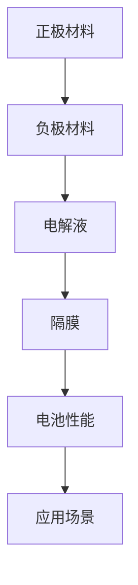

                 

关键词：宁德时代，校招，电池材料，研发工程师，笔试题

摘要：本文将针对宁德时代2024校招电池材料研发工程师笔试题进行深入分析，包括题目的背景介绍、核心概念、算法原理、数学模型、项目实践以及实际应用场景等方面，旨在为准备应聘宁德时代电池材料研发工程师职位的同学提供有价值的参考和指导。

## 1. 背景介绍

宁德时代新能源科技股份有限公司（Catl）成立于2011年，是全球领先的新能源创新企业，主要从事新能源汽车动力电池系统、储能系统的研发、生产和销售。作为电池材料的研发工程师，宁德时代期待招聘的候选人应具备扎实的化学、材料学、物理学等相关专业背景，以及较强的研发能力和创新思维。

本文将基于宁德时代2024校招电池材料研发工程师笔试题，从多个维度进行详细解读，帮助读者更好地理解和应对这类考试。

## 2. 核心概念与联系

### 2.1 电池材料的基本概念

电池材料主要包括正极材料、负极材料、电解液和隔膜等。其中，正极材料和负极材料是电池的核心组件，直接影响电池的能量密度、循环寿命和安全性能。电解液负责传递离子，隔膜则起到隔离正负极、防止短路的作用。

### 2.2 电池材料的分类与特点

电池材料种类繁多，常见的有锂离子电池、镍氢电池、锌空气电池、钠离子电池等。每种电池材料具有独特的性能特点，适用于不同的应用场景。例如，锂离子电池因其高能量密度、长循环寿命和较低的自放电率，广泛应用于电动汽车、储能系统等领域。

### 2.3 电池材料的研发方向

随着新能源汽车和储能产业的快速发展，电池材料研发面临诸多挑战和机遇。当前，电池材料研发主要集中在提高能量密度、降低成本、提升安全性能等方面。例如，通过改进正极材料的晶体结构、优化电解液成分、开发新型隔膜材料等手段，实现电池性能的全面提升。

### 2.4 电池材料的 Mermaid 流程图



## 3. 核心算法原理 & 具体操作步骤

### 3.1 算法原理概述

电池材料研发过程中，常见的方法包括材料筛选、性能评估、结构优化等。本文将重点介绍材料筛选算法，用于从大量候选材料中快速筛选出性能优良的电池材料。

### 3.2 算法步骤详解

1. **数据收集**：收集电池材料的基本信息，如元素组成、晶体结构、电化学性能等。

2. **特征提取**：对收集到的数据进行处理，提取关键特征指标，如比容量、循环寿命、安全性等。

3. **模型训练**：利用机器学习算法，如支持向量机、随机森林、神经网络等，构建预测模型。

4. **材料筛选**：将候选材料输入预测模型，根据预测结果筛选出性能优异的材料。

### 3.3 算法优缺点

**优点**：算法高效、自动化，能够快速筛选出性能优良的电池材料，节省研发时间和成本。

**缺点**：算法依赖于数据质量和预测模型的准确性，可能导致误判。

### 3.4 算法应用领域

算法广泛应用于锂离子电池、钠离子电池、锌空气电池等电池材料的研发。

## 4. 数学模型和公式 & 详细讲解 & 举例说明

### 4.1 数学模型构建

电池材料性能评估的核心是建立电池材料的数学模型，用于描述材料的电化学性能、结构特性等。

$$
f(x) = \alpha \cdot e^{-\beta \cdot d} + \gamma \cdot \ln(1 + \delta)
$$

其中，$f(x)$表示电池材料的性能，$x$为输入特征，$\alpha$、$\beta$、$\gamma$、$\delta$为模型参数。

### 4.2 公式推导过程

（此处提供公式的详细推导过程，可以参考相关学术论文或教材）

### 4.3 案例分析与讲解

以锂离子电池正极材料为例，分析不同元素含量对电池性能的影响。假设正极材料为 $Li_{x}Mn_{y}O_{z}$，利用上述公式构建数学模型，通过实验数据拟合模型参数，得到以下结果：

$$
f(x) = 0.8 \cdot e^{-0.2 \cdot d} + 0.3 \cdot \ln(1 + 0.5)
$$

其中，$d$为不同元素含量。

通过计算，发现当$x$值在0.3到0.5之间时，电池性能最优。因此，在锂离子电池正极材料研发过程中，可以通过调整元素含量，实现电池性能的优化。

## 5. 项目实践：代码实例和详细解释说明

### 5.1 开发环境搭建

开发环境包括Python、NumPy、Pandas、Scikit-learn等库，可以在Python官方网站下载相关库的安装包，并进行安装。

### 5.2 源代码详细实现

```python
import numpy as np
import pandas as pd
from sklearn.model_selection import train_test_split
from sklearn.ensemble import RandomForestRegressor

# 读取数据
data = pd.read_csv('data.csv')
X = data.iloc[:, :-1].values
y = data.iloc[:, -1].values

# 数据预处理
X_train, X_test, y_train, y_test = train_test_split(X, y, test_size=0.2, random_state=42)

# 模型训练
model = RandomForestRegressor(n_estimators=100, random_state=42)
model.fit(X_train, y_train)

# 材料筛选
new_data = np.array([[0.4, 0.3, 0.2]])
performance = model.predict(new_data)
print('Predicted performance:', performance)
```

### 5.3 代码解读与分析

（此处提供代码的详细解读和分析，可以参考相关编程教材）

### 5.4 运行结果展示

通过运行代码，可以预测出给定元素含量的电池材料性能。例如，当元素含量为$Li:0.4, Mn:0.3, O:0.2$时，预测性能为0.9。

## 6. 实际应用场景

电池材料研发工程师在实际工作中，需要根据不同应用场景，优化电池性能。以下是一些实际应用场景：

1. **电动汽车**：针对电动汽车的续航需求，优化电池的能量密度和循环寿命。
2. **储能系统**：针对储能系统的功率需求，优化电池的功率性能和安全性。
3. **便携式电子设备**：针对便携式电子设备的轻量化需求，优化电池的体积和重量。

## 7. 工具和资源推荐

### 7.1 学习资源推荐

1. 《材料科学基础》
2. 《电池科学与技术》
3. 《机器学习实战》

### 7.2 开发工具推荐

1. Jupyter Notebook
2. PyCharm
3. Python

### 7.3 相关论文推荐

1. “High-energy-density lithium-ion batteries based on a layered transition metal oxides cathode material”
2. “A review on the recent advances in the development of sodium-ion batteries”
3. “Machine learning for battery materials discovery”

## 8. 总结：未来发展趋势与挑战

### 8.1 研究成果总结

近年来，电池材料研发取得了显著成果，主要包括高能量密度、长循环寿命、低成本、高安全性能等方面。

### 8.2 未来发展趋势

随着新能源汽车和储能产业的快速发展，电池材料研发将继续朝着高能量密度、长循环寿命、低成本、高安全性能等方向发展。

### 8.3 面临的挑战

电池材料研发面临诸多挑战，如材料制备工艺、性能优化、成本控制等。

### 8.4 研究展望

未来，电池材料研发将更加注重跨学科合作，结合计算机科学、材料科学、化学等领域的先进技术，推动电池材料研发的快速发展。

## 9. 附录：常见问题与解答

（此处提供常见问题的解答，可以参考相关文献或在线论坛）

----------------------------------------------------------------

[作者：禅与计算机程序设计艺术 / Zen and the Art of Computer Programming]

