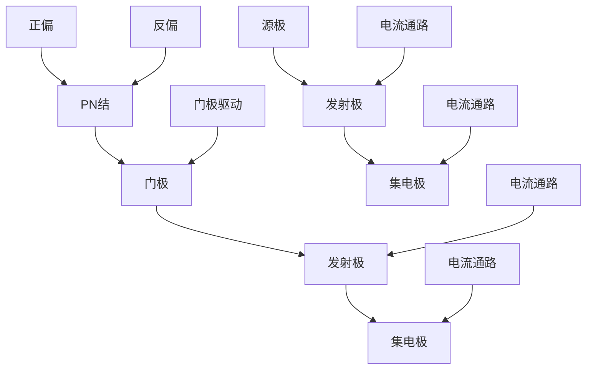

                 

关键词：安森美，校招，功率半导体，工程师，面试问答

## 摘要

本文针对安森美2024校招功率半导体工程师的面试问答进行了详细解读。通过梳理面试中可能涉及的核心问题，本文旨在帮助求职者更好地准备面试，了解面试的重点和难点。文章内容涵盖了功率半导体基础知识、模拟与数字电路设计、器件特性、应用场景等多个方面，旨在为读者提供全面的技术指导和面试策略。

## 1. 背景介绍

安森美（On Semiconductor）是一家全球领先的半导体制造商，专注于功率半导体器件的研发、生产与销售。随着新能源、电动汽车、工业自动化等领域的快速发展，功率半导体在能源转换、控制与调节中的作用日益凸显。因此，功率半导体工程师成为半导体行业的热门职位。

本文旨在为2024年安森美校招功率半导体工程师面试提供针对性的指导，帮助求职者深入了解面试的核心内容，提高面试通过率。

### 1.1 功率半导体行业现状

近年来，功率半导体市场呈现出快速增长的趋势。据市场研究机构统计，全球功率半导体市场规模在2021年已达到150亿美元，预计到2026年将增长至230亿美元。这一增长主要得益于以下因素：

- **新能源汽车的普及**：电动汽车对功率半导体的需求大幅增加，尤其是IGBT（绝缘栅双极型晶体管）和MOSFET（金属氧化物半导体场效应晶体管）。
- **可再生能源的发展**：太阳能、风能等可再生能源的快速发展，带动了功率半导体在储能、逆变器等领域的应用。
- **工业自动化**：工业4.0时代的到来，工业自动化设备对功率半导体控制的需求不断增加。

### 1.2 功率半导体工程师的岗位职责

功率半导体工程师在半导体企业中承担着重要角色，主要职责包括：

- **器件设计**：根据产品需求，设计新型功率半导体器件。
- **性能优化**：对现有器件进行性能优化，提高其效率、可靠性和稳定性。
- **工艺开发**：参与器件制造工艺的开发与改进。
- **应用支持**：为下游客户提供技术支持和解决方案。

## 2. 核心概念与联系

### 2.1 功率半导体基础知识

#### 2.1.1 功率半导体器件分类

功率半导体器件主要包括以下几类：

- **二极管**：具有单向导通特性，用于电源整流、电路保护等。
- **晶闸管**：具有可控导通特性，用于大功率开关控制。
- **IGBT**：结合了晶体管和晶闸管的优点，适用于中高压、大电流场景。
- **MOSFET**：具有低导通电阻、高开关速度等优点，广泛应用于低压小功率场景。

#### 2.1.2 功率半导体工作原理

功率半导体器件的核心原理是基于PN结的导电特性。当PN结正偏时，电流可以顺利通过；当PN结反偏时，电流几乎为零。通过控制PN结的正反偏，可以实现功率半导体器件的导通与关断。

### 2.2 功率半导体器件结构

以下是一个典型的功率半导体器件（如IGBT）的Mermaid流程图：



### 2.3 功率半导体器件特性

#### 2.3.1 效率

功率半导体器件的效率是衡量其性能的重要指标。效率越高，器件在工作过程中损耗的能量越少，有利于提高整个系统的效率。

#### 2.3.2 可靠性

功率半导体器件的可靠性关系到系统的稳定性和安全性。器件在长时间工作过程中应具备较高的可靠性，以降低故障率。

#### 2.3.3 开关速度

开关速度是指功率半导体器件从导通状态到关断状态所需的时间。开关速度越快，器件的响应速度越快，有利于提高系统的控制精度。

## 3. 核心算法原理 & 具体操作步骤

### 3.1 算法原理概述

功率半导体器件的控制算法主要包括以下几种：

- **脉冲宽度调制（PWM）**：通过改变脉冲宽度，实现对功率半导体器件的开关控制。
- **脉宽调制（PDM）**：通过改变脉冲之间的间隔，实现对功率半导体器件的开关控制。
- **频率调制（FM）**：通过改变脉冲频率，实现对功率半导体器件的开关控制。

### 3.2 算法步骤详解

以PWM算法为例，其具体操作步骤如下：

1. **采样**：对输入信号进行采样，获取电压、电流等参数。
2. **比较**：将采样得到的信号与预设的参考信号进行比较，确定开关控制信号。
3. **调制**：根据比较结果，对开关控制信号进行PWM调制，生成PWM信号。
4. **驱动**：将PWM信号送入功率半导体器件的驱动电路，实现对器件的开关控制。

### 3.3 算法优缺点

#### 3.3.1 优点

- **控制精度高**：PWM算法能够实现对功率半导体器件的精细控制，提高系统的控制精度。
- **响应速度快**：PWM算法的响应速度较快，有利于提高系统的动态性能。

#### 3.3.2 缺点

- **输出波形失真**：PWM算法的输出波形为矩形波，可能存在波形失真问题。
- **功率消耗较大**：PWM算法在工作过程中会产生一定的功率损耗，影响系统的整体效率。

### 3.4 算法应用领域

PWM算法广泛应用于以下领域：

- **电机控制**：用于电机的速度和转矩控制，提高电机的运行效率。
- **逆变器**：用于太阳能、风能等可再生能源的并网控制。
- **电力调节**：用于电力系统的电压和频率调节，提高电力系统的稳定性。

## 4. 数学模型和公式 & 详细讲解 & 举例说明

### 4.1 数学模型构建

功率半导体器件的数学模型主要包括以下部分：

- **器件参数**：包括器件的额定电压、电流、导通电阻等。
- **开关特性**：描述器件在开关过程中电压、电流的变化规律。
- **控制特性**：描述器件在不同控制信号下的开关行为。

### 4.2 公式推导过程

以IGBT为例，其开关特性可以用以下公式描述：

$$
V_{\text{DS}} = V_{\text{th}} + \frac{I_{\text{DS}}}{g_{\text{m}}}
$$

其中，$V_{\text{DS}}$为栅极与源极之间的电压，$V_{\text{th}}$为阈值电压，$I_{\text{DS}}$为栅极与源极之间的电流，$g_{\text{m}}$为转移电导。

### 4.3 案例分析与讲解

假设一个IGBT器件的额定电压为1200V，额定电流为100A，导通电阻为0.2Ω。当输入信号为PWM波形，占空比为50%时，分析器件的工作状态。

根据公式推导，当IGBT处于导通状态时，其栅极与源极之间的电压为：

$$
V_{\text{DS}} = V_{\text{th}} + \frac{I_{\text{DS}}}{g_{\text{m}}}
$$

其中，$V_{\text{th}} = 1V$，$g_{\text{m}} = 10\text{S}$。

代入数值计算，得到：

$$
V_{\text{DS}} = 1V + \frac{100A}{10S} = 11V
$$

由于IGBT的额定电压为1200V，因此在此情况下，器件处于正常工作状态。此时，器件的导通电阻为0.2Ω，通过计算可得器件的导通电流为：

$$
I_{\text{DS}} = \frac{V_{\text{DS}}}{R_{\text{DS}}} = \frac{11V}{0.2\Omega} = 55A
$$

由此可见，当PWM占空比为50%时，IGBT器件的导通电流为额定电流的一半，满足工作要求。

## 5. 项目实践：代码实例和详细解释说明

### 5.1 开发环境搭建

为了演示功率半导体控制算法的实践应用，我们使用Arduino开发板和对应的功率半导体驱动模块。具体步骤如下：

1. **硬件连接**：将Arduino开发板与功率半导体驱动模块连接，确保连接正确无误。
2. **环境配置**：下载并安装Arduino IDE开发环境，选择合适的开发板型号。
3. **依赖库安装**：下载并安装相关的功率半导体驱动库，如`arduino-pwm`库。

### 5.2 源代码详细实现

以下是一个简单的PWM控制程序，用于驱动功率半导体器件：

```c++
#include <Arduino.h>
#include <PWM.h>

// 定义PWM控制引脚
const int pwmPin = 9;

// 初始化PWM库
PWM pwm(pwmPin);

void setup() {
  // 设置PWM频率为1000Hz
  pwm.setPWMFrequency(1000);

  // 设置PWM占空比为50%
  pwm.setPWM(0, 50);
}

void loop() {
  // 循环控制
  delay(1000);
}
```

### 5.3 代码解读与分析

- **头文件包含**：程序首先包含相关的头文件，如`Arduino.h`和`PWM.h`。
- **定义PWM控制引脚**：使用`#define`语句定义PWM控制引脚，如`pwmPin = 9`。
- **初始化PWM库**：使用`PWM`类初始化PWM库，如`PWM pwm(pwmPin)`。
- **设置PWM频率**：使用`setPWMFrequency()`方法设置PWM频率，如`pwm.setPWMFrequency(1000)`。
- **设置PWM占空比**：使用`setPWM()`方法设置PWM占空比，如`pwm.setPWM(0, 50)`。

### 5.4 运行结果展示

程序运行后，Arduino开发板会通过PWM引脚输出频率为1000Hz、占空比为50%的PWM信号。将PWM信号输入功率半导体驱动模块，驱动模块会根据PWM信号实现对功率半导体器件的开关控制。

## 6. 实际应用场景

### 6.1 电机控制

功率半导体器件广泛应用于电机控制领域，如电动汽车、变频空调等。通过PWM控制算法，实现对电机速度和转矩的精细调节。

### 6.2 逆变器

逆变器是太阳能、风能等可再生能源系统中的重要组成部分，用于将直流电转换为交流电。功率半导体器件在逆变器中发挥关键作用，实现高效、稳定的电能转换。

### 6.3 电力调节

功率半导体器件在电力调节领域有着广泛的应用，如电压调节、频率调节等。通过PWM控制算法，实现对电力系统的实时调节，提高系统的稳定性和可靠性。

## 7. 未来应用展望

### 7.1 新能源领域

随着全球对环境保护的日益重视，新能源领域对功率半导体器件的需求将持续增长。未来，功率半导体器件在新能源汽车、风力发电、太阳能发电等领域将发挥更加重要的作用。

### 7.2 工业自动化

工业自动化是功率半导体器件的重要应用领域之一。未来，随着工业4.0的深入推进，功率半导体器件在工业自动化设备中的应用将更加广泛，如机器人、数控机床等。

### 7.3 人工智能

人工智能技术的快速发展，将为功率半导体器件带来新的应用场景。例如，在智能电网、智能交通等领域，功率半导体器件将与其他智能技术相结合，实现更高水平的自动化和智能化。

## 8. 工具和资源推荐

### 8.1 学习资源推荐

- **《功率半导体器件原理与应用》**：详细介绍了功率半导体器件的基本原理和应用技术。
- **《电力电子技术》**：涵盖了电力电子器件、电路及控制系统等方面的知识。

### 8.2 开发工具推荐

- **Arduino IDE**：用于开发基于Arduino平台的功率半导体控制程序。
- **LabVIEW**：用于开发功率半导体仿真和测试系统。

### 8.3 相关论文推荐

- **"High-Efficiency Power Semiconductor Devices for Renewable Energy Applications"**：探讨功率半导体器件在可再生能源领域的应用。
- **"Design and Implementation of a Power Semiconductor Inverter for Electric Vehicles"**：介绍电动汽车用功率半导体逆变器的设计与实现。

## 9. 总结：未来发展趋势与挑战

### 9.1 研究成果总结

近年来，功率半导体器件在性能、可靠性、效率等方面取得了显著进展。未来，随着新能源、工业自动化等领域的快速发展，功率半导体器件将继续在技术创新和应用拓展方面取得突破。

### 9.2 未来发展趋势

- **高效能化**：提高功率半导体器件的转换效率，降低能耗。
- **小型化**：减小器件尺寸，提高系统集成度。
- **智能化**：结合人工智能技术，实现功率半导体器件的智能控制。

### 9.3 面临的挑战

- **可靠性**：提高器件的可靠性和稳定性，确保在复杂环境下长期运行。
- **成本**：降低器件制造成本，提高市场竞争力。

### 9.4 研究展望

未来，功率半导体器件的研究将朝着高效、智能、可靠的方向发展。通过不断创新，功率半导体器件将在新能源、工业自动化、人工智能等领域发挥更加重要的作用。

## 附录：常见问题与解答

### 9.1 功率半导体器件的优缺点是什么？

**优点**：高效率、低损耗、高开关速度、小型化。

**缺点**：制造成本较高、可靠性需要提高。

### 9.2 功率半导体器件在新能源汽车中有哪些应用？

**应用**：电机驱动、逆变器、电池管理系统。

### 9.3 功率半导体器件的开关控制算法有哪些？

**算法**：PWM、PDM、FM等。

### 9.4 如何提高功率半导体器件的可靠性？

**方法**：优化器件设计、提高材料质量、加强环境测试。

### 9.5 功率半导体器件在工业自动化中的应用前景如何？

**前景**：广泛用于工业自动化设备中的电机控制、电源管理、传感器信号处理等。

**作者**：禅与计算机程序设计艺术 / Zen and the Art of Computer Programming

