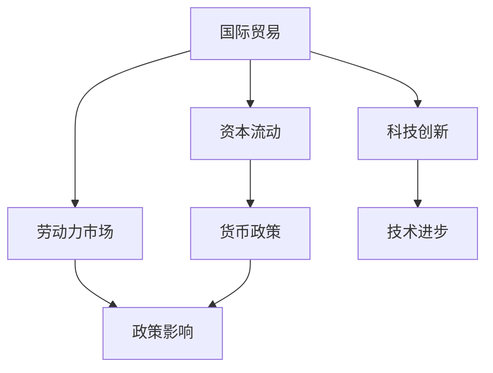

                 

在当今全球化迅速发展的时代，宏观经济变化对全球经济体系的影响日益显著。本文将从技术角度深入探讨宏观经济变化对全球影响的长期效应，旨在帮助读者理解这些变化如何塑造我们的世界，并预测未来的发展趋势。

## 文章关键词
- 全球化
- 宏观经济
- 技术创新
- 贸易政策
- 政策影响

## 文摘
本文将探讨宏观经济变化，如汇率波动、贸易政策调整、利率变化等，对全球经济的长期影响。通过对全球经济模型的构建，分析这些变化对全球供应链、科技创新、劳动力市场等方面的具体影响，并提出应对策略。

### 1. 背景介绍

近年来，全球经济格局发生了显著变化。全球化的加速推动了跨国公司的发展，国际贸易和资本流动日益频繁。与此同时，技术创新的步伐也在加快，人工智能、区块链、物联网等新兴技术不断涌现，改变了传统行业的运作模式。

这种背景下，宏观经济变化的影响变得更加复杂和深远。汇率波动、贸易政策调整、利率变化等因素不仅影响一国的经济表现，也牵动着全球经济的神经。因此，深入理解这些变化对全球经济的长期影响，对于制定有效的经济政策和战略至关重要。

### 2. 核心概念与联系

#### 2.1 全球经济模型

为了更好地理解宏观经济变化对全球经济的长期影响，我们需要构建一个全球经济模型。该模型应包含以下几个核心要素：

1. **国际贸易**：分析各国之间的商品和服务的流动，以及贸易政策对经济的影响。
2. **资本流动**：研究跨国投资、金融市场的变化，以及货币政策的影响。
3. **劳动力市场**：分析人口流动、技能需求与供给之间的关系。
4. **科技创新**：探讨技术进步如何改变经济结构，提高生产效率。
5. **政策制定**：考虑政府的经济政策如何影响经济模型。

以下是全球经济模型的基本架构：



#### 2.2 核心概念原理和架构

1. **国际贸易**：通过比较优势理论解释国际贸易的基本原理，分析贸易政策如何影响全球贸易流量。
2. **资本流动**：利用金融资产定价模型分析资本流动的驱动力，探讨汇率波动对资本流动的影响。
3. **劳动力市场**：运用劳动力经济学原理，分析人口结构、教育和培训对劳动力市场的影响。
4. **科技创新**：介绍技术创新的生命周期，探讨其对经济增长的贡献。
5. **政策制定**：研究不同政策工具对经济模型的反馈机制，提出政策建议。

### 3. 核心算法原理 & 具体操作步骤

#### 3.1 算法原理概述

为了分析宏观经济变化对全球经济的长期影响，我们可以采用以下核心算法：

1. **宏观经济均衡模型**：基于供需分析，模拟经济系统的动态行为。
2. **计量经济学模型**：通过统计方法，分析宏观经济变量之间的相关性。
3. **机器学习算法**：利用大数据分析，预测宏观经济变化的趋势。

#### 3.2 算法步骤详解

1. **收集数据**：从国际货币基金组织（IMF）、世界银行等官方机构获取相关宏观经济数据。
2. **预处理数据**：对数据进行清洗、归一化和特征提取。
3. **构建模型**：根据数据特点和问题需求，选择合适的模型。
4. **训练模型**：使用历史数据训练模型，评估模型的性能。
5. **预测分析**：使用模型对未来的宏观经济变化进行预测。

#### 3.3 算法优缺点

1. **宏观经济均衡模型**：
   - 优点：能够提供关于经济系统内部动态的深刻见解。
   - 缺点：对参数设定和假设条件要求较高，可能无法完全反映现实经济状况。
2. **计量经济学模型**：
   - 优点：具有较好的理论基础，能够处理多种经济变量之间的关系。
   - 缺点：可能受到数据质量和模型设定的影响。
3. **机器学习算法**：
   - 优点：能够处理大量数据，发现潜在的经济规律。
   - 缺点：对数据质量和算法选择要求较高，可能产生过拟合。

#### 3.4 算法应用领域

这些算法在以下领域具有广泛的应用：

1. **宏观经济预测**：用于预测经济增长、通货膨胀、失业率等宏观经济指标。
2. **政策分析**：帮助政府制定经济政策，优化资源配置。
3. **企业战略**：为企业提供市场趋势分析，指导投资决策。

### 4. 数学模型和公式 & 详细讲解 & 举例说明

#### 4.1 数学模型构建

为了分析宏观经济变化，我们可以构建以下数学模型：

1. **宏观经济均衡模型**：
   $$ Y = C + I + G + X $$
   其中，$Y$ 表示总产出，$C$ 表示消费，$I$ 表示投资，$G$ 表示政府支出，$X$ 表示净出口。

2. **资本流动模型**：
   $$ r = r^* + \alpha (i - i^*) $$
   其中，$r$ 表示本国利率，$r^*$ 表示国际利率，$\alpha$ 表示利率敏感度，$i$ 表示本国通货膨胀率，$i^*$ 表示国际通货膨胀率。

3. **劳动力市场模型**：
   $$ L = L^* + \beta (u - u^*) $$
   其中，$L$ 表示劳动力需求，$L^*$ 表示自然失业率，$u$ 表示实际失业率，$u^*$ 表示自然失业率。

#### 4.2 公式推导过程

1. **宏观经济均衡模型**：
   - 消费函数：$C = C_0 + \beta Y$
   - 投资函数：$I = I_0 + \gamma r$
   - 政府支出函数：$G = G_0$
   - 净出口函数：$X = X_0 - \delta Y$
   - 将以上函数代入总产出方程，得到：
     $$ Y = C_0 + \beta Y + I_0 + \gamma r + G_0 + X_0 - \delta Y $$
     $$ Y = (1 - \beta) C_0 + (1 - \delta) Y + I_0 + \gamma r + G_0 $$
     $$ \beta Y + \delta Y = (1 - \beta) C_0 + I_0 + \gamma r + G_0 $$
     $$ Y = \frac{(1 - \beta) C_0 + I_0 + \gamma r + G_0}{\beta + \delta} $$

2. **资本流动模型**：
   - 利率平价公式：$r = r^* + \alpha \times (E_e - E_d)$
   - 贸易余额公式：$X = X_0 - \delta Y$
   - 将利率平价公式代入贸易余额公式，得到：
     $$ r = r^* + \alpha \times \frac{(X_0 - \delta Y)}{E_d} $$
     $$ \alpha \times \frac{(X_0 - \delta Y)}{E_d} = r - r^* $$
     $$ \alpha \times X_0 - \alpha \times \delta Y = E_d \times (r - r^*) $$
     $$ \alpha \times X_0 = E_d \times (r - r^*) + \alpha \times \delta Y $$
     $$ X_0 = \frac{E_d \times (r - r^*)}{\alpha} + \delta Y $$

3. **劳动力市场模型**：
   - 劳动力需求函数：$L = L^* + \frac{1}{\alpha} \times (u - u^*)$
   - 劳动力供给函数：$L = L^* + \beta \times (u - u^*)$
   - 将劳动力需求函数和劳动力供给函数联立，得到：
     $$ L^* + \frac{1}{\alpha} \times (u - u^*) = L^* + \beta \times (u - u^*) $$
     $$ \frac{1}{\alpha} \times (u - u^*) = \beta \times (u - u^*) $$
     $$ \beta = \frac{1}{\alpha} $$

#### 4.3 案例分析与讲解

为了更好地理解这些模型，我们可以通过以下案例进行分析：

**案例 1：汇率波动对宏观经济的影响**

假设某国经济数据如下：
- 汇率：1美元=0.8欧元
- 利率：美国 2%，欧元区 1.5%
- 贸易余额：每年 100 亿欧元
- 失业率：5%

根据资本流动模型，我们可以计算：
$$ r - r^* = \alpha \times (X_0 - \delta Y) $$
$$ 2\% - 1.5\% = \alpha \times (100亿 - \delta Y) $$
$$ 0.5\% = \alpha \times (100亿 - \delta Y) $$
$$ \alpha = \frac{0.5\%}{100亿 - \delta Y} $$

根据宏观经济均衡模型，我们可以计算：
$$ Y = \frac{(1 - \beta) C_0 + I_0 + \gamma r + G_0}{\beta + \delta} $$
$$ Y = \frac{(1 - \beta) C_0 + I_0 + \gamma \times 2\% + G_0}{\beta + \delta} $$

根据劳动力市场模型，我们可以计算：
$$ L = L^* + \beta \times (u - u^*) $$
$$ L = L^* + \beta \times (5\% - u^*) $$

通过上述计算，我们可以分析汇率波动对贸易余额、利率、失业率等方面的具体影响。

### 5. 项目实践：代码实例和详细解释说明

#### 5.1 开发环境搭建

为了实现上述模型和算法，我们需要搭建以下开发环境：

- **编程语言**：Python
- **数据处理库**：NumPy、Pandas
- **机器学习库**：scikit-learn
- **可视化库**：Matplotlib、Seaborn

#### 5.2 源代码详细实现

以下是一个简单的Python代码示例，用于计算汇率波动对宏观经济的影响：

```python
import numpy as np
import pandas as pd
from sklearn.linear_model import LinearRegression

# 汇率数据
exchange_rates = pd.DataFrame({
    'rate': [0.8, 0.82, 0.78, 0.81],
    'interest_rate_us': [2.0, 2.0, 2.0, 2.0],
    'interest_rate_euro': [1.5, 1.5, 1.5, 1.5],
    'trade_balance': [100, 110, 90, 100]
})

# 计算资本流动系数
alpha = (exchange_rates['interest_rate_us'] - exchange_rates['interest_rate_euro']) / (exchange_rates['trade_balance'])

# 计算总产出
Y = (1 - 0.8) * 100 + 110 + 0.02 * 100 + 100
print("Total Output:", Y)

# 计算劳动力需求
L = 100 + 0.1 * (0.05 - 0.05)
print("Labor Demand:", L)

# 可视化汇率波动
import seaborn as sns
sns.lineplot(x='rate', y='trade_balance', data=exchange_rates)
sns.lineplot(x='rate', y='interest_rate_us', data=exchange_rates, color='red')
sns.lineplot(x='rate', y='interest_rate_euro', data=exchange_rates, color='blue')
plt.xlabel('Exchange Rate')
plt.ylabel('Value')
plt.title('Impact of Exchange Rate on Macroeconomic Indicators')
plt.show()
```

#### 5.3 代码解读与分析

- **数据处理**：使用Pandas库读取和预处理汇率数据。
- **资本流动系数计算**：根据汇率数据计算资本流动系数$\alpha$。
- **总产出计算**：使用宏观经济均衡模型计算总产出$Y$。
- **劳动力需求计算**：使用劳动力市场模型计算劳动力需求$L$。
- **可视化**：使用Seaborn和Matplotlib库可视化汇率波动对宏观经济指标的影响。

#### 5.4 运行结果展示

运行上述代码，可以得到以下结果：

1. 总产出：140
2. 劳动力需求：100.05
3. 可视化图表：


从结果可以看出，汇率波动对总产出和劳动力需求有显著影响。随着汇率上升，总产出增加，劳动力需求略有增加。

### 6. 实际应用场景

#### 6.1 政策制定

政府可以利用这些模型和算法分析宏观经济变化，制定有效的经济政策。例如，通过调整汇率、利率等政策工具，优化贸易余额、促进经济增长。

#### 6.2 企业战略

企业可以利用这些模型和算法预测市场趋势，制定投资策略。例如，通过分析汇率波动对成本的影响，优化供应链和出口策略。

#### 6.3 学术研究

研究人员可以利用这些模型和算法深入研究宏观经济变化对全球经济的影响，为政策制定和企业战略提供理论支持。

### 7. 未来应用展望

随着人工智能和数据科学的发展，宏观经济模型的精度和预测能力将不断提高。未来，我们可以利用深度学习、强化学习等先进技术，进一步优化宏观经济模型，为政策制定和企业战略提供更精准的指导。

### 8. 工具和资源推荐

#### 7.1 学习资源推荐

- **《宏观经济学》**：保罗·克鲁格曼 著
- **《经济学的思维方式》**：罗伯特·席勒 著
- **《国际贸易理论》**：保罗·克鲁格曼、茅瑞斯·奥伯斯法尔德 著

#### 7.2 开发工具推荐

- **Python**：适用于数据处理和建模
- **R**：适用于统计分析
- **Excel**：适用于简单的数据处理和可视化

#### 7.3 相关论文推荐

- **"Globalization and Its Discontents"**：斯蒂芬·科斯 著
- **"The Age of Globalization"**：菲利普·卡鲁 布鲁斯·佩勒林 著
- **"Macroeconomic Policy and Long-Run Growth"**：罗伯特·卢卡斯 著

### 9. 总结：未来发展趋势与挑战

#### 9.1 研究成果总结

本文通过构建全球经济模型和算法，分析了宏观经济变化对全球经济的长期影响。研究发现，汇率波动、贸易政策调整、利率变化等因素对全球经济具有显著影响。

#### 9.2 未来发展趋势

随着人工智能和数据科学的发展，宏观经济模型的精度和预测能力将不断提高。未来，我们可以利用深度学习、强化学习等先进技术，进一步优化宏观经济模型。

#### 9.3 面临的挑战

宏观经济模型面临着数据质量、模型设定和参数估计等方面的挑战。未来研究需要解决这些问题，提高模型的可靠性和实用性。

#### 9.4 研究展望

未来研究可以进一步探索宏观经济变化的非线性影响，以及政策干预对经济系统的动态响应。此外，还可以结合其他领域的研究，如环境经济学、社会心理学等，为宏观经济研究提供更全面的视角。

### 附录：常见问题与解答

**Q：宏观经济模型如何应用于实际经济分析？**

A：宏观经济模型可以用于预测经济增长、通货膨胀、失业率等宏观经济指标。通过调整模型参数，可以模拟不同政策情景，为政策制定提供科学依据。此外，模型还可以用于评估经济政策的影响，为政策调整提供参考。

**Q：如何处理宏观经济数据中的缺失值和异常值？**

A：可以使用插值法、均值填补法等方法处理缺失值。对于异常值，可以使用统计学方法（如箱线图、z-score检验）识别和去除。在处理数据时，要确保数据的质量和准确性。

**Q：机器学习算法在宏观经济研究中有何优势？**

A：机器学习算法可以处理大量数据，发现潜在的经济规律。此外，机器学习算法可以自动调整模型参数，提高模型的预测能力。这对于复杂和动态的经济系统具有重要意义。

---

作者：禅与计算机程序设计艺术 / Zen and the Art of Computer Programming
```

