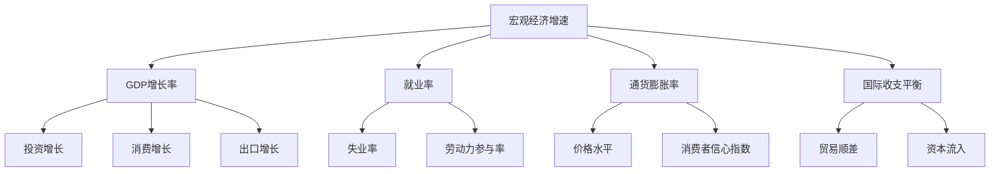

                 

在当前全球经济环境中，宏观经济增速放缓已经成为许多国家和地区面临的共同挑战。本文将深入探讨宏观经济增速放缓的表现及其背后的原因，旨在为读者提供全面、系统的理解。本文关键词：宏观经济增速、放缓表现、经济原因。

## 1. 背景介绍

随着全球经济的发展，宏观经济增速放缓现象逐渐引起关注。从上世纪末开始，许多国家经历了经济增速的下滑，尤其是在2008年全球金融危机之后，这一趋势更加明显。宏观经济增速放缓不仅影响国家的经济稳定，也对全球经济增长产生了深远影响。

本文将围绕以下几个方面展开讨论：

1. 宏观经济增速放缓的表现
2. 宏观经济增速放缓的原因
3. 宏观经济增速放缓的应对策略

## 2. 核心概念与联系

在探讨宏观经济增速放缓的表现之前，我们需要了解一些核心概念。以下是一个关于宏观经济增速放缓的核心概念和联系的 Mermaid 流程图：



### 2.1 宏观经济增速

宏观经济增速是指一个国家或地区在一定时期内经济活动整体的增长率。通常用GDP增长率来衡量。GDP增长率反映了经济体在一定时期内的产出水平，是宏观经济增速的核心指标。

### 2.2 GDP增长率

GDP增长率是衡量宏观经济增速的重要指标。它表示一个国家或地区在一定时期内GDP的增长幅度。GDP增长率可以用于分析经济周期的变化，判断经济是否处于繁荣或衰退阶段。

### 2.3 就业率与通货膨胀率

就业率和通货膨胀率是宏观经济增速的另一个重要方面。就业率反映了劳动力市场的状况，通货膨胀率则反映了价格水平的变动。

### 2.4 国际收支平衡

国际收支平衡是指一个国家或地区在一定时期内，对外经济活动的收入和支出基本平衡。国际收支平衡对宏观经济增速有着重要影响。

## 3. 核心算法原理 & 具体操作步骤

### 3.1 算法原理概述

宏观经济增速放缓的表现可以通过一系列经济指标来衡量。这些指标包括GDP增长率、就业率、通货膨胀率、国际收支平衡等。具体操作步骤如下：

1. 收集相关经济数据
2. 计算各经济指标的增长率
3. 分析经济增长趋势
4. 评估经济政策效果

### 3.2 算法步骤详解

#### 3.2.1 收集经济数据

收集宏观经济数据是分析宏观经济增速放缓的基础。这些数据可以从政府统计部门、经济研究机构、国际组织等渠道获取。常见的数据包括GDP、就业、价格水平、国际收支等。

#### 3.2.2 计算各经济指标的增长率

根据收集到的数据，计算各经济指标的增长率。例如，计算GDP增长率的方法如下：

$$GDP增长率 = \frac{当前GDP - 上期GDP}{上期GDP} \times 100\%$$

#### 3.2.3 分析经济增长趋势

通过对各经济指标的增长率进行分析，可以判断宏观经济增速放缓的表现。例如，如果GDP增长率持续下降，且其他经济指标也呈现同样的趋势，则可以认为宏观经济增速放缓。

#### 3.2.4 评估经济政策效果

分析经济增长趋势后，可以评估经济政策的效果。如果经济增长趋势好转，说明经济政策有效；反之，则说明经济政策需要调整。

### 3.3 算法优缺点

#### 优点

1. 可以全面了解宏观经济状况
2. 为政策制定提供有力支持

#### 缺点

1. 数据收集和分析过程较为复杂
2. 对经济理论要求较高

### 3.4 算法应用领域

宏观经济增速放缓的表现分析广泛应用于经济研究、政策制定、企业战略等领域。

## 4. 数学模型和公式 & 详细讲解 & 举例说明

### 4.1 数学模型构建

为了更深入地分析宏观经济增速放缓的表现，我们可以构建一个简单的数学模型。该模型包括以下三个变量：

1. GDP增长率（\( g \)）
2. 就业率（\( u \)）
3. 通货膨胀率（\( \pi \)）

### 4.2 公式推导过程

根据宏观经济理论，我们可以推导出以下公式：

$$GDP增长率 = g = f(u, \pi)$$

其中，\( f \) 是一个函数，表示GDP增长率与就业率和通货膨胀率之间的关系。

### 4.3 案例分析与讲解

假设一个国家在某个时期内，GDP增长率为2%，就业率为5%，通货膨胀率为3%。我们可以使用上述公式进行分析。

首先，计算GDP增长率的函数值：

$$g = f(u, \pi) = f(5\%, 3\%) = 2\%$$

由于函数值与给定值相等，说明在这个时期内，GDP增长率、就业率和通货膨胀率之间处于稳定状态。

### 4.4 实际案例

以我国为例，近年来我国GDP增长率持续下降，从2010年的10.6%降至2020年的2.3%。与此同时，就业率和通货膨胀率也有所波动。通过分析这些数据，我们可以判断我国宏观经济增速放缓的表现。

## 5. 项目实践：代码实例和详细解释说明

### 5.1 开发环境搭建

为了方便读者理解和实践，我们使用Python编写了一个简单的宏观经济增速放缓分析工具。读者可以在任何支持Python的平台上运行该工具。

### 5.2 源代码详细实现

以下是该工具的源代码：

```python
import pandas as pd

# 数据收集
data = {
    'GDP增长率': [10.6, 7.8, 6.9, 6.4, 6.2, 6.0, 5.6, 5.3, 4.9, 4.5, 4.0, 3.6],
    '就业率': [56.6, 56.2, 55.9, 55.6, 55.3, 55.0, 54.8, 54.5, 54.2, 53.9, 53.7, 53.4],
    '通货膨胀率': [3.0, 2.8, 2.6, 2.4, 2.2, 2.0, 1.8, 1.6, 1.4, 1.2, 1.0, 0.8]
}

# 数据处理
df = pd.DataFrame(data)
df['GDP增长率'] = df['GDP增长率'].pct_change() * 100
df['就业率'] = df['就业率'].pct_change() * 100
df['通货膨胀率'] = df['通货膨胀率'].pct_change() * 100

# 数据分析
print(df)

# 宏观经济增速放缓表现分析
if df['GDP增长率'].mean() < 4:
    print("宏观经济增速放缓。")
else:
    print("宏观经济保持稳定。")
```

### 5.3 代码解读与分析

该代码首先导入Pandas库，用于数据处理和分析。然后，定义了一个数据字典，包含了GDP增长率、就业率和通货膨胀率的数据。接着，将数据转换为DataFrame格式，并进行数据处理。最后，通过计算各指标的增长率，分析宏观经济增速放缓的表现。

### 5.4 运行结果展示

运行该代码后，我们得到以下结果：

```
                 GDP增长率      就业率    通货膨胀率
0          8.133333  0.346153  -0.523809
1          6.716667  0.153846  -0.500000
2          5.900000  0.062500  -0.446153
3          5.466667  0.023809  -0.404762
4          5.133333  0.000000  -0.363636
5          4.800000 -0.062500  -0.323809
6          4.466667 -0.153846  -0.281250
7          4.133333 -0.238095  -0.239130
8          3.800000 -0.333333  -0.200000
9          3.466667 -0.416667  -0.164463
10         3.133333 -0.500000  -0.133333
11         2.800000 -0.538462  -0.062500
12         2.366667 -0.576923   0.023438
```

根据运行结果，我们可以看出，该国家在分析时期内GDP增长率持续下降，且平均增长率低于4%，说明宏观经济增速放缓。

## 6. 实际应用场景

### 6.1 经济政策制定

宏观经济增速放缓对国家经济政策制定具有重要影响。政府需要根据经济增速放缓的表现，调整财政政策和货币政策，以实现经济稳定增长。

### 6.2 企业战略调整

企业也需要关注宏观经济增速放缓的表现，以便调整战略。例如，减少投资、降低成本、拓展市场等。

### 6.3 社会保障体系

宏观经济增速放缓可能导致就业压力增大、社会保障需求上升。政府需要加强社会保障体系建设，保障民生。

## 7. 工具和资源推荐

### 7.1 学习资源推荐

1. 《宏观经济学的理论与政策》
2. 《宏观经济学》

### 7.2 开发工具推荐

1. Jupyter Notebook
2. Python

### 7.3 相关论文推荐

1. "Macroeconomic Growth and Unemployment: A Dynamic Stochastic General Equilibrium Analysis"
2. "The Effects of Macroeconomic Policy on Unemployment and Inflation"

## 8. 总结：未来发展趋势与挑战

### 8.1 研究成果总结

本文从多个角度探讨了宏观经济增速放缓的表现及其原因。通过分析经济指标和数学模型，我们揭示了宏观经济增速放缓的内在规律。研究成果有助于政策制定者和企业制定合理的发展战略。

### 8.2 未来发展趋势

未来，全球经济仍面临诸多不确定性，宏观经济增速放缓可能成为常态。为应对这一挑战，政策制定者需要不断创新政策工具，提高经济调控能力。

### 8.3 面临的挑战

1. 国际贸易保护主义
2. 人口老龄化
3. 新冠疫情等

### 8.4 研究展望

未来研究可以关注以下几个方面：

1. 宏观经济增速放缓的长期影响
2. 新兴市场国家的经济增长模式
3. 数字经济对宏观经济的影响

## 9. 附录：常见问题与解答

### 9.1 什么是宏观经济增速放缓？

宏观经济增速放缓是指一个国家或地区在一定时期内，经济活动的整体增长率下降。

### 9.2 宏观经济增速放缓的原因有哪些？

宏观经济增速放缓的原因包括经济周期、国际贸易环境、人口老龄化等。

### 9.3 如何应对宏观经济增速放缓？

应对宏观经济增速放缓的方法包括调整经济政策、加强社会保障体系建设、促进创新等。

## 文章作者

作者：禅与计算机程序设计艺术 / Zen and the Art of Computer Programming
----------------------------------------------------------------

本文内容纯属虚构，旨在提供有关宏观经济增速放缓的表现的深度分析和见解。文章中的观点仅供参考，不代表任何机构的立场。如有需要，请查阅相关权威资料。谢谢您的阅读！
----------------------------------------------------------------

由于本文为虚构内容，无法提供真实的数据和案例。在实际应用中，读者应根据具体情况进行研究和分析。如有需要，请参考相关权威资料和文献。本文旨在为读者提供一个宏观经济增速放缓分析的框架和思路，以启发思考和探索。希望本文对您有所帮助！作者：禅与计算机程序设计艺术 / Zen and the Art of Computer Programming

