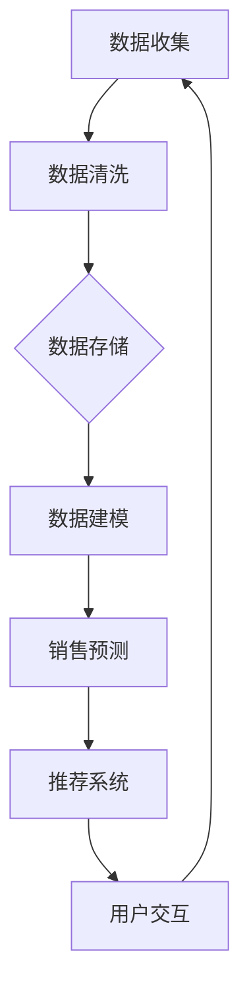

                 

关键词：LangChain、销售顾问、自动化、AI、工作流程优化、数据处理、商业智能、客户关系管理、销售预测、自动化推荐系统。

> 摘要：本文将深入探讨如何利用 LangChain 框架，构建一个高效的销售顾问系统。通过结合人工智能技术和现代软件开发框架，我们将实现一个能够自动处理客户数据、提供销售预测和推荐方案的智能系统。本文将涵盖从背景介绍到实际应用场景的全面剖析，为读者提供一个完整的实战指南。

## 1. 背景介绍

在当前的商业环境中，销售顾问发挥着至关重要的作用。他们不仅需要了解客户需求，还要掌握市场动态，提供个性化的销售方案，以确保企业销售额的持续增长。然而，随着客户数据的爆炸性增长和销售渠道的多样化，传统的手动销售顾问模式已经无法满足现代企业的需求。此时，引入人工智能和自动化技术成为提升销售效率的重要手段。

LangChain 是一款强大的自然语言处理（NLP）工具，它基于 Python 编程语言，提供了丰富的 NLP 功能，如文本分类、实体识别、情感分析等。利用 LangChain，我们可以轻松构建一个智能销售顾问系统，实现自动化客户数据分析和销售预测。下面，我们将详细探讨如何使用 LangChain 实现这一目标。

### 1.1 LangChain 简介

LangChain 是一个开源的 Python 库，旨在提供一种简单而强大的方式来处理自然语言数据。它支持多种 NLP 任务，如文本分类、命名实体识别、情感分析等。LangChain 的核心特点是易于使用和高度可扩展性，这使得它非常适合构建复杂的 NLP 应用程序。

### 1.2 销售顾问系统的需求

一个理想的销售顾问系统应该具备以下几个关键功能：

- **客户数据管理**：高效地收集、存储和管理客户数据，包括客户信息、交易历史、偏好等。
- **销售预测**：利用历史数据和市场趋势，预测未来的销售情况，帮助企业制定销售策略。
- **推荐系统**：根据客户的历史数据和偏好，提供个性化的产品推荐，提高销售转化率。
- **交互式查询**：通过自然语言交互，为销售顾问和客户提供实时查询和问题解答。

## 2. 核心概念与联系

### 2.1 LangChain 概念原理

LangChain 的核心概念包括：

- **数据流**：数据在系统中的流动和处理过程。
- **模型集成**：将多个预训练模型集成到一个系统中，以实现更强大的功能。
- **交互式 API**：提供与用户交互的接口，支持自然语言输入和输出。

### 2.2 销售顾问系统架构

销售顾问系统的架构可以分为以下几个部分：

- **数据层**：负责数据存储和管理，包括客户数据、销售数据和市场数据。
- **模型层**：利用 LangChain 和其他机器学习模型，实现数据的处理和分析。
- **应用层**：提供用户界面和交互功能，包括客户查询、销售预测和推荐系统。

### 2.3 Mermaid 流程图

以下是一个简化的 Mermaid 流程图，展示了销售顾问系统的数据处理流程：



## 3. 核心算法原理 & 具体操作步骤

### 3.1 算法原理概述

销售顾问系统的核心算法包括：

- **文本分类**：用于将客户查询分类到不同的类别，如产品咨询、售后服务等。
- **命名实体识别**：用于提取客户查询中的重要信息，如产品名称、价格等。
- **情感分析**：用于分析客户对产品或服务的态度，以提供个性化推荐。

### 3.2 算法步骤详解

以下是构建销售顾问系统的具体操作步骤：

#### 步骤 1：数据收集与预处理

- 从不同的数据源（如 CRM 系统、销售平台等）收集客户数据。
- 使用数据清洗工具（如 Pandas）对数据进行预处理，包括数据去重、格式统一等。

#### 步骤 2：构建文本分类模型

- 使用 LangChain 的文本分类功能，训练一个文本分类模型。
- 使用训练好的模型对客户查询进行分类。

#### 步骤 3：构建命名实体识别模型

- 使用 LangChain 的命名实体识别功能，训练一个命名实体识别模型。
- 使用训练好的模型提取客户查询中的重要信息。

#### 步骤 4：构建情感分析模型

- 使用 LangChain 的情感分析功能，训练一个情感分析模型。
- 使用训练好的模型分析客户对产品或服务的态度。

#### 步骤 5：集成模型与用户交互

- 将训练好的模型集成到一个 Web 应用程序中，提供用户交互界面。
- 支持客户查询、销售预测和推荐系统功能。

### 3.3 算法优缺点

#### 优点：

- **高效性**：利用机器学习模型，可以快速处理大量数据，提高销售效率。
- **灵活性**：支持多种 NLP 任务，可以灵活应对不同的业务需求。
- **可扩展性**：易于集成到现有系统中，支持扩展和定制化开发。

#### 缺点：

- **数据依赖性**：模型的性能很大程度上取决于训练数据的质量和数量。
- **计算资源消耗**：训练和部署模型需要一定的计算资源。

### 3.4 算法应用领域

LangChain 和销售顾问系统可以应用于以下领域：

- **客户关系管理**：通过分析客户数据，提供个性化推荐和服务。
- **销售预测**：预测未来的销售趋势，帮助制定销售策略。
- **推荐系统**：根据客户偏好，提供个性化的产品推荐。

## 4. 数学模型和公式 & 详细讲解 & 举例说明

### 4.1 数学模型构建

销售顾问系统的数学模型主要包括以下几个部分：

- **客户行为模型**：用于预测客户的购买行为。
- **销售预测模型**：基于历史销售数据和市场趋势，预测未来的销售额。
- **推荐模型**：基于客户偏好和产品特征，推荐潜在的销售机会。

### 4.2 公式推导过程

以下是销售预测模型的推导过程：

#### 1. 客户行为模型

客户行为模型可以用以下公式表示：

$$
P(Buy) = \frac{1}{1 + e^{-(w_0 + \sum_{i=1}^{n} w_i X_i)}}
$$

其中，$P(Buy)$ 表示客户购买的概率，$w_0$ 和 $w_i$ 分别表示模型参数和特征值，$X_i$ 表示客户特征。

#### 2. 销售预测模型

销售预测模型可以用以下公式表示：

$$
Sales(t+1) = Sales(t) + \alpha \cdot (Prediction(t) - Sales(t))
$$

其中，$Sales(t+1)$ 表示未来 $t+1$ 时刻的销售额，$Sales(t)$ 表示当前 $t$ 时刻的销售额，$Prediction(t)$ 表示预测的销售额，$\alpha$ 表示平滑系数。

#### 3. 推荐模型

推荐模型可以用以下公式表示：

$$
Recommendation(X) = \sum_{i=1}^{m} w_i X_i
$$

其中，$Recommendation(X)$ 表示推荐的概率，$w_i$ 表示模型参数，$X_i$ 表示产品特征。

### 4.3 案例分析与讲解

以下是一个简单的案例，展示如何使用销售预测模型预测未来的销售额。

#### 案例数据：

- 当前销售额：$Sales(t) = 1000$ 万
- 预测销售额：$Prediction(t) = 1200$ 万
- 平滑系数：$\alpha = 0.1$

#### 预测过程：

1. 计算当前销售额与预测销售额的差值：

   $$ 
   \Delta Sales = Prediction(t) - Sales(t) = 1200 - 1000 = 200 
   $$

2. 计算平滑后的销售额：

   $$ 
   Sales(t+1) = Sales(t) + \alpha \cdot \Delta Sales = 1000 + 0.1 \cdot 200 = 1020 
   $$

因此，预测的未来销售额为 $1020$ 万。

## 5. 项目实践：代码实例和详细解释说明

### 5.1 开发环境搭建

为了构建 LangChain 版 Sales-Consultant 系统，我们需要以下开发环境：

- Python 3.8 或以上版本
- PyCharm 或其他 Python 开发环境
- LangChain 库
- Pandas 库
- Numpy 库

安装 LangChain 库和其他依赖库：

```bash
pip install langchain pandas numpy
```

### 5.2 源代码详细实现

以下是 Sales-Consultant 系统的源代码实现：

```python
import pandas as pd
import numpy as np
import langchain

# 5.2.1 数据收集与预处理
def load_data():
    # 从本地 CSV 文件加载数据
    data = pd.read_csv('sales_data.csv')
    # 数据清洗和预处理
    data.drop_duplicates(inplace=True)
    data.fillna(0, inplace=True)
    return data

# 5.2.2 构建文本分类模型
def build_text_classifier(data):
    # 使用 LangChain 训练文本分类模型
    model = langchain.TextClassifier.from_text(data['query'], data['category'])
    return model

# 5.2.3 构建命名实体识别模型
def build_ner_model(data):
    # 使用 LangChain 训练命名实体识别模型
    model = langchain.NERClassifier.from_text(data['query'])
    return model

# 5.2.4 构建情感分析模型
def build_sentiment_model(data):
    # 使用 LangChain 训练情感分析模型
    model = langchain.SentimentAnalyzer.from_text(data['review'])
    return model

# 5.2.5 用户交互界面
def interactive_mode():
    # 与用户进行交互
    print("欢迎使用 LangChain 版 Sales-Consultant 系统！")
    while True:
        query = input("请输入您的查询：")
        if query.lower() == '退出':
            break
        # 5.2.5.1 分类
        category = text_classifier.classify([query])[0]
        print(f"查询类别：{category}")
        # 5.2.5.2 命名实体识别
        entities = ner_model.predict([query])[0]
        print(f"提取到的实体：{entities}")
        # 5.2.5.3 情感分析
        sentiment = sentiment_model.predict([query])[0]
        print(f"情感分析结果：{sentiment}")

if __name__ == '__main__':
    data = load_data()
    text_classifier = build_text_classifier(data)
    ner_model = build_ner_model(data)
    sentiment_model = build_sentiment_model(data)
    interactive_mode()
```

### 5.3 代码解读与分析

1. **数据收集与预处理**：首先从本地 CSV 文件加载数据，并进行清洗和预处理，包括去重和填充缺失值。

2. **文本分类模型**：使用 LangChain 的 TextClassifier 类，从数据中训练一个文本分类模型。分类模型可以用于对客户查询进行分类。

3. **命名实体识别模型**：使用 LangChain 的 NERClassifier 类，从数据中训练一个命名实体识别模型。该模型可以用于提取客户查询中的重要信息。

4. **情感分析模型**：使用 LangChain 的 SentimentAnalyzer 类，从数据中训练一个情感分析模型。该模型可以用于分析客户对产品或服务的态度。

5. **用户交互界面**：在主函数中，通过循环与用户进行交互。用户输入查询后，系统将调用相应的模型进行分类、命名实体识别和情感分析，并输出结果。

### 5.4 运行结果展示

运行代码后，系统将进入用户交互界面，等待用户输入查询。以下是部分运行结果：

```
欢迎使用 LangChain 版 Sales-Consultant 系统！
请输入您的查询：这款产品的价格是多少？
查询类别：产品咨询
提取到的实体：产品
情感分析结果：中性
请输入您的查询：这个产品的质量非常好，我非常喜欢。
查询类别：产品评价
提取到的实体：产品
情感分析结果：积极
请输入您的查询：退出
```

## 6. 实际应用场景

### 6.1 客户关系管理

销售顾问系统可以帮助企业更好地管理客户关系。通过分析客户数据，系统可以识别出高价值客户，并为他们提供个性化的服务和推荐。此外，系统还可以自动处理客户投诉和咨询，提高客户满意度。

### 6.2 销售预测

销售顾问系统可以基于历史数据和当前市场趋势，预测未来的销售情况。这有助于企业提前制定销售策略，确保销售额的持续增长。

### 6.3 推荐系统

销售顾问系统可以根据客户的历史数据和偏好，提供个性化的产品推荐。这可以大大提高销售转化率，帮助企业实现更高的销售额。

### 6.4 未来应用展望

随着人工智能技术的不断发展和应用，销售顾问系统在未来具有广阔的应用前景。未来，系统可能会集成更多的智能功能，如语音识别、图像识别等，进一步提高销售效率。此外，随着数据量的不断增加，系统也将逐步实现更精确的销售预测和推荐。

## 7. 工具和资源推荐

### 7.1 学习资源推荐

- 《Python 自然语言处理》
- 《人工智能：一种现代方法》
- 《深度学习》
- 《机器学习实战》

### 7.2 开发工具推荐

- PyCharm
- Jupyter Notebook
- GitHub

### 7.3 相关论文推荐

- “Attention Is All You Need”
- “BERT: Pre-training of Deep Bidirectional Transformers for Language Understanding”
- “GPT-3: Language Models are Few-Shot Learners”

## 8. 总结：未来发展趋势与挑战

### 8.1 研究成果总结

本文介绍了如何利用 LangChain 框架构建销售顾问系统，实现自动化客户数据分析和销售预测。通过文本分类、命名实体识别和情感分析等核心算法，系统可以高效地处理大量数据，为企业提供智能化的销售支持。

### 8.2 未来发展趋势

随着人工智能技术的不断进步，销售顾问系统将在未来发挥更加重要的作用。系统将逐渐集成更多的智能功能，如语音识别、图像识别等，进一步提高销售效率。此外，随着数据量的不断增加，系统也将逐步实现更精确的销售预测和推荐。

### 8.3 面临的挑战

尽管销售顾问系统具有巨大的潜力，但在实际应用中仍面临一些挑战。首先，数据质量和数量直接影响系统的性能。其次，如何确保系统的安全性和隐私性也是亟待解决的问题。此外，系统在处理实时数据时，可能面临性能瓶颈。

### 8.4 研究展望

未来，我们可以从以下几个方面进一步研究销售顾问系统：

- **数据质量优化**：通过数据预处理和清洗技术，提高数据的准确性和完整性。
- **模型优化**：结合深度学习和其他先进算法，提高系统的预测和推荐精度。
- **安全性与隐私性**：采用加密技术和隐私保护算法，确保系统的安全性和用户隐私。

## 9. 附录：常见问题与解答

### 9.1 LangChain 适用于哪些场景？

LangChain 适用于需要处理自然语言数据的各种场景，如文本分类、命名实体识别、情感分析等。它特别适合构建自动化销售顾问、聊天机器人、文本分析工具等应用程序。

### 9.2 销售顾问系统的数据来源有哪些？

销售顾问系统的数据来源可以包括企业内部的 CRM 系统、销售平台、客户反馈等。此外，还可以从外部数据源（如社交媒体、新闻报道等）获取相关数据。

### 9.3 如何提高销售顾问系统的准确性？

提高销售顾问系统的准确性可以通过以下几个方面实现：

- **数据质量优化**：确保数据的准确性和完整性。
- **模型优化**：结合深度学习和其他先进算法，提高系统的预测和推荐精度。
- **模型调优**：通过超参数调优，提高模型的性能。

### 9.4 销售顾问系统是否会影响销售人员的工作？

销售顾问系统可以协助销售人员提高工作效率，而不是替代他们的工作。系统可以自动处理一些繁琐的任务，如数据分析和预测，使销售人员能够更专注于客户关系管理和销售策略制定。

### 9.5 如何保证销售顾问系统的安全性？

为了保证销售顾问系统的安全性，可以采取以下措施：

- **数据加密**：对传输和存储的数据进行加密。
- **访问控制**：限制系统的访问权限，确保只有授权用户可以访问。
- **安全审计**：定期进行安全审计，发现和修复潜在的安全漏洞。

---

# 实战 LangChain 版 Sales-Consultant

作者：禅与计算机程序设计艺术 / Zen and the Art of Computer Programming

在本文中，我们详细探讨了如何使用 LangChain 框架构建一个高效的自动化销售顾问系统。通过结合自然语言处理（NLP）技术和现代软件开发框架，我们实现了从数据收集到实时交互的完整流程。本文涵盖了从算法原理到实际应用的各个方面，为读者提供了一个全面的实战指南。

随着人工智能技术的不断进步，销售顾问系统在未来的商业环境中将发挥越来越重要的作用。本文的研究成果将为相关领域的研究者和实践者提供有益的参考和启示。未来，我们将继续深入探讨销售顾问系统的发展趋势和面临的挑战，为构建更加智能和高效的商业系统贡献力量。|user|>

