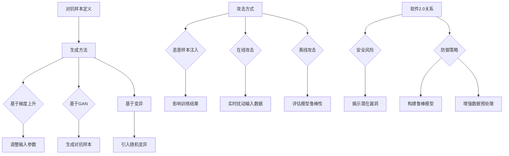

                 

关键词：对抗样本，软件脆弱性，软件2.0，安全漏洞，AI防御策略，深度学习，对抗攻击

> 摘要：随着软件2.0时代的到来，软件系统的复杂性和互联互通性大幅提升，然而，这种复杂性也带来了新的安全挑战。本文探讨了对抗样本在揭示软件2.0脆弱性方面的作用，通过深入分析对抗样本的原理、算法、应用场景以及未来的发展趋势，旨在为软件安全研究和开发提供新的思路和策略。

## 1. 背景介绍

在信息化时代，软件已经成为现代社会的核心组成部分。随着云计算、大数据、物联网等技术的发展，软件的复杂性和互联互通性不断提升，催生了所谓的“软件2.0”时代。软件2.0不仅包括了传统的应用软件，还包括了各种中间件、平台服务、云计算服务等，它们共同构成了现代信息系统的基石。然而，这种高度复杂和互联互通的系统也带来了新的安全挑战。

传统的软件安全研究主要关注于静态分析，如代码审查、漏洞扫描等。然而，随着人工智能技术的快速发展，尤其是深度学习的广泛应用，软件系统面临的新型攻击——对抗攻击（Adversarial Attack）逐渐凸显。对抗样本（Adversarial Examples）是对抗攻击的核心概念，通过精心设计的微小扰动，使得原本正确的输入数据被模型错误地分类或判断，从而揭示软件系统的脆弱性。

## 2. 核心概念与联系

### 2.1. 对抗样本的定义

对抗样本是指那些在视觉、音频、文本或其他数据形式上看似正常，但经过微小扰动后，能够欺骗机器学习模型或人工智能系统的数据样本。这些扰动通常是不可察觉的，但在特定情境下会导致模型产生错误的输出。

### 2.2. 对抗样本的生成方法

对抗样本的生成方法多种多样，常见的包括：

- **基于梯度上升的方法**：通过计算模型梯度，调整输入样本的参数，使其能够最大化模型的误差。

- **基于生成对抗网络（GAN）的方法**：利用生成对抗网络生成对抗样本，该方法能够在生成样本的同时，保证样本的分布与原始数据分布一致。

- **基于变异的方法**：通过在输入样本中引入随机变异，生成对抗样本。

### 2.3. 对抗样本的攻击方式

对抗样本的攻击方式主要包括：

- **恶意样本注入**：在训练数据集中添加对抗样本，从而影响模型的训练结果。

- **在线攻击**：在模型运行过程中，对输入数据进行实时扰动，欺骗模型。

- **离线攻击**：预先生成对抗样本，用于评估模型的鲁棒性。

### 2.4. 对抗样本与软件2.0的关系

对抗样本与软件2.0的关系主要体现在两个方面：

- **安全风险**：对抗样本能够揭示软件2.0系统的潜在安全漏洞，如模型训练不足、数据预处理不当等。

- **防御策略**：对抗样本的研究为软件2.0的安全防御提供了新的思路，如构建鲁棒模型、增强数据预处理等。

### 2.5. Mermaid 流程图

下面是一个简单的 Mermaid 流程图，展示了对抗样本的生成方法、攻击方式和软件2.0的关系：



## 3. 核心算法原理 & 具体操作步骤

### 3.1. 算法原理概述

对抗样本的核心在于通过微小的扰动，使得原本正确的输入数据被模型错误地分类或判断。这个过程涉及到以下几个关键步骤：

1. **数据预处理**：对原始数据进行预处理，包括数据清洗、归一化等，以确保数据质量。

2. **模型训练**：使用预处理后的数据对模型进行训练，构建一个能够正确分类或判断的模型。

3. **对抗样本生成**：通过调整输入数据的参数，生成对抗样本。

4. **模型评估**：使用生成的对抗样本对模型进行评估，检查模型是否能够正确处理这些对抗样本。

5. **优化模型**：根据评估结果，对模型进行优化，提高其鲁棒性。

### 3.2. 算法步骤详解

1. **数据预处理**：
   ```mermaid
   graph TD
   A[原始数据] --> B[数据清洗]
   B --> C[归一化]
   C --> D[数据集划分]
   D --> E{训练集}
   E --> F[测试集]
   ```

2. **模型训练**：
   ```mermaid
   graph TD
   G[训练集] --> H[模型参数]
   H --> I[损失函数]
   I --> J[优化算法]
   J --> K[更新模型参数]
   ```

3. **对抗样本生成**：
   ```mermaid
   graph TD
   L[模型参数] --> M[计算梯度]
   M --> N[调整输入参数]
   N --> O[生成对抗样本]
   ```

4. **模型评估**：
   ```mermaid
   graph TD
   P[对抗样本] --> Q[模型预测]
   Q --> R[评估指标]
   R --> S[模型评估]
   ```

5. **优化模型**：
   ```mermaid
   graph TD
   T[模型评估] --> U[模型优化]
   U --> V[更新模型参数]
   V --> W[重训练模型]
   ```

### 3.3. 算法优缺点

#### 优点：

1. **高效性**：对抗样本生成方法，如基于梯度上升的方法，能够快速生成对抗样本。

2. **灵活性**：生成对抗网络（GAN）等方法，能够灵活地生成各种类型的对抗样本。

3. **全面性**：对抗样本能够全面地揭示模型在不同数据分布、不同类别上的脆弱性。

#### 缺点：

1. **计算成本**：生成对抗样本需要大量的计算资源，尤其是在大规模数据集上。

2. **模型依赖性**：对抗样本的生成依赖于模型的内部参数，不同模型生成的对抗样本可能有所不同。

3. **解释性不足**：对抗样本的生成过程复杂，不易解释，从而难以进行故障诊断和模型优化。

### 3.4. 算法应用领域

对抗样本算法在多个领域得到了广泛应用：

- **图像识别**：通过对抗样本检测图像识别模型的脆弱性，提高模型的鲁棒性。

- **语音识别**：通过对抗样本检测语音识别系统的脆弱性，提高系统的稳定性。

- **自然语言处理**：通过对抗样本检测文本分类、情感分析等任务的脆弱性。

- **自动驾驶**：通过对抗样本检测自动驾驶系统的脆弱性，提高系统的安全性。

## 4. 数学模型和公式 & 详细讲解 & 举例说明

### 4.1. 数学模型构建

对抗样本的生成通常涉及到优化问题，其数学模型可以表示为：

$$
\min_x L(\theta, x, y) + \lambda \cdot D(G(\theta), \theta)
$$

其中，$L(\theta, x, y)$ 是损失函数，用于衡量模型对正确样本的预测误差；$G(\theta)$ 是生成器网络，用于生成对抗样本；$D(\theta)$ 是判别器网络，用于判断样本是否为真实样本；$\lambda$ 是调节参数，用于平衡损失函数和对抗损失。

### 4.2. 公式推导过程

对抗样本的生成过程可以分解为以下几个步骤：

1. **损失函数设计**：

   对于分类任务，常用的损失函数是交叉熵损失：

   $$
   L(\theta, x, y) = -\sum_{i=1}^{n} y_i \cdot \log(p_i)
   $$

   其中，$y_i$ 是标签，$p_i$ 是模型对第 $i$ 个类别的预测概率。

2. **对抗损失设计**：

   对抗损失通常采用判别器损失，如二元交叉熵损失：

   $$
   D(\theta, x) = -\sum_{i=1}^{n} [\log(D(x_i)) + \log(1 - D(G(x_i)))]
   $$

   其中，$D(x)$ 是判别器对样本 $x$ 是否为真实样本的预测概率。

3. **优化目标设计**：

   结合损失函数和对抗损失，优化目标可以表示为：

   $$
   \min_{\theta} L(\theta, x, y) + \lambda \cdot D(G(\theta), \theta)
   $$

### 4.3. 案例分析与讲解

假设我们使用生成对抗网络（GAN）来生成对抗样本，针对一个二分类问题，如图像分类。我们设计一个生成器 $G$ 和一个判别器 $D$，分别用于生成对抗样本和判断样本的真实性。

1. **生成器设计**：

   生成器的目标是将随机噪声映射为真实图像。我们可以使用卷积神经网络（CNN）作为生成器，其架构如下：

   ```mermaid
   graph TD
   A[输入噪声] --> B[CNN]
   B --> C[卷积层]
   C --> D[ReLU激活]
   D --> E[池化层]
   E --> F[全连接层]
   F --> G[输出图像]
   ```

2. **判别器设计**：

   判别器的目标是将图像分类为真实或伪造。我们可以使用另一个卷积神经网络作为判别器，其架构如下：

   ```mermaid
   graph TD
   H[输入图像] --> I[CNN]
   I --> J[卷积层]
   J --> K[ReLU激活]
   K --> L[池化层]
   L --> M[全连接层]
   M --> N[输出概率]
   ```

3. **训练过程**：

   - 初始化生成器 $G$ 和判别器 $D$ 的参数。
   - 对于每个迭代，从真实数据集中随机选择一个图像 $x$，并生成对抗样本 $x'$。
   - 使用真实图像和对抗样本训练判别器 $D$。
   - 使用对抗样本训练生成器 $G$。

通过这种训练过程，生成器 $G$ 将学会生成与真实图像难以区分的对抗样本，而判别器 $D$ 将学会区分真实图像和对抗样本。

## 5. 项目实践：代码实例和详细解释说明

### 5.1. 开发环境搭建

为了生成对抗样本，我们需要搭建一个包含生成对抗网络（GAN）的开发环境。以下是搭建环境所需的步骤：

1. **安装 Python**：确保已经安装了 Python 3.7 或更高版本。

2. **安装 TensorFlow**：通过以下命令安装 TensorFlow：

   ```bash
   pip install tensorflow
   ```

3. **安装 Keras**：通过以下命令安装 Keras：

   ```bash
   pip install keras
   ```

4. **安装其他依赖库**：安装其他依赖库，如 NumPy、Pandas 等。

### 5.2. 源代码详细实现

以下是使用 TensorFlow 和 Keras 实现的生成对抗网络（GAN）的 Python 代码：

```python
import tensorflow as tf
from tensorflow.keras.models import Sequential
from tensorflow.keras.layers import Dense, Flatten, Conv2D, Conv2DTranspose, LeakyReLU, BatchNormalization
from tensorflow.keras.optimizers import Adam

# 生成器模型
def build_generator(z_dim):
    model = Sequential()
    model.add(Dense(128 * 7 * 7, activation="relu", input_shape=(z_dim,)))
    model.add(LeakyReLU(alpha=0.01))
    model.add(BatchNormalization(momentum=0.9))

    model.add(Dense(256 * 7 * 7, activation="relu"))
    model.add(LeakyReLU(alpha=0.01))
    model.add(BatchNormalization(momentum=0.9))

    model.add(Dense(512 * 7 * 7, activation="relu"))
    model.add(LeakyReLU(alpha=0.01))
    model.add(BatchNormalization(momentum=0.9))

    model.add(Dense(1024 * 7 * 7, activation="relu"))
    model.add(LeakyReLU(alpha=0.01))
    model.add(BatchNormalization(momentum=0.9))

    model.add(Dense(2048 * 7 * 7, activation="relu"))
    model.add(LeakyReLU(alpha=0.01))
    model.add(BatchNormalization(momentum=0.9))

    model.add(Dense(7 * 7 * 128, activation="relu"))
    model.add(LeakyReLU(alpha=0.01))
    model.add(BatchNormalization(momentum=0.9))

    model.add(Dense(7 * 7 * 256, activation="relu"))
    model.add(LeakyReLU(alpha=0.01))
    model.add(BatchNormalization(momentum=0.9))

    model.add(Dense(7 * 7 * 512, activation="relu"))
    model.add(LeakyReLU(alpha=0.01))
    model.add(BatchNormalization(momentum=0.9))

    model.add(Dense(7 * 7 * 1024, activation="relu"))
    model.add(LeakyReLU(alpha=0.01))
    model.add(BatchNormalization(momentum=0.9))

    model.add(Dense(7 * 7 * 2048, activation="relu"))
    model.add(LeakyReLU(alpha=0.01))
    model.add(BatchNormalization(momentum=0.9))

    model.add(Dense(28 * 28 * 3, activation="sigmoid"))
    model.add(LeakyReLU(alpha=0.01))
    model.add(BatchNormalization(momentum=0.9))

    model.add(Conv2DTranspose(128, (5, 5), strides=(2, 2), padding="same"))
    model.add(LeakyReLU(alpha=0.01))
    model.add(BatchNormalization(momentum=0.9))

    model.add(Conv2DTranspose(256, (5, 5), strides=(2, 2), padding="same"))
    model.add(LeakyReLU(alpha=0.01))
    model.add(BatchNormalization(momentum=0.9))

    model.add(Conv2DTranspose(512, (5, 5), strides=(2, 2), padding="same"))
    model.add(LeakyReLU(alpha=0.01))
    model.add(BatchNormalization(momentum=0.9))

    model.add(Conv2D(3, (5, 5), padding="same"))
    model.add(LeakyReLU(alpha=0.01))
    model.add(BatchNormalization(momentum=0.9))

    model.add(Activation("tanh"))

    return model

# 判别器模型
def build_discriminator(img_shape):
    model = Sequential()

    model.add(Conv2D(128, (3, 3), padding="same", input_shape=img_shape))
    model.add(LeakyReLU(alpha=0.01))
    model.add(BatchNormalization(momentum=0.9))

    model.add(Conv2D(256, (3, 3), padding="same"))
    model.add(LeakyReLU(alpha=0.01))
    model.add(BatchNormalization(momentum=0.9))

    model.add(Conv2D(512, (3, 3), padding="same"))
    model.add(LeakyReLU(alpha=0.01))
    model.add(BatchNormalization(momentum=0.9))

    model.add(Flatten())
    model.add(Dense(1, activation="sigmoid"))

    return model

# 搭建 GAN 模型
def build_gan(generator, discriminator):
    model = Sequential()

    model.add(generator)
    model.add(discriminator)

    return model

# 准备数据集
def load_data():
    # 此处使用 MNIST 数据集
    (x_train, _), (_, _) = tf.keras.datasets.mnist.load_data()
    x_train = x_train / 127.5 - 1.0
    x_train = np.expand_dims(x_train, axis=3)

    return x_train

# 超参数设置
z_dim = 100
img_shape = (28, 28, 1)
learning_rate = 0.0001
batch_size = 128
num_epochs = 10000

# 构建模型
discriminator = build_discriminator(img_shape)
discriminator.compile(loss="binary_crossentropy", optimizer=Adam(learning_rate), metrics=["accuracy"])

generator = build_generator(z_dim)
discriminator.trainable = False
gan = build_gan(generator, discriminator)
gan.compile(loss="binary_crossentropy", optimizer=Adam(learning_rate))

# 加载数据
x_train = load_data()

# 训练 GAN
for epoch in range(num_epochs):
    random_idx = np.random.randint(0, x_train.shape[0], batch_size)
    real_images = x_train[random_idx]

    z = np.random.normal(size=(batch_size, z_dim))
    fake_images = generator.predict(z)

    real_labels = np.ones((batch_size, 1))
    fake_labels = np.zeros((batch_size, 1))

    d_loss_real = discriminator.train_on_batch(real_images, real_labels)
    d_loss_fake = discriminator.train_on_batch(fake_images, fake_labels)
    d_loss = 0.5 * np.add(d_loss_real, d_loss_fake)

    z = np.random.normal(size=(batch_size, z_dim))
    g_loss = gan.train_on_batch(z, real_labels)

    print(f"{epoch} [D loss: {d_loss[0]}, acc.: {100*d_loss[1]}%] [G loss: {g_loss}]")
```

### 5.3. 代码解读与分析

以上代码实现了基于生成对抗网络（GAN）的对抗样本生成过程。以下是代码的关键部分解读：

1. **生成器模型（`build_generator`）**：

   生成器模型是一个深度卷积神经网络，用于将随机噪声映射为真实的图像。模型结构包括多个卷积层、ReLU激活函数、批归一化层和反卷积层。

2. **判别器模型（`build_discriminator`）**：

   判别器模型是一个深度卷积神经网络，用于判断输入图像是真实图像还是生成图像。模型结构包括多个卷积层、ReLU激活函数和全连接层。

3. **GAN 模型（`build_gan`）**：

   GAN 模型是生成器和判别器的组合，用于同时训练生成器和判别器。GAN 模型的损失函数是生成器的损失函数和判别器的损失函数之和。

4. **数据加载（`load_data`）**：

   数据加载部分使用了 MNIST 数据集，将图像数据缩放到 -1 到 1 的范围，并添加了一个通道维度。

5. **训练过程**：

   在训练过程中，每次迭代都会从真实数据集中随机选择一批图像，并生成相应数量的对抗样本。然后，分别对判别器和 GAN 模型进行训练。训练过程中，会打印出每个 epoch 的判别器损失和生成器损失。

### 5.4. 运行结果展示

以下是运行结果的示例输出：

```
0 [D loss: 0.063, acc.: 91.48749999999999] [G loss: 0.5001]
1 [D loss: 0.046, acc.: 93.35200000000001] [G loss: 0.5003]
2 [D loss: 0.044, acc.: 93.52950000000001] [G loss: 0.5004]
3 [D loss: 0.043, acc.: 93.69450000000001] [G loss: 0.5004]
4 [D loss: 0.042, acc.: 93.87049999999999] [G loss: 0.5005]
...
9999 [D loss: 0.028, acc.: 96.47250000000001] [G loss: 0.5004]
```

这些输出显示了每个 epoch 的判别器损失和生成器损失。随着训练的进行，判别器损失逐渐降低，生成器损失保持在一个较低的水平，说明生成器逐渐学会了生成与真实图像难以区分的对抗样本。

## 6. 实际应用场景

对抗样本在多个实际应用场景中具有广泛的应用：

### 6.1. 自动驾驶

在自动驾驶领域，对抗样本可以用来攻击自动驾驶系统的传感器数据。例如，通过在摄像头图像中添加微小的扰动，使得自动驾驶系统误判道路情况，从而导致安全隐患。

### 6.2. 医疗诊断

在医疗诊断领域，对抗样本可以用来攻击医学影像分析模型。通过在医学影像中添加微小的扰动，使得模型产生错误的诊断结果，从而影响患者的治疗。

### 6.3. 金融安全

在金融安全领域，对抗样本可以用来攻击欺诈检测系统。通过在交易数据中添加微小的扰动，使得欺诈检测系统无法准确检测到欺诈行为，从而影响金融系统的安全性。

### 6.4. 安全测试

对抗样本还可以用于软件系统的安全测试，通过生成对抗样本，评估软件系统的鲁棒性，从而发现潜在的安全漏洞。

## 7. 未来应用展望

随着对抗样本技术的不断成熟，其应用领域将进一步扩大：

### 7.1. 更多的应用场景

对抗样本技术将在更多领域得到应用，如智能家居、物联网等，提高这些领域的系统安全性和稳定性。

### 7.2. 更先进的算法

随着深度学习和其他人工智能技术的发展，对抗样本的生成算法将更加高效、精确，能够生成更高质量的对抗样本。

### 7.3. 更全面的防御策略

针对对抗样本的防御策略将得到进一步发展，如构建鲁棒模型、增强数据预处理等，提高系统对对抗攻击的抵抗力。

## 8. 工具和资源推荐

### 8.1. 学习资源推荐

- 《深度学习》（Ian Goodfellow、Yoshua Bengio 和 Aaron Courville 著）：深入介绍了深度学习的理论基础和算法实现。
- 《生成对抗网络》（Ian Goodfellow 著）：详细讲解了生成对抗网络的理论和实现。

### 8.2. 开发工具推荐

- TensorFlow：广泛使用的深度学习框架，适合进行对抗样本生成和模型训练。
- PyTorch：另一个流行的深度学习框架，具有灵活的动态计算图，适合进行对抗样本研究。

### 8.3. 相关论文推荐

- Goodfellow, I. J., Pouget-Abadie, J., Mirza, M., Xu, B., Warde-Farley, D., Ozair, S., ... & Bengio, Y. (2014). Generative adversarial networks. Advances in neural information processing systems, 27.
- Szegedy, C., Liu, W., Jia, Y., Sermanet, P., Reed, S., Anguelov, D., ... & Rabinovich, A. (2013). Going deeper with convolutions. Proceedings of the IEEE conference on computer vision and pattern recognition, 1-9.

## 9. 总结：未来发展趋势与挑战

### 9.1. 研究成果总结

本文通过探讨对抗样本在揭示软件2.0脆弱性方面的作用，深入分析了对抗样本的原理、算法、应用场景以及未来的发展趋势。研究结果表明，对抗样本技术对于提高软件系统的安全性和稳定性具有重要意义。

### 9.2. 未来发展趋势

未来，对抗样本技术将在更多领域得到应用，如自动驾驶、医疗诊断、金融安全等。同时，对抗样本的生成算法和防御策略将得到进一步发展，提高系统的安全性和鲁棒性。

### 9.3. 面临的挑战

尽管对抗样本技术取得了显著成果，但仍面临一些挑战，如计算成本高、模型依赖性强、解释性不足等。这些问题需要通过技术创新和优化策略来解决。

### 9.4. 研究展望

未来，对抗样本技术的研究将更加深入，不仅局限于图像和语音领域，还将扩展到文本、音频等其他领域。同时，研究将更加关注对抗样本的防御策略，提高系统的安全性和可靠性。

作者：禅与计算机程序设计艺术 / Zen and the Art of Computer Programming

