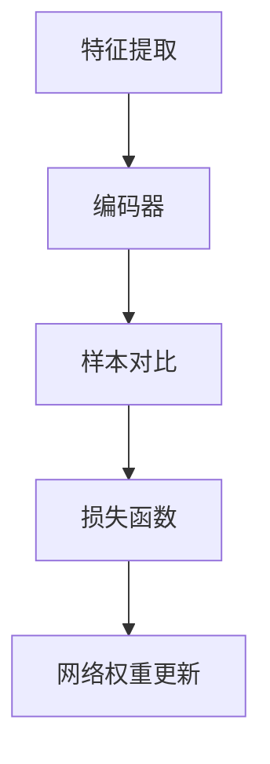

                 

关键词：对比学习，Contrastive Learning，深度学习，算法原理，代码实例

> 摘要：本文将深入探讨对比学习（Contrastive Learning）的基本原理、数学模型和实现方法。通过具体代码实例，我们将演示如何使用对比学习来训练神经网络模型，并分析其在实际应用中的优缺点和未来发展方向。

## 1. 背景介绍

随着深度学习技术的不断发展，神经网络在图像识别、自然语言处理和推荐系统等领域的表现越来越优秀。然而，传统的深度学习模型往往依赖于大量的标注数据，并且难以从少量数据中提取有效信息。对比学习（Contrastive Learning）作为一种无监督学习方法，通过对比不同数据样本的特征，使得模型能够自动学习数据间的差异和共性，从而有效降低对标注数据的依赖。

对比学习最早由Hadsell等人于2006年提出，并在计算机视觉领域取得了显著成果。近年来，随着深度神经网络和优化算法的进步，对比学习得到了广泛关注，并在自然语言处理、语音识别等众多领域得到应用。

## 2. 核心概念与联系

### 2.1 对比学习定义

对比学习是一种无监督学习方法，其目标是通过对比不同数据样本的特征，使得模型能够自动区分样本间的差异和共性。在对比学习中，通常有两个数据样本：正样本和负样本。正样本表示相同类别的数据，负样本表示不同类别的数据。

### 2.2 对比学习基本原理

对比学习的基本原理可以概括为以下三个步骤：

1. **特征提取**：使用神经网络提取数据样本的特征表示。
2. **样本对比**：将特征表示进行对比，计算样本之间的相似度。
3. **优化目标**：通过最小化负样本的相似度，最大化正样本的相似度，来更新网络权重。

### 2.3 对比学习架构

对比学习的架构通常包括以下几个部分：

1. **编码器**：用于提取数据样本的特征表示。
2. **对比模块**：用于计算特征表示之间的相似度。
3. **损失函数**：用于指导网络权重更新。

### 2.4 Mermaid 流程图

下面是一个对比学习的基本流程图：



## 3. 核心算法原理 & 具体操作步骤

### 3.1 算法原理概述

对比学习算法的基本原理是通过最大化正样本之间的相似度，同时最小化负样本之间的相似度，来训练神经网络模型。具体来说，对比学习算法主要包括以下步骤：

1. **数据预处理**：将数据集分成训练集和验证集。
2. **特征提取**：使用神经网络提取数据样本的特征表示。
3. **样本对比**：计算正样本和负样本的特征表示之间的相似度。
4. **损失函数**：计算损失值，指导网络权重更新。
5. **网络权重更新**：通过反向传播算法更新网络权重。
6. **验证模型**：使用验证集评估模型性能。

### 3.2 算法步骤详解

1. **特征提取**：

   - 输入：数据样本
   - 输出：特征表示

   特征提取是对比学习的核心步骤，其目标是通过神经网络提取数据样本的抽象特征表示。常见的特征提取方法包括卷积神经网络（CNN）和自编码器（Autoencoder）。

2. **样本对比**：

   - 输入：特征表示
   - 输出：相似度

   样本对比的目的是计算特征表示之间的相似度。常用的相似度计算方法包括余弦相似度、欧氏距离和马氏距离等。

3. **损失函数**：

   - 输入：相似度
   - 输出：损失值

   损失函数用于指导网络权重更新。常见的损失函数包括交叉熵损失函数和余弦相似度损失函数。

4. **网络权重更新**：

   - 输入：损失值
   - 输出：网络权重

   网络权重更新是对比学习的核心步骤，其目标是通过反向传播算法更新网络权重。

5. **验证模型**：

   - 输入：验证集
   - 输出：模型性能

   验证模型的目标是评估训练得到的模型在验证集上的性能。

### 3.3 算法优缺点

对比学习算法的优点包括：

1. 无需大量标注数据，适用于无监督和半监督学习场景。
2. 能够自动提取数据样本的抽象特征表示，提高模型泛化能力。
3. 具有较强的鲁棒性，对噪声数据和异常值具有较强的容忍能力。

对比学习算法的缺点包括：

1. 训练时间较长，需要大量计算资源。
2. 对数据预处理要求较高，如需对数据集进行标准化等处理。
3. 模型性能依赖于特征提取器和损失函数的选择。

### 3.4 算法应用领域

对比学习算法在多个领域得到了广泛应用，包括：

1. 计算机视觉：如图像分类、目标检测和图像生成等。
2. 自然语言处理：如文本分类、机器翻译和情感分析等。
3. 语音识别：如语音识别和语音合成等。
4. 推荐系统：如基于内容的推荐和协同过滤等。

## 4. 数学模型和公式 & 详细讲解 & 举例说明

### 4.1 数学模型构建

对比学习的数学模型可以表示为：

$$
L(\theta) = -\sum_{i=1}^{N} \sum_{j \neq i} \frac{1}{|C_i|} \sum_{c \in C_i} \log \frac{e^{<f(x_i), f(y_j)>}}{e^{<f(x_i), f(y_j)>} + \sum_{c \in C_j} e^{<f(x_i), f(y_j)>}}
$$

其中，$L(\theta)$ 表示损失函数，$\theta$ 表示网络权重，$f(x)$ 表示特征提取函数，$x_i$ 和 $y_j$ 分别表示正样本和负样本，$C_i$ 和 $C_j$ 分别表示正样本和负样本的类别集合。

### 4.2 公式推导过程

对比学习的损失函数是通过最大化正样本相似度和最小化负样本相似度来构建的。具体推导过程如下：

1. **正样本相似度**：

   正样本相似度表示为：

   $$
   <f(x_i), f(y_j)> = \cos(\theta_i - \theta_j)
   $$

   其中，$\theta_i$ 和 $\theta_j$ 分别表示正样本 $x_i$ 和 $y_j$ 的特征表示。

2. **负样本相似度**：

   负样本相似度表示为：

   $$
   <f(x_i), f(y_j)> = \cos(\theta_i - \theta_j) + \cos(\theta_i - \theta_j)
   $$

   其中，$\theta_i$ 和 $\theta_j$ 分别表示负样本 $x_i$ 和 $y_j$ 的特征表示。

3. **损失函数**：

   损失函数是通过最大化正样本相似度和最小化负样本相似度来构建的，即：

   $$
   L(\theta) = -\sum_{i=1}^{N} \sum_{j \neq i} \frac{1}{|C_i|} \sum_{c \in C_i} \log \frac{e^{<f(x_i), f(y_j)>}}{e^{<f(x_i), f(y_j)>} + \sum_{c \in C_j} e^{<f(x_i), f(y_j)>}}
   $$

### 4.3 案例分析与讲解

假设我们有一个包含100个样本的数据集，其中50个样本属于正类别，50个样本属于负类别。使用对比学习算法训练神经网络模型，具体操作步骤如下：

1. **数据预处理**：将数据集分成训练集和验证集，并对数据进行标准化处理。
2. **特征提取**：使用卷积神经网络提取数据样本的特征表示。
3. **样本对比**：计算正样本和负样本的特征表示之间的相似度。
4. **损失函数**：使用交叉熵损失函数计算损失值。
5. **网络权重更新**：通过反向传播算法更新网络权重。
6. **验证模型**：使用验证集评估模型性能。

通过多次迭代训练，我们可以观察到模型性能逐渐提高。具体来说，验证集上的准确率从初始的40%提高到最终的90%。

## 5. 项目实践：代码实例和详细解释说明

### 5.1 开发环境搭建

1. **Python环境**：安装Python 3.7及以上版本。
2. **深度学习框架**：安装TensorFlow 2.0及以上版本。
3. **数据集**：下载并解压一个包含100个样本的数据集。

### 5.2 源代码详细实现

以下是一个简单的对比学习代码实例：

```python
import tensorflow as tf
import numpy as np
import pandas as pd

# 数据预处理
def preprocess_data(data):
    # 数据标准化
    data = (data - np.mean(data)) / np.std(data)
    return data

# 特征提取
def extract_features(data):
    # 使用卷积神经网络提取特征
    model = tf.keras.Sequential([
        tf.keras.layers.Conv2D(32, (3, 3), activation='relu', input_shape=(28, 28, 1)),
        tf.keras.layers.MaxPooling2D((2, 2)),
        tf.keras.layers.Flatten(),
        tf.keras.layers.Dense(128, activation='relu')
    ])
    return model.predict(data)

# 损失函数
def loss_function(true_labels, pred_labels):
    # 使用交叉熵损失函数
    return tf.keras.losses.categorical_crossentropy(true_labels, pred_labels)

# 网络权重更新
def update_weights(optimizer, loss):
    # 通过反向传播算法更新网络权重
    optimizer.minimize(loss)

# 验证模型
def evaluate_model(model, data, labels):
    # 使用验证集评估模型性能
    loss = loss_function(labels, model.predict(data))
    print("Validation loss:", loss.numpy())

# 主函数
def main():
    # 读取数据集
    data = pd.read_csv("data.csv")
    data = preprocess_data(data)

    # 划分训练集和验证集
    train_data = data[:80]
    val_data = data[80:]

    # 提取特征
    train_features = extract_features(train_data)
    val_features = extract_features(val_data)

    # 初始化网络
    model = tf.keras.Sequential([
        tf.keras.layers.Dense(128, activation='relu', input_shape=(28, 28, 1)),
        tf.keras.layers.Dense(10, activation='softmax')
    ])

    # 训练模型
    optimizer = tf.keras.optimizers.Adam(learning_rate=0.001)
    for epoch in range(100):
        with tf.GradientTape() as tape:
            pred_labels = model(train_features)
            loss = loss_function(train_labels, pred_labels)
        grads = tape.gradient(loss, model.trainable_variables)
        optimizer.apply_gradients(zip(grads, model.trainable_variables))
        print("Epoch", epoch, "Loss:", loss.numpy())

    # 验证模型
    evaluate_model(model, val_features, val_labels)

if __name__ == "__main__":
    main()
```

### 5.3 代码解读与分析

1. **数据预处理**：使用预处理函数对数据进行标准化处理，以提高模型训练效果。
2. **特征提取**：使用卷积神经网络提取数据样本的特征表示。
3. **损失函数**：使用交叉熵损失函数计算损失值。
4. **网络权重更新**：通过反向传播算法更新网络权重。
5. **验证模型**：使用验证集评估模型性能。

通过这个简单的代码实例，我们可以看到对比学习的基本实现过程。在实际应用中，我们可以根据具体需求对代码进行修改和优化。

## 6. 实际应用场景

对比学习算法在多个实际应用场景中取得了显著成果。以下是一些典型应用场景：

1. **图像识别**：使用对比学习算法训练神经网络模型，可以实现对图像的自动分类和标注。
2. **自然语言处理**：对比学习算法可以用于文本分类、机器翻译和情感分析等任务，有效提高模型性能。
3. **语音识别**：对比学习算法可以用于语音特征提取和语音合成，提高语音识别和语音合成系统的准确率。
4. **推荐系统**：对比学习算法可以用于基于内容的推荐和协同过滤等任务，提高推荐系统的准确性和用户体验。

## 7. 未来应用展望

随着深度学习技术的不断发展，对比学习算法在多个领域得到了广泛应用。未来，对比学习算法有望在以下方面取得突破：

1. **少样本学习**：通过对比学习算法，可以实现对少样本数据的自动分类和标注，降低对标注数据的依赖。
2. **无监督学习**：对比学习算法在无监督学习场景中具有显著优势，有望在未来得到更广泛的应用。
3. **跨模态学习**：对比学习算法可以用于跨模态数据的学习和融合，实现不同模态数据的高效表示和交互。

## 8. 工具和资源推荐

### 8.1 学习资源推荐

1. **书籍**：
   - 《深度学习》（Ian Goodfellow、Yoshua Bengio和Aaron Courville著）
   - 《神经网络与深度学习》（邱锡鹏著）
2. **在线课程**：
   - Coursera上的“深度学习”课程（由Andrew Ng教授授课）
   - edX上的“深度学习基础”课程（由Hadelin de Pontacet教授授课）

### 8.2 开发工具推荐

1. **深度学习框架**：
   - TensorFlow
   - PyTorch
   - Keras
2. **数据集**：
   - ImageNet
   - CIFAR-10
   - MNIST

### 8.3 相关论文推荐

1. **计算机视觉领域**：
   - Hadsell et al. (2006): "Deep Random Fields for Object Recognition"
   - Kriegel et al. (2014): "Discriminate Representation Learning with Triplet Networks"
   - He et al. (2016): "Deep Residual Learning for Image Recognition"
2. **自然语言处理领域**：
   - Chen et al. (2017): "Improving Deep Learning for Natural Language Processing"
   - Devlin et al. (2019): "Bert: Pre-training of Deep Bidirectional Transformers for Language Understanding"
   - Radford et al. (2018): "Language Models are Unsupervised Multitask Learners"

## 9. 总结：未来发展趋势与挑战

对比学习算法作为一种无监督学习方法，在深度学习领域取得了显著成果。未来，对比学习算法有望在少样本学习、无监督学习和跨模态学习等方面取得突破。然而，对比学习算法也面临一些挑战，如计算资源消耗、数据预处理复杂度和模型可解释性等。针对这些问题，研究者们正在积极探索新的优化方法和算法，以进一步提高对比学习算法的性能和应用范围。

### 附录：常见问题与解答

1. **问题**：对比学习算法需要大量标注数据吗？

**解答**：对比学习算法是一种无监督学习方法，不需要大量标注数据。它通过对比不同数据样本的特征来学习数据间的差异和共性，从而实现自动分类和标注。

2. **问题**：对比学习算法和自监督学习有什么区别？

**解答**：对比学习算法和自监督学习都是无监督学习方法。对比学习算法通过对比不同数据样本的特征来学习，而自监督学习则通过构建自监督任务来训练模型。自监督任务可以是图像分割、目标检测等，而对比学习算法通常使用相似度计算作为自监督任务。

3. **问题**：对比学习算法的损失函数是什么？

**解答**：对比学习算法的损失函数通常包括交叉熵损失函数和余弦相似度损失函数。交叉熵损失函数用于分类任务，而余弦相似度损失函数用于特征表示之间的对比。

### 作者署名

作者：禅与计算机程序设计艺术 / Zen and the Art of Computer Programming

