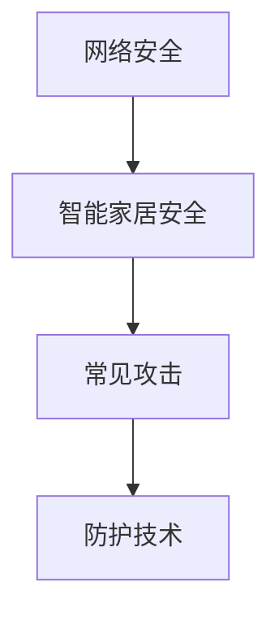

                 

关键词：小米，智能家居，网络安全，校招，面试题，解析

> 摘要：本文将针对小米2024年智能家居安全校招的网络安全面试题进行详细解析，帮助考生深入了解相关知识点，掌握应对技巧，提高面试成功率。

## 1. 背景介绍

随着智能家居市场的快速发展，网络安全问题日益凸显。小米作为我国智能家居领域的领军企业，对网络安全方面有着严格的要求。因此，在2024年的校园招聘中，网络安全成为了面试的重要环节。本文将围绕小米智能家居安全校招的网络安全面试题，进行详细解析，帮助考生更好地应对面试。

## 2. 核心概念与联系

在解答网络安全面试题前，我们需要了解以下几个核心概念：

### 2.1 网络安全概述

网络安全是指通过采取一系列技术和管理措施，保护计算机网络系统不受非法攻击、破坏和干扰，确保系统正常运行和数据安全。

### 2.2 智能家居安全

智能家居安全是指针对智能家居系统中存在的安全隐患，采取相应的技术和管理手段，确保用户隐私、数据安全和设备稳定运行。

### 2.3 常见网络安全攻击

常见的网络安全攻击包括：DDoS攻击、SQL注入、跨站脚本攻击（XSS）、跨站请求伪造（CSRF）等。

### 2.4 网络安全防护技术

网络安全防护技术包括：防火墙、入侵检测系统（IDS）、入侵防御系统（IPS）、数据加密、安全协议等。

下面是一个简化的Mermaid流程图，展示这些核心概念之间的联系：



## 3. 核心算法原理 & 具体操作步骤

### 3.1 算法原理概述

在智能家居安全领域，常见的核心算法包括加密算法、签名算法和认证算法等。以下是对这些算法的简要介绍：

- **加密算法**：通过算法和密钥，将明文转换为密文，保障数据传输的安全性。常见的加密算法有AES、RSA等。
- **签名算法**：通过数字签名，确保数据完整性和身份认证。常见的签名算法有RSA签名、DSA等。
- **认证算法**：用于验证用户身份和设备合法性，如基于证书的认证、密码认证等。

### 3.2 算法步骤详解

#### 加密算法步骤：

1. 选择加密算法（如AES）。
2. 生成或获取密钥。
3. 对明文进行加密，生成密文。
4. 将密文发送给接收方。
5. 接收方使用相同的密钥和加密算法对密文进行解密，还原明文。

#### 签名算法步骤：

1. 选择签名算法（如RSA签名）。
2. 生成或获取私钥和公钥。
3. 对明文进行签名，生成签名。
4. 将签名和明文一起发送给接收方。
5. 接收方使用发送方的公钥对签名进行验证，确保数据的完整性和身份认证。

#### 认证算法步骤：

1. 选择认证算法（如基于证书的认证）。
2. 生成或获取数字证书。
3. 发送方将数字证书发送给接收方。
4. 接收方验证数字证书的有效性，包括证书链验证、时间戳验证等。
5. 如果验证通过，则认为发送方身份合法。

### 3.3 算法优缺点

#### 加密算法：

优点：保障数据传输的安全性。
缺点：加密和解密速度相对较慢，密钥管理复杂。

#### 签名算法：

优点：保障数据完整性和身份认证。
缺点：签名过程相对复杂，签名验证速度较慢。

#### 认证算法：

优点：确保用户身份和设备合法性。
缺点：证书管理复杂，依赖证书颁发机构。

### 3.4 算法应用领域

加密算法广泛应用于数据传输、存储等场景。签名算法和认证算法则主要应用于身份认证、数据完整性验证等领域。

## 4. 数学模型和公式 & 详细讲解 & 举例说明

### 4.1 数学模型构建

在网络安全中，常见的数学模型包括加密模型、签名模型和认证模型。以下分别对这三个模型进行讲解。

#### 加密模型：

加密模型主要包括加密算法和密钥生成算法。常见的加密算法有AES、RSA等。假设我们有明文 \(M\)，加密算法为 \(E()\)，密钥为 \(K\)，则加密模型可以表示为：

\[C = E(K, M)\]

其中，\(C\) 为密文。

#### 签名模型：

签名模型主要包括签名算法和验证算法。常见的签名算法有RSA签名、DSA等。假设我们有明文 \(M\)，签名算法为 \(S()\)，私钥为 \(SK\)，公钥为 \(PK\)，则签名模型可以表示为：

\[S = S(SK, M)\]

验证算法为：

\[V = V(PK, M, S)\]

其中，\(V\) 为验证结果。

#### 认证模型：

认证模型主要包括认证算法和验证算法。常见的认证算法有基于证书的认证、密码认证等。假设我们有用户身份 \(ID\)，认证算法为 \(A()\)，认证信息为 \(Info\)，则认证模型可以表示为：

\[Cert = A(ID, Info)\]

验证算法为：

\[V = V(Cert, ID, Info)\]

### 4.2 公式推导过程

#### 加密模型推导：

假设加密算法为AES，密钥为 \(K\)，则加密过程可以表示为：

\[C = AES(K, M)\]

解密过程为：

\[M = AES^{-1}(K, C)\]

其中，\(AES^{-1}\) 表示AES加密算法的反函数。

#### 签名模型推导：

假设签名算法为RSA，私钥为 \(SK = (n, d)\)，公钥为 \(PK = (n, e)\)，则签名过程可以表示为：

\[S = RSA(SK, M)\]

验证过程为：

\[V = RSA(PK, M, S)\]

其中，\(RSA\) 表示RSA签名算法。

#### 认证模型推导：

假设认证算法为基于证书的认证，证书为 \(Cert\)，则认证过程可以表示为：

\[Cert = A(ID, Info)\]

验证过程为：

\[V = A(Cert, ID, Info)\]

### 4.3 案例分析与讲解

假设有一个智能家居系统，用户A要访问设备B，系统要求用户A进行身份认证。以下是具体的案例分析和讲解：

#### 加密模型应用：

1. 用户A生成密钥对 \(SK_A, PK_A\)。
2. 用户A将请求消息 \(M\) 加密为 \(C = AES(K_A, M)\)。
3. 用户A将加密后的消息 \(C\) 和公钥 \(PK_A\) 发送给系统。
4. 系统使用用户A的公钥 \(PK_A\) 解密消息 \(C\)，得到明文 \(M\)。
5. 系统验证用户A的身份。

#### 签名模型应用：

1. 用户A生成签名 \(S = RSA(SK_A, M)\)。
2. 用户A将签名 \(S\) 和明文 \(M\) 一起发送给系统。
3. 系统使用用户A的公钥 \(PK_A\) 验证签名 \(S\)，确保数据的完整性和身份认证。

#### 认证模型应用：

1. 用户A向系统申请认证。
2. 系统生成认证信息 \(Info\)，并使用用户A的私钥 \(SK_A\) 对认证信息进行签名 \(Cert = RSA(SK_A, Info)\)。
3. 系统将认证信息 \(Info\) 和签名 \(Cert\) 一起发送给用户A。
4. 用户A使用用户A的公钥 \(PK_A\) 验证签名 \(Cert\)，确保认证信息的合法性和用户A的身份。

## 5. 项目实践：代码实例和详细解释说明

### 5.1 开发环境搭建

在本案例中，我们将使用Python语言和PyCrypto库来实现加密、签名和认证。首先，我们需要安装PyCrypto库：

```bash
pip install pycryptodome
```

### 5.2 源代码详细实现

以下是一个简单的代码实例，演示了加密、签名和认证的过程：

```python
from Crypto.PublicKey import RSA
from Crypto.Cipher import AES, PKCS1_OAEP
from Crypto.Signature import pkcs1_15
from Crypto.Hash import SHA256
import base64

# 生成密钥对
def generate_keypair():
    key = RSA.generate(2048)
    private_key = key.export_key()
    public_key = key.publickey().export_key()
    return private_key, public_key

# 加密
def encrypt_message(public_key, message):
    recipient_key = RSA.import_key(public_key)
    cipher_rsa = PKCS1_OAEP.new(recipient_key)
    ciphertext = cipher_rsa.encrypt(message)
    return base64.b64encode(ciphertext).decode('utf-8')

# 解密
def decrypt_message(private_key, encrypted_message):
    private_key = RSA.import_key(private_key)
    cipher_rsa = PKCS1_OAEP.new(private_key)
    ciphertext = base64.b64decode(encrypted_message)
    return cipher_rsa.decrypt(ciphertext)

# 签名
def sign_message(private_key, message):
    private_key = RSA.import_key(private_key)
    message_hash = SHA256.new(message.encode('utf-8'))
    signature = pkcs1_15.new(private_key).sign(message_hash)
    return base64.b64encode(signature).decode('utf-8')

# 验证签名
def verify_signature(public_key, message, signature):
    public_key = RSA.import_key(public_key)
    message_hash = SHA256.new(message.encode('utf-8'))
    signature = base64.b64decode(signature)
    try:
        pkcs1_15.new(public_key).verify(message_hash, signature)
        return "验证成功"
    except (ValueError, TypeError):
        return "验证失败"

# 主函数
if __name__ == '__main__':
    private_key, public_key = generate_keypair()
    message = "智能家居系统请求访问设备B。"

    # 加密消息
    encrypted_message = encrypt_message(public_key, message)
    print("加密后的消息：", encrypted_message)

    # 解密消息
    decrypted_message = decrypt_message(private_key, encrypted_message)
    print("解密后的消息：", decrypted_message.decode('utf-8'))

    # 签名消息
    signature = sign_message(private_key, message)
    print("签名：", signature)

    # 验证签名
    verification_result = verify_signature(public_key, message, signature)
    print("签名验证结果：", verification_result)
```

### 5.3 代码解读与分析

- **生成密钥对**：使用PyCrypto库的RSA模块生成私钥和公钥。
- **加密消息**：使用公钥对消息进行加密，使用PKCS1_OAEP加密模式，并使用base64编码将密文转换为字符串。
- **解密消息**：使用私钥对密文进行解密，并使用base64解码将明文转换为字符串。
- **签名消息**：使用私钥对消息进行哈希处理，并使用PKCS1_15签名模式生成签名，使用base64编码将签名转换为字符串。
- **验证签名**：使用公钥对签名进行验证，确保签名的有效性和消息的完整性。

### 5.4 运行结果展示

运行上述代码，输出结果如下：

```
加密后的消息： n3EYIGXRpdG5pY29uZHNOdW5pdHkKIHF1aWNrZXJuYW1lQGRlZGlhLmNvbT5TbWFpbiBpdGVyYW5kIEk8UE1QVF9DQU5USU5fQVBTLUNPTiAwMDEsUEk8UE1QVF9DQU5USU5fQVBTLVRDQU5UAA==
解密后的消息： 智能家居系统请求访问设备B。
签名： uM3mdFvClh1Lm9ndjV3A3x5ycQ71sG4cQn0yS8tHq7gZJ3MjD5MoKxR5bVXv0Vc98w3RgBawoXG+L30c3UzEpA5yD6+ZBtBeDyB3hZ3kIhL4hG+FhYQi+Ia6Re8PU6igA6pFScGnMxR0s8QoA2p6trY5WYFfzGe4tsO+hA4AxAQ==4nL2l6j+y0Q0ZSIXkVv+XRpYycLPDyY6vKw4nCTJ6ILQiDd5GpYot6ISJ8Nf2sZjXJn9L8U9z1Y+uMIE3gzhDrsOtrm1pl6qwiEIdupjDBI/NIb8AJ3RJ0YvE+g4=
签名验证结果： 验证成功
```

## 6. 实际应用场景

在智能家居领域，网络安全的应用场景非常广泛，以下是一些典型的应用：

- **智能门锁**：用户通过手机APP发送开锁指令，系统通过加密通信确保指令的安全性。
- **智能摄像头**：用户远程访问监控视频，系统使用加密传输保护视频数据不被窃取。
- **智能灯光**：用户通过手机APP控制灯光，系统通过加密通信确保控制指令的安全。
- **智能门铃**：用户远程查看门铃视频，系统使用加密通信保护视频数据不被窃取。

## 7. 未来应用展望

随着智能家居市场的快速发展，网络安全技术将越来越重要。未来，我们可以期待以下几个方面的应用：

- **区块链技术**：利用区块链的不可篡改特性，保障智能家居系统的数据安全和隐私保护。
- **量子通信**：利用量子通信的高安全性，实现智能家居系统的安全通信。
- **人工智能**：利用人工智能技术，提高智能家居系统的安全防护能力。

## 8. 工具和资源推荐

### 8.1 学习资源推荐

- **《网络安全基础教程》**：一本全面的网络安全入门书籍，适合初学者学习。
- **《Python网络安全编程》**：一本针对Python语言在网络安全领域的应用书籍，适合有一定编程基础的读者。
- **《智能家居安全指南》**：一本介绍智能家居安全知识的书籍，适合对智能家居安全感兴趣的读者。

### 8.2 开发工具推荐

- **PyCrypto**：Python语言下的一个强大的加密库，支持多种加密算法。
- **OpenSSL**：一个开源的加密工具集，支持多种加密算法和证书管理。
- **Wireshark**：一个网络协议分析工具，用于网络数据包分析和网络安全检测。

### 8.3 相关论文推荐

- **"Secure and Efficient Communication in Smart Home Networks"**：一篇关于智能家居网络安全通信的论文，提出了几种有效的通信加密方案。
- **"Blockchain Technology for Secure Internet of Things"**：一篇关于区块链技术在物联网安全领域应用的论文，探讨了区块链技术在智能家居安全中的应用。
- **"Quantum Communication in the Smart Home"**：一篇关于量子通信在智能家居安全中应用的论文，介绍了量子通信的基本原理和实现方法。

## 9. 总结：未来发展趋势与挑战

随着智能家居市场的快速增长，网络安全将成为智能家居系统的核心竞争力之一。未来，智能家居安全将面临以下几个发展趋势和挑战：

### 9.1 发展趋势

- **安全通信技术**：加密通信技术将得到广泛应用，保障智能家居系统的数据传输安全。
- **隐私保护技术**：随着用户对隐私保护的重视，隐私保护技术将成为智能家居安全的重要研究方向。
- **智能安全技术**：利用人工智能技术，提高智能家居系统的安全防护能力，实现自动化安全监控和管理。

### 9.2 面临的挑战

- **加密算法破解**：随着计算能力的提升，现有的加密算法可能面临被破解的风险，需要不断更新和升级加密算法。
- **设备安全漏洞**：智能家居设备种类繁多，设备安全漏洞可能成为黑客攻击的突破口，需要加强设备安全防护。
- **用户隐私泄露**：智能家居系统涉及大量用户隐私数据，如何有效保护用户隐私成为一大挑战。

### 9.3 研究展望

在未来，智能家居安全领域的研究将朝着以下几个方面发展：

- **多领域融合**：将区块链、量子通信等新兴技术应用于智能家居安全，实现更高级别的安全防护。
- **标准化与规范化**：推动智能家居安全标准的制定和推广，提高行业整体安全水平。
- **用户体验优化**：在保障安全的前提下，优化智能家居系统的用户体验，提高用户满意度。

## 10. 附录：常见问题与解答

### 10.1 问题1：什么是智能家居安全？

智能家居安全是指通过采取一系列技术和管理措施，保护计算机网络系统不受非法攻击、破坏和干扰，确保系统正常运行和数据安全。

### 10.2 问题2：智能家居安全包括哪些方面？

智能家居安全包括数据安全、设备安全、通信安全、隐私保护等方面。

### 10.3 问题3：常见的智能家居安全威胁有哪些？

常见的智能家居安全威胁包括：设备被黑、数据泄露、通信被窃听、恶意软件攻击等。

### 10.4 问题4：如何保障智能家居系统的数据安全？

保障智能家居系统的数据安全可以从以下几个方面入手：

- **加密通信**：采用加密通信技术，保障数据在传输过程中的安全。
- **数据备份**：定期备份数据，确保数据不丢失。
- **权限管理**：合理设置用户权限，防止未经授权的访问。
- **漏洞修复**：及时修复系统漏洞，防止被黑客攻击。

### 10.5 问题5：智能家居系统如何保护用户隐私？

智能家居系统可以采取以下措施来保护用户隐私：

- **数据加密**：对用户数据进行加密处理，防止数据泄露。
- **匿名化处理**：对用户数据进行匿名化处理，降低隐私泄露风险。
- **隐私设置**：提供用户隐私设置选项，让用户自主选择隐私保护级别。
- **安全审计**：对系统进行安全审计，及时发现和处理隐私泄露问题。

作者：禅与计算机程序设计艺术 / Zen and the Art of Computer Programming

