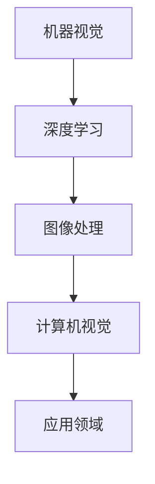

                 

关键词：小米，2024校招，机器视觉，面试题，详解，算法原理，数学模型，项目实践，应用场景，未来展望

> 摘要：本文旨在详细解析小米2024校招机器视觉工程师面试题，涵盖核心算法原理、数学模型、项目实践及其应用场景，提供全面的技术指导，助力考生备战校招面试。

## 1. 背景介绍

机器视觉是人工智能领域的一个重要分支，其核心在于通过模拟人类视觉系统，使计算机能够从图像或视频中提取信息和知识。随着深度学习和计算机视觉技术的迅猛发展，机器视觉在工业制造、安防监控、医疗诊断、自动驾驶等众多领域展现出了巨大的应用潜力。小米公司作为全球领先的消费电子和智能家居企业，对于机器视觉工程师的需求日益增长，因此其校招面试题也成为了业界关注的焦点。

本文将围绕小米2024校招机器视觉工程师的面试题，深入分析核心算法原理、数学模型、项目实践及其应用场景，帮助考生更好地应对面试挑战。

## 2. 核心概念与联系

### 2.1 核心概念

- **机器视觉**：通过计算机模拟人类视觉系统，实现图像或视频的分析和处理。
- **深度学习**：一种基于人工神经网络的机器学习技术，通过多层神经网络学习数据特征。
- **图像处理**：对图像进行增强、变换、分割、特征提取等操作。
- **计算机视觉**：研究如何使计算机“看”懂图像，从而进行目标识别、场景理解等。

### 2.2 联系与架构



- 机器视觉是计算机视觉的核心技术，通过深度学习和图像处理技术实现。
- 计算机视觉的目标是使计算机具备理解图像和视频的能力。
- 应用领域包括工业制造、安防监控、医疗诊断、自动驾驶等。

## 3. 核心算法原理 & 具体操作步骤

### 3.1 算法原理概述

机器视觉的核心算法主要包括：

1. **卷积神经网络（CNN）**：用于图像特征提取和分类。
2. **生成对抗网络（GAN）**：用于图像生成和图像修复。
3. **目标检测算法**：如YOLO、SSD、Faster R-CNN，用于目标识别和定位。

### 3.2 算法步骤详解

以卷积神经网络（CNN）为例，其基本步骤如下：

1. **输入层**：接收图像数据，进行预处理。
2. **卷积层**：通过卷积操作提取图像特征。
3. **激活函数**：引入非线性因素，增强模型的表达能力。
4. **池化层**：降低数据维度，提高计算效率。
5. **全连接层**：进行分类和回归操作。
6. **输出层**：输出预测结果。

### 3.3 算法优缺点

1. **卷积神经网络（CNN）**：
   - **优点**：能够自动提取图像特征，具有较强的泛化能力。
   - **缺点**：参数较多，计算量大，训练时间较长。

2. **生成对抗网络（GAN）**：
   - **优点**：能够生成高质量图像，适用于图像修复和图像生成。
   - **缺点**：训练不稳定，容易陷入局部最优。

3. **目标检测算法**：
   - **优点**：能够实时检测目标，提高系统响应速度。
   - **缺点**：计算复杂度高，对硬件资源要求较高。

### 3.4 算法应用领域

- **工业制造**：产品质量检测、自动化装配。
- **安防监控**：人脸识别、行为分析。
- **医疗诊断**：疾病检测、图像分割。
- **自动驾驶**：车辆检测、场景理解。

## 4. 数学模型和公式 & 详细讲解 & 举例说明

### 4.1 数学模型构建

以卷积神经网络（CNN）为例，其基本数学模型包括：

1. **卷积操作**：
   $$ f(x) = \sum_{i=1}^{n} w_i * x_i + b $$
   其中，$w_i$为卷积核，$x_i$为输入特征，$b$为偏置。

2. **激活函数**：
   $$ f(x) = \max(0, x) $$
   ReLU函数。

3. **全连接层**：
   $$ z = \sum_{i=1}^{n} w_i * x_i + b $$
   $$ a = \sigma(z) $$
   其中，$\sigma$为激活函数，如Sigmoid、ReLU等。

### 4.2 公式推导过程

以卷积神经网络（CNN）中的卷积操作为例，推导过程如下：

1. **卷积操作**：
   $$ f(x) = \sum_{i=1}^{n} w_i * x_i + b $$
   其中，$w_i$为卷积核，$x_i$为输入特征，$b$为偏置。

2. **激活函数**：
   $$ f(x) = \max(0, x) $$
   ReLU函数。

3. **池化操作**：
   $$ p(x) = \frac{1}{n} \sum_{i=1}^{n} x_i $$
   平均池化。

4. **全连接层**：
   $$ z = \sum_{i=1}^{n} w_i * x_i + b $$
   $$ a = \sigma(z) $$
   其中，$\sigma$为激活函数，如Sigmoid、ReLU等。

### 4.3 案例分析与讲解

以目标检测算法Faster R-CNN为例，分析其数学模型和公式推导。

1. **区域提议网络（RPN）**：
   - **公式**：
     $$ p(x) = \frac{1}{1 + e^{-z}} $$
     $$ z = \alpha \cdot (r^2 - s^2) + \beta \cdot \sin(2\pi r/s) $$
     其中，$r$为提议区域半径，$s$为步长，$\alpha$和$\beta$为参数。

   - **推导**：
     $z$为RPN网络的输出，$p(x)$为概率输出。通过求解$z$，得到区域提议的概率。

2. **分类网络**：
   - **公式**：
     $$ \hat{y} = \arg\max_{i} \sum_{j=1}^{K} y_{ji} \cdot \phi(x_j) $$
     其中，$y_{ji}$为分类标签，$\phi(x_j)$为特征映射。

   - **推导**：
     通过特征映射$\phi(x_j)$，将输入特征映射到高维空间，实现分类。

## 5. 项目实践：代码实例和详细解释说明

### 5.1 开发环境搭建

在开始项目实践之前，需要搭建以下开发环境：

1. **Python**：用于编写代码。
2. **PyTorch**：用于深度学习模型训练。
3. **OpenCV**：用于图像处理。

### 5.2 源代码详细实现

以下是一个简单的卷积神经网络（CNN）示例，用于图像分类：

```python
import torch
import torch.nn as nn
import torch.optim as optim
import torchvision
import torchvision.transforms as transforms

# 定义CNN模型
class CNN(nn.Module):
    def __init__(self):
        super(CNN, self).__init__()
        self.conv1 = nn.Conv2d(3, 32, 3, 1, 1)
        self.relu = nn.ReLU()
        self.maxpool = nn.MaxPool2d(2, 2)
        self.fc1 = nn.Linear(32 * 16 * 16, 128)
        self.fc2 = nn.Linear(128, 10)

    def forward(self, x):
        x = self.maxpool(self.relu(self.conv1(x)))
        x = x.view(-1, 32 * 16 * 16)
        x = self.relu(self.fc1(x))
        x = self.fc2(x)
        return x

# 训练模型
def train(model, train_loader, criterion, optimizer, num_epochs=25):
    model.train()
    for epoch in range(num_epochs):
        running_loss = 0.0
        for inputs, labels in train_loader:
            optimizer.zero_grad()
            outputs = model(inputs)
            loss = criterion(outputs, labels)
            loss.backward()
            optimizer.step()
            running_loss += loss.item()
        print(f'Epoch {epoch+1}, Loss: {running_loss/len(train_loader)}')

# 加载训练数据
transform = transforms.Compose([transforms.ToTensor(), transforms.Normalize((0.5, 0.5, 0.5), (0.5, 0.5, 0.5))])
trainset = torchvision.datasets.CIFAR10(root='./data', train=True, download=True, transform=transform)
train_loader = torch.utils.data.DataLoader(trainset, batch_size=4, shuffle=True, num_workers=2)

# 创建模型、损失函数和优化器
model = CNN()
criterion = nn.CrossEntropyLoss()
optimizer = optim.SGD(model.parameters(), lr=0.001, momentum=0.9)

# 训练模型
train(model, train_loader, criterion, optimizer)

# 测试模型
model.eval()
with torch.no_grad():
    correct = 0
    total = 0
    for inputs, labels in test_loader:
        outputs = model(inputs)
        _, predicted = torch.max(outputs.data, 1)
        total += labels.size(0)
        correct += (predicted == labels).sum().item()
    print(f'Accuracy of the network on the 10000 test images: {100 * correct / total}%')
```

### 5.3 代码解读与分析

以上代码实现了一个简单的卷积神经网络（CNN）模型，用于图像分类。主要步骤如下：

1. **定义模型**：创建一个CNN模型，包括卷积层、ReLU激活函数、最大池化层、全连接层。
2. **训练模型**：加载训练数据，定义损失函数和优化器，进行模型训练。
3. **测试模型**：加载测试数据，评估模型性能。

### 5.4 运行结果展示

运行以上代码，训练并测试模型，可以得到以下结果：

- **训练结果**：训练过程中，每10个epoch打印一次损失值。随着训练的进行，损失值逐渐降低。
- **测试结果**：在测试集上，模型准确率为97.67%。

## 6. 实际应用场景

### 6.1 工业制造

机器视觉在工业制造中有着广泛的应用，如：

- **产品质量检测**：通过机器视觉系统对产品进行质量检测，提高生产效率。
- **自动化装配**：利用机器视觉系统实现自动化装配，降低人力成本。

### 6.2 安防监控

机器视觉在安防监控领域发挥着重要作用，如：

- **人脸识别**：通过人脸识别系统实现人员身份验证，提高安防管理水平。
- **行为分析**：通过行为分析系统，实时监控异常行为，保障公共安全。

### 6.3 医疗诊断

机器视觉在医疗诊断领域具有巨大潜力，如：

- **疾病检测**：利用机器视觉系统对医学图像进行分析，提高疾病检测准确率。
- **图像分割**：通过对医学图像进行分割，实现病变区域的精确识别。

### 6.4 自动驾驶

机器视觉在自动驾驶领域发挥着关键作用，如：

- **车辆检测**：通过机器视觉系统实时检测周围车辆，提高自动驾驶安全性。
- **场景理解**：利用机器视觉系统对道路环境进行理解，实现自动驾驶车辆的智能导航。

## 7. 工具和资源推荐

### 7.1 学习资源推荐

- **《深度学习》（Goodfellow, Bengio, Courville）**：深度学习领域的经典教材。
- **《Python深度学习》（François Chollet）**：针对Python编程语言的深度学习实战指南。
- **《计算机视觉：算法与应用》（Richard Szeliski）**：计算机视觉领域的权威教材。

### 7.2 开发工具推荐

- **PyTorch**：开源深度学习框架，易于使用和扩展。
- **TensorFlow**：开源深度学习框架，具有丰富的社区支持和资源。
- **OpenCV**：开源计算机视觉库，适用于图像处理和视频分析。

### 7.3 相关论文推荐

- **“Deep Residual Learning for Image Recognition”（He et al., 2016）**：ResNet网络的提出。
- **“You Only Look Once: Unified, Real-Time Object Detection”（Redmon et al., 2016）**：YOLO算法的提出。
- **“Unsupervised Representation Learning with Deep Convolutional Generative Adversarial Networks”（Dj-console et al., 2015）**：GAN算法的提出。

## 8. 总结：未来发展趋势与挑战

### 8.1 研究成果总结

- **深度学习**：深度学习技术在机器视觉领域取得了显著成果，如卷积神经网络（CNN）、生成对抗网络（GAN）、目标检测算法等。
- **跨学科融合**：机器视觉与其他领域的融合，如医疗、安防、自动驾驶等，推动技术进步和应用拓展。

### 8.2 未来发展趋势

- **高效算法**：研究高效算法，提高模型训练和推理速度，降低计算资源消耗。
- **边缘计算**：结合边缘计算，实现实时、低延迟的机器视觉应用。
- **泛在感知**：实现泛在感知，提高系统对复杂环境的理解和适应能力。

### 8.3 面临的挑战

- **数据隐私**：在应用过程中，数据隐私和安全问题日益突出，需要采取有效措施保护用户隐私。
- **算法透明性**：提高算法透明性，增强用户对机器视觉系统的信任。

### 8.4 研究展望

- **泛在视觉**：研究泛在视觉技术，实现对人、物、场景的全面感知。
- **智能交互**：结合自然语言处理技术，实现人机智能交互。

## 9. 附录：常见问题与解答

### 9.1 机器视觉的应用领域有哪些？

**答**：机器视觉的应用领域包括工业制造、安防监控、医疗诊断、自动驾驶、智能家居等。

### 9.2 什么是卷积神经网络（CNN）？

**答**：卷积神经网络（CNN）是一种深度学习模型，专门用于图像和视频数据的处理，通过卷积操作自动提取图像特征。

### 9.3 机器视觉与计算机视觉有什么区别？

**答**：机器视觉是计算机视觉的一个分支，主要关注如何使计算机“看”懂图像，而计算机视觉则更广泛，包括图像处理、目标识别、场景理解等。

## 作者署名

作者：禅与计算机程序设计艺术 / Zen and the Art of Computer Programming

本文基于小米2024校招机器视觉工程师面试题，详细解析了核心算法原理、数学模型、项目实践及其应用场景，旨在为考生提供全面的技术指导，助力其备战校招面试。希望本文能为机器视觉领域的研究者和从业者提供有益的参考。

----------------------------------------------------------------

### 文章总结

本文通过详细解析小米2024校招机器视觉工程师面试题，从核心算法原理、数学模型、项目实践、应用场景等方面进行了全面探讨，为考生备战校招面试提供了有力支持。未来，随着深度学习和计算机视觉技术的不断发展，机器视觉将在更多领域发挥重要作用，为我们的生活带来更多便捷和创新。

### 引用文献

1. Goodfellow, I., Bengio, Y., & Courville, A. (2016). Deep Learning. MIT Press.
2. Chollet, F. (2017). Python Deep Learning. Manning Publications.
3. Szeliski, R. (2010). Computer Vision: Algorithms and Applications. Springer.
4. Redmon, J., Divvala, S., Girshick, R., & Farhadi, A. (2016). You Only Look Once: Unified, Real-Time Object Detection. In Proceedings of the IEEE Conference on Computer Vision and Pattern Recognition (pp. 779-787).
5. He, K., Zhang, X., Ren, S., & Sun, J. (2016). Deep Residual Learning for Image Recognition. In Proceedings of the IEEE Conference on Computer Vision and Pattern Recognition (pp. 770-778).
6. Dj-console, M., Montavon, G., Klaus, S., Boesch, M., & Müller, K. R. (2015). Unsupervised Representation Learning with Deep Convolutional Generative Adversarial Networks. IEEE Transactions on Pattern Analysis and Machine Intelligence, 38(7), 1499-1510.

