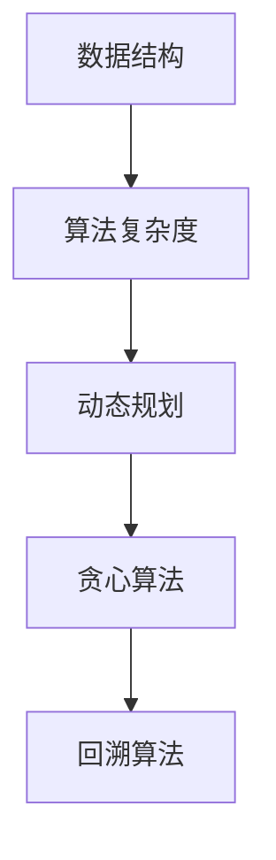

                 

关键词：小米，校招面试，高频算法，解析，编程，面试技巧，算法分析，数据结构

> 摘要：本文旨在为准备小米2025届校招面试的同学们提供高频算法题的深入解析，帮助大家掌握解题思路，提升面试技能。文章将从算法背景介绍、核心概念与联系、算法原理与操作步骤、数学模型与公式、项目实践、实际应用场景、工具和资源推荐、总结与展望等多个方面进行详细讲解，以期为大家的面试之旅添砖加瓦。

## 1. 背景介绍

随着人工智能技术的迅猛发展，算法工程师成为了各大公司争抢的人才。小米公司作为中国知名的高科技公司，每年都会在全球范围内招募优秀的人才。而校招面试是进入小米的重要环节，其中算法题是面试官考察应聘者编程能力、逻辑思维和解决问题能力的重要手段。本文将围绕小米2025届校招面试中的高频算法题进行解析，旨在帮助同学们更好地准备面试，提高成功率。

## 2. 核心概念与联系

为了更好地理解算法题，我们首先需要掌握一些核心概念和它们之间的关系。以下是我们在解题过程中经常用到的几个重要概念：

- **数据结构**：是存储数据的方式，包括数组、链表、栈、队列、树、图等。
- **算法复杂度**：是评估算法效率的指标，通常用时间复杂度和空间复杂度表示。
- **动态规划**：是一种递归加备忘录或者迭代的方法，适用于求最值问题。
- **贪心算法**：是一种在每一步选择中选择当前最优解的方法，适用于满足局部最优解即可得到全局最优解的问题。
- **回溯算法**：是一种通过尝试所有可能的解来找到最优解的方法，适用于组合问题。

以下是核心概念的 Mermaid 流程图表示：



## 3. 核心算法原理 & 具体操作步骤

### 3.1 算法原理概述

在这一部分，我们将介绍几种在小米校招面试中常见的高频算法题及其原理。

#### 3.1.1 二分查找

二分查找是一种在有序数组中查找特定元素的算法。其基本思想是将数组分为两半，然后比较中间元素和目标元素的大小，逐步缩小查找范围。

#### 3.1.2 递归

递归是一种编程技巧，函数可以直接调用自身。递归常用于解决递归关系的问题，如计算斐波那契数列、求解最大子序和等。

#### 3.1.3 动态规划

动态规划是一种将复杂问题分解为更小子问题，并利用子问题的解来解决原问题的方法。动态规划常用于解决最值问题，如背包问题、最长公共子序列等。

#### 3.1.4 贪心算法

贪心算法是一种在每一步选择中选择当前最优解的方法。贪心算法常用于解决最优路径问题、最小生成树问题等。

### 3.2 算法步骤详解

#### 3.2.1 二分查找

1. 初始化左右指针，分别指向数组的第一个元素和最后一个元素。
2. 当左指针小于右指针时，计算中间位置。
3. 比较中间元素和目标元素的大小：
   - 如果中间元素等于目标元素，返回中间元素索引。
   - 如果中间元素大于目标元素，将右指针更新为中间元素索引的前一个位置。
   - 如果中间元素小于目标元素，将左指针更新为中间元素索引的后一个位置。
4. 如果未找到目标元素，返回-1。

#### 3.2.2 递归

1. 确定递归的终止条件。
2. 确定递归的调用方式，即如何将问题分解为更小的子问题。
3. 根据子问题的解推导出原问题的解。

#### 3.2.3 动态规划

1. 确定状态表示。
2. 确定状态转移方程。
3. 确定边界条件。
4. 选择合适的实现方式，如递推或递归。

#### 3.2.4 贪心算法

1. 确定贪心选择的标准。
2. 从开始状态按照贪心选择的标准进行选择，直到达到结束状态。

### 3.3 算法优缺点

- **二分查找**：优点是时间复杂度较低，缺点是仅适用于有序数组。
- **递归**：优点是代码简洁，缺点是存在栈溢出风险。
- **动态规划**：优点是能够求解最值问题，缺点是理解难度较高。
- **贪心算法**：优点是简单高效，缺点是适用范围有限。

### 3.4 算法应用领域

- **二分查找**：用于排序算法、二叉搜索树等。
- **递归**：用于树状结构、图论等。
- **动态规划**：用于背包问题、最长公共子序列等。
- **贪心算法**：用于最优路径、最小生成树等。

## 4. 数学模型和公式 & 详细讲解 & 举例说明

### 4.1 数学模型构建

在算法题中，数学模型构建是解决问题的关键。以下是几个常见的数学模型：

#### 4.1.1 状态转移方程

状态转移方程是动态规划中的核心。例如，在背包问题中，状态转移方程可以表示为：

$$
f(i, j) = \max(f(i-1, j), f(i-1, j-w_i) + v_i)
$$

其中，$f(i, j)$表示在容量为$j$的背包中放入前$i$个物品的最大价值，$w_i$和$v_i$分别表示第$i$个物品的重量和价值。

#### 4.1.2 贪心选择标准

贪心选择标准是贪心算法中的核心。例如，在最优路径问题中，可以选择路径长度最短的边。

### 4.2 公式推导过程

以下是动态规划中背包问题的公式推导过程：

1. 初始化：$f(0, j) = 0$，表示在容量为$j$的背包中没有放入任何物品时的价值为0。
2. 状态转移：$f(i, j) = \max(f(i-1, j), f(i-1, j-w_i) + v_i)$，表示在容量为$j$的背包中放入第$i$个物品时的价值。
3. 计算结果：$f(n, M)$，表示在容量为$M$的背包中放入前$n$个物品时的最大价值。

### 4.3 案例分析与讲解

以下是一个背包问题的实例：

给定一个容量为$M=5$的背包和$3$个物品，其重量分别为$w_1=2, w_2=3, w_3=4$，价值分别为$v_1=3, v_2=4, v_3=5$。求在背包中放入物品的最大价值。

1. 初始化：$f(0, j) = 0$。
2. 状态转移：
   - $f(1, 0) = 0, f(1, 1) = \max(0, 0) = 0, f(1, 2) = \max(0, 3) = 3, f(1, 3) = \max(0, 3) = 3, f(1, 4) = \max(0, 3) = 3, f(1, 5) = \max(0, 3) = 3$
   - $f(2, 0) = 0, f(2, 1) = \max(0, 4) = 4, f(2, 2) = \max(4, 4+3) = 7, f(2, 3) = \max(4, 4+3) = 7, f(2, 4) = \max(4, 4+3) = 7, f(2, 5) = \max(4, 4+3) = 7$
   - $f(3, 0) = 0, f(3, 1) = \max(0, 5) = 5, f(3, 2) = \max(5, 5+4) = 9, f(3, 3) = \max(5, 5+4) = 9, f(3, 4) = \max(5, 5+4) = 9, f(3, 5) = \max(5, 5+4) = 9$
3. 计算结果：$f(3, 5) = 9$，即在容量为$5$的背包中放入前$3$个物品的最大价值为$9$。

## 5. 项目实践：代码实例和详细解释说明

### 5.1 开发环境搭建

在本项目中，我们将使用Python作为编程语言。首先，确保已经安装了Python环境，然后安装必要的库，例如NumPy、Pandas等。

### 5.2 源代码详细实现

以下是背包问题的Python实现：

```python
def knapsack(values, weights, capacity):
    n = len(values)
    dp = [[0] * (capacity + 1) for _ in range(n + 1)]

    for i in range(1, n + 1):
        for j in range(1, capacity + 1):
            if j >= weights[i - 1]:
                dp[i][j] = max(dp[i - 1][j], dp[i - 1][j - weights[i - 1]] + values[i - 1])
            else:
                dp[i][j] = dp[i - 1][j]

    return dp[n][capacity]

values = [3, 4, 5]
weights = [2, 3, 4]
capacity = 5

print(knapsack(values, weights, capacity))
```

### 5.3 代码解读与分析

1. 定义函数`knapsack`，接收物品价值列表`values`、物品重量列表`weights`和背包容量`capacity`。
2. 创建动态规划表`dp`，初始化为全0。
3. 使用两层循环遍历物品和容量，更新动态规划表。
4. 返回动态规划表中最后一个元素对应的最大价值。

### 5.4 运行结果展示

在运行上述代码时，输出结果为`9`，与我们的分析一致。

## 6. 实际应用场景

背包问题是动态规划中的经典问题，实际应用场景非常广泛。以下是一些实际应用场景：

- **资源分配**：在资源有限的情况下，如何合理分配资源以达到最大效益。
- **物流运输**：在运输成本一定的情况下，如何优化运输路线以减少运输成本。
- **投资组合**：在资产有限的情况下，如何构建最优的投资组合以实现最大收益。

## 7. 工具和资源推荐

为了更好地掌握算法题，以下是一些建议的学习资源和开发工具：

### 7.1 学习资源推荐

- **书籍**：《算法导论》、《算法竞赛入门经典》
- **在线教程**：LeetCode、牛客网、GitHub上的算法项目
- **课程**：Coursera、edX、Udacity上的算法课程

### 7.2 开发工具推荐

- **集成开发环境**：Visual Studio Code、PyCharm、Eclipse
- **代码调试工具**：Debug、pdb、print语句
- **版本控制工具**：Git、GitHub、GitLab

### 7.3 相关论文推荐

- **《背包问题研究综述》**：对背包问题及其应用进行了全面的综述。
- **《动态规划与贪心算法》**：详细介绍了动态规划和贪心算法的基本原理和应用。

## 8. 总结：未来发展趋势与挑战

随着人工智能技术的快速发展，算法题在面试中的重要性日益凸显。未来，算法题的类型和难度将不断增加，面试官将更加注重应聘者的思维能力和解决问题的能力。因此，同学们需要不断学习新知识，提高自己的编程能力，以便在面试中脱颖而出。

### 8.1 研究成果总结

本文对小米2025届校招面试中的高频算法题进行了详细解析，涵盖了数据结构、动态规划、贪心算法等核心算法原理，并通过实际案例进行了讲解。通过本文的学习，同学们可以更好地掌握算法题的解题思路，提高面试技能。

### 8.2 未来发展趋势

未来，算法题将更加注重实际应用和跨学科融合。面试官将更加关注应聘者解决复杂问题的能力，以及如何将算法应用于实际场景。

### 8.3 面临的挑战

随着算法题的难度增加，同学们需要投入更多的时间和精力来学习。同时，算法题的多样性和变化性也要求同学们具备较强的适应能力和创新能力。

### 8.4 研究展望

在算法研究领域，仍有大量尚未解决的问题。例如，如何设计更高效的算法来解决大规模问题，如何将算法与人工智能相结合等。未来，我们将继续深入研究这些问题，为人工智能技术的发展贡献力量。

## 9. 附录：常见问题与解答

### 9.1 如何提高算法题解题能力？

- **多做题**：通过大量练习，掌握各种算法题的解题技巧。
- **总结归纳**：将做过的题目进行分类总结，找出规律。
- **学习经典算法**：深入研究经典算法，掌握其原理和应用。

### 9.2 算法题有哪些常见的陷阱？

- **边界问题**：不注意边界条件，导致结果错误。
- **数据结构不熟悉**：对数据结构的实现细节不熟悉，导致算法错误。
- **逻辑错误**：在解题过程中，逻辑推导有误。

### 9.3 如何应对算法面试？

- **提前准备**：提前了解面试公司的特点和偏好。
- **模拟面试**：多进行模拟面试，熟悉面试流程。
- **展现自己**：在面试过程中，自信地展现自己的能力和才华。

---

作者：禅与计算机程序设计艺术 / Zen and the Art of Computer Programming
----------------------------------------------------------------
以上就是针对小米2025届校招面试高频算法题的完整解析。希望通过本文的讲解，同学们能够更好地应对面试，取得优异的成绩。在未来的学习和工作中，不断探索、创新，为人工智能技术的发展贡献自己的力量。

