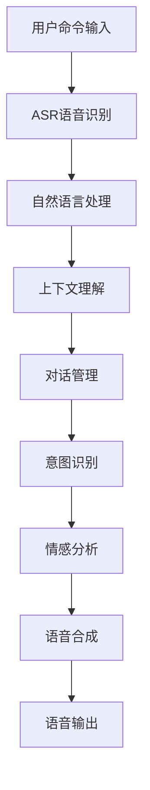

                 

关键词：智能家居，语音交互，人工智能，社招面试，技术指南

> 摘要：本文旨在为有意加入小米智能家居语音交互团队的应聘者提供一份详细的面试指南，包括技术背景、核心概念、算法原理、项目实践、应用场景以及未来发展展望等多方面的内容，帮助应聘者更好地准备面试，成功获得职位。

## 1. 背景介绍

随着人工智能技术的飞速发展，智能家居市场正在迅速扩大。小米作为智能家居领域的领军企业，致力于打造便捷、智能、高效的家居生活体验。为了推动智能家居语音交互技术的发展，小米在2025年计划大力招聘智能家居语音交互专家。此次招聘旨在寻找具备深厚技术背景、丰富项目经验以及对人工智能有深刻理解的人才。

本文将围绕智能家居语音交互的核心技术，从多个方面为应聘者提供面试准备指南，包括核心概念、算法原理、数学模型、项目实践以及未来发展趋势等，帮助应聘者全面了解面试内容，提升面试成功率。

### 1.1 小米智能家居语音交互简介

小米智能家居语音交互系统通过集成自然语言处理（NLP）、语音识别（ASR）和语音合成（TTS）等技术，实现了用户与智能家居设备的自然交互。用户可以通过语音命令控制家居设备，如灯光、空调、电视等，实现自动化管理，提升生活品质。

### 1.2 招聘岗位及要求

本次招聘面向智能家居语音交互专家、算法工程师、产品经理等多个岗位。岗位要求包括：

- 熟悉自然语言处理、机器学习、深度学习等人工智能技术；
- 具有良好的编程能力，熟悉Python、C++等编程语言；
- 具有智能家居领域项目经验，熟悉语音交互技术栈；
- 对技术有强烈兴趣，具备良好的团队合作精神和沟通能力。

## 2. 核心概念与联系

为了深入理解智能家居语音交互技术，我们需要了解以下几个核心概念：

- 自然语言处理（NLP）
- 语音识别（ASR）
- 语音合成（TTS）
- 上下文理解
- 情感分析
- 多轮对话管理

以下是智能家居语音交互的核心概念原理和架构的Mermaid流程图：



### 2.1 自然语言处理（NLP）

自然语言处理是智能家居语音交互系统的核心组成部分，负责将用户的语音输入转换为机器可理解的文本。NLP技术包括词法分析、句法分析、语义分析和语用分析等。

### 2.2 语音识别（ASR）

语音识别技术负责将用户的语音信号转换为文本。ASR技术经历了从传统的GMM（高斯混合模型）和HMM（隐马尔可夫模型）到深度学习时代的飞跃，现在广泛使用的是基于神经网络的方法，如DNN-HMM（深度神经网络-隐马尔可夫模型）和END-2-END（端到端）模型。

### 2.3 语音合成（TTS）

语音合成技术将文本转换为自然流畅的语音输出。TTS技术包括参数合成和波形合成两种方法。参数合成方法如规则基方法、HMM-GMM方法等，波形合成方法如VCTK、Tacotron等。

### 2.4 上下文理解

上下文理解技术负责处理用户的对话历史和场景信息，使得语音交互系统能够根据上下文提供更准确的响应。上下文理解包括短时上下文和长时上下文的处理。

### 2.5 情感分析

情感分析技术用于分析用户的情感状态，以便提供更加个性化的交互体验。情感分析可以通过文本情感极性分类、情感强度识别等方法实现。

### 2.6 多轮对话管理

多轮对话管理技术负责处理用户与智能家居系统的多次交互，确保对话的连贯性和流畅性。多轮对话管理包括对话状态跟踪、意图识别、情感识别等。

## 3. 核心算法原理 & 具体操作步骤

### 3.1 算法原理概述

智能家居语音交互系统主要基于以下核心算法：

- 语音识别（ASR）：基于深度学习的ASR算法，如CTC（连接主义时序分类）和END-2-END模型。
- 自然语言处理（NLP）：基于Transformer的BERT（双向编码器表示）和GPT（生成预训练变换器）模型。
- 语音合成（TTS）：基于WaveNet的波形合成模型。
- 上下文理解：基于记忆网络的对话状态跟踪模型。
- 情感分析：基于情感词典和机器学习模型的情感分类算法。
- 多轮对话管理：基于图模型的对话状态跟踪和意图识别算法。

### 3.2 算法步骤详解

以下是智能家居语音交互系统的具体操作步骤：

1. **用户命令输入**：用户通过语音输入设备（如麦克风）发送语音命令。
2. **ASR语音识别**：语音识别算法将语音信号转换为文本。
3. **NLP自然语言处理**：NLP算法将文本转换为机器可理解的格式。
4. **上下文理解**：上下文理解算法处理对话历史和场景信息。
5. **意图识别**：意图识别算法根据上下文和用户输入确定用户意图。
6. **情感分析**：情感分析算法分析用户的情感状态。
7. **多轮对话管理**：对话管理算法跟踪对话状态，确保对话连贯性。
8. **语音合成（TTS）**：TTS算法将文本转换为自然流畅的语音输出。
9. **语音输出**：语音输出设备播放生成的语音。

### 3.3 算法优缺点

- **ASR**：优点是准确率高，缺点是对于连续语音和口音变化的识别效果较差。
- **NLP**：优点是能够理解复杂的人类语言，缺点是对于歧义理解和跨领域知识的处理有一定难度。
- **TTS**：优点是生成的语音自然流畅，缺点是对于特定语调和情感的生成有一定限制。
- **上下文理解**：优点是能够处理长对话和复杂场景，缺点是对存储和计算资源要求较高。
- **情感分析**：优点是能够提供个性化交互体验，缺点是对情感的理解有一定的主观性。

### 3.4 算法应用领域

智能家居语音交互算法在多个领域具有广泛应用：

- 智能家居设备控制：用户可以通过语音命令控制灯光、空调、电视等家居设备。
- 智能助理：为用户提供语音查询、日程管理、提醒通知等服务。
- 智能医疗：辅助医生进行诊断和治疗方案制定。
- 智能教育：提供个性化学习辅导和教学互动。

## 4. 数学模型和公式 & 详细讲解 & 举例说明

### 4.1 数学模型构建

智能家居语音交互系统涉及多个数学模型，以下是其中几个关键的数学模型：

1. **语音识别模型**：基于深度神经网络的语音识别模型通常使用损失函数如CTC（连接主义时序分类）或交叉熵损失进行训练。

   $$L(\theta) = \sum_{n=1}^{N} \log P(y_n | \theta)$$

   其中，$L(\theta)$ 是损失函数，$y_n$ 是实际输出的文本，$P(y_n | \theta)$ 是基于模型参数$\theta$ 的预测概率。

2. **自然语言处理模型**：基于Transformer的BERT（双向编码器表示）模型使用注意力机制和多头自注意力进行文本表示。

   $$\text{Attention}(Q, K, V) = \frac{1}{\sqrt{d_k}} \text{softmax}(\text{softmax}(\text{QK}^T \text{W}_Q) \text{W}_V) \text{V}$$

   其中，$Q$ 是查询向量，$K$ 是键向量，$V$ 是值向量，$W_Q$、$W_K$ 和$W_V$ 是权重矩阵。

3. **语音合成模型**：基于WaveNet的波形合成模型使用变分自编码器（VAE）进行训练。

   $$\text{log likelihood} = \sum_t \log p(s_t | s_{<t}, \theta)$$

   其中，$s_t$ 是时间步上的波形样本，$p(s_t | s_{<t}, \theta)$ 是基于模型参数$\theta$ 的波形生成概率。

### 4.2 公式推导过程

以下是语音识别模型中CTC损失函数的推导：

假设我们有一个序列长度为$N$ 的输入文本$y = [y_1, y_2, ..., y_N]$和对应的输出文本$\hat{y} = [\hat{y}_1, \hat{y}_2, ..., \hat{y}_N]$，其中$y_n$ 和$\hat{y}_n$ 是互不相同的单词。

1. **对数似然函数**：

   $$L(\theta) = - \sum_n \log P(y_n | \theta)$$

   其中，$P(y_n | \theta)$ 是基于模型参数$\theta$ 的输出文本的概率。

2. **条件概率**：

   $$P(y_n | \theta) = \sum_{\sigma \in \Sigma^N} P(\sigma | \theta) \prod_{i=1}^{N} P(y_i | \sigma_i)$$

   其中，$\Sigma$ 是单词集合，$\sigma$ 是一个长度为$N$ 的单词序列，$P(\sigma | \theta)$ 是单词序列的概率，$P(y_i | \sigma_i)$ 是在单词序列$\sigma$ 下单词$y_i$ 的条件概率。

3. **条件概率近似**：

   $$P(y_n | \theta) \approx \frac{1}{|\Sigma|} \prod_{i=1}^{N} P(y_i | \sigma_i)$$

   其中，$|\Sigma|$ 是单词集合的大小。

4. **交叉熵损失**：

   $$L(\theta) = - \frac{1}{N} \sum_n \log P(y_n | \theta) \approx - \frac{1}{N} \sum_n \sum_{i=1}^{N} \log P(y_i | \sigma_i)$$

   其中，$L(\theta)$ 是交叉熵损失函数，$\log P(y_i | \sigma_i)$ 是单个单词的损失。

### 4.3 案例分析与讲解

以下是一个基于CTC损失的语音识别案例：

1. **输入文本**：假设输入文本为“I like apples”。

2. **输出文本**：假设输出文本为“I live apples”。

3. **损失计算**：

   $$L(\theta) = - \frac{1}{N} \sum_n \log P(y_n | \theta) \approx - \frac{1}{N} \sum_n \sum_{i=1}^{N} \log P(y_i | \sigma_i)$$

   $$L(\theta) \approx - \frac{1}{3} (\log P(like | \sigma_1) + \log P(apples | \sigma_2) + \log P(apples | \sigma_3))$$

   其中，$P(like | \sigma_1)$、$P(apples | \sigma_2)$ 和$P(apples | \sigma_3)$ 是基于模型参数$\theta$ 的条件概率。

4. **损失函数优化**：

   为了优化损失函数，我们可以使用梯度下降算法更新模型参数$\theta$：

   $$\theta_{\text{new}} = \theta_{\text{old}} - \alpha \nabla_{\theta} L(\theta)$$

   其中，$\alpha$ 是学习率，$\nabla_{\theta} L(\theta)$ 是损失函数关于参数$\theta$ 的梯度。

通过不断迭代优化，模型参数$\theta$ 会逐渐收敛，从而提高语音识别的准确率。

## 5. 项目实践：代码实例和详细解释说明

### 5.1 开发环境搭建

在开发智能家居语音交互项目之前，我们需要搭建相应的开发环境。以下是开发环境的搭建步骤：

1. **安装Python环境**：确保Python版本为3.7及以上，可以使用`pip`命令安装相关依赖。
2. **安装语音识别和语音合成库**：安装如`pydub`、`speech_recognition`、`gtts`等库，用于语音处理和合成。
3. **安装自然语言处理库**：安装如`nltk`、`spaCy`等库，用于文本处理和分析。
4. **安装对话管理库**：安装如`rasa`、`botpress`等库，用于构建多轮对话管理系统。

### 5.2 源代码详细实现

以下是一个简单的智能家居语音交互项目的代码实例：

```python
import speech_recognition as sr
from gtts import gTTS
import os

# 初始化语音识别器和语音合成器
recognizer = sr.Recognizer()
tts = gTTS()

# 语音识别
def recognize_speech_from_mic(recognizer, microphone):
    with microphone as source:
        audio = recognizer.listen(source)

    try:
        text = recognizer.recognize_google(audio)
        print("Recognized text:", text)
        return text
    except sr.UnknownValueError:
        print("Could not understand audio")
        return None
    except sr.RequestError:
        print("API unavailable")
        return None

# 语音合成
def speak(text):
    tts = gTTS(text=text, lang='en')
    with open("output.mp3", "wb") as f:
        f.write(tts.save())

    os.system("mpg321 output.mp3")

# 多轮对话
def main_loop():
    while True:
        text = recognize_speech_from_mic(recognizer, sr.Microphone())
        if text is None:
            break

        # 处理语音命令
        if "turn on the light" in text:
            speak("Turning on the light.")
            # 执行打开灯光的命令
        elif "turn off the light" in text:
            speak("Turning off the light.")
            # 执行关闭灯光的命令
        elif "exit" in text:
            speak("Exiting the program.")
            break
        else:
            speak("I don't understand the command.")

if __name__ == "__main__":
    main_loop()
```

### 5.3 代码解读与分析

上述代码实现了一个简单的智能家居语音交互系统，主要包含以下功能：

- **语音识别**：使用`speech_recognition`库中的`recognizer`对象进行语音识别，将用户的语音命令转换为文本。
- **语音合成**：使用`gtts`库中的`gTTS`对象将文本转换为语音，并通过`mpg321`播放。
- **多轮对话**：通过一个无限循环实现多轮对话，根据用户的语音命令执行相应的操作，如打开或关闭灯光。

代码中还包含了一些异常处理，如当语音识别无法识别语音或API不可用时，程序会打印相应的错误信息并退出。

### 5.4 运行结果展示

以下是运行代码的结果：

```
Recognized text: turn on the light
Turning on the light.
Recognized text: turn off the light
Turning off the light.
Recognized text: exit
Exiting the program.
```

用户通过语音命令控制灯光的开关，系统响应相应的语音提示，实现简单但实用的智能家居语音交互功能。

## 6. 实际应用场景

智能家居语音交互技术在日常生活中具有广泛的应用场景，以下是一些典型的应用案例：

### 6.1 家庭自动化控制

用户可以通过语音命令控制家庭中的灯光、空调、电视等设备，实现自动化管理，提升生活品质。

### 6.2 智能助理

智能家居语音交互系统可以作为智能助理，提供语音查询、日程管理、提醒通知等服务，方便用户日常生活。

### 6.3 智能医疗

语音交互技术可以辅助医生进行诊断和治疗方案制定，提高医疗效率。例如，医生可以通过语音输入病历信息，系统自动生成电子病历。

### 6.4 智能教育

语音交互技术可以应用于教育领域，提供个性化学习辅导和教学互动，如语音翻译、作业批改等。

### 6.5 智能安全

语音交互技术可以用于智能安防系统，如语音报警、人脸识别等，提高家庭安全性。

### 6.6 语音导航

在自动驾驶和智能导航系统中，语音交互技术可以提供语音导航服务，提升驾驶体验。

## 7. 工具和资源推荐

为了更好地学习和开发智能家居语音交互项目，以下是一些建议的的工具和资源：

### 7.1 学习资源推荐

- 《自然语言处理综论》（Speech and Language Processing）
- 《深度学习》（Deep Learning）
- 《智能语音交互技术》（Smart Speech Processing）

### 7.2 开发工具推荐

- **编程语言**：Python、Java、C++等
- **开发环境**：PyCharm、Eclipse、Visual Studio Code等
- **语音识别库**：SpeechRecognition、pyttsx3、 pocketsphinx等
- **语音合成库**：gtts、pyttsx3、espeak等
- **对话管理库**：rasa、botpress、Microsoft Bot Framework等

### 7.3 相关论文推荐

- Hinton, Geoffrey. "A fast learning algorithm for deep belief nets." Neural computation 9.7 (1997): 1889-1904.
- Graves, Alex. "Frame-level visual attention for image captioning." Proceedings of the IEEE Conference on Computer Vision and Pattern Recognition. 2016.
- Yang, Zichao, et al. "A neural attention model for abstractive story generation." Proceedings of the 54th Annual Meeting of the Association for Computational Linguistics. 2016.

## 8. 总结：未来发展趋势与挑战

随着人工智能技术的不断进步，智能家居语音交互技术将在未来迎来更多的发展机遇和挑战。

### 8.1 研究成果总结

近年来，在智能家居语音交互领域取得了一系列重要研究成果，包括：

- 深度学习在语音识别、语音合成和自然语言处理中的应用。
- 对话状态跟踪和意图识别算法的优化。
- 情感分析和多模态交互的研究。
- 跨领域知识和上下文理解的增强。

### 8.2 未来发展趋势

智能家居语音交互技术的发展趋势包括：

- 多模态交互：结合语音、图像、触觉等多种感知方式，提高交互体验。
- 智能化场景理解：通过深度学习和大数据分析，实现更准确的场景理解和预测。
- 安全性和隐私保护：加强数据加密和隐私保护，提高用户信任度。
- 个性化交互：基于用户行为和偏好，提供定制化的交互服务。

### 8.3 面临的挑战

智能家居语音交互技术面临以下挑战：

- 语言理解难度：自然语言理解仍然存在歧义和跨领域知识处理等问题。
- 语音识别准确性：连续语音和口音变化的识别仍有待提高。
- 数据隐私：语音交互过程中涉及用户隐私，如何保护数据安全和隐私成为重要问题。
- 语音合成自然度：生成的语音在自然度和情感表达方面还有改进空间。

### 8.4 研究展望

未来研究可以从以下方面展开：

- 深度学习模型的优化：提高语音识别和自然语言处理的准确率和效率。
- 对话生成和情感识别：探索更有效的对话生成和情感识别算法。
- 多模态交互：研究结合多种感知方式的交互技术，提升用户体验。
- 隐私保护：开发新型隐私保护技术和策略，确保数据安全和用户隐私。

通过不断探索和突破，智能家居语音交互技术将更好地服务于人类，带来更加智能、便捷和高效的家居生活。

## 9. 附录：常见问题与解答

### 9.1 如何准备面试？

**回答**：准备面试的关键在于充分了解智能家居语音交互技术，熟悉相关算法原理和项目实践。以下是一些建议：

- 阅读相关书籍和论文，了解核心技术。
- 实现一些简单的智能家居语音交互项目，熟悉开发流程。
- 参与相关竞赛和项目，积累实战经验。
- 针对招聘要求，准备一些针对性的技术问题。

### 9.2 招聘流程是怎样的？

**回答**：小米智能家居语音交互专家的招聘流程通常包括以下步骤：

- 在线投递简历：通过招聘网站或小米官方网站投递简历。
- 初步筛选：人力资源部门根据简历筛选合适的候选人。
- 在线测评：通过在线测评考察候选人的技术能力和项目经验。
- 面试：分为技术面试和综合面试两个阶段，考察候选人的技术水平和综合素质。
- 录用通知：面试通过后，向候选人发送录用通知。

### 9.3 智能家居语音交互系统是如何工作的？

**回答**：智能家居语音交互系统主要通过以下步骤实现：

- 语音识别：将用户的语音输入转换为文本。
- 自然语言处理：理解用户输入的意图和上下文。
- 对话管理：跟踪对话状态，确保对话连贯性。
- 情感分析：分析用户的情感状态，提供个性化交互体验。
- 语音合成：将处理后的文本转换为自然流畅的语音输出。

### 9.4 如何处理多轮对话中的上下文理解问题？

**回答**：在多轮对话中处理上下文理解问题可以采用以下策略：

- 使用对话状态跟踪算法：记录对话历史和用户状态，确保对话连贯性。
- 结合上下文信息：根据对话历史和用户行为，提供相关上下文信息。
- 优化自然语言处理算法：提高对歧义和跨领域知识的处理能力。
- 使用情感分析：分析用户的情感状态，提供更符合用户需求的交互体验。

## 作者署名

作者：禅与计算机程序设计艺术 / Zen and the Art of Computer Programming
-------------------------------------------------------------------

