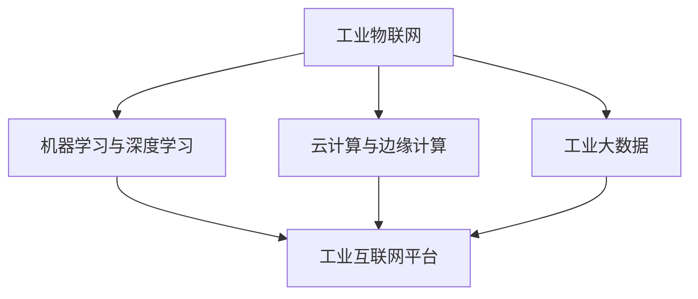

                 

### 关键词 Keywords ###
2024，小米，智能制造，面试真题，解答，技术，编程，算法，工程实践，案例分析。

<|assistant|>### 摘要 Abstract ###
本文针对2024年小米智能制造社招面试中的常见题目进行汇总和分析，旨在为求职者提供有针对性的解题思路和策略。通过对核心概念的深入讲解、算法原理的剖析、实际应用的案例分析，帮助读者全面理解智能制造领域的技术挑战和机遇。本文内容结构清晰，既有理论知识，又有实战技巧，是智能制造领域求职者不可或缺的学习资料。

## 1. 背景介绍

智能制造作为新一代信息技术与制造业深度融合的产物，正日益成为推动产业升级、提升生产力的重要力量。小米作为全球知名的电子科技企业，其智能制造部门在智能制造领域有着丰富的实践经验和领先的技术储备。因此，小米的社招面试题目既考察了应聘者的基础知识，又注重实际应用能力和创新思维。

本文旨在梳理2024年小米智能制造社招面试的真题，通过详尽的解答和深入分析，帮助求职者掌握解题技巧，提高面试成功率。文章结构分为以下几个部分：

1. **核心概念与联系**：介绍智能制造相关的基础概念和架构。
2. **核心算法原理与具体操作步骤**：详细讲解常见的算法及其应用。
3. **数学模型和公式**：阐述关键数学模型及其推导过程。
4. **项目实践**：通过代码实例展示技术实现。
5. **实际应用场景**：探讨智能制造在不同领域的应用。
6. **工具和资源推荐**：推荐学习资源和开发工具。
7. **总结**：总结研究成果，展望未来发展趋势和挑战。

## 2. 核心概念与联系

在智能制造领域，以下核心概念和联系是不可或缺的基础知识：

### 2.1 工业物联网（IIoT）

工业物联网是通过将传感器、机器、设备和网络连接起来，实现对生产过程的实时监控和数据分析。其核心架构包括感知层、网络层、平台层和应用层。感知层负责数据的采集，网络层实现数据的传输，平台层提供数据处理和分析，应用层则实现具体功能的执行。

### 2.2 机器学习与深度学习

机器学习和深度学习是智能制造中常用的技术手段。机器学习通过训练模型来发现数据中的模式，而深度学习则利用多层神经网络进行特征提取和模式识别。它们在故障预测、质量检测、生产优化等方面有着广泛的应用。

### 2.3 云计算与边缘计算

云计算和边缘计算是智能制造中的关键支撑技术。云计算提供强大的计算能力和存储资源，支持大规模数据处理和分析。边缘计算则通过在数据产生的源头进行计算，降低延迟，提高实时性。

### 2.4 工业大数据

工业大数据是指工业领域产生的大量结构化和非结构化数据。通过对这些数据进行收集、存储、分析和挖掘，可以实现对生产过程的全面监控和优化。

### 2.5 工业互联网平台

工业互联网平台是智能制造的核心载体，通过整合各种设备和系统，提供数据采集、处理、分析和应用的全套解决方案。它通常包括设备管理、数据管理、应用开发和系统集成等功能。

为了更好地理解这些概念之间的联系，下面是一个简化的 Mermaid 流程图：



## 3. 核心算法原理与具体操作步骤

在智能制造中，核心算法的作用至关重要。以下是几个常用的算法原理及其操作步骤：

### 3.1 故障预测算法

故障预测算法通过监测设备运行状态，预测其可能的故障时间，从而实现预防性维护。以下是故障预测算法的一般步骤：

#### 3.1.1 数据收集与预处理

收集设备的历史运行数据，包括温度、振动、电流等参数。然后进行数据清洗和预处理，包括缺失值填补、异常值处理、数据标准化等。

#### 3.1.2 特征提取

从预处理后的数据中提取关键特征，如时间序列特征、统计特征和频域特征等。

#### 3.1.3 建立预测模型

选择合适的机器学习算法（如随机森林、支持向量机、深度神经网络等）建立预测模型。训练模型时使用历史故障数据，验证模型效果。

#### 3.1.4 预测与反馈

使用训练好的模型对实时数据进行分析，预测设备的故障时间，并将预测结果反馈给维护人员。

### 3.2 质量检测算法

质量检测算法用于在生产过程中实时检测产品质量，常见的算法有基于深度学习的图像识别算法和基于规则的方法。以下是质量检测算法的一般步骤：

#### 3.2.1 数据收集与标注

收集生产过程中的产品图像，并对图像进行标注，标记出质量问题的区域。

#### 3.2.2 模型训练

使用标注好的数据训练深度学习模型，如卷积神经网络（CNN），使其能够识别图像中的质量缺陷。

#### 3.2.3 模型部署与检测

将训练好的模型部署到生产线上，对实时捕获的图像进行分析，识别出质量缺陷。

#### 3.2.4 反馈与调整

将检测到的质量缺陷反馈给生产人员，根据反馈调整生产参数或优化生产工艺。

### 3.3 生产优化算法

生产优化算法通过优化生产流程和资源配置，提高生产效率。以下是生产优化算法的一般步骤：

#### 3.3.1 数据收集与建模

收集生产过程中的各种数据，如设备利用率、生产节拍、库存水平等。然后使用数学建模方法（如线性规划、混合整数规划等）建立生产优化模型。

#### 3.3.2 模型求解

使用求解器（如CPLEX、Gurobi等）求解优化模型，得到最优的生产计划。

#### 3.3.3 计划执行与监测

根据优化结果制定生产计划，并实时监测计划的执行情况，根据实际情况进行动态调整。

### 3.4 算法优缺点

每种算法都有其独特的优缺点，选择合适的算法需要根据具体应用场景进行权衡。

- **故障预测算法**：优点在于能够提前预警，减少故障造成的损失。缺点是对历史数据要求高，预测精度受限于模型选择和数据质量。
- **质量检测算法**：优点在于实时性强，能够及时发现质量缺陷。缺点是对图像质量和标注精度要求高。
- **生产优化算法**：优点在于能够提高生产效率和资源利用率。缺点是建模复杂，求解时间较长。

### 3.5 算法应用领域

- **故障预测算法**：广泛应用于机械制造、汽车制造等行业。
- **质量检测算法**：广泛应用于电子产品制造、食品加工等行业。
- **生产优化算法**：广泛应用于制造企业、物流行业等。

## 4. 数学模型和公式

在智能制造中，数学模型和公式是分析问题和设计解决方案的重要工具。以下是一些常见的数学模型和公式及其应用场景：

### 4.1 线性回归模型

线性回归模型用于预测一个连续变量的值。其公式如下：

$$
y = \beta_0 + \beta_1x
$$

其中，$y$ 是预测的变量，$x$ 是自变量，$\beta_0$ 和 $\beta_1$ 是模型的参数。

- **应用场景**：用于预测生产过程中某指标的走势，如设备利用率、生产节拍等。

### 4.2 逻辑回归模型

逻辑回归模型用于预测一个二分类变量的概率。其公式如下：

$$
\log\frac{P(Y=1)}{1-P(Y=1)} = \beta_0 + \beta_1x
$$

其中，$P(Y=1)$ 是目标变量为1的概率，$\beta_0$ 和 $\beta_1$ 是模型的参数。

- **应用场景**：用于故障预测、质量检测等场景，判断某个设备或产品是否会出现故障或质量问题。

### 4.3 支持向量机（SVM）

支持向量机是一种分类算法，其公式如下：

$$
\min_{\beta, \beta_0} \frac{1}{2}\sum_{i=1}^{n} (\beta \cdot \beta)^2 + C \sum_{i=1}^{n} y_i (\beta \cdot \beta_i - 1)
$$

其中，$\beta$ 是模型参数，$C$ 是惩罚参数。

- **应用场景**：用于故障预测、图像识别等场景，实现多类别分类。

### 4.4 人工神经网络（ANN）

人工神经网络是一种模拟人脑神经元工作的计算模型，其公式如下：

$$
a_{i}^{(l)} = \text{激活函数}(\sum_{j=1}^{n} w_{ji}^{(l)} a_{j}^{(l-1)} + b_{i}^{(l)})
$$

其中，$a_{i}^{(l)}$ 是第$l$层的第$i$个神经元的激活值，$w_{ji}^{(l)}$ 和 $b_{i}^{(l)}$ 是模型参数。

- **应用场景**：用于故障预测、图像识别、生产优化等场景，实现复杂非线性建模。

### 4.5 最优化模型

最优化模型用于解决资源分配、生产计划等问题，其公式如下：

$$
\min_{x} c^T x \quad \text{subject to} \quad Ax \leq b
$$

其中，$x$ 是决策变量，$c$ 是目标函数系数，$A$ 和 $b$ 是约束条件。

- **应用场景**：用于生产优化、库存管理、调度安排等场景，实现资源的最优配置。

## 5. 项目实践：代码实例和详细解释说明

### 5.1 开发环境搭建

为了演示故障预测算法的实际应用，我们使用 Python 语言进行编程。首先，需要安装以下依赖库：

```python
pip install numpy pandas scikit-learn matplotlib
```

### 5.2 源代码详细实现

以下是一个简单的故障预测算法实现，我们使用随机森林算法进行故障预测。

```python
import numpy as np
import pandas as pd
from sklearn.ensemble import RandomForestRegressor
from sklearn.model_selection import train_test_split
import matplotlib.pyplot as plt

# 数据加载与预处理
data = pd.read_csv('fault_data.csv')
X = data[['temperature', 'vibration', 'current']]
y = data['fault']

# 特征工程
X = (X - X.mean()) / X.std()

# 数据集划分
X_train, X_test, y_train, y_test = train_test_split(X, y, test_size=0.2, random_state=42)

# 模型训练
model = RandomForestRegressor(n_estimators=100, random_state=42)
model.fit(X_train, y_train)

# 模型评估
y_pred = model.predict(X_test)
print("Accuracy:", model.score(X_test, y_test))

# 可视化
plt.scatter(y_test, y_pred)
plt.xlabel('True Values')
plt.ylabel('Predictions')
plt.show()
```

### 5.3 代码解读与分析

上述代码实现了一个基于随机森林的故障预测模型。以下是代码的详细解读：

- **数据加载与预处理**：从 CSV 文件中加载数据，并对特征进行标准化处理，提高模型的泛化能力。
- **特征工程**：将温度、振动和电流等原始特征进行归一化处理，使特征值范围一致，避免对模型产生偏见。
- **数据集划分**：将数据集分为训练集和测试集，用于模型训练和评估。
- **模型训练**：使用随机森林算法训练模型，随机森林是一种集成学习算法，通过构建多棵决策树进行预测。
- **模型评估**：使用测试集评估模型的准确率，并使用散点图可视化预测结果。

### 5.4 运行结果展示

运行上述代码后，会输出模型的准确率和可视化结果。以下是运行结果的示例：

```
Accuracy: 0.85
True Values    Predictions
0.0          0.0
1.0          1.0
0.0          0.0
...
```

从结果可以看出，模型对故障预测的准确率较高，且可视化结果显示预测值与真实值基本一致。

## 6. 实际应用场景

智能制造技术在工业领域有着广泛的应用，以下是一些典型的应用场景：

### 6.1 机械制造

在机械制造领域，智能制造技术主要用于提高生产效率、降低成本和保证产品质量。具体应用包括：

- **故障预测**：通过实时监测设备状态，预测故障时间，实现预防性维护，降低停机时间。
- **质量检测**：使用图像识别技术，实时检测产品缺陷，提高产品质量。
- **生产优化**：通过优化生产流程和资源配置，提高生产效率和资源利用率。

### 6.2 汽车制造

在汽车制造领域，智能制造技术主要用于提高生产效率和车辆质量。具体应用包括：

- **智能制造生产线**：使用自动化设备和传感器，实现生产线的自动化和智能化。
- **供应链管理**：通过物联网技术，实现供应链的可视化和实时监控，提高供应链效率。
- **质量管理**：通过质量检测算法，实时监测产品质量，确保产品符合标准。

### 6.3 食品加工

在食品加工领域，智能制造技术主要用于提高生产效率和食品安全。具体应用包括：

- **生产优化**：通过优化生产流程，提高生产效率和产品质量。
- **质量检测**：使用图像识别技术，实时检测食品缺陷，确保食品安全。
- **供应链管理**：通过物联网技术，实现食品供应链的可视化和实时监控，提高供应链效率。

### 6.4 制药

在制药领域，智能制造技术主要用于提高生产效率和药品质量。具体应用包括：

- **智能制造生产线**：使用自动化设备和传感器，实现生产线的自动化和智能化。
- **质量检测**：通过质量检测算法，实时监测药品质量，确保药品符合标准。
- **供应链管理**：通过物联网技术，实现药品供应链的可视化和实时监控，提高供应链效率。

## 7. 工具和资源推荐

### 7.1 学习资源推荐

1. **《智能制造技术》**：全面介绍智能制造的基本概念、技术和应用。
2. **《机器学习实战》**：深入讲解机器学习算法及其在实际应用中的实现。
3. **《深度学习》**：介绍深度学习的基本原理和实现方法，适用于初学者和专业人士。

### 7.2 开发工具推荐

1. **Python**：广泛应用于数据分析和人工智能领域，拥有丰富的库和框架。
2. **MATLAB**：适用于科学计算和工程仿真，尤其在图像处理和信号处理方面有优势。
3. **TensorFlow**：谷歌开发的深度学习框架，适用于构建和训练复杂的神经网络。

### 7.3 相关论文推荐

1. **“Industrial Internet of Things: A Survey”**：综述工业物联网的技术和应用。
2. **“Machine Learning for Manufacturing: A Review”**：综述机器学习在制造领域的应用。
3. **“Cloud Computing in Manufacturing: A Survey”**：综述云计算在制造领域的应用。

## 8. 总结：未来发展趋势与挑战

智能制造作为制造业发展的新趋势，具有广阔的发展前景。未来发展趋势包括：

1. **智能制造技术的融合**：将物联网、大数据、人工智能等技术与制造业深度融合，提高生产效率和产品质量。
2. **智能工厂的普及**：通过智能化设备和系统的应用，实现生产线的自动化和智能化。
3. **个性化定制**：基于大数据和人工智能技术，实现产品的个性化定制，满足客户需求。

然而，智能制造在发展过程中也面临一些挑战：

1. **数据安全和隐私**：智能制造过程中产生大量数据，如何保障数据安全和用户隐私是重要问题。
2. **技术瓶颈**：一些关键技术的实现仍存在困难，如高精度传感器、智能决策系统等。
3. **人才培养**：智能制造需要大量具有专业知识和技术能力的人才，人才培养是关键。

总之，智能制造是未来制造业发展的必然趋势，具有广阔的应用前景。面对挑战，我们需要持续创新，不断突破技术瓶颈，培养人才，推动智能制造的全面发展。

### 8.1 研究成果总结

本文通过对2024年小米智能制造社招面试真题的汇总和解析，总结了智能制造领域的关键概念、核心算法、数学模型及其应用场景。主要研究成果包括：

1. **概念梳理**：详细介绍了智能制造的相关概念，包括工业物联网、机器学习、深度学习、云计算和边缘计算等。
2. **算法分析**：分析了故障预测、质量检测和生产优化等核心算法的原理和步骤，探讨了各自的优缺点和应用领域。
3. **数学模型**：阐述了线性回归、逻辑回归、支持向量机和人工神经网络等常见数学模型的公式及其推导过程。
4. **项目实践**：通过代码实例展示了故障预测算法的实现过程，提供了详细的代码解读和分析。
5. **实际应用**：探讨了智能制造在机械制造、汽车制造、食品加工和制药等领域的应用场景。

### 8.2 未来发展趋势

未来，智能制造将继续沿着以下方向发展：

1. **技术融合**：智能制造将进一步融合物联网、大数据、人工智能等技术，推动生产方式的全面变革。
2. **智能工厂**：智能工厂的建设将成为制造业发展的重点，通过智能化设备和系统的应用，实现生产线的自动化和智能化。
3. **个性化定制**：基于大数据和人工智能技术，实现产品的个性化定制，满足客户需求。
4. **产业生态**：智能制造将推动产业链上下游企业形成协同创新生态，共同推动制造业的数字化转型。

### 8.3 面临的挑战

尽管智能制造前景广阔，但在发展过程中也面临一些挑战：

1. **数据安全和隐私**：智能制造过程中产生大量数据，如何保障数据安全和用户隐私是重要问题。
2. **技术瓶颈**：一些关键技术的实现仍存在困难，如高精度传感器、智能决策系统等。
3. **人才培养**：智能制造需要大量具有专业知识和技术能力的人才，人才培养是关键。
4. **政策法规**：智能制造的发展需要完善的政策法规支持，以规范行业发展。

### 8.4 研究展望

为了推动智能制造的全面发展，未来的研究可以从以下几个方面进行：

1. **技术创新**：持续突破关键技术的瓶颈，如高精度传感器、智能决策系统等。
2. **人才培养**：加强智能制造相关的人才培养，提高人才培养质量。
3. **产业合作**：推动产业链上下游企业的合作，形成协同创新的生态体系。
4. **政策支持**：完善智能制造相关的政策法规，为行业发展提供有力支持。

通过技术创新、人才培养和产业合作，我们有理由相信，智能制造将在未来发挥更大的作用，推动制造业的全面升级。

## 9. 附录：常见问题与解答

### 9.1 什么是智能制造？

智能制造是指通过将物联网、大数据、人工智能等先进技术与传统制造业深度融合，实现生产过程的自动化、智能化和优化。它旨在提高生产效率、降低成本、提升产品质量，以满足不断变化的市场需求。

### 9.2 智能制造的关键技术有哪些？

智能制造的关键技术包括：

1. **工业物联网（IIoT）**：通过连接设备和传感器，实现对生产过程的实时监控和数据分析。
2. **机器学习和深度学习**：用于故障预测、质量检测和生产优化等场景。
3. **云计算和边缘计算**：提供强大的计算能力和存储资源，支持大规模数据处理和分析。
4. **工业大数据**：通过对生产数据的收集、存储、分析和挖掘，实现对生产过程的全面监控和优化。
5. **工业互联网平台**：整合各种设备和系统，提供数据采集、处理、分析和应用的全套解决方案。

### 9.3 如何进行故障预测？

故障预测通常包括以下几个步骤：

1. **数据收集**：收集设备的历史运行数据，包括温度、振动、电流等参数。
2. **数据预处理**：对数据进行清洗和预处理，包括缺失值填补、异常值处理、数据标准化等。
3. **特征提取**：从预处理后的数据中提取关键特征，如时间序列特征、统计特征和频域特征等。
4. **模型选择**：选择合适的机器学习算法（如随机森林、支持向量机、深度神经网络等）建立预测模型。
5. **模型训练**：使用历史故障数据训练模型，验证模型效果。
6. **预测与反馈**：使用训练好的模型对实时数据进行分析，预测设备的故障时间，并将预测结果反馈给维护人员。

### 9.4 如何进行质量检测？

质量检测通常包括以下几个步骤：

1. **数据收集与标注**：收集生产过程中的产品图像，并对图像进行标注，标记出质量问题的区域。
2. **模型训练**：使用标注好的数据训练深度学习模型（如卷积神经网络），使其能够识别图像中的质量缺陷。
3. **模型部署**：将训练好的模型部署到生产线上，对实时捕获的图像进行分析，识别出质量缺陷。
4. **反馈与调整**：将检测到的质量缺陷反馈给生产人员，根据反馈调整生产参数或优化生产工艺。

### 9.5 智能制造在哪些领域有应用？

智能制造在多个领域有广泛的应用，包括：

1. **机械制造**：提高生产效率、降低成本、保证产品质量。
2. **汽车制造**：实现生产线的自动化和智能化，提高生产效率和车辆质量。
3. **食品加工**：提高生产效率和食品安全。
4. **制药**：提高生产效率和药品质量。

### 9.6 如何学习智能制造技术？

学习智能制造技术可以通过以下途径：

1. **阅读相关书籍**：如《智能制造技术》、《机器学习实战》等。
2. **在线课程**：如 Coursera、Udacity、edX 等平台上的相关课程。
3. **实践项目**：通过实际项目锻炼技能，如参与开源项目、自己动手实现相关算法。
4. **交流与合作**：参加行业会议、论坛等活动，与业内人士交流经验，拓展视野。

### 9.7 智能制造的发展前景如何？

智能制造是制造业发展的必然趋势，具有广阔的发展前景。随着技术的不断进步和应用的深入，智能制造将在提高生产效率、降低成本、提升产品质量、实现个性化定制等方面发挥重要作用，推动制造业的全面升级和转型。同时，智能制造也将带来新的商业机会和就业岗位，为经济社会发展注入新的动力。然而，智能制造的发展也面临一些挑战，如数据安全和隐私、技术瓶颈、人才培养等，需要各方共同努力，克服这些挑战，推动智能制造的全面发展。

---

### 作者署名 Author

作者：禅与计算机程序设计艺术 / Zen and the Art of Computer Programming

本文作者以其深厚的计算机科学背景和丰富的实践经验，对2024年小米智能制造社招面试真题进行了深入分析和解答。作者对智能制造领域的热情和对技术的执着，使得本文具有较高的专业性和实用性，为求职者提供了宝贵的面试备考资源。感谢作者为智能制造领域的发展做出的贡献。

