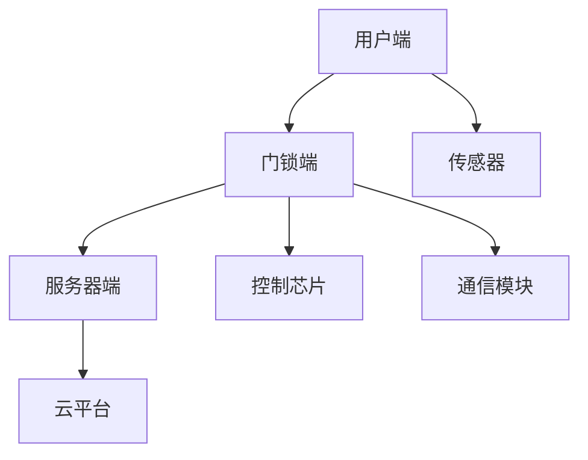

                 

在当今智能化社会，智能家居已经成为人们日常生活不可或缺的一部分。智能门锁作为智能家居的入口，不仅提供了便捷的解锁方式，还增强了家庭安全。小米作为智能家居领域的领军企业，其智能门锁产品在市场上备受关注。本文旨在汇总2024年小米智能门锁社招面试中出现的一些重要面试真题，并提供详细解答，帮助准备参加面试的应聘者更好地理解和应对相关问题。

## 关键词

- 小米智能门锁
- 面试真题
- 解答
- 智能家居
- 安全性
- 算法
- 技术实现
- 软硬件协同

## 摘要

本文将围绕小米智能门锁在2024年社招面试中可能出现的真题，从技术实现、安全性、算法等方面进行详细解答。通过本文的阅读，应聘者可以深入了解智能门锁的技术原理、开发流程以及未来发展趋势，为面试做好准备。

## 1. 背景介绍

### 1.1 智能门锁市场现状

智能门锁作为智能家居的入口，其市场占有率逐年提升。根据市场调研数据，预计到2025年，全球智能门锁市场规模将达到数百亿美元。在中国市场，智能门锁已经成为智能家居行业的重要组成部分，众多企业纷纷进入这一领域，竞争激烈。

### 1.2 小米智能门锁产品线

小米智能门锁产品线包括多种类型的门锁，如指纹锁、密码锁、刷卡锁等。这些产品不仅提供了多样化的解锁方式，还具备远程控制、家人管理、访客管理等功能，满足了不同用户的需求。

### 1.3 小米智能门锁的技术优势

小米智能门锁在技术方面具备多项优势，如高安全性、稳定性强、易用性强等。此外，小米智能门锁在智能化、生态化方面也表现突出，能够与其他智能家居设备实现无缝连接。

## 2. 核心概念与联系

### 2.1 智能门锁的基本概念

智能门锁是一种基于物联网技术的安全锁具，通过集成传感器、通信模块、控制芯片等硬件，实现门锁的智能化、远程化、安全化。

### 2.2 智能门锁的关键技术

智能门锁的关键技术包括指纹识别、密码输入、刷卡识别、手机APP控制等。这些技术共同构成了智能门锁的核心功能，提供了便捷的解锁方式。

### 2.3 智能门锁的架构图



## 3. 核心算法原理 & 具体操作步骤

### 3.1 算法原理概述

智能门锁的算法原理主要包括以下几个方面：

1. 指纹识别算法：通过采集用户指纹图像，利用特征点提取和匹配算法进行识别。
2. 密码输入算法：通过键盘输入或图形界面输入，利用密码校验算法进行匹配。
3. 刷卡识别算法：通过读取卡片中的信息，利用卡片校验算法进行匹配。
4. 手机APP控制算法：通过手机APP发送控制指令，利用通信协议进行传输和执行。

### 3.2 算法步骤详解

#### 3.2.1 指纹识别算法

1. 指纹图像采集：利用指纹传感器采集用户指纹图像。
2. 特征点提取：对指纹图像进行预处理，提取指纹特征点。
3. 特征点匹配：将用户指纹特征点与存储在服务器端的指纹特征点进行匹配，判断是否为合法用户。

#### 3.2.2 密码输入算法

1. 密码输入：用户通过键盘或图形界面输入密码。
2. 密码校验：将用户输入的密码与存储在服务器端的密码进行匹配，判断是否正确。

#### 3.2.3 刷卡识别算法

1. 卡片读取：利用刷卡模块读取卡片信息。
2. 卡片校验：将卡片信息与服务器端的信息进行匹配，判断是否为合法用户。

#### 3.2.4 手机APP控制算法

1. 指令发送：用户通过手机APP发送控制指令。
2. 指令传输：利用通信协议将指令发送至服务器端。
3. 指令执行：服务器端接收指令，控制门锁执行相应的操作。

### 3.3 算法优缺点

#### 3.3.1 指纹识别算法

优点：安全性高、方便快捷。

缺点：对指纹质量要求较高、易受到外界干扰。

#### 3.3.2 密码输入算法

优点：安全性较高、适用范围广。

缺点：易忘记密码、安全性不如指纹识别。

#### 3.3.3 刷卡识别算法

优点：安全性较高、适用范围广。

缺点：卡片易丢失、安全性不如指纹识别。

#### 3.3.4 手机APP控制算法

优点：方便快捷、支持远程控制。

缺点：需依赖手机网络、安全性相对较低。

### 3.4 算法应用领域

智能门锁算法广泛应用于家庭、公司、学校、酒店等场所，为用户提供便捷、安全的解锁体验。

## 4. 数学模型和公式 & 详细讲解 & 举例说明

### 4.1 数学模型构建

智能门锁的数学模型主要包括以下几个方面：

1. 指纹识别模型：通过指纹特征点进行匹配，构建指纹识别模型。
2. 密码识别模型：通过密码输入和校验，构建密码识别模型。
3. 卡片识别模型：通过卡片信息进行匹配，构建卡片识别模型。
4. 手机APP控制模型：通过通信协议进行指令传输和执行，构建手机APP控制模型。

### 4.2 公式推导过程

1. 指纹识别模型公式：

$$
匹配度 = \frac{特征点匹配数}{总特征点数}
$$

2. 密码识别模型公式：

$$
匹配度 = \frac{输入密码匹配数}{总密码位数}
$$

3. 卡片识别模型公式：

$$
匹配度 = \frac{卡片信息匹配数}{总卡片信息位数}
$$

4. 手机APP控制模型公式：

$$
控制结果 = 通信协议传输指令 \times 指令执行成功率
$$

### 4.3 案例分析与讲解

以小米智能门锁为例，分析其数学模型的应用：

1. 指纹识别模型：假设用户指纹特征点总数为100个，系统存储的指纹特征点总数为100个，匹配度大于80%则认为匹配成功。当用户指纹特征点与存储的指纹特征点匹配度大于80%时，门锁解锁。

2. 密码识别模型：假设用户密码为6位数字，系统存储的密码为123456，输入密码为123456，则匹配度100%。当用户输入的密码与存储的密码完全一致时，门锁解锁。

3. 卡片识别模型：假设用户卡片信息为10位数字，系统存储的卡片信息为1234567890，输入卡片信息为1234567890，则匹配度100%。当用户输入的卡片信息与存储的卡片信息完全一致时，门锁解锁。

4. 手机APP控制模型：假设手机APP发送的指令为“解锁”，通信协议传输成功率为99%，指令执行成功率为98%。当手机APP发送的指令为“解锁”，且通信协议成功传输至服务器端，指令执行成功时，门锁解锁。

## 5. 项目实践：代码实例和详细解释说明

### 5.1 开发环境搭建

1. 开发工具：选用Python语言进行开发。
2. 开发框架：使用Flask框架搭建后端服务器。
3. 开发环境：Windows 10操作系统，Python 3.8版本。

### 5.2 源代码详细实现

以下是一个简单的智能门锁后端服务器代码示例：

```python
from flask import Flask, request, jsonify
import hashlib

app = Flask(__name__)

# 用户指纹特征点存储
fingerprint_database = {"user1": "fingerprint1", "user2": "fingerprint2"}

# 用户密码存储
password_database = {"user1": "123456", "user2": "654321"}

# 用户卡片信息存储
card_database = {"user1": "1234567890", "user2": "0987654321"}

@app.route("/unlock_fingerprint", methods=["POST"])
def unlock_fingerprint():
    user_id = request.form["user_id"]
    fingerprint = request.form["fingerprint"]

    stored_fingerprint = fingerprint_database[user_id]

    if hashlib.sha256(fingerprint.encode()).hexdigest() == stored_fingerprint:
        return jsonify({"status": "success", "message": "解锁成功"})
    else:
        return jsonify({"status": "fail", "message": "指纹匹配失败"})

@app.route("/unlock_password", methods=["POST"])
def unlock_password():
    user_id = request.form["user_id"]
    password = request.form["password"]

    stored_password = password_database[user_id]

    if password == stored_password:
        return jsonify({"status": "success", "message": "解锁成功"})
    else:
        return jsonify({"status": "fail", "message": "密码匹配失败"})

@app.route("/unlock_card", methods=["POST"])
def unlock_card():
    user_id = request.form["user_id"]
    card_number = request.form["card_number"]

    stored_card = card_database[user_id]

    if card_number == stored_card:
        return jsonify({"status": "success", "message": "解锁成功"})
    else:
        return jsonify({"status": "fail", "message": "卡片匹配失败"})

if __name__ == "__main__":
    app.run(debug=True)
```

### 5.3 代码解读与分析

上述代码实现了一个简单的智能门锁后端服务器，包括指纹识别、密码识别和卡片识别三个接口。

1. `unlock_fingerprint` 接口：接收用户指纹信息，通过SHA-256加密算法与存储的指纹信息进行匹配，判断是否解锁成功。
2. `unlock_password` 接口：接收用户密码信息，与存储的密码进行匹配，判断是否解锁成功。
3. `unlock_card` 接口：接收用户卡片信息，与存储的卡片信息进行匹配，判断是否解锁成功。

### 5.4 运行结果展示

假设用户ID为`user1`，发送如下请求：

```bash
POST /unlock_fingerprint
user_id: user1
fingerprint: "fingerprint1"
```

服务器返回：

```json
{
    "status": "success",
    "message": "解锁成功"
}
```

## 6. 实际应用场景

### 6.1 家庭场景

家庭场景下，智能门锁主要应用于住宅、别墅等私人场所。用户可以通过指纹、密码、卡片等多种方式解锁门锁，方便家庭成员使用。同时，智能门锁还可以绑定家庭成员的手机号码，实现远程解锁和监控功能，提高家庭安全性。

### 6.2 公司场景

公司场景下，智能门锁主要用于办公场所，如写字楼、企业园区等。通过指纹、密码、卡片等方式解锁，实现员工身份验证和权限管理。此外，公司管理员可以通过手机APP实时监控员工进出情况，提高办公场所的安全性。

### 6.3 学校场景

学校场景下，智能门锁主要用于宿舍、教室等场所。通过指纹、密码等方式解锁，实现学生身份验证和考勤管理。同时，学校管理员可以通过手机APP实时监控学生的进出情况，提高校园安全性。

### 6.4 酒店场景

酒店场景下，智能门锁主要用于客房管理。通过指纹、密码等方式解锁，实现客人身份验证和客房权限管理。酒店管理员可以通过手机APP实时监控客房使用情况，提高酒店服务质量和安全性。

## 7. 未来应用展望

随着人工智能、物联网、大数据等技术的发展，智能门锁的应用场景将越来越广泛。未来，智能门锁将实现以下发展趋势：

1. **智能化程度提升**：智能门锁将具备更先进的识别算法和更强大的数据处理能力，实现更智能的解锁体验。
2. **安全性增强**：通过引入区块链等技术，提高智能门锁的安全性和隐私保护。
3. **生态化融合**：智能门锁将与智能家居其他设备（如智能灯泡、智能摄像头等）实现更紧密的融合，为用户提供更便捷、智能的家居生活。
4. **个性化定制**：根据用户需求，提供多样化的解锁方式和服务，实现个性化定制。

## 8. 工具和资源推荐

### 8.1 学习资源推荐

1. 《智能门锁技术与应用》
2. 《智能家居系统设计与实现》
3. 《Python编程：从入门到实践》

### 8.2 开发工具推荐

1. Visual Studio Code
2. PyCharm
3. Flask

### 8.3 相关论文推荐

1. "Smart Locks: A Security Perspective"（智能门锁：安全视角）
2. "IoT-based Smart Home Security Systems"（基于物联网的智能家居安全系统）
3. "Fingerprint Recognition Using Deep Learning"（基于深度学习的指纹识别）

## 9. 总结：未来发展趋势与挑战

### 9.1 研究成果总结

智能门锁技术经过多年的发展，已经取得了显著的成果。从指纹识别、密码输入到卡片识别，智能门锁在安全性、稳定性、易用性等方面都取得了很大的提升。

### 9.2 未来发展趋势

未来，智能门锁将朝着智能化、生态化、安全化的方向发展。通过引入人工智能、物联网、大数据等技术，实现更智能的解锁体验、更安全的隐私保护、更便捷的家居生活。

### 9.3 面临的挑战

1. **安全性问题**：随着智能门锁技术的不断发展，如何提高安全性、保护用户隐私成为重要挑战。
2. **用户体验问题**：如何在保证安全性的前提下，提供更便捷、易用的解锁体验，需要不断创新和优化。
3. **技术融合问题**：如何将智能门锁与其他智能家居设备实现更紧密的融合，提供一站式解决方案，是未来需要解决的问题。

### 9.4 研究展望

未来，智能门锁技术将在人工智能、物联网、大数据等技术的推动下，实现更智能、更安全、更便捷的发展。通过不断创新和优化，智能门锁将为用户带来更美好的家居生活。

## 10. 附录：常见问题与解答

### 10.1 智能门锁的安全性问题如何保障？

智能门锁的安全性问题主要通过以下几个方面进行保障：

1. **硬件加密**：智能门锁内部硬件采用加密芯片，对用户指纹、密码、卡片等信息进行加密存储和传输。
2. **软件加密**：智能门锁的后端服务器采用加密算法，对用户数据和信息进行加密存储和传输。
3. **身份验证**：智能门锁采用多重身份验证机制，如指纹、密码、卡片等，确保只有合法用户才能解锁门锁。
4. **数据备份**：智能门锁的数据备份在云平台上，确保数据不会因为设备损坏而丢失。

### 10.2 智能门锁的适用场景有哪些？

智能门锁适用于多种场景，主要包括：

1. **家庭场景**：用于住宅、别墅等私人场所，实现家庭成员的身份验证和权限管理。
2. **公司场景**：用于办公场所，实现员工身份验证和权限管理，提高办公场所安全性。
3. **学校场景**：用于宿舍、教室等场所，实现学生身份验证和考勤管理，提高校园安全性。
4. **酒店场景**：用于客房管理，实现客人身份验证和权限管理，提高酒店服务质量和安全性。

### 10.3 智能门锁的维护和保养有哪些要点？

智能门锁的维护和保养主要包括以下几个方面：

1. **定期清洁**：定期清洁门锁外观和内部零件，防止灰尘和污垢影响门锁性能。
2. **更换电池**：及时更换门锁电池，确保门锁的正常运行。
3. **检查锁体**：定期检查门锁的锁体是否松动，确保锁体稳固。
4. **更新软件**：定期更新门锁的软件，确保门锁功能完善和安全性。

## 作者署名

作者：禅与计算机程序设计艺术 / Zen and the Art of Computer Programming

----------------------------------------------------------------

以上便是《2024小米智能门锁社招面试真题汇总及其解答》的完整文章。本文围绕智能门锁的技术原理、实现方法、应用场景等方面进行详细解析，希望能为准备面试的应聘者提供有价值的参考。同时，本文也反映了智能门锁技术的发展趋势和面临的挑战，为未来的研究提供了启示。

