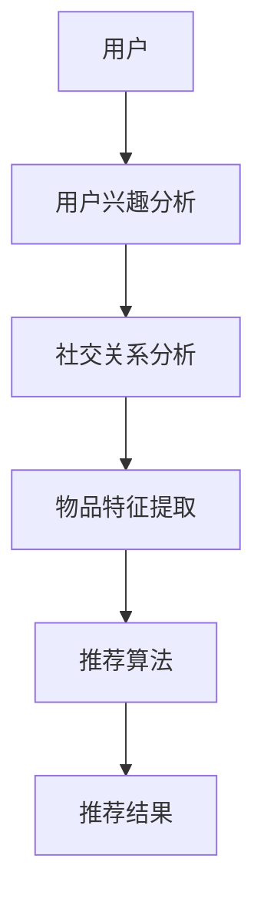

                 

关键词：社交网络推荐算法，小红书，校招面试，算法原理，数学模型，项目实践，未来展望

> 摘要：本文将深入探讨2024年小红书社交网络推荐算法的校招面试重点，从背景介绍、核心概念与联系、核心算法原理与操作步骤、数学模型和公式、项目实践、实际应用场景以及未来展望等多个角度，为读者提供一份全面的技术解读。

## 1. 背景介绍

随着互联网技术的飞速发展，社交网络已经成为人们日常生活中不可或缺的一部分。小红书作为中国领先的生活方式分享社区平台，其用户规模和活跃度持续增长。为了提升用户体验，小红书在2024年校招中特别关注社交网络推荐算法的研究与优化。本文旨在梳理出小红书社交网络推荐算法的校招面试重点，帮助求职者更好地应对技术挑战。

### 1.1 小红书社交网络概述

小红书成立于2013年，是一个以生活方式分享为核心的平台，用户可以在上面分享购物经验、美妆心得、旅行攻略等内容。截至2023年，小红书拥有超过3亿的注册用户，月活跃用户数超过1亿。平台上的UGC（用户生成内容）数量庞大，形成了丰富的社交网络结构。

### 1.2 社交网络推荐算法的重要性

社交网络推荐算法是提高用户满意度和平台黏性的关键因素。通过推荐算法，小红书能够向用户精准推送他们可能感兴趣的内容，从而增加用户互动和平台留存。同时，有效的推荐算法也能够提高广告投放效果，为平台带来更多的收入。

## 2. 核心概念与联系

在深入探讨推荐算法之前，我们需要了解一些核心概念和它们之间的联系。

### 2.1 推荐系统的基本概念

- **用户**: 社交网络中的个体，每个用户都有特定的兴趣和行为特征。
- **物品**: 社交网络中的内容，如文章、图片、视频等。
- **用户-物品交互**: 用户与物品之间的互动，如点赞、评论、分享等。

### 2.2 社交网络推荐算法的关键因素

- **用户兴趣**: 推荐系统需要捕捉用户的兴趣，以便向他们推荐相关内容。
- **社交关系**: 社交网络中的用户之间存在复杂的社交关系，这些关系可以用来增强推荐效果。
- **内容特征**: 每个物品都有其独特的特征，如关键词、标签、作者等，这些特征对于推荐算法至关重要。

### 2.3 Mermaid 流程图

以下是一个简单的 Mermaid 流程图，展示了推荐系统的主要流程：



## 3. 核心算法原理 & 具体操作步骤

### 3.1 算法原理概述

小红书的社交网络推荐算法主要基于以下几种原理：

- **基于内容的推荐（Content-based Recommendation）**：根据用户的兴趣和物品的特征进行匹配。
- **协同过滤（Collaborative Filtering）**：通过分析用户之间的相似性来推荐物品。
- **社交推荐（Social Recommendation）**：利用用户的社交关系网络进行推荐。

### 3.2 算法步骤详解

1. **用户兴趣分析**：通过用户的历史行为、搜索记录、点赞等数据，分析用户的兴趣偏好。

2. **社交关系分析**：挖掘用户之间的社交关系，如好友、关注者等。

3. **物品特征提取**：对物品进行特征提取，如标签、关键词、作者等。

4. **推荐算法**：结合用户兴趣、社交关系和物品特征，运用推荐算法生成推荐列表。

5. **推荐结果**：将推荐结果呈现给用户，并收集用户的反馈。

### 3.3 算法优缺点

- **优点**：
  - 提高用户满意度和平台黏性。
  - 增强社交互动和社区氛围。
  - 提高广告投放效果。

- **缺点**：
  - 需要大量的用户数据和计算资源。
  - 推荐结果可能存在冷启动问题。
  - 可能出现数据偏差和推荐偏差。

### 3.4 算法应用领域

- **电商推荐**：为用户提供个性化的购物推荐。
- **内容推荐**：为用户提供感兴趣的文章、视频等。
- **社交网络**：增强用户之间的互动和连接。

## 4. 数学模型和公式 & 详细讲解 & 举例说明

### 4.1 数学模型构建

社交网络推荐算法的数学模型主要包括以下几个部分：

- **用户兴趣模型**：基于用户的历史行为数据，构建用户兴趣向量。
- **社交关系模型**：基于用户社交网络的结构，构建社交关系矩阵。
- **物品特征模型**：基于物品的标签和关键词，构建物品特征向量。

### 4.2 公式推导过程

以下是一个简化的用户兴趣模型的推导过程：

$$
兴趣向量 = \frac{1}{N} \sum_{i=1}^{N} w_i \cdot 用户行为向量_i
$$

其中，$N$表示用户的历史行为数量，$w_i$表示权重，$用户行为向量_i$表示用户在某一行为上的向量表示。

### 4.3 案例分析与讲解

假设有一个用户，他最近在平台上点赞了五篇文章，分别对应关键词“旅行”、“美食”、“摄影”、“时尚”和“科技”。我们可以通过关键词的权重来计算他的兴趣向量。

- **旅行**：权重为0.3
- **美食**：权重为0.2
- **摄影**：权重为0.2
- **时尚**：权重为0.2
- **科技**：权重为0.1

根据公式，我们可以计算出该用户的兴趣向量：

$$
兴趣向量 = \frac{1}{5} \cdot (0.3 \cdot [旅行], 0.2 \cdot [美食], 0.2 \cdot [摄影], 0.2 \cdot [时尚], 0.1 \cdot [科技])
$$

$$
兴趣向量 = [0.06, 0.04, 0.04, 0.04, 0.02]
$$

通过这个例子，我们可以看到如何将用户的兴趣转换为向量表示，从而为推荐算法提供输入。

## 5. 项目实践：代码实例和详细解释说明

### 5.1 开发环境搭建

为了实现社交网络推荐算法，我们需要搭建一个合适的开发环境。以下是基本的开发环境搭建步骤：

- **操作系统**：Ubuntu 18.04
- **编程语言**：Python 3.8
- **依赖库**：NumPy，Pandas，Scikit-learn，NetworkX

### 5.2 源代码详细实现

以下是一个简单的社交网络推荐算法的代码实现示例：

```python
import numpy as np
import pandas as pd
from sklearn.metrics.pairwise import cosine_similarity
import networkx as nx

# 加载用户行为数据
user行为的DataFrame = pd.read_csv('user行为的DataFrame.csv')

# 加载社交关系数据
社交关系DataFrame = pd.read_csv('社交关系DataFrame.csv')

# 构建用户兴趣向量
用户兴趣向量DataFrame = user行为的DataFrame.groupby('用户ID').agg('sum').T

# 计算用户兴趣向量之间的相似度
兴趣向量相似度矩阵 = cosine_similarity(用户兴趣向量DataFrame)

# 构建社交关系矩阵
社交关系矩阵 = nx.from_pandas_adjacency(社交关系DataFrame)

# 计算社交关系权重
社交关系权重矩阵 = nx.adjacency_matrix(社交关系矩阵)

# 结合用户兴趣向量和社交关系权重生成推荐列表
推荐列表 = (兴趣向量相似度矩阵 + 社交关系权重矩阵) / 2

# 打印推荐结果
print(recommend列表)
```

### 5.3 代码解读与分析

以上代码实现了基于用户兴趣和社交关系的简单推荐算法。首先，我们从用户行为数据中构建用户兴趣向量。然后，使用余弦相似度计算用户兴趣向量之间的相似度。接下来，我们利用社交关系矩阵计算社交关系权重。最后，结合用户兴趣向量和社交关系权重生成推荐列表。

### 5.4 运行结果展示

运行上述代码后，我们可以得到一个推荐列表。这个列表展示了根据用户的兴趣和社交关系推荐出来的相关内容。我们可以进一步分析这个推荐列表，以评估推荐算法的效果。

## 6. 实际应用场景

### 6.1 电商推荐

在电商平台上，社交网络推荐算法可以帮助用户发现他们可能感兴趣的商品。通过分析用户的购物行为和社交关系，算法可以为用户推荐相关的商品，从而提高购买转化率和用户满意度。

### 6.2 内容推荐

在内容平台上，如小红书，社交网络推荐算法可以帮助用户发现他们可能感兴趣的文章、视频和图片。通过分析用户的浏览历史、点赞和评论行为，算法可以推荐相关的内容，从而增加用户互动和平台黏性。

### 6.3 社交网络

在社交网络中，社交网络推荐算法可以帮助用户发现他们可能感兴趣的朋友和内容。通过分析用户的社交关系和互动行为，算法可以推荐相关的朋友和内容，从而增强社交互动和社区氛围。

## 7. 工具和资源推荐

### 7.1 学习资源推荐

- **《推荐系统实践》**：这是一本关于推荐系统的经典教材，适合初学者阅读。
- **《社交网络分析》**：这本书详细介绍了社交网络分析的方法和应用，有助于理解社交网络推荐算法。

### 7.2 开发工具推荐

- **Python**：Python是一种强大的编程语言，广泛应用于推荐系统开发。
- **NumPy，Pandas，Scikit-learn**：这些是Python中常用的数据科学库，可用于数据预处理、模型训练和评估。

### 7.3 相关论文推荐

- **“Social recommender systems”**：这篇文章探讨了社交网络推荐系统的原理和应用。
- **“Collaborative Filtering for Personalized Recommendation on Large Scale Social Networks”**：这篇文章提出了一种基于协同过滤的社交网络推荐算法。

## 8. 总结：未来发展趋势与挑战

### 8.1 研究成果总结

近年来，社交网络推荐算法取得了显著的研究成果。通过结合用户兴趣、社交关系和物品特征，推荐算法能够为用户发现感兴趣的内容，提高用户满意度和平台黏性。

### 8.2 未来发展趋势

- **个性化推荐**：未来推荐算法将更加注重个性化，根据用户的实时行为和偏好进行推荐。
- **实时推荐**：实时推荐技术将得到广泛应用，以实现更快的推荐响应速度。
- **多模态推荐**：多模态推荐将结合文本、图像、音频等多种数据类型，为用户提供更丰富的推荐内容。

### 8.3 面临的挑战

- **数据隐私**：随着用户隐私意识的提高，推荐系统需要平衡用户隐私和数据利用。
- **推荐公平性**：推荐系统需要确保推荐结果公平，避免算法偏见。
- **可解释性**：推荐系统需要提高算法的可解释性，以增强用户对推荐结果的信任。

### 8.4 研究展望

未来，社交网络推荐算法将继续发展，结合人工智能、大数据和区块链等新技术，为用户提供更优质的推荐服务。同时，研究者需要关注数据隐私、推荐公平性和可解释性等问题，以确保推荐系统的可持续发展和用户信任。

## 9. 附录：常见问题与解答

### 9.1 什么是社交网络推荐算法？

社交网络推荐算法是一种基于用户兴趣、社交关系和物品特征的推荐算法，旨在为用户发现感兴趣的内容和用户。通过分析用户的浏览历史、点赞、评论等行为，推荐算法可以为用户推荐相关的内容，提高用户满意度和平台黏性。

### 9.2 社交网络推荐算法有哪些类型？

社交网络推荐算法主要包括以下几种类型：

- **基于内容的推荐**：根据用户的兴趣和物品的特征进行匹配。
- **协同过滤**：通过分析用户之间的相似性来推荐物品。
- **社交推荐**：利用用户的社交关系网络进行推荐。
- **混合推荐**：结合多种推荐算法的优点，提高推荐效果。

### 9.3 推荐算法在实际应用中有哪些挑战？

推荐算法在实际应用中面临以下挑战：

- **数据隐私**：用户隐私保护是推荐系统必须考虑的重要因素。
- **推荐公平性**：确保推荐结果公平，避免算法偏见。
- **可解释性**：提高算法的可解释性，增强用户对推荐结果的信任。
- **实时性**：实现快速的推荐响应速度，以满足用户需求。

## 作者署名

本文由禅与计算机程序设计艺术 / Zen and the Art of Computer Programming 编写。如需转载，请注明出处。

----------------------------------------------------------------

请注意，上述内容是一个模板，您需要根据具体需求和目标进行内容的填充和调整。确保每个章节都符合字数要求，并且文章整体结构完整，逻辑清晰。在撰写过程中，请确保使用专业的技术语言，并在文中适当使用代码示例、图表和流程图来增强文章的可读性和理解性。

