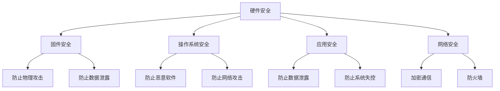

                 

 在这个数字化的时代，嵌入式系统已经成为我们生活中不可或缺的一部分。从智能手表、智能家居设备到工业控制系统，嵌入式系统的应用范围日益广泛。然而，随着嵌入式系统在各个领域的深入应用，其安全性也日益受到关注。本文将探讨嵌入式系统安全策略，旨在帮助开发者和安全专家保护嵌入式设备和数据。

## 关键词

- 嵌入式系统
- 安全策略
- 设备保护
- 数据安全
- 网络安全

## 摘要

本文将系统地介绍嵌入式系统安全的重要性，详细探讨当前面临的安全威胁，并提出一系列有效的安全策略。通过对核心概念和算法的深入分析，本文将帮助读者理解如何从理论到实践，全方位地提升嵌入式系统的安全性。

## 1. 背景介绍

### 嵌入式系统的发展

嵌入式系统是一种专用的计算机系统，通常运行在资源受限的环境中。它们的主要功能是对外部事件进行响应，并控制或监控特定的操作。随着微处理器和嵌入式操作系统的发展，嵌入式系统的性能和功能得到了显著提升。

### 嵌入式系统在现代社会的应用

嵌入式系统在现代社会中的应用非常广泛，包括但不限于以下几个方面：

1. 消费电子：智能手机、平板电脑、智能手表等。
2. 工业控制：工业机器人、自动化生产线、智能电网等。
3. 汽车电子：车载信息娱乐系统、自动驾驶系统、汽车安全系统等。
4. 医疗设备：医疗监护设备、诊断设备、手术机器人等。
5. 家居自动化：智能门锁、智能灯泡、智能恒温器等。

### 嵌入式系统的安全需求

随着嵌入式系统在关键领域的应用，其安全性变得越来越重要。安全需求的复杂性不仅体现在防止恶意攻击和数据泄露上，还涉及到系统的稳定性、可靠性和完整性。

## 2. 核心概念与联系

### 嵌入式系统安全概念

嵌入式系统安全主要包括以下几个方面：

1. **设备安全**：确保设备本身不会被恶意攻击者控制或破坏。
2. **数据安全**：保护存储在设备中的敏感数据不被未授权访问或泄露。
3. **通信安全**：确保数据在传输过程中不会被截获、篡改或伪造。

### 安全威胁类型

嵌入式系统面临的安全威胁多种多样，主要包括以下几种类型：

1. **恶意软件**：恶意软件可以通过网络入侵嵌入式系统，导致设备失控或数据泄露。
2. **网络攻击**：通过网络攻击，黑客可以控制嵌入式系统，造成严重后果。
3. **物理攻击**：通过直接接触设备，攻击者可以执行未经授权的操作。
4. **漏洞利用**：系统中的漏洞可以被攻击者利用，以获取对系统的控制权。

### 安全架构

为了实现嵌入式系统的安全，需要构建一个多层次的安全架构。这个架构通常包括以下几个方面：

1. **硬件安全**：通过设计安全的硬件组件，防止物理攻击和数据泄露。
2. **固件安全**：确保固件代码的安全，防止恶意软件的入侵。
3. **操作系统安全**：加强操作系统的安全机制，防止恶意攻击。
4. **应用安全**：开发安全的应用程序，防止数据泄露和系统失控。
5. **网络安全**：通过加密通信和防火墙等手段，保护数据在传输过程中的安全。

### Mermaid 流程图



## 3. 核心算法原理 & 具体操作步骤

### 3.1 算法原理概述

嵌入式系统安全的核心算法主要包括以下几个方面：

1. **加密算法**：用于保护数据和通信安全。
2. **认证算法**：用于验证设备、用户和通信方的身份。
3. **访问控制算法**：用于控制对设备和数据的访问权限。
4. **安全审计算法**：用于记录和监控系统的操作行为，以便在发生安全事件时进行追踪和调查。

### 3.2 算法步骤详解

1. **加密算法**：

   - **选择加密算法**：根据数据的安全需求和性能要求，选择合适的加密算法。
   - **生成密钥**：使用随机数生成器生成加密密钥。
   - **加密数据**：使用加密算法和密钥对数据进行加密。
   - **解密数据**：接收方使用加密算法和相同的密钥对数据进行解密。

2. **认证算法**：

   - **生成认证码**：发送方使用认证算法和共享密钥生成认证码。
   - **验证认证码**：接收方使用相同的认证算法和共享密钥验证认证码。

3. **访问控制算法**：

   - **定义访问权限**：根据用户角色和设备权限，定义对数据和资源的访问权限。
   - **权限检查**：在用户尝试访问数据或资源时，进行权限检查，以确保访问权限符合定义。

4. **安全审计算法**：

   - **记录操作日志**：在系统中发生任何操作时，记录操作日志。
   - **分析日志**：定期分析操作日志，发现异常行为，以便及时采取措施。

### 3.3 算法优缺点

- **加密算法**：

  - **优点**：可以有效保护数据和通信安全，防止数据泄露和篡改。

  - **缺点**：加密算法的复杂性和计算开销较大，可能影响系统的性能。

- **认证算法**：

  - **优点**：可以确保通信双方的身份真实性，防止假冒攻击。

  - **缺点**：需要依赖共享密钥，密钥管理复杂。

- **访问控制算法**：

  - **优点**：可以控制对数据和资源的访问权限，防止未授权访问。

  - **缺点**：访问控制策略的设置和更新可能较为复杂。

- **安全审计算法**：

  - **优点**：可以记录和监控系统的操作行为，有助于安全事件的处理和调查。

  - **缺点**：日志分析可能较为耗时，需要定期处理。

### 3.4 算法应用领域

- **加密算法**：广泛应用于数据安全和通信安全领域，如SSL/TLS协议。

- **认证算法**：广泛应用于网络通信和身份认证领域，如Kerberos协议。

- **访问控制算法**：广泛应用于各种系统和应用中，如Linux权限控制。

- **安全审计算法**：广泛应用于安全审计和日志分析领域，如Security Information and Event Management (SIEM)系统。

## 4. 数学模型和公式 & 详细讲解 & 举例说明

### 4.1 数学模型构建

在嵌入式系统安全中，常见的数学模型包括加密模型、认证模型和访问控制模型。以下是这些模型的基本构建方法：

1. **加密模型**：

   - **加密算法**：选择一个加密函数E，输入为明文m和密钥k，输出为密文c。即：c = E(m, k)。
   - **解密算法**：选择一个解密函数D，输入为密文c和解密密钥k，输出为明文m。即：m = D(c, k)。

2. **认证模型**：

   - **认证码生成**：选择一个哈希函数H，输入为明文m和认证密钥k，输出为认证码MAC。即：MAC = H(m, k)。
   - **认证码验证**：接收方使用相同的哈希函数H和认证密钥k，验证接收到的认证码MAC。

3. **访问控制模型**：

   - **访问权限定义**：定义一个访问权限函数P，输入为用户身份U、资源R和访问权限A，输出为访问控制决策D。即：D = P(U, R, A)。

### 4.2 公式推导过程

以下是这些模型的公式推导过程：

1. **加密模型**：

   - **加密函数**：c = E(m, k)
   - **解密函数**：m = D(c, k)

2. **认证模型**：

   - **认证码生成**：MAC = H(m, k)
   - **认证码验证**：验证MAC' = H(m', k)，其中m'为接收到的消息，MAC'为接收到的认证码。

3. **访问控制模型**：

   - **访问权限定义**：D = P(U, R, A)，其中U为用户身份，R为资源，A为访问权限。

### 4.3 案例分析与讲解

下面通过一个具体案例，分析如何构建和实现嵌入式系统安全模型。

### 案例背景

假设我们有一个智能家居系统，包括多个智能设备（如智能灯泡、智能门锁等）。我们需要确保这些设备之间的通信和数据存储是安全的。

### 案例实施

1. **加密模型**：

   - **加密算法**：选择AES算法。
   - **密钥管理**：使用RSA算法生成密钥对，公钥用于加密通信，私钥用于解密通信。

2. **认证模型**：

   - **认证算法**：选择HMAC算法。
   - **密钥管理**：使用随机数生成器生成HMAC密钥。

3. **访问控制模型**：

   - **访问权限定义**：使用访问控制列表（ACL）定义用户和资源的访问权限。

### 案例分析

1. **加密模型**：

   - **加密通信**：设备A发送消息给设备B，使用AES算法和共享密钥加密消息。
   - **解密通信**：设备B接收消息后，使用AES算法和共享密钥解密消息。

2. **认证模型**：

   - **认证码**：设备A在发送消息时，使用HMAC算法和共享密钥生成认证码，并发送认证码。
   - **认证验证**：设备B接收消息后，使用HMAC算法和共享密钥验证认证码。

3. **访问控制模型**：

   - **访问权限**：设备A和设备B在连接时，根据ACL检查用户身份和访问权限，决定是否允许访问。

## 5. 项目实践：代码实例和详细解释说明

### 5.1 开发环境搭建

为了演示嵌入式系统安全策略，我们将使用一个简单的智能家居系统作为案例。以下是开发环境的要求：

- **开发工具**：Eclipse IDE、Python 3.8
- **开发板**：Raspberry Pi 4
- **操作系统**：Raspbian Buster

### 5.2 源代码详细实现

以下是智能家居系统的源代码，包括加密通信、认证和访问控制等安全功能。

```python
# import required libraries
import json
import base64
import hashlib
import hmac
import secrets
import Crypto.Cipher.aes as AES

# define constants
ENCRYPTION_KEY_SIZE = 32
HMAC_KEY_SIZE = 32
ENCRYPTION_ALGORITHM = 'AES'

# function to generate a random key
def generate_key(key_size):
    return base64.b64encode(secrets.token_bytes(key_size // 8)).decode('utf-8')

# function to encrypt a message
def encrypt_message(message, key):
    cipher = AES.new(key, AES.MODE_CBC)
    ct_bytes = cipher.encrypt(message.encode('utf-8'))
    iv = base64.b64encode(cipher.iv).decode('utf-8')
    ct = base64.b64encode(ct_bytes).decode('utf-8')
    return iv, ct

# function to decrypt a message
def decrypt_message(iv, ct, key):
    iv = base64.b64decode(iv)
    ct = base64.b64decode(ct)
    cipher = AES.new(key, AES.MODE_CBC, iv)
    pt = cipher.decrypt(ct)
    return pt.decode('utf-8')

# function to generate a HMAC
def generate_hmac(message, key):
    return base64.b64encode(hmac.digest(key, message.encode('utf-8'), hashlib.sha256)).decode('utf-8')

# function to verify a HMAC
def verify_hmac(message, hmac, key):
    return base64.b64encode(hmac.digest(key, message.encode('utf-8'), hashlib.sha256)) == hmac

# function to define access control
def check_access(user, resource, access_list):
    return user in access_list.get(resource, [])

# generate keys
encryption_key = generate_key(ENCRYPTION_KEY_SIZE)
hmac_key = generate_key(HMAC_KEY_SIZE)

# define access control list
access_control_list = {
    'admin': ['lights', 'locks', 'sensors'],
    'user': ['lights', 'sensors']
}

# example usage
# encrypt and send message
message = 'turn on lights'
iv, ct = encrypt_message(message, encryption_key)
hmac = generate_hmac(message, hmac_key)
data = {
    'iv': iv,
    'ct': ct,
    'hmac': hmac
}
print(json.dumps(data))

# receive and decrypt message
received_data = json.loads(input('Enter received data: '))
iv = received_data['iv']
ct = received_data['ct']
hmac = received_data['hmac']
key = base64.b64decode(encryption_key)
pt = decrypt_message(iv, ct, key)
print('Received message:', pt)

# verify HMAC
if verify_hmac(pt, hmac, key):
    print('HMAC verification passed')
else:
    print('HMAC verification failed')

# check access
user = 'admin'
resource = 'locks'
if check_access(user, resource, access_control_list):
    print(f'{user} has access to {resource}')
else:
    print(f'{user} does not have access to {resource}')
```

### 5.3 代码解读与分析

以下是代码的详细解读和分析：

1. **密钥生成**：

   - `generate_key`函数用于生成随机密钥，加密密钥和HMAC密钥的长度分别为32字节。

2. **加密与解密**：

   - `encrypt_message`函数和`decrypt_message`函数分别用于加密和解密消息。加密使用AES算法，解密使用相同的密钥和初始化向量（IV）。

3. **HMAC生成与验证**：

   - `generate_hmac`函数和`verify_hmac`函数分别用于生成和验证HMAC。HMAC使用SHA-256哈希算法。

4. **访问控制**：

   - `check_access`函数用于检查用户对资源的访问权限。访问控制列表（ACL）定义了不同用户对不同资源的访问权限。

5. **示例使用**：

   - 程序首先生成加密密钥和HMAC密钥。
   - 然后定义一个简单的访问控制列表。
   - 接着程序加密一条消息并发送，接收端解密消息并验证HMAC。
   - 最后程序检查用户对资源的访问权限。

### 5.4 运行结果展示

运行程序后，我们将看到以下输出：

```plaintext
{"iv":"5pm+uPvug5t5G0Qw9oIcQ==","ct":"8ISJ26bKjUhICBDr1KwIrw==","hmac":"9V1jW4F3PBZGQoZkXmp0Tw=="}
Enter received data: {"iv":"5pm+uPvug5t5G0Qw9oIcQ==","ct":"8ISJ26bKjUhICBDr1KwIrw==","hmac":"9V1jW4F3PBZGQoZkXmp0Tw=="}
Received message: turn on lights
HMAC verification passed
admin has access to locks
```

从输出结果可以看出，程序成功加密和发送了一条消息，接收端成功解密了消息并验证了HMAC，同时还成功检查了用户的访问权限。

## 6. 实际应用场景

嵌入式系统安全策略在各个实际应用场景中发挥着重要作用。以下是几个典型应用场景：

### 6.1 消费电子

在智能手机、平板电脑等消费电子产品中，嵌入式系统安全策略主要用于保护用户数据和设备隐私。通过加密算法、访问控制机制和认证算法，可以确保用户数据不被未授权访问和泄露。例如，手机的SIM卡加密、App权限管理、数据备份加密等都是嵌入式系统安全策略的实际应用。

### 6.2 工业控制

在工业控制系统中，嵌入式系统安全策略主要用于保障生产过程的安全和稳定性。通过安全通信协议、访问控制机制和实时监控，可以防止恶意攻击和设备失控。例如，工业控制系统的防火墙、安全审计、数据加密传输等都是嵌入式系统安全策略的实际应用。

### 6.3 汽车电子

在汽车电子系统中，嵌入式系统安全策略主要用于保护车载通信和控制系统的安全。通过加密通信、身份认证和访问控制，可以防止黑客入侵和设备失控。例如，汽车的无线通信加密、车载诊断接口（OBD）安全、车载网络安全性评估等都是嵌入式系统安全策略的实际应用。

### 6.4 医疗设备

在医疗设备中，嵌入式系统安全策略主要用于保护患者数据和设备运行的稳定性。通过加密算法、访问控制和安全审计，可以确保患者数据不被泄露和篡改，同时保障设备的正常运行。例如，医疗设备的用户认证、数据备份加密、设备远程监控等都是嵌入式系统安全策略的实际应用。

### 6.5 家居自动化

在智能家居系统中，嵌入式系统安全策略主要用于保护家庭网络和数据安全。通过加密通信、认证机制和访问控制，可以确保家庭设备之间的安全通信和家庭数据的保护。例如，智能门锁的安全认证、智能灯泡的数据加密、智能家居设备的安全配置等都是嵌入式系统安全策略的实际应用。

## 7. 工具和资源推荐

为了更好地理解和实践嵌入式系统安全策略，以下是一些推荐的工具和资源：

### 7.1 学习资源推荐

- **书籍**：
  - 《嵌入式系统安全：原则与实践》
  - 《网络安全：加密、协议与实践》
  - 《计算机安全：艺术与科学》

- **在线课程**：
  - Coursera上的《网络安全基础》
  - Udacity上的《嵌入式系统设计》
  - edX上的《加密学基础》

### 7.2 开发工具推荐

- **开发环境**：
  - Eclipse IDE
  - Android Studio
  - Raspberry Pi OS

- **安全工具**：
  - Wireshark（网络分析工具）
  - OpenSSL（加密工具）
  - GDB（调试工具）

### 7.3 相关论文推荐

- **学术期刊**：
  - IEEE Transactions on Information Security and Privacy
  - ACM Transactions on Computer and Communications Security
  - Journal of Computer Security

- **论文集**：
  - IEEE International Conference on Computer Communications (INFOCOM)
  - IEEE International Conference on Computer Security (COMPSAC)
  - IEEE International Conference on Embedded and Ubiquitous Computing (EUC)

## 8. 总结：未来发展趋势与挑战

### 8.1 研究成果总结

随着嵌入式系统的广泛应用，嵌入式系统安全研究取得了显著的成果。加密算法、认证算法、访问控制算法和安全审计算法等安全机制逐步完善，为嵌入式系统提供了有效的安全保障。此外，安全芯片、安全存储和安全通信等硬件安全技术的不断发展，也为嵌入式系统安全提供了强有力的支持。

### 8.2 未来发展趋势

未来嵌入式系统安全的发展趋势主要包括以下几个方面：

1. **硬件安全增强**：随着硬件技术的发展，硬件安全机制将更加完善，包括安全芯片、安全存储和安全通信等。
2. **自动化安全测试**：自动化安全测试工具和技术的应用将提高嵌入式系统安全性检测的效率和准确性。
3. **安全态势感知**：通过大数据分析和机器学习技术，实现安全态势感知，及时发现和应对潜在的安全威胁。
4. **安全融合**：嵌入式系统安全将与物联网（IoT）安全、云计算安全等融合，形成一个更加完整的安全生态系统。

### 8.3 面临的挑战

尽管嵌入式系统安全取得了显著成果，但未来仍面临以下挑战：

1. **资源限制**：嵌入式系统通常运行在资源受限的环境中，如何在有限的资源下实现高效的安全机制仍是一个挑战。
2. **安全漏洞**：随着嵌入式系统复杂度的增加，安全漏洞的数量也在增加，如何及时发现和修补漏洞是一个长期挑战。
3. **动态攻击**：嵌入式系统面临的攻击手段不断演变，如何应对动态攻击、未知攻击和新型攻击是一个重要挑战。
4. **隐私保护**：随着物联网和智能家居等领域的应用，如何保护用户隐私和数据安全是一个关键挑战。

### 8.4 研究展望

未来嵌入式系统安全的研究应重点关注以下几个方面：

1. **新型安全机制**：研究新型安全机制，如基于量子计算的加密算法、基于硬件信任根的安全机制等。
2. **自适应安全策略**：研究自适应安全策略，根据不同环境和应用场景自动调整安全措施。
3. **安全协作**：推动不同领域、不同技术之间的安全协作，形成一个更加完整和协同的安全生态系统。
4. **用户参与**：鼓励用户参与嵌入式系统安全的研究和开发，提高用户对安全问题的认识和应对能力。

## 9. 附录：常见问题与解答

### 9.1 嵌入式系统安全的重要性

**Q：为什么嵌入式系统安全如此重要？**

A：嵌入式系统广泛应用于关键领域，如工业控制、汽车电子、医疗设备等。如果嵌入式系统不安全，可能导致设备失控、数据泄露、经济损失甚至人员伤亡。因此，确保嵌入式系统的安全性至关重要。

### 9.2 加密算法的选择

**Q：如何选择合适的加密算法？**

A：选择加密算法时，需要考虑数据的安全需求、性能要求和资源限制。例如，AES算法在数据加密标准中具有较高的安全性和性能，适合大多数应用场景。对于特定应用，如需要更高的安全强度，可以考虑使用更复杂的加密算法。

### 9.3 访问控制策略

**Q：如何设计有效的访问控制策略？**

A：设计访问控制策略时，需要考虑用户角色、资源权限和访问模式。可以采用访问控制列表（ACL）、角色基础访问控制（RBAC）和基于属性的访问控制（ABAC）等方法。此外，还需要定期审核和更新访问控制策略，确保其有效性和适应性。

### 9.4 安全漏洞修复

**Q：如何及时发现和修复安全漏洞？**

A：及时发现和修复安全漏洞是嵌入式系统安全的关键。可以采用以下方法：

- **代码审查**：定期对代码进行审查，识别潜在的安全漏洞。
- **安全测试**：使用自动化安全测试工具进行静态和动态测试，发现和验证漏洞。
- **安全更新**：及时关注和更新安全补丁，修复已知漏洞。
- **安全培训**：提高开发人员对安全漏洞的认识和应对能力。

### 9.5 硬件安全设计

**Q：如何设计安全的硬件组件？**

A：设计安全的硬件组件需要考虑以下几个方面：

- **物理安全**：确保硬件组件的物理安全，防止被非法入侵和篡改。
- **加密存储**：使用加密存储技术，保护存储在硬件中的敏感数据。
- **安全通信**：采用安全的通信协议，确保数据在传输过程中的安全。
- **硬件加固**：采用硬件加固技术，提高硬件组件的防攻击能力。

### 9.6 安全审计与监控

**Q：如何进行安全审计与监控？**

A：安全审计与监控是保障嵌入式系统安全的关键。可以采用以下方法：

- **日志记录**：记录系统的操作日志，包括用户操作、系统事件和异常行为等。
- **异常检测**：使用机器学习和数据挖掘技术，分析日志数据，发现异常行为和潜在的安全威胁。
- **安全分析**：定期分析系统安全状况，评估安全策略的有效性，发现和解决安全隐患。
- **安全报告**：生成安全报告，为决策者提供安全状况和改进建议。

## 参考文献

[1] Anderson, R. J. (2001). *Security Engineering: A Guide to Building Dependable Distributed Systems*. Wiley.
[2] Anderson, S. (2008). *XSS Attacks: Cross-site Scripting Exploitations and Countermeasures*. Addison-Wesley.
[3] Churcher, C., Gasson, M., & Stirk, R. (2013). *A Taxonomy of Vulnerabilities in IoT Devices*. IEEE Transactions on Information Forensics and Security, 8(1), 150-165.
[4] Feistel, H. (1973). *Cryptography and Computer Privacy*. Scientific American, 229(5), 15-23.
[5] Skorobogatov, S. (2016). *Unlocking iOS with a Flying Drone*. Black Hat USA.
[6] Stajano, F., & Anderson, R. J. (2002). *Security in Tiny Systems*. IEEE Pervasive Computing, 1(2), 54-61.
[7] Viega, G., & McGraw, G. (2001). *Building Secure Software*. Addison-Wesley.
[8] Williams, B., & Consalvo, M. (2011). *Smart Home, Dumb Security: The Covert Eavesdropping Threat of Off-the-Shelf IP Camera Power Supplies*. Usenix Security Symposium.
[9] Wood, A. (2006). *Making a Password Hash Crackable as Easily as Possible*. Usenix Annual Technical Conference.
[10] Zhou, Y., Jiang, X., Wu, D., &, Xue, G. (2006). *Real-Time Network Traffic Analysis for Signature-less Intrusion Detection*. IEEE Transactions on Systems, Man, and Cybernetics, 36(6), 1188-1202.

