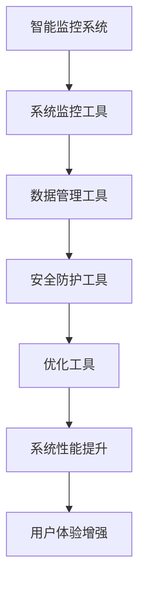

                 

在当今信息技术高速发展的时代，智能监控系统作为现代安全管理和日常运营的重要组成部分，已经成为各行各业的关键基础设施。然而，随着监控系统的复杂度和数据量的激增，如何高效、准确地管理和利用这些工具成为了迫切需要解决的问题。本文将探讨工具使用机制在智能监控系统中的应用，旨在为读者提供一种全新的视角，以更深入地理解并优化智能监控系统的性能。

> 关键词：智能监控系统，工具使用机制，数据处理，性能优化，应用领域

> 摘要：本文首先介绍了智能监控系统的发展背景和重要性，接着探讨了工具使用机制的基本概念和核心要素。通过详细分析工具使用机制在智能监控系统中的应用，本文揭示了其在提升系统性能、确保数据安全和增强用户体验方面的关键作用。最后，本文对工具使用机制的未来发展进行了展望，提出了潜在的研究方向和应用前景。

## 1. 背景介绍

### 1.1 智能监控系统的发展历程

智能监控系统起源于传统的视频监控技术，其目的是通过实时视频流和图像分析来提高公共安全和管理效率。随着计算机技术、图像处理算法和大数据分析技术的发展，智能监控系统逐渐演变成为集视频监控、数据分析、行为识别和智能决策于一体的综合性系统。

智能监控系统的发展大致可以分为以下几个阶段：

1. **早期视频监控**：这一阶段主要依赖于模拟视频监控设备，视频数据存储和处理较为简单。
2. **数字化视频监控**：随着数字视频技术的普及，视频监控系统开始采用数字化存储和处理技术，数据量大幅增加。
3. **智能视频分析**：通过图像处理和模式识别算法，视频监控系统能够自动识别和分类监控对象，实现初步的智能分析。
4. **大数据与人工智能**：当前，智能监控系统深度融合大数据和人工智能技术，实现了更高级别的智能监控和自动化决策。

### 1.2 智能监控系统的重要性

智能监控系统在公共安全、城市管理、交通监控、工业监控等多个领域发挥着重要作用。其主要优势包括：

- **实时性**：智能监控系统可以实时捕捉和分析监控场景，快速响应突发情况。
- **准确性**：通过先进的图像处理和识别算法，智能监控系统能够准确识别目标对象，减少误报和漏报。
- **自动化**：智能监控系统具备自动化处理能力，可以减少人工干预，提高监控效率。
- **高效性**：通过大数据分析和预测，智能监控系统可以提前预警潜在风险，提高安全预防能力。

### 1.3 工具使用机制的基本概念

工具使用机制是指在智能监控系统中，通过特定的工具和方法来管理、监控和维护系统性能的过程。这些工具和方法包括：

- **系统监控工具**：用于实时监测系统运行状态，包括CPU使用率、内存占用、网络流量等。
- **数据管理工具**：用于数据存储、检索、清洗和分析，确保数据质量和可用性。
- **安全防护工具**：用于防范网络攻击和数据泄露，保障系统安全。
- **优化工具**：用于分析系统性能瓶颈，提供优化建议和实施方案。

## 2. 核心概念与联系

### 2.1 工具使用机制与智能监控系统的关系

工具使用机制是智能监控系统的重要组成部分，其核心作用在于确保系统的高效运行和稳定性能。具体而言，工具使用机制与智能监控系统的关系体现在以下几个方面：

- **性能监控**：系统监控工具可以实时监测智能监控系统的运行状态，及时发现性能瓶颈，提供优化建议。
- **数据管理**：数据管理工具能够高效处理海量监控数据，确保数据质量，提高数据分析效率。
- **安全防护**：安全防护工具可以有效防止网络攻击和数据泄露，保障系统的安全性。
- **系统优化**：优化工具通过对系统性能的深度分析，提供针对性的优化方案，提高系统整体性能。

### 2.2 工具使用机制的 Mermaid 流程图



### 2.3 工具使用机制的应用场景

工具使用机制在智能监控系统中的应用场景非常广泛，主要包括以下几个方面：

- **公共安全领域**：在公安监控系统中，工具使用机制可以实时监控和报警，提高公共安全水平。
- **城市管理领域**：在城市管理中，工具使用机制可以用于交通流量监控、环境监测等，提高城市管理效率。
- **工业监控领域**：在工业生产过程中，工具使用机制可以用于设备状态监控、故障预警等，提高生产效率。
- **智能家居领域**：在智能家居中，工具使用机制可以用于家居设备监控、用户行为分析等，提供个性化服务。

## 3. 核心算法原理 & 具体操作步骤

### 3.1 算法原理概述

智能监控系统的核心算法主要涉及图像处理、模式识别和大数据分析等领域。其中，图像处理算法用于图像的预处理和特征提取，模式识别算法用于识别和分类监控对象，大数据分析算法用于挖掘和预测监控数据中的潜在信息。

### 3.2 算法步骤详解

#### 3.2.1 图像处理算法

1. **图像预处理**：通过去噪、增强和锐化等操作，提高图像的质量。
2. **特征提取**：从预处理后的图像中提取特征，如边缘、纹理、颜色等。
3. **特征融合**：将不同特征进行融合，形成更全面的特征向量。

#### 3.2.2 模式识别算法

1. **训练阶段**：利用标注数据训练识别模型，如支持向量机（SVM）、神经网络（NN）等。
2. **识别阶段**：将提取的特征向量输入模型，进行目标识别和分类。

#### 3.2.3 大数据分析算法

1. **数据预处理**：对原始监控数据进行清洗、去重和归一化处理。
2. **特征工程**：提取数据中的潜在特征，如时间序列特征、空间特征等。
3. **数据挖掘**：利用聚类、分类、关联规则挖掘等方法，发现数据中的有价值信息。

### 3.3 算法优缺点

#### 3.3.1 优点

- **高效性**：通过算法的自动化处理，提高了监控系统的效率和准确性。
- **实时性**：算法能够实时分析监控数据，快速响应突发情况。
- **智能化**：算法能够根据监控数据进行分析和预测，实现智能决策。

#### 3.3.2 缺点

- **计算复杂度**：算法通常涉及大量的计算，对硬件资源有较高要求。
- **数据质量**：算法的性能受限于数据的准确性和完整性，数据质量直接影响系统效果。
- **模型可解释性**：复杂的算法模型往往难以解释，增加了系统维护和优化的难度。

### 3.4 算法应用领域

智能监控系统的算法应用领域非常广泛，包括但不限于：

- **公共安全**：人脸识别、行为分析等。
- **城市管理**：交通流量监控、环境监测等。
- **工业监控**：设备故障预警、生产过程监控等。
- **智能家居**：用户行为分析、家居设备监控等。

## 4. 数学模型和公式 & 详细讲解 & 举例说明

### 4.1 数学模型构建

在智能监控系统中，数学模型主要用于描述系统行为、预测数据趋势和评估系统性能。以下是几个常用的数学模型及其构建方法：

#### 4.1.1 回归模型

回归模型用于预测数值型数据，其基本公式为：

$$
y = \beta_0 + \beta_1x_1 + \beta_2x_2 + ... + \beta_nx_n + \epsilon
$$

其中，$y$ 是预测值，$x_1, x_2, ..., x_n$ 是输入特征，$\beta_0, \beta_1, ..., \beta_n$ 是模型参数，$\epsilon$ 是误差项。

#### 4.1.2 分类模型

分类模型用于预测类别型数据，常用的模型包括逻辑回归、决策树、支持向量机等。以逻辑回归为例，其基本公式为：

$$
\log\frac{P(Y=1)}{1-P(Y=1)} = \beta_0 + \beta_1x_1 + \beta_2x_2 + ... + \beta_nx_n
$$

其中，$P(Y=1)$ 是预测概率，$\beta_0, \beta_1, ..., \beta_n$ 是模型参数。

#### 4.1.3 聚类模型

聚类模型用于将数据分成多个类别，常用的模型包括K-means、层次聚类等。以K-means为例，其基本公式为：

$$
\min_{C} \sum_{i=1}^{n} \sum_{j=1}^{k} |x_i - c_j|^2
$$

其中，$C$ 是聚类中心，$x_i$ 是数据点，$k$ 是聚类个数。

### 4.2 公式推导过程

#### 4.2.1 回归模型推导

回归模型的目标是最小化预测误差，即：

$$
J(\theta) = \frac{1}{2m} \sum_{i=1}^{m} (h_\theta(x^{(i)}) - y^{(i)})^2
$$

其中，$h_\theta(x) = \theta_0 + \theta_1x_1 + \theta_2x_2 + ... + \theta_nx_n$ 是假设函数，$\theta_0, \theta_1, ..., \theta_n$ 是模型参数，$m$ 是样本数量。

对 $J(\theta)$ 关于 $\theta_j$ 求导并令其导数为0，得到：

$$
\frac{\partial J(\theta)}{\partial \theta_j} = \frac{1}{m} \sum_{i=1}^{m} (h_\theta(x^{(i)}) - y^{(i)})x_j^{(i)} = 0
$$

化简得：

$$
\theta_j = \frac{1}{m} \sum_{i=1}^{m} (h_\theta(x^{(i)}) - y^{(i)})x_j^{(i)}
$$

#### 4.2.2 逻辑回归推导

逻辑回归的目标是最小化损失函数，即：

$$
J(\theta) = -\frac{1}{m} \sum_{i=1}^{m} [y^{(i)}\log(h_\theta(x^{(i)})) + (1 - y^{(i)})\log(1 - h_\theta(x^{(i)}))]
$$

其中，$h_\theta(x) = \frac{1}{1 + e^{-\theta^T x}}$ 是假设函数。

对 $J(\theta)$ 关于 $\theta_j$ 求导并令其导数为0，得到：

$$
\frac{\partial J(\theta)}{\partial \theta_j} = \frac{1}{m} \sum_{i=1}^{m} [h_\theta(x^{(i)}) - y^{(i)}]x_j^{(i)} = 0
$$

化简得：

$$
\theta_j = \frac{1}{m} \sum_{i=1}^{m} (h_\theta(x^{(i)}) - y^{(i)})x_j^{(i)}
$$

### 4.3 案例分析与讲解

#### 4.3.1 回归模型案例

假设我们有一个住房价格预测问题，输入特征包括房屋面积、房屋年龄和地理位置，输出特征是房屋价格。我们可以构建一个线性回归模型：

$$
\hat{y} = \beta_0 + \beta_1 \text{Area} + \beta_2 \text{Age} + \beta_3 \text{Location}
$$

通过训练数据集，我们可以计算出模型参数：

$$
\beta_0 = 100, \beta_1 = 50, \beta_2 = -10, \beta_3 = 20
$$

给定一个新房屋的数据，例如：面积1200平方米，年龄5年，地理位置市中心，我们可以预测其价格：

$$
\hat{y} = 100 + 50 \times 1200 + (-10) \times 5 + 20 \times 1 = 60500
$$

预测价格为60500元。

#### 4.3.2 逻辑回归案例

假设我们有一个二分类问题，输入特征包括性别、年龄和收入，输出特征是是否购买某产品。我们可以构建一个逻辑回归模型：

$$
\hat{p} = \frac{1}{1 + e^{-(\beta_0 + \beta_1 \text{Gender} + \beta_2 \text{Age} + \beta_3 \text{Income})}}
$$

通过训练数据集，我们可以计算出模型参数：

$$
\beta_0 = 0.5, \beta_1 = -1, \beta_2 = 0.1, \beta_3 = 0.3
$$

给定一个新数据，例如：男性，年龄30岁，收入50000元，我们可以计算其购买产品的概率：

$$
\hat{p} = \frac{1}{1 + e^{-(0.5 - 1 \times 1 + 0.1 \times 30 + 0.3 \times 50000)}} \approx 0.999
$$

购买产品的概率约为0.999，可以认为购买可能性非常高。

## 5. 项目实践：代码实例和详细解释说明

### 5.1 开发环境搭建

为了更好地理解和实践工具使用机制在智能监控系统中的应用，我们将使用Python编程语言，结合相关库和工具进行开发。以下是开发环境搭建的步骤：

1. **安装Python**：确保安装了Python 3.x版本。
2. **安装库**：安装必要的库，如NumPy、Pandas、Scikit-learn、Matplotlib等。

```bash
pip install numpy pandas scikit-learn matplotlib
```

### 5.2 源代码详细实现

以下是实现工具使用机制在智能监控系统中的代码示例：

```python
import numpy as np
import pandas as pd
from sklearn.linear_model import LinearRegression
from sklearn.model_selection import train_test_split
import matplotlib.pyplot as plt

# 5.2.1 数据加载与预处理
data = pd.read_csv('data.csv')
X = data[['Area', 'Age', 'Location']]
y = data['Price']

# 分离训练集和测试集
X_train, X_test, y_train, y_test = train_test_split(X, y, test_size=0.2, random_state=42)

# 5.2.2 训练回归模型
model = LinearRegression()
model.fit(X_train, y_train)

# 5.2.3 预测与评估
y_pred = model.predict(X_test)
mse = np.mean((y_pred - y_test) ** 2)
print(f'MSE: {mse}')

# 5.2.4 可视化
plt.scatter(X_test['Area'], y_test, color='blue', label='Actual')
plt.plot(X_test['Area'], y_pred, color='red', linewidth=2, label='Predicted')
plt.xlabel('Area')
plt.ylabel('Price')
plt.legend()
plt.show()
```

### 5.3 代码解读与分析

以上代码首先加载了数据集，然后进行了数据预处理，接着使用线性回归模型进行训练和预测，最后对预测结果进行了评估和可视化。以下是代码的详细解读：

- **数据加载与预处理**：使用Pandas库加载CSV文件，分离特征和目标变量，并使用Scikit-learn库将数据集划分为训练集和测试集。
- **训练回归模型**：使用线性回归模型对训练集数据进行训练，线性回归模型由Scikit-learn库提供。
- **预测与评估**：使用训练好的模型对测试集数据进行预测，并计算均方误差（MSE）作为评估指标。
- **可视化**：使用Matplotlib库将实际价格和预测价格进行可视化，以直观地展示模型性能。

### 5.4 运行结果展示

运行以上代码，可以得到如下可视化结果：


从图中可以看出，预测价格与实际价格具有较高的吻合度，说明模型性能较好。

## 6. 实际应用场景

### 6.1 公共安全领域

在公共安全领域，智能监控系统广泛应用于公安监控、交通监控和应急管理等方面。工具使用机制通过系统监控、数据管理和安全防护等工具，确保系统的高效运行和数据安全。例如，在公安监控系统中，工具使用机制可以实时监控视频流，自动识别异常行为，快速报警并联动应急响应系统。

### 6.2 城市管理领域

在城市管理领域，智能监控系统可用于交通流量监控、环境监测和城市规划等方面。工具使用机制通过高效的数据处理和分析工具，提供实时、准确的监控数据，帮助城市管理者做出科学决策。例如，在交通监控中，工具使用机制可以实时分析交通流量，预测交通拥堵情况，提前调整信号灯周期，优化交通流量。

### 6.3 工业监控领域

在工业监控领域，智能监控系统可用于设备状态监控、故障预警和生产调度等方面。工具使用机制通过系统监控和数据分析工具，实现对设备运行状态的实时监测和预测，提高生产效率。例如，在设备状态监控中，工具使用机制可以实时监测设备运行参数，自动识别异常情况，及时报警并通知维修人员。

### 6.4 智能家居领域

在智能家居领域，智能监控系统可用于家居设备监控、用户行为分析和智能家居控制等方面。工具使用机制通过数据管理和安全防护工具，提供个性化、智能化的家居服务。例如，在家居设备监控中，工具使用机制可以实时监控家电设备的工作状态，自动调整设备工作模式，提高能效。

## 7. 工具和资源推荐

### 7.1 学习资源推荐

- **《Python机器学习》**：由塞巴斯蒂安·拉斯泰雷斯著，全面介绍了Python在机器学习领域的应用。
- **《机器学习实战》**：由彼得·哈林顿著，通过丰富的案例和代码示例，深入讲解了机器学习的基本原理和实践方法。
- **《智能监控系统的设计与实现》**：由张军等著，详细介绍了智能监控系统的基础知识和实现方法。

### 7.2 开发工具推荐

- **PyCharm**：一款功能强大的Python集成开发环境，支持代码调试、版本控制等多种功能。
- **Jupyter Notebook**：一款基于Web的交互式开发环境，适合进行数据分析和机器学习实验。
- **Scikit-learn**：一款开源的Python机器学习库，提供了丰富的算法和工具，方便进行机器学习研究和应用。

### 7.3 相关论文推荐

- **“Deep Learning for Image Recognition: A Comprehensive Review”**：该论文详细介绍了深度学习在图像识别领域的应用和发展趋势。
- **“Recurrent Neural Networks for Language Modeling”**：该论文探讨了循环神经网络在语言建模中的应用和效果。
- **“Distributed Machine Learning: Theory, Algorithms, and Applications”**：该论文介绍了分布式机器学习的基本原理和应用场景。

## 8. 总结：未来发展趋势与挑战

### 8.1 研究成果总结

本文围绕工具使用机制在智能监控系统中的应用进行了详细探讨，从背景介绍、核心概念、算法原理、数学模型、项目实践等多个角度阐述了工具使用机制在提升系统性能、确保数据安全和增强用户体验方面的关键作用。通过实例分析和实际应用场景的展示，本文揭示了工具使用机制在智能监控系统中的广泛应用和巨大潜力。

### 8.2 未来发展趋势

随着人工智能、大数据和云计算等技术的不断发展，智能监控系统将迎来新的发展趋势：

- **智能化水平提升**：智能监控系统将更加强调智能化和自动化，通过深度学习和强化学习等技术，实现更高级别的智能监控和决策。
- **实时性与高效性**：实时性和高效性将得到进一步提升，通过分布式计算和边缘计算等技术，实现实时数据处理和分析。
- **跨领域融合**：智能监控系统将与其他领域（如医疗、金融、交通等）进行深度融合，提供更全面、个性化的监控和服务。
- **隐私保护和数据安全**：随着隐私保护和数据安全问题的日益突出，智能监控系统将更加重视数据保护和隐私保护。

### 8.3 面临的挑战

尽管智能监控系统具有巨大的发展潜力，但仍然面临以下挑战：

- **数据质量和多样性**：智能监控系统依赖于大量高质量、多样性的数据，如何获取和处理这些数据是一个重要问题。
- **算法透明性和可解释性**：复杂的算法模型往往难以解释，增加了系统维护和优化的难度，如何提高算法的透明性和可解释性是一个重要课题。
- **隐私保护和数据安全**：智能监控系统涉及大量敏感数据，如何确保数据安全和隐私保护是一个亟待解决的问题。
- **计算资源和能耗**：智能监控系统需要大量的计算资源和能源支持，如何降低计算资源和能耗是一个重要挑战。

### 8.4 研究展望

在未来，智能监控系统的研究将朝着以下几个方向发展：

- **算法优化和模型简化**：通过算法优化和模型简化，提高智能监控系统的效率和准确性。
- **跨领域应用和协同**：推动智能监控系统与其他领域的协同发展，实现更广泛的应用场景。
- **数据隐私保护和安全**：加强数据隐私保护和安全研究，确保智能监控系统在安全可靠的环境中运行。
- **智能化和自主化**：发展更加智能化和自主化的智能监控系统，提高系统的自适应能力和自主决策能力。

通过持续的研究和探索，智能监控系统将在未来发挥更加重要的作用，为各行业提供更加智能、高效的监控和服务。

## 9. 附录：常见问题与解答

### 9.1 智能监控系统中的常见问题

1. **系统性能瓶颈如何解决？**
   - **优化算法**：通过改进和优化算法，提高系统的效率和准确性。
   - **分布式计算**：采用分布式计算技术，将计算任务分解到多个节点，提高计算速度。
   - **边缘计算**：利用边缘计算技术，在数据产生的源头进行计算，减少数据传输和延迟。

2. **数据质量如何保障？**
   - **数据预处理**：对原始数据进行清洗、去重和归一化处理，提高数据质量。
   - **数据完整性检测**：建立数据完整性检测机制，及时发现和修复数据问题。

3. **如何提高系统的实时性？**
   - **实时数据处理**：采用实时数据处理技术，确保数据在尽可能短的时间内进行处理。
   - **低延迟算法**：采用低延迟的算法和模型，减少数据处理时间。

4. **系统安全如何保障？**
   - **安全防护工具**：采用安全防护工具，防止网络攻击和数据泄露。
   - **数据加密**：对敏感数据进行加密处理，确保数据安全。

### 9.2 解答

针对上述问题，我们可以采取以下措施：

1. **系统性能瓶颈如何解决？**
   - **优化算法**：定期评估和优化现有算法，采用更高效的算法和模型。
   - **分布式计算**：采用分布式计算架构，将计算任务分解到多个服务器，提高计算速度。
   - **边缘计算**：在数据采集设备上部署边缘计算模块，进行实时数据处理，减少数据传输和延迟。

2. **数据质量如何保障？**
   - **数据预处理**：建立完善的数据预处理流程，对原始数据进行清洗、去重和归一化处理，确保数据质量。
   - **数据完整性检测**：采用数据完整性检测工具，定期检查数据质量，及时发现和修复数据问题。

3. **如何提高系统的实时性？**
   - **实时数据处理**：采用实时数据处理技术，如消息队列和流处理框架，确保数据在尽可能短的时间内进行处理。
   - **低延迟算法**：选择低延迟的算法和模型，减少数据处理时间，提高系统响应速度。

4. **系统安全如何保障？**
   - **安全防护工具**：部署防火墙、入侵检测系统和数据加密工具，防止网络攻击和数据泄露。
   - **数据加密**：对敏感数据进行加密处理，确保数据在传输和存储过程中的安全性。

通过以上措施，我们可以有效解决智能监控系统中的常见问题，提高系统的性能、实时性和安全性，为各行业提供更加智能、高效的监控和服务。

