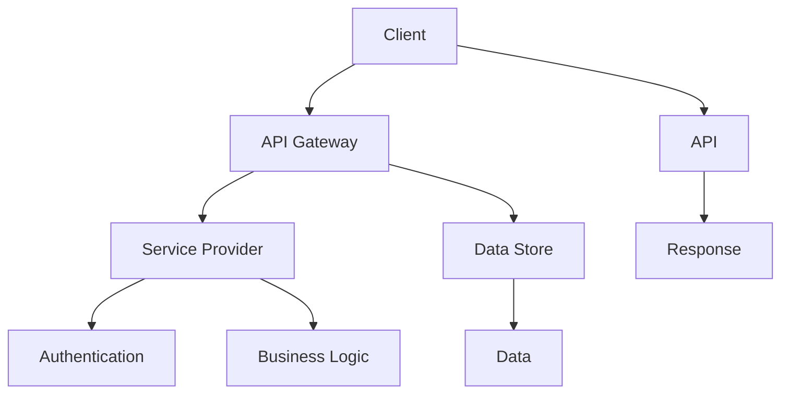

                 

关键词：API调用，外部数据源，数据整合，服务集成，RESTful API，异步处理，API安全，JSON格式，SDK，Web服务，集成开发环境（IDE）

> 摘要：本文旨在探讨如何在现代软件开发中有效利用外部API（应用程序编程接口）来获取额外信息，增强软件的功能和灵活性。我们将分析API调用的基本原理，探讨不同类型的API及其使用方法，介绍调用API的常用工具和技巧，并提供一些实际的编程示例，以帮助开发者更好地理解和应用API调用的技术。

## 1. 背景介绍

在当今的数字化时代，软件系统不再是一个孤立的实体，而是高度互联的网络化系统。这种互联性主要体现在软件之间通过API进行通信和数据交换。API作为系统之间沟通的桥梁，已经成为现代软件开发不可或缺的一部分。通过调用外部API，开发者能够扩展软件的功能，提高其灵活性和可扩展性，同时还能节省时间和资源。

API的定义较为宽泛，但通常指的是一组定义明确的接口，允许不同软件系统之间进行交互。这些接口可以是简单的HTTP请求，也可以是复杂的协议。API调用的核心目标是实现数据的传递和处理，这往往涉及到RESTful架构风格，JSON数据格式以及各种编程语言和工具。

本文将围绕以下主题展开：
- API调用基本原理
- RESTful API与SOAP API的区别
- 调用外部API的常用工具
- API调用中的异步处理与同步处理
- API安全与认证机制
- JSON格式解析与数据绑定
- 示例：使用Python调用外部API
- 项目实践：API集成与调用
- 实际应用场景与未来展望

## 2. 核心概念与联系

在深入探讨API调用之前，我们需要理解一些核心概念和它们之间的关系。以下是一个简化的Mermaid流程图，展示了API调用中的一些关键节点。



### 2.1. 客户端（Client）

客户端是指发起API调用的软件系统或应用。它可以是桌面应用、Web应用、移动应用或任何其他需要使用API的客户端。客户端通过发送HTTP请求来调用API，并接收API的响应。

### 2.2. API网关（API Gateway）

API网关是客户端与后端服务之间的中介，负责处理所有的外部请求。它提供了统一的接口，使得客户端无需关注后端服务的具体实现细节。API网关还负责路由请求、处理负载均衡、缓存数据、API版本管理等功能。

### 2.3. 服务提供者（Service Provider）

服务提供者是后端系统中负责处理具体业务逻辑的服务器或集群。它响应当前请求，执行所需操作，并将结果返回给API网关。

### 2.4. API

API是服务提供者对外提供服务的接口。它定义了请求的格式、参数和可能的响应。API可以是简单的RESTful接口，也可以是基于SOAP的复杂接口。

### 2.5. 数据存储（Data Store）

数据存储是服务提供者用于存储数据和状态的系统。它可以是关系型数据库、NoSQL数据库或任何其他类型的数据存储解决方案。

### 2.6. 认证（Authentication）

认证是确保只有授权用户才能访问API的过程。常见的认证机制包括基本认证、令牌认证（如OAuth 2.0）、证书认证等。

### 2.7. 业务逻辑（Business Logic）

业务逻辑是服务提供者中的核心部分，负责执行实际的业务处理逻辑。它是API调用的具体实现，决定了API的功能和行为。

### 2.8. 响应（Response）

响应是API调用完成后返回给客户端的数据。它通常以JSON、XML或其他格式表示，包含请求的结果、状态信息等。

### 2.9. 数据

数据是API调用过程中涉及的所有信息。它可以是请求参数、查询结果、状态码等。数据在API调用中扮演着至关重要的角色，因为它决定了API的交互和功能。

通过以上概念和流程图的介绍，我们可以更好地理解API调用的工作原理和各个部分之间的联系。在接下来的章节中，我们将深入探讨API调用的具体技术和实现细节。

## 3. 核心算法原理 & 具体操作步骤

### 3.1  算法原理概述

API调用的核心算法原理可以归结为以下几点：
1. **HTTP请求**：客户端通过发送HTTP请求来调用API。请求可以是GET、POST、PUT、DELETE等不同类型的HTTP方法。
2. **URL编码**：URL中的参数需要按照特定的编码规则（如UTF-8）进行编码，以确保数据能够在网络中正确传输。
3. **数据格式**：API通常使用JSON或XML作为数据交换的格式。JSON因其简洁性和易解析性，在现代API设计中更为常见。
4. **异步处理**：在处理高并发请求时，异步处理可以有效提高系统的响应速度和吞吐量。
5. **错误处理**：API调用可能会因网络问题、服务器错误或认证失败等原因失败。错误处理机制确保系统能够在异常情况下继续正常运行。

### 3.2  算法步骤详解

以下是调用外部API的基本步骤：

#### 步骤1：理解API文档

在调用外部API之前，开发者需要仔细阅读API文档，了解API的URL、请求方法、请求参数、响应格式和状态码等。API文档通常是开发者的第一手资料，帮助开发者理解如何使用API。

#### 步骤2：设置请求参数

根据API文档，设置请求的URL和参数。对于GET请求，参数通常作为URL的一部分传递；对于POST、PUT等请求，参数通常作为HTTP请求体（Body）传递。请求参数可以是简单的键值对，也可以是复杂的JSON对象。

#### 步骤3：发送HTTP请求

使用编程语言和库（如Python的requests库、JavaScript的Axios库等）发送HTTP请求。请求发送后，API服务器会根据请求方法、URL和参数处理请求，并返回HTTP响应。

#### 步骤4：解析响应

根据API文档中的说明，解析HTTP响应。对于JSON格式的响应，可以使用JSON解析库（如Python的json库、JavaScript的JSON对象）将其转换为JavaScript对象或Python字典。

#### 步骤5：处理响应数据

处理解析后的响应数据，执行所需的操作。这可能包括数据存储、更新UI、触发其他API调用等。

#### 步骤6：错误处理

在API调用过程中，可能会遇到各种错误，如网络错误、服务器错误、认证失败等。开发者需要编写错误处理代码，确保系统能够在异常情况下继续运行。

### 3.3  算法优缺点

#### 优点

1. **灵活性**：API调用允许开发者轻松地扩展软件功能，无需从头开始编写所有代码。
2. **可维护性**：通过使用外部API，开发者可以专注于核心业务逻辑，而不是重复实现通用功能。
3. **可扩展性**：API调用使得软件系统能够随着外部服务的更新而更新，提高系统的可扩展性。
4. **协作性**：多个团队可以通过API实现协同工作，促进软件开发的协作和效率。

#### 缺点

1. **依赖性**：调用外部API增加了系统的复杂性和依赖性，可能导致系统稳定性下降。
2. **安全性**：API调用可能引入安全漏洞，如未授权访问、数据泄露等。
3. **性能影响**：外部API的响应时间和稳定性可能影响整体系统的性能。
4. **不可控性**：外部API的变化可能会影响软件系统的功能，增加了维护难度。

### 3.4  算法应用领域

API调用广泛应用于各种领域，如：

1. **Web应用**：使用外部API提供用户数据、地图服务、天气预报等。
2. **移动应用**：通过API调用提供即时消息、社交网络分享、支付处理等功能。
3. **IoT应用**：使用API与物联网设备进行通信，实现远程监控和控制。
4. **数据分析**：调用外部API获取数据源，进行数据分析和挖掘。

## 4. 数学模型和公式 & 详细讲解 & 举例说明

### 4.1  数学模型构建

在API调用中，数学模型主要用于处理数据的传递和转换。以下是一个简单的数学模型，用于描述API请求和响应的关系。

设：
- \( R \) 为API请求，
- \( S \) 为API响应，
- \( P \) 为请求参数，
- \( D \) 为响应数据。

则有：
\[ R = (P, Method) \]
\[ S = (Status, D) \]

其中，\( Method \) 可以是GET、POST、PUT、DELETE等HTTP方法，\( Status \) 为HTTP状态码，通常为200（成功）、400（错误请求）、500（服务器错误）等。

### 4.2  公式推导过程

根据HTTP协议，API请求和响应的关系可以表示为：

\[ S = f(R) \]

其中，\( f \) 为API服务器处理请求的函数。

假设请求 \( R \) 包含以下参数：

\[ P = \{ key1: value1, key2: value2, ..., keyn: valuen \} \]

响应 \( S \) 包含以下数据：

\[ D = \{ field1: data1, field2: data2, ..., fieldm: datam \} \]

则，\( S \) 可以表示为：

\[ S = (Status, \{ field1: f(field1), field2: f(field2), ..., fieldm: f(fieldm) \}) \]

其中，\( f \) 为API服务器对参数 \( P \) 进行处理并生成响应数据的函数。

### 4.3  案例分析与讲解

以下是一个简单的API调用案例：

#### 案例描述

一个用户通过Web应用发送一个GET请求，请求从API服务器获取最新的天气信息。请求参数包括城市名称和天气类型。

#### API请求

URL：`https://api.weather.com/v1/weather/current`

请求方法：GET

请求参数：
```json
{
  "q": "Shanghai",
  "type": "json",
  "units": "metric",
  "lang": "zh"
}
```

#### API响应

响应状态码：200（成功）

响应数据：
```json
{
  "status": "ok",
  "current": {
    "temp": 20,
    "weather": {
      "code": "1006",
      "description": "多云"
    }
  }
}
```

在这个案例中，API服务器根据请求参数获取了上海最新的天气信息，并将结果以JSON格式返回给客户端。

### 4.4  结果展示

假设我们使用Python的requests库进行API调用，以下是代码示例：

```python
import requests

url = 'https://api.weather.com/v1/weather/current'
params = {
    'q': 'Shanghai',
    'type': 'json',
    'units': 'metric',
    'lang': 'zh'
}

response = requests.get(url, params=params)
weather_data = response.json()

print(weather_data['current']['temp'])
print(weather_data['current']['weather']['description'])
```

运行结果：
```
20
多云
```

以上示例展示了如何使用Python进行API调用，并从响应中提取数据。在实际开发中，可以根据具体需求对API调用进行更复杂的处理。

## 5. 项目实践：代码实例和详细解释说明

在本节中，我们将通过一个具体的Python项目来实践调用外部API。我们将使用流行的天气查询API，以获取特定城市的实时天气信息。

### 5.1 开发环境搭建

首先，确保你的Python开发环境已经搭建好。以下是所需的软件和库：

- Python 3.x
- requests库（用于HTTP请求）
- 一个代码编辑器（如Visual Studio Code）

安装requests库：

```bash
pip install requests
```

### 5.2 源代码详细实现

以下是一个简单的Python脚本，用于调用外部天气API并显示结果：

```python
import requests
import json

def get_weather(city_name):
    # API的URL和参数
    url = "http://api.weatherapi.com/v1/current.json"
    api_key = "你的API密钥"  # 替换为你的API密钥
    params = {
        "key": api_key,
        "q": city_name,
        "lang": "zh",
    }
    
    # 发送GET请求
    response = requests.get(url, params=params)
    
    # 检查响应状态码
    if response.status_code == 200:
        # 解析JSON响应
        data = response.json()
        # 提取天气信息
        temp = data["current"]["temp_c"]
        weather_condition = data["current"]["condition"]["text"]
        print(f"{city_name}的当前气温：{temp}℃，天气：{weather_condition}")
    else:
        print("API调用失败，请检查参数和API密钥。")

if __name__ == "__main__":
    city_name = input("请输入城市名称：")
    get_weather(city_name)
```

### 5.3 代码解读与分析

- **导入库**：首先，我们导入`requests`和`json`库，这两个库分别用于HTTP请求和JSON数据解析。

- **定义函数**：`get_weather`函数接收一个城市名称作为参数，用于查询该城市的天气信息。

- **设置API URL和参数**：我们定义了API的URL和参数，其中`api_key`是访问API的密钥，必须替换为你的实际API密钥。

- **发送HTTP请求**：使用`requests.get`函数发送GET请求，`params`参数包含了请求所需的URL参数。

- **检查响应状态码**：我们检查API返回的状态码，如果状态码为200（成功），则继续处理响应数据。

- **解析JSON响应**：使用`response.json()`将HTTP响应解析为JSON格式的数据。

- **提取天气信息**：从JSON数据中提取当前气温和天气状况，并打印出来。

- **主程序**：在`if __name__ == "__main__":`语句块中，我们获取用户输入的城市名称，并调用`get_weather`函数。

### 5.4 运行结果展示

运行脚本后，用户会被提示输入城市名称。例如，输入“北京”：

```
请输入城市名称：北京
北京的当前气温：18℃，天气：多云
```

这样，我们就成功地调用外部API获取了北京当前的天气信息，并显示在了屏幕上。

通过这个简单的项目，我们展示了如何调用外部API，并处理响应数据。在实际应用中，可以进一步扩展这个脚本，如添加错误处理、缓存机制等。

## 6. 实际应用场景

### 6.1 在线天气查询系统

一个典型的实际应用场景是构建一个在线天气查询系统。用户可以通过输入城市名称来查询该城市的实时天气信息。以下是一个示例架构：


**技术栈**：

- **前端**：HTML/CSS/JavaScript，用于构建用户界面。
- **后端**：Python/Django或Node.js/Express，用于处理用户请求和API调用。
- **数据库**：MySQL或PostgreSQL，用于存储用户数据和缓存。
- **外部API**：如Weather API，提供实时天气数据。

### 6.2 社交媒体分析平台

另一个应用场景是构建一个社交媒体分析平台，用于监控特定关键词或用户在社交媒体上的活动。以下是一个示例架构：


**技术栈**：

- **前端**：React或Vue.js，用于构建交互式用户界面。
- **后端**：Java/Spring Boot或Python/Flask，用于处理API调用和数据处理。
- **数据库**：MongoDB，用于存储社交媒体数据。
- **外部API**：如Twitter API或Facebook API，提供社交媒体数据。

### 6.3 移动应用

移动应用也是API调用的重要应用场景。以下是一个移动应用的示例架构：


**技术栈**：

- **前端**：原生应用（如iOS的Swift或Android的Kotlin）。
- **后端**：Node.js或Django，用于处理API调用和数据存储。
- **数据库**：MySQL或MongoDB，用于存储用户数据和缓存。
- **外部API**：如地图API、支付API，提供位置服务和支付功能。

### 6.4 未来应用展望

随着API技术的不断发展，我们可以预见更多的应用场景和可能性：

- **物联网（IoT）**：通过API与物联网设备进行通信，实现智能家居、智能城市等。
- **人工智能（AI）**：利用API调用提供AI服务，如自然语言处理、图像识别等。
- **区块链**：通过API调用实现区块链数据查询和交易。

未来的软件开发将更加依赖于API，它们将成为构建现代应用的核心组成部分。开发者需要不断学习和掌握API调用的最新技术和最佳实践，以适应快速变化的技术环境。

## 7. 工具和资源推荐

### 7.1 学习资源推荐

1. **《RESTful Web API设计》（Designing RESTful Web APIs）** - 这本书详细介绍了如何设计和实现RESTful API，是学习API设计的重要参考。
2. **MDN Web Docs（Mozilla Developer Network）** - 提供了大量的API文档和教程，适用于各种编程语言和框架。
3. **API Craft** - 一本关于API开发的实用指南，涵盖API设计、部署和监控等各个方面。

### 7.2 开发工具推荐

1. **Postman** - 一个流行的API调试和测试工具，支持HTTP请求的构建、发送和响应查看。
2. **Swagger** - 一个用于API设计和文档的工具，可以生成漂亮的API文档，方便开发者理解和使用。
3. **JMeter** - 一个开源的性能测试工具，可以模拟高并发的API请求，用于性能测试和优化。

### 7.3 相关论文推荐

1. **"Representational State Transfer (REST)"** - Roy Fielding的经典论文，详细介绍了REST架构风格。
2. **"RESTful Web Services"** - Thomas F. Fritsch和Dana J.ayer的论文，对RESTful Web服务进行了深入探讨。
3. **"Securing RESTful APIs"** - Priya Rajpal和R. Sekar的论文，讨论了如何保护RESTful API免受安全威胁。

通过这些工具和资源，开发者可以更好地理解和应用API调用的技术，提高开发效率和软件质量。

## 8. 总结：未来发展趋势与挑战

### 8.1 研究成果总结

本文通过对API调用的深入探讨，总结了API调用在软件开发中的重要性。我们介绍了API调用的基本原理、不同类型的API、常用工具和技巧，并通过实际项目示例展示了API调用的应用。我们还分析了API调用的优缺点，并探讨了其在各种实际应用场景中的可能性。

### 8.2 未来发展趋势

随着云计算、物联网和人工智能等技术的快速发展，API调用在未来的软件开发中将扮演更加重要的角色。以下是一些未来发展趋势：

1. **服务网格（Service Mesh）**：服务网格技术如Istio和Linkerd将提供更高效、更安全的API调用管理。
2. **无服务器架构（Serverless）**：无服务器架构将使API调用更加灵活，开发者无需关注底层基础设施。
3. **API自动化**：自动化测试和部署工具将提高API开发的效率和质量。
4. **API安全**：随着API调用日益普及，API安全将得到更多关注，新的安全标准和工具将不断涌现。

### 8.3 面临的挑战

尽管API调用在软件开发中具有巨大的潜力，但也面临一些挑战：

1. **依赖性增加**：过度依赖外部API可能导致系统复杂性和维护成本上升。
2. **性能瓶颈**：高并发的API请求可能对系统性能造成压力，需要优化API调用策略。
3. **安全性问题**：API安全漏洞可能导致数据泄露和未授权访问，需要加强API安全措施。
4. **标准化**：缺乏统一的API标准和规范，可能影响API的互操作性和兼容性。

### 8.4 研究展望

未来的研究应重点关注以下几个方面：

1. **API调用优化**：研究如何提高API调用的效率和性能。
2. **API安全性**：开发新的安全机制和工具，保护API免受攻击。
3. **API设计最佳实践**：制定和推广API设计最佳实践，提高API的可维护性和易用性。
4. **跨平台API集成**：研究如何在不同平台和框架之间实现无缝的API集成。

通过不断探索和解决这些挑战，我们可以更好地利用API调用的潜力，推动软件开发的进步。

## 9. 附录：常见问题与解答

### 9.1 什么是API？

API（应用程序编程接口）是一套定义、协议及相关工具，用于实现软件应用程序之间的交互。它允许不同的软件系统通过特定的接口进行通信，交换数据和命令。

### 9.2 API调用有哪些类型？

API调用主要分为两类：同步调用和异步调用。同步调用是指客户端发起请求后，必须等待响应返回才能继续执行后续操作；异步调用则允许客户端在发送请求后继续执行其他任务，而无需等待响应。

### 9.3 如何保证API调用安全？

确保API调用安全的方法包括：

- 使用HTTPS协议加密数据传输。
- 对API请求进行身份验证和授权，如OAuth 2.0。
- 对API接口进行访问控制，限制可访问的IP地址或用户角色。
- 定期更新API密钥和密码，防止泄露。
- 对API请求进行验证和校验，防止恶意攻击。

### 9.4 JSON格式如何解析？

JSON（JavaScript Object Notation）是一种轻量级的数据交换格式。解析JSON的方法取决于编程语言。以下是一些常见编程语言的解析示例：

- **Python**：
  ```python
  import json

  json_data = '{"name": "Alice", "age": 30}'
  data = json.loads(json_data)
  print(data['name'])  # 输出：Alice
  ```

- **JavaScript**：
  ```javascript
  const jsonData = '{"name": "Alice", "age": 30}';
  const data = JSON.parse(jsonData);
  console.log(data.name);  // 输出：Alice
  ```

- **Java**：
  ```java
  import org.json.JSONObject;

  String jsonData = "{\"name\": \"Alice\", \"age\": 30}";
  JSONObject data = new JSONObject(jsonData);
  System.out.println(data.getString("name"));  // 输出：Alice
  ```

以上问题解答旨在帮助开发者更好地理解和应用API调用技术，提高软件开发的质量和效率。希望对您的开发工作有所帮助。

### 9.5 如何处理API调用中的异常情况？

在API调用过程中，可能会遇到各种异常情况，如网络错误、服务器错误、认证失败等。处理这些异常情况的关键在于确保系统在遇到错误时能够优雅地处理，并保持稳定性。

以下是一些常见的异常处理方法：

- **全局异常处理**：使用全局异常处理（如Python的`try-except`块）捕获和处理API调用中的异常。例如：
  ```python
  try:
      response = requests.get(url, params=params)
      response.raise_for_status()  # 检查响应状态码
      data = response.json()
  except requests.exceptions.HTTPError as errh:
      print("Http Error:", errh)
  except requests.exceptions.ConnectionError as errc:
      print("Error Connecting:", errc)
  except requests.exceptions.Timeout as errt:
      print("Timeout Error:", errt)
  except requests.exceptions.RequestException as err:
      print("OOps: Something Else", err)
  ```

- **自定义异常处理**：对于特定的API调用，可以编写自定义的异常处理逻辑。例如，在处理天气API调用时，可以检查返回的状态码，并根据不同的状态码执行不同的操作：
  ```python
  try:
      response = requests.get(url, params=params)
      response.raise_for_status()
      data = response.json()
      
      if data['status'] == 'ok':
          # 处理成功的情况
      else:
          # 处理失败的情况
  except requests.exceptions.RequestException as e:
      print("API调用失败，原因：", e)
  ```

- **日志记录**：在异常处理过程中，记录详细的日志信息有助于分析和解决问题。可以使用Python的`logging`模块记录日志：
  ```python
  import logging

  logging.basicConfig(filename='api_calls.log', level=logging.DEBUG)

  try:
      # API调用代码
  except Exception as e:
      logging.error("API调用异常：", exc_info=True)
  ```

通过上述方法，可以确保API调用在遇到异常时能够优雅地处理，并保持系统的稳定性。在实际开发中，应根据具体需求选择合适的异常处理方法。

