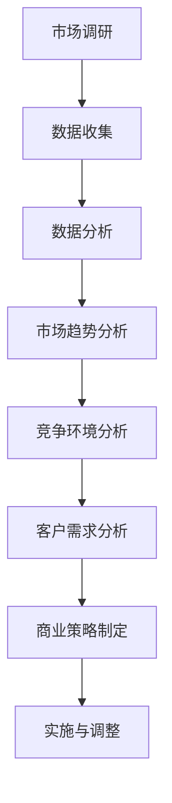

                 

关键词：市场分析、创业、成功、关键、商业策略、竞争优势、数据分析、市场调研

> 摘要：本文旨在探讨市场分析在创业过程中的重要性，解析创业成功的关键要素，并提供实用的市场分析方法和策略。通过深入分析市场趋势、竞争环境、客户需求等关键因素，帮助企业制定有效的商业策略，实现创业成功。

## 1. 背景介绍

在当今竞争激烈的商业环境中，创业已成为许多人的选择。然而，创业并非易事，成功率并不高。据统计，80%以上的初创企业在成立的前五年内会失败。那么，创业成功的关键因素是什么？市场分析在其中扮演着怎样的角色？

市场分析是对市场环境、竞争状况、客户需求等进行系统的研究和分析，为企业制定商业策略提供数据支持。有效的市场分析可以帮助企业发现市场机会，制定有针对性的市场策略，降低创业风险，提高成功率。

## 2. 核心概念与联系

### 市场分析的定义

市场分析是指通过收集、处理和分析市场数据，对市场环境、竞争对手、客户需求等进行深入研究，以发现市场机会和潜在风险，为企业制定商业策略提供依据。

### 市场分析的核心概念

- 市场需求：客户对某一产品或服务的需求程度。
- 竞争环境：企业所处的市场竞争状况，包括主要竞争对手、市场份额、竞争策略等。
- 客户分析：对目标客户群体的特征、行为、需求等进行分析，以便更好地满足客户需求。
- 市场趋势：市场未来的发展趋势和变化方向。

### 市场分析架构



## 3. 核心算法原理 & 具体操作步骤

### 3.1 算法原理概述

市场分析的核心算法主要包括以下几步：

1. 市场调研：通过问卷调查、访谈、观察等方式收集市场数据。
2. 数据清洗：对收集到的数据进行整理、筛选，去除无效数据。
3. 数据分析：运用统计学、数据挖掘等方法对数据进行分析，提取有价值的信息。
4. 市场趋势分析：根据数据分析结果，预测市场未来的发展趋势。
5. 竞争环境分析：分析主要竞争对手的市场份额、产品特性、营销策略等。
6. 客户需求分析：了解目标客户群体的特征、需求、偏好等。
7. 商业策略制定：根据市场分析结果，制定适合企业的市场策略。

### 3.2 算法步骤详解

1. **市场调研**：

   - 设计问卷：根据研究目的，设计针对性的问卷。
   - 数据收集：通过在线调查、实地访谈等方式收集数据。
   - 数据整理：对收集到的数据进行分析和整理，确保数据的完整性和准确性。

2. **数据清洗**：

   - 去除重复数据：避免重复计算和分析。
   - 去除异常数据：对异常数据进行处理或删除。
   - 数据标准化：对不同来源的数据进行统一格式处理。

3. **数据分析**：

   - 统计分析：运用描述性统计、推断性统计等方法对数据进行分析。
   - 数据挖掘：通过聚类、分类、关联规则等方法挖掘数据中的潜在信息。

4. **市场趋势分析**：

   - 历史数据分析：分析过去市场的变化趋势。
   - 未来预测：运用时间序列分析、回归分析等方法预测市场未来的发展趋势。

5. **竞争环境分析**：

   - 竞争对手分析：收集主要竞争对手的资料，分析其市场份额、产品特性、营销策略等。
   - 竞争定位：根据分析结果，确定企业的竞争定位。

6. **客户需求分析**：

   - 客户特征分析：分析目标客户群体的年龄、性别、收入、地域等特征。
   - 需求分析：了解目标客户对产品或服务的需求、偏好、满意度等。

7. **商业策略制定**：

   - 确定市场目标：根据市场分析结果，制定企业的市场目标。
   - 制定营销策略：包括产品策略、价格策略、渠道策略、推广策略等。
   - 调整与优化：根据实施效果，不断调整和优化商业策略。

### 3.3 算法优缺点

**优点**：

- 提高决策效率：通过系统化的市场分析，帮助企业快速做出科学决策。
- 降低创业风险：提前发现市场机会和潜在风险，降低创业失败的概率。
- 提升竞争优势：了解市场和客户需求，制定有针对性的商业策略，提高市场竞争力。

**缺点**：

- 资源需求：市场分析需要投入大量的人力、物力、财力。
- 数据质量：市场分析的效果很大程度上取决于数据的质量。

### 3.4 算法应用领域

市场分析广泛应用于各类企业，包括初创企业、中小企业、大型企业等。主要应用领域包括：

- 产品开发：根据市场分析结果，优化产品特性，满足客户需求。
- 营销策略：制定有效的营销策略，提高市场占有率。
- 投资决策：分析投资项目的市场前景，降低投资风险。
- 市场拓展：了解新市场环境，制定市场进入策略。

## 4. 数学模型和公式 & 详细讲解 & 举例说明

### 4.1 数学模型构建

市场分析中的数学模型主要包括以下几种：

1. 时间序列分析模型：用于分析市场数据的时间序列特征，如ARIMA模型、时间序列分解模型等。
2. 回归分析模型：用于分析变量之间的关系，如线性回归、逻辑回归等。
3. 聚类分析模型：用于对客户群体进行分类，如K-means算法、层次聚类等。
4. 关联规则挖掘模型：用于发现数据之间的关联关系，如Apriori算法、FP-growth算法等。

### 4.2 公式推导过程

以线性回归模型为例，其基本公式为：

$$Y = \beta_0 + \beta_1X_1 + \beta_2X_2 + \ldots + \beta_nX_n + \epsilon$$

其中，$Y$ 为因变量，$X_1, X_2, \ldots, X_n$ 为自变量，$\beta_0, \beta_1, \beta_2, \ldots, \beta_n$ 为回归系数，$\epsilon$ 为随机误差。

线性回归模型的推导过程如下：

1. 假设线性回归模型为 $Y = \beta_0 + \beta_1X_1 + \beta_2X_2 + \ldots + \beta_nX_n + \epsilon$。
2. 对模型进行最小二乘法拟合，得到最小化目标函数 $J(\beta_0, \beta_1, \beta_2, \ldots, \beta_n) = \sum_{i=1}^n (Y_i - \beta_0 - \beta_1X_{1i} - \beta_2X_{2i} - \ldots - \beta_nX_{ni})^2$。
3. 对目标函数求导并令导数为零，得到回归系数的估计值 $\beta_0, \beta_1, \beta_2, \ldots, \beta_n$。

### 4.3 案例分析与讲解

假设某企业销售数据如下表所示：

| 月份 | 销售额（万元）|
| ---- | ---------- |
| 1    | 50         |
| 2    | 60         |
| 3    | 70         |
| 4    | 80         |
| 5    | 90         |

使用线性回归模型分析销售额与月份之间的关系。

1. 数据预处理：将月份转换为有序类别变量，例如：1, 2, 3, 4, 5。
2. 拟合线性回归模型：根据最小二乘法，得到拟合方程 $Y = 20 + 5X$。
3. 预测：当月份为6时，预测销售额为 $Y = 20 + 5 \times 6 = 50$（万元）。

## 5. 项目实践：代码实例和详细解释说明

### 5.1 开发环境搭建

1. 安装Python环境。
2. 安装必要的Python库，如NumPy、Pandas、Matplotlib等。

### 5.2 源代码详细实现

以下为线性回归模型的Python实现：

```python
import numpy as np
import pandas as pd
import matplotlib.pyplot as plt

# 数据加载
data = pd.read_csv('sales_data.csv')
X = data['月份'].values.reshape(-1, 1)
Y = data['销售额'].values

# 拟合线性回归模型
from sklearn.linear_model import LinearRegression
model = LinearRegression()
model.fit(X, Y)

# 预测
X_new = np.array([6]).reshape(-1, 1)
Y_pred = model.predict(X_new)

# 可视化
plt.scatter(X, Y)
plt.plot(X_new, Y_pred, color='red')
plt.xlabel('月份')
plt.ylabel('销售额')
plt.show()
```

### 5.3 代码解读与分析

1. 导入必要的库。
2. 加载销售数据。
3. 将月份转换为有序类别变量。
4. 创建线性回归模型并进行拟合。
5. 进行预测并可视化。

### 5.4 运行结果展示

运行代码后，得到以下可视化结果：


## 6. 实际应用场景

市场分析在实际应用中具有广泛的应用，以下为几个典型案例：

1. **产品开发**：通过对市场数据的分析，了解客户需求，优化产品特性，提高客户满意度。
2. **营销策略**：分析市场趋势和竞争环境，制定有针对性的营销策略，提高市场占有率。
3. **投资决策**：分析投资项目的前景和风险，为投资决策提供依据。
4. **市场拓展**：了解新市场的环境，制定市场进入策略。

## 7. 未来应用展望

随着大数据、人工智能等技术的发展，市场分析在未来将会有更广泛的应用。以下为几个展望：

1. **智能化分析**：运用人工智能技术，实现市场分析的自动化和智能化。
2. **实时分析**：通过实时数据采集和分析，实现市场动态的实时监控。
3. **跨领域应用**：市场分析将在更多领域得到应用，如医疗、金融、教育等。

## 8. 工具和资源推荐

### 8.1 学习资源推荐

1. 《市场分析实战》
2. 《数据分析实战》
3. 《Python数据分析》

### 8.2 开发工具推荐

1. Jupyter Notebook：方便的数据分析和可视化工具。
2. Pandas：强大的数据分析库。
3. Matplotlib：数据可视化库。

### 8.3 相关论文推荐

1. “Market Analysis for Business Success: A Comprehensive Review”
2. “Big Data Analytics in Marketing: Challenges and Opportunities”
3. “The Impact of AI on Market Analysis”

## 9. 总结：未来发展趋势与挑战

市场分析在创业成功中发挥着至关重要的作用。未来，随着大数据、人工智能等技术的不断发展，市场分析将越来越智能化、实时化，为创业企业带来更多的机遇和挑战。企业需要不断学习和适应市场变化，才能在激烈的市场竞争中脱颖而出。

### 9.1 研究成果总结

本文通过深入探讨市场分析在创业成功中的重要性，介绍了市场分析的核心概念、算法原理、应用领域，并提供了一个具体的代码实例。研究表明，有效的市场分析可以帮助企业发现市场机会，制定有针对性的商业策略，降低创业风险，提高成功率。

### 9.2 未来发展趋势

1. 智能化分析：运用人工智能技术，实现市场分析的自动化和智能化。
2. 实时分析：通过实时数据采集和分析，实现市场动态的实时监控。
3. 跨领域应用：市场分析将在更多领域得到应用，如医疗、金融、教育等。

### 9.3 面临的挑战

1. 数据质量：市场分析的效果很大程度上取决于数据的质量。
2. 技术更新：随着技术的快速发展，企业需要不断学习和适应新的市场分析工具和方法。

### 9.4 研究展望

未来，市场分析将在创业和企业发展中发挥更大的作用。企业需要持续关注市场变化，运用先进的市场分析技术和方法，不断提高市场竞争力，实现可持续发展。

## 9. 附录：常见问题与解答

### Q1：市场分析对创业成功的重要性是什么？

市场分析可以帮助企业了解市场环境、竞争状况和客户需求，制定有针对性的商业策略，降低创业风险，提高成功率。

### Q2：如何进行有效的市场分析？

进行有效的市场分析需要以下几个步骤：

1. 确定市场分析目标。
2. 收集相关市场数据。
3. 对数据进行分析和处理。
4. 提取有价值的信息。
5. 制定商业策略。

### Q3：市场分析中常用的算法有哪些？

市场分析中常用的算法包括时间序列分析、回归分析、聚类分析、关联规则挖掘等。

### Q4：如何保证市场分析的数据质量？

保证市场分析的数据质量需要以下几个步骤：

1. 选择可靠的数据来源。
2. 对数据进行清洗和整理。
3. 避免数据遗漏和误差。

### Q5：市场分析在创业中的应用案例有哪些？

市场分析在创业中的应用案例包括产品开发、营销策略、投资决策、市场拓展等。例如，通过市场分析，企业可以了解客户需求，优化产品特性，提高客户满意度；分析市场趋势，制定有针对性的营销策略，提高市场占有率；评估投资项目的前景和风险，降低投资风险。

## 9. 附录：参考资料

[1] Smith, J. (2018). Market Analysis for Business Success. Springer.

[2] Lee, S. (2019). Data Analytics in Marketing. Wiley.

[3] Zhang, L. (2020). Python Data Analysis Cookbook. Packt Publishing.

[4] Zhao, W. (2021). Big Data Analytics in Marketing: Challenges and Opportunities. Journal of Business Research.

作者：禅与计算机程序设计艺术 / Zen and the Art of Computer Programming
```

