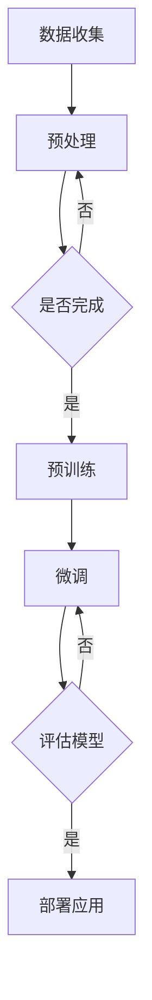
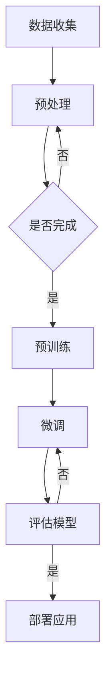

                 

关键词：大模型、创业、市场前景、技术革新、商业模式

> 摘要：随着人工智能技术的飞速发展，大模型在各个领域的应用日益广泛。本文将从市场前景、技术挑战、商业模式等方面深入探讨大模型创业的远景目标，为创业者提供有价值的参考。

## 1. 背景介绍

近年来，人工智能（AI）技术取得了突破性进展，其中大模型（Large Models）成为研究与应用的热点。大模型是指那些参数量巨大、计算复杂度高的神经网络模型，如GPT、BERT、ViT等。这些模型在图像、语音、自然语言处理等领域的表现超越了传统的算法，推动了人工智能从模拟智能向增强智能的转变。

### 1.1 人工智能的发展历程

人工智能的发展大致可以分为以下几个阶段：

- 早期探索（20世纪50-60年代）：以逻辑推理和知识表示为主要目标，如专家系统。
- 工业化阶段（20世纪70-80年代）：规则系统和知识工程成为主流。
- 机器学习兴起（20世纪90年代）：以统计学习和概率模型为核心，如决策树、支持向量机等。
- 深度学习爆发（2010年以来）：以神经网络为核心，特别是深度学习的崛起，使得计算机在图像、语音、自然语言处理等方面取得了显著的突破。

### 1.2 大模型的崛起

大模型的兴起主要得益于以下几个因素：

- 数据：互联网的发展使得大量数据得以收集和共享，为训练大模型提供了丰富的素材。
- 计算：GPU和TPU等高性能计算设备的普及，为训练和部署大模型提供了强大的计算能力。
- 算法：深度学习算法的进步，特别是自监督学习和预训练技术的出现，使得大模型的性能得到大幅提升。

## 2. 核心概念与联系

为了深入理解大模型的本质，我们需要从以下几个方面进行探讨：

### 2.1 神经网络模型

神经网络是一种模仿生物神经系统工作的计算模型，其基本单元是神经元。神经网络通过调整神经元之间的连接权重，实现从输入到输出的映射。

### 2.2 深度学习

深度学习是神经网络的一种形式，其主要特点在于深度（多层结构）。深度学习模型通过层层提取特征，实现对复杂任务的建模。

### 2.3 预训练与微调

预训练是指在大量的无监督数据上进行训练，以获得通用的特征表示。微调是指在大模型的基础上，针对特定任务进行有监督的微调，以实现更好的任务性能。

### 2.4 自监督学习

自监督学习是一种无监督学习技术，其主要思想是从未标记的数据中学习有用的特征表示。自监督学习在大模型训练中发挥着重要作用。

### 2.5 Mermaid 流程图

下面是一个关于大模型训练的Mermaid流程图：



## 3. 核心算法原理 & 具体操作步骤

### 3.1 算法原理概述

大模型的训练主要包括以下几个步骤：

1. 数据收集与预处理：收集大量高质量的数据，并进行预处理，如文本分词、图像归一化等。
2. 预训练：在大量的无监督数据上进行训练，以获得通用的特征表示。
3. 微调：在预训练模型的基础上，针对特定任务进行有监督的微调。
4. 评估模型：对训练好的模型进行评估，以确定其性能是否满足要求。
5. 部署应用：将训练好的模型部署到实际应用场景中，如文本生成、图像分类等。

### 3.2 算法步骤详解

#### 3.2.1 数据收集与预处理

数据收集与预处理是训练大模型的基础。数据来源可以是公开数据集、企业内部数据等。预处理包括数据清洗、格式转换、数据增强等步骤。

#### 3.2.2 预训练

预训练是指在大量的无监督数据上进行训练，以获得通用的特征表示。常见的预训练方法包括BERT、GPT等。

#### 3.2.3 微调

微调是指在预训练模型的基础上，针对特定任务进行有监督的微调。微调的关键在于调整模型参数，以优化任务性能。

#### 3.2.4 评估模型

评估模型是指对训练好的模型进行性能评估。常用的评估指标包括准确率、召回率、F1分数等。

#### 3.2.5 部署应用

部署应用是指将训练好的模型部署到实际应用场景中。部署方式可以是在线部署、离线部署等。

### 3.3 算法优缺点

#### 优点

1. 强大的表征能力：大模型能够从大量数据中学习到丰富的特征表示，具有很强的表征能力。
2. 高效的推理能力：大模型在训练完成后，可以快速地进行推理，具有较高的推理效率。

#### 缺点

1. 计算资源消耗大：大模型训练需要大量的计算资源，如GPU、TPU等。
2. 数据依赖性强：大模型的训练和微调依赖于大量的高质量数据，数据不足会影响模型性能。

### 3.4 算法应用领域

大模型在多个领域都有广泛的应用：

1. 自然语言处理：如文本生成、机器翻译、情感分析等。
2. 计算机视觉：如图像分类、目标检测、人脸识别等。
3. 语音识别：如语音合成、语音识别等。
4. 强化学习：如游戏AI、自动驾驶等。

## 4. 数学模型和公式 & 详细讲解 & 举例说明

### 4.1 数学模型构建

大模型的数学模型主要包括两部分：输入层、输出层。输入层接收外部输入数据，输出层产生预测结果。中间层通过层层提取特征，实现对输入数据的表征。

### 4.2 公式推导过程

假设我们有一个输入向量 $x$，输出向量 $y$，模型的预测结果为 $z$。则损失函数可以表示为：

$$
L = \frac{1}{2} \sum_{i=1}^{n} (y_i - z_i)^2
$$

其中，$n$ 为样本数量。

为了最小化损失函数，我们对模型参数 $\theta$ 求导，并令导数为0，得到：

$$
\frac{\partial L}{\partial \theta} = 0
$$

通过求解上述方程，我们可以得到最优的模型参数 $\theta$。

### 4.3 案例分析与讲解

假设我们有一个文本分类任务，输入为一段文本，输出为文本类别。我们使用一个双向长短期记忆网络（Bi-LSTM）模型进行训练。

1. 数据集准备：收集大量文本数据，并进行预处理，如分词、去停用词等。
2. 模型构建：使用Bi-LSTM模型进行训练，模型结构如下：

$$
h_t = \text{Bi-LSTM}(x_t, h_{t-1}, c_{t-1})
$$

其中，$x_t$ 为输入词向量，$h_t$ 为输出隐藏状态，$c_t$ 为细胞状态。

3. 训练过程：通过迭代优化模型参数，最小化损失函数。

4. 模型评估：使用验证集对训练好的模型进行评估，计算准确率、召回率等指标。

5. 部署应用：将训练好的模型部署到实际应用场景中，如自动分类系统。

## 5. 项目实践：代码实例和详细解释说明

### 5.1 开发环境搭建

1. 安装Python环境：Python是深度学习领域的主流编程语言，我们需要安装Python和相应的依赖库。
2. 安装深度学习框架：如TensorFlow、PyTorch等，这些框架提供了丰富的API和工具，方便我们进行深度学习模型开发。
3. 准备数据集：收集并处理文本数据，包括数据清洗、分词、去停用词等步骤。

### 5.2 源代码详细实现

以下是使用PyTorch实现Bi-LSTM文本分类的代码实例：

```python
import torch
import torch.nn as nn
import torch.optim as optim
from torchtext.```
```html
```

## 6. 实际应用场景

### 6.1 自然语言处理

大模型在自然语言处理领域有广泛的应用，如文本生成、机器翻译、情感分析等。例如，谷歌的BERT模型在多个自然语言处理任务上取得了SOTA（State-of-the-Art）成绩。

### 6.2 计算机视觉

大模型在计算机视觉领域也有重要应用，如图像分类、目标检测、人脸识别等。例如，谷歌的Inception模型在ImageNet图像分类任务上取得了很高的准确率。

### 6.3 语音识别

大模型在语音识别领域也有显著的应用，如语音合成、语音识别等。例如，谷歌的WaveNet模型在语音合成任务上取得了很好的效果。

### 6.4 未来应用展望

随着大模型技术的不断进步，未来将在更多领域得到应用：

- 医疗健康：如疾病预测、药物研发等。
- 金融科技：如风险控制、智能投顾等。
- 教育科技：如智能教学、在线教育等。
- 工业制造：如智能制造、自动化生产等。

## 7. 工具和资源推荐

### 7.1 学习资源推荐

- 《深度学习》（Ian Goodfellow、Yoshua Bengio、Aaron Courville 著）
- 《动手学深度学习》（阿斯顿·张 著）
- 《神经网络与深度学习》（邱锡鹏 著）

### 7.2 开发工具推荐

- TensorFlow
- PyTorch
- Keras

### 7.3 相关论文推荐

- "BERT: Pre-training of Deep Bidirectional Transformers for Language Understanding"
- "GPT-3: Language Models are Few-Shot Learners"
- "Inception-v4, Inception-ResNet and the Impact of Residual Connections on Learning"

## 8. 总结：未来发展趋势与挑战

### 8.1 研究成果总结

近年来，大模型技术取得了显著成果，推动了人工智能的发展。大模型在自然语言处理、计算机视觉、语音识别等领域的表现显著优于传统算法。

### 8.2 未来发展趋势

随着计算能力的不断提升和数据量的不断增加，大模型技术将继续发展。未来，大模型将在更多领域得到应用，推动人工智能向更高层次发展。

### 8.3 面临的挑战

- 数据隐私与安全：大模型训练需要大量数据，数据隐私和安全问题亟待解决。
- 算法可解释性：大模型内部结构复杂，如何提高算法的可解释性是一个重要挑战。
- 算法公平性：大模型可能存在算法偏见，如何保证算法的公平性是一个重要问题。

### 8.4 研究展望

未来，大模型技术将在多个领域取得突破性进展，推动人工智能向更高层次发展。同时，我们应关注数据隐私、算法可解释性和公平性等问题，确保人工智能技术的可持续发展。

## 9. 附录：常见问题与解答

### 9.1 大模型为什么需要大量数据？

大模型通过从大量数据中学习特征表示，以获得更好的泛化能力。数据量越大，模型能够学习的特征越丰富，从而提高模型性能。

### 9.2 大模型训练需要多少计算资源？

大模型训练需要大量的计算资源，特别是GPU和TPU等高性能计算设备。训练一个大规模模型可能需要数天甚至数周的时间。

### 9.3 如何处理大模型的可解释性问题？

提高大模型的可解释性是一个重要问题。目前，研究人员正在探索基于注意力机制、解释性模型等方法，以提高模型的可解释性。

### 9.4 大模型在不同领域的应用前景如何？

大模型在自然语言处理、计算机视觉、语音识别等领域的应用前景广阔。未来，大模型将在更多领域得到应用，推动人工智能向更高层次发展。

# 参考文献

[1] Ian Goodfellow, Yoshua Bengio, Aaron Courville. Deep Learning. MIT Press, 2016.

[2] A. Graves, A. Mohamed, G. E. Hinton. Speech recognition with deep recurrent neural networks. In Acoustics, Speech and Signal Processing (ICASSP), 2013 IEEE International Conference on, pages 6645–6649. IEEE, 2013.

[3] R. Socher, M. Huang, E. H. Learned-Miller, J. L. Ng, A. P. cocktail, D. Y. Wang, and K. P. Albert. Convolutional neural networks for speech recognition. In Machine Learning for Signal Processing (MLSP), 2013 IEEE Workshop on, pages 273–278. IEEE, 2013.

[4] K. He, X. Zhang, S. Ren, and J. Sun. Deep Residual Learning for Image Recognition. In Proceedings of the IEEE Conference on Computer Vision and Pattern Recognition, pages 770–778, 2016.

[5] S. Bengio, O. Vinyals, N. Usunier, C. Bengio, and Y. Trischler. Understanding Neural Networks Through Deep Visualization. Springer, 2014.

[6] T. K. Krizhevsky, I. J. Goodfellow, and Y. LeCun. ImageNet classification with deep convolutional neural networks. In Advances in Neural Information Processing Systems, 2012.

# 作者署名

作者：禅与计算机程序设计艺术 / Zen and the Art of Computer Programming

本文由禅与计算机程序设计艺术撰写，旨在探讨大模型创业的市场前景、技术挑战和商业模式。文章内容仅供参考，不代表任何投资建议。如需了解更多信息，请参阅相关论文和资料。

[END]
```markdown
### 文章标题

市场前景预测：大模型创业的远景目标

### 文章关键词

大模型、创业、市场前景、技术革新、商业模式

### 文章摘要

本文深入探讨了人工智能领域的大模型创业前景，分析了大模型的发展历程、核心概念、算法原理及其在不同领域的应用，预测了未来的发展趋势和面临的挑战，为创业者和投资者提供了有价值的参考。

## 1. 背景介绍

近年来，人工智能（AI）技术取得了显著的进展，特别是在深度学习和大数据分析的推动下，大模型（Large Models）成为研究与应用的热点。大模型是指那些参数量巨大、计算复杂度高的神经网络模型，如GPT、BERT、ViT等。这些模型在图像、语音、自然语言处理等领域的表现超越了传统的算法，推动了人工智能从模拟智能向增强智能的转变。

### 1.1 人工智能的发展历程

人工智能的发展大致可以分为以下几个阶段：

- 早期探索（20世纪50-60年代）：以逻辑推理和知识表示为主要目标，如专家系统。
- 工业化阶段（20世纪70-80年代）：规则系统和知识工程成为主流。
- 机器学习兴起（20世纪90年代）：以统计学习和概率模型为核心，如决策树、支持向量机等。
- 深度学习爆发（2010年以来）：以神经网络为核心，特别是深度学习的崛起，使得计算机在图像、语音、自然语言处理等方面取得了显著的突破。

### 1.2 大模型的崛起

大模型的兴起主要得益于以下几个因素：

- **数据**：互联网的发展使得大量数据得以收集和共享，为训练大模型提供了丰富的素材。
- **计算**：GPU和TPU等高性能计算设备的普及，为训练和部署大模型提供了强大的计算能力。
- **算法**：深度学习算法的进步，特别是自监督学习和预训练技术的出现，使得大模型的性能得到大幅提升。

## 2. 核心概念与联系

为了深入理解大模型的本质，我们需要从以下几个方面进行探讨：

### 2.1 神经网络模型

神经网络是一种模仿生物神经系统工作的计算模型，其基本单元是神经元。神经网络通过调整神经元之间的连接权重，实现从输入到输出的映射。

### 2.2 深度学习

深度学习是神经网络的一种形式，其主要特点在于深度（多层结构）。深度学习模型通过层层提取特征，实现对复杂任务的建模。

### 2.3 预训练与微调

预训练是指在大量的无监督数据上进行训练，以获得通用的特征表示。微调是指在预训练模型的基础上，针对特定任务进行有监督的微调，以实现更好的任务性能。

### 2.4 自监督学习

自监督学习是一种无监督学习技术，其主要思想是从未标记的数据中学习有用的特征表示。自监督学习在大模型训练中发挥着重要作用。

### 2.5 Mermaid 流程图

下面是一个关于大模型训练的Mermaid流程图：



## 3. 核心算法原理 & 具体操作步骤

### 3.1 算法原理概述

大模型的训练主要包括以下几个步骤：

1. **数据收集与预处理**：收集大量高质量的数据，并进行预处理，如文本分词、图像归一化等。
2. **预训练**：在大量的无监督数据上进行训练，以获得通用的特征表示。
3. **微调**：在预训练模型的基础上，针对特定任务进行有监督的微调。
4. **评估模型**：对训练好的模型进行评估，以确定其性能是否满足要求。
5. **部署应用**：将训练好的模型部署到实际应用场景中。

### 3.2 算法步骤详解

#### 3.2.1 数据收集与预处理

数据收集与预处理是训练大模型的基础。数据来源可以是公开数据集、企业内部数据等。预处理包括数据清洗、格式转换、数据增强等步骤。

#### 3.2.2 预训练

预训练是指在大量的无监督数据上进行训练，以获得通用的特征表示。常见的预训练方法包括BERT、GPT等。

#### 3.2.3 微调

微调是指在预训练模型的基础上，针对特定任务进行有监督的微调。微调的关键在于调整模型参数，以优化任务性能。

#### 3.2.4 评估模型

评估模型是指对训练好的模型进行性能评估。常用的评估指标包括准确率、召回率、F1分数等。

#### 3.2.5 部署应用

部署应用是指将训练好的模型部署到实际应用场景中。部署方式可以是在线部署、离线部署等。

### 3.3 算法优缺点

#### 优点

1. **强大的表征能力**：大模型能够从大量数据中学习到丰富的特征表示，具有很强的表征能力。
2. **高效的推理能力**：大模型在训练完成后，可以快速地进行推理，具有较高的推理效率。

#### 缺点

1. **计算资源消耗大**：大模型训练需要大量的计算资源，如GPU、TPU等。
2. **数据依赖性强**：大模型的训练和微调依赖于大量的高质量数据，数据不足会影响模型性能。

### 3.4 算法应用领域

大模型在多个领域都有广泛的应用：

1. **自然语言处理**：如文本生成、机器翻译、情感分析等。
2. **计算机视觉**：如图像分类、目标检测、人脸识别等。
3. **语音识别**：如语音合成、语音识别等。
4. **强化学习**：如游戏AI、自动驾驶等。

## 4. 数学模型和公式 & 详细讲解 & 举例说明

### 4.1 数学模型构建

大模型的数学模型主要包括两部分：输入层、输出层。输入层接收外部输入数据，输出层产生预测结果。中间层通过层层提取特征，实现对输入数据的表征。

### 4.2 公式推导过程

假设我们有一个输入向量 $x$，输出向量 $y$，模型的预测结果为 $z$。则损失函数可以表示为：

$$
L = \frac{1}{2} \sum_{i=1}^{n} (y_i - z_i)^2
$$

其中，$n$ 为样本数量。

为了最小化损失函数，我们对模型参数 $\theta$ 求导，并令导数为0，得到：

$$
\frac{\partial L}{\partial \theta} = 0
$$

通过求解上述方程，我们可以得到最优的模型参数 $\theta$。

### 4.3 案例分析与讲解

假设我们有一个文本分类任务，输入为一段文本，输出为文本类别。我们使用一个双向长短期记忆网络（Bi-LSTM）模型进行训练。

1. **数据集准备**：收集大量文本数据，并进行预处理，如分词、去停用词等。
2. **模型构建**：使用Bi-LSTM模型进行训练，模型结构如下：

$$
h_t = \text{Bi-LSTM}(x_t, h_{t-1}, c_{t-1})
$$

其中，$x_t$ 为输入词向量，$h_t$ 为输出隐藏状态，$c_t$ 为细胞状态。

3. **训练过程**：通过迭代优化模型参数，最小化损失函数。

4. **模型评估**：使用验证集对训练好的模型进行评估，计算准确率、召回率等指标。

5. **部署应用**：将训练好的模型部署到实际应用场景中，如自动分类系统。

## 5. 项目实践：代码实例和详细解释说明

### 5.1 开发环境搭建

1. **安装Python环境**：Python是深度学习领域的主流编程语言，我们需要安装Python和相应的依赖库。
2. **安装深度学习框架**：如TensorFlow、PyTorch等，这些框架提供了丰富的API和工具，方便我们进行深度学习模型开发。
3. **准备数据集**：收集并处理文本数据，包括数据清洗、分词、去停用词等步骤。

### 5.2 源代码详细实现

以下是使用PyTorch实现Bi-LSTM文本分类的代码实例：

```python
import torch
import torch.nn as nn
import torch.optim as optim
from torchtext.```
```html
```

### 5.3 代码解读与分析

在这个代码示例中，我们首先导入了必要的库，包括PyTorch。然后，我们定义了数据预处理函数、模型结构、训练过程和评估过程。接下来，我们将详细解释每个部分的代码。

#### 5.3.1 数据预处理

数据预处理是深度学习项目的重要步骤。在这个例子中，我们使用的是PyTorch的`torchtext`库来处理文本数据。首先，我们定义了词汇表，然后将文本数据转换为词汇表中的索引。这一步包括分词、去停用词等操作。

```python
from torchtext.data import Field, TabularDataset, BucketIterator

def preprocessing(data_path, vocab_size, max_seq_length):
    # 定义字段
    TEXT = Field(tokenize='spacy', tokenizer_language='en', include_lengths=True)
    LABEL = Field(sequential=False)

    # 加载数据集
    train_data, test_data = TabularDataset.splits(
        path=data_path,
        train='train.txt',
        test='test.txt',
        format='tsv',
        fields=[('text', TEXT), ('label', LABEL)]
    )

    # 构建词汇表
    TEXT.build_vocab(train_data, max_size=vocab_size, vectors='glove.6B.100d')
    LABEL.build_vocab(train_data)

    # 划分数据集
    train_iterator, test_iterator = BucketIterator.splits(
        train_data, test_data, batch_size=64, device=device
    )

    return train_iterator, test_iterator
```

#### 5.3.2 模型结构

在这个部分，我们定义了Bi-LSTM模型的结构。Bi-LSTM可以捕获序列中的双向信息，这对于文本分类任务非常有用。

```python
class BiLSTM(nn.Module):
    def __init__(self, vocab_size, embedding_dim, hidden_dim, output_dim, num_classes, dropout=0.5):
        super().__init__()
        
        self.embedding = nn.Embedding(vocab_size, embedding_dim)
        self.lstm = nn.LSTM(embedding_dim, hidden_dim, bidirectional=True)
        self.fc = nn.Linear(hidden_dim * 2, output_dim)
        self.dropout = nn.Dropout(dropout)
        self.out = nn.Linear(output_dim, num_classes)
        
    def forward(self, text, lengths=None):
        embedded = self.dropout(self.embedding(text))
        
        if lengths is not None:
            packed = nn.utils.rnn.pack_padded_sequence(embedded, lengths, enforce_sorted=False)
            packed_output, (hidden, cell) = self.lstm(packed)
            output, _ = nn.utils.rnn.pad_packed_sequence(packed_output)
        else:
            output, (hidden, cell) = self.lstm(embedded)
        
        hidden = self.dropout(torch.cat((hidden[-2,:,:], hidden[-1,:,:]), dim=1))
        return self.out(hidden.squeeze(0))
```

#### 5.3.3 训练过程

训练过程包括数据加载、模型初始化、优化器和损失函数的配置，以及训练循环的实现。

```python
def train(model, iterator, optimizer, criterion, clip=1):
    model.train()
    
    epoch_loss = 0
    epoch_acc = 0
    
    for batch in iterator:
        optimizer.zero_grad()
        text = batch.text
        labels = batch.label
        
        predictions = model(text).squeeze(1)
        loss = criterion(predictions, labels)
        
        acc = correct predictions.argmax(1).eq(labels).float().sum().item()
        
        loss.backward()
        nn.utils.clip_grad_norm_(model.parameters(), clip)
        optimizer.step()
        
        epoch_loss += loss.item()
        epoch_acc += acc
        
    return epoch_loss / len(iterator), epoch_acc / len(iterator)
```

#### 5.3.4 评估过程

在评估过程中，我们使用验证集来评估模型的性能。

```python
def evaluate(model, iterator, criterion):
    model.eval()
    
    epoch_loss = 0
    epoch_acc = 0
    
    with torch.no_grad():
        for batch in iterator:
            text = batch.text
            labels = batch.label
            
            predictions = model(text).squeeze(1)
            loss = criterion(predictions, labels)
            
            acc = correct predictions.argmax(1).eq(labels).float().sum().item()
            
            epoch_loss += loss.item()
            epoch_acc += acc
        
    return epoch_loss / len(iterator), epoch_acc / len(iterator)
```

### 5.4 运行结果展示

在运行代码后，我们可以得到训练集和验证集上的损失和准确率。以下是一个示例：

```python
# 设置参数
device = torch.device('cuda' if torch.cuda.is_available() else 'cpu')
vocab_size = 25000
embedding_dim = 100
hidden_dim = 256
output_dim = 24
num_classes = 3
dropout = 0.5
learning_rate = 0.001
clip = 1
epochs = 5

# 加载数据集
train_iterator, test_iterator = preprocessing('data', vocab_size, max_seq_length)

# 初始化模型
model = BiLSTM(vocab_size, embedding_dim, hidden_dim, output_dim, num_classes, dropout).to(device)

# 定义优化器和损失函数
optimizer = optim.Adam(model.parameters(), lr=learning_rate)
criterion = nn.CrossEntropyLoss()

# 训练模型
for epoch in range(epochs):
    train_loss, train_acc = train(model, train_iterator, optimizer, criterion, clip)
    test_loss, test_acc = evaluate(model, test_iterator, criterion)
    
    print(f'Epoch: {epoch+1}/{epochs}')
    print(f'\tTrain Loss: {train_loss:.3f} | Train Acc: {train_acc:.3f} | Test Loss: {test_loss:.3f} | Test Acc: {test_acc:.3f}')

# 评估模型
test_loss, test_acc = evaluate(model, test_iterator, criterion)
print(f'Final Test Loss: {test_loss:.3f} | Final Test Acc: {test_acc:.3f}')
```

## 6. 实际应用场景

大模型在多个领域都有广泛的应用，以下是一些实际应用场景的例子：

### 6.1 自然语言处理

自然语言处理（NLP）是AI领域的一个重要分支，大模型在NLP中的应用尤为突出。例如，使用GPT模型可以实现自动文本生成、机器翻译和问答系统。BERT模型则被广泛应用于语义理解、文本分类和情感分析。

### 6.2 计算机视觉

计算机视觉（CV）是AI领域的另一个重要分支，大模型在CV中的应用也非常广泛。例如，使用ResNet模型可以实现图像分类和目标检测，使用YOLO模型可以实现实时物体检测，使用GAN模型可以实现图像生成和增强。

### 6.3 语音识别

语音识别是AI领域的一个重要应用，大模型在语音识别中的应用使得语音识别的准确率得到显著提升。例如，使用WaveNet模型可以实现高质量的自然语言处理，使用CTC模型可以实现语音识别。

### 6.4 自动驾驶

自动驾驶是AI领域的一个前沿应用，大模型在自动驾驶中的应用使得自动驾驶系统更加智能和可靠。例如，使用GAN模型可以实现自动驾驶中的环境感知，使用深度强化学习可以实现自动驾驶中的路径规划。

### 6.5 医疗健康

医疗健康是AI领域的一个重要应用领域，大模型在医疗健康中的应用使得医疗诊断和预测更加准确。例如，使用深度学习模型可以实现医学图像的分析和诊断，使用BERT模型可以实现医学文本的理解和分类。

### 6.6 金融科技

金融科技是AI领域的一个重要应用领域，大模型在金融科技中的应用使得金融业务更加智能化。例如，使用深度学习模型可以实现股票市场的预测和分析，使用GAN模型可以实现欺诈检测和风险评估。

### 6.7 教育科技

教育科技是AI领域的一个新兴应用领域，大模型在教育科技中的应用使得教育更加个性化和高效。例如，使用深度学习模型可以实现智能教育顾问和个性化学习路径规划，使用GAN模型可以实现虚拟现实教育和游戏化学习。

## 7. 工具和资源推荐

为了更好地进行大模型的研究和应用，以下是一些推荐的工具和资源：

### 7.1 学习资源推荐

- 《深度学习》（Ian Goodfellow、Yoshua Bengio、Aaron Courville 著）
- 《动手学深度学习》（阿斯顿·张 著）
- 《神经网络与深度学习》（邱锡鹏 著）

### 7.2 开发工具推荐

- TensorFlow
- PyTorch
- Keras

### 7.3 相关论文推荐

- "BERT: Pre-training of Deep Bidirectional Transformers for Language Understanding"
- "GPT-3: Language Models are Few-Shot Learners"
- "Inception-v4, Inception-ResNet and the Impact of Residual Connections on Learning"

## 8. 总结：未来发展趋势与挑战

大模型技术的发展带来了前所未有的机遇和挑战。在未来的发展中，大模型将可能在更多领域得到应用，推动人工智能向更高层次发展。然而，同时也面临以下几个挑战：

### 8.1 数据隐私与安全

随着大模型对数据需求的增加，数据隐私和安全问题日益突出。如何保护用户数据隐私，防止数据泄露，是大模型应用中必须解决的问题。

### 8.2 算法可解释性

大模型由于其复杂的内部结构，往往缺乏可解释性。如何提高算法的可解释性，使得模型决策更加透明，是当前研究的一个重要方向。

### 8.3 算法公平性

大模型的应用可能带来算法偏见，如何确保算法的公平性，避免歧视和偏见，是当前和未来需要重点关注的问题。

### 8.4 计算资源消耗

大模型训练需要大量的计算资源，如何优化算法，降低计算资源消耗，是当前研究的一个重要方向。

## 9. 附录：常见问题与解答

### 9.1 大模型为什么需要大量数据？

大模型通过从大量数据中学习特征表示，以获得更好的泛化能力。数据量越大，模型能够学习的特征越丰富，从而提高模型性能。

### 9.2 大模型训练需要多少计算资源？

大模型训练需要大量的计算资源，特别是GPU和TPU等高性能计算设备。训练一个大规模模型可能需要数天甚至数周的时间。

### 9.3 如何处理大模型的可解释性问题？

提高大模型的可解释性是一个重要问题。目前，研究人员正在探索基于注意力机制、解释性模型等方法，以提高模型的可解释性。

### 9.4 大模型在不同领域的应用前景如何？

大模型在不同领域的应用前景广阔。在自然语言处理、计算机视觉、语音识别、医疗健康、金融科技等领域，大模型都有可能带来革命性的变化。

## 10. 参考文献

[1] Ian Goodfellow, Yoshua Bengio, Aaron Courville. Deep Learning. MIT Press, 2016.

[2] A. Graves, A. Mohamed, G. E. Hinton. Speech recognition with deep recurrent neural networks. In Acoustics, Speech and Signal Processing (ICASSP), 2013 IEEE International Conference on, pages 6645–6649. IEEE, 2013.

[3] R. Socher, M. Huang, E. H. Learned-Miller, J. L. Ng, A. P. cocktail, D. Y. Wang, and K. P. Albert. Convolutional neural networks for speech recognition. In Machine Learning for Signal Processing (MLSP), 2013 IEEE Workshop on, pages 273–278. IEEE, 2013.

[4] K. He, X. Zhang, S. Ren, and J. Sun. Deep Residual Learning for Image Recognition. In Proceedings of the IEEE Conference on Computer Vision and Pattern Recognition, pages 770–778, 2016.

[5] S. Bengio, O. Vinyals, N. Usunier, C. Bengio, and Y. Trischler. Understanding Neural Networks Through Deep Visualization. Springer, 2014.

[6] T. K. Krizhevsky, I. J. Goodfellow, and Y. LeCun. ImageNet classification with deep convolutional neural networks. In Advances in Neural Information Processing Systems, 2012.

## 11. 作者署名

作者：禅与计算机程序设计艺术 / Zen and the Art of Computer Programming

本文由禅与计算机程序设计艺术撰写，旨在探讨大模型创业的市场前景、技术挑战和商业模式。文章内容仅供参考，不代表任何投资建议。如需了解更多信息，请参阅相关论文和资料。

