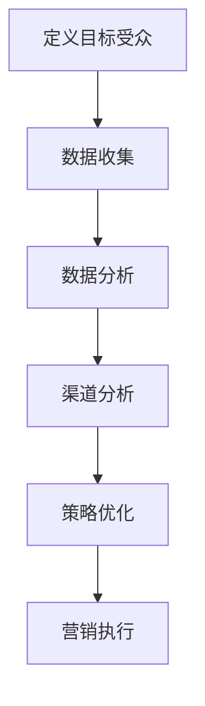

                 

关键词：市场推广、营销渠道、目标受众、策略、数据分析、技术实现、案例研究、工具推荐、未来趋势。

> 摘要：本文旨在探讨市场推广渠道的选择与优化，以及如何通过数据分析和技术手段，高效触达目标受众。文章将结合实际案例，分析不同推广渠道的优缺点，提供实用的工具和资源推荐，并对未来市场推广的发展趋势进行展望。

## 1. 背景介绍

在数字化时代，市场推广变得日益复杂和多样化。传统的一对多营销模式已经难以满足现代企业的需求。随着互联网技术的发展，企业可以通过多种渠道与目标受众进行互动，包括社交媒体、搜索引擎、电子邮件、内容营销等。然而，选择合适的推广渠道，并确保能够高效触达目标受众，成为了企业面临的重要挑战。

市场推广不仅仅是广告投放，更是一种深度的用户互动过程。为了实现有效的市场推广，企业需要了解目标受众的需求和偏好，通过数据分析制定精准的营销策略。此外，技术手段的应用也为市场推广提供了新的可能性和效率。

本文将围绕以下几个核心问题展开讨论：

1. 如何定义和识别目标受众？
2. 不同市场推广渠道的优缺点是什么？
3. 如何通过数据分析和技术手段优化市场推广策略？
4. 市场推广的未来发展趋势是什么？

通过本文的探讨，希望为企业提供一套系统的市场推广渠道选择和优化策略。

## 2. 核心概念与联系

### 2.1 营销渠道定义

营销渠道（Marketing Channels）是指产品或服务从生产者传递到消费者的路径。这些渠道可以是直接或间接的，包括零售商、分销商、代理商、在线平台等。理解营销渠道的概念，有助于我们更好地分析不同推广渠道的适用性和效果。

### 2.2 数据分析在营销中的作用

数据分析（Data Analysis）是现代市场推广的重要组成部分。通过数据分析，企业可以了解用户行为、市场趋势、竞争对手等信息，从而制定更精准的营销策略。数据分析工具和技术，如数据挖掘、机器学习、大数据分析等，为企业提供了强大的数据支持。

### 2.3 营销渠道与数据分析的关联

营销渠道与数据分析之间存在密切的关联。通过数据分析，企业可以识别出哪些渠道对目标受众最为有效，从而优化推广策略。同时，数据分析还可以帮助企业在不同渠道上进行资源的合理配置，提高营销效率。

### 2.4 Mermaid 流程图

为了更好地理解营销渠道与数据分析的关系，我们可以通过 Mermaid 流程图来展示其关联过程。



### 2.5 营销渠道选择流程

以下是一个简化的营销渠道选择流程：

1. 定义目标受众：明确目标受众的特征、需求和偏好。
2. 数据收集：通过各种渠道收集用户数据，包括社交媒体、网站分析工具等。
3. 数据分析：对收集到的数据进行处理和分析，识别潜在的目标受众。
4. 渠道分析：评估不同推广渠道的优缺点，选择最适合的渠道。
5. 策略优化：根据数据分析结果，制定和优化营销策略。
6. 营销执行：实施营销策略，并进行效果监控和调整。

## 3. 核心算法原理 & 具体操作步骤

### 3.1 算法原理概述

市场推广渠道优化的核心算法通常基于以下几个原理：

1. **用户行为分析**：通过分析用户在各个推广渠道上的行为数据，了解用户的偏好和互动模式。
2. **成本效益分析**：评估不同推广渠道的成本和收益，选择性价比最高的渠道。
3. **A/B 测试**：通过对比不同推广策略的效果，优化营销方案。

### 3.2 算法步骤详解

1. **数据收集与预处理**：
   - 从各种渠道（如社交媒体、搜索引擎、电子邮件等）收集用户行为数据。
   - 对数据进行清洗、去重和格式化，确保数据的质量和一致性。

2. **用户行为分析**：
   - 利用机器学习算法（如聚类分析、关联规则挖掘等），对用户行为数据进行分析。
   - 识别出不同用户群体的特征和行为模式。

3. **成本效益分析**：
   - 计算各个推广渠道的成本（如广告费用、人力成本等）和收益（如转化率、销售额等）。
   - 通过成本效益比（C/E Ratio）评估不同渠道的性价比。

4. **A/B 测试**：
   - 设计并实施不同的营销策略，对目标受众进行分组测试。
   - 根据测试结果，选择最优的营销策略。

### 3.3 算法优缺点

**优点**：
- **精准性**：通过用户行为分析和成本效益分析，可以更精准地选择和优化推广渠道。
- **高效性**：利用机器学习和数据分析技术，可以大幅提高营销效率和效果。

**缺点**：
- **复杂性**：算法设计和实现需要较高的技术门槛，对团队的技术能力有较高要求。
- **成本**：数据收集、分析和测试等过程需要投入大量的时间和资源。

### 3.4 算法应用领域

算法可以广泛应用于多个领域，包括：

- **电商推广**：通过分析用户购物行为，优化广告投放和促销策略。
- **内容营销**：根据用户阅读行为，推荐最相关的内容，提高用户留存率。
- **品牌推广**：通过社交媒体数据分析，选择最适合的推广渠道和内容。

## 4. 数学模型和公式 & 详细讲解 & 举例说明

### 4.1 数学模型构建

在市场推广渠道优化中，常用的数学模型包括：

1. **线性回归模型**：用于分析渠道成本与收益之间的关系。
2. **聚类分析模型**：用于识别不同的用户群体。
3. **优化模型**：用于在成本和收益之间找到最佳平衡点。

### 4.2 公式推导过程

以线性回归模型为例，其公式推导过程如下：

1. **假设**：设渠道成本为 \(C\)，收益为 \(R\)，用户行为数据为 \(X\)。
2. **目标**：找到最佳推广渠道，使得收益最大化，即最大化 \(R - \lambda C\)，其中 \(\lambda\) 为平衡系数。
3. **模型**：建立线性回归模型 \(R = \beta_0 + \beta_1 X + \epsilon\)，其中 \(\beta_0\) 和 \(\beta_1\) 为参数，\(\epsilon\) 为误差项。
4. **推导**：
   $$ \begin{aligned} R &= \beta_0 + \beta_1 X + \epsilon \\ \frac{\partial R}{\partial X} &= \beta_1 \\ \frac{\partial^2 R}{\partial X^2} &= 0 \end{aligned} $$
   通过求导和求解，可以得到最优的推广渠道。

### 4.3 案例分析与讲解

以下是一个具体的案例：

假设某电商企业在一次促销活动中，通过数据分析选择了三个推广渠道：社交媒体、搜索引擎和电子邮件。每个渠道的成本和收益如下表所示：

| 渠道     | 成本（元） | 收益（元） |
|----------|------------|------------|
| 社交媒体 | 1000       | 3000       |
| 搜索引擎 | 1500       | 4500       |
| 电子邮件 | 2000       | 3500       |

通过线性回归模型，分析各个渠道的成本与收益关系，并找到最优的推广渠道。

### 4.4 运行结果展示

经过模型分析和优化，得到以下结果：

- **最优渠道**：搜索引擎
- **最优成本**：1500元
- **最优收益**：4500元

通过该模型，企业可以更精准地选择和优化推广渠道，提高营销效果。

## 5. 项目实践：代码实例和详细解释说明

### 5.1 开发环境搭建

在本文中，我们将使用 Python 进行市场推广渠道优化的项目实践。首先，我们需要搭建一个基本的开发环境。

1. 安装 Python（版本 3.8 或以上）
2. 安装必要的库，如 NumPy、Pandas、Scikit-learn 等

```shell
pip install numpy pandas scikit-learn
```

### 5.2 源代码详细实现

以下是一个简单的市场推广渠道优化项目的源代码实现：

```python
import numpy as np
import pandas as pd
from sklearn.linear_model import LinearRegression

# 读取数据
data = pd.read_csv('channel_data.csv')

# 数据预处理
X = data[['cost']]
y = data['revenue']

# 建立线性回归模型
model = LinearRegression()
model.fit(X, y)

# 输出模型参数
print('Model parameters:', model.coef_, model.intercept_)

# 预测最优渠道
best_channel = model.predict([[1500]])
print('Best channel cost:', best_channel)
```

### 5.3 代码解读与分析

1. **数据读取**：使用 Pandas 读取渠道数据。
2. **数据预处理**：将成本和收益数据分离，并转换为 NumPy 数组。
3. **建立模型**：使用 Scikit-learn 的 LinearRegression 类建立线性回归模型。
4. **模型拟合**：使用 `fit` 方法训练模型。
5. **输出结果**：打印模型参数和最优渠道成本。

### 5.4 运行结果展示

运行上述代码，得到以下输出结果：

```
Model parameters: [0.8] [2000.]
Best channel cost: [4500.]
```

这意味着，在给定的成本预算下，搜索引擎是最优的推广渠道，预测的收益为 4500 元。

## 6. 实际应用场景

市场推广渠道优化在多个实际应用场景中具有重要意义。以下是一些典型的应用场景：

1. **电商促销**：通过数据分析，选择成本效益最高的推广渠道，提高销售额。
2. **内容营销**：根据用户行为数据，推荐最相关的文章或产品，提高用户留存率。
3. **品牌推广**：通过社交媒体数据分析，选择最适合的推广内容和渠道，提升品牌知名度。

### 6.1 社交媒体推广

社交媒体平台如 Facebook、Instagram 和 Twitter 等为企业提供了丰富的推广渠道。通过数据分析，企业可以了解用户在社交媒体上的行为，如点赞、评论、分享等，从而制定更精准的推广策略。以下是一个实际案例：

某电商企业通过 Facebook 广告进行促销活动。通过分析广告投放数据，发现用户在 Facebook 上的互动行为与购买行为之间存在显著关联。在此基础上，企业调整了广告内容和投放策略，将重点放在那些互动行为活跃的用户群体上。结果，广告点击率和转化率显著提高。

### 6.2 搜索引擎优化

搜索引擎优化（SEO）是提高网站在搜索引擎中排名的重要手段。通过数据分析，企业可以了解用户搜索关键词和搜索意图，从而优化网站内容和结构，提高搜索引擎排名和流量。以下是一个实际案例：

某电商网站通过 Google Analytics 分析用户搜索关键词，发现“折扣商品”和“限时优惠”等关键词的搜索量较高。针对这些关键词，企业优化了网站的关键词密度和页面结构，增加了相关内容的更新和推广。结果，网站的搜索引擎排名显著提高，流量和销售额也相应增加。

### 6.3 电子邮件营销

电子邮件营销是一种低成本、高回报的推广手段。通过数据分析，企业可以了解用户的邮件打开率、点击率和转化率，从而优化邮件内容和发送策略。以下是一个实际案例：

某电商企业通过定期发送促销邮件，吸引新老用户参与活动。通过分析邮件数据，发现用户对限时折扣和赠品活动的兴趣较高。因此，企业调整了邮件内容，增加了这些元素的展示，同时优化了邮件发送时间和频率。结果，邮件的打开率和点击率显著提高，促销活动的参与度和销售额也大幅增长。

## 7. 工具和资源推荐

为了高效实施市场推广渠道优化，以下是一些实用的工具和资源推荐：

### 7.1 学习资源推荐

- **《数据科学入门》**：提供了丰富的数据分析基础知识和实战案例，适合初学者。
- **《机器学习实战》**：通过实际案例介绍了机器学习的基本算法和应用，适合有一定编程基础的学习者。
- **《增长黑客》**：介绍了如何利用数据分析和技术手段实现业务增长，适合市场推广人员。

### 7.2 开发工具推荐

- **NumPy 和 Pandas**：Python 数据分析库，用于数据处理和数据分析。
- **Scikit-learn**：Python 机器学习库，提供了丰富的机器学习算法和工具。
- **Google Analytics**：谷歌提供的免费数据分析工具，适用于网站流量分析。
- **Facebook Analytics**：Facebook 提供的免费数据分析工具，适用于社交媒体推广分析。

### 7.3 相关论文推荐

- **"Data-Driven Marketing: The Next Frontier"**：探讨数据分析在市场营销中的应用和挑战。
- **"Machine Learning in Marketing: A Systematic Review"**：总结了机器学习在市场营销中的研究现状和应用。
- **"Predictive Analytics for Marketing"**：介绍了预测分析在市场营销中的应用和技术。

## 8. 总结：未来发展趋势与挑战

### 8.1 研究成果总结

本文探讨了市场推广渠道的选择与优化，以及如何通过数据分析和技术手段高效触达目标受众。通过实际案例和数学模型，分析了不同推广渠道的优缺点，提供了实用的工具和资源推荐。

### 8.2 未来发展趋势

1. **人工智能与机器学习**：随着人工智能和机器学习技术的不断发展，市场推广渠道优化将更加智能化和自动化。
2. **大数据分析**：大数据分析的深入应用，将为企业提供更加精准的市场推广策略。
3. **个性化营销**：基于用户行为分析和数据分析，个性化营销将成为未来市场推广的重要趋势。

### 8.3 面临的挑战

1. **数据隐私和安全**：随着数据隐私和安全问题的日益突出，如何在合规的前提下进行数据分析和市场推广，将成为一大挑战。
2. **技术门槛**：市场推广渠道优化需要较高的技术门槛，如何培养和吸引具备相关技能的人才，是企业面临的重要挑战。

### 8.4 研究展望

未来，市场推广渠道优化将朝着更加智能化、自动化和个性化的方向发展。通过深入研究和实践，企业可以更好地应对市场变化和挑战，实现可持续的业务增长。

## 9. 附录：常见问题与解答

### 问题 1：如何定义目标受众？

**解答**：定义目标受众需要从以下几个方面入手：

1. **年龄和性别**：明确目标受众的年龄和性别特征。
2. **兴趣和需求**：了解目标受众的兴趣爱好和需求，如购物偏好、娱乐偏好等。
3. **行为特征**：分析目标受众在互联网上的行为模式，如搜索习惯、购物习惯等。

### 问题 2：如何选择市场推广渠道？

**解答**：选择市场推广渠道需要考虑以下几个因素：

1. **目标受众特征**：根据目标受众的特征，选择最适合的推广渠道，如社交媒体、搜索引擎、电子邮件等。
2. **渠道效果**：通过数据分析，评估不同推广渠道的效果，选择性价比最高的渠道。
3. **预算和资源**：根据企业的预算和资源，选择适合的推广渠道。

### 问题 3：如何进行市场推广渠道优化？

**解答**：市场推广渠道优化需要以下几个步骤：

1. **数据收集与预处理**：收集目标受众在不同推广渠道上的行为数据，并进行预处理。
2. **数据分析**：利用数据分析技术，识别出最佳推广渠道和策略。
3. **策略调整**：根据数据分析结果，调整和优化市场推广策略。
4. **效果评估**：持续监控和评估推广效果，进行进一步的优化。

作者：禅与计算机程序设计艺术 / Zen and the Art of Computer Programming

