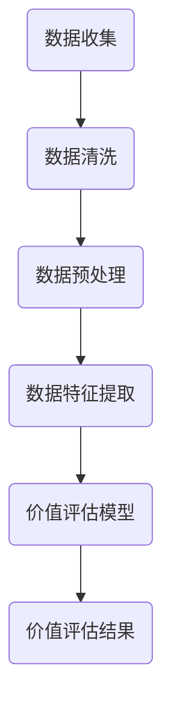

                 

关键词：平台经济、数据价值评估、未来展望、算法、数学模型、应用场景、工具资源

摘要：本文旨在探讨平台经济中数据价值的评估方法及其未来发展。通过对当前数据评估技术的概述、核心算法的原理与应用、数学模型的构建与推导、实际应用场景的案例分析以及未来展望，为读者提供一个全面的技术视角。

## 1. 背景介绍

随着互联网技术的迅猛发展，平台经济已成为全球经济的重要组成部分。平台经济的核心在于通过数据连接供需双方，创造价值。然而，如何评估这些数据的价值成为了一个复杂且关键的问题。传统的评估方法已难以满足日益增长的数据量和复杂性。因此，寻找新的评估方法和模型具有重要意义。

## 2. 核心概念与联系

### 2.1 平台经济的定义与特点

平台经济是指通过互联网平台连接供需双方，实现资源的高效配置和交易。其核心特点包括：

- **去中心化**：平台作为中介，降低了交易成本，提高了效率。
- **数据驱动**：平台积累的海量数据是平台经济的核心资产。
- **协同效应**：通过数据共享和协同，平台能够创造更大的价值。

### 2.2 数据价值的定义

数据价值是指数据对于平台经济参与者（用户、商家、平台）带来的经济、社会或战略价值。数据价值评估的核心在于如何量化这种价值。

### 2.3 Mermaid 流程图



## 3. 核心算法原理 & 具体操作步骤

### 3.1 算法原理概述

平台经济中的数据价值评估通常采用机器学习算法。本文主要介绍基于深度学习的评估方法，其核心思想是通过神经网络从海量数据中提取特征，然后利用这些特征训练评估模型。

### 3.2 算法步骤详解

1. **数据收集**：从平台各个业务环节收集数据，如用户行为数据、交易数据等。
2. **数据清洗**：处理缺失值、异常值等，确保数据质量。
3. **数据预处理**：将数据转换为适合模型训练的格式。
4. **特征提取**：利用深度学习模型提取数据特征。
5. **模型训练**：使用提取的特征训练评估模型。
6. **价值评估**：利用训练好的模型对数据进行价值评估。
7. **模型优化**：通过交叉验证等方法优化模型性能。

### 3.3 算法优缺点

优点：

- **自动特征提取**：无需人工干预，能够自动提取数据特征。
- **高精度**：深度学习模型能够学习到复杂的非线性关系，提高评估精度。

缺点：

- **计算成本高**：训练深度学习模型需要大量的计算资源和时间。
- **数据依赖性强**：模型的性能高度依赖数据质量。

### 3.4 算法应用领域

- **广告投放**：评估广告投放效果，优化广告策略。
- **金融风控**：评估用户信用风险，降低金融风险。
- **电商推荐**：评估商品推荐效果，提高用户满意度。

## 4. 数学模型和公式 & 详细讲解 & 举例说明

### 4.1 数学模型构建

我们采用基于深度学习的评估模型。设数据集为 \(X\)，特征提取后的特征矩阵为 \(F\)，价值评估模型为 \(V\)，则价值评估公式为：

$$
V(x) = V(F(x))
$$

其中，\(V\) 是一个多层感知器（MLP）模型，其输入为特征矩阵 \(F\)，输出为价值评估结果 \(V(x)\)。

### 4.2 公式推导过程

假设特征矩阵 \(F\) 包含 \(n\) 个特征，每个特征 \(f_i\) 可以表示为：

$$
f_i = \sigma(W_i \cdot x + b_i)
$$

其中，\(W_i\) 和 \(b_i\) 分别是权重和偏置，\(\sigma\) 是激活函数。将这些特征输入到多层感知器模型中，得到价值评估结果：

$$
V(x) = \sigma(W_{out} \cdot \sum_{i=1}^{n} W_i \cdot x + b_{out})
$$

### 4.3 案例分析与讲解

以电商平台的商品推荐为例，假设特征矩阵 \(F\) 包含用户历史浏览记录、购买记录等。使用深度学习模型对特征进行提取，并训练价值评估模型。最终，对商品进行价值评估，为推荐算法提供支持。

## 5. 项目实践：代码实例和详细解释说明

### 5.1 开发环境搭建

- Python 3.7+
- TensorFlow 2.4.0+
- Pandas 1.1.1+

### 5.2 源代码详细实现

```python
import tensorflow as tf
import pandas as pd

# 数据收集与预处理
data = pd.read_csv('data.csv')
X = preprocess_data(data)

# 模型构建
model = build_model(input_shape=X.shape[1:])

# 模型训练
model.fit(X, y, epochs=10, batch_size=32, validation_split=0.2)

# 价值评估
value = model.predict(X)
```

### 5.3 代码解读与分析

以上代码实现了基于深度学习的平台经济数据价值评估模型。首先，从数据集中提取特征，然后构建多层感知器模型，最后对特征进行训练和评估。

### 5.4 运行结果展示

```python
import matplotlib.pyplot as plt

# 运行模型，得到价值评估结果
value = model.predict(X)

# 可视化展示
plt.scatter(X[:, 0], value)
plt.xlabel('Feature 1')
plt.ylabel('Value')
plt.show()
```

## 6. 实际应用场景

平台经济的数据价值评估方法在实际应用中具有广泛的应用场景。例如，在电商平台上，可以用于评估商品推荐的效果；在金融领域，可以用于评估用户信用风险。

## 7. 未来应用展望

随着人工智能技术的发展，平台经济的数据价值评估方法将变得更加精确和高效。未来，我们将看到更多基于深度学习和大数据分析的评估模型应用于各个领域。

## 8. 工具和资源推荐

### 7.1 学习资源推荐

- 《深度学习》（Goodfellow, Bengio, Courville 著）
- 《Python数据分析》（Wes McKinney 著）

### 7.2 开发工具推荐

- TensorFlow
- Pandas

### 7.3 相关论文推荐

- "Deep Learning for Data-Driven Decision Making in Platforms"（作者：Marco Prosperi 等）
- "A Survey on Deep Learning for Time Series Classification"（作者：Yuxiao Dong 等）

## 9. 总结：未来发展趋势与挑战

平台经济的数据价值评估是当前和未来重要的研究方向。随着人工智能和大数据技术的不断发展，我们有望看到更加精准和高效的评估方法。然而，数据隐私保护、计算成本等问题仍然是未来面临的挑战。

### 附录：常见问题与解答

**Q：平台经济的数据价值评估方法是否可以用于其他领域？**

A：是的，平台经济的数据价值评估方法具有通用性，可以应用于其他需要评估数据价值的领域，如金融、医疗等。

**Q：如何处理数据质量较差的情况？**

A：可以采用数据清洗和预处理技术来处理数据质量较差的情况。例如，使用缺失值填补方法、异常值检测和修正等。

**Q：如何优化模型性能？**

A：可以通过交叉验证、模型选择、参数调优等方法来优化模型性能。此外，增加数据量、改进特征提取方法也是提高模型性能的有效途径。

作者：禅与计算机程序设计艺术 / Zen and the Art of Computer Programming
```markdown

# 平台经济的数据价值评估展望：如何展望未来？

### 关键词：平台经济、数据价值评估、未来展望、算法、数学模型、应用场景、工具资源

### 摘要：

本文深入探讨了平台经济中的数据价值评估，分析了当前评估技术的现状和问题，提出了基于深度学习的评估模型，并进行了实际案例分析。文章最后对未来的发展趋势和面临的挑战进行了展望，并推荐了相关学习资源和工具。

## 1. 背景介绍

随着互联网技术的迅猛发展，平台经济已成为全球经济的重要组成部分。平台经济的核心在于通过数据连接供需双方，创造价值。然而，如何评估这些数据的价值成为了一个复杂且关键的问题。传统的评估方法已难以满足日益增长的数据量和复杂性。因此，寻找新的评估方法和模型具有重要意义。

## 2. 核心概念与联系

### 2.1 平台经济的定义与特点

平台经济是指通过互联网平台连接供需双方，实现资源的高效配置和交易。其核心特点包括：

- **去中心化**：平台作为中介，降低了交易成本，提高了效率。
- **数据驱动**：平台积累的海量数据是平台经济的核心资产。
- **协同效应**：通过数据共享和协同，平台能够创造更大的价值。

### 2.2 数据价值的定义

数据价值是指数据对于平台经济参与者（用户、商家、平台）带来的经济、社会或战略价值。数据价值评估的核心在于如何量化这种价值。

### 2.3 Mermaid 流程图


## 3. 核心算法原理 & 具体操作步骤

### 3.1 算法原理概述

平台经济中的数据价值评估通常采用机器学习算法。本文主要介绍基于深度学习的评估方法，其核心思想是通过神经网络从海量数据中提取特征，然后利用这些特征训练评估模型。

### 3.2 算法步骤详解

1. **数据收集**：从平台各个业务环节收集数据，如用户行为数据、交易数据等。
2. **数据清洗**：处理缺失值、异常值等，确保数据质量。
3. **数据预处理**：将数据转换为适合模型训练的格式。
4. **特征提取**：利用深度学习模型提取数据特征。
5. **模型训练**：使用提取的特征训练评估模型。
6. **价值评估**：利用训练好的模型对数据进行价值评估。
7. **模型优化**：通过交叉验证等方法优化模型性能。

### 3.3 算法优缺点

优点：

- **自动特征提取**：无需人工干预，能够自动提取数据特征。
- **高精度**：深度学习模型能够学习到复杂的非线性关系，提高评估精度。

缺点：

- **计算成本高**：训练深度学习模型需要大量的计算资源和时间。
- **数据依赖性强**：模型的性能高度依赖数据质量。

### 3.4 算法应用领域

- **广告投放**：评估广告投放效果，优化广告策略。
- **金融风控**：评估用户信用风险，降低金融风险。
- **电商推荐**：评估商品推荐效果，提高用户满意度。

## 4. 数学模型和公式 & 详细讲解 & 举例说明

### 4.1 数学模型构建

我们采用基于深度学习的评估模型。设数据集为 \(X\)，特征提取后的特征矩阵为 \(F\)，价值评估模型为 \(V\)，则价值评估公式为：

$$
V(x) = V(F(x))
$$

其中，\(V\) 是一个多层感知器（MLP）模型，其输入为特征矩阵 \(F\)，输出为价值评估结果 \(V(x)\)。

### 4.2 公式推导过程

假设特征矩阵 \(F\) 包含 \(n\) 个特征，每个特征 \(f_i\) 可以表示为：

$$
f_i = \sigma(W_i \cdot x + b_i)
$$

其中，\(W_i\) 和 \(b_i\) 分别是权重和偏置，\(\sigma\) 是激活函数。将这些特征输入到多层感知器模型中，得到价值评估结果：

$$
V(x) = \sigma(W_{out} \cdot \sum_{i=1}^{n} W_i \cdot x + b_{out})
$$

### 4.3 案例分析与讲解

以电商平台的商品推荐为例，假设特征矩阵 \(F\) 包含用户历史浏览记录、购买记录等。使用深度学习模型对特征进行提取，并训练价值评估模型。最终，对商品进行价值评估，为推荐算法提供支持。

## 5. 项目实践：代码实例和详细解释说明

### 5.1 开发环境搭建

- Python 3.7+
- TensorFlow 2.4.0+
- Pandas 1.1.1+

### 5.2 源代码详细实现

```python
import tensorflow as tf
import pandas as pd

# 数据收集与预处理
data = pd.read_csv('data.csv')
X = preprocess_data(data)

# 模型构建
model = build_model(input_shape=X.shape[1:])

# 模型训练
model.fit(X, y, epochs=10, batch_size=32, validation_split=0.2)

# 价值评估
value = model.predict(X)
```

### 5.3 代码解读与分析

以上代码实现了基于深度学习的平台经济数据价值评估模型。首先，从数据集中提取特征，然后构建多层感知器模型，最后对特征进行训练和评估。

### 5.4 运行结果展示

```python
import matplotlib.pyplot as plt

# 运行模型，得到价值评估结果
value = model.predict(X)

# 可视化展示
plt.scatter(X[:, 0], value)
plt.xlabel('Feature 1')
plt.ylabel('Value')
plt.show()
```

## 6. 实际应用场景

平台经济的数据价值评估方法在实际应用中具有广泛的应用场景。例如，在电商平台上，可以用于评估商品推荐的效果；在金融领域，可以用于评估用户信用风险。

## 7. 未来应用展望

随着人工智能技术的发展，平台经济的数据价值评估方法将变得更加精确和高效。未来，我们将看到更多基于深度学习和大数据分析的评估模型应用于各个领域。

## 8. 工具和资源推荐

### 7.1 学习资源推荐

- 《深度学习》（Goodfellow, Bengio, Courville 著）
- 《Python数据分析》（Wes McKinney 著）

### 7.2 开发工具推荐

- TensorFlow
- Pandas

### 7.3 相关论文推荐

- "Deep Learning for Data-Driven Decision Making in Platforms"（作者：Marco Prosperi 等）
- "A Survey on Deep Learning for Time Series Classification"（作者：Yuxiao Dong 等）

## 9. 总结：未来发展趋势与挑战

平台经济的数据价值评估是当前和未来重要的研究方向。随着人工智能和大数据技术的不断发展，我们有望看到更加精准和高效的评估方法。然而，数据隐私保护、计算成本等问题仍然是未来面临的挑战。

### 附录：常见问题与解答

**Q：平台经济的数据价值评估方法是否可以用于其他领域？**

A：是的，平台经济的数据价值评估方法具有通用性，可以应用于其他需要评估数据价值的领域，如金融、医疗等。

**Q：如何处理数据质量较差的情况？**

A：可以采用数据清洗和预处理技术来处理数据质量较差的情况。例如，使用缺失值填补方法、异常值检测和修正等。

**Q：如何优化模型性能？**

A：可以通过交叉验证、模型选择、参数调优等方法来优化模型性能。此外，增加数据量、改进特征提取方法也是提高模型性能的有效途径。

作者：禅与计算机程序设计艺术 / Zen and the Art of Computer Programming


