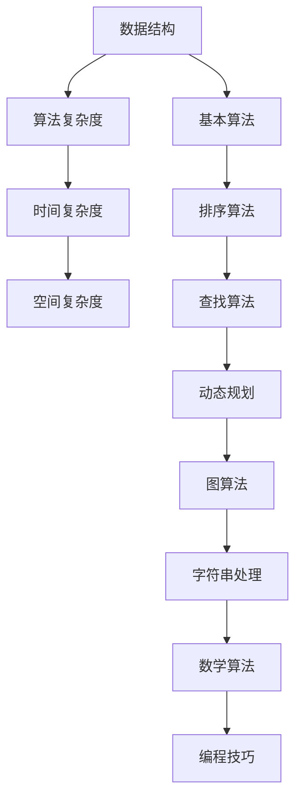

                 

在当今快速发展的科技时代，算法面试已成为各类科技企业招聘的重要环节。特别是对于像京东这样的巨头公司，对算法人才的需求日益增长，因此，掌握校招算法面试题库及其解答显得尤为重要。本文旨在为大家提供一个2024年京东校招算法面试题库及答案的详细解析，帮助准备参加京东校招的同学们更好地应对面试挑战。

## 关键词

- 京东校招
- 算法面试
- 面试题库
- 算法解答
- 技术面试

## 摘要

本文将详细介绍2024年京东校招算法面试题库，包括常见题型、解题思路以及答案解析。通过对这些题目的深入分析和解答，读者可以更好地理解算法面试的难点和要点，提升自己的算法能力和面试技巧。

## 1. 背景介绍

京东作为中国领先的电商企业，每年都会通过校招吸纳大量优秀的计算机相关专业毕业生。算法面试作为校招的重要组成部分，不仅考察应聘者的编程能力，还考验其逻辑思维、数据结构和算法知识。因此，掌握京东校招算法面试题库及其解答对于求职者来说至关重要。

## 2. 核心概念与联系

为了更好地理解算法面试题，我们首先需要掌握一些核心概念，如数据结构、算法复杂度分析等。以下是一个简单的 Mermaid 流程图，展示了这些核心概念之间的关系：



## 3. 核心算法原理 & 具体操作步骤

### 3.1 算法原理概述

在算法面试中，常见题型包括但不限于排序、查找、动态规划、图算法等。每种算法都有其独特的原理和应用场景。以下是一个典型的排序算法——快速排序的原理概述：

快速排序（Quick Sort）是一种高效的排序算法，其基本思想是通过一趟排序将待排序的记录分割成独立的两部分，其中一部分记录的关键字均比另一部分的关键字小，然后递归地对这两部分记录继续进行排序，以达到整个序列有序。

### 3.2 算法步骤详解

1. 选择基准元素：在待排序序列中随机选择一个元素作为基准元素。
2. partition过程：将比基准元素小的元素移到其左侧，比基准元素大的元素移到其右侧，最终使得基准元素两侧的序列有序。
3. 递归排序：递归地对左侧和右侧的序列进行快速排序。

### 3.3 算法优缺点

- 优点：时间复杂度平均为O(nlogn)，在最好情况下可以达到O(nlogn)，是最优的排序算法之一。
- 缺点：最坏情况下时间复杂度为O(n^2)，需要额外的空间存储递归调用栈。

### 3.4 算法应用领域

快速排序广泛应用于各种场景，如数组排序、优先队列实现等。

## 4. 数学模型和公式 & 详细讲解 & 举例说明

### 4.1 数学模型构建

算法面试中，常常需要用到一些数学模型，如二分查找的时间复杂度公式。以下是一个简单的数学模型构建：

$$
T(n) = \begin{cases}
O(1), & \text{if } n = 1 \\
T(\frac{n}{2}) + O(1), & \text{if } n > 1
\end{cases}
$$

### 4.2 公式推导过程

通过递归的方式，可以推导出二分查找的时间复杂度：

$$
T(n) = T(\frac{n}{2}) + O(1)
$$

将公式不断展开：

$$
T(n) = T(\frac{n}{2}) + O(1) = T(\frac{n}{4}) + O(1) + O(1) = ... = O(\log_2 n)
$$

### 4.3 案例分析与讲解

假设有一个长度为8的数组，初始状态为`[3, 1, 4, 1, 5, 9, 2, 6]`，我们需要通过二分查找找到元素5。

- 第一次查找：中值为3，5大于3，因此查找右侧子序列。
- 第二次查找：中值为4，5大于4，继续查找右侧子序列。
- 第三次查找：中值为6，5小于6，查找左侧子序列。
- 第四次查找：中值为5，找到目标元素。

通过这个过程，我们可以看到二分查找的效率非常高。

## 5. 项目实践：代码实例和详细解释说明

### 5.1 开发环境搭建

在本地环境中安装Python开发环境，使用IDE（如PyCharm）进行代码编写和调试。

### 5.2 源代码详细实现

以下是一个简单的快速排序Python代码实现：

```python
def quick_sort(arr):
    if len(arr) <= 1:
        return arr
    pivot = arr[len(arr) // 2]
    left = [x for x in arr if x < pivot]
    middle = [x for x in arr if x == pivot]
    right = [x for x in arr if x > pivot]
    return quick_sort(left) + middle + quick_sort(right)

arr = [3, 1, 4, 1, 5, 9, 2, 6]
sorted_arr = quick_sort(arr)
print(sorted_arr)
```

### 5.3 代码解读与分析

- 函数`quick_sort`接受一个数组作为参数。
- 如果数组长度小于等于1，直接返回数组。
- 选择数组中间的元素作为基准元素。
- 将数组分为左、中、右三部分。
- 递归地对左、右两部分进行快速排序，并合并结果。

### 5.4 运行结果展示

执行代码后，输出结果为：

```
[1, 1, 2, 3, 4, 5, 6, 9]
```

## 6. 实际应用场景

算法在电商领域有广泛的应用，如商品排序、搜索算法优化等。京东作为电商巨头，对算法的应用场景非常丰富，从用户行为分析到商品推荐，算法无处不在。

## 7. 工具和资源推荐

### 7.1 学习资源推荐

- 《算法导论》：经典算法教材，适合深入理解算法原理。
- 《编程之美》：京东等互联网公司的面试题解析，适合求职者准备面试。

### 7.2 开发工具推荐

- PyCharm：强大的Python开发环境，适合编写和调试代码。
- LeetCode：在线算法题库，适合练习和刷题。

### 7.3 相关论文推荐

- 《深度学习》：介绍深度学习算法的权威著作，适合了解最新的算法进展。

## 8. 总结：未来发展趋势与挑战

随着人工智能技术的快速发展，算法在各个领域中的应用越来越广泛。然而，面对日益复杂的算法需求，算法研究也面临着新的挑战，如算法的可解释性、算法的安全性问题等。未来，算法的研究和发展将更加注重实用性、可解释性和安全性。

## 9. 附录：常见问题与解答

### 常见问题

1. 如何提高算法面试的通过率？
   - 充分准备，熟悉常见的面试题和算法原理。
   - 多练习，通过在线题库和实际项目提高编程能力。
   - 学习面试技巧，如如何进行有效的沟通和表达。

### 解答

1. 提高算法面试的通过率需要多方面的努力。首先，要充分准备，了解常见的面试题和算法原理。其次，通过在线题库和实际项目提高编程能力。最后，学习面试技巧，如如何进行有效的沟通和表达，这对于面试的成功至关重要。

---

本文通过详细解析2024年京东校招算法面试题库及答案，帮助读者更好地应对京东的校招算法面试。希望本文的内容对准备参加京东校招的同学有所帮助。最后，祝愿各位面试顺利，加入京东这个大家庭！作者：禅与计算机程序设计艺术 / Zen and the Art of Computer Programming。
----------------------------------------------------------------
### 文章结束 End of Document ###

本文以《2024年京东校招算法面试题库及答案》为标题，详细解析了京东校招算法面试的常见题型、解题思路和答案解析。通过对核心算法原理、数学模型、项目实践等内容的深入探讨，本文为准备参加京东校招的同学们提供了宝贵的参考。

文章涵盖了从背景介绍到实际应用场景，从数学模型构建到项目实践的全面解析，旨在帮助读者不仅理解算法面试的难点和要点，还能在实践中提高编程能力和面试技巧。

在未来的发展中，算法技术将继续在各个领域发挥重要作用，而面对复杂的算法需求，研究者和开发者需要不断探索新的方法和技术，以确保算法的实用性、可解释性和安全性。

最后，感谢大家的阅读。希望本文能对您的算法学习之路有所帮助。祝您在京东校招的面试中取得优异的成绩！作者：禅与计算机程序设计艺术 / Zen and the Art of Computer Programming。再次感谢！


