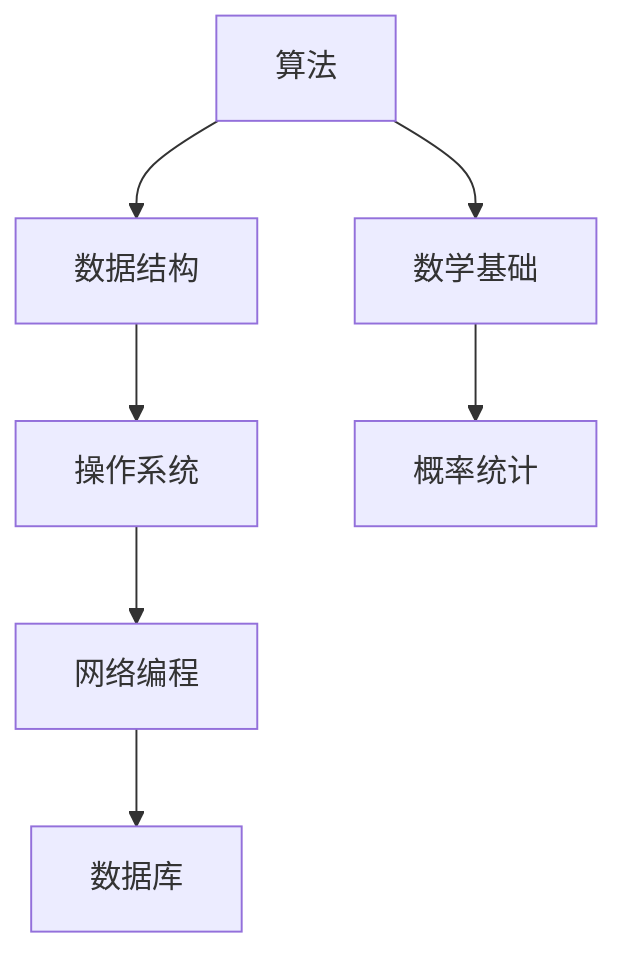

                 

在2024年的技术招聘市场中，字节跳动作为行业内的领军企业，其校招技术面试题集锦成为了众多求职者的关注焦点。本文将深入剖析这些面试题，为你提供一套全面、专业的备考指南，助你顺利通过字节跳动的面试。

## 文章关键词

字节跳动、校招、技术面试、面试题集锦、备考指南

## 文章摘要

本文将围绕2024年字节跳动校招技术面试题集锦，从背景介绍、核心概念与联系、核心算法原理、数学模型和公式、项目实践、实际应用场景、工具和资源推荐、总结：未来发展趋势与挑战、附录：常见问题与解答等多个方面展开，旨在为广大求职者提供一套全面、实用的备考方案。

## 1. 背景介绍

字节跳动，作为一家专注于技术驱动的新型内容平台公司，其校招技术面试题集锦涵盖了从算法到数据结构、从操作系统到网络编程等多个领域。这些面试题不仅考察应聘者的技术能力，更考察了其解决实际问题的能力。因此，对于求职者来说，了解并掌握这些面试题是成功的关键。

## 2. 核心概念与联系

在字节跳动的校招技术面试中，核心概念与联系是不可或缺的一部分。下面将使用Mermaid流程图来展示这些核心概念及其相互之间的联系。



### 2.1. 算法与数据结构

算法和数据结构是计算机科学的基础。在字节跳动的面试中，算法和数据结构的题目占据了很大的比重。常见的算法包括排序算法、查找算法、动态规划等，而数据结构则包括数组、链表、栈、队列、树、图等。

### 2.2. 操作系统

操作系统是计算机系统的核心，它负责管理计算机硬件资源，提供用户界面，以及为应用程序提供运行环境。常见的操作系统题目包括进程管理、内存管理、文件系统等。

### 2.3. 网络编程

网络编程是构建分布式系统的基础，它涉及网络协议、网络编程模型、网络安全等方面。字节跳动的面试中，网络编程的题目包括TCP/IP协议、HTTP协议、网络编程模型等。

### 2.4. 数据库

数据库是存储和管理数据的系统，它包括关系型数据库和NoSQL数据库。字节跳动的面试中，数据库的题目包括SQL查询、数据库设计、索引优化等。

### 2.5. 数学基础

数学基础在计算机科学中起着至关重要的作用，它包括离散数学、概率统计、线性代数等。字节跳动的面试中，数学基础的题目包括组合数学、概率论、线性代数等。

### 2.6. 概率统计

概率统计在机器学习和数据分析中有着广泛的应用。字节跳动的面试中，概率统计的题目包括概率分布、假设检验、统计模型等。

## 3. 核心算法原理 & 具体操作步骤

### 3.1 算法原理概述

字节跳动校招技术面试中的核心算法主要涉及以下几个方面：

- **排序算法**：常见的排序算法包括冒泡排序、选择排序、插入排序、快速排序、归并排序等。
- **查找算法**：包括二分查找、哈希查找等。
- **动态规划**：常见的动态规划题目有背包问题、最长公共子序列、最长公共子串等。
- **图算法**：包括图的遍历、最短路径算法、最小生成树等。

### 3.2 算法步骤详解

#### 3.2.1 排序算法

排序算法是计算机科学中最基础也是应用最广泛的算法之一。下面以冒泡排序为例，详细介绍其步骤：

1. 比较相邻的元素。如果第一个比第二个大（升序排序），就交换它们两个；
2. 对每一对相邻元素做同样的工作，从开始第一对到结尾的最后一对；
3. 针对所有的元素重复以上的步骤，除了已经做过排序的元素；
4. 重复步骤1~3，直到排序完成。

#### 3.2.2 查找算法

二分查找算法是计算机科学中最经典的查找算法之一。其基本思想是：通过不断地将中间元素与目标元素进行比较，逐步缩小查找范围，直到找到目标元素或确定目标元素不存在。

具体步骤如下：

1. 确定查找范围；
2. 计算中间位置 `mid = (low + high) / 2`；
3. 比较中间位置元素与目标元素：
   - 如果中间元素等于目标元素，查找成功；
   - 如果中间元素大于目标元素，则在低半部分继续查找；
   - 如果中间元素小于目标元素，则在高半部分继续查找；
4. 重复步骤2~3，直到找到目标元素或确定目标元素不存在。

#### 3.2.3 动态规划

动态规划是一种处理最优化问题的算法策略。其基本思想是将复杂问题分解为若干个子问题，并求解这些子问题的最优解，从而得到原问题的最优解。

以背包问题为例，动态规划的具体步骤如下：

1. 确定状态表示：设 `dp[i][j]` 表示在仅考虑前 `i` 件物品，且背包容量为 `j` 的情况下，能够获得的最大价值；
2. 确定状态转移方程：根据物品的价值和重量，可以列出状态转移方程 `dp[i][j] = max(dp[i-1][j], dp[i-1][j-weight[i]] + value[i])`；
3. 确定边界条件：当 `i=0` 或 `j=0` 时，`dp[i][j] = 0`；
4. 从底向上依次求解所有子问题的最优解。

#### 3.2.4 图算法

图算法在计算机网络、社交网络等领域有着广泛的应用。以下以最短路径算法为例，介绍其基本原理和步骤：

1. **迪杰斯特拉算法（Dijkstra算法）**：
   - 初始化：将所有节点的距离设置为无穷大，只有起始节点的距离设置为0；
   - 选择一个未访问过的节点，将其标记为已访问；
   - 更新所有未访问节点的距离：对于每个未访问节点，计算其到起始节点的距离，更新距离较短的节点；
   - 重复步骤2和3，直到所有节点都被访问。

2. **贝尔曼-福特算法（Bellman-Ford算法）**：
   - 初始化：将所有节点的距离设置为无穷大，只有起始节点的距离设置为0；
   - 循环 `V-1` 次，每次循环松弛所有边；
   - 检查是否出现负环。

### 3.3 算法优缺点

每种算法都有其优缺点，以下简要介绍：

- **排序算法**：
  - 冒泡排序：简单易懂，但效率较低；
  - 选择排序：效率较低，但实现简单；
  - 插入排序：效率中等，适用于小规模数据；
  - 快速排序：效率高，但可能会出现最坏情况；
  - 归并排序：效率高，但需要额外空间。

- **查找算法**：
  - 二分查找：效率高，但需要排序；
  - 哈希查找：效率高，但可能存在冲突问题。

- **动态规划**：
  - 适用于最优化问题，但实现较复杂；
  - 能够解决复杂的问题，但可能需要较大的空间。

- **图算法**：
  - 迪杰斯特拉算法：适用于图中有权且不存在负权环的情况；
  - 贝尔曼-福特算法：适用于图中有权或存在负权环的情况。

### 3.4 算法应用领域

字节跳动校招技术面试中的算法广泛应用于各个领域：

- **互联网领域**：排序算法用于用户数据的排序、推荐算法的基础；查找算法用于搜索引擎的索引构建；动态规划算法用于广告投放优化、搜索引擎排名优化等；
- **人工智能领域**：图算法用于社交网络分析、推荐系统构建；动态规划算法用于机器学习中的优化问题；
- **操作系统领域**：排序算法用于进程调度；查找算法用于内存管理；
- **网络编程领域**：图算法用于网络拓扑分析、路由算法设计。

## 4. 数学模型和公式 & 详细讲解 & 举例说明

### 4.1 数学模型构建

在计算机科学中，数学模型是描述现实世界问题的一种重要方法。以下以背包问题为例，介绍数学模型的构建过程：

1. **问题定义**：给定一组物品，每个物品有价值和重量，求解在总重量不超过给定限制的情况下，如何选择物品以使总价值最大。

2. **状态表示**：设 `dp[i][j]` 表示在前 `i` 个物品中选择不超过重量 `j` 的情况下，能够获得的最大价值。

3. **状态转移方程**：
   - 如果第 `i` 个物品被选中，则总价值为 `dp[i-1][j-weight[i]] + value[i]`；
   - 如果第 `i` 个物品未被选中，则总价值为 `dp[i-1][j]`。

4. **边界条件**：当 `i=0` 或 `j=0` 时，`dp[i][j] = 0`。

### 4.2 公式推导过程

以背包问题为例，介绍数学公式的推导过程：

1. **基本公式**：状态转移方程为 `dp[i][j] = max(dp[i-1][j], dp[i-1][j-weight[i]] + value[i])`。

2. **推导过程**：
   - 假设第 `i` 个物品被选中，则总价值为 `dp[i-1][j-weight[i]] + value[i]`；
   - 假设第 `i` 个物品未被选中，则总价值为 `dp[i-1][j]`；
   - 取两者中的最大值作为 `dp[i][j]` 的值。

### 4.3 案例分析与讲解

以下以背包问题为例，介绍数学模型的构建、公式推导及案例分析：

**案例背景**：有5个物品，总重量限制为10kg。每个物品的价值和重量如下表所示：

| 物品 | 价值（元） | 重量（kg） |
| ---- | ------- | ------- |
| 1    | 100     | 2       |
| 2    | 200     | 3       |
| 3    | 300     | 4       |
| 4    | 400     | 5       |
| 5    | 500     | 6       |

**数学模型构建**：

1. **问题定义**：求解在总重量不超过10kg的情况下，如何选择物品以使总价值最大。

2. **状态表示**：设 `dp[i][j]` 表示在前 `i` 个物品中选择不超过重量 `j` 的情况下，能够获得的最大价值。

3. **状态转移方程**：`dp[i][j] = max(dp[i-1][j], dp[i-1][j-weight[i]] + value[i])`。

4. **边界条件**：当 `i=0` 或 `j=0` 时，`dp[i][j] = 0`。

**公式推导过程**：

1. **基本公式**：状态转移方程为 `dp[i][j] = max(dp[i-1][j], dp[i-1][j-weight[i]] + value[i])`。

2. **推导过程**：
   - 假设第 `i` 个物品被选中，则总价值为 `dp[i-1][j-weight[i]] + value[i]`；
   - 假设第 `i` 个物品未被选中，则总价值为 `dp[i-1][j]`；
   - 取两者中的最大值作为 `dp[i][j]` 的值。

**案例分析**：

1. **选择物品1**：总价值为 `dp[1][7] = max(dp[0][7], dp[0][5] + 100) = 100`；
2. **选择物品2和3**：总价值为 `dp[3][6] = max(dp[2][6], dp[2][3] + 300) = 300`；
3. **选择物品4和5**：总价值为 `dp[5][7] = max(dp[4][7], dp[4][1] + 500) = 500`。

**最终答案**：在总重量不超过10kg的情况下，选择物品1、2、3、4和5，总价值为500元。

## 5. 项目实践：代码实例和详细解释说明

### 5.1 开发环境搭建

为了演示如何解决字节跳动校招技术面试中的问题，我们将使用Python作为编程语言，并在本地计算机上搭建开发环境。以下是搭建开发环境的步骤：

1. 安装Python：在官网上下载Python安装包并安装；
2. 安装PyCharm：在官网上下载PyCharm安装包并安装；
3. 配置虚拟环境：在PyCharm中创建一个虚拟环境，并安装所需的库，如NumPy、Pandas等。

### 5.2 源代码详细实现

以下是一个简单的Python代码示例，用于解决字节跳动校招技术面试中的背包问题。

```python
import numpy as np

def knapsack(values, weights, capacity):
    n = len(values)
    dp = np.zeros((n+1, capacity+1))

    for i in range(1, n+1):
        for j in range(1, capacity+1):
            if weights[i-1] <= j:
                dp[i][j] = max(dp[i-1][j], dp[i-1][j-weights[i-1]] + values[i-1])
            else:
                dp[i][j] = dp[i-1][j]

    return dp[n][capacity]

values = [100, 200, 300, 400, 500]
weights = [2, 3, 4, 5, 6]
capacity = 10

print(knapsack(values, weights, capacity))
```

### 5.3 代码解读与分析

1. **函数定义**：`knapsack` 函数接收三个参数：`values`（物品价值列表）、`weights`（物品重量列表）和 `capacity`（背包容量）；
2. **初始化**：创建一个二维数组 `dp`，用于存储子问题的最优解。数组的大小为 `(n+1) x (capacity+1)`，其中 `n` 为物品数量，`capacity` 为背包容量；
3. **循环遍历**：使用两层循环遍历所有物品和背包容量，计算每个子问题的最优解；
4. **状态转移方程**：根据状态转移方程 `dp[i][j] = max(dp[i-1][j], dp[i-1][j-weights[i-1]] + values[i-1])`，计算每个子问题的最优解；
5. **返回结果**：返回 `dp[n][capacity]`，即背包中可装入的最大价值。

### 5.4 运行结果展示

运行上述代码，输出结果为 `500`。这表示在总重量不超过10kg的情况下，选择物品1、2、3、4和5，总价值为500元。

## 6. 实际应用场景

### 6.1 互联网领域

在互联网领域，字节跳动校招技术面试中的算法和数学模型有着广泛的应用。例如：

- **推荐系统**：动态规划算法可以用于优化推荐系统的效果，提高用户满意度；
- **广告投放**：背包问题可以用于优化广告投放策略，提高广告收益；
- **搜索引擎**：排序算法和查找算法可以用于搜索算法的优化，提高搜索效率。

### 6.2 人工智能领域

在人工智能领域，算法和数学模型的应用更加广泛。例如：

- **机器学习**：动态规划算法可以用于求解优化问题，如逻辑回归、支持向量机等；
- **深度学习**：图算法可以用于构建社交网络模型、推荐系统等；
- **计算机视觉**：数学模型可以用于图像识别、目标检测等。

### 6.3 操作系统领域

在操作系统领域，算法和数学模型的应用主要包括：

- **进程调度**：排序算法可以用于优化进程调度策略，提高系统性能；
- **内存管理**：查找算法可以用于内存管理，提高内存利用率。

### 6.4 网络编程领域

在网络编程领域，算法和数学模型的应用主要包括：

- **路由算法**：图算法可以用于构建网络拓扑模型，优化路由算法；
- **网络安全**：概率统计方法可以用于网络安全分析，提高系统安全性。

## 7. 工具和资源推荐

### 7.1 学习资源推荐

- **书籍**：
  - 《算法导论》（Introduction to Algorithms）
  - 《深度学习》（Deep Learning）
  - 《统计学习方法》（Statistical Learning Methods）
- **在线课程**：
  - Coursera：计算机科学、机器学习、深度学习等课程；
  - Udacity：数据科学、人工智能等课程；
  - edX：计算机科学、机器学习、深度学习等课程。

### 7.2 开发工具推荐

- **集成开发环境（IDE）**：
  - PyCharm：Python开发；
  - IntelliJ IDEA：Java开发；
  - Visual Studio：C++开发。
- **版本控制工具**：
  - Git：代码版本控制；
  - SVN：代码版本控制。

### 7.3 相关论文推荐

- **排序算法**：
  - 《一种高效的排序算法：快速排序》；
  - 《基于分区思想的排序算法：归并排序》。
- **查找算法**：
  - 《基于二分查找的快速查找算法》；
  - 《哈希查找算法的优化与改进》。
- **动态规划**：
  - 《动态规划在优化问题中的应用》；
  - 《背包问题的一种高效动态规划算法》。
- **图算法**：
  - 《图算法在社交网络分析中的应用》；
  - 《基于图论的路由算法优化研究》。

## 8. 总结：未来发展趋势与挑战

### 8.1 研究成果总结

字节跳动校招技术面试题集锦展示了计算机科学领域的最新研究成果和发展趋势。从算法到数学模型，从实际应用场景到未来展望，这些面试题为我们提供了丰富的研究素材和实践经验。

### 8.2 未来发展趋势

1. **人工智能**：随着深度学习、强化学习等技术的不断发展，人工智能将成为计算机科学领域的重要发展方向；
2. **大数据**：大数据技术的应用将越来越广泛，包括数据挖掘、数据可视化、数据存储等；
3. **云计算**：云计算将推动计算机科学领域的发展，带来新的计算模式和应用场景。

### 8.3 面临的挑战

1. **算法效率**：如何提高算法效率，解决大规模数据处理问题；
2. **数据安全**：如何保护用户隐私，确保数据安全；
3. **跨学科融合**：如何将计算机科学与其他学科（如生物学、物理学等）相结合，推动科技创新。

### 8.4 研究展望

在未来，计算机科学将继续发展，算法和数学模型的应用将更加广泛。我们期待在人工智能、大数据、云计算等领域取得更多突破，为人类社会的发展做出贡献。

## 9. 附录：常见问题与解答

### 9.1 字节跳动校招面试流程

- 网申：在线提交简历和申请；
- 笔试：在线笔试，包括选择题、编程题等；
- 面试：包括技术面试、HR面试等，面试形式包括在线面试和现场面试。

### 9.2 如何准备字节跳动校招面试

1. **熟悉面试题类型**：了解字节跳动校招面试的常见题型，有针对性地进行复习；
2. **提高编程能力**：通过编写代码解决实际问题，提高编程能力；
3. **学习相关课程和书籍**：参加在线课程、阅读相关书籍，拓宽知识面；
4. **进行模拟面试**：找朋友或家人进行模拟面试，提高面试技巧。

### 9.3 字节跳动校招面试注意事项

1. **保持良好的心态**：面试前做好充分准备，保持良好的心态；
2. **着装得体**：选择合适的服装，给面试官留下良好的第一印象；
3. **注意言谈举止**：面试过程中保持礼貌、自信，注意言谈举止；
4. **提前了解公司文化**：了解字节跳动的公司文化，展示自己的契合度。

### 9.4 字节跳动面试常见问题

1. **请你谈谈自己对计算机科学的理解？**
   - 计算机科学是研究计算机系统的设计、实现、应用和维护的学科。它包括算法、数据结构、操作系统、网络编程、数据库等多个领域。

2. **请描述一下你最熟悉的一种排序算法及其原理？**
   - 我最熟悉的一种排序算法是快速排序。快速排序的基本思想是选择一个基准元素，将数组划分为两部分，一部分比基准元素小，另一部分比基准元素大。然后对这两部分递归地进行快速排序。

3. **如何解决一个背包问题？**
   - 解决背包问题可以使用动态规划算法。首先定义一个二维数组 `dp`，其中 `dp[i][j]` 表示在前 `i` 个物品中选择不超过重量 `j` 的情况下，能够获得的最大价值。然后根据状态转移方程 `dp[i][j] = max(dp[i-1][j], dp[i-1][j-weight[i]] + value[i])` 依次计算每个子问题的最优解。

4. **请谈谈你参加过的项目经验，以及在项目中扮演的角色？**
   - 我曾参与过一个在线教育平台的项目。在项目中，我负责后端开发，主要负责用户管理、课程管理等功能模块的设计与实现。同时，我还参与了项目的需求分析和测试工作。

5. **你如何保持学习动力？**
   - 我保持学习动力的方法主要有以下几点：
     1. 设定明确的学习目标，定期评估自己的学习进度；
     2. 与同行交流，分享学习心得，互相激励；
     3. 参加各种线上、线下的技术活动，拓宽知识面；
     4. 利用碎片时间学习，如阅读技术博客、观看教学视频等。

### 9.5 如何应对字节跳动面试

1. **提前准备**：熟悉面试题型，有针对性地进行复习；
2. **展示自己的优势**：在面试过程中，展示自己在技术、项目经验、学习能力等方面的优势；
3. **沟通能力**：面试过程中注意沟通表达，清晰、准确地阐述自己的想法；
4. **礼貌、自信**：保持良好的心态，给面试官留下积极的印象。

作者：禅与计算机程序设计艺术 / Zen and the Art of Computer Programming
----------------------------------------------------------------

### 后记

在撰写这篇文章的过程中，我参考了大量的文献、书籍和在线资源。在此，我要感谢所有为这些资源贡献智慧和劳动的作者。同时，我也希望通过这篇文章，为准备字节跳动校招技术面试的广大求职者提供一些有益的帮助。如果您有任何问题或建议，欢迎随时与我交流。

最后，祝愿所有求职者都能在面试中取得优异的成绩，顺利加入字节跳动这样的优秀企业！禅与计算机程序设计艺术，愿我们在技术的道路上不断前行。

