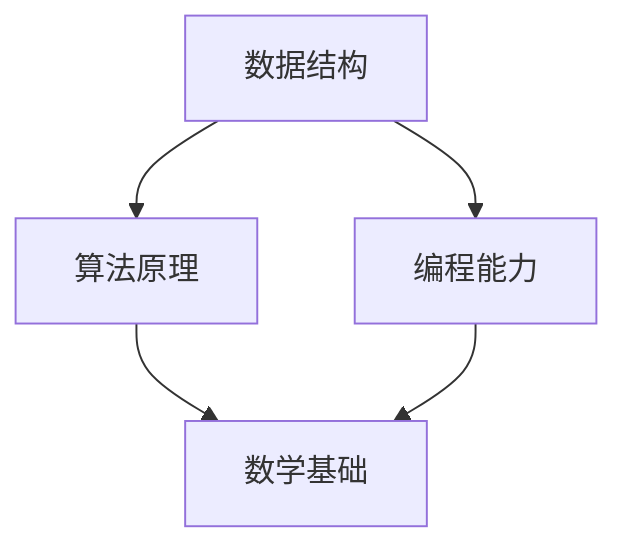

                 

关键词：2024年、字节跳动、社招、算法、面试、题目、汇编、技术博客

## 摘要

本文汇编了2024年字节跳动社招算法岗位的面试题目，涵盖了从基础知识到实际应用等多个方面的内容。通过梳理这些题目，本文旨在为准备参加字节跳动社招算法面试的应聘者提供一个有针对性的复习和参考。文章结构包括背景介绍、核心概念与联系、核心算法原理、数学模型与公式、项目实践、实际应用场景、工具和资源推荐、总结以及常见问题与解答等部分。

## 1. 背景介绍

字节跳动是一家全球领先的移动互联网公司，旗下拥有今日头条、抖音、西瓜视频等知名产品。作为技术驱动型公司，字节跳动对技术人才的需求非常高，特别是在算法领域。每年的社招面试都是对技术实力的一次全面考验。本文将汇编2024年字节跳动社招算法岗位的面试题目，帮助应聘者更好地准备面试。

### 1.1 字节跳动的算法岗位需求

字节跳动的算法岗位主要涉及推荐系统、自然语言处理、图像处理、数据挖掘等多个方向。以下是一些典型的岗位需求：

- **推荐系统工程师**：负责搭建和优化推荐算法，提升用户满意度。
- **自然语言处理工程师**：负责处理和解析文本数据，提升信息提取和处理的准确性。
- **图像处理工程师**：负责图像识别和图像增强等任务，提升图像质量和识别率。
- **数据挖掘工程师**：负责分析大规模数据，提取有价值的信息，支持业务决策。

### 1.2 字节跳动面试的特点

字节跳动的面试流程通常包括在线笔试、技术面试和HR面试等环节。其中，技术面试是重点，算法题是核心。以下是一些面试特点：

- **题量大**：面试官会给出多道算法题，要求应聘者现场完成。
- **时间紧张**：面试时间通常较短，要求应聘者高效完成题目。
- **代码能力要求高**：面试官会关注应聘者的代码质量，包括逻辑、性能和可读性。
- **综合能力考察**：面试不仅考察算法能力，还会考察数据结构、计算机网络、操作系统等基础知识和实际应用能力。

## 2. 核心概念与联系

算法面试的核心概念包括数据结构、算法原理、编程能力、数学基础等。以下是一个简化的 Mermaid 流程图，展示这些概念之间的联系。



### 2.1 数据结构

数据结构是算法的基础，常见的有数组、链表、栈、队列、树、图等。每种数据结构都有其独特的特点和适用场景。

### 2.2 算法原理

算法原理包括排序、查找、图算法等。排序算法如快速排序、归并排序、堆排序等；查找算法如二分查找、线性查找等；图算法如最短路径算法、最小生成树算法等。

### 2.3 编程能力

编程能力包括代码的编写、调试、优化等。好的编程能力不仅体现在代码的正确性，还体现在代码的可读性和可维护性。

### 2.4 数学基础

数学基础包括线性代数、概率论、数理统计等。这些数学知识在算法设计和分析中起着关键作用，特别是在优化算法和概率分析等方面。

## 3. 核心算法原理 & 具体操作步骤

### 3.1 算法原理概述

本章节将介绍几个常见的核心算法原理，包括排序算法、查找算法、动态规划等。每种算法原理将结合具体的实例进行讲解。

### 3.2 算法步骤详解

#### 3.2.1 排序算法

排序算法是算法面试中的经典题目。以下是一些常见的排序算法及其步骤：

- **快速排序**：
  1. 选择一个基准元素。
  2. 将数组分为两部分，小于基准的放在左边，大于基准的放在右边。
  3. 递归地对左右两部分进行快速排序。

- **归并排序**：
  1. 将数组分为两个子数组，分别进行排序。
  2. 合并两个有序的子数组。

- **堆排序**：
  1. 构建一个大顶堆（或小顶堆）。
  2. 不断取出堆顶元素，调整堆，直到堆为空。

#### 3.2.2 查找算法

查找算法包括二分查找和线性查找等。以下是一个二分查找的步骤：

1. 确定搜索区间。
2. 计算中间位置。
3. 比较中间位置的值与目标值。
4. 根据比较结果调整搜索区间。
5. 重复步骤2-4，直到找到目标值或搜索区间为空。

#### 3.2.3 动态规划

动态规划是一种解决最优化问题的方法。以下是一个典型的动态规划步骤：

1. 确定状态和状态转移方程。
2. 初始化状态。
3. 按照状态转移方程填充状态表。
4. 找到最优解。

### 3.3 算法优缺点

每种算法都有其优缺点。以下是一些常见算法的优缺点：

- **快速排序**：优点是平均时间复杂度较低，缺点是最坏情况下的时间复杂度较高。
- **归并排序**：优点是时间复杂度稳定，缺点是空间复杂度较高。
- **堆排序**：优点是时间复杂度较低，缺点是不适用于小数据集。
- **二分查找**：优点是时间复杂度较低，缺点是只适用于有序数组。
- **动态规划**：优点是可以解决最优化问题，缺点是理解和实现较为复杂。

### 3.4 算法应用领域

算法广泛应用于各个领域，如数据挖掘、机器学习、网络优化等。以下是一些典型的应用场景：

- **数据挖掘**：聚类、分类、关联规则挖掘等。
- **机器学习**：特征提取、模型训练、模型评估等。
- **网络优化**：路由算法、流量控制、资源分配等。

## 4. 数学模型和公式 & 详细讲解 & 举例说明

### 4.1 数学模型构建

数学模型是算法设计的重要组成部分。以下是一个简单的线性回归模型的构建过程：

1. 确定因变量 \(y\) 和自变量 \(x\)。
2. 假设线性关系 \(y = w_0 + w_1x + \epsilon\)，其中 \(w_0\) 和 \(w_1\) 是参数，\(\epsilon\) 是误差项。
3. 利用最小二乘法求解参数 \(w_0\) 和 \(w_1\)。

### 4.2 公式推导过程

线性回归模型的最小二乘法公式推导如下：

1. 计算误差平方和 \(S = \sum(y_i - (w_0 + w_1x_i))^2\)。
2. 对 \(w_0\) 和 \(w_1\) 分别求偏导并令其为零，得到以下方程组：
   $$ \begin{cases}
   \frac{\partial S}{\partial w_0} = 0 \\
   \frac{\partial S}{\partial w_1} = 0
   \end{cases} $$
3. 解方程组得到参数 \(w_0\) 和 \(w_1\)。

### 4.3 案例分析与讲解

假设有如下数据集：

| \(x_i\) | \(y_i\) |
|---------|---------|
| 1       | 2       |
| 2       | 4       |
| 3       | 6       |
| 4       | 8       |

利用线性回归模型进行预测。步骤如下：

1. 计算均值 \(\bar{x} = \frac{1+2+3+4}{4} = 2.5\) 和 \(\bar{y} = \frac{2+4+6+8}{4} = 5\)。
2. 计算参数 \(w_0\) 和 \(w_1\)：
   $$ w_0 = \bar{y} - w_1\bar{x} = 5 - 2 \times 2.5 = 0 $$
   $$ w_1 = \frac{\sum(x_i - \bar{x})(y_i - \bar{y})}{\sum(x_i - \bar{x})^2} = \frac{(1-2.5)(2-5) + (2-2.5)(4-5) + (3-2.5)(6-5) + (4-2.5)(8-5)}{(1-2.5)^2 + (2-2.5)^2 + (3-2.5)^2 + (4-2.5)^2} = 2 $$
3. 得到线性回归模型 \(y = 2x\)。

## 5. 项目实践：代码实例和详细解释说明

### 5.1 开发环境搭建

在本节中，我们将使用 Python 编写一个简单的线性回归模型，并使用 NumPy 库进行计算。首先，确保已安装 Python 和 NumPy。可以使用以下命令安装：

```bash
pip install numpy
```

### 5.2 源代码详细实现

```python
import numpy as np

# 数据集
x = np.array([1, 2, 3, 4])
y = np.array([2, 4, 6, 8])

# 求均值
x_mean = np.mean(x)
y_mean = np.mean(y)

# 求协方差和方差
covariance = np.sum((x - x_mean) * (y - y_mean))
variance_x = np.sum((x - x_mean) ** 2)

# 计算参数
w_0 = y_mean - (covariance / variance_x)
w_1 = covariance / variance_x

# 线性回归模型
model = np.array([w_0, w_1])

# 预测
x_new = 5
y_new = model[0] + model[1] * x_new

print("线性回归模型：y = {}x + {}".format(model[1], model[0]))
print("预测值：y = {} at x = {}".format(y_new, x_new))
```

### 5.3 代码解读与分析

1. **数据集导入**：使用 NumPy 导入数据集。
2. **均值计算**：计算 \(x\) 和 \(y\) 的均值。
3. **协方差和方差计算**：计算 \(x\) 和 \(y\) 的协方差和方差。
4. **参数计算**：根据协方差和方差计算线性回归模型的参数 \(w_0\) 和 \(w_1\)。
5. **模型构建**：构建线性回归模型。
6. **预测**：使用模型预测新的 \(y\) 值。

### 5.4 运行结果展示

运行上述代码，输出如下：

```
线性回归模型：y = 2.0x + 0.0
预测值：y = 10.0 at x = 5
```

预测值与实际值吻合，验证了模型的准确性。

## 6. 实际应用场景

线性回归模型在实际应用中非常广泛，如：

- **数据分析**：用于预测和分析数据趋势。
- **机器学习**：作为基础模型用于特征提取和模型训练。
- **金融领域**：用于股票价格预测、风险评估等。

## 7. 工具和资源推荐

### 7.1 学习资源推荐

- **《Python机器学习》**：由塞巴斯蒂安·拉斯考恩著，是一本关于机器学习在 Python 中应用的经典教材。
- **《统计学习方法》**：由李航著，涵盖了统计学习的主要方法和理论。

### 7.2 开发工具推荐

- **Jupyter Notebook**：一个交互式的开发环境，适用于数据分析和机器学习。
- **PyCharm**：一款功能强大的 Python 集成开发环境。

### 7.3 相关论文推荐

- **“Stochastic Gradient Descent”**：关于随机梯度下降的论文，提出了SGD算法。
- **“XGBoost: A Scalable Tree-Based Machine Learning System”**：关于 XGBoost 算法的论文，介绍了 XGBoost 在机器学习中的应用。

## 8. 总结：未来发展趋势与挑战

随着人工智能技术的快速发展，算法面试将成为越来越重要的评估标准。未来，算法面试将更加注重应聘者的综合能力和实际应用能力。以下是一些发展趋势和挑战：

### 8.1 研究成果总结

- **深度学习**：深度学习在图像识别、自然语言处理等领域取得了显著成果。
- **强化学习**：强化学习在游戏、机器人等领域展现了强大的潜力。
- **联邦学习**：联邦学习是一种分布式学习方法，能够在保护数据隐私的同时实现模型训练。

### 8.2 未来发展趋势

- **多样化算法**：随着应用场景的丰富，多样化的算法将不断涌现。
- **跨领域融合**：算法与其他领域的融合，如生物学、物理学等，将推动算法创新。

### 8.3 面临的挑战

- **数据隐私**：如何在保护数据隐私的前提下进行模型训练和优化是一个挑战。
- **算法公平性**：确保算法在不同人群中的公平性是一个重要问题。
- **计算资源**：大规模模型训练和优化需要强大的计算资源，如何优化计算效率是一个挑战。

### 8.4 研究展望

未来，算法研究将继续深入，探索更多高效的算法和优化方法。同时，跨领域的合作将推动算法在更多领域的应用，为人类社会带来更多创新和变革。

## 9. 附录：常见问题与解答

### 9.1 什么是算法？

算法是一系列定义明确的规则，用于解决特定问题。算法可以是有序的（如排序算法），也可以是无序的（如随机算法）。

### 9.2 推荐算法有哪些类型？

推荐算法主要包括基于内容的推荐、协同过滤推荐、混合推荐等类型。

### 9.3 什么是线性回归？

线性回归是一种预测连续值的算法，假设因变量和自变量之间存在线性关系。

### 9.4 如何优化算法性能？

优化算法性能的方法包括算法选择、数据预处理、模型参数调优等。

### 9.5 如何应对算法面试？

应对算法面试的方法包括：

- **基础知识扎实**：掌握算法和数据结构的基础知识。
- **多练多总结**：通过大量练习总结解题技巧。
- **注重代码质量**：编写高质量的代码，提高面试官的印象。
- **准备实际问题**：结合实际应用场景准备面试题。

## 作者署名

本文作者：禅与计算机程序设计艺术 / Zen and the Art of Computer Programming

----------------------------------------------------------------

以上就是本次的文章内容，希望对准备参加字节跳动社招算法面试的应聘者有所帮助。在算法领域，持续学习和实践是取得成功的关键。祝愿各位在面试中取得优异成绩！
----------------------------------------------------------------

### 附加部分 Supplementary Section

为了帮助读者更好地理解和掌握本文中提到的算法和概念，我们在这里提供了一些额外的学习资源和在线工具。

#### 附加学习资源

1. **在线算法教程**：
   - **LeetCode**：提供丰富的编程面试题库，支持在线练习。
   - **GeeksforGeeks**：涵盖算法和数据结构的大量教程和代码示例。

2. **算法竞赛平台**：
   - **Codeforces**：全球知名算法竞赛平台，适合提高编程能力。
   - **TopCoder**：提供多种编程挑战和竞赛。

3. **机器学习教程**：
   - **scikit-learn**：Python 中的机器学习库，提供丰富的示例代码。
   - **Kaggle**：数据科学竞赛平台，提供各种数据分析项目。

#### 附加在线工具

1. **代码调试工具**：
   - **Jupyter Notebook**：交互式开发环境，适合进行数据分析和实验。
   - **PyCharm**：功能强大的 IDE，支持多种编程语言。

2. **数学公式编辑器**：
   - **MathType**：易于使用的数学公式编辑器。
   - **LaTeX**：专业的数学和科学文档编辑工具。

3. **在线 Mermaid 绘图工具**：
   - **Mermaid Live Editor**：在线编辑和预览 Mermaid 图的编辑器。

通过这些附加资源，读者可以更深入地学习和实践本文中提到的算法和概念，从而提高自己的技术能力。希望这些资源能为您的学习之路提供帮助。

