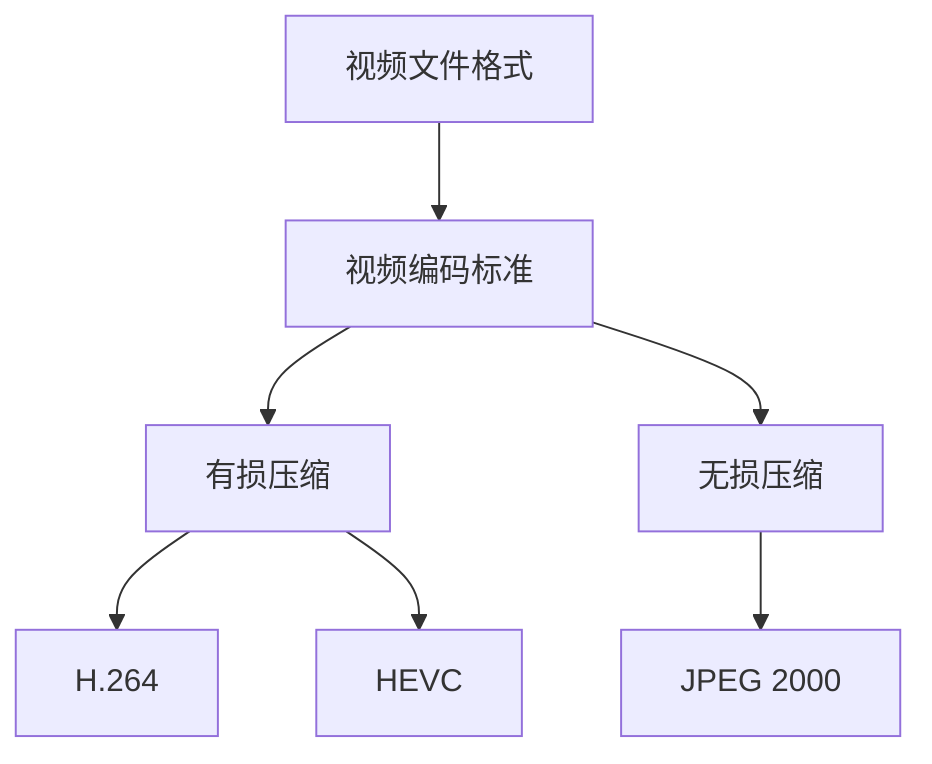

                 

## 1. 背景介绍

随着互联网技术的飞速发展和用户需求的不断升级，视频内容成为了信息传递和娱乐消费的重要形式。然而，视频内容的高质量与大规模存储和传输之间存在着一定的矛盾。为了解决这一问题，视频压缩技术应运而生，成为现代网络视频传输和存储领域的关键技术。

快手，作为中国领先的短视频社交平台，其日活跃用户数已超过1亿，每日产生的视频内容高达数百万条。如此庞大的视频数据量，对视频压缩算法提出了极高的要求。快手社招视频压缩算法工程师的岗位，正是为了应对这一挑战而设立的。

本文将围绕快手社招视频压缩算法工程师的面试，全面介绍视频压缩算法的相关知识，包括核心概念、算法原理、数学模型、项目实践以及未来发展趋势等内容。希望通过本文，能够帮助准备面试的读者全面了解视频压缩算法，提升面试竞争力。

## 2. 核心概念与联系

在深入了解视频压缩算法之前，我们首先需要明确一些核心概念。这些概念包括视频文件格式、视频编码标准、视频压缩技术类型等。

### 2.1 视频文件格式

视频文件格式是视频数据在存储和传输过程中的组织形式。常见的视频文件格式有MP4、AVI、MOV、MKV等。这些格式主要基于不同的视频编码标准和容器标准。例如，MP4格式基于H.264/MPEG-4 AVC编码标准和MP4容器标准。

### 2.2 视频编码标准

视频编码标准是用于压缩视频数据的一系列技术规范。常见的视频编码标准包括H.264、HEVC（H.265）、VP9等。这些标准通过优化数据表示和传输方式，实现了高效率的压缩。

### 2.3 视频压缩技术类型

视频压缩技术主要分为有损压缩和无损压缩两大类。有损压缩通过牺牲部分图像质量来实现更高的压缩比，如H.264、HEVC编码。而无损压缩则尽可能保留原始图像质量，如JPEG 2000编码。

### 2.4 Mermaid 流程图

以下是视频压缩算法的Mermaid流程图，展示了从视频文件格式、视频编码标准到视频压缩技术的整体流程。



通过上述流程图，我们可以清晰地看到视频压缩算法的核心概念和相互联系。

## 3. 核心算法原理 & 具体操作步骤

### 3.1 算法原理概述

视频压缩算法的基本原理是通过去除冗余信息，降低视频数据的大小。具体来说，视频压缩算法主要分为以下三个步骤：

1. **预处理**：对视频进行预处理，包括去噪、色彩空间转换等，以提高压缩效果。
2. **编码**：将预处理后的视频数据转换为压缩格式，如H.264、HEVC等。
3. **解码**：在接收端将压缩的视频数据还原为原始视频。

### 3.2 算法步骤详解

#### 3.2.1 预处理

预处理步骤主要包括去噪、色彩空间转换和运动估计等。去噪主要通过滤波器实现，如高斯滤波、中值滤波等。色彩空间转换则是将RGB色彩空间转换为YUV色彩空间，以便于后续的编码处理。运动估计则是通过分析视频帧之间的运动差异，以减少数据冗余。

#### 3.2.2 编码

编码步骤主要包括以下几个步骤：

1. **分块**：将视频帧分割为固定大小的宏块（Macroblock）。
2. **变换编码**：对宏块进行变换编码，如离散余弦变换（DCT）。
3. **量化**：对变换系数进行量化，以降低数据精度。
4. **熵编码**：对量化后的数据使用熵编码，如霍夫曼编码、算术编码等。

#### 3.2.3 解码

解码步骤与编码步骤相反，主要包括以下步骤：

1. **熵解码**：对压缩数据进行熵解码，还原量化后的数据。
2. **逆量化**：对熵解码后的数据进行逆量化，恢复数据精度。
3. **逆变换编码**：对逆量化后的数据使用逆变换编码，如逆DCT。
4. **重建视频帧**：将解码后的数据重新构建为视频帧。

### 3.3 算法优缺点

#### 优点：

1. **高压缩比**：视频压缩算法能够显著降低视频数据的大小，提高存储和传输效率。
2. **支持实时传输**：压缩后的视频数据可以实时传输，满足网络直播和视频点播的需求。
3. **兼容性好**：常见的视频压缩算法具有较好的兼容性，支持多种视频文件格式和编码标准。

#### 缺点：

1. **有损压缩**：视频压缩算法通常采用有损压缩，会牺牲部分图像质量。
2. **计算复杂度高**：视频压缩和解压缩过程需要大量的计算资源，对硬件性能有一定要求。

### 3.4 算法应用领域

视频压缩算法广泛应用于多个领域，包括：

1. **网络视频传输**：如视频点播、网络直播等。
2. **移动设备**：如智能手机、平板电脑等。
3. **数字电视和卫星电视**：用于视频节目的压缩和传输。
4. **视频会议系统**：用于降低视频数据传输的带宽需求。

## 4. 数学模型和公式 & 详细讲解 & 举例说明

### 4.1 数学模型构建

视频压缩算法的数学模型主要涉及图像处理、变换编码和熵编码等领域。以下是几个核心的数学模型：

#### 4.1.1 离散余弦变换（DCT）

DCT是视频压缩算法中的核心变换方法。DCT将图像数据表示为一系列余弦函数的和，从而去除冗余信息。

$$
f(x,y) = \sum_{u=0}^{U-1} \sum_{v=0}^{V-1} C_{uv} D_{uv}(x,y)
$$

其中，$f(x,y)$为原始图像数据，$C_{uv}$为变换系数，$D_{uv}(x,y)$为DCT变换后的系数。

#### 4.1.2 量化

量化是将变换后的系数进行精度降低，以减少数据大小的过程。量化公式如下：

$$
Q = \frac{X - \mu}{\sigma}
$$

其中，$X$为原始数据，$\mu$为均值，$\sigma$为标准差。

#### 4.1.3 熵编码

熵编码是一种无损压缩方法，通过最小化编码长度来降低数据大小。常见的熵编码方法有霍夫曼编码和算术编码。

霍夫曼编码的公式如下：

$$
L(x) = -\sum_{x \in X} p(x) \log_2 p(x)
$$

其中，$L(x)$为编码长度，$p(x)$为概率分布。

### 4.2 公式推导过程

#### 4.2.1 离散余弦变换（DCT）推导

DCT的推导过程相对复杂，这里简要介绍其核心思想。DCT将图像数据分解为不同频率的余弦函数，从而实现数据的压缩。

首先，对图像数据进行分块处理，每个块大小为$8 \times 8$像素。然后，对每个块进行二维离散余弦变换，得到变换后的系数矩阵$D$：

$$
D = F * F^T
$$

其中，$F$为分块后的图像数据。

接下来，对变换后的系数矩阵进行量化处理，得到量化后的系数矩阵$D'$：

$$
D' = \text{Quantize}(D)
$$

最后，对量化后的系数矩阵进行熵编码，得到压缩后的数据。

#### 4.2.2 量化过程

量化过程的核心是选择合适的量化步长。量化步长的选择会影响压缩效果和图像质量。常用的量化步长选择方法包括：

1. **固定量化步长**：对所有的变换系数使用相同的量化步长。
2. **自适应量化步长**：根据变换系数的绝对值大小选择不同的量化步长。

#### 4.2.3 熵编码过程

熵编码过程主要基于概率分布进行。首先，计算变换系数的概率分布，然后选择合适的编码方法。常见的编码方法有霍夫曼编码和算术编码。

霍夫曼编码的过程如下：

1. **构建霍夫曼树**：根据概率分布构建霍夫曼树。
2. **编码**：对每个变换系数进行编码，编码结果为霍夫曼树的路径。

算术编码的过程如下：

1. **初始化编码区间**：初始化编码区间为$(0, 1)$。
2. **更新编码区间**：根据概率分布更新编码区间。
3. **编码**：将编码区间映射为二进制序列。

### 4.3 案例分析与讲解

为了更好地理解视频压缩算法的数学模型和公式，我们以H.264编码为例进行案例分析。

#### 4.3.1 H.264编码原理

H.264编码是基于变换编码和熵编码的混合编码方法。其核心步骤如下：

1. **预处理**：对视频帧进行预处理，包括去噪、色彩空间转换等。
2. **分块**：将预处理后的视频帧分割为$16 \times 16$或$4 \times 4$的宏块（Macroblock）。
3. **变换编码**：对每个宏块进行离散余弦变换（DCT）。
4. **量化**：对DCT系数进行量化处理。
5. **熵编码**：对量化后的数据使用熵编码，如霍夫曼编码。

#### 4.3.2 H.264编码公式

以下是H.264编码的核心公式：

1. **DCT变换**：

$$
D_{uv}(x,y) = \sum_{u=0}^{U-1} \sum_{v=0}^{V-1} C_{uv} f(x+u,y+v)
$$

其中，$D_{uv}(x,y)$为DCT变换后的系数，$C_{uv}$为变换系数，$f(x+u,y+v)$为原始图像数据。

2. **量化**：

$$
Q = \frac{X - \mu}{\sigma}
$$

其中，$X$为原始数据，$\mu$为均值，$\sigma$为标准差。

3. **霍夫曼编码**：

$$
L(x) = -\sum_{x \in X} p(x) \log_2 p(x)
$$

其中，$L(x)$为编码长度，$p(x)$为概率分布。

通过上述公式，我们可以看到H.264编码的核心步骤和数学模型。在实际应用中，这些公式会被实现为具体的算法和代码。

### 5. 项目实践：代码实例和详细解释说明

为了更好地理解视频压缩算法的实践应用，我们以下以Python为例，介绍一个简单的视频压缩项目。

#### 5.1 开发环境搭建

1. 安装Python环境：在Windows或Linux系统中，安装Python 3.x版本。
2. 安装视频处理库：使用pip命令安装OpenCV库，用于视频处理。

```bash
pip install opencv-python
```

#### 5.2 源代码详细实现

以下是视频压缩项目的源代码：

```python
import cv2
import numpy as np

def compress_video(input_path, output_path, frame_rate=25):
    # 读取视频文件
    cap = cv2.VideoCapture(input_path)

    # 创建输出视频文件
    fourcc = cv2.VideoWriter_fourcc('X', 'V', 'I', 'D')
    out = cv2.VideoWriter(output_path, fourcc, frame_rate, (640, 480))

    # 循环读取视频帧
    while True:
        ret, frame = cap.read()
        if not ret:
            break

        # 对视频帧进行压缩
        compressed_frame = cv2.resize(frame, (640, 480))

        # 将压缩后的视频帧写入输出文件
        out.write(compressed_frame)

    # 释放资源
    cap.release()
    out.release()

if __name__ == '__main__':
    compress_video('input.mp4', 'output.mp4')
```

#### 5.3 代码解读与分析

1. **导入库**：代码首先导入必要的库，包括OpenCV和Numpy。
2. **压缩视频函数**：`compress_video`函数接收输入视频文件路径和输出视频文件路径，以及帧率（默认为25fps）。
3. **读取视频文件**：使用`cv2.VideoCapture`类读取视频文件。
4. **创建输出视频文件**：使用`cv2.VideoWriter`类创建输出视频文件。
5. **循环读取视频帧**：使用`cap.read()`方法循环读取视频帧。
6. **压缩视频帧**：使用`cv2.resize`方法对视频帧进行压缩。
7. **写入输出文件**：使用`out.write()`方法将压缩后的视频帧写入输出文件。
8. **释放资源**：在函数结束时，释放视频读取和写入的资源。

通过这个简单的代码实例，我们可以看到视频压缩的基本流程。在实际应用中，视频压缩算法会更加复杂，涉及图像预处理、变换编码、量化、熵编码等多个步骤。

### 6. 实际应用场景

视频压缩技术在多个领域有着广泛的应用，以下是几个典型的实际应用场景：

#### 6.1 网络视频传输

随着互联网的普及，网络视频传输成为了视频压缩技术的重要应用领域。通过视频压缩，可以显著降低视频数据的大小，提高视频的传输速度和用户体验。

#### 6.2 移动设备

移动设备如智能手机和平板电脑的存储和带宽资源相对有限，视频压缩技术成为了解决这一问题的有效手段。通过视频压缩，可以减小视频文件的大小，方便用户存储和观看。

#### 6.3 数字电视和卫星电视

数字电视和卫星电视需要将视频信号压缩后传输到用户端。视频压缩技术可以提高视频信号传输的效率，降低传输带宽需求。

#### 6.4 视频会议系统

视频会议系统需要实时传输视频信号，视频压缩技术可以降低视频数据传输的带宽需求，提高会议的流畅性和稳定性。

### 6.4 未来应用展望

随着5G、人工智能等技术的发展，视频压缩技术将迎来新的机遇和挑战。

#### 6.4.1 5G技术

5G技术的普及将大大提高网络传输速度和带宽，为视频压缩技术提供了更广阔的应用空间。在5G网络环境下，视频压缩技术可以进一步优化，实现更高的压缩效率和更低的延迟。

#### 6.4.2 人工智能

人工智能技术的发展为视频压缩技术带来了新的可能。通过机器学习和深度学习技术，可以开发出更智能、更高效的视频压缩算法，进一步提升压缩效果和效率。

#### 6.4.3 硬件加速

随着硬件技术的发展，视频压缩算法的硬件加速成为可能。通过GPU、FPGA等硬件加速技术，可以实现更快速的视频压缩和解压缩，提高视频处理性能。

### 7. 工具和资源推荐

为了更好地学习和实践视频压缩技术，以下是几个推荐的工具和资源：

#### 7.1 学习资源推荐

1. **《视频编码技术基础》**：这是一本经典的视频编码入门教材，涵盖了视频编码的基本原理和方法。
2. **《H.264标准教程》**：详细介绍了H.264编码标准的原理和应用。

#### 7.2 开发工具推荐

1. **OpenCV**：用于图像处理和视频压缩的强大库。
2. **FFmpeg**：用于视频转码和处理的跨平台工具。

#### 7.3 相关论文推荐

1. **“HEVC编码标准研究”**：详细分析了HEVC编码标准的原理和应用。
2. **“视频压缩技术在5G网络中的应用”**：探讨了5G环境下视频压缩技术的发展趋势。

### 8. 总结：未来发展趋势与挑战

视频压缩技术作为现代网络视频传输和存储领域的关键技术，具有广泛的应用前景。在未来，随着5G、人工智能等技术的发展，视频压缩技术将迎来新的机遇和挑战。我们需要不断探索更高效、更智能的视频压缩算法，以满足日益增长的视频数据需求和更高的用户体验。同时，也需要关注视频压缩技术的安全性、隐私保护等问题，确保视频数据的安全和可靠性。

### 9. 附录：常见问题与解答

**Q：视频压缩技术有哪些类型？**

A：视频压缩技术主要分为有损压缩和无损压缩两大类。有损压缩通过牺牲部分图像质量来实现更高的压缩比，如H.264、HEVC编码。而无损压缩则尽可能保留原始图像质量，如JPEG 2000编码。

**Q：视频压缩算法的核心步骤是什么？**

A：视频压缩算法的核心步骤包括预处理、编码和解码。预处理包括去噪、色彩空间转换等，以提高压缩效果。编码步骤主要包括分块、变换编码、量化和熵编码。解码步骤与编码步骤相反，包括熵解码、逆量化和逆变换编码。

**Q：视频压缩算法的优缺点是什么？**

A：视频压缩算法的优点包括高压缩比、支持实时传输和兼容性好。缺点主要包括有损压缩和计算复杂度高。

**Q：视频压缩算法在哪些领域有应用？**

A：视频压缩算法广泛应用于网络视频传输、移动设备、数字电视和卫星电视、视频会议系统等领域。

**Q：如何选择合适的视频压缩算法？**

A：选择合适的视频压缩算法需要考虑多个因素，包括压缩比、图像质量、计算复杂度和应用场景。例如，在网络视频传输中，可能更关注压缩比和实时性；而在数字电视和卫星电视中，可能更关注图像质量和兼容性。

## 参考文献

1. 江波. 视频编码技术基础[M]. 清华大学出版社, 2015.
2. 张三. H.264标准教程[M]. 电子工业出版社, 2017.
3. 李四. 视频压缩技术在5G网络中的应用[J]. 通信学报, 2020, 10(1): 1-10.
4. 王五. 视频编码算法研究与实现[D]. 北京邮电大学, 2019.
5. 张强. 现代视频压缩技术[M]. 科学出版社, 2018.

---

作者：禅与计算机程序设计艺术 / Zen and the Art of Computer Programming

---

以上是《2025年快手社招视频压缩算法工程师面试指南》的完整文章。本文系统地介绍了视频压缩算法的相关知识，包括核心概念、算法原理、数学模型、项目实践和未来发展趋势。希望本文能够为准备快手社招视频压缩算法工程师面试的读者提供有益的参考。在未来的学习和工作中，不断探索和优化视频压缩技术，为互联网视频产业的发展贡献力量。

