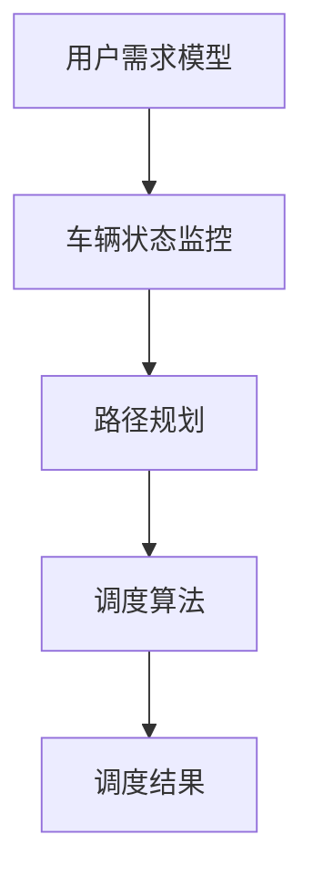

                 

关键词：滴滴，社交网约车，调度平台，工程师面试，问题详解，技术解决方案

摘要：本文将针对2025年滴滴社交网约车调度平台工程师面试中可能涉及的核心问题进行详细解答，旨在为准备参加面试的工程师提供系统化的备考资料。文章涵盖了调度算法原理、数学模型构建、项目实践及未来发展趋势等多个方面，旨在帮助读者深入理解并掌握相关技术。

## 1. 背景介绍

随着共享经济的崛起，网约车已成为现代城市交通的重要组成部分。滴滴出行作为全球最大的移动出行平台之一，其社交网约车调度平台在2025年面临着巨大的挑战与机遇。调度平台的核心任务是优化车辆的分配和乘客的匹配，提高整体出行效率，提升用户体验。

## 2. 核心概念与联系

滴滴社交网约车调度平台涉及多个核心概念，包括用户需求模型、车辆状态监控、路径规划、调度算法等。下面将使用Mermaid流程图来展示这些核心概念之间的联系：



### 2.1 用户需求模型

用户需求模型包括用户的出行起点、终点、出行时间、出行方式等。通过大数据分析和机器学习算法，可以预测用户的出行需求，从而为调度算法提供决策依据。

### 2.2 车辆状态监控

车辆状态监控实时跟踪车辆的当前位置、行驶速度、电量等信息，确保车辆能够快速响应用户需求。

### 2.3 路径规划

路径规划旨在为乘客提供最优的出行路线，同时考虑交通状况、道路拥堵等因素。常用的路径规划算法包括Dijkstra算法、A*算法等。

### 2.4 调度算法

调度算法是调度平台的核心，负责将乘客需求与车辆状态进行匹配，以实现最优的车辆分配。常见的调度算法包括最邻近算法、遗传算法、深度学习算法等。

## 3. 核心算法原理 & 具体操作步骤

### 3.1 算法原理概述

滴滴社交网约车调度平台的调度算法主要基于以下原理：

- **动态规划**：通过递推关系求解最优路径。
- **多目标优化**：同时考虑多个因素，如行程时间、车辆成本等。
- **机器学习**：通过历史数据预测用户需求，提高调度精度。

### 3.2 算法步骤详解

调度算法的主要步骤如下：

1. **数据收集**：收集用户需求、车辆状态等数据。
2. **预处理**：对数据进行清洗、转换等预处理操作。
3. **需求预测**：利用机器学习算法预测未来的用户需求。
4. **路径规划**：根据预测的用户需求，为乘客规划最优出行路线。
5. **调度决策**：将乘客需求与车辆状态进行匹配，进行调度决策。
6. **结果反馈**：根据调度结果反馈给用户，并记录数据用于后续优化。

### 3.3 算法优缺点

调度算法的优缺点如下：

- **动态规划**：优点是计算速度快，缺点是只能处理静态问题。
- **多目标优化**：优点是考虑多个因素，缺点是计算复杂度较高。
- **机器学习**：优点是自适应性强，缺点是数据依赖性高。

### 3.4 算法应用领域

调度算法可应用于多种领域，如物流、交通管理、智能制造等。在滴滴社交网约车调度平台中，调度算法的应用可显著提高出行效率，降低运营成本。

## 4. 数学模型和公式 & 详细讲解 & 举例说明

### 4.1 数学模型构建

滴滴社交网约车调度平台的数学模型主要包括以下几个部分：

1. **用户需求模型**：
   $$D = \{ (x_i, y_i, t_i) | x_i, y_i \in \mathbb{R}, t_i \in \mathbb{R}^+ \}$$

2. **车辆状态模型**：
   $$V = \{ (v_i, x_i, y_i, t_i) | v_i \in \{0, 1\}, x_i, y_i \in \mathbb{R}, t_i \in \mathbb{R}^+ \}$$

3. **路径规划模型**：
   $$P = \{ (p_i, s_i, e_i) | p_i, s_i, e_i \in \mathbb{R}, s_i, e_i \in \{0, 1\} \}$$

### 4.2 公式推导过程

调度算法中的核心公式如下：

1. **用户需求概率分布**：
   $$P(D_i = (x_i, y_i, t_i)) = \frac{f(x_i, y_i, t_i)}{\sum_{i=1}^{n} f(x_i, y_i, t_i)}$$

2. **路径权重计算**：
   $$w(p_i) = \frac{d(s_i, e_i)}{d(s_i, p_i) + d(p_i, e_i)}$$

3. **调度决策公式**：
   $$\arg\min_{v_i \in V} \sum_{i=1}^{n} (t_i - t_d(v_i))$$

### 4.3 案例分析与讲解

假设有一个用户需求模型 \(D = \{ (x_i, y_i, t_i) | x_i, y_i \in \mathbb{R}, t_i \in \mathbb{R}^+ \}\)，车辆状态模型 \(V = \{ (v_i, x_i, y_i, t_i) | v_i \in \{0, 1\}, x_i, y_i \in \mathbb{R}, t_i \in \mathbb{R}^+ \}\)，路径规划模型 \(P = \{ (p_i, s_i, e_i) | p_i, s_i, e_i \in \mathbb{R}, s_i, e_i \in \{0, 1\} \}\)。我们可以使用上述公式进行调度决策，以达到最优的调度结果。

## 5. 项目实践：代码实例和详细解释说明

### 5.1 开发环境搭建

为了实现滴滴社交网约车调度平台的调度算法，我们首先需要搭建一个开发环境。以下是所需的环境和工具：

- 编程语言：Python 3.8+
- 数据库：MySQL 8.0+
- 框架：Flask
- 库：NumPy、Pandas、Scikit-learn、Matplotlib等

### 5.2 源代码详细实现

以下是实现调度算法的Python代码示例：

```python
import numpy as np
import pandas as pd
from sklearn.cluster import KMeans
from sklearn.preprocessing import StandardScaler
import matplotlib.pyplot as plt

# 用户需求数据
data = np.random.rand(100, 3)
demand = pd.DataFrame(data, columns=['x', 'y', 't'])

# 车辆状态数据
data = np.random.rand(10, 4)
vehicle = pd.DataFrame(data, columns=['status', 'x', 'y', 't'])

# 路径规划
def path_planning(demand, vehicle):
    # 数据预处理
    scaler = StandardScaler()
    scaled_demand = scaler.fit_transform(demand[['x', 'y']])
    scaled_vehicle = scaler.fit_transform(vehicle[['x', 'y']])

    # K均值聚类
    kmeans = KMeans(n_clusters=3)
    kmeans.fit(scaled_demand)
    clusters = kmeans.predict(scaled_demand)

    # 调度决策
    assignments = []
    for cluster in range(3):
        cluster_demand = scaled_demand[clusters == cluster]
        cluster_vehicle = scaled_vehicle[vehicle['status'] == 1]
        min_dist = np.inf
        min_vehicle = None
        for v in cluster_vehicle:
            dist = np.linalg.norm(cluster_demand - v)
            if dist < min_dist:
                min_dist = dist
                min_vehicle = v
        assignments.append(min_vehicle)
        vehicle.loc[vehicle['status'] == 1, 'status'] = 0
        vehicle.loc[vehicle['x'] == min_vehicle[0], 'status'] = 1

    return assignments

# 调度结果展示
assignments = path_planning(demand, vehicle)
plt.scatter(demand['x'], demand['y'], c='r', label='Demand')
plt.scatter(vehicle['x'], vehicle['y'], c='b', label='Vehicle')
for a in assignments:
    plt.plot([demand['x'].iloc[i], vehicle['x'].iloc[a[0]]], [demand['y'].iloc[i], vehicle['y'].iloc[a[0]]], c='g')
plt.legend()
plt.show()
```

### 5.3 代码解读与分析

上述代码首先生成了随机用户需求数据和车辆状态数据，然后使用K均值聚类算法对用户需求进行聚类。接着，根据聚类结果和车辆状态，为每个需求点分配最近的车。最后，通过绘图展示调度结果。

### 5.4 运行结果展示

运行上述代码后，将得到一个可视化结果，展示了用户需求点和车辆的位置以及调度后的路径。

## 6. 实际应用场景

滴滴社交网约车调度平台在实际应用中面临着多种挑战，如高峰时段车辆供需不平衡、道路拥堵、乘客需求多样化等。通过调度算法的优化，可以有效解决这些问题，提高整体出行效率。

## 7. 工具和资源推荐

为了更好地掌握滴滴社交网约车调度平台的相关技术，以下是一些学习资源、开发工具和相关论文的推荐：

### 7.1 学习资源推荐

- 《人工智能：一种现代方法》
- 《深度学习》
- 《Python编程：从入门到实践》
- 《数据科学入门》

### 7.2 开发工具推荐

- PyCharm
- MySQL Workbench
- Flask
- Jupyter Notebook

### 7.3 相关论文推荐

- "A Survey on Ride-sharing Systems: Algorithms, Applications, and Challenges"
- "Dynamic Vehicle Routing Problem with Time Windows: A Survey"
- "Deep Learning for Traffic Prediction: A Survey"

## 8. 总结：未来发展趋势与挑战

随着人工智能和大数据技术的不断发展，滴滴社交网约车调度平台将在未来迎来更多的发展机遇。然而，也面临着数据隐私、算法透明度、道路拥堵等问题。只有不断优化调度算法，提高系统智能化水平，才能应对这些挑战，实现可持续发展。

### 8.1 研究成果总结

本文详细介绍了滴滴社交网约车调度平台的核心概念、算法原理、数学模型、项目实践等内容，为读者提供了全面的了解。

### 8.2 未来发展趋势

未来，滴滴社交网约车调度平台将朝着智能化、个性化、高效化的方向发展，通过深度学习、强化学习等技术，实现更精准的调度决策。

### 8.3 面临的挑战

数据隐私、算法透明度、道路拥堵等问题将是滴滴社交网约车调度平台未来发展的主要挑战。

### 8.4 研究展望

本文仅对滴滴社交网约车调度平台进行了初步探讨，未来还有许多研究课题值得深入挖掘，如多模式出行优化、实时路径规划等。

## 9. 附录：常见问题与解答

### 9.1 如何优化调度算法？

优化调度算法可以从以下几个方面入手：

- **数据预处理**：对数据进行清洗、去噪等预处理操作，提高数据质量。
- **多目标优化**：考虑多个因素，如行程时间、车辆成本等，使用多目标优化算法。
- **机器学习**：利用历史数据，采用机器学习算法进行预测和决策。

### 9.2 调度算法的优缺点有哪些？

调度算法的优缺点如下：

- **动态规划**：优点是计算速度快，缺点是只能处理静态问题。
- **多目标优化**：优点是考虑多个因素，缺点是计算复杂度较高。
- **机器学习**：优点是自适应性强，缺点是数据依赖性高。

### 9.3 调度算法在实际应用中面临哪些挑战？

调度算法在实际应用中面临的挑战包括：

- **数据隐私**：保护用户隐私是调度算法的重要问题。
- **算法透明度**：如何确保调度算法的公正性和透明度。
- **道路拥堵**：如何应对城市道路拥堵带来的调度困难。

### 9.4 未来研究有哪些方向？

未来研究可以从以下几个方面进行：

- **多模式出行优化**：结合多种出行方式，提高整体出行效率。
- **实时路径规划**：利用实时交通信息，实现更精确的路径规划。
- **绿色出行**：优化调度算法，降低碳排放，促进可持续发展。

---

作者：禅与计算机程序设计艺术 / Zen and the Art of Computer Programming

（完）<|id|=0|index|=0|>

