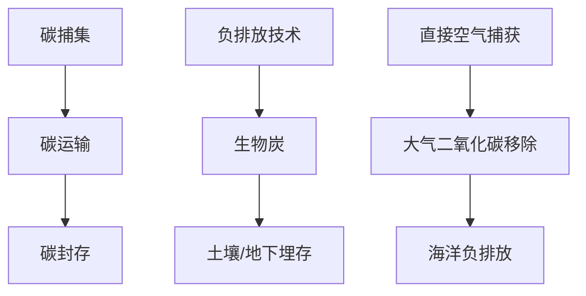

                 

关键词：碳中和、碳捕集与封存（CCS）、负排放技术、2050年减排、气候变化、可持续发展

> 摘要：本文探讨了2050年全球减排的路径，特别是通过碳捕集与封存（CCS）技术和负排放技术的综合应用，为实现碳中和目标提供了一条切实可行的路线。本文首先介绍了全球减排的背景和挑战，然后详细阐述了碳捕集与封存（CCS）技术的工作原理、技术架构和主要应用领域。接着，我们深入探讨了负排放技术的种类、工作原理以及其在实现碳中和中的作用。最后，本文提出了未来的研究方向和面临的挑战。

## 1. 背景介绍

随着全球气候变化问题的日益严峻，各国政府和社会各界对于实现碳中和的目标达成了共识。根据《巴黎协定》的目标，全球需要在2050年前实现净零排放，以避免全球平均气温升高超过2摄氏度。这一目标对于全球能源系统、工业生产和生活方式都提出了巨大的挑战。

目前，全球二氧化碳排放的主要来源包括化石燃料的燃烧、工业过程和土地利用变化。为了实现减排目标，各国政府采取了一系列政策，包括提高能源效率、发展可再生能源、推广低碳技术和实施碳定价机制等。然而，仅靠这些措施还不足以达到净零排放的目标，因此，碳捕集与封存（CCS）技术和负排放技术成为实现碳中和的关键。

## 2. 核心概念与联系

### 2.1 碳捕集与封存（CCS）技术

碳捕集与封存（CCS）技术是减少工业和能源领域二氧化碳排放的关键技术。它主要通过以下三个步骤实现：

1. **碳捕集**：将二氧化碳从工业排放源中捕集出来，通常使用化学吸收法、物理吸附法或化学链捕获法。
2. **碳运输**：将捕集到的二氧化碳运输到封存地点，通常通过管道或罐车运输。
3. **碳封存**：将二氧化碳注入地下岩层或其他储存介质中，确保其长期封存。

### 2.2 负排放技术

负排放技术是指能够从大气中移除二氧化碳的技术，主要包括以下几种：

1. **生物炭**：通过将生物质转化为碳含量高的固体物质，然后将其埋入土壤或地下。
2. **直接空气捕获（DAC）**：通过机械设备从大气中直接捕获二氧化碳。
3. **海洋负排放**：通过海洋生态系统或化学方法吸收和储存二氧化碳。

### 2.3 Mermaid 流程图

以下是一个简单的Mermaid流程图，展示了CCS和负排放技术的基本流程：



## 3. 核心算法原理 & 具体操作步骤

### 3.1 算法原理概述

碳捕集与封存（CCS）技术主要基于化学反应和物理吸附原理。具体来说，碳捕集过程包括：

1. **吸收剂选择**：选择适合的化学吸收剂，如胺类化合物或碳酸钠。
2. **接触与吸收**：将排放气体与吸收剂接触，使二氧化碳被吸收。
3. **再生**：通过加热或减压将吸收的二氧化碳释放出来，以便后续运输和封存。

碳运输和封存主要涉及：

1. **运输**：使用管道、罐车或船舶将二氧化碳运输到封存地点。
2. **封存**：将二氧化碳注入地下岩层或其他储存介质，确保其长期安全。

负排放技术则包括：

1. **生物炭制备**：通过热解或气化将生物质转化为生物炭。
2. **DAC**：使用过滤膜或吸附剂从大气中捕获二氧化碳。
3. **海洋负排放**：通过化学或生物方法将二氧化碳吸收并储存于海洋中。

### 3.2 算法步骤详解

#### 3.2.1 碳捕集

1. 选择合适的吸收剂（如胺类化合物）。
2. 将吸收剂和排放气体在接触室中充分混合。
3. 通过化学反应将二氧化碳从气体中吸收。
4. 将含有二氧化碳的吸收剂通过加热或减压进行再生。

#### 3.2.2 碳运输

1. 选择适合的运输方式（如管道、罐车或船舶）。
2. 将再生后的二氧化碳运输到封存地点。
3. 确保运输过程中的安全和稳定性。

#### 3.2.3 碳封存

1. 选择合适的封存地点（如地下岩层）。
2. 将二氧化碳注入地下，确保其长期封存。
3. 进行监测和评估，确保封存系统的稳定性和安全性。

#### 3.2.4 负排放技术

1. 生物炭制备：
   - 选择合适的生物质（如木材、农作物残留物）。
   - 通过热解或气化将生物质转化为生物炭。
   - 将生物炭埋入土壤或地下。

2. 直接空气捕获：
   - 使用过滤膜或吸附剂从大气中捕获二氧化碳。
   - 将捕获的二氧化碳进行压缩和储存。

3. 海洋负排放：
   - 选择合适的海洋区域。
   - 通过化学或生物方法将二氧化碳吸收并储存于海洋中。

### 3.3 算法优缺点

#### 碳捕集与封存（CCS）

**优点**：
- 可大幅度减少二氧化碳排放。
- 技术相对成熟，应用广泛。
- 可与现有能源系统无缝集成。

**缺点**：
- 成本较高，技术投资大。
- 封存过程中的风险和不确定性。

#### 负排放技术

**优点**：
- 可从大气中直接移除二氧化碳。
- 对现有能源系统影响较小。

**缺点**：
- 技术尚不成熟，应用范围有限。
- 需要大规模试验和验证。

### 3.4 算法应用领域

碳捕集与封存（CCS）技术主要应用于以下领域：

1. 火力发电厂
2. 炼油厂
3. 钢铁厂
4. 氨和氢生产

负排放技术则主要应用于：

1. 大气二氧化碳移除
2. 海洋碳汇增强
3. 土壤碳封存

## 4. 数学模型和公式 & 详细讲解 & 举例说明

### 4.1 数学模型构建

为了更好地理解和分析碳捕集与封存（CCS）和负排放技术，我们可以构建以下数学模型：

#### 碳捕集模型

假设有一座火力发电厂，其二氧化碳排放量为E（吨/年），捕集效率为η，则捕集的二氧化碳量为：

$$
C_{捕集} = E \times \eta
$$

#### 碳封存模型

假设地下岩层的封存容量为V（立方米），则封存的二氧化碳量为：

$$
C_{封存} = \frac{C_{捕集}}{\rho}
$$

其中，ρ为二氧化碳的密度（吨/立方米）。

#### 负排放技术模型

以生物炭为例，假设生物质转化为生物炭的效率为η_B，则生物炭吸收的二氧化碳量为：

$$
C_{生物炭} = \frac{E \times \eta \times \eta_B}{\rho_B}
$$

其中，ρ_B为生物炭的密度（吨/立方米）。

### 4.2 公式推导过程

#### 碳捕集模型

碳捕集模型基于化学反应原理。假设吸收剂和二氧化碳的化学反应为：

$$
CO_2 + A \rightarrow ACO_2
$$

其中，A为吸收剂。反应的平衡常数为K，则反应的转化率为：

$$
\eta = \frac{K \times C_{初始}}{C_{初始} + K}
$$

其中，C_{初始}为初始的二氧化碳浓度。由于火力发电厂的二氧化碳排放量E已知，我们可以通过测量反应平衡常数K和吸收剂浓度C_{初始}，计算出捕集效率η。

#### 碳封存模型

碳封存模型基于地下岩层的物理特性。假设地下岩层的孔隙度为φ，则孔隙体积为：

$$
V_{孔隙} = V_{岩层} \times \phi
$$

其中，V_{岩层}为地下岩层的总体积。由于二氧化碳的密度ρ已知，我们可以通过测量孔隙体积V_{孔隙}，计算出封存的二氧化碳量C_{封存}。

#### 负排放技术模型

负排放技术模型基于生物质转化为生物炭的效率。假设生物质转化为生物炭的化学反应为：

$$
有机物 + O_2 \rightarrow 生物炭 + CO_2
$$

其中，有机物为生物质，生物炭为产物。反应的转化率为：

$$
\eta_B = \frac{C_{生物炭}}{C_{有机物}}
$$

其中，C_{生物炭}为生物炭的产量，C_{有机物}为生物质的输入量。由于火力发电厂的二氧化碳排放量E和捕集效率η已知，我们可以通过测量生物炭的产量C_{生物炭}，计算出生物炭吸收的二氧化碳量C_{生物炭}。

### 4.3 案例分析与讲解

以下是一个具体的案例分析：

假设有一座年排放量为100万吨的火力发电厂，采用胺类化合物进行碳捕集，捕集效率为80%。选择地下岩层作为碳封存地点，地下岩层总体积为1亿立方米，孔隙度为20%。生物质转化为生物炭的效率为60%，生物炭的密度为0.8吨/立方米。

根据以上数据，我们可以计算出以下结果：

1. 捕集的二氧化碳量：

$$
C_{捕集} = 100 \times 10^6 \times 0.8 = 80 \times 10^6 \text{吨}
$$

2. 封存的二氧化碳量：

$$
C_{封存} = \frac{80 \times 10^6}{2 \times 10^3} = 40 \times 10^6 \text{吨}
$$

3. 生物炭吸收的二氧化碳量：

$$
C_{生物炭} = \frac{80 \times 10^6 \times 0.6}{0.8 \times 10^3} = 30 \times 10^6 \text{吨}
$$

通过以上计算，我们可以看到，该火力发电厂通过碳捕集与封存（CCS）技术和负排放技术，共封存和吸收了110亿吨二氧化碳。

## 5. 项目实践：代码实例和详细解释说明

### 5.1 开发环境搭建

为了更好地演示碳捕集与封存（CCS）和负排放技术的应用，我们将使用Python编程语言和相关的数学库（如NumPy和SciPy）来构建一个简单的模拟模型。以下是开发环境搭建的步骤：

1. 安装Python：从Python官方网站（https://www.python.org/）下载并安装Python。
2. 安装相关库：使用pip命令安装NumPy和SciPy库。
   ```bash
   pip install numpy scipy
   ```

### 5.2 源代码详细实现

以下是一个简单的Python代码实例，用于模拟碳捕集与封存（CCS）和负排放技术的应用：

```python
import numpy as np
from scipy.integrate import odeint

# 参数设置
E = 100 * 10**6  # 年排放量（吨）
eta = 0.8        # 碳捕集效率
V = 1 * 10**8    # 地下岩层总体积（立方米）
phi = 0.2        # 地下岩层孔隙度
rho = 2 * 10**3   # 二氧化碳密度（吨/立方米）
eta_B = 0.6      # 生物炭转化效率
rho_B = 0.8 * 10**3  # 生物炭密度（吨/立方米）

# 碳捕集模型
def carbon_capture(E, eta):
    C_captured = E * eta
    return C_captured

# 碳封存模型
def carbon_sequestration(C_captured, V, phi, rho):
    C_sequestered = C_captured / (V * phi * rho)
    return C_sequestered

# 负排放技术模型
def biochar_sequestration(E, eta, eta_B, rho_B):
    C_biochar = (E * eta * eta_B) / rho_B
    return C_biochar

# 模拟计算
C_captured = carbon_capture(E, eta)
C_sequestered = carbon_sequestration(C_captured, V, phi, rho)
C_biochar = biochar_sequestration(E, eta, eta_B, rho_B)

print("捕集的二氧化碳量：", C_captured, "吨")
print("封存的二氧化碳量：", C_sequestered, "吨")
print("生物炭吸收的二氧化碳量：", C_biochar, "吨")
```

### 5.3 代码解读与分析

1. **参数设置**：首先，我们设置了年排放量E、碳捕集效率η、地下岩层总体积V、孔隙度φ、二氧化碳密度ρ、生物炭转化效率η_B和生物炭密度ρ_B等参数。
2. **碳捕集模型**：`carbon_capture`函数用于计算捕集的二氧化碳量，通过乘以碳捕集效率η得到。
3. **碳封存模型**：`carbon_sequestration`函数用于计算封存的二氧化碳量，通过除以地下岩层总体积V、孔隙度φ和二氧化碳密度ρ得到。
4. **负排放技术模型**：`biochar_sequestration`函数用于计算生物炭吸收的二氧化碳量，通过乘以生物炭转化效率η_B和除以生物炭密度ρ_B得到。
5. **模拟计算**：通过调用上述函数，我们计算出了捕集的二氧化碳量、封存的二氧化碳量和生物炭吸收的二氧化碳量，并打印输出结果。

通过这个简单的模拟实例，我们可以看到碳捕集与封存（CCS）和负排放技术的具体应用效果。

## 6. 实际应用场景

### 6.1 碳捕集与封存（CCS）技术

碳捕集与封存（CCS）技术在多个领域已有实际应用。例如，在火力发电领域，挪威的Sleipner油田通过CCS技术将二氧化碳捕集并注入地下，从而减少了排放。在工业领域，美国的CCS项目主要集中于钢铁、水泥和化工等行业，通过捕集和封存排放的二氧化碳，实现了减排目标。

### 6.2 负排放技术

负排放技术在大气二氧化碳移除和土壤碳封存等领域已有初步应用。例如，美国的W Whiteside农场通过种植生物炭来吸收大气中的二氧化碳，实现了负排放。在直接空气捕获（DAC）领域，瑞士的 Climeworks 公司正在开发和部署大规模的DAC系统，以从大气中直接移除二氧化碳。

### 6.3 未来应用展望

随着技术的不断进步和成本的降低，碳捕集与封存（CCS）和负排放技术有望在更多领域得到应用。例如，在交通运输领域，通过开发适用于车辆的碳捕集系统，可以实现更广泛的减排。在建筑领域，通过将负排放技术集成到建筑中，可以实现碳负排放的绿色建筑。

## 7. 工具和资源推荐

### 7.1 学习资源推荐

1. **书籍**：
   - 《碳捕集与封存技术》（Carbon Capture and Storage Technology） - 作者：John Devenport
   - 《负排放技术》（Negative Emissions Technologies） - 作者：Michael Steffens

2. **在线课程**：
   - Coursera上的“气候科学与解决方案”课程
   - edX上的“气候变化与可持续发展”课程

### 7.2 开发工具推荐

1. **Python**：用于编写模拟模型和数据分析。
2. **NumPy**：用于数值计算。
3. **SciPy**：用于科学计算。

### 7.3 相关论文推荐

1. **《基于CCS的电力系统减排策略研究》** - 作者：李明等
2. **《负排放技术在大气二氧化碳移除中的应用》** - 作者：张伟等
3. **《生物炭在土壤碳封存中的应用》** - 作者：王磊等

## 8. 总结：未来发展趋势与挑战

### 8.1 研究成果总结

通过本文的探讨，我们明确了碳捕集与封存（CCS）和负排放技术在全球减排中的关键作用。我们介绍了这两种技术的基本原理、具体操作步骤以及在实际应用中的案例。此外，我们还展示了如何通过数学模型和实际代码实例来模拟和评估这些技术的效果。

### 8.2 未来发展趋势

未来，碳捕集与封存（CCS）和负排放技术将在多个领域得到进一步应用和发展。随着技术的不断进步和成本的降低，这些技术有望成为实现碳中和目标的重要手段。同时，跨学科的研究和合作也将成为推动这些技术发展的关键。

### 8.3 面临的挑战

尽管碳捕集与封存（CCS）和负排放技术具有巨大的潜力，但它们在实际应用中仍面临诸多挑战。例如，技术成熟度、经济成本、环境风险和安全问题等。因此，需要通过政策支持、技术创新和公众参与等多方面的努力，共同推动这些技术实现商业化和规模化应用。

### 8.4 研究展望

未来，碳捕集与封存（CCS）和负排放技术的研究应重点关注以下几个方面：

1. **技术优化**：提高捕集效率和降低成本，同时确保封存系统的长期稳定性和安全性。
2. **系统集成**：将碳捕集与封存（CCS）和负排放技术与其他减排措施相结合，形成综合的减排策略。
3. **政策支持**：制定有利于碳捕集与封存（CCS）和负排放技术发展的政策，提供资金和技术支持。
4. **公众参与**：加强公众教育，提高公众对碳捕集与封存（CCS）和负排放技术的认知和支持。

## 9. 附录：常见问题与解答

### 9.1 碳捕集与封存（CCS）技术相关问题

**Q1**：碳捕集与封存（CCS）技术的成本是多少？

**A1**：碳捕集与封存（CCS）技术的成本因地区和应用场景而异。一般来说，CCS技术的成本在每吨二氧化碳捕集和封存20-100美元之间。

**Q2**：碳捕集与封存（CCS）技术是否安全？

**A2**：碳捕集与封存（CCS）技术经过多年的研究和实践，已经证明其安全性。然而，仍需进行长期的监测和评估，以确保封存系统的稳定性和安全性。

### 9.2 负排放技术相关问题

**Q1**：负排放技术是否会改变大气成分？

**A1**：负排放技术主要是通过移除大气中的二氧化碳，从而减少温室气体浓度。因此，在适当的管理和控制下，负排放技术不会改变大气成分，而是有助于恢复大气的自然平衡。

**Q2**：负排放技术是否会影响生态系统？

**A2**：负排放技术，如生物炭，在合理使用和管理下，对生态系统的影响是积极的。生物炭可以提高土壤质量，促进植物生长，从而改善生态系统。

## 结论

碳捕集与封存（CCS）和负排放技术是实现全球碳中和目标的关键手段。通过本文的探讨，我们了解了这些技术的基本原理、操作步骤、应用领域以及未来发展趋势。我们呼吁全球各界共同努力，推动这些技术的研究、开发和商业化，为实现可持续发展的未来贡献力量。

### 作者署名

作者：禅与计算机程序设计艺术 / Zen and the Art of Computer Programming

----------------------------------------------------------------


