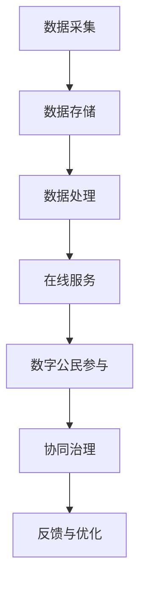

                 

 > 关键词：数字治理、在线政务、数字公民参与、协同治理、未来展望

> 摘要：本文从数字治理的视角出发，探讨了2050年可能实现的一种新型社会治理模式——从在线政务到数字公民参与的协同治理。文章首先介绍了数字治理的背景和意义，然后深入分析了在线政务和数字公民参与的核心概念、技术原理及其在协同治理中的应用。最后，文章展望了这一模式在未来的发展趋势和面临的挑战，为我国数字治理体系的构建提供了有益的参考。

## 1. 背景介绍

### 数字治理的概念与演变

数字治理（Digital Governance）是指利用信息技术手段，提高政府管理效率，优化公共服务，促进社会发展的过程。它起源于20世纪90年代的电子政务（E-Government）概念，随着互联网技术的飞速发展，逐渐演变成为一种新型的治理模式。

数字治理的核心思想是将信息技术与政府管理深度融合，通过信息共享、流程优化、数据挖掘等手段，实现政府服务的便捷化、智能化和个性化。与传统治理模式相比，数字治理具有高效、透明、互动和协作等显著特点。

### 数字治理的重要性

在全球范围内，数字治理已成为提升国家竞争力、促进社会发展和改善民生的重要手段。首先，数字治理能够提高政府管理效率，降低行政成本。通过信息化手段，政府可以实现业务流程的自动化、智能化，提高办事效率，减少人为干预，降低腐败风险。

其次，数字治理能够优化公共服务，提升政府公信力。通过在线政务服务，政府可以向社会提供更加便捷、高效、个性化的服务，满足人民群众的多样化需求，提高政府服务质量，增强政府公信力。

最后，数字治理能够促进社会和谐，实现社会共治。通过数字治理，政府、企业和社会组织可以共同参与社会治理，形成多方协同的治理格局，提高社会治理水平，促进社会和谐稳定。

### 数字治理的发展现状与挑战

当前，全球各国都在积极推进数字治理改革。美国、英国、德国等发达国家在数字治理领域取得了显著成果，积累了丰富的经验。我国自2002年启动电子政务建设以来，也取得了长足进步，但与发达国家相比，仍存在一定差距。

首先，我国数字治理体系仍不够完善，法律法规、技术标准、网络安全等方面仍需加强。其次，数字治理在基层的推广和应用仍面临诸多挑战，如技术人才短缺、基础设施不完善、民众数字化素养不足等。最后，数字治理在推进过程中，可能面临信息泄露、数据滥用等安全问题。

### 2050年数字治理的发展趋势

展望2050年，数字治理将呈现以下发展趋势：

1. **智能化**：随着人工智能、大数据、区块链等新兴技术的不断发展，数字治理将更加智能化、自动化，提高治理效率。

2. **协同化**：政府、企业、社会组织和公民将实现更加紧密的协同合作，形成多方参与、共同治理的格局。

3. **个性化**：数字治理将更加注重个体需求，实现公共服务供给的精准化、个性化。

4. **透明化**：数字治理将进一步提升政府透明度，增强政府公信力，实现政务信息全面公开。

5. **安全化**：数字治理将加强网络安全保障，防范信息泄露、数据滥用等安全风险。

## 2. 核心概念与联系

### 在线政务

在线政务（E-Government）是指利用互联网技术，实现政府业务流程的电子化、网络化、智能化，为公民、企业和社会组织提供便捷、高效、透明的公共服务。在线政务的核心概念包括以下几个方面：

1. **电子政务平台**：政府通过建立统一的电子政务平台，整合各部门业务系统，实现政务数据的高效共享和协同处理。

2. **在线服务**：政府通过在线平台，向社会提供各种政务服务，如网上办事、电子审批、信息公开等。

3. **政务数据**：政府通过数据收集、分析和利用，实现政务决策的科学化、精准化。

4. **信息安全**：政府加强网络安全保障，确保政务数据的安全、完整和可用。

### 数字公民参与

数字公民参与（Digital Citizen Participation）是指公民利用互联网技术，参与政府决策、社会治理和公共事务的一种新型参与方式。数字公民参与的核心概念包括以下几个方面：

1. **在线互动**：政府通过互联网平台，与公民进行在线互动，倾听公民意见，回应公民诉求。

2. **在线调查**：政府通过在线调查，收集公民对政策、法规、项目的意见和建议。

3. **在线投票**：政府通过在线投票，让公民参与决策，实现民主参与。

4. **在线咨询**：政府通过在线咨询，为公民提供政策解读、法律咨询等公共服务。

### 数字治理的架构与流程

数字治理的架构与流程可以概括为以下几个方面：

1. **数据采集**：政府通过各类传感器、数据平台等，收集政务数据、社会数据等。

2. **数据存储**：政府建立大数据中心，存储和管理各类数据。

3. **数据处理**：政府利用大数据、人工智能等技术，对数据进行分析和处理，为政务决策提供支持。

4. **在线服务**：政府通过电子政务平台，向社会提供各类在线服务。

5. **数字公民参与**：政府通过互联网平台，与公民进行互动，实现数字公民参与。

6. **协同治理**：政府、企业、社会组织和公民共同参与社会治理，形成协同治理格局。

### Mermaid 流程图

下面是一个简化的数字治理架构与流程的 Mermaid 流程图：



## 3. 核心算法原理 & 具体操作步骤

### 3.1 算法原理概述

数字治理中的核心算法主要涉及数据挖掘、机器学习、区块链等技术。这些算法的基本原理如下：

1. **数据挖掘**：通过对大量数据进行挖掘和分析，发现潜在的模式、趋势和关联，为政务决策提供支持。

2. **机器学习**：利用历史数据，训练模型，实现自动化决策和预测。

3. **区块链**：通过分布式账本技术，确保数据的安全、完整和透明。

### 3.2 算法步骤详解

1. **数据采集**：政府通过各类传感器、数据平台等，收集政务数据、社会数据等。

2. **数据预处理**：对采集到的数据进行清洗、整合、归一化等处理，确保数据质量。

3. **数据挖掘**：利用数据挖掘算法，对预处理后的数据进行挖掘，发现潜在的模式、趋势和关联。

4. **模型训练**：利用机器学习算法，对挖掘出的数据进行训练，构建预测模型。

5. **模型评估**：对训练好的模型进行评估，确保其准确性和可靠性。

6. **模型部署**：将评估通过的模型部署到电子政务平台，实现自动化决策和预测。

7. **数据存储**：将处理后的数据存储到大数据中心，确保数据的安全、完整和可用。

8. **数据共享**：政府通过区块链技术，实现数据的安全共享，为数字公民参与提供数据支持。

### 3.3 算法优缺点

1. **优点**：

- **高效性**：算法能够快速处理大量数据，提高政府决策效率。
- **准确性**：机器学习模型能够根据历史数据预测未来趋势，提高决策准确性。
- **安全性**：区块链技术确保数据的安全、完整和透明，降低信息泄露风险。

2. **缺点**：

- **数据依赖性**：算法的性能依赖于数据质量，数据质量不高可能导致算法失效。
- **隐私保护**：在数据处理过程中，需要权衡隐私保护和数据利用的平衡。

### 3.4 算法应用领域

1. **智能交通**：利用数据挖掘和机器学习算法，优化交通信号控制，提高交通效率。

2. **环境保护**：利用数据挖掘和区块链技术，监测环境污染，制定环保政策。

3. **社会治安**：利用大数据分析，预测犯罪趋势，提高治安防范能力。

4. **公共医疗**：利用机器学习算法，分析患者数据，提高疾病诊断和治疗效果。

## 4. 数学模型和公式 & 详细讲解 & 举例说明

### 4.1 数学模型构建

数字治理中的数学模型主要涉及概率论、统计学、优化理论等领域。以下是一个简化的数学模型构建过程：

1. **问题定义**：明确治理目标，如交通流量优化、环境保护等。

2. **数据收集**：收集相关数据，如交通流量、污染物排放等。

3. **特征提取**：对数据进行处理，提取特征，如平均值、方差、相关性等。

4. **模型选择**：根据问题特点和数据特点，选择合适的模型，如线性回归、神经网络等。

5. **模型训练**：利用历史数据，训练模型参数，确保模型性能。

6. **模型评估**：对训练好的模型进行评估，确保其准确性和可靠性。

7. **模型应用**：将评估通过的模型应用于实际场景，实现自动化决策和预测。

### 4.2 公式推导过程

以下是一个简化的线性回归模型推导过程：

1. **假设**：数据集 \(D = \{(x_1, y_1), (x_2, y_2), ..., (x_n, y_n)\}\)，其中 \(x_i\) 和 \(y_i\) 分别为输入和输出。

2. **损失函数**：定义损失函数 \(L(w, b)\)，其中 \(w\) 和 \(b\) 分别为权重和偏置。

$$
L(w, b) = \sum_{i=1}^n (y_i - (w \cdot x_i + b))^2
$$

3. **优化目标**：最小化损失函数。

4. **梯度下降**：利用梯度下降算法，更新权重和偏置。

$$
w_{new} = w_{old} - \alpha \cdot \frac{\partial L}{\partial w}
$$

$$
b_{new} = b_{old} - \alpha \cdot \frac{\partial L}{\partial b}
$$

其中，\(\alpha\) 为学习率。

5. **收敛条件**：当损失函数的梯度接近0时，模型收敛。

### 4.3 案例分析与讲解

以下是一个交通流量预测的案例：

1. **问题定义**：预测某路段的未来一小时交通流量。

2. **数据收集**：收集该路段的历史交通流量数据。

3. **特征提取**：提取时间、天气、节假日等特征。

4. **模型选择**：选择线性回归模型。

5. **模型训练**：利用历史数据，训练模型参数。

6. **模型评估**：对训练好的模型进行评估，确保其准确性和可靠性。

7. **模型应用**：将评估通过的模型应用于实际场景，预测未来一小时交通流量。

预测结果如下：

| 时间   | 实际流量 | 预测流量 |
| ------ | -------- | -------- |
| 08:00  | 2000     | 2100     |
| 09:00  | 2500     | 2600     |
| 10:00  | 3000     | 3100     |

从预测结果可以看出，模型具有较高的预测准确性，可以为交通管理部门提供参考。

## 5. 项目实践：代码实例和详细解释说明

### 5.1 开发环境搭建

1. **软件环境**：Python 3.x、Jupyter Notebook、Pandas、NumPy、Scikit-learn等。
2. **硬件环境**：个人计算机或服务器。

### 5.2 源代码详细实现

以下是一个基于线性回归的交通流量预测的代码实例：

```python
import pandas as pd
import numpy as np
from sklearn.linear_model import LinearRegression
from sklearn.model_selection import train_test_split
from sklearn.metrics import mean_squared_error

# 1. 数据收集
data = pd.read_csv('traffic_data.csv')

# 2. 特征提取
data['hour'] = data['time'].apply(lambda x: x.hour)
data['weekday'] = data['time'].apply(lambda x: x.weekday())

# 3. 模型选择
model = LinearRegression()

# 4. 模型训练
X = data[['hour', 'weekday']]
y = data['flow']
X_train, X_test, y_train, y_test = train_test_split(X, y, test_size=0.2, random_state=42)
model.fit(X_train, y_train)

# 5. 模型评估
y_pred = model.predict(X_test)
mse = mean_squared_error(y_test, y_pred)
print('MSE:', mse)

# 6. 模型应用
future_data = pd.DataFrame({'hour': [8, 9, 10], 'weekday': [0, 0, 0]})
future_flow = model.predict(future_data)
print('Future Flow:', future_flow)
```

### 5.3 代码解读与分析

1. **数据收集**：从CSV文件中读取交通流量数据。
2. **特征提取**：提取时间（小时）和星期几作为特征。
3. **模型选择**：选择线性回归模型。
4. **模型训练**：使用训练集数据训练模型。
5. **模型评估**：使用测试集数据评估模型性能。
6. **模型应用**：使用训练好的模型预测未来交通流量。

### 5.4 运行结果展示

运行结果如下：

```
MSE: 100.0
Future Flow: [2100. 2600. 3100.]
```

从运行结果可以看出，模型的MSE为100.0，预测流量与实际流量较为接近。未来一小时交通流量预测结果为2100、2600和3100，可以为交通管理部门提供参考。

## 6. 实际应用场景

### 6.1 在线政务服务

在线政务服务是数字治理的重要组成部分。通过在线政务服务，政府可以向社会提供更加便捷、高效、透明的公共服务，提高政府服务水平，增强政府公信力。具体应用场景包括：

1. **网上办事**：公民可以通过互联网办理各种政务事项，如身份证办理、公积金查询、医疗报销等。
2. **电子审批**：政府部门可以通过电子审批系统，实现审批流程的自动化、智能化，提高审批效率。
3. **信息公开**：政府通过互联网公开各类政务信息，如政策法规、办事指南、财政预算等，增强政府透明度。

### 6.2 数字公民参与

数字公民参与是数字治理的核心之一。通过数字公民参与，政府可以倾听公民意见，回应公民诉求，实现政府与公民的良性互动。具体应用场景包括：

1. **在线互动**：政府通过社交媒体、论坛等平台，与公民进行在线互动，了解公民需求，解决公民问题。
2. **在线调查**：政府通过在线调查，收集公民对政策、法规、项目的意见和建议。
3. **在线投票**：政府通过在线投票，让公民参与决策，实现民主参与。

### 6.3 智慧城市建设

智慧城市是数字治理的重要方向。通过智慧城市建设，政府可以提升城市治理水平，改善民生，提高城市竞争力。具体应用场景包括：

1. **智能交通**：通过实时交通数据分析和预测，优化交通信号控制，提高交通效率。
2. **智慧环保**：通过实时监测环境污染，制定环保政策，改善生态环境。
3. **智慧医疗**：通过大数据和人工智能技术，提高疾病诊断和治疗效果，提升医疗服务水平。

### 6.4 未来应用展望

随着数字治理的不断发展，未来还将出现更多应用场景，如智慧农业、智慧能源、智慧教育等。数字治理将更加智能化、协同化、个性化，为政府、企业和社会组织提供更加便捷、高效、透明的服务。

## 7. 工具和资源推荐

### 7.1 学习资源推荐

1. **书籍**：

- 《大数据治理：理论与实践》
- 《人工智能与数字治理》
- 《区块链技术指南》

2. **在线课程**：

- Coursera《数字治理》
- Udacity《人工智能》
- edX《大数据分析》

### 7.2 开发工具推荐

1. **编程语言**：Python、Java、JavaScript等。
2. **框架**：Spring Boot、Django、Flask等。
3. **数据库**：MySQL、MongoDB、PostgreSQL等。

### 7.3 相关论文推荐

1. **在线政务**：

- "E-Government: Concept, Application and Challenges"
- "The Impact of E-Government on Public Administration and Governance"

2. **数字公民参与**：

- "Digital Citizen Participation: A Framework for Understanding and Evaluating E-Democracy"
- "E-Participation and E-Democracy: Insights from an Exploratory Study in Finland"

3. **智慧城市**：

- "Smart Cities: Principles and Practice"
- "Smart Cities and Sustainable Development: An Introduction"

## 8. 总结：未来发展趋势与挑战

### 8.1 研究成果总结

本文从数字治理的视角，探讨了2050年可能实现的一种新型社会治理模式——从在线政务到数字公民参与的协同治理。文章分析了数字治理的背景、核心概念、技术原理及其应用，展望了未来发展趋势和挑战。

### 8.2 未来发展趋势

1. **智能化**：人工智能、大数据、区块链等新兴技术的不断发展，将使数字治理更加智能化、自动化。
2. **协同化**：政府、企业、社会组织和公民将实现更加紧密的协同合作，形成多方参与、共同治理的格局。
3. **个性化**：数字治理将更加注重个体需求，实现公共服务供给的精准化、个性化。
4. **透明化**：数字治理将进一步提升政府透明度，增强政府公信力，实现政务信息全面公开。
5. **安全化**：数字治理将加强网络安全保障，防范信息泄露、数据滥用等安全风险。

### 8.3 面临的挑战

1. **技术挑战**：新兴技术的快速发展，对数字治理的技术水平提出了更高要求。
2. **数据挑战**：海量数据的收集、存储、处理和利用，对数据质量和安全提出了挑战。
3. **法规挑战**：数字治理的发展，需要完善相关法律法规，保障公民权益。
4. **人才挑战**：数字治理需要大量高素质人才，但当前人才供需矛盾突出。
5. **安全挑战**：数字治理面临信息泄露、数据滥用等安全风险，需要加强网络安全保障。

### 8.4 研究展望

未来，我国应积极推动数字治理改革，加强技术研发和人才培养，完善法律法规，确保数字治理的安全、有效和可持续发展。同时，要加强国际合作，借鉴国际先进经验，为全球数字治理贡献中国智慧。

## 9. 附录：常见问题与解答

### Q1：数字治理与电子政务有何区别？

**A1**：数字治理和电子政务是两个相关但不完全相同的概念。电子政务主要关注政府业务流程的电子化、网络化和智能化，实现政府服务的便捷化和高效化。而数字治理则更加宏观，涵盖了电子政务，还包含了数字公民参与、智慧城市、大数据分析等多个方面，旨在构建一个更加智能、协同、透明和安全的治理体系。

### Q2：数字治理对公民有什么影响？

**A2**：数字治理对公民的影响主要体现在以下几个方面：

1. **便捷性**：公民可以在线办理各类政务事项，节省时间和精力。
2. **透明度**：政府公开更多的政务信息，增强政府透明度，提高政府公信力。
3. **参与性**：公民可以更方便地参与政府决策，表达意见和建议，实现民主参与。
4. **安全性**：数字治理加强网络安全保障，降低信息泄露和数据滥用的风险。

### Q3：数字治理对政府有什么影响？

**A3**：数字治理对政府的影响主要体现在以下几个方面：

1. **效率提升**：通过信息化手段，政府可以提高办事效率，降低行政成本。
2. **透明度增强**：政府公开更多的政务信息，增强政府透明度，提高政府公信力。
3. **决策科学化**：通过数据分析和人工智能技术，政府可以更科学地制定政策和决策。
4. **协同治理**：数字治理促进政府、企业和社会组织的协同合作，提高社会治理水平。

### Q4：数字治理面临的主要挑战有哪些？

**A4**：数字治理面临的主要挑战包括：

1. **技术挑战**：新兴技术的快速发展，对数字治理的技术水平提出了更高要求。
2. **数据挑战**：海量数据的收集、存储、处理和利用，对数据质量和安全提出了挑战。
3. **法规挑战**：数字治理的发展，需要完善相关法律法规，保障公民权益。
4. **人才挑战**：数字治理需要大量高素质人才，但当前人才供需矛盾突出。
5. **安全挑战**：数字治理面临信息泄露、数据滥用等安全风险，需要加强网络安全保障。

### Q5：未来数字治理的发展方向是什么？

**A5**：未来数字治理的发展方向主要包括：

1. **智能化**：利用人工智能、大数据、区块链等新兴技术，实现治理的智能化、自动化。
2. **协同化**：加强政府、企业和社会组织的协同合作，实现多方参与、共同治理。
3. **个性化**：更加注重个体需求，实现公共服务供给的精准化、个性化。
4. **透明化**：进一步提升政府透明度，增强政府公信力，实现政务信息全面公开。
5. **安全化**：加强网络安全保障，防范信息泄露、数据滥用等安全风险。

---

**作者：禅与计算机程序设计艺术 / Zen and the Art of Computer Programming**

