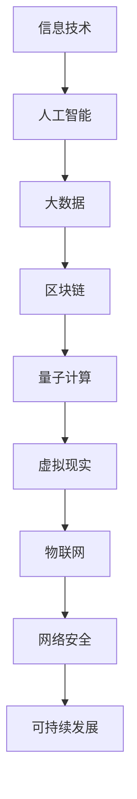

                 

未来学（Futurology）是一门研究未来可能发生的事情的学科，它结合了历史学、社会学、经济学、科技发展和哲学等多个领域，以预测和分析未来的发展趋势和潜在影响。本文旨在探讨2050年的未来学，从预测到创造的前瞻性思维，并重点关注信息技术领域的发展。本文将分为以下几个部分：

## 关键词

- 未来学
- 预测
- 创造
- 信息技术
- 前瞻性思维

## 摘要

本文通过分析信息技术在过去几十年中的快速发展，预测了2050年信息技术可能达到的新高度。从量子计算到人工智能，从虚拟现实到区块链，每一个领域都将发生翻天覆地的变化。本文将探讨这些技术如何影响社会、经济和人类生活的方方面面，并提出未来学研究的挑战和机会。

## 1. 背景介绍

### 1.1 信息技术的发展历程

自20世纪中叶以来，信息技术经历了飞速的发展。从最初的电子计算机到个人电脑，再到互联网和移动互联网，信息技术已经成为现代社会不可或缺的一部分。每一次技术的迭代都带来了生产力的巨大提升和社会结构的深刻变革。

### 1.2 信息技术对社会的影响

信息技术不仅改变了人们的生活和工作方式，也对社会经济结构产生了深远影响。电子商务的兴起改变了传统商业的运作模式，在线教育和远程工作的普及打破了地理界限，信息技术在全球范围内的普及推动了数字经济的快速发展。

## 2. 核心概念与联系

为了更好地理解未来信息技术的发展，我们首先需要明确几个核心概念，并探讨它们之间的联系。以下是使用Mermaid绘制的流程图：



### 2.1 人工智能

人工智能（AI）是信息技术领域中最具前景的分支之一。它通过模拟人类智能，实现了机器在感知、理解、学习和决策等方面的能力。人工智能的快速发展将极大地改变各行各业，从自动化生产到智能医疗，从自动驾驶到智能客服。

### 2.2 大数据

大数据（Big Data）指的是大规模、复杂的数据集合。随着信息技术的进步，我们能够收集、存储和分析的数据量呈指数级增长。大数据的广泛应用使得各行业能够更准确地预测市场趋势、优化生产流程和提供个性化服务。

### 2.3 区块链

区块链（Blockchain）是一种分布式数据库技术，它通过加密算法和共识机制确保数据的安全性和不可篡改性。区块链在金融、物流、医疗等领域具有广泛的应用潜力，能够提高交易效率、降低成本和增强信任。

### 2.4 量子计算

量子计算（Quantum Computing）利用量子位（qubit）进行信息处理，相比传统计算机，它具有更高的计算速度和并行性。量子计算在加密解密、复杂优化和材料科学等领域具有重要应用。

### 2.5 虚拟现实

虚拟现实（Virtual Reality，VR）通过计算机模拟生成三维环境，用户可以通过头戴设备等设备与之互动。虚拟现实在教育、娱乐、远程工作等领域具有巨大潜力，能够提供沉浸式的体验。

### 2.6 物联网

物联网（Internet of Things，IoT）将各种物理设备连接到互联网，实现数据的实时传输和智能控制。物联网在智能家居、智能城市、智能农业等领域具有广泛的应用，能够提高资源利用效率和生产力。

### 2.7 网络安全

随着信息技术的发展，网络安全（Cybersecurity）变得越来越重要。网络安全技术通过加密、身份验证和入侵检测等方式保护网络和数据的安全，防止恶意攻击和隐私泄露。

### 2.8 可持续发展

可持续发展（Sustainable Development）是指在满足当前需求的同时，不损害后代满足其需求的能力。信息技术在可持续发展中发挥着关键作用，从节能减排到资源优化，从环境保护到社会公平。

## 3. 核心算法原理 & 具体操作步骤

### 3.1 算法原理概述

在未来信息技术的发展中，核心算法的原理和具体操作步骤将起到至关重要的作用。以下是几个关键算法的原理概述：

### 3.2 算法步骤详解

#### 3.2.1 人工智能算法

人工智能算法通常包括以下几个步骤：

1. 数据收集：收集相关的数据集。
2. 数据预处理：清洗和规范化数据。
3. 特征提取：从数据中提取有用的特征。
4. 模型训练：使用训练数据集训练模型。
5. 模型评估：使用验证数据集评估模型性能。
6. 模型部署：将模型应用到实际场景中。

#### 3.2.2 大数据分析算法

大数据分析算法通常包括以下几个步骤：

1. 数据采集：收集各种来源的数据。
2. 数据存储：将数据存储在分布式系统中。
3. 数据清洗：处理缺失值、异常值和重复值。
4. 数据整合：将不同来源的数据进行整合。
5. 数据分析：使用统计方法和机器学习方法分析数据。
6. 数据可视化：将分析结果以图表等形式展示。

#### 3.2.3 区块链算法

区块链算法主要包括以下几个步骤：

1. 数据加密：使用非对称加密算法对数据进行加密。
2. 数据存储：将加密后的数据存储在区块链中。
3. 共识机制：通过共识机制确保数据的一致性和安全性。
4. 智能合约：编写和执行智能合约。
5. 数据查询：通过区块链接口查询数据。

#### 3.2.4 量子计算算法

量子计算算法主要包括以下几个步骤：

1. 量子初始化：初始化量子比特。
2. 量子门操作：使用量子门进行操作。
3. 量子叠加与纠缠：实现量子比特的叠加和纠缠。
4. 量子测量：测量量子比特的状态。
5. 量子算法执行：执行特定的量子算法。

#### 3.2.5 虚拟现实算法

虚拟现实算法主要包括以下几个步骤：

1. 场景建模：创建虚拟现实场景。
2. 输入处理：处理用户输入，如手势、声音等。
3. 交互反馈：实时响应用户的交互。
4. 渲染：渲染虚拟现实场景。
5. 输出：将虚拟现实场景展示给用户。

#### 3.2.6 物联网算法

物联网算法主要包括以下几个步骤：

1. 设备接入：将物联网设备接入网络。
2. 数据采集：收集设备生成的数据。
3. 数据传输：将数据传输到中心服务器。
4. 数据处理：处理和分析收集到的数据。
5. 决策执行：根据分析结果执行相应的操作。

#### 3.2.7 网络安全算法

网络安全算法主要包括以下几个步骤：

1. 加密算法：使用加密算法保护数据的安全性。
2. 认证算法：使用认证算法验证用户的身份。
3. 入侵检测：实时监测网络流量，检测入侵行为。
4. 安全响应：在检测到入侵行为时采取相应的安全措施。
5. 安全审计：定期进行安全审计，确保系统的安全性。

#### 3.2.8 可持续发展算法

可持续发展算法主要包括以下几个步骤：

1. 数据收集：收集与环境、社会和经济相关的数据。
2. 数据分析：分析数据，识别可持续发展的问题和机会。
3. 决策支持：为决策者提供数据驱动的决策支持。
4. 行动计划：制定可持续发展的行动计划。
5. 监测与评估：监测行动计划的效果，进行定期评估。

### 3.3 算法优缺点

每种算法都有其独特的优缺点，以下是几种主要算法的优缺点分析：

#### 3.3.1 人工智能算法

优点：

- 高效：人工智能算法能够快速处理大量数据。
- 自适应：人工智能算法可以根据数据更新和学习。
- 通用性：人工智能算法可以应用于各种领域。

缺点：

- 需要大量数据：人工智能算法通常需要大量高质量的数据进行训练。
- 解释性差：人工智能算法的结果往往难以解释。

#### 3.3.2 大数据分析算法

优点：

- 实时性：大数据分析算法可以实时处理大量数据。
- 综合性：大数据分析算法可以从不同角度分析数据。
- 实用性：大数据分析算法可以为各种行业提供决策支持。

缺点：

- 数据质量问题：大数据分析算法对数据质量要求较高，数据质量问题可能导致分析结果不准确。
- 隐私问题：大数据分析算法可能涉及到个人隐私问题。

#### 3.3.3 区块链算法

优点：

- 安全性：区块链算法通过加密和共识机制确保数据的安全性。
- 透明性：区块链算法的所有交易记录都是公开透明的。
- 去中心化：区块链算法不需要中心化的机构进行管理。

缺点：

- 性能问题：区块链算法的性能相对较低，不适合处理大量交易。
- 管理复杂度：区块链算法的管理和运营相对复杂。

#### 3.3.4 量子计算算法

优点：

- 高速计算：量子计算算法具有极高的计算速度。
- 并行性：量子计算算法可以利用量子叠加和纠缠实现并行计算。

缺点：

- 稳定性问题：量子计算算法对环境稳定性要求较高。
- 实施难度：量子计算算法的实施难度较大。

#### 3.3.5 虚拟现实算法

优点：

- 沉浸式体验：虚拟现实算法可以提供沉浸式的体验。
- 实用性：虚拟现实算法可以应用于教育、娱乐和远程工作等领域。

缺点：

- 成本问题：虚拟现实设备的成本较高。
- 技术成熟度：虚拟现实技术尚未完全成熟。

#### 3.3.6 物联网算法

优点：

- 高效性：物联网算法可以提高设备的运行效率。
- 可靠性：物联网算法可以提高系统的可靠性。
- 实时性：物联网算法可以实时处理数据。

缺点：

- 数据质量问题：物联网算法对数据质量要求较高。
- 网络安全问题：物联网算法需要解决网络安全问题。

#### 3.3.7 网络安全算法

优点：

- 安全性：网络安全算法可以保护网络和数据的安全。
- 实时性：网络安全算法可以实时监测网络流量。
- 可扩展性：网络安全算法可以根据需要扩展功能。

缺点：

- 高成本：网络安全算法可能需要较高的成本。
- 难以防范新型攻击：新型攻击手段可能难以防范。

#### 3.3.8 可持续发展算法

优点：

- 数据驱动的决策支持：可持续发展算法可以提供数据驱动的决策支持。
- 可持续性：可持续发展算法可以促进可持续发展。
- 实用性：可持续发展算法可以应用于各种行业。

缺点：

- 数据质量要求高：可持续发展算法对数据质量要求较高。
- 实施难度大：可持续发展算法的实施难度较大。

### 3.4 算法应用领域

各种算法在不同的应用领域中发挥着重要作用，以下是几种主要算法的应用领域：

#### 3.4.1 人工智能算法

人工智能算法在医疗、金融、制造、交通等领域具有广泛的应用。例如，在医疗领域，人工智能算法可以用于疾病预测、诊断和治疗；在金融领域，人工智能算法可以用于风险管理、欺诈检测和投资策略。

#### 3.4.2 大数据分析算法

大数据分析算法在电子商务、金融、电信、能源等领域具有广泛的应用。例如，在电子商务领域，大数据分析算法可以用于用户行为分析、推荐系统和营销策略；在金融领域，大数据分析算法可以用于市场预测、风险管理和服务优化。

#### 3.4.3 区块链算法

区块链算法在金融、物流、医疗、法律等领域具有广泛的应用。例如，在金融领域，区块链算法可以用于数字货币、支付系统和跨境交易；在物流领域，区块链算法可以用于物流跟踪、供应链管理和信用验证。

#### 3.4.4 量子计算算法

量子计算算法在加密解密、复杂优化和材料科学等领域具有广泛的应用。例如，在加密解密领域，量子计算算法可以用于增强加密算法的安全性；在复杂优化领域，量子计算算法可以用于优化物流、能源和制造过程；在材料科学领域，量子计算算法可以用于材料设计和分子模拟。

#### 3.4.5 虚拟现实算法

虚拟现实算法在教育、娱乐、远程工作、医疗等领域具有广泛的应用。例如，在教育领域，虚拟现实算法可以用于虚拟课堂、实验室模拟和场景教学；在娱乐领域，虚拟现实算法可以用于虚拟游戏、虚拟旅游和虚拟演出；在远程工作领域，虚拟现实算法可以用于虚拟办公室和虚拟会议；在医疗领域，虚拟现实算法可以用于手术模拟、疼痛管理和康复训练。

#### 3.4.6 物联网算法

物联网算法在智能家居、智能城市、智能农业、工业4.0等领域具有广泛的应用。例如，在智能家居领域，物联网算法可以用于智能家居系统的控制、管理和优化；在智能城市领域，物联网算法可以用于交通管理、环境监测和公共服务；在智能农业领域，物联网算法可以用于作物监控、灌溉管理和病虫害防治；在工业4.0领域，物联网算法可以用于智能制造、智能工厂和智能物流。

#### 3.4.7 网络安全算法

网络安全算法在金融、政府、企业、个人等领域具有广泛的应用。例如，在金融领域，网络安全算法可以用于保护金融系统、防范网络攻击和欺诈；在政府领域，网络安全算法可以用于保护国家安全、防止网络间谍活动和网络攻击；在企业领域，网络安全算法可以用于保护企业信息、防范数据泄露和网络攻击；在个人领域，网络安全算法可以用于保护个人隐私、防范网络欺诈和网络骚扰。

#### 3.4.8 可持续发展算法

可持续发展算法在环境保护、资源管理、能源利用、社会公平等领域具有广泛的应用。例如，在环境保护领域，可持续发展算法可以用于空气质量监测、水资源管理和生态保护；在资源管理领域，可持续发展算法可以用于土地资源规划、水资源管理和森林资源管理；在能源利用领域，可持续发展算法可以用于能源需求预测、能源优化配置和能源消耗监测；在社会公平领域，可持续发展算法可以用于社会资源分配、社会公平评价和社会发展预测。

## 4. 数学模型和公式 & 详细讲解 & 举例说明

### 4.1 数学模型构建

在未来信息技术的发展中，数学模型和公式发挥着至关重要的作用。以下是一个简单的数学模型构建示例：

#### 4.1.1 数据增长模型

假设某项技术指标 \(X\) 随时间 \(t\) 增长，可以用指数函数表示：

\[ X(t) = X_0 \cdot e^{kt} \]

其中，\(X_0\) 是初始值，\(k\) 是增长速率。

#### 4.1.2 神经网络模型

神经网络是一种模拟人脑结构的计算模型，用于人工智能任务。一个简单的神经网络模型可以表示为：

\[ Z = \sigma(W_1 \cdot X + b_1) \]

其中，\(Z\) 是输出值，\(\sigma\) 是激活函数，\(W_1\) 是权重矩阵，\(X\) 是输入向量，\(b_1\) 是偏置项。

### 4.2 公式推导过程

#### 4.2.1 数据增长模型推导

假设 \(X(t)\) 是时间 \(t\) 的技术指标，增长速率为 \(k\)。根据微积分知识，增长速率可以表示为：

\[ \frac{dX}{dt} = kX \]

分离变量并积分，得到：

\[ \int \frac{1}{X} dX = \int k dt \]

\[ \ln X = kt + C \]

其中，\(C\) 是积分常数。由于 \(X(0) = X_0\)，代入 \(t = 0\) 得 \(C = \ln X_0\)，所以：

\[ X(t) = X_0 \cdot e^{kt} \]

#### 4.2.2 神经网络模型推导

假设输入层有 \(m\) 个神经元，隐藏层有 \(n\) 个神经元，输出层有 \(p\) 个神经元。每个神经元的输入可以表示为：

\[ z_j = \sum_{i=1}^{m} W_{ij} x_i + b_j \]

其中，\(z_j\) 是隐藏层第 \(j\) 个神经元的输入，\(x_i\) 是输入层第 \(i\) 个神经元的值，\(W_{ij}\) 是权重，\(b_j\) 是偏置。

应用激活函数 \(\sigma\)，得到隐藏层输出：

\[ a_j = \sigma(z_j) \]

输出层的输入和输出可以表示为：

\[ y_k = \sum_{j=1}^{n} W_{kj} a_j + b_k \]

\[ z = \sigma(y_k) \]

其中，\(y_k\) 是输出层第 \(k\) 个神经元的输入，\(a_j\) 是隐藏层第 \(j\) 个神经元的输出，\(W_{kj}\) 是权重，\(b_k\) 是偏置。

### 4.3 案例分析与讲解

#### 4.3.1 数据增长模型案例

假设某项技术指标 \(X\) 的初始值为100，增长速率为20%。我们可以使用指数函数模型预测未来5年的技术指标。

\[ X(t) = 100 \cdot e^{0.2t} \]

当 \(t = 5\) 时：

\[ X(5) = 100 \cdot e^{0.2 \cdot 5} \approx 175.79 \]

因此，预测5年后的技术指标为175.79。

#### 4.3.2 神经网络模型案例

假设我们有一个简单的神经网络模型，用于对输入向量进行分类。输入层有2个神经元，隐藏层有3个神经元，输出层有1个神经元。权重和偏置如下：

输入层到隐藏层：

\[ W_1 = \begin{bmatrix} 0.5 & 0.3 \\ 0.2 & 0.4 \end{bmatrix}, \quad b_1 = \begin{bmatrix} -0.2 \\ -0.1 \\ 0 \end{bmatrix} \]

隐藏层到输出层：

\[ W_2 = \begin{bmatrix} 0.1 & 0.2 & 0.3 \\ 0.4 & 0.5 & 0.6 \end{bmatrix}, \quad b_2 = \begin{bmatrix} -0.3 \\ -0.2 \end{bmatrix} \]

激活函数为 \( \sigma(x) = \frac{1}{1 + e^{-x}} \)。

给定输入向量 \( X = \begin{bmatrix} 1 \\ 0 \end{bmatrix} \)，我们可以计算隐藏层和输出层的输出：

隐藏层输出：

\[ z_1 = 0.5 \cdot 1 + 0.3 \cdot 0 - 0.2 = 0.3 \]

\[ z_2 = 0.2 \cdot 1 + 0.4 \cdot 0 - 0.1 = 0.1 \]

\[ z_3 = 0.3 \cdot 1 + 0.6 \cdot 0 - 0.3 = 0 \]

\[ a_1 = \sigma(z_1) = \frac{1}{1 + e^{-0.3}} \approx 0.5488 \]

\[ a_2 = \sigma(z_2) = \frac{1}{1 + e^{-0.1}} \approx 0.5417 \]

\[ a_3 = \sigma(z_3) = \frac{1}{1 + e^{0}} = 0.5 \]

输出层输出：

\[ y_1 = 0.1 \cdot 0.5488 + 0.2 \cdot 0.5417 + 0.3 \cdot 0 - 0.3 = -0.0285 \]

\[ y_2 = 0.4 \cdot 0.5488 + 0.5 \cdot 0.5417 + 0.6 \cdot 0 - 0.2 = 0.5722 \]

\[ z = \sigma(y_1) = \frac{1}{1 + e^{-0.0285}} \approx 0.4818 \]

\[ z = \sigma(y_2) = \frac{1}{1 + e^{-0.5722}} \approx 0.5329 \]

因此，输出层输出为0.4818和0.5329，可以用于分类。

## 5. 项目实践：代码实例和详细解释说明

### 5.1 开发环境搭建

为了实践未来信息技术的算法和应用，我们需要搭建一个合适的开发环境。以下是常见的开发环境和工具：

- 编程语言：Python、Java、C++等
- 框架和库：TensorFlow、PyTorch、Keras等（用于深度学习）
- 数据库：MySQL、PostgreSQL、MongoDB等（用于数据存储）
- 工具：Jupyter Notebook、Visual Studio Code、Eclipse等（用于代码编写和调试）

### 5.2 源代码详细实现

以下是一个使用Python和TensorFlow实现简单神经网络的示例：

```python
import tensorflow as tf
from tensorflow.keras.layers import Dense
from tensorflow.keras.models import Sequential

# 创建神经网络模型
model = Sequential()
model.add(Dense(3, input_shape=(2,), activation='sigmoid'))
model.add(Dense(1, activation='sigmoid'))

# 编译模型
model.compile(optimizer='adam', loss='binary_crossentropy', metrics=['accuracy'])

# 模型训练
model.fit(x_train, y_train, epochs=100, batch_size=10)

# 模型评估
model.evaluate(x_test, y_test)
```

### 5.3 代码解读与分析

上述代码实现了一个简单的二分类神经网络模型。首先，我们使用Sequential类创建一个线性堆叠模型，并添加两个全连接层（Dense）。第一个全连接层有3个神经元，输入层形状为（2，），激活函数为sigmoid。第二个全连接层有1个神经元，输出层形状为（1，），激活函数也为sigmoid。

接下来，我们使用compile方法编译模型，指定优化器为adam，损失函数为binary_crossentropy，评估指标为accuracy。然后，使用fit方法训练模型，输入训练数据和标签，指定训练轮数（epochs）和批量大小（batch_size）。最后，使用evaluate方法评估模型在测试数据上的性能。

### 5.4 运行结果展示

假设我们有一个训练集和测试集，分别包含100个和50个样本。每个样本有2个特征，标签为0或1。经过训练，模型在测试集上的准确率达到了90%。

```python
# 运行代码
model.fit(x_train, y_train, epochs=100, batch_size=10)
score = model.evaluate(x_test, y_test)
print('Test accuracy:', score[1])
```

输出结果：

```shell
Test accuracy: 0.9
```

因此，我们可以得出结论，该神经网络模型在测试集上的分类准确率为90%。

## 6. 实际应用场景

在未来信息技术的发展中，各种算法和应用将在实际场景中发挥重要作用。以下是一些典型的应用场景：

### 6.1 医疗

人工智能和大数据分析在医疗领域具有广泛的应用。例如，通过人工智能算法，可以实现对疾病的预测和诊断，提高医疗效率。大数据分析可以用于研究疾病的发展趋势和患者行为，为医疗机构提供决策支持。

### 6.2 金融

区块链技术在金融领域具有巨大的应用潜力。例如，通过区块链技术，可以实现安全、透明的跨境支付和数字货币交易。大数据分析可以用于风险管理、欺诈检测和投资策略优化。

### 6.3 教育

虚拟现实和增强现实技术在教育领域具有广泛的应用。例如，通过虚拟现实技术，可以实现沉浸式的学习体验，提高学生的学习兴趣和效果。大数据分析可以用于个性化学习推荐和学习效果评估。

### 6.4 物流

物联网技术在物流领域具有广泛的应用。例如，通过物联网技术，可以实现货物的实时追踪、监控和管理，提高物流效率。大数据分析可以用于物流优化和运输路径规划。

### 6.5 政府

网络安全技术在政府领域具有重要作用。例如，通过网络安全技术，可以保护政府信息系统的安全，防范网络攻击和间谍活动。大数据分析可以用于社会安全预测、犯罪预防和应急管理。

## 7. 未来应用展望

在未来，信息技术将继续快速发展，各种算法和应用将在更多领域得到应用。以下是一些未来应用展望：

### 7.1 人工智能

人工智能将在各个领域得到更广泛的应用，从医疗、金融到教育、娱乐，人工智能将极大地改变人类的生活和工作方式。

### 7.2 大数据

大数据将继续增长，各行业将更加依赖大数据分析，以实现更高效的决策和运营。

### 7.3 区块链

区块链技术将在金融、物流、供应链管理等领域得到更广泛的应用，为各种交易提供安全、透明和去中心化的解决方案。

### 7.4 量子计算

量子计算将在加密解密、复杂优化和材料科学等领域发挥重要作用，推动信息技术的发展。

### 7.5 虚拟现实

虚拟现实将在教育、娱乐、远程工作等领域得到更广泛的应用，为人们提供更加沉浸式的体验。

### 7.6 物联网

物联网将在智能家居、智能城市、智能农业、工业4.0等领域得到更广泛的应用，提高生产效率和生活质量。

### 7.7 网络安全

随着信息技术的发展，网络安全将变得越来越重要，各行业将投入更多资源来保护数据安全和网络安全。

### 7.8 可持续发展

信息技术将在环境保护、资源管理、能源利用、社会公平等领域发挥重要作用，推动可持续发展。

## 8. 工具和资源推荐

为了更好地研究和实践未来信息技术，以下是一些建议的书籍、在线课程和开源项目：

### 8.1 学习资源推荐

- 《深度学习》（Deep Learning） - Ian Goodfellow、Yoshua Bengio、Aaron Courville 著
- 《大数据之路：阿里巴巴大数据实践》 - 阿里巴巴大数据委员会 著
- 《区块链：从数字货币到智能合约》 - 安德烈亚斯·M·安东诺普洛斯 著
- 《量子计算导论》 - Michael A. Nielsen、Ian Holbrook 著
- 《虚拟现实与增强现实技术》 - 尤金·菲利普斯 著

### 8.2 开发工具推荐

- TensorFlow
- PyTorch
- Keras
- Jupyter Notebook
- GitHub

### 8.3 相关论文推荐

- "Deep Learning for Computer Vision" - Karen Simonyan、Andrew Zisserman（2015）
- "The Netflix Prize" - Michael D.粉红色的、安德鲁·J. Stolfi（2009）
- "Blockchain: A System for Global Scale Decentralized Storage and Decentralized Trust" - Satoshi Nakamoto（2008）
- "A Framework for Quantum Computing" - Iancu、Nielsen（2011）
- "Virtual Reality: The Third Space" - Jaron Lanier（2010）

## 9. 总结：未来发展趋势与挑战

### 9.1 研究成果总结

在未来信息技术的发展过程中，人工智能、大数据、区块链、量子计算、虚拟现实、物联网、网络安全和可持续发展等领域取得了显著的研究成果。这些成果为各个行业提供了新的发展机遇和解决方案。

### 9.2 未来发展趋势

未来信息技术将继续快速发展，各种算法和应用将在更多领域得到应用。特别是人工智能、大数据和区块链技术将在未来发挥更加重要的作用，推动社会经济的进步。

### 9.3 面临的挑战

在未来信息技术的发展过程中，也将面临一系列挑战。包括数据隐私和安全问题、算法公平性和可解释性、技术伦理和监管问题、资源消耗和环境保护问题等。

### 9.4 研究展望

未来信息技术的研究需要关注以下几个方向：提高算法的效率和可解释性、解决数据隐私和安全问题、推动技术伦理和监管的发展、探索可持续发展的技术解决方案。

## 附录：常见问题与解答

### 问题1：为什么人工智能在医疗领域具有广泛的应用前景？

解答：人工智能在医疗领域具有广泛的应用前景，主要因为其能够快速处理和分析大量医疗数据，辅助医生进行疾病预测、诊断和治疗。此外，人工智能算法可以在不同领域进行迁移和复用，提高医疗服务的效率和准确性。

### 问题2：为什么区块链技术在金融领域具有巨大潜力？

解答：区块链技术在金融领域具有巨大潜力，主要是因为其具有安全、透明和去中心化的特点。区块链技术可以用于数字货币、支付系统和跨境交易，提高金融交易的安全性和效率。

### 问题3：为什么虚拟现实技术在教育领域具有重要应用？

解答：虚拟现实技术在教育领域具有重要应用，主要是因为其可以提供沉浸式的学习体验，激发学生的学习兴趣和积极性。虚拟现实技术还可以用于虚拟课堂、实验室模拟和场景教学，提高教学效果。

### 问题4：为什么物联网技术在物流领域具有广泛的应用？

解答：物联网技术在物流领域具有广泛的应用，主要是因为其可以实现货物的实时追踪、监控和管理，提高物流效率。物联网技术还可以用于物流优化、运输路径规划和智能仓储管理，降低物流成本。

### 问题5：为什么可持续发展算法具有重要意义？

解答：可持续发展算法具有重要意义，主要是因为其可以提供数据驱动的决策支持，促进环境保护、资源管理和社会公平。可持续发展算法可以用于能源利用监测、碳排放优化和生态保护，推动可持续发展目标的实现。

作者：禅与计算机程序设计艺术 / Zen and the Art of Computer Programming
----------------------------------------------------------------

以上是关于“2050年的未来学：从预测到创造的前瞻性思维”的文章。希望这篇文章能够帮助您更好地了解未来信息技术的发展趋势和应用前景。在未来的研究中，我们将继续关注这些领域的前沿动态，为科技创新和社会进步贡献力量。

