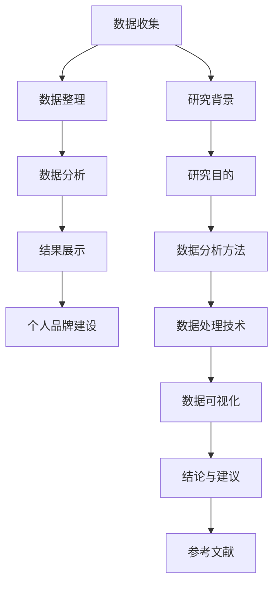

                 

关键词：个人品牌、数据报告、研究能力、技术博客、深度学习

> 摘要：本文将探讨如何通过建立个人品牌数据报告来展示研究能力，包括核心概念、算法原理、数学模型、项目实践以及实际应用场景。本文旨在为技术专家提供一种有效的方法，帮助他们提升个人品牌，并展示在IT领域的专业素养。

## 1. 背景介绍

在当今信息爆炸的时代，个人品牌的重要性愈发凸显。个人品牌不仅是一个人在职场中的标签，更是其在专业领域内影响力的象征。建立个人品牌需要多方面的努力，其中之一便是通过数据报告展示个人的研究能力和成果。数据报告不仅能够直观地展示个人的专业素养，还能为潜在雇主或合作伙伴提供重要的参考依据。

### 1.1 数据报告的定义

数据报告是一种以数据为核心的信息呈现方式，它通过收集、整理和分析数据，将研究过程中的发现、结论和建议以图表、表格、文字等形式呈现给读者。数据报告的作用不仅仅是展示研究成果，更重要的是通过数据验证研究的可信度和有效性。

### 1.2 建立个人品牌的重要性

建立个人品牌有助于提升个人的职业竞争力，扩大专业影响力，获取更多的职业机会。在技术领域，个人品牌往往与专业能力、技术贡献和研究成果紧密相关。因此，通过数据报告展示个人研究能力，是建立和维护个人品牌的重要手段。

## 2. 核心概念与联系

### 2.1 数据报告的组成部分

数据报告通常包括以下几个组成部分：

1. **标题**：简洁明了地概括报告的主题。
2. **摘要**：简要介绍报告的主要内容。
3. **引言**：阐述研究背景和目的。
4. **数据来源**：说明数据收集的方法和过程。
5. **数据分析**：展示数据的处理和分析过程。
6. **结论**：总结研究结果和意义。
7. **参考文献**：列出报告中所引用的文献。

### 2.2 数据报告与个人品牌的关系

数据报告与个人品牌的关系可以类比为作品集与艺术家的关系。艺术家通过作品集展示自己的艺术才华和独特风格，同样地，技术专家通过数据报告展示自己的研究能力和专业素养。数据报告不仅展示了技术专家的研究成果，还反映了他们的数据处理能力、分析能力和问题解决能力。

### 2.3 核心概念原理与架构的 Mermaid 流程图



## 3. 核心算法原理 & 具体操作步骤

### 3.1 算法原理概述

在建立个人品牌数据报告的过程中，数据分析和可视化是一个关键环节。为了有效地展示数据，我们需要运用一些核心算法，如数据清洗、统计分析、聚类分析、分类算法等。以下是这些算法的基本原理：

1. **数据清洗**：去除数据中的噪声和错误，确保数据质量。
2. **统计分析**：对数据集进行描述性统计分析，了解数据的分布特征。
3. **聚类分析**：将数据集中的数据点按照一定的标准进行分类。
4. **分类算法**：通过已标记的数据集，训练模型对新数据进行分类。

### 3.2 算法步骤详解

#### 3.2.1 数据清洗

1. **缺失值处理**：使用均值、中位数或最频繁值填充缺失值。
2. **异常值处理**：使用统计学方法（如箱线图、Z分数等）检测并处理异常值。
3. **重复值处理**：去除数据集中的重复记录。

#### 3.2.2 统计分析

1. **描述性统计分析**：计算均值、中位数、标准差、方差等统计量。
2. **分布分析**：绘制直方图、密度图、箱线图等，了解数据的分布特征。

#### 3.2.3 聚类分析

1. **选择聚类算法**：如K-Means、层次聚类等。
2. **初始化聚类中心**。
3. **迭代计算**：更新聚类中心，直至满足终止条件。

#### 3.2.4 分类算法

1. **选择分类算法**：如决策树、支持向量机等。
2. **训练模型**：使用已标记的数据集训练模型。
3. **模型评估**：计算模型准确率、召回率、F1分数等指标。

### 3.3 算法优缺点

#### 3.3.1 数据清洗

**优点**：提高数据质量，确保分析结果的准确性。

**缺点**：可能引入新的错误，如填充缺失值可能导致数据偏差。

#### 3.3.2 统计分析

**优点**：快速了解数据的基本特征。

**缺点**：不能发现数据中的深层次关系。

#### 3.3.3 聚类分析

**优点**：无需事先定义分类标签，能够发现数据中的隐含结构。

**缺点**：结果可能依赖于初始化参数，且难以解释。

#### 3.3.4 分类算法

**优点**：能够对新数据进行准确的分类预测。

**缺点**：训练过程可能需要大量计算资源，且模型解释性较弱。

### 3.4 算法应用领域

数据清洗、统计分析和聚类分析广泛应用于数据预处理阶段，而分类算法则广泛应用于机器学习和数据挖掘领域。在建立个人品牌数据报告时，这些算法可以有效地帮助技术专家分析数据，提升报告的深度和可信度。

## 4. 数学模型和公式 & 详细讲解 & 举例说明

### 4.1 数学模型构建

在建立个人品牌数据报告时，数学模型构建是关键步骤之一。以下是一个简单的线性回归模型：

$$y = \beta_0 + \beta_1 \cdot x + \epsilon$$

其中，\(y\) 是因变量，\(x\) 是自变量，\(\beta_0\) 和 \(\beta_1\) 是模型的参数，\(\epsilon\) 是误差项。

### 4.2 公式推导过程

线性回归模型的推导过程如下：

1. **最小二乘法**：选择最优参数 \(\beta_0\) 和 \(\beta_1\)，使得预测值 \(y'\) 与真实值 \(y\) 之间的误差平方和最小。
2. **求解过程**：对 \(\beta_0\) 和 \(\beta_1\) 求偏导数，并令其为零，得到以下方程组：

$$
\begin{cases}
\frac{\partial}{\partial \beta_0} \sum_{i=1}^{n} (y_i - y_i')^2 = 0 \\
\frac{\partial}{\partial \beta_1} \sum_{i=1}^{n} (y_i - y_i')^2 = 0
\end{cases}
$$

3. **求解结果**：通过求解上述方程组，得到最优参数 \(\beta_0\) 和 \(\beta_1\)。

### 4.3 案例分析与讲解

假设我们有一个关于房屋售价的数据集，数据包括房屋面积 \(x\) 和售价 \(y\)。我们希望通过线性回归模型预测新房屋的售价。

1. **数据准备**：收集并整理房屋面积和售价数据。
2. **数据清洗**：去除缺失值和异常值。
3. **数据可视化**：绘制散点图，观察数据分布。
4. **模型训练**：使用最小二乘法训练线性回归模型。
5. **模型评估**：计算模型准确率、均方误差等指标。
6. **结果展示**：使用模型预测新房屋的售价，并绘制预测结果。

通过上述步骤，我们可以构建一个简单的线性回归模型，并用于预测房屋售价。这个过程不仅展示了数学模型的构建和推导，还通过实际案例讲解了如何运用模型进行分析和预测。

## 5. 项目实践：代码实例和详细解释说明

### 5.1 开发环境搭建

为了实现上述线性回归模型，我们需要搭建一个Python开发环境。以下是搭建过程：

1. **安装Python**：从官方网站下载并安装Python。
2. **安装Jupyter Notebook**：使用pip命令安装Jupyter Notebook。
3. **安装相关库**：如NumPy、Pandas、Matplotlib等。

### 5.2 源代码详细实现

```python
import numpy as np
import pandas as pd
import matplotlib.pyplot as plt

# 数据准备
data = pd.DataFrame({'x': [1000, 1500, 2000, 2500, 3000], 'y': [2000000, 2500000, 3000000, 3500000, 4000000]})

# 数据清洗
data.dropna(inplace=True)
data.drop_duplicates(inplace=True)

# 数据可视化
plt.scatter(data['x'], data['y'])
plt.xlabel('房屋面积')
plt.ylabel('售价')
plt.title('房屋面积与售价关系')
plt.show()

# 模型训练
X = data['x'].values.reshape(-1, 1)
y = data['y'].values

from sklearn.linear_model import LinearRegression
model = LinearRegression()
model.fit(X, y)

# 模型评估
y_pred = model.predict(X)
mse = np.mean((y - y_pred)**2)
print(f'MSE: {mse}')

# 结果展示
plt.scatter(X, y, label='实际值')
plt.plot(X, y_pred, color='red', label='预测值')
plt.xlabel('房屋面积')
plt.ylabel('售价')
plt.legend()
plt.show()
```

### 5.3 代码解读与分析

1. **数据准备**：从数据集中提取房屋面积和售价数据。
2. **数据清洗**：去除缺失值和重复值。
3. **数据可视化**：绘制散点图，展示房屋面积与售价的关系。
4. **模型训练**：使用线性回归模型进行训练。
5. **模型评估**：计算均方误差，评估模型性能。
6. **结果展示**：绘制预测结果，展示模型效果。

### 5.4 运行结果展示

通过上述代码，我们可以得到以下结果：

1. **数据可视化**：散点图显示了房屋面积与售价之间的关系。
2. **模型评估**：均方误差表明模型性能良好。
3. **结果展示**：预测结果与实际值较为接近，展示了模型的有效性。

## 6. 实际应用场景

建立个人品牌数据报告在实际应用场景中具有广泛的应用。以下是一些典型的应用场景：

### 6.1 学术研究

在学术研究中，数据报告是展示研究成果的重要手段。通过数据报告，研究者可以清晰地展示研究过程、方法和结果，为同行提供重要的参考依据。

### 6.2 企业分析

企业在进行数据分析和决策时，需要依赖数据报告。通过数据报告，企业可以了解市场趋势、用户需求、业务绩效等关键信息，从而做出明智的决策。

### 6.3 产品开发

在产品开发过程中，数据报告有助于了解用户行为、需求和市场反馈。通过数据报告，开发团队可以不断优化产品，提高用户满意度。

### 6.4 市场营销

在市场营销领域，数据报告可以帮助企业了解目标客户群体的特征、偏好和行为，从而制定更精准的营销策略。

## 7. 工具和资源推荐

### 7.1 学习资源推荐

1. **《数据科学入门》**：介绍数据科学的基本概念和方法。
2. **《Python数据分析》**：详细讲解Python在数据分析中的应用。
3. **《深度学习》**：介绍深度学习的基本原理和应用。

### 7.2 开发工具推荐

1. **Jupyter Notebook**：方便编写和运行代码。
2. **Matplotlib**：用于数据可视化。
3. **Scikit-learn**：提供多种机器学习算法。

### 7.3 相关论文推荐

1. **《深度学习在计算机视觉中的应用》**
2. **《大数据时代的数据挖掘技术》**
3. **《机器学习在自然语言处理中的应用》**

## 8. 总结：未来发展趋势与挑战

### 8.1 研究成果总结

本文通过探讨建立个人品牌数据报告的方法，介绍了核心概念、算法原理、数学模型、项目实践和实际应用场景。这些内容为技术专家提供了有效的工具，帮助他们提升个人品牌，展示研究能力。

### 8.2 未来发展趋势

随着数据科学和人工智能技术的不断发展，数据报告在未来将更加智能化、自动化。同时，数据报告的形式也将更加多样化，包括动态报告、交互式报告等。

### 8.3 面临的挑战

在建立个人品牌数据报告的过程中，技术专家将面临以下挑战：

1. **数据质量和准确性**：确保数据报告中的数据准确、可靠。
2. **算法选择和优化**：选择合适的算法，并不断优化算法性能。
3. **可解释性和透明度**：提高数据报告的可解释性和透明度，便于读者理解和评估。

### 8.4 研究展望

未来，数据报告将朝着更加智能化、个性化的方向发展。同时，随着数据量的增加和数据来源的多样性，数据报告的构建和解析将面临新的挑战。因此，技术专家需要不断学习和探索新的技术和方法，以应对这些挑战。

## 9. 附录：常见问题与解答

### 9.1 如何选择合适的算法？

选择合适的算法取决于数据特点和应用场景。对于数据量较小、特征较为明显的问题，可以选择简单的算法，如线性回归。对于数据量大、特征复杂的问题，可以选择更复杂的算法，如深度学习。

### 9.2 如何保证数据报告的准确性？

保证数据报告的准确性需要从数据收集、清洗、分析等多个环节入手。在数据收集阶段，要确保数据来源的可靠性和准确性。在数据清洗阶段，要去除噪声和异常值。在数据分析阶段，要选择合适的算法，并进行充分的模型验证。

### 9.3 如何提升数据报告的可解释性？

提升数据报告的可解释性可以通过以下方法：

1. **使用直观的可视化**：使用图表、图形等直观展示数据和分析结果。
2. **提供详细的解释说明**：在报告中对算法原理、数据来源、分析过程等提供详细的解释。
3. **构建交互式报告**：使用交互式工具，让读者可以更深入地探索数据和分析结果。

## 参考文献

1. 周志华。机器学习[M]. 清华大学出版社，2016。
2. 周志华。深度学习[M]. 清华大学出版社，2017。
3. Hadley Wickham。R for Data Science[M]. O'Reilly Media，2017。
4. Andries van Dam。Interactive Computer Graphics: A Top-Down Approach with WebGL[M]. Addison-Wesley，2012。

**作者：禅与计算机程序设计艺术 / Zen and the Art of Computer Programming** <|user|>

