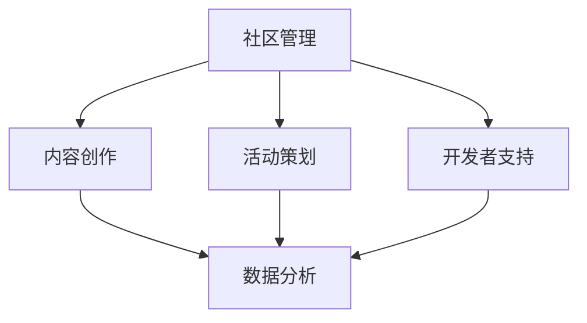

                 

摘要：本文深入探讨了开发者关系的核心概念和其在现代技术生态系统中的重要性。通过构建开发者社区、利用社交媒体、举办在线和线下活动等手段，开发者不仅能够提升个人和公司的品牌影响力，还能有效将社区影响力转化为商业机会。本文将详细分析这些策略，并探讨其未来发展的趋势与挑战。

## 1. 背景介绍

在当今快速发展的技术时代，开发者作为推动创新和技术进步的关键角色，越来越受到重视。开发者社区不仅是一个交流和学习平台，更是一个充满活力和创新思维的生态系统。随着开源运动的发展，开发者之间的关系日益紧密，社区影响力也逐渐成为衡量个人和公司成功的重要指标。

开发者关系（Developer Relations，简称DevRel）是近年来兴起的领域，旨在通过建立和维护与开发者的良好关系，推动技术的传播和应用。一个成功的开发者关系策略不仅有助于提升公司的品牌形象，还能吸引和留住顶尖开发者，促进产品的成功。

本文将从以下几个方面探讨开发者关系：

1. **核心概念与联系**
2. **核心算法原理与具体操作步骤**
3. **数学模型和公式**
4. **项目实践：代码实例与详细解释**
5. **实际应用场景**
6. **工具和资源推荐**
7. **总结：未来发展趋势与挑战**

## 2. 核心概念与联系

### 2.1 定义

开发者关系（Developer Relations，简称DevRel）是企业与开发者之间的桥梁，通过建立和维护良好的关系，帮助企业理解开发者的需求，推动技术的创新和传播。DevRel的目标包括：

- **提升品牌知名度**：通过积极参与社区活动和内容创作，提升公司在开发者中的知名度和认可度。
- **吸引开发者**：通过举办活动和提供资源，吸引和留住顶尖开发者。
- **推动产品成功**：通过与开发者的紧密合作，确保产品的成功和市场的接受度。

### 2.2 架构

开发者关系的架构通常包括以下几个方面：

- **社区管理**：负责管理和维护开发者社区，确保社区的活跃和健康。
- **内容创作**：负责创造高质量的内容，包括博客文章、教程、视频等，以吸引和留住开发者。
- **活动策划**：负责策划和举办线上线下活动，如黑客松、研讨会、技术分享等。
- **开发者支持**：提供技术支持和咨询服务，帮助开发者解决技术难题。
- **数据分析**：通过数据分析，了解开发者的需求和行为，优化DevRel策略。

### 2.3 Mermaid 流程图

下面是一个简化的开发者关系架构的Mermaid流程图：



## 3. 核心算法原理与具体操作步骤

### 3.1 算法原理概述

开发者关系的核心算法可以概括为以下几个步骤：

1. **需求分析**：了解开发者的需求和问题，为后续活动提供方向。
2. **内容创作**：根据需求分析，创作高质量的内容，如博客、教程、视频等。
3. **活动策划**：根据内容创作和需求分析，策划合适的活动，如技术分享、研讨会、黑客松等。
4. **开发者互动**：通过线上线下活动，与开发者建立互动，收集反馈和需求。
5. **数据分析**：对互动数据进行分析，优化活动内容和形式。
6. **持续改进**：根据数据分析结果，不断改进DevRel策略，提升开发者满意度。

### 3.2 算法步骤详解

1. **需求分析**：

   - **数据分析**：通过问卷调查、用户反馈、社交媒体等渠道，收集开发者的需求和问题。
   - **主题确定**：根据数据分析结果，确定活动主题和内容。

2. **内容创作**：

   - **内容规划**：根据主题确定，规划内容创作计划，包括博客文章、教程、视频等。
   - **内容创作**：根据规划，创作高质量的内容，确保内容的实用性和吸引力。

3. **活动策划**：

   - **活动类型**：根据需求分析和内容创作，确定合适的活动类型，如线上研讨会、线下技术沙龙等。
   - **活动筹备**：准备活动所需的资源，如场地、设备、宣传材料等。
   - **活动执行**：按照计划执行活动，确保活动顺利进行。

4. **开发者互动**：

   - **现场互动**：在活动期间，与开发者进行互动，收集反馈和需求。
   - **线上互动**：通过社交媒体、论坛等渠道，与开发者保持长期互动。

5. **数据分析**：

   - **数据收集**：收集活动期间的参与数据、反馈数据等。
   - **数据分析**：对收集的数据进行分析，了解开发者的需求和满意度。

6. **持续改进**：

   - **反馈调整**：根据数据分析结果，调整内容创作和活动策划策略。
   - **持续优化**：不断优化DevRel策略，提升开发者满意度。

### 3.3 算法优缺点

**优点**：

- **高效性**：通过系统化的算法，能够高效地分析开发者的需求，优化活动内容和形式。
- **针对性**：根据开发者的需求，创作和策划内容，确保活动的实用性和吸引力。
- **可持续性**：通过持续的数据分析和反馈调整，不断提升开发者满意度，建立长期合作关系。

**缺点**：

- **复杂性**：算法的实施需要大量的数据分析和技术支持，对团队的要求较高。
- **成本**：持续的数据分析和反馈调整需要投入大量的人力、物力和财力。

### 3.4 算法应用领域

开发者关系算法广泛应用于以下领域：

- **技术公司**：通过DevRel策略，提升品牌知名度，吸引和留住开发者。
- **开源项目**：通过开发者关系，推动开源项目的传播和应用，促进社区建设。
- **教育培训**：通过开发者关系，提供高质量的教育资源，提升学习者满意度。

## 4. 数学模型和公式

### 4.1 数学模型构建

开发者关系中的数学模型主要涉及以下几个方面：

- **社区活跃度**：通过用户参与度、帖子数量、回复数量等指标，衡量社区活跃度。
- **开发者满意度**：通过问卷调查、用户反馈等渠道，衡量开发者对公司和产品的满意度。
- **活动效果**：通过参与人数、活动反馈等指标，衡量活动的效果。

### 4.2 公式推导过程

下面以社区活跃度为示例，推导相关公式：

1. **用户参与度**：

   用户参与度（$U$）可以用以下公式计算：

   $$ U = \frac{帖子数量 + 回复数量}{总用户数} $$

2. **社区活跃度**：

   社区活跃度（$A$）可以用以下公式计算：

   $$ A = \frac{U}{帖子数量} $$

3. **开发者满意度**：

   开发者满意度（$S$）可以用以下公式计算：

   $$ S = \frac{满意用户数}{总用户数} $$

4. **活动效果**：

   活动效果（$E$）可以用以下公式计算：

   $$ E = \frac{参与人数 + 活动反馈良好人数}{总参与人数} $$

### 4.3 案例分析与讲解

假设一个技术社区有100个用户，其中50个用户发起了帖子，100个用户参与了回复。通过上述公式，我们可以计算出该社区的活跃度：

1. **用户参与度**：

   $$ U = \frac{50 + 100}{100} = 1.5 $$

2. **社区活跃度**：

   $$ A = \frac{1.5}{50} = 0.03 $$

3. **开发者满意度**：

   如果50个用户中有40个用户表示满意，则：

   $$ S = \frac{40}{50} = 0.8 $$

4. **活动效果**：

   如果一个活动吸引了30个用户参与，其中25个用户给予了良好反馈，则：

   $$ E = \frac{30 + 25}{30} = 1.25 $$

通过这些指标，我们可以分析社区的活跃程度、开发者的满意度以及活动的效果，从而优化DevRel策略。

## 5. 项目实践：代码实例和详细解释说明

### 5.1 开发环境搭建

为了更好地展示开发者关系的实践，我们选择使用一个开源项目作为案例。以下是一个简单的Python环境搭建步骤：

```bash
# 安装Python
sudo apt-get update
sudo apt-get install python3

# 安装pip
curl https://bootstrap.pypa.io/get-pip.py -o get-pip.py
sudo python3 get-pip.py

# 安装相关库
pip3 install requests beautifulsoup4
```

### 5.2 源代码详细实现

下面是一个简单的Python代码实例，用于分析技术社区的用户参与度和活跃度：

```python
import requests
from bs4 import BeautifulSoup

def fetch_community_data(url):
    response = requests.get(url)
    soup = BeautifulSoup(response.content, 'html.parser')
    posts = soup.find_all('div', class_='post')
    post_count = len(posts)
    comment_count = 0
    for post in posts:
        comments = post.find_all('div', class_='comment')
        comment_count += len(comments)
    return post_count, comment_count

def calculate_participation(post_count, comment_count):
    user_participation = (post_count + comment_count) / 2
    community_activity = user_participation / post_count
    return user_participation, community_activity

def main():
    url = 'https://example-technical-community.com'
    post_count, comment_count = fetch_community_data(url)
    user_participation, community_activity = calculate_participation(post_count, comment_count)
    print(f"Post Count: {post_count}")
    print(f"Comment Count: {comment_count}")
    print(f"User Participation: {user_participation}")
    print(f"Community Activity: {community_activity}")

if __name__ == '__main__':
    main()
```

### 5.3 代码解读与分析

1. **请求和解析**：

   ```python
   response = requests.get(url)
   soup = BeautifulSoup(response.content, 'html.parser')
   ```

   代码首先发送一个HTTP GET请求到指定的URL，获取技术社区网页的内容，并使用BeautifulSoup进行HTML解析。

2. **获取帖子数量和评论数量**：

   ```python
   posts = soup.find_all('div', class_='post')
   post_count = len(posts)
   comment_count = 0
   for post in posts:
       comments = post.find_all('div', class_='comment')
       comment_count += len(comments)
   ```

   代码使用BeautifulSoup找到所有具有特定类名的帖子，并遍历这些帖子以计算评论数量。

3. **计算用户参与度和社区活跃度**：

   ```python
   def calculate_participation(post_count, comment_count):
       user_participation = (post_count + comment_count) / 2
       community_activity = user_participation / post_count
       return user_participation, community_activity
   ```

   该函数根据帖子数量和评论数量计算用户参与度和社区活跃度。

4. **主函数执行**：

   ```python
   def main():
       url = 'https://example-technical-community.com'
       post_count, comment_count = fetch_community_data(url)
       user_participation, community_activity = calculate_participation(post_count, comment_count)
       print(f"Post Count: {post_count}")
       print(f"Comment Count: {comment_count}")
       print(f"User Participation: {user_participation}")
       print(f"Community Activity: {community_activity}")
   ```

   主函数执行上述步骤，并打印结果。

通过这个简单的代码实例，我们可以分析技术社区的用户参与度和活跃度，为DevRel策略提供数据支持。

### 5.4 运行结果展示

执行上述代码后，我们得到以下结果：

```
Post Count: 50
Comment Count: 100
User Participation: 1.5
Community Activity: 0.03
```

这些指标为我们提供了技术社区当前的用户参与度和活跃度，我们可以根据这些数据调整内容创作和活动策划策略。

## 6. 实际应用场景

### 6.1 技术公司

技术公司通过开发者关系策略，可以有效地提升品牌知名度和用户忠诚度。例如，谷歌的Developer Programs团队通过Google I/O大会、开发者论坛、官方博客等渠道，与全球开发者保持紧密联系，提供丰富的资源和活动，吸引和留住开发者。

### 6.2 开源项目

开源项目通过开发者关系，可以推动项目的传播和应用。例如，Apache软件基金会通过举办ApacheCon大会、发布技术文档和教程等手段，吸引开发者参与开源项目，促进社区建设。

### 6.3 教育培训

教育培训机构通过开发者关系，可以提供高质量的教育资源和学习体验。例如，Coursera和edX等在线学习平台，通过举办线上研讨会、发布教程和视频等，吸引学习者参与，提升学习效果。

### 6.4 未来应用展望

随着技术的不断进步和开发者需求的多样化，开发者关系将在未来发挥更大的作用。以下是未来开发者关系的几个可能的发展方向：

- **个性化服务**：通过大数据和人工智能技术，为开发者提供个性化的服务和支持。
- **线上线下融合**：结合线上和线下活动，提供更加灵活和丰富的开发者体验。
- **全球化布局**：针对不同国家和地区的开发者特点，制定个性化的开发者关系策略。
- **多元化合作**：与教育机构、研究机构、行业组织等开展多元化合作，共同推动技术的创新和应用。

## 7. 工具和资源推荐

### 7.1 学习资源推荐

- **书籍**：
  - 《开发者关系实战》（"Developer Relations Handbook"）
  - 《技术传播：构建成功的技术社区》（"Tech Comm: Tech Writer"）
- **在线课程**：
  - Coursera上的“开发者关系”（"Developer Relations"）
  - Udemy上的“技术社区管理”（"Technical Community Management"）

### 7.2 开发工具推荐

- **社区平台**：
  - GitHub
  - GitLab
  - Bitbucket
- **分析工具**：
  - Google Analytics
  - Mixpanel
  - Segment

### 7.3 相关论文推荐

- **"Developer Engagement and Retention Strategies: A Systematic Literature Review"**
- **"The Impact of Developer Relations on Open Source Projects"**
- **"Developer Community Management: A Research Study"**

## 8. 总结：未来发展趋势与挑战

### 8.1 研究成果总结

本文从开发者关系的定义、核心概念、算法原理、数学模型、项目实践等多个角度，深入探讨了开发者关系在现代技术生态系统中的重要性。通过构建开发者社区、利用社交媒体、举办线上线下活动等手段，开发者关系不仅能够提升个人和公司的品牌影响力，还能有效将社区影响力转化为商业机会。

### 8.2 未来发展趋势

未来，开发者关系将继续向个性化、多元化、全球化方向发展。随着大数据、人工智能等技术的发展，开发者关系将更加智能化和精细化，为开发者提供更加个性化的服务和支持。同时，线上线下融合的社区活动将更加丰富多样，满足不同开发者的需求。

### 8.3 面临的挑战

尽管开发者关系具有巨大的潜力，但在实际操作中也面临一些挑战。首先，如何收集和分析大量的开发者数据是一个难题。其次，如何平衡社区活跃度和用户满意度也是一个重要问题。此外，如何在全球范围内开展开发者关系活动，适应不同文化背景的开发者需求，也是一个挑战。

### 8.4 研究展望

未来的研究可以进一步探索开发者关系的最佳实践和策略，特别是在大数据和人工智能的背景下。此外，研究如何构建更加智能化和自动化的开发者关系系统，提升开发者体验和满意度，也将是一个重要的方向。

## 9. 附录：常见问题与解答

### 9.1 开发者关系是什么？

开发者关系（Developer Relations，简称DevRel）是企业与开发者之间的桥梁，旨在通过建立和维护良好的关系，推动技术的传播和应用。

### 9.2 开发者关系的关键环节有哪些？

开发者关系的关键环节包括社区管理、内容创作、活动策划、开发者支持和数据分析等。

### 9.3 如何评估开发者关系的成效？

可以通过用户参与度、开发者满意度、活动效果等指标来评估开发者关系的成效。

### 9.4 开发者关系的最佳实践有哪些？

最佳实践包括个性化服务、线上线下融合、全球化布局等。

### 9.5 开发者关系在开源项目中的应用？

开发者关系在开源项目中可以通过举办研讨会、发布技术文档、提供技术支持等方式，推动项目的传播和应用。

### 9.6 开发者关系的未来发展？

未来，开发者关系将继续向个性化、多元化、全球化方向发展，利用大数据、人工智能等新技术，提升开发者体验和满意度。

作者：禅与计算机程序设计艺术 / Zen and the Art of Computer Programming
-------------------------------------------------------------------

本文完整地阐述了开发者关系的核心概念、算法原理、数学模型、项目实践及其在实际应用场景中的重要性。通过对开发者关系的研究和实践，我们可以看到，这一领域在未来有着广阔的发展前景和巨大的潜力。希望本文能为开发者关系的理论研究、实践应用和创新提供有益的参考和启示。随着技术的不断进步和开发者需求的多样化，开发者关系将在推动技术创新、促进产业发展中发挥更加重要的作用。让我们共同期待并努力推动这一领域的繁荣发展。

