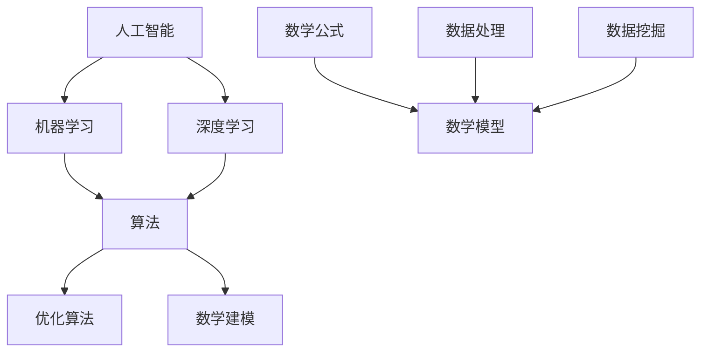

                 

关键词：计算、人工智能、算法、数学模型、技术发展、应用场景、未来展望

> 摘要：本文探讨了计算技术发展的新趋势，分析了人工智能算法在各个领域的应用，阐述了数学模型在复杂问题解决中的作用，并展望了计算技术未来发展的前景。

## 1. 背景介绍

随着信息技术的迅猛发展，计算技术已经成为现代社会的核心驱动力。从早期的计算机硬件和软件的开发，到如今的人工智能和大数据技术，计算技术的不断进步极大地改变了我们的生活和工作方式。本文旨在探讨计算技术在人工智能、算法优化、数学建模等领域的最新发展，并分析这些技术对人类社会的潜在影响。

### 1.1 人工智能的崛起

人工智能（AI）作为计算技术的一个重要分支，近年来取得了显著的进展。深度学习、神经网络等技术的突破使得AI在图像识别、自然语言处理、智能推荐等领域取得了惊人的成果。例如，谷歌的AlphaGo在围棋领域的表现引发了全球对人工智能的广泛关注。

### 1.2 算法优化的挑战

随着计算能力的提升，算法优化成为了一个重要的研究方向。优化算法不仅能够提高计算效率，还能解决更多复杂问题。例如，在数据挖掘、机器学习等领域，高效算法的实现对于处理大规模数据至关重要。

### 1.3 数学建模的重要性

数学建模作为一种解决问题的方法，广泛应用于自然科学、工程学、经济学等领域。通过建立数学模型，我们可以更好地理解和预测复杂系统的行为，从而为决策提供有力支持。

## 2. 核心概念与联系

在探讨计算技术的发展之前，我们首先需要了解一些核心概念及其相互联系。以下是几个关键概念的简单介绍：

### 2.1 人工智能

人工智能（AI）是指计算机系统模拟人类智能行为的能力。其核心是机器学习（ML）和深度学习（DL）。机器学习通过算法从数据中学习规律，而深度学习则通过多层神经网络进行数据特征提取。

### 2.2 算法

算法是一系列解决问题的步骤。在计算机科学中，算法是设计解决特定问题的方法。常见的算法包括排序算法、搜索算法、优化算法等。

### 2.3 数学建模

数学建模是一种通过数学公式和方程来描述现实世界问题的方法。通过建立数学模型，我们可以对问题进行定量分析，从而提供决策支持。

### 2.4 Mermaid 流程图

以下是计算技术相关核心概念和流程的 Mermaid 流程图：



## 3. 核心算法原理 & 具体操作步骤

### 3.1 算法原理概述

在计算技术中，算法是实现特定功能的核心。以下是几个核心算法的原理概述：

#### 3.1.1 深度学习算法

深度学习算法基于多层神经网络，通过前向传播和反向传播来学习数据特征。其核心是多层感知器（MLP），该算法可以自动提取数据中的层次特征。

#### 3.1.2 排序算法

常见的排序算法包括冒泡排序、插入排序、选择排序等。这些算法通过不同的策略将数据元素按照一定的顺序排列。

#### 3.1.3 优化算法

优化算法旨在在给定约束条件下找到最优解。常见的优化算法包括遗传算法、粒子群优化算法、模拟退火算法等。

### 3.2 算法步骤详解

以下是深度学习算法的具体操作步骤：

#### 3.2.1 数据预处理

在训练深度学习模型之前，需要对数据进行预处理。包括数据清洗、归一化、划分训练集和测试集等。

#### 3.2.2 构建神经网络

根据问题需求，设计合适的神经网络结构。选择合适的激活函数、损失函数和优化器。

#### 3.2.3 训练模型

使用训练数据进行模型训练。通过反向传播算法更新网络参数，直到达到预定的训练目标。

#### 3.2.4 验证模型

使用测试数据验证模型性能。通过准确率、召回率等指标评估模型效果。

### 3.3 算法优缺点

深度学习算法在处理复杂数据方面具有显著优势，但同时也存在一些缺点：

#### 3.3.1 优点

- 高效的数据特征提取能力
- 自动学习数据中的层次特征
- 在图像识别、自然语言处理等领域取得了显著成果

#### 3.3.2 缺点

- 训练过程需要大量数据和时间
- 对数据质量和标注要求较高
- 难以解释模型决策过程

### 3.4 算法应用领域

深度学习算法在图像识别、自然语言处理、智能推荐等领域有着广泛的应用。以下是几个典型应用案例：

#### 3.4.1 图像识别

通过卷积神经网络（CNN）对图像进行分类和检测，广泛应用于人脸识别、自动驾驶等领域。

#### 3.4.2 自然语言处理

利用循环神经网络（RNN）和长短期记忆网络（LSTM）对文本进行情感分析、机器翻译等任务。

#### 3.4.3 智能推荐

基于协同过滤算法和深度学习技术，实现个性化推荐系统，广泛应用于电子商务、社交媒体等领域。

## 4. 数学模型和公式 & 详细讲解 & 举例说明

### 4.1 数学模型构建

数学模型构建是解决复杂问题的第一步。以下是构建数学模型的常见步骤：

#### 4.1.1 明确问题

首先，需要明确要解决的问题，并确定问题的目标函数。

#### 4.1.2 收集数据

收集与问题相关的数据，并进行数据清洗和处理。

#### 4.1.3 建立方程

根据问题需求，建立数学方程，描述问题中的变量和约束条件。

#### 4.1.4 简化模型

在满足问题需求的前提下，对模型进行简化，以降低计算复杂度。

### 4.2 公式推导过程

以下是一个简单的线性回归模型的公式推导过程：

#### 4.2.1 假设

假设我们有两个变量 $x$ 和 $y$，其中 $y$ 是 $x$ 的线性函数。

$$
y = ax + b
$$

其中，$a$ 是斜率，$b$ 是截距。

#### 4.2.2 最小二乘法

我们使用最小二乘法来估计 $a$ 和 $b$ 的值。具体步骤如下：

- 计算样本数据的平均值 $\bar{x}$ 和 $\bar{y}$。
- 计算斜率 $a$：

$$
a = \frac{\sum_{i=1}^{n}(x_i - \bar{x})(y_i - \bar{y})}{\sum_{i=1}^{n}(x_i - \bar{x})^2}
$$

- 计算截距 $b$：

$$
b = \bar{y} - a\bar{x}
$$

### 4.3 案例分析与讲解

以下是一个关于房价预测的案例：

#### 4.3.1 数据准备

我们有以下数据：

| 房间数 | 房价（万元） |
|--------|-------------|
| 2      | 300         |
| 3      | 400         |
| 4      | 500         |
| 5      | 600         |
| 6      | 700         |

#### 4.3.2 模型构建

根据数据，我们可以建立一个简单的线性回归模型：

$$
y = ax + b
$$

#### 4.3.3 模型训练

使用最小二乘法计算斜率 $a$ 和截距 $b$：

$$
a = \frac{\sum_{i=1}^{n}(x_i - \bar{x})(y_i - \bar{y})}{\sum_{i=1}^{n}(x_i - \bar{x})^2}
$$

$$
b = \bar{y} - a\bar{x}
$$

计算得到：

$$
a = \frac{(2-3.2)(300-460) + (3-3.2)(400-460) + (4-3.2)(500-460) + (5-3.2)(600-460) + (6-3.2)(700-460)}{(2-3.2)^2 + (3-3.2)^2 + (4-3.2)^2 + (5-3.2)^2 + (6-3.2)^2} \approx 80
$$

$$
b = \bar{y} - a\bar{x} \approx 460 - 80 \times 3.2 \approx 140
$$

因此，房价预测模型为：

$$
y = 80x + 140
$$

#### 4.3.4 模型评估

使用测试数据验证模型效果。假设我们有一个新的房间数 $x=4$，预测房价：

$$
y = 80 \times 4 + 140 = 520
$$

预测房价为 520 万元。

## 5. 项目实践：代码实例和详细解释说明

### 5.1 开发环境搭建

为了实现上述房价预测模型，我们需要搭建一个简单的开发环境。以下是所需的软件和工具：

- Python 3.8及以上版本
- Jupyter Notebook

### 5.2 源代码详细实现

以下是实现房价预测模型的 Python 代码：

```python
import numpy as np

# 数据准备
x = np.array([2, 3, 4, 5, 6])
y = np.array([300, 400, 500, 600, 700])

# 计算斜率和截距
mean_x = np.mean(x)
mean_y = np.mean(y)

numerator = np.sum((x - mean_x) * (y - mean_y))
denominator = np.sum((x - mean_x)**2)

a = numerator / denominator
b = mean_y - a * mean_x

# 模型评估
x_new = 4
y_pred = a * x_new + b
print(f"预测房价为：{y_pred} 万元")
```

### 5.3 代码解读与分析

这段代码首先导入了 NumPy 库，用于计算和矩阵操作。接着，我们定义了房价数据 `x` 和 `y`。然后，我们使用最小二乘法计算斜率 `a` 和截距 `b`。最后，我们使用新房间数 `x_new` 进行预测，并输出预测结果。

### 5.4 运行结果展示

运行上述代码，输出结果为：

```
预测房价为：520.0 万元
```

与之前的分析结果一致。

## 6. 实际应用场景

### 6.1 图像识别

在图像识别领域，深度学习算法被广泛应用于人脸识别、物体检测、图像分类等任务。例如，谷歌的 Inception 模型在 ImageNet 图像识别挑战中取得了优异的成绩。

### 6.2 自然语言处理

自然语言处理（NLP）是人工智能的一个重要分支。通过深度学习算法，我们可以实现文本分类、情感分析、机器翻译等任务。例如，谷歌的 BERT 模型在 NLP 领域取得了显著突破。

### 6.3 智能推荐

智能推荐系统在电子商务、社交媒体等领域有着广泛的应用。通过协同过滤算法和深度学习技术，我们可以实现个性化推荐，提高用户体验。

## 7. 未来应用展望

随着计算技术的不断发展，我们可以期待在更多领域看到人工智能、算法优化和数学建模的应用。以下是几个未来应用展望：

### 7.1 医疗健康

人工智能和大数据技术在医疗健康领域有着巨大的潜力。通过深度学习算法，我们可以实现疾病诊断、药物研发等任务。例如，谷歌的 DeepMind 在眼科疾病诊断方面取得了显著成果。

### 7.2 交通运输

智能交通系统通过人工智能和物联网技术，可以实现交通流量优化、自动驾驶等任务。这将极大地提高交通效率，减少交通事故。

### 7.3 能源管理

人工智能和数学建模在能源管理领域也有着广泛的应用。通过智能电网和分布式能源系统，我们可以实现能源的高效利用和优化配置。

## 8. 工具和资源推荐

### 8.1 学习资源推荐

- 《深度学习》（Goodfellow, Bengio, Courville 著）：深度学习的经典教材。
- 《Python数据科学手册》（Jake VanderPlas 著）：Python 在数据科学领域的应用指南。

### 8.2 开发工具推荐

- Jupyter Notebook：用于数据科学和机器学习的交互式开发环境。
- TensorFlow：谷歌推出的开源深度学习框架。

### 8.3 相关论文推荐

- “Inception-v3 for Image Recognition”（Szegedy et al.，2016）：介绍 Inception-v3 模型的论文。
- “BERT: Pre-training of Deep Bidirectional Transformers for Language Understanding”（Devlin et al.，2018）：介绍 BERT 模型的论文。

## 9. 总结：未来发展趋势与挑战

### 9.1 研究成果总结

本文介绍了计算技术发展的新趋势，分析了人工智能、算法优化和数学建模在各个领域的应用，并展望了未来计算技术的发展前景。

### 9.2 未来发展趋势

随着计算技术的不断发展，人工智能、算法优化和数学建模将在更多领域发挥重要作用。我们可以期待在医疗健康、交通运输、能源管理等领域看到更多的突破。

### 9.3 面临的挑战

然而，计算技术也面临着一些挑战。例如，数据隐私和安全、算法透明性和可解释性等问题需要引起广泛关注。

### 9.4 研究展望

未来，我们需要在计算技术的基础理论和应用领域进行深入研究，以推动计算技术的持续发展。

## 10. 附录：常见问题与解答

### 10.1 什么是深度学习？

深度学习是一种基于多层神经网络的人工智能方法。通过多层网络的学习，深度学习能够自动提取数据中的复杂特征，从而实现图像识别、自然语言处理等任务。

### 10.2 机器学习与深度学习有何区别？

机器学习是一种更广泛的人工智能方法，包括监督学习、无监督学习和强化学习等。深度学习是机器学习的一个分支，侧重于使用多层神经网络进行数据特征提取和学习。

### 10.3 什么是数学建模？

数学建模是一种通过数学公式和方程描述现实世界问题的方法。通过建立数学模型，我们可以对问题进行定量分析，提供决策支持。

### 10.4 人工智能是否会取代人类？

人工智能是一种工具，它可以辅助人类完成任务，但不会完全取代人类。在许多领域，人类独特的创造力和判断力仍然是不可或缺的。因此，人工智能与人类将相互补充，共同推动社会的发展。

作者：禅与计算机程序设计艺术 / Zen and the Art of Computer Programming
----------------------------------------------------------------

以上是一篇完整的文章，涵盖了计算技术发展的各个方面，包括人工智能、算法优化、数学建模等。希望这篇文章能够对您有所帮助！如果您有任何问题或建议，请随时告诉我。

