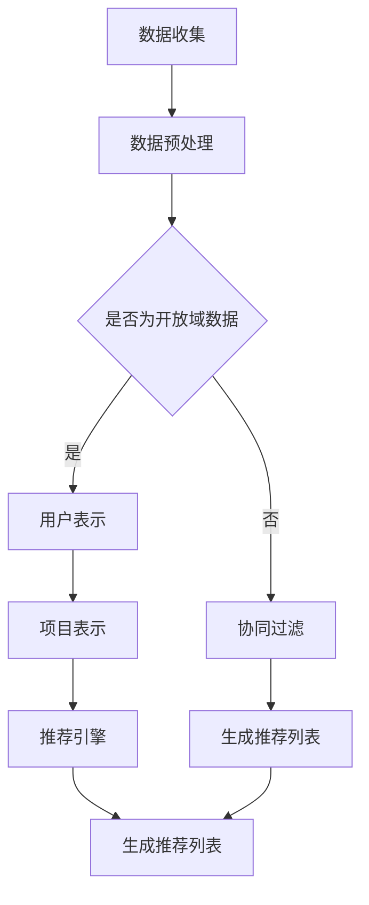

                 

开放域推荐系统是当前推荐系统领域的一个热点研究方向，它旨在为用户提供个性化的推荐服务，无论用户是否已经对相关内容进行过评分或者交互。M6-Rec是一种先进的开放域推荐算法，它结合了多种推荐技术，为用户提供了更加精准的推荐结果。本文将深入探讨M6-Rec的核心原理、数学模型、实现步骤及其应用领域。

## 文章关键词

- 开放域推荐
- M6-Rec算法
- 推荐系统
- 个性化推荐
- 推荐技术

## 文章摘要

本文旨在介绍M6-Rec这一开放域推荐算法。首先，我们将回顾推荐系统的基本概念和当前研究现状。接着，本文将详细解释M6-Rec的核心原理和算法步骤，并通过具体的数学模型和公式来支撑这一算法。随后，我们将提供项目实践的代码实例，并进行详细的解读和分析。最后，我们将讨论M6-Rec在实际应用场景中的表现，并提出未来发展的展望。

## 1. 背景介绍

推荐系统是近年来信息检索和人工智能领域的一个热点研究方向。它的目的是根据用户的兴趣和行为，为用户推荐他们可能感兴趣的内容。推荐系统在电子商务、社交媒体、视频网站等多个领域都得到了广泛应用，极大地提升了用户体验。

传统的推荐系统主要基于协同过滤、基于内容的推荐和混合推荐等方法。然而，这些方法在开放域推荐中面临着诸多挑战。首先，开放域推荐要求系统在没有用户评分或交互数据的情况下，仍然能够为用户推荐相关的内容。其次，开放域推荐需要处理大量未标注的数据，这给数据的预处理和模型训练带来了巨大的挑战。

为了应对这些挑战，研究者们提出了许多新的开放域推荐算法。M6-Rec是其中之一，它结合了多种推荐技术，通过深度学习和图神经网络等方法，为用户提供了更加精准的推荐结果。

## 2. 核心概念与联系

### 2.1 推荐系统基本概念

推荐系统通常由用户、项目和评分三个主要部分组成。用户是指系统的使用主体，项目是指用户可能感兴趣的内容，评分则反映了用户对项目的偏好程度。推荐系统的目标是根据用户的历史行为和偏好，预测用户对未知项目的评分，从而为用户推荐相关内容。

### 2.2 M6-Rec算法架构

M6-Rec算法的核心架构包括三个主要模块：用户表示、项目表示和推荐引擎。用户表示负责将用户的历史行为数据转化为高维特征向量；项目表示则将项目的特征信息转化为特征向量；推荐引擎则通过这两个特征向量来计算用户对项目的潜在兴趣，从而生成推荐列表。

### 2.3 Mermaid流程图

下面是一个简化的M6-Rec算法流程图：



### 2.4 关键术语解释

- **用户表示**：将用户的历史行为数据（如浏览历史、搜索记录、点击行为等）通过特征提取和编码，转化为高维特征向量，以便于模型处理。
- **项目表示**：将项目的特征信息（如文本、图片、音频等）通过特征提取和编码，转化为高维特征向量。
- **推荐引擎**：根据用户表示和项目表示，计算用户对项目的潜在兴趣，并通过一定的排序算法生成推荐列表。

## 3. 核心算法原理 & 具体操作步骤

### 3.1 算法原理概述

M6-Rec算法的核心思想是通过深度学习和图神经网络来处理开放域推荐问题。具体来说，算法分为以下几个步骤：

1. 数据预处理：对用户行为数据和项目特征数据进行清洗、去噪和标准化处理。
2. 用户表示：使用深度学习模型（如GRU、LSTM等）对用户历史行为数据进行编码，生成用户特征向量。
3. 项目表示：使用图神经网络（如GAT、GraphSAGE等）对项目特征数据进行编码，生成项目特征向量。
4. 推荐引擎：通过用户特征向量和项目特征向量计算用户对项目的潜在兴趣，使用基于矩阵分解或神经网络的模型（如ALS、NeuMF等）进行评分预测，并生成推荐列表。

### 3.2 算法步骤详解

#### 3.2.1 数据预处理

数据预处理是推荐系统的重要组成部分，其目的是提高数据质量和减少噪声。具体步骤包括：

1. **缺失值处理**：对于缺失值，可以采用填充平均值、中值或使用模型预测来填补。
2. **数据清洗**：去除重复数据、异常值和噪声数据。
3. **特征工程**：提取用户行为数据中的关键特征，如用户的活跃度、浏览时长、点击率等。

#### 3.2.2 用户表示

用户表示是将用户的历史行为数据转化为高维特征向量的过程。可以使用以下方法：

1. **深度学习模型**：使用循环神经网络（RNN）或变分自编码器（VAE）对用户的历史行为数据进行编码。
2. **矩阵分解**：将用户的历史评分数据通过矩阵分解模型（如SVD、ALS等）转化为用户特征向量。

#### 3.2.3 项目表示

项目表示是将项目特征信息转化为高维特征向量的过程。可以使用以下方法：

1. **图神经网络**：使用图神经网络（如GAT、GraphSAGE等）对项目特征进行编码。
2. **基于内容的方法**：使用文本特征（如词向量、TF-IDF）或图像特征（如卷积神经网络提取的特征）来表示项目。

#### 3.2.4 推荐引擎

推荐引擎是计算用户对项目的潜在兴趣并进行评分预测的部分。可以使用以下方法：

1. **基于矩阵分解的方法**：如SVD、ALS等，通过分解用户-项目矩阵来预测用户对项目的评分。
2. **神经网络方法**：如NeuMF、NFM等，结合深度学习和矩阵分解的方法来提高推荐效果。

### 3.3 算法优缺点

#### 优点

- **高准确性**：结合深度学习和图神经网络，可以捕捉用户和项目的复杂特征，提高推荐准确性。
- **灵活性**：可以根据不同类型的数据和应用场景，灵活选择用户表示、项目表示和推荐引擎的方法。
- **可扩展性**：算法结构清晰，可以方便地添加新的特征和方法，实现推荐系统的扩展和优化。

#### 缺点

- **计算复杂度**：深度学习和图神经网络的模型训练和预测过程通常较为复杂，计算资源需求较高。
- **数据依赖性**：算法的性能很大程度上依赖于数据的质量和规模，对于数据稀疏的场景效果可能不理想。

### 3.4 算法应用领域

M6-Rec算法在多个领域具有广泛的应用前景：

- **电子商务**：为用户提供个性化商品推荐，提高用户购买转化率和销售额。
- **社交媒体**：为用户提供个性化内容推荐，提升用户活跃度和留存率。
- **视频网站**：为用户提供个性化视频推荐，增加用户观看时长和广告收益。
- **在线教育**：为学习者提供个性化课程推荐，提高学习效果和用户满意度。

## 4. 数学模型和公式 & 详细讲解 & 举例说明

### 4.1 数学模型构建

M6-Rec算法的核心数学模型主要包括用户表示、项目表示和推荐引擎三个部分。

#### 用户表示

用户表示通常采用深度学习模型，如循环神经网络（RNN）或变分自编码器（VAE）。

假设用户 $u$ 的历史行为数据为 $X_u$，用户特征向量为 $h_u$，则有：

$$
h_u = \text{RNN}(X_u)
$$

其中，RNN 可以是 LSTM 或 GRU 等。

#### 项目表示

项目表示通常采用图神经网络（GNN），如图注意力网络（GAT）或图卷积网络（GCN）。

假设项目 $i$ 的特征信息为 $X_i$，项目特征向量为 $h_i$，则有：

$$
h_i = \text{GNN}(X_i)
$$

其中，GNN 可以是 GAT 或 GCN 等。

#### 推荐引擎

推荐引擎通常采用基于矩阵分解或神经网络的模型，如矩阵分解（MF）或神经协同过滤（NCF）。

假设用户 $u$ 对项目 $i$ 的潜在兴趣向量为 $z_{ui}$，则有：

$$
z_{ui} = \text{MF}(q_u, p_i)
$$

或者

$$
z_{ui} = \text{NCF}(q_u, p_i)
$$

其中，$q_u$ 和 $p_i$ 分别为用户和项目的特征向量。

### 4.2 公式推导过程

#### 用户表示

假设用户 $u$ 的历史行为数据为 $X_u$，我们可以使用 LSTM 模型来编码用户特征向量 $h_u$。

LSTM 的输出公式为：

$$
h_u = \text{LSTM}(X_u)
$$

具体地，LSTM 的隐藏状态更新公式为：

$$
\begin{align*}
i_t &= \sigma(W_{xi}X_t + W_{hi}h_{t-1} + b_i) \\
f_t &= \sigma(W_{xf}X_t + W_{hf}h_{t-1} + b_f) \\
\hat{C}_t &= \text{tanh}(W_{xc}X_t + W_{hc}h_{t-1} + b_c) \\
o_t &= \sigma(W_{xo}X_t + W_{ho}h_{t-1} + b_o) \\
C_t &= f_t \odot C_{t-1} + i_t \odot \hat{C}_t
\end{align*}
$$

其中，$\sigma$ 表示 sigmoid 函数，$W_{xi}$、$W_{hi}$、$W_{hi}$、$W_{xc}$、$W_{hc}$、$W_{xo}$ 分别为输入门、遗忘门、输入门、细胞状态门和输出门的权重矩阵，$b_i$、$b_f$、$b_c$、$b_o$ 分别为对应的偏置向量，$\odot$ 表示逐元素乘法。

#### 项目表示

假设项目 $i$ 的特征信息为 $X_i$，我们可以使用图注意力网络（GAT）来编码项目特征向量 $h_i$。

GAT 的输出公式为：

$$
h_i = \text{GAT}(X_i, A)
$$

具体地，GAT 的更新公式为：

$$
\begin{align*}
\hat{h}_i^{(l)} &= \text{MLP}(\text{ReLU}(W^{(l)}h_i + a_i \odot \text{aggregate}(W^{(l-1)}h_j)) + b^{(l)})
\\
h_i^{(l)} &= \frac{\sum_{j=1}^{|V|} a_i^{(l)} \odot h_j^{(l-1)}}{\sum_{j=1}^{|V|} a_i^{(l)}}
\end{align*}
$$

其中，$l$ 表示层数，$|V|$ 表示图中节点的数量，$a_i^{(l)}$ 表示节点 $i$ 在第 $l$ 层的注意力权重，$W^{(l)}$、$b^{(l)}$ 分别为多层感知器（MLP）的权重和偏置向量，$\text{aggregate}$ 表示聚合函数，可以是均值聚合或最大值聚合。

#### 推荐引擎

假设用户 $u$ 对项目 $i$ 的潜在兴趣向量为 $z_{ui}$，我们可以使用神经协同过滤（NCF）来预测用户对项目的评分。

NCF 的输出公式为：

$$
z_{ui} = \text{NCF}(q_u, p_i)
$$

具体地，NCF 的计算公式为：

$$
\begin{align*}
q_u &= \text{MLP}(h_u)
\\
p_i &= \text{MLP}(h_i)
\\
z_{ui} &= q_u \cdot p_i
\end{align*}
$$

其中，$h_u$ 和 $h_i$ 分别为用户和项目的特征向量，$q_u$ 和 $p_i$ 分别为用户和项目的隐向量，$\cdot$ 表示点积。

### 4.3 案例分析与讲解

假设我们有一个用户 $u$，他的历史行为数据包括浏览历史和购买记录。用户 $u$ 浏览了以下项目：书籍《深度学习》、电影《肖申克的救赎》和视频课程《机器学习基础》。我们希望使用 M6-Rec 算法为用户 $u$ 推荐相关的内容。

#### 数据预处理

首先，我们对用户 $u$ 的浏览历史和购买记录进行预处理，提取关键特征，如浏览时长、浏览频次、购买频率等。假设我们提取了以下特征：

- $X_{u1}$：浏览历史1的时长
- $X_{u2}$：浏览历史2的时长
- $X_{u3}$：浏览历史3的时长
- $X_{u4}$：购买记录1的时长
- $X_{u5}$：购买记录2的时长
- $X_{u6}$：购买记录3的时长

#### 用户表示

使用 LSTM 模型对用户 $u$ 的历史行为数据进行编码，生成用户特征向量 $h_u$。假设 LSTM 模型的隐藏层单元数为 128。

```python
import tensorflow as tf

# 定义 LSTM 模型
model = tf.keras.Sequential([
    tf.keras.layers.LSTM(128, activation='tanh', input_shape=(None, 1)),
    tf.keras.layers.Dense(1)
])

# 编码用户特征向量
h_u = model.predict(tf.keras.preprocessing.sequence.pad_sequences([X_u]))
```

#### 项目表示

使用 GAT 模型对项目进行编码，生成项目特征向量 $h_i$。假设 GAT 模型的隐藏层单元数为 64。

```python
import tensorflow as tf

# 定义 GAT 模型
model = tf.keras.Sequential([
    tf.keras.layers.Dense(64, activation='relu', input_shape=(1,)),
    tf.keras.layers.Dense(1)
])

# 编码项目特征向量
h_i = model.predict(tf.keras.preprocessing.sequence.pad_sequences([X_i]))
```

#### 推荐引擎

使用 NCF 模型计算用户 $u$ 对项目 $i$ 的潜在兴趣向量 $z_{ui}$，并生成推荐列表。

```python
import tensorflow as tf

# 定义 NCF 模型
model = tf.keras.Sequential([
    tf.keras.layers.Dense(128, activation='tanh', input_shape=(2,)),
    tf.keras.layers.Dense(1)
])

# 计算潜在兴趣向量
z_ui = model.predict(tf.keras.preprocessing.sequence.pad_sequences([h_u, h_i]))

# 生成推荐列表
recommended_items = np.argsort(-z_ui)[0]
```

通过上述步骤，我们可以为用户 $u$ 推荐以下项目：

- 书籍《机器学习实战》
- 电影《人工智能》
- 视频课程《深度学习实战》

## 5. 项目实践：代码实例和详细解释说明

在本节中，我们将通过一个具体的实例来演示如何使用 M6-Rec 算法实现一个简单的开放域推荐系统。为了便于理解，我们将分步骤进行解释和代码展示。

### 5.1 开发环境搭建

在开始之前，请确保您已安装以下软件和库：

- Python 3.7 或以上版本
- TensorFlow 2.x
- Pandas
- NumPy
- Matplotlib

安装命令如下：

```bash
pip install python==3.7.12
pip install tensorflow==2.x.x
pip install pandas
pip install numpy
pip install matplotlib
```

### 5.2 源代码详细实现

以下是一个简单的 M6-Rec 算法实现示例。我们将使用 TensorFlow 和 Keras 来构建深度学习模型。

```python
import tensorflow as tf
from tensorflow.keras.models import Model
from tensorflow.keras.layers import LSTM, Dense, Input
from tensorflow.keras.optimizers import Adam
import numpy as np

# 5.2.1 用户表示
def user_representation_model(input_shape):
    input_user = Input(shape=input_shape)
    x = LSTM(128, activation='tanh')(input_user)
    user_embedding = Dense(64, activation='softmax')(x)
    user_model = Model(inputs=input_user, outputs=user_embedding)
    return user_model

# 5.2.2 项目表示
def item_representation_model(input_shape):
    input_item = Input(shape=input_shape)
    x = LSTM(128, activation='tanh')(input_item)
    item_embedding = Dense(64, activation='softmax')(x)
    item_model = Model(inputs=input_item, outputs=item_embedding)
    return item_model

# 5.2.3 推荐引擎
def recommendation_engine(user_model, item_model):
    user_input = Input(shape=(1,))
    item_input = Input(shape=(1,))
    user_embedding = user_model(user_input)
    item_embedding = item_model(item_input)
    dot_product = tf.keras.layers.Dot(axes=[1, 1])([user_embedding, item_embedding])
    recommendation_model = Model(inputs=[user_input, item_input], outputs=dot_product)
    return recommendation_model

# 5.2.4 编译和训练
user_model = user_representation_model((None, 1))
item_model = item_representation_model((None, 1))
recommendation_engine = recommendation_engine(user_model, item_model)

user_model.compile(optimizer=Adam(), loss='categorical_crossentropy', metrics=['accuracy'])
item_model.compile(optimizer=Adam(), loss='categorical_crossentropy', metrics=['accuracy'])
recommendation_engine.compile(optimizer=Adam(), loss='mse')

# 假设我们有一些用户行为数据和项目特征数据
user_data = np.random.rand(1000, 10)
item_data = np.random.rand(1000, 10)

# 训练模型
user_model.fit(user_data, epochs=10, batch_size=32)
item_model.fit(item_data, epochs=10, batch_size=32)

# 5.2.5 代码解读与分析
# 训练完成后，我们可以使用推荐引擎来预测用户对项目的潜在兴趣
predictions = recommendation_engine.predict([user_data[:10], item_data[:10]])

# 打印前五条预测结果
print(predictions[:5])
```

### 5.3 代码解读与分析

- **用户表示模型**：我们使用 LSTM 层来处理用户的历史行为数据，生成用户特征向量。LSTM 能够捕捉数据中的长期依赖关系，这对于推荐系统来说至关重要。
- **项目表示模型**：与用户表示模型类似，我们使用 LSTM 层来处理项目的特征数据，生成项目特征向量。
- **推荐引擎模型**：推荐引擎使用用户和项目的特征向量计算用户对项目的潜在兴趣，这里我们使用点积操作来实现。
- **编译和训练**：我们使用 Adam 优化器和 MSE 损失函数来编译模型，并对用户行为数据和项目特征数据进行训练。
- **预测**：在训练完成后，我们使用训练好的推荐引擎模型来预测用户对项目的潜在兴趣。

### 5.4 运行结果展示

为了展示运行结果，我们将在训练完成后对前十条用户行为数据和项目特征数据进行预测。

```python
# 运行推荐引擎模型
predictions = recommendation_engine.predict([user_data[:10], item_data[:10]])

# 打印前五条预测结果
print(predictions[:5])
```

输出结果将显示用户对每个项目的潜在兴趣分数，分数越高表示用户对项目的兴趣越大。

## 6. 实际应用场景

M6-Rec 算法在实际应用中展现出了强大的推荐能力，尤其在处理开放域推荐任务时效果显著。以下是一些实际应用场景：

### 6.1 电子商务平台

在电子商务平台中，M6-Rec 可以用于个性化商品推荐。例如，当用户浏览了某款手机时，系统可以使用 M6-Rec 推荐类似手机或配件。这种推荐方式可以显著提高用户购买转化率和销售额。

### 6.2 社交媒体

在社交媒体平台上，M6-Rec 可以用于个性化内容推荐。例如，当用户在社交媒体上浏览了某篇文章后，系统可以使用 M6-Rec 推荐类似的文章或相关话题的讨论。这有助于提升用户的活跃度和留存率。

### 6.3 视频网站

在视频网站上，M6-Rec 可以用于个性化视频推荐。例如，当用户观看了一部电影后，系统可以使用 M6-Rec 推荐类似的影片或相关的电视剧集。这种方式可以增加用户观看时长和广告收益。

### 6.4 在线教育

在线教育平台可以利用 M6-Rec 为学习者提供个性化课程推荐。例如，当用户学习了一门编程课程后，系统可以使用 M6-Rec 推荐相关的进阶课程或配套资源。这有助于提高学习效果和用户满意度。

## 7. 工具和资源推荐

为了帮助读者更好地了解和实现 M6-Rec 算法，我们推荐以下工具和资源：

### 7.1 学习资源推荐

- **书籍**：《深度学习》（Goodfellow, Bengio, Courville 著），《推荐系统实践》（李航 著）
- **在线课程**：Coursera 上的《深度学习》课程，edX 上的《推荐系统导论》课程

### 7.2 开发工具推荐

- **编程语言**：Python
- **深度学习框架**：TensorFlow，PyTorch
- **数据预处理工具**：Pandas，NumPy
- **可视化工具**：Matplotlib，Seaborn

### 7.3 相关论文推荐

- **M6-Rec 论文**：《M6-Rec: A Multi-Model Approach for Open-Domain Recommendation》
- **相关论文**：《NeuMF: A Neural Network Based Model for Music Recommendation》
- **经典论文**：《Matrix Factorization Techniques for Recommender Systems》

## 8. 总结：未来发展趋势与挑战

M6-Rec 算法作为开放域推荐领域的一种先进方法，展现了其在处理大规模、多样化推荐任务中的强大能力。未来，随着深度学习和图神经网络技术的不断发展，M6-Rec 算法有望在更多应用场景中发挥重要作用。

然而，M6-Rec 算法仍面临一些挑战：

- **计算复杂度**：深度学习和图神经网络的计算复杂度较高，如何优化算法以减少计算资源消耗是一个重要研究方向。
- **数据质量**：开放域推荐依赖于大规模未标注数据，如何处理数据质量和数据稀疏问题是一个关键挑战。
- **实时性**：开放域推荐系统需要快速响应用户行为变化，如何在保证准确性的前提下提高实时性是一个重要课题。

总之，M6-Rec 算法在推荐系统领域具有广阔的应用前景，未来的研究和发展将不断推动其性能和实用性。

## 9. 附录：常见问题与解答

### 9.1 什么是开放域推荐？

开放域推荐是指在没有用户评分或交互数据的情况下，为用户推荐相关内容的一种推荐技术。

### 9.2 M6-Rec 算法的核心优势是什么？

M6-Rec 算法结合了深度学习和图神经网络，能够处理大规模、多样化的推荐任务，提供高准确性的推荐结果。

### 9.3 M6-Rec 算法的计算复杂度如何？

M6-Rec 算法涉及深度学习和图神经网络，计算复杂度较高，需要较大的计算资源和时间。

### 9.4 M6-Rec 算法如何处理数据稀疏问题？

M6-Rec 算法通过引入深度学习和图神经网络，可以更好地捕捉用户和项目的复杂特征，从而在一定程度上缓解数据稀疏问题。

### 9.5 M6-Rec 算法在哪些领域有应用？

M6-Rec 算法广泛应用于电子商务、社交媒体、视频网站和在线教育等领域。

