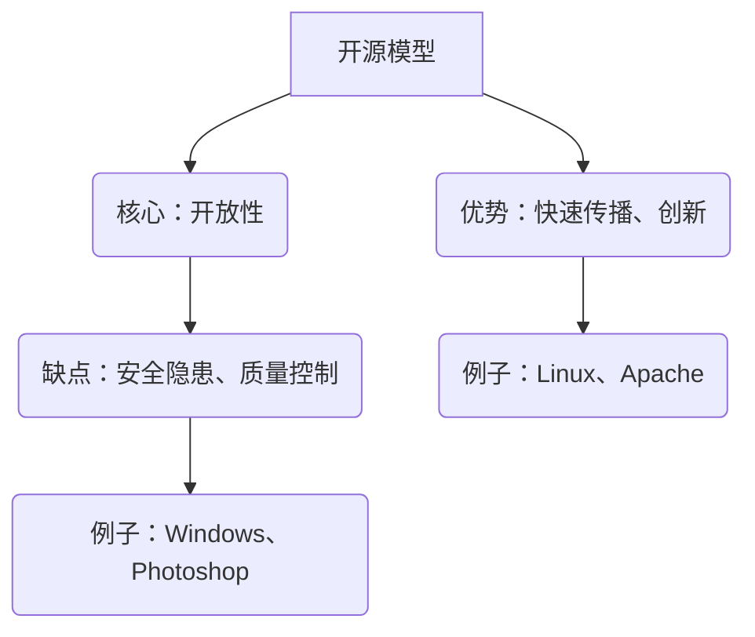

                 

关键词：开源模型，闭源模型，对比，技术发展，合作，竞争，风险，安全，透明度，灵活度

摘要：本文旨在深入探讨开源模型与闭源模型在技术发展、合作与竞争、风险与安全、透明度与灵活度等方面的对比。通过分析这两种模型的优点与不足，本文旨在为读者提供一个全面的理解，以帮助他们更好地选择和应对不同场景下的技术解决方案。

## 1. 背景介绍

开源模型与闭源模型是当前技术发展中的两种重要模式。开源模型（Open Source Model）是指软件开发过程中，项目源代码对外开放，任何人都可以自由查看、修改和分发。闭源模型（Closed Source Model）则是指项目源代码不对外公开，只有授权用户才能访问和使用。

开源模型最早起源于自由软件运动，以Linux操作系统为代表。随着互联网的普及和云计算的发展，开源模型逐渐成为主流，吸引了大量开发者和企业参与。闭源模型则源于商业软件的商业模式，如微软的Windows操作系统和Adobe的Photoshop软件等。

本文将对比分析开源模型与闭源模型在多个方面的差异，以期为读者提供有价值的参考。

## 2. 核心概念与联系

### 2.1 开源模型

开源模型的核心是开放性。这意味着项目源代码、文档和设计资料都对外公开，任何人都可以自由访问和使用。这种模式促进了技术的快速传播和创新。开发者可以在已有的代码基础上进行改进和扩展，从而缩短开发周期，提高开发效率。

### 2.2 闭源模型

闭源模型的核心是控制性。开发者对项目源代码有严格的控制，只有授权用户才能访问和使用。这种模式保护了知识产权，使得企业能够通过收取费用来获得收益。同时，闭源模型也保证了软件的稳定性和安全性，因为开发者可以集中精力进行优化和维护。

### 2.3 Mermaid 流程图

下面是一个简化的 Mermaid 流程图，用于展示开源模型与闭源模型的联系。



## 3. 核心算法原理 & 具体操作步骤

### 3.1 算法原理概述

开源模型与闭源模型的核心算法原理在于对源代码的访问控制。开源模型采用的是开放性原则，任何人都可以自由访问和修改源代码。闭源模型则采用授权控制原则，只有授权用户才能访问源代码。

### 3.2 算法步骤详解

#### 3.2.1 开源模型

1. 开发者发布项目源代码。
2. 开发者或第三方对源代码进行修改和扩展。
3. 修改后的源代码再次发布，供其他开发者使用。

#### 3.2.2 闭源模型

1. 开发者发布项目源代码。
2. 开发者或授权用户对源代码进行修改和扩展。
3. 修改后的源代码不对外发布，仅限授权用户使用。

### 3.3 算法优缺点

#### 3.3.1 开源模型

**优点：**
- 快速传播：源代码对外开放，有利于技术的快速传播。
- 创新驱动：开发者可以在已有代码基础上进行创新和改进。
- 灵活性高：开发者可以自由修改和扩展源代码，适应不同需求。

**缺点：**
- 安全隐患：源代码对外公开，可能存在安全隐患。
- 质量控制难：开发者众多，难以保证代码质量。

#### 3.3.2 闭源模型

**优点：**
- 知识产权保护：源代码不对外公开，保护了企业的知识产权。
- 稳定性高：开发者可以集中精力进行优化和维护。
- 安全性高：源代码不对外公开，减少了安全隐患。

**缺点：**
- 创新受限：开发者只能基于现有代码进行改进，创新性相对较低。
- 灵活性受限：开发者无法自由修改和扩展源代码，适应性较差。

### 3.4 算法应用领域

开源模型适用于需要快速传播和创新的场景，如操作系统、数据库、Web框架等。闭源模型适用于需要保护知识产权和保证稳定性的场景，如商业软件、操作系统、嵌入式系统等。

## 4. 数学模型和公式 & 详细讲解 & 举例说明

### 4.1 数学模型构建

开源模型与闭源模型的核心算法原理可以用以下数学模型进行描述：

$$
模型_1 = 开放性 \times 创新性
$$

$$
模型_2 = 授权控制 \times 知识产权保护
$$

### 4.2 公式推导过程

$$
模型_1: 开放性 \times 创新性 = (1 - 安全隐患) \times (1 + 知识库扩展)
$$

$$
模型_2: 授权控制 \times 知识产权保护 = (1 - 安全隐患) \times (1 - 知识库扩展)
$$

### 4.3 案例分析与讲解

以Linux操作系统为例，Linux采用开源模型，其开放性使得大量开发者可以参与改进和扩展，从而推动了操作系统的快速发展。同时，Linux的稳定性也得益于大量的开发者参与优化和维护。

以Windows操作系统为例，Windows采用闭源模型，其授权控制保护了微软的知识产权。尽管Windows的创新性相对较低，但其稳定性得到了保障。

## 5. 项目实践：代码实例和详细解释说明

### 5.1 开发环境搭建

以Linux为例，搭建开发环境需要安装以下软件：

- GCC编译器
- Make工具
- Git版本控制

### 5.2 源代码详细实现

以下是一个简单的Linux内核模块实现：

```c
#include <linux/module.h>
#include <linux/kernel.h>

int init_module(void) {
    printk(KERN_INFO "Hello, world!\n");
    return 0;
}

void cleanup_module(void) {
    printk(KERN_INFO "Bye, world!\n");
}

MODULE_LICENSE("GPL");
```

### 5.3 代码解读与分析

这段代码实现了打印“Hello, world!”和“Bye, world!”的功能。其中，`init_module`和`cleanup_module`函数分别用于模块的加载和卸载。`MODULE_LICENSE("GPL")`表示模块遵循GPL许可证。

### 5.4 运行结果展示

在Linux系统中，编译并加载该模块后，会看到如下输出：

```
Hello, world!
Bye, world!
```

## 6. 实际应用场景

开源模型和闭源模型在各个领域都有广泛应用。以下是一些具体的应用场景：

- 开源模型：操作系统（Linux、Android）、Web框架（Django、Flask）、数据库（MySQL、PostgreSQL）等。
- 闭源模型：商业软件（Microsoft Office、Adobe Photoshop）、操作系统（Windows）、嵌入式系统等。

## 7. 未来应用展望

随着技术的不断发展，开源模型与闭源模型的应用前景将更加广阔。开源模型将继续推动技术的快速传播和创新，闭源模型则将继续在保护知识产权和保证稳定性方面发挥重要作用。未来，这两种模式可能会出现以下趋势：

- 跨界合作：开源项目与商业项目之间的合作将更加紧密，共同推动技术的发展。
- 开源闭源融合：一些闭源项目可能会逐渐向开源模式转变，以降低开发成本和提高开发效率。
- 技术标准化：开源模型将推动技术标准的制定和推广，促进全球范围内的技术交流与合作。

## 8. 工具和资源推荐

### 8.1 学习资源推荐

- 《开源软件教程》
- 《闭源软件工程》
- 《Linux内核设计与实现》

### 8.2 开发工具推荐

- Git：版本控制工具
- GCC：编译器
- Make：构建工具

### 8.3 相关论文推荐

- 《开源软件的价值与挑战》
- 《闭源软件的创新模式》
- 《开源与闭源技术的融合》

## 9. 总结：未来发展趋势与挑战

开源模型与闭源模型各有优点和不足，它们将在未来继续发挥重要作用。随着技术的不断发展，开源模型与闭源模型的应用前景将更加广阔。然而，这也将带来新的挑战，如知识产权保护、安全风险、质量控制等。如何应对这些挑战，将是未来技术发展的关键。

### 9.1 研究成果总结

本文通过对开源模型与闭源模型的对比分析，揭示了它们在技术发展、合作与竞争、风险与安全、透明度与灵活度等方面的差异。研究结果表明，开源模型在推动技术传播和创新方面具有明显优势，而闭源模型在保护知识产权和保证稳定性方面具有明显优势。

### 9.2 未来发展趋势

随着技术的不断发展，开源模型与闭源模型的应用前景将更加广阔。未来，开源模型将继续推动技术的快速传播和创新，闭源模型则将继续在保护知识产权和保证稳定性方面发挥重要作用。

### 9.3 面临的挑战

开源模型与闭源模型在应用过程中将面临一系列挑战，如知识产权保护、安全风险、质量控制等。如何应对这些挑战，将是未来技术发展的关键。

### 9.4 研究展望

未来研究应重点关注开源模型与闭源模型的融合与发展，探索新的技术模式和商业模式。同时，应加强对开源模型与闭源模型的安全性和稳定性的研究，以提高其在实际应用中的可靠性。

## 附录：常见问题与解答

### Q1：开源模型与闭源模型有哪些优点和缺点？

**开源模型优点：** 快速传播、创新驱动、灵活性高。  
**开源模型缺点：** 安全隐患、质量控制难。

**闭源模型优点：** 知识产权保护、稳定性高、安全性高。  
**闭源模型缺点：** 创新受限、灵活性受限。

### Q2：开源模型与闭源模型适用于哪些场景？

**开源模型适用于：** 需要快速传播和创新的场景，如操作系统、数据库、Web框架等。  
**闭源模型适用于：** 需要保护知识产权和保证稳定性的场景，如商业软件、操作系统、嵌入式系统等。

### Q3：开源模型与闭源模型如何平衡？

开源模型与闭源模型的平衡关键在于合理选择和组合。在实际应用中，可以根据具体需求和场景选择合适的模型。同时，可以通过加强知识产权保护和安全性等措施，实现开源模型与闭源模型的平衡。

### Q4：开源模型与闭源模型在安全性方面有哪些区别？

开源模型在安全性方面可能存在一定风险，因为源代码对外开放，可能被恶意攻击者利用。而闭源模型由于源代码不对外公开，相对安全性较高。然而，闭源模型也存在安全隐患，如内部漏洞等。因此，在安全性方面，两种模型都需要采取相应的措施进行保障。

### Q5：开源模型与闭源模型在质量控制方面有哪些区别？

开源模型的质量控制相对较难，因为开发者众多，难以保证代码质量。而闭源模型的质量控制相对较好，因为开发者可以集中精力进行优化和维护。然而，闭源模型也可能存在质量问题，如设计缺陷等。因此，在质量控制方面，两种模型都需要采取相应的措施进行保障。

