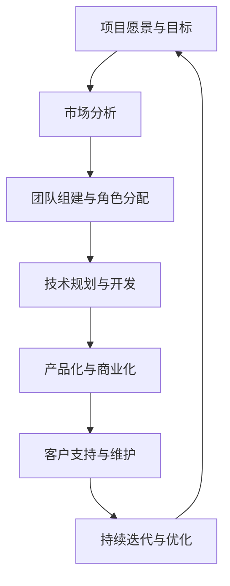

                 

在当今快速发展的技术领域，开源项目已经成为推动创新和协作的重要力量。然而，要成功地将一个开源项目商业化，不仅需要高质量的代码，还需要一个高效、协作的团队。本文将探讨如何构建一个能够将开源项目商业化的团队，包括团队成员的角色和职责。

## 1. 背景介绍

开源项目的商业化并不是一个简单的任务。它需要将社区支持的、自由贡献的代码转变为一个盈利的模式。这涉及到多个方面的考量，包括市场定位、商业模型、法律合规、用户体验和持续的技术支持。

### 1.1 开源项目的特点

开源项目通常具有以下特点：
- **自由贡献**：任何人都可以自由地贡献代码、报告问题和提出改进建议。
- **社区驱动**：项目的进展通常由一个活跃的社区来推动。
- **透明的开发过程**：所有开发活动都在公共平台上进行，包括代码审查、讨论和决策。

### 1.2 商业化的挑战

将开源项目商业化面临以下挑战：
- **信任与信任**：商业化和开源精神的兼容性可能引发社区的担忧。
- **财务可持续性**：如何确保项目的财务健康，使商业化活动不会损害开源社区的贡献者。
- **市场定位**：如何识别并满足商业客户的需求，同时保持项目对开源社区的吸引力。

## 2. 核心概念与联系

为了更好地理解如何构建一个商业化团队，我们首先需要明确几个核心概念，并展示它们之间的联系。以下是使用Mermaid绘制的流程图，展示了商业团队构建的核心节点。



### 2.1 项目愿景与目标

项目愿景与目标是团队构建的基础。它定义了项目的长期目标和方向，为所有团队成员提供了共同的目标和愿景。

### 2.2 市场分析

市场分析是理解客户需求和竞争环境的关键步骤。通过市场分析，团队可以识别出潜在的商业机会和风险。

### 2.3 团队组建与角色分配

团队组建与角色分配是根据项目的需求和愿景来确定的。每个角色都有特定的职责，以确保项目的顺利进行。

### 2.4 技术规划与开发

技术规划与开发是项目成功的关键。它包括确定技术路线图、技术栈选择和开发流程的制定。

### 2.5 产品化与商业化

产品化与商业化是将技术转化为商业成果的过程。这涉及到产品的设计、定价和营销策略。

### 2.6 客户支持与维护

客户支持与维护是保持客户满意度的关键。它包括提供技术支持、维护服务和持续改进。

### 2.7 持续迭代与优化

持续迭代与优化是确保项目长期成功的关键。它涉及到收集用户反馈、分析数据并不断改进产品。

## 3. 核心算法原理 & 具体操作步骤

虽然商业化团队构建不直接依赖于算法，但了解项目的技术原理对于构建高效团队至关重要。以下是一个简化版的算法原理概述和具体操作步骤：

### 3.1 算法原理概述

商业化团队构建的算法可以概述为以下几个步骤：

1. **需求分析**：理解项目的市场需求和用户需求。
2. **资源评估**：评估团队和资源的可用性。
3. **规划与执行**：制定详细的计划并执行。
4. **监控与调整**：监控项目进度并进行必要的调整。

### 3.2 算法步骤详解

1. **需求分析**：
   - **市场调研**：了解目标市场的需求和趋势。
   - **用户调研**：收集用户的反馈和需求。
   - **需求整理**：将调研结果整理成明确的用户故事和功能需求。

2. **资源评估**：
   - **人力资源**：评估团队成员的专业技能和经验。
   - **技术资源**：评估现有技术栈和工具的适用性。
   - **财务资源**：评估项目的预算和财务状况。

3. **规划与执行**：
   - **制定计划**：根据需求和资源制定详细的计划。
   - **执行计划**：按照计划进行开发和商业化活动。
   - **进度监控**：定期检查项目进度并确保按计划进行。

4. **监控与调整**：
   - **收集反馈**：收集用户和团队的意见和反馈。
   - **数据分析**：分析项目数据，包括用户数据、财务数据和技术数据。
   - **调整策略**：根据反馈和数据调整项目计划和策略。

### 3.3 算法优缺点

**优点**：
- **灵活性**：算法可以根据实时反馈进行调整。
- **适应性**：可以适应不同的市场和用户需求。

**缺点**：
- **复杂性**：算法涉及到多个环节，实施和管理较为复杂。
- **风险**：如果市场需求发生变化，算法可能需要重新调整。

### 3.4 算法应用领域

商业化团队构建算法可以应用于各种开源项目的商业化过程中，尤其是那些需要大规模团队协作和市场定位的项目。

## 4. 数学模型和公式 & 详细讲解 & 举例说明

虽然商业化团队构建不是纯粹的数学问题，但了解一些基本的数学模型和公式可以帮助团队更好地理解和处理项目中的问题。

### 4.1 数学模型构建

一个基本的数学模型可以是项目的风险评估模型。这个模型可以使用以下公式来表示：

$$
R = p \times L
$$

其中，\( R \) 表示风险值，\( p \) 表示项目失败的概率，\( L \) 表示项目失败造成的损失。

### 4.2 公式推导过程

为了推导这个公式，我们需要考虑以下两个因素：

1. **项目失败的概率**：这个因素取决于项目的复杂度、团队成员的能力和市场需求的不确定性。
2. **项目失败造成的损失**：这个因素取决于项目的预算、时间投入和潜在的商机。

### 4.3 案例分析与讲解

假设我们有一个开源项目，预计失败的概率为20%，如果项目失败，将损失100万美元。根据公式，我们可以计算出项目的风险值为：

$$
R = 0.20 \times 1000000 = 200000
$$

这意味着项目存在20万美元的风险。

### 4.4 应用举例

如果一个团队决定增加预算和资源投入，以降低失败的概率，他们可以重新计算风险值。假设通过增加资源投入，项目失败的概率降低到10%，那么新的风险值为：

$$
R = 0.10 \times 1000000 = 100000
$$

这表明通过增加资源投入，团队成功地降低了项目的风险值。

## 5. 项目实践：代码实例和详细解释说明

为了更好地理解商业化团队构建的实践，我们来看一个具体的代码实例。这个实例展示了如何使用Python编写一个简单的项目规划工具。

### 5.1 开发环境搭建

首先，我们需要安装Python和相关的库。假设我们使用Python 3.8及以上版本，我们可以通过以下命令安装所需的库：

```bash
pip install matplotlib pandas
```

### 5.2 源代码详细实现

下面是一个简单的项目规划工具的代码示例：

```python
import pandas as pd
import matplotlib.pyplot as plt

# 项目的需求列表
requirements = {
    '需求1': 50,
    '需求2': 100,
    '需求3': 150,
    '需求4': 200
}

# 成员的技能列表
skills = {
    '成员A': ['需求1', '需求2'],
    '成员B': ['需求3', '需求4'],
    '成员C': ['需求1', '需求3']
}

# 成员的工作量评估
effort = {
    '成员A': {'需求1': 10, '需求2': 20},
    '成员B': {'需求3': 15, '需求4': 25},
    '成员C': {'需求1': 8, '需求3': 12}
}

# 计算每个成员的工作量
workload = {}
for member, assigned_tasks in skills.items():
    total_effort = 0
    for task in assigned_tasks:
        total_effort += effort[member][task]
    workload[member] = total_effort

# 打印成员的工作量
for member, load in workload.items():
    print(f"{member} 的总工作量：{load}")

# 绘制工作量分布图
data = pd.DataFrame(list(workload.items()), columns=['成员', '工作量'])
data.sort_values(by='工作量', ascending=False, inplace=True)
data.plot(kind='barh', figsize=(10, 6))
plt.title('成员工作量分布')
plt.xlabel('工作量')
plt.ylabel('成员')
plt.show()
```

### 5.3 代码解读与分析

这个代码示例首先定义了项目的需求列表、成员的技能列表和成员的工作量评估。然后，它计算每个成员的总工作量，并打印出来。最后，它使用 matplotlib 库绘制了一个条形图，展示了每个成员的工作量分布。

### 5.4 运行结果展示

运行上述代码后，我们会看到一个条形图，展示了每个成员的工作量。这个可视化工具可以帮助团队管理者更好地了解团队成员的工作分配和负载情况，从而做出更合理的资源分配决策。

## 6. 实际应用场景

商业化团队构建的应用场景非常广泛，以下是一些典型的应用场景：

### 6.1 开源软件商业化

开源软件是一个典型的应用场景。例如，一个开源数据库项目可以通过提供付费的商业支持、定制开发和服务来商业化。

### 6.2 开源硬件商业化

开源硬件项目，如Arduino或Raspberry Pi，可以通过提供配件、定制硬件解决方案和商业支持来商业化。

### 6.3 开源平台商业化

开源平台，如GitHub或Bitbucket，可以通过提供增值服务、企业版和付费会员来商业化。

### 6.4 开源教育项目商业化

开源教育项目，如Khan Academy或Coursera，可以通过提供付费课程、认证和定制解决方案来商业化。

## 7. 工具和资源推荐

### 7.1 学习资源推荐

- 《开源之道》 - 介绍开源运动的起源、文化和实践。
- 《项目管理知识体系指南》（PMBOK指南） - 提供项目管理的基础知识和最佳实践。
- 《敏捷软件开发：原则、实践与模式》 - 介绍敏捷开发的方法和工具。

### 7.2 开发工具推荐

- Git - 版本控制系统，用于代码管理。
- GitHub或GitLab - 用于开源项目的托管和协作。
- JIRA或Trello - 项目管理工具，用于任务跟踪和进度管理。
- Jenkins或Travis CI - 持续集成工具，用于自动化构建和测试。

### 7.3 相关论文推荐

- "Open Source Software Development: A Survey" - 对开源软件开发的研究进行综述。
- "The Economics of Open Source" - 探讨开源软件的商业模型和财务可持续性。
- "The Cathedral and the Bazaar" - Eric S. Raymond关于开源运动的重要论文。

## 8. 总结：未来发展趋势与挑战

### 8.1 研究成果总结

随着技术的不断进步和开源生态的日益成熟，开源项目的商业化已经成为一个重要的趋势。研究成果表明，通过有效的团队构建和市场定位，开源项目可以实现商业化和财务健康。

### 8.2 未来发展趋势

未来，开源项目的商业化将继续发展，特别是在以下几个方面：
- **服务化**：越来越多的开源项目将提供付费服务，如商业支持和定制开发。
- **平台化**：开源平台将提供更多的增值服务和商业机会。
- **国际化**：开源项目的商业化将更加国际化，吸引全球客户和投资者。

### 8.3 面临的挑战

尽管前景乐观，但开源项目商业化仍面临一些挑战：
- **信任与透明度**：商业化和开源精神的兼容性仍是一个难题。
- **市场竞争**：开源项目需要应对来自商业竞争对手的压力。
- **持续创新**：开源项目需要不断创新以保持竞争力。

### 8.4 研究展望

未来的研究应重点关注以下几个方面：
- **商业模式创新**：探索更多可行的商业模式以支持开源项目的商业化。
- **社区参与**：如何更好地激励和整合社区参与，以促进项目的持续发展。
- **法律合规**：研究如何确保开源项目的商业活动符合相关法律法规。

## 9. 附录：常见问题与解答

### 9.1 开源项目如何确保财务健康？

确保财务健康的方法包括：
- **提供增值服务**：如商业支持、定制开发和技术培训。
- **收费模式创新**：如订阅制、付费插件和定制服务。
- **持续投资**：确保有足够的资金用于项目维护和创新。

### 9.2 如何平衡开源与商业化？

平衡开源与商业化的关键在于：
- **透明沟通**：与社区保持透明和开放的沟通。
- **尊重贡献者**：确保商业活动不会损害贡献者的利益。
- **独立管理**：商业活动与开源社区管理应分开，确保两者独立运行。

### 9.3 开源项目的商业化是否会损害社区？

适当的商业活动可以促进开源项目的发展，但如果处理不当，可能会损害社区。关键在于：
- **尊重开源精神**：确保商业活动符合开源的价值观。
- **公平报酬**：为贡献者提供公平的报酬和权益。
- **持续贡献**：确保商业活动不会减少对开源项目的贡献。

作者：禅与计算机程序设计艺术 / Zen and the Art of Computer Programming
----------------------------------------------------------------

以上内容是一个完整的文章框架，包含了文章的各个部分和核心内容。你可以根据这个框架来撰写详细的文章内容。请注意，这个框架是基于给出的约束条件撰写的，确保在撰写文章时遵循所有的要求。

