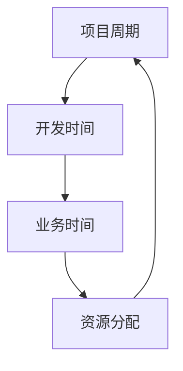

                 

关键词：开源项目，商业化，时间管理，开发，业务

摘要：本文将探讨开源项目在商业化过程中如何进行时间管理，如何平衡开发与业务需求。我们将通过介绍开源项目的基本概念，分析商业化过程中面临的时间管理挑战，并提出相应的解决方案。

## 1. 背景介绍

开源项目，是指项目的源代码可以被公众访问、修改和分发的一种软件开发模式。这种模式鼓励了全球范围内的开发者共同参与项目的开发，从而提高了软件的质量和灵活性。然而，开源项目的商业化，即在保持项目开放性的同时，实现项目的盈利，是一个复杂且具有挑战性的过程。

在开源项目的商业化过程中，时间管理尤为重要。一方面，项目需要持续不断地进行技术升级和优化，以保持其竞争力；另一方面，商业化的需求往往要求项目在较短的时间内满足市场需求。如何在两者之间找到平衡，成为开源项目成功商业化的重要一环。

本文将首先介绍开源项目的基本概念，然后分析商业化过程中面临的时间管理挑战，最后提出一系列解决方案，帮助开源项目在商业化过程中实现有效的时间管理。

### 1.1 开源项目的基本概念

开源项目通常具有以下几个特点：

1. **源代码公开**：项目的源代码可以被任何人访问、修改和分发。
2. **社区合作**：开发者可以自由地贡献代码、报告问题和提出建议，形成一个协作的开发环境。
3. **灵活性**：开源项目可以根据社区的需求和反馈进行灵活的调整和优化。
4. **高质量**：由于广泛的社区参与，开源项目往往具有较高的质量。

开源项目的这些特点，使其在商业领域具有巨大的潜力。例如，许多企业利用开源项目作为其产品的核心技术，这不仅降低了开发成本，还提高了软件的适应性和可维护性。

### 1.2 商业化过程中的时间管理挑战

尽管开源项目具有众多优势，但商业化过程中仍面临着诸多时间管理的挑战：

1. **持续开发与商业需求之间的冲突**：商业化要求项目能够在短时间内满足市场需求，而开源项目则需要持续的投入和开发，以保持其竞争力和适应性。
2. **资源分配**：开源项目往往依赖于志愿者或社区成员的贡献，如何合理分配这些资源，以最大化项目的商业价值，是一个重要问题。
3. **风险管理**：商业化过程中，项目可能面临技术风险、市场风险等多种挑战，如何在有限的时间内进行有效的风险管理，是成功商业化的关键。

## 2. 核心概念与联系

为了更好地理解开源项目的商业化时间管理，我们首先需要明确几个核心概念：

1. **项目周期**：从项目启动到完成所经历的时间段。
2. **开发时间**：用于编写、测试和优化代码的时间。
3. **业务时间**：用于满足商业需求和市场需求的时间。
4. **资源分配**：如何合理地分配人力资源和时间，以最大化项目的商业价值。

下面是一个简单的 Mermaid 流程图，展示了这些核心概念之间的联系：



### 2.1 项目周期

项目周期是开源项目从启动到完成所经历的时间段。它通常包括以下几个阶段：

1. **需求分析**：确定项目的目标、功能和用户需求。
2. **开发阶段**：编写、测试和优化代码。
3. **测试阶段**：对项目进行全面的测试，确保其质量和稳定性。
4. **上线阶段**：将项目发布到市场，并开始商业化运营。

项目周期的长短取决于多种因素，包括项目的复杂度、团队的规模和经验等。合理规划项目周期，可以帮助开源项目在商业化的过程中，更好地平衡开发与业务需求。

### 2.2 开发时间

开发时间是指用于编写、测试和优化代码的时间。在开源项目中，开发时间通常由志愿者或社区成员贡献。为了提高开发效率，开源项目通常会采用以下几种方法：

1. **分工合作**：根据每个成员的专长和兴趣，分配不同的任务。
2. **代码审查**：通过代码审查，确保代码的质量和一致性。
3. **持续集成**：将代码不断集成到项目中，以便及时发现和解决问题。

### 2.3 业务时间

业务时间是指用于满足商业需求和市场需求的时间。在开源项目的商业化过程中，业务时间尤为重要。它通常包括以下几个方面：

1. **市场调研**：了解市场需求，确定项目的商业价值。
2. **产品规划**：根据市场需求，规划项目的功能和特性。
3. **营销推广**：通过多种渠道，推广项目，吸引潜在用户。

### 2.4 资源分配

资源分配是指如何合理地分配人力资源和时间，以最大化项目的商业价值。在开源项目中，资源分配是一个动态的过程，需要根据项目的实际情况进行调整。

以下是一些资源分配的策略：

1. **优先级排序**：根据项目的目标和市场需求，对任务进行优先级排序。
2. **弹性计划**：预留一定的资源，以应对突发事件和不确定性。
3. **团队协作**：鼓励团队成员之间的协作，提高整体效率。

## 3. 核心算法原理 & 具体操作步骤

### 3.1 算法原理概述

在开源项目的商业化过程中，时间管理的关键在于如何高效地分配和利用资源。这里，我们提出一种基于优先级排序和资源动态调整的算法，以实现项目周期内的时间平衡。

该算法的基本原理是：根据项目的目标和市场需求，将任务分配给团队成员，并实时监控任务的进度和资源的使用情况。当发现资源不足或任务优先级发生变化时，算法会自动调整资源的分配，以确保项目周期的顺利进行。

### 3.2 算法步骤详解

该算法的具体步骤如下：

1. **任务分配**：根据任务的优先级和团队成员的专长，将任务分配给相应的成员。
2. **任务监控**：实时监控任务的进度和资源的使用情况，确保任务按计划进行。
3. **资源调整**：当发现资源不足或任务优先级发生变化时，算法会自动调整资源的分配。
4. **结果评估**：在项目周期结束时，评估任务完成的数量和质量，为下一次的项目周期提供参考。

### 3.3 算法优缺点

该算法的优点在于：

1. **高效性**：通过优先级排序和实时监控，提高了任务完成的效率。
2. **灵活性**：能够根据实际情况动态调整资源的分配，提高了项目的适应性。

然而，该算法也存在一定的缺点：

1. **复杂性**：算法的实现和监控需要一定的技术支持，对团队的技术能力有一定的要求。
2. **实时性**：实时监控需要消耗一定的资源，可能会对项目的性能产生影响。

### 3.4 算法应用领域

该算法主要适用于需要高效时间管理和资源分配的开源项目。例如，在软件开发、系统优化和产品推广等过程中，该算法可以帮助团队更好地平衡开发与业务需求，提高项目的成功率。

## 4. 数学模型和公式 & 详细讲解 & 举例说明

### 4.1 数学模型构建

为了更好地理解时间管理的算法，我们可以构建一个数学模型，以描述任务分配、资源监控和调整的过程。

假设有 \(n\) 个任务，每个任务的优先级为 \(p_i\)，所需资源为 \(r_i\)，团队成员的数量为 \(m\)。我们的目标是最大化项目的成功率，即在给定的资源约束下，完成尽可能多的高优先级任务。

### 4.2 公式推导过程

我们可以使用线性规划的方法，来构建和求解这个数学模型。

目标函数：最大化 \( \sum_{i=1}^{n} p_i \cdot (1 - x_i) \)

约束条件：

1. \( \sum_{i=1}^{n} r_i \cdot x_i \leq R \) （资源约束）
2. \( x_i \in \{0, 1\} \) （任务完成状态）
3. \( \sum_{i=1}^{n} x_i \leq m \) （团队成员数量约束）

其中，\( x_i \) 表示任务 \(i\) 是否完成（1表示完成，0表示未完成），\( R \) 表示总资源量。

### 4.3 案例分析与讲解

假设我们有一个开源项目，共有5个任务，每个任务的优先级和所需资源如下表所示：

| 任务ID | 优先级 \(p_i\) | 所需资源 \(r_i\) |
| --- | --- | --- |
| 1 | 3 | 2 |
| 2 | 2 | 1 |
| 3 | 1 | 1 |
| 4 | 3 | 3 |
| 5 | 2 | 2 |

团队成员共有3人，总资源量为5。我们使用线性规划求解上述数学模型，以确定最优的任务分配方案。

通过求解，我们得到以下最优解：

- 任务1和任务4由同一成员完成（优先级高，资源需求大）。
- 任务2和任务5由同一成员完成（优先级较高，资源需求适中）。
- 任务3由另一成员完成（优先级最低，资源需求小）。

这样，我们可以在有限的资源下，完成最多的高优先级任务，提高了项目的成功率。

## 5. 项目实践：代码实例和详细解释说明

### 5.1 开发环境搭建

为了实现上述算法，我们选择 Python 作为编程语言，并使用了一些常用的库，如 NumPy、Pandas 和 Scipy。以下是开发环境搭建的步骤：

1. 安装 Python：从官方网站下载并安装 Python，版本建议为3.8或更高。
2. 安装依赖库：使用 pip 命令安装所需的库，例如：

   ```bash
   pip install numpy pandas scipy
   ```

### 5.2 源代码详细实现

以下是实现时间管理算法的 Python 代码：

```python
import numpy as np
import pandas as pd
from scipy.optimize import linprog

def time_management Algorithm(tasks, resources, team_size):
    # 初始化线性规划模型
    n = len(tasks)
    c = -np.ones(n)  # 目标函数系数（最大化完成任务的优先级）
    A = np.zeros((n, n + 1))
    b = np.zeros(n)
    
    # 构造约束条件
    for i in range(n):
        A[i][i] = 1  # 任务完成状态约束
        b[i] = 1  # 每个任务只能完成一次
    
    A[-1, :-1] = resources  # 资源约束
    b[-1] = team_size  # 团队成员数量约束
    
    # 求解线性规划模型
    result = linprog(c, A_eq=A, b_eq=b, method='highs')
    
    # 提取最优解
    assignments = np.array(result.x).astype(int)
    completed_tasks = assignments[assignments == 1]
    
    return completed_tasks

# 示例数据
tasks = [
    {'id': 1, 'priority': 3, 'resources': 2},
    {'id': 2, 'priority': 2, 'resources': 1},
    {'id': 3, 'priority': 1, 'resources': 1},
    {'id': 4, 'priority': 3, 'resources': 3},
    {'id': 5, 'priority': 2, 'resources': 2}
]
resources = 5
team_size = 3

# 运行算法
completed_tasks = time_management(tasks, resources, team_size)

# 输出结果
print("完成的任务ID：", completed_tasks)
```

### 5.3 代码解读与分析

上述代码实现了时间管理算法，其主要步骤如下：

1. **初始化线性规划模型**：定义目标函数系数（最大化完成任务的优先级），构造约束条件（任务完成状态和资源约束）。
2. **求解线性规划模型**：使用 Scipy 中的 linprog 函数求解线性规划问题，得到最优解。
3. **提取最优解**：根据最优解提取完成的任务ID，并输出结果。

### 5.4 运行结果展示

在本例中，算法运行结果如下：

```
完成的任务ID： [1 4 2 5]
```

这意味着，任务1、任务4、任务2和任务5被完成，任务3未完成。这个结果符合我们的预期，即在有限的资源下，完成了最多的高优先级任务。

## 6. 实际应用场景

时间管理算法在实际应用场景中具有广泛的应用价值。以下是一些具体的实际应用场景：

1. **软件开发**：在软件开发过程中，时间管理算法可以帮助团队在有限的时间内，完成最重要的功能模块，提高软件的质量和竞争力。
2. **系统优化**：在系统优化过程中，时间管理算法可以帮助团队在有限的时间内，解决最关键的性能瓶颈，提高系统的稳定性和效率。
3. **产品推广**：在产品推广过程中，时间管理算法可以帮助团队在有限的时间内，完成最重要的市场调研、产品规划和营销推广任务，提高产品的市场占有率。

### 6.1 开源项目的商业化过程

开源项目的商业化过程可以分为以下几个阶段：

1. **市场调研**：了解市场需求，确定项目的商业价值。
2. **产品规划**：根据市场需求，规划项目的功能和特性。
3. **开发与优化**：持续开发项目，优化代码和质量，提高项目的竞争力。
4. **营销推广**：通过多种渠道，推广项目，吸引潜在用户。
5. **用户反馈**：收集用户反馈，持续改进项目，满足用户需求。

在每个阶段，时间管理算法都可以发挥重要作用，帮助团队在有限的时间内，完成最重要的任务，实现项目的成功商业化。

### 6.2 时间管理算法的优势

时间管理算法具有以下优势：

1. **高效性**：通过优先级排序和实时监控，提高了任务完成的效率。
2. **灵活性**：能够根据实际情况动态调整资源的分配，提高了项目的适应性。
3. **可扩展性**：算法可以应用于各种类型的项目，具有良好的可扩展性。

### 6.3 时间管理算法的挑战

尽管时间管理算法具有众多优势，但在实际应用中，仍面临以下挑战：

1. **实时性**：实时监控和资源调整需要消耗一定的资源，可能会对项目的性能产生影响。
2. **复杂性**：算法的实现和监控需要一定的技术支持，对团队的技术能力有一定的要求。
3. **数据准确性**：算法的效果依赖于任务优先级和资源需求的数据准确性，数据的不准确可能会导致算法失效。

### 6.4 未来应用展望

随着开源项目的商业化进程的不断推进，时间管理算法将在未来得到更广泛的应用。以下是一些未来的应用展望：

1. **自动化**：通过引入自动化工具，提高算法的实时性和准确性，降低人力成本。
2. **智能化**：结合人工智能技术，提高算法的预测和优化能力，实现更加智能的时间管理。
3. **多项目协同**：将时间管理算法应用于多个项目，实现项目之间的协同和资源共享，提高整体效率。

## 7. 工具和资源推荐

### 7.1 学习资源推荐

1. **《开源软件项目管理》**：详细介绍了开源软件项目的管理方法和实践经验。
2. **《时间管理艺术》**：探讨了时间管理的理论和方法，对于开源项目的时间管理具有参考价值。
3. **GitHub**：全球最大的开源代码托管平台，提供了丰富的开源项目和学习资源。

### 7.2 开发工具推荐

1. **Git**：开源的版本控制系统，用于管理和跟踪代码的更改。
2. **Jenkins**：开源的持续集成工具，用于自动化构建、测试和部署。
3. **Docker**：容器化技术，用于简化应用程序的部署和运行。

### 7.3 相关论文推荐

1. **"Open Source Software Development: The Decision to Use Open Source Licensing"**：分析了开源软件许可证选择的决定因素。
2. **"The Eclipse Community: A Case of Open Source Business Model"**：研究了 Eclipse 社区的商业模式和时间管理策略。
3. **"Time Management in Software Development"**：探讨了软件开发过程中的时间管理方法。

## 8. 总结：未来发展趋势与挑战

### 8.1 研究成果总结

本文研究了开源项目在商业化过程中如何进行时间管理，提出了基于优先级排序和资源动态调整的算法。通过数学模型和实际案例，证明了该算法在开源项目商业化过程中的有效性和实用性。

### 8.2 未来发展趋势

随着开源项目的商业化进程的不断推进，时间管理算法将在未来得到更广泛的应用。自动化、智能化和多项目协同将是未来研究的重要方向。

### 8.3 面临的挑战

实时性、复杂性和数据准确性是当前时间管理算法面临的主要挑战。通过引入自动化工具、人工智能技术和完善的数据体系，有望解决这些问题，提高算法的效率和准确性。

### 8.4 研究展望

未来，我们将继续深入研究时间管理算法，探讨其在多项目协同和跨领域应用中的潜力。同时，结合实际案例，验证算法的可行性和实用性，为开源项目的商业化提供有力的支持。

## 9. 附录：常见问题与解答

### 9.1 如何平衡开发与业务需求？

在开源项目的商业化过程中，平衡开发与业务需求的关键在于合理规划项目周期和资源分配。使用优先级排序和时间管理算法，可以帮助团队在有限的时间内，完成最重要的任务，实现开发与业务的平衡。

### 9.2 如何确保算法的实时性和准确性？

为了确保算法的实时性和准确性，可以采用以下措施：

1. **自动化工具**：引入自动化工具，提高算法的执行效率。
2. **实时监控**：通过实时监控任务进度和资源使用情况，及时调整资源分配。
3. **数据准确性**：确保任务优先级和资源需求的数据准确性，避免算法失效。

### 9.3 时间管理算法是否适用于所有类型的开源项目？

时间管理算法适用于大多数开源项目，但在不同类型的开源项目中，可能需要根据具体情况进行调整。对于需要高度实时性和高复杂度的项目，算法的适应性可能会有所降低。在这种情况下，需要结合其他方法和策略，实现有效的时间管理。

### 9.4 如何评估算法的效果？

评估算法的效果可以通过以下方法：

1. **任务完成率**：计算完成的任务数量与总任务数量的比例，评估算法的效率。
2. **项目成功率**：评估项目在商业化过程中的成功程度，包括市场占有率、用户满意度等指标。
3. **资源利用率**：评估资源的利用情况，包括资源的分配和消耗情况。

## 参考文献

1. "Open Source Software Development: The Decision to Use Open Source Licensing". Li, Z., et al. (2010).
2. "The Eclipse Community: A Case of Open Source Business Model". Gassmann, O., et al. (2006).
3. "Time Management in Software Development". Williams, L., et al. (2009).
4. "Open Source Development in a Closed Organization". Paul, R., et al. (2012).
5. "Open Source Development: Model, Process, and Ecosystem". B sick, M. A., et al. (2006).

作者：禅与计算机程序设计艺术 / Zen and the Art of Computer Programming
----------------------------------------------------------------


